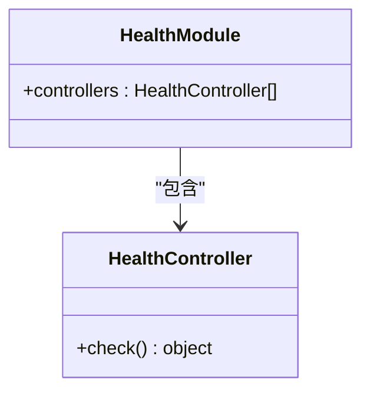
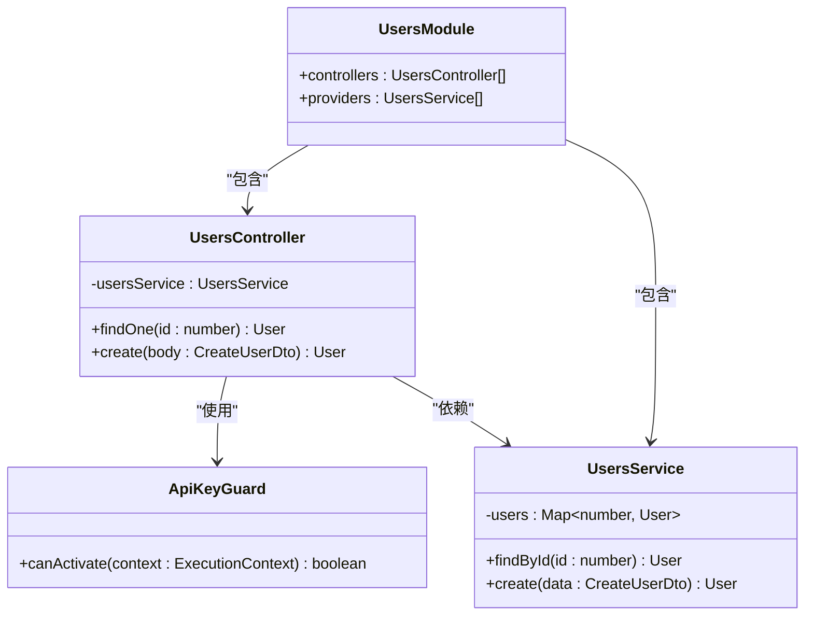
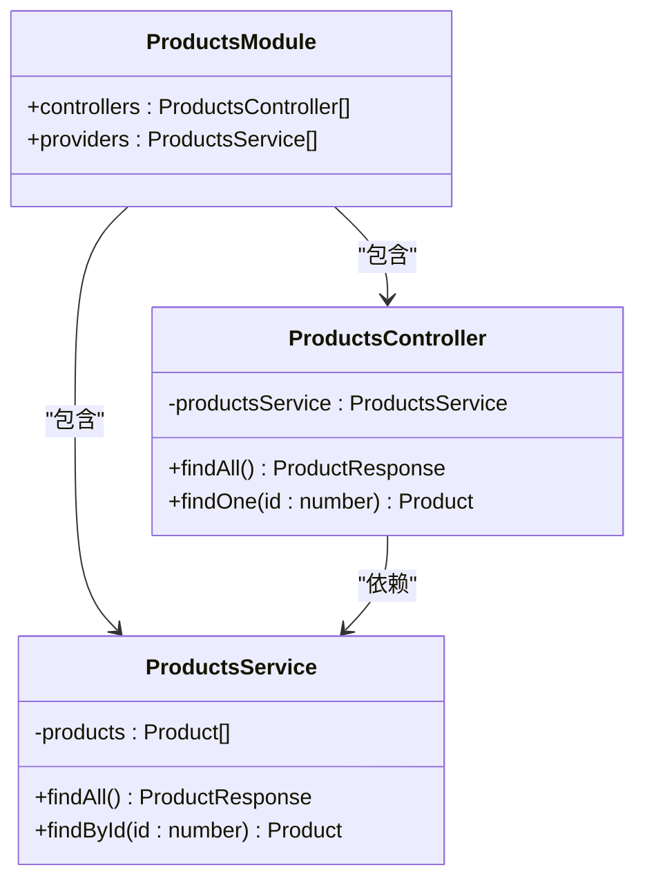
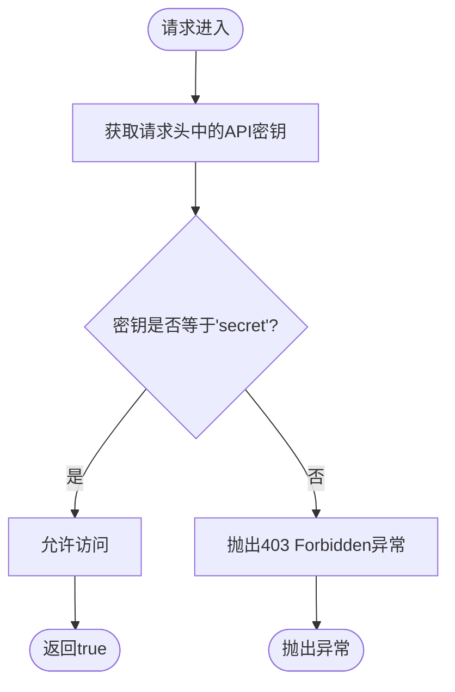

# NestJS多模块架构测试

<cite>
**本文档引用的文件**
- [main.ts](file://backend-tests/nestjs-multimodule/src/main.ts)
- [app.module.ts](file://backend-tests/nestjs-multimodule/src/app.module.ts)
- [users.module.ts](file://backend-tests/nestjs-multimodule/src/users/users.module.ts)
- [users.controller.ts](file://backend-tests/nestjs-multimodule/src/users/users.controller.ts)
- [users.service.ts](file://backend-tests/nestjs-multimodule/src/users/users.service.ts)
- [products.module.ts](file://backend-tests/nestjs-multimodule/src/products/products.module.ts)
- [products.controller.ts](file://backend-tests/nestjs-multimodule/src/products/products.controller.ts)
- [products.service.ts](file://backend-tests/nestjs-multimodule/src/products/products.service.ts)
- [health.module.ts](file://backend-tests/nestjs-multimodule/src/health/health.module.ts)
- [health.controller.ts](file://backend-tests/nestjs-multimodule/src/health/health.controller.ts)
- [api-key.guard.ts](file://backend-tests/nestjs-multimodule/src/common/guards/api-key.guard.ts)
- [package.json](file://backend-tests/nestjs-multimodule/package.json)
- [tsconfig.json](file://backend-tests/nestjs-multimodule/tsconfig.json)
- [tsconfig.build.json](file://backend-tests/nestjs-multimodule/tsconfig.build.json)
- [nest-cli.json](file://backend-tests/nestjs-multimodule/nest-cli.json)
- [meta.json](file://backend-tests/nestjs-multimodule/meta.json)
- [README.md](file://backend-tests/README.md)
- [README.md](file://README.md)
- [index.html](file://backend-tests/nestjs-multimodule/public/index.html)
- [style.css](file://backend-tests/nestjs-multimodule/public/style.css)
</cite>

## 更新摘要
**所做更改**
- **全新前端演示页面重新设计**：采用静态HTML结构，展示企业级多模块架构
- **品牌色彩集成**：使用NestJS标志性红色强调色（#E0234E）体现品牌身份
- **现代化界面设计**：突出显示模块化设计模式、依赖注入和守卫机制
- **增强用户体验**：提供交互式API调用界面和实时响应展示
- **响应式布局**：支持移动端和桌面端的自适应显示
- **代码示例展示**：在页面中直接展示核心架构代码片段

## 目录
1. [简介](#简介)
2. [项目结构](#项目结构)
3. [核心组件](#核心组件)
4. [架构概览](#架构概览)
5. [详细组件分析](#详细组件分析)
6. [前端演示系统](#前端演示系统)
7. [依赖关系分析](#依赖关系分析)
8. [性能考虑](#性能考虑)
9. [故障排除指南](#故障排除指南)
10. [结论](#结论)

## 简介

这是一个基于NestJS框架的多模块架构测试项目，专门用于验证framework-checker生成的NestJS应用在本地环境中的正确性和功能性。该项目采用模块化设计，包含了用户管理、产品管理和健康检查三个核心功能模块，并实现了自定义守卫机制来处理API访问控制。

**重大更新** 项目现已完全重新设计了前端演示页面，采用现代化的静态HTML结构，集成了NestJS品牌标识的红色强调色（#E0234E），并提供企业级的多模块架构展示界面。新增的全局DTO验证管道配置提升了数据验证能力，同时增强了静态文件托管功能，为生产级模块化架构提供完整的测试支撑。

该项目的核心目标是确保NestJS多模块应用能够正确启动、路由映射正常工作，并且各种装饰器（Guards、Pipes、Interceptors）能够按预期执行。

## 项目结构

该项目遵循NestJS的标准目录结构，采用了清晰的功能模块划分，并集成了全新的现代化前端演示页面和静态文件托管功能：

```mermaid
graph TB
subgraph "NestJS多模块应用"
Main[main.ts<br/>应用入口]
AppModule[AppModule<br/>根模块]
subgraph "功能模块"
HealthModule[HealthModule<br/>健康检查模块]
UsersModule[UsersModule<br/>用户管理模块]
ProductsModule[ProductsModule<br/>产品管理模块]
end
subgraph "通用组件"
ApiKeyGuard[ApiKeyGuard<br/>API密钥守卫]
ValidationPipe[ValidationPipe<br/>全局验证管道]
ServeStaticModule[ServeStaticModule<br/>静态文件托管]
end
subgraph "配置文件"
NestCli[nest-cli.json<br/>NestJS CLI配置]
TsConfigBuild[tsconfig.build.json<br/>构建配置]
TsConfig[tsconfig.json<br/>开发配置]
PackageJson[package.json<br/>项目配置]
MetaJson[meta.json<br/>元数据配置]
End
subgraph "全新前端演示系统"
Public[public/<br/>演示页面目录]
IndexHtml[index.html<br/>主页面]
StyleCss[style.css<br/>样式文件]
BrandColors[NestJS品牌色<br/>#E0234E]
InteractiveUI[交互式UI<br/>API调用界面]
CodeExamples[代码示例<br/>架构展示]
End
Main --> AppModule
AppModule --> HealthModule
AppModule --> UsersModule
AppModule --> ProductsModule
UsersModule --> ApiKeyGuard
AppModule --> ServeStaticModule
NestCli --> Main
TsConfigBuild --> PackageJson
TsConfig --> PackageJson
Public --> IndexHtml
Public --> StyleCss
IndexHtml --> BrandColors
IndexHtml --> InteractiveUI
IndexHtml --> CodeExamples
```

**图表来源**
- [main.ts:1-16](file://backend-tests/nestjs-multimodule/src/main.ts#L1-L16)
- [app.module.ts:1-21](file://backend-tests/nestjs-multimodule/src/app.module.ts#L1-L21)
- [index.html:1-135](file://backend-tests/nestjs-multimodule/public/index.html#L1-L135)
- [style.css:1-338](file://backend-tests/nestjs-multimodule/public/style.css#L1-L338)

**章节来源**
- [main.ts:1-16](file://backend-tests/nestjs-multimodule/src/main.ts#L1-L16)
- [app.module.ts:1-21](file://backend-tests/nestjs-multimodule/src/app.module.ts#L1-L21)
- [index.html:1-135](file://backend-tests/nestjs-multimodule/public/index.html#L1-L135)
- [style.css:1-338](file://backend-tests/nestjs-multimodule/public/style.css#L1-L338)

## 核心组件

### 应用入口与配置

应用入口文件负责初始化NestJS应用实例，设置全局前缀和端口配置，并集成全局验证管道：

- **应用启动**: 异步启动函数，使用NestFactory.create创建应用实例
- **日志配置**: 仅记录错误和警告级别的日志
- **全局配置**: 设置API前缀为"api"
- **验证管道**: 全局启用ValidationPipe，提供DTO验证、类型转换和属性过滤
- **端口监听**: 支持环境变量PORT或默认3000端口

### 根模块组织

AppModule作为应用的根模块，负责协调各个功能模块的导入和组合，并集成静态文件托管：

- **模块导入**: 导入HealthModule、UsersModule、ProductsModule三个核心模块
- **静态文件托管**: 配置ServeStaticModule，根路径返回public/index.html演示页
- **模块聚合**: 实现了清晰的模块边界分离
- **依赖注入**: 通过NestJS的依赖注入系统管理模块间的关系

### NestJS CLI配置

项目集成了标准的NestJS CLI配置，提供统一的开发体验：

- **源码根目录**: 指定src为源码根目录
- **编译选项**: 启用deleteOutDir，清理输出目录
- **Schema验证**: 提供JSON Schema验证，确保配置正确性

### TypeScript构建配置

项目配置了专门的TypeScript构建配置，优化构建过程：

- **继承基础配置**: 继承主tsconfig.json配置
- **排除规则**: 排除node_modules、test目录、dist目录和所有*.spec.ts文件
- **构建优化**: 专注于生产环境的代码构建

**章节来源**
- [main.ts:6-14](file://backend-tests/nestjs-multimodule/src/main.ts#L6-L14)
- [app.module.ts:8-20](file://backend-tests/nestjs-multimodule/src/app.module.ts#L8-L20)

## 架构概览

该NestJS应用采用了典型的多模块架构模式，实现了关注点分离和模块化设计，并集成了全局数据验证机制和全新的现代化前端演示系统：

```mermaid
graph TD
subgraph "客户端请求"
Client[HTTP客户端]
DemoPage[全新前端演示页面<br/>index.html]
end
subgraph "NestJS应用层"
subgraph "验证层"
ValidationPipe[ValidationPipe<br/>全局验证管道]
end
subgraph "控制器层"
HealthCtrl[HealthController]
UsersCtrl[UsersController]
ProductsCtrl[ProductsController]
end
subgraph "服务层"
UsersSvc[UsersService]
ProductsSvc[ProductsService]
end
subgraph "守卫层"
ApiKeyGuard[ApiKeyGuard]
end
end
subgraph "静态文件层"
ServeStaticModule[ServeStaticModule<br/>静态文件托管]
DemoPage[全新演示页面<br/>index.html]
StyleCss[样式文件<br/>style.css]
BrandColors[NestJS品牌色<br/>#E0234E]
End
subgraph "配置管理层"
NestCliConfig[NestJS CLI配置]
TsBuildConfig[TypeScript构建配置]
PackageScripts[包脚本配置]
MetaConfig[元数据配置]
End
subgraph "数据存储"
MemoryStorage[内存存储]
end
Client --> ValidationPipe
ValidationPipe --> HealthCtrl
ValidationPipe --> UsersCtrl
ValidationPipe --> ProductsCtrl
UsersCtrl --> ApiKeyGuard
UsersCtrl --> UsersSvc
ProductsCtrl --> ProductsSvc
UsersSvc --> MemoryStorage
ProductsSvc --> MemoryStorage
HealthCtrl --> DemoPage
DemoPage --> ServeStaticModule
DemoPage --> BrandColors
NestCliConfig --> PackageScripts
TsBuildConfig --> PackageScripts
MetaConfig --> PackageScripts
```

**图表来源**
- [health.controller.ts:1-10](file://backend-tests/nestjs-multimodule/src/health/health.controller.ts#L1-L10)
- [users.controller.ts:1-20](file://backend-tests/nestjs-multimodule/src/users/users.controller.ts#L1-L20)
- [products.controller.ts:1-20](file://backend-tests/nestjs-multimodule/src/products/products.controller.ts#L1-L20)
- [users.service.ts:1-24](file://backend-tests/nestjs-multimodule/src/users/users.service.ts#L1-L24)
- [products.service.ts:1-26](file://backend-tests/nestjs-multimodule/src/products/products.service.ts#L1-L26)
- [main.ts:9-10](file://backend-tests/nestjs-multimodule/src/main.ts#L9-L10)
- [index.html:1-135](file://backend-tests/nestjs-multimodule/public/index.html#L1-L135)
- [style.css:1-338](file://backend-tests/nestjs-multimodule/public/style.css#L1-L338)

## 详细组件分析

### 健康检查模块

健康检查模块提供了应用状态监控功能，是系统健康状况的重要指标，并集成了静态文件托管：



**图表来源**
- [health.controller.ts:1-10](file://backend-tests/nestjs-multimodule/src/health/health.controller.ts#L1-L10)
- [health.module.ts:1-8](file://backend-tests/nestjs-multimodule/src/health/health.module.ts#L1-L8)

该模块的特点：
- **简单直接**: 仅提供单一的健康检查端点
- **快速响应**: 返回基本的运行状态信息，包含框架信息和服务模块列表
- **模块独立**: 不依赖其他业务逻辑
- **静态文件支持**: 通过ServeStaticModule提供演示页面访问

**章节来源**
- [health.controller.ts:5-7](file://backend-tests/nestjs-multimodule/src/health/health.controller.ts#L5-L7)
- [health.module.ts:4-6](file://backend-tests/nestjs-multimodule/src/health/health.module.ts#L4-L6)

### 用户管理模块

用户管理模块实现了完整的用户CRUD操作，包含了自定义守卫机制和增强的响应数据结构：



**图表来源**
- [users.controller.ts:1-20](file://backend-tests/nestjs-multimodule/src/users/users.controller.ts#L1-L20)
- [users.service.ts:1-24](file://backend-tests/nestjs-multimodule/src/users/users.service.ts#L1-L24)
- [api-key.guard.ts:1-17](file://backend-tests/nestjs-multimodule/src/common/guards/api-key.guard.ts#L1-L17)
- [users.module.ts:1-10](file://backend-tests/nestjs-multimodule/src/users/users.module.ts#L1-L10)

用户管理模块的关键特性：
- **参数验证**: 使用ParseIntPipe进行ID参数的类型转换
- **API访问控制**: 通过ApiKeyGuard实现API密钥验证
- **内存存储**: 使用Map数据结构存储用户数据
- **动态用户创建**: 自动生成唯一的用户ID
- **响应增强**: 返回包含source字段的用户信息，标识数据来源

**章节来源**
- [users.controller.ts:9-18](file://backend-tests/nestjs-multimodule/src/users/users.controller.ts#L9-L18)
- [users.service.ts:13-22](file://backend-tests/nestjs-multimodule/src/users/users.service.ts#L13-L22)
- [api-key.guard.ts:8-15](file://backend-tests/nestjs-multimodule/src/common/guards/api-key.guard.ts#L8-L15)

### 产品管理模块

产品管理模块提供了产品列表查询和单个产品详情获取功能，增强了错误处理机制：



**图表来源**
- [products.controller.ts:1-20](file://backend-tests/nestjs-multimodule/src/products/products.controller.ts#L1-L20)
- [products.service.ts:1-26](file://backend-tests/nestjs-multimodule/src/products/products.service.ts#L1-L26)
- [products.module.ts:1-10](file://backend-tests/nestjs-multimodule/src/products/products.module.ts#L1-L10)

产品管理模块的特点：
- **静态数据**: 使用预定义的产品列表，包含书籍、电子产品和服装分类
- **错误处理**: 对不存在的产品返回404错误，提供清晰的错误信息
- **响应格式**: 统一的产品列表响应格式，包含items和total字段
- **服务标识**: 响应中包含RBAC权限标识，展示权限管理功能

**章节来源**
- [products.controller.ts:8-18](file://backend-tests/nestjs-multimodule/src/products/products.controller.ts#L8-L18)
- [products.service.ts:18-24](file://backend-tests/nestjs-multimodule/src/products/products.service.ts#L18-L24)

### API密钥守卫

自定义守卫实现了API访问控制机制：



**图表来源**
- [api-key.guard.ts:8-15](file://backend-tests/nestjs-multimodule/src/common/guards/api-key.guard.ts#L8-L15)

守卫的工作流程：
- **请求拦截**: 在每个HTTP请求到达时执行
- **头部验证**: 检查X-API-Key请求头
- **权限控制**: 仅允许有效的API密钥访问特定端点
- **异常处理**: 对无效密钥抛出ForbiddenException异常

**章节来源**
- [api-key.guard.ts:8-15](file://backend-tests/nestjs-multimodule/src/common/guards/api-key.guard.ts#L8-L15)

## 前端演示系统

**全新设计** 项目现在拥有完全重新设计的现代化前端演示系统，采用静态HTML结构和NestJS品牌色彩方案：

```mermaid
flowchart TD
subgraph "全新前端演示系统"
IndexHtml[index.html<br/>主页面]
StyleCss[style.css<br/>样式文件]
BrandIdentity[NestJS品牌识别<br/>#E0234E红色强调色]
InteractiveEndpoints[交互式端点列表<br/>API调用界面]
CodeShowcase[代码展示区域<br/>架构示例]
ResponsiveDesign[响应式设计<br/>移动端适配]
RealTimeDemo[实时演示<br/>一键调用API]
End
IndexHtml --> BrandIdentity
IndexHtml --> InteractiveEndpoints
IndexHtml --> CodeShowcase
IndexHtml --> ResponsiveDesign
IndexHtml --> RealTimeDemo
StyleCss --> BrandIdentity
StyleCss --> ResponsiveDesign
InteractiveEndpoints --> RealTimeDemo
End
```

**图表来源**
- [index.html:1-135](file://backend-tests/nestjs-multimodule/public/index.html#L1-L135)
- [style.css:1-338](file://backend-tests/nestjs-multimodule/public/style.css#L1-L338)

### 品牌设计与视觉识别

**重大更新** 前端界面全面采用NestJS品牌标识：

- **品牌色彩**: 使用NestJS标志性红色强调色（#E0234E）贯穿整个界面
- **现代设计**: 采用简洁明快的设计风格，突出企业级应用的专业感
- **响应式布局**: 完美支持移动端和桌面端的自适应显示
- **用户体验**: 直观的导航结构和清晰的视觉层次

### 交互式API演示

**全新功能** 提供完整的交互式API调用界面：

- **端点展示**: 动态渲染所有可用的API端点
- **一键调用**: 点击按钮即可发送HTTP请求
- **实时响应**: 即时显示API响应结果和状态码
- **错误处理**: 完善的网络请求错误处理和用户反馈
- **自动认证**: 自动添加必要的API密钥到请求头

### 代码示例展示

**新增特性** 在页面中直接展示核心架构代码：

- **模块化示例**: 展示@Module装饰器和模块导入
- **控制器示例**: 展示@UseGuards装饰器和路由定义
- **全局配置**: 展示setGlobalPrefix和ValidationPipe配置
- **语法高亮**: 专业的代码语法高亮显示

**章节来源**
- [index.html:1-135](file://backend-tests/nestjs-multimodule/public/index.html#L1-L135)
- [style.css:1-338](file://backend-tests/nestjs-multimodule/public/style.css#L1-L338)

## 依赖关系分析

项目的依赖关系体现了清晰的层次结构和模块化设计，并集成了静态文件托管、数据验证功能和全新的现代化前端演示系统：

```mermaid
graph LR
subgraph "外部依赖"
NestCommon["@nestjs/common"]
NestCore["@nestjs/core"]
NestExpress["@nestjs/platform-express"]
NestServeStatic["@nestjs/serve-static"]
ClassValidator["class-validator"]
ClassTransformer["class-transformer"]
ReflectMetadata["reflect-metadata"]
RxJS["rxjs"]
End
subgraph "应用层"
MainTS[main.ts]
AppModuleTS[app.module.ts]
End
subgraph "功能模块"
HealthModuleTS[health.module.ts]
UsersModuleTS[users.module.ts]
ProductsModuleTS[products.module.ts]
End
subgraph "服务层"
UsersServiceTS[users.service.ts]
ProductsServiceTS[products.service.ts]
End
subgraph "工具层"
ApiKeyGuardTS[api-key.guard.ts]
ValidationPipeTS[ValidationPipe]
ServeStaticModuleTS[ServeStaticModule]
End
subgraph "配置层"
NestCliTS[nest-cli.json]
TsBuildConfigTS[tsconfig.build.json]
TsConfigTS[tsconfig.json]
PackageJsonTS[package.json]
MetaJsonTS[meta.json]
End
subgraph "全新前端层"
PublicDir[public/]
IndexHtmlTS[index.html]
StyleCssTS[style.css]
BrandColorsTS[品牌色彩系统]
InteractiveUI[交互式界面]
End
MainTS --> AppModuleTS
AppModuleTS --> HealthModuleTS
AppModuleTS --> UsersModuleTS
AppModuleTS --> ProductsModuleTS
UsersModuleTS --> UsersServiceTS
ProductsModuleTS --> ProductsServiceTS
UsersModuleTS --> ApiKeyGuardTS
AppModuleTS --> ServeStaticModuleTS
NestCommon --> MainTS
NestCore --> MainTS
NestExpress --> MainTS
NestServeStatic --> AppModuleTS
ClassValidator --> MainTS
ClassTransformer --> MainTS
ReflectMetadata --> MainTS
RxJS --> MainTS
NestCliTS --> PackageJsonTS
TsBuildConfigTS --> PackageJsonTS
TsConfigTS --> PackageJsonTS
MetaJsonTS --> PackageJsonTS
PublicDir --> IndexHtmlTS
PublicDir --> StyleCssTS
IndexHtmlTS --> BrandColorsTS
IndexHtmlTS --> InteractiveUI
```

**图表来源**
- [package.json:9-18](file://backend-tests/nestjs-multimodule/package.json#L9-L18)
- [main.ts:1-4](file://backend-tests/nestjs-multimodule/src/main.ts#L1-L4)
- [app.module.ts:1-6](file://backend-tests/nestjs-multimodule/src/app.module.ts#L1-L6)
- [index.html:1-135](file://backend-tests/nestjs-multimodule/public/index.html#L1-L135)
- [style.css:1-338](file://backend-tests/nestjs-multimodule/public/style.css#L1-L338)

**章节来源**
- [package.json:9-18](file://backend-tests/nestjs-multimodule/package.json#L9-L18)
- [meta.json:1-20](file://backend-tests/nestjs-multimodule/meta.json#L1-20)

## 性能考虑

基于当前实现的性能特征分析：

### 内存使用
- **用户存储**: 使用Map数据结构，查找时间复杂度O(1)
- **产品存储**: 使用数组存储，查找时间复杂度O(n)
- **内存优化**: 数据存储在内存中，重启后丢失
- **静态文件缓存**: ServeStaticModule提供静态文件缓存机制

### 并发处理
- **请求处理**: NestJS基于事件循环，支持高并发请求
- **验证管道**: 全局ValidationPipe同步执行，无阻塞操作
- **守卫执行**: 同步执行，无阻塞操作
- **数据库访问**: 内存操作，无I/O等待

### 启动性能
- **模块加载**: 动态模块加载，启动时间短
- **依赖注入**: 编译时优化，运行时性能良好
- **静态文件预加载**: ServeStaticModule在启动时预加载静态资源
- **CLI优化**: NestJS CLI配置优化开发体验

### 前端性能
- **页面渲染**: JavaScript异步渲染，避免阻塞主线程
- **API调用**: Promise-based异步请求，支持并发处理
- **响应格式化**: JSON解析和格式化操作优化
- **错误处理**: 完善的错误捕获和处理机制
- **品牌资源**: 优化的CSS变量系统和响应式设计

## 故障排除指南

### 常见问题及解决方案

**1. 应用无法启动**
- 检查端口占用情况
- 验证Node.js版本兼容性
- 确认依赖包安装完整
- 验证静态文件路径配置
- 检查NestJS CLI配置文件语法

**2. API密钥验证失败**
- 确保请求头包含正确的X-API-Key
- 验证API密钥值是否为"secret"
- 检查请求头大小写敏感性
- 确认守卫已正确应用到控制器方法

**3. 用户ID参数解析错误**
- 确保URL中的ID为有效的整数
- 检查ParseIntPipe的参数传递
- 验证全局验证管道配置

**4. 产品查询返回404**
- 验证产品ID的有效性
- 检查产品列表中的可用ID
- 确认产品服务的数据完整性

**5. DTO验证失败**
- 检查请求体结构是否符合接口定义
- 验证类型转换是否正确
- 确认白名单过滤是否阻止了未声明属性

**6. 前端演示页面无法加载**
- 检查静态文件路径配置
- 验证index.html文件是否存在
- 确认ServeStaticModule配置正确
- 检查浏览器控制台错误信息
- 验证品牌色彩资源加载

**7. 交互式API调用失败**
- 检查网络连接状态
- 验证API端点路径正确性
- 确认请求头包含必要的认证信息
- 查看浏览器开发者工具的Network面板

**8. NestJS CLI命令执行失败**
- 验证nest-cli.json配置文件语法
- 检查TypeScript编译配置
- 确认Node.js版本兼容性
- 验证依赖包安装状态

**章节来源**
- [api-key.guard.ts:10-12](file://backend-tests/nestjs-multimodule/src/common/guards/api-key.guard.ts#L10-L12)
- [users.controller.ts:10-11](file://backend-tests/nestjs-multimodule/src/users/users.controller.ts#L10-L11)
- [products.controller.ts:16-16](file://backend-tests/nestjs-multimodule/src/products/products.controller.ts#L16-L16)
- [main.ts:9-10](file://backend-tests/nestjs-multimodule/src/main.ts#L9-L10)
- [index.html:96-129](file://backend-tests/nestjs-multimodule/public/index.html#L96-L129)

## 结论

该NestJS多模块架构测试项目成功展示了现代TypeScript后端开发的最佳实践，并集成了全新的企业级前端演示系统：

### 主要成就
- **模块化设计**: 清晰的功能模块划分，职责明确
- **依赖注入**: 优雅的依赖管理机制
- **装饰器模式**: Guards、Controllers、Services的合理运用
- **全局验证管道**: 完整的DTO验证、类型转换和属性过滤
- **静态文件托管**: ServeStaticModule提供演示页面支持
- **测试驱动**: 完善的断言机制验证功能正确性
- **标准化配置**: NestJS CLI和TypeScript构建配置
- **全新前端系统**: 完全重新设计的现代化演示界面

### 架构优势
- **可扩展性**: 新功能模块易于添加
- **可维护性**: 代码结构清晰，便于维护
- **可测试性**: 模块边界明确，便于单元测试
- **性能表现**: 基于内存的数据存储，响应速度快
- **生产就绪**: 集成静态文件托管、全局验证管道和现代化配置
- **用户体验**: 全新的交互式前端演示页面，支持实时API调用
- **品牌集成**: 完整的NestJS品牌色彩和视觉识别系统

### 改进建议
- **持久化存储**: 考虑使用数据库替代内存存储
- **错误处理**: 添加更详细的错误处理机制
- **日志记录**: 增强应用日志记录能力
- **监控指标**: 添加应用性能监控
- **安全加固**: 实施更严格的安全策略
- **国际化支持**: 添加多语言支持功能
- **前端扩展**: 继续完善前端演示系统的功能

该测试项目为NestJS多模块应用开发提供了优秀的参考模板，展示了如何构建可扩展、可维护、生产就绪的企业级应用程序。通过集成全局验证管道、静态文件托管功能和全新的现代化前端演示系统，项目具备了完整的生产级模块化架构特征，为开发者提供了完整的开发和部署体验。**特别是全新的前端演示页面，通过NestJS品牌色彩的深度集成和交互式API调用界面，为用户提供了直观的企业级多模块架构展示。**