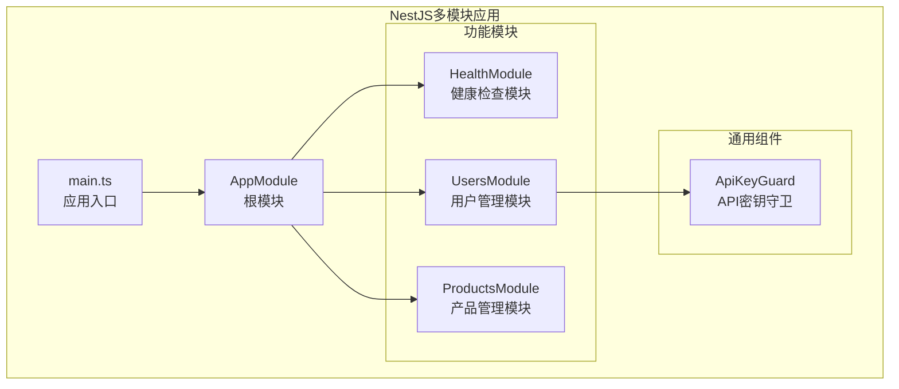
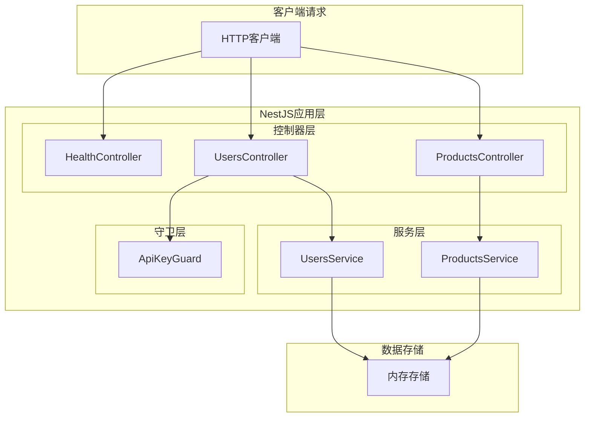
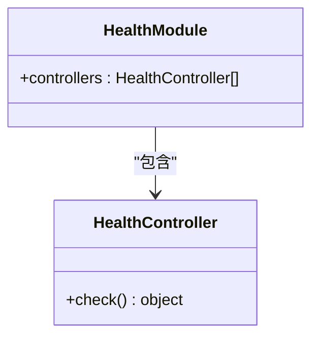
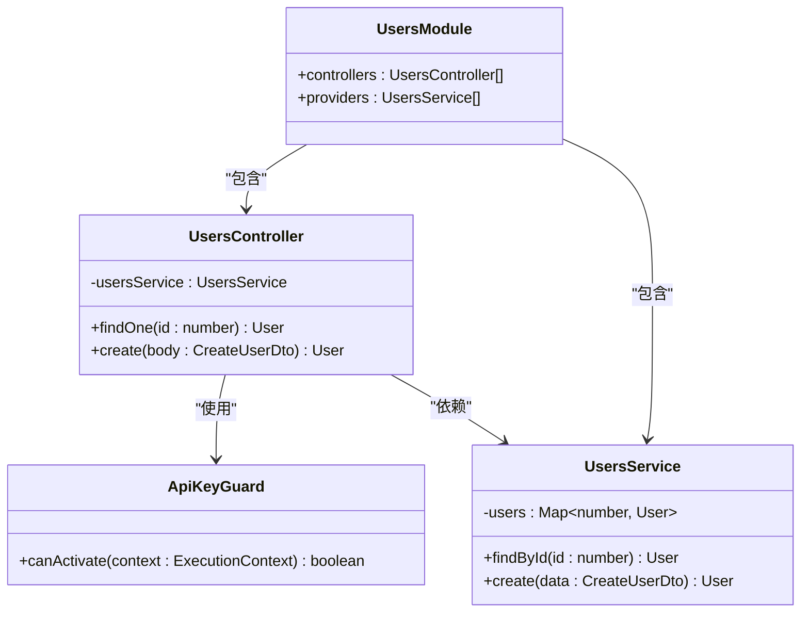
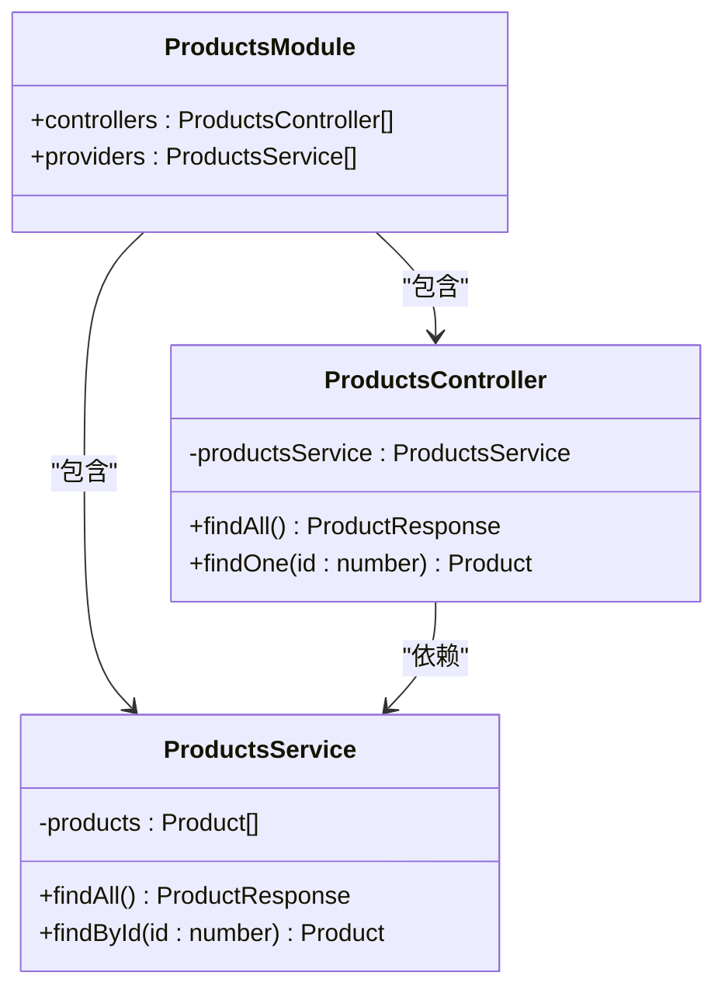
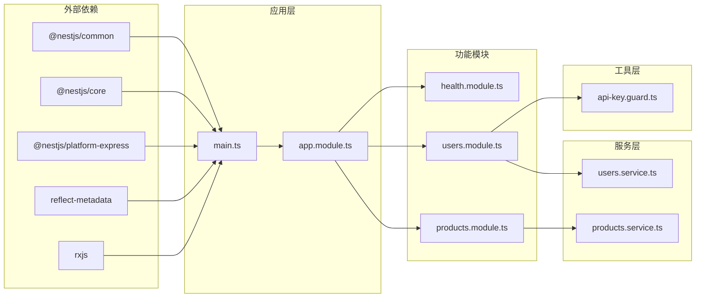

# NestJS多模块架构测试

<cite>
**本文档引用的文件**
- [main.ts](file://backend-tests/nestjs-multimodule/src/main.ts)
- [app.module.ts](file://backend-tests/nestjs-multimodule/src/app.module.ts)
- [users.module.ts](file://backend-tests/nestjs-multimodule/src/users/users.module.ts)
- [users.controller.ts](file://backend-tests/nestjs-multimodule/src/users/users.controller.ts)
- [users.service.ts](file://backend-tests/nestjs-multimodule/src/users/users.service.ts)
- [products.module.ts](file://backend-tests/nestjs-multimodule/src/products/products.module.ts)
- [products.controller.ts](file://backend-tests/nestjs-multimodule/src/products/products.controller.ts)
- [products.service.ts](file://backend-tests/nestjs-multimodule/src/products/products.service.ts)
- [health.module.ts](file://backend-tests/nestjs-multimodule/src/health/health.module.ts)
- [health.controller.ts](file://backend-tests/nestjs-multimodule/src/health/health.controller.ts)
- [api-key.guard.ts](file://backend-tests/nestjs-multimodule/src/common/guards/api-key.guard.ts)
- [package.json](file://backend-tests/nestjs-multimodule/package.json)
- [tsconfig.json](file://backend-tests/nestjs-multimodule/tsconfig.json)
- [meta.json](file://backend-tests/nestjs-multimodule/meta.json)
- [backend-tests/README.md](file://backend-tests/README.md)
- [README.md](file://README.md)
</cite>

## 目录
1. [简介](#简介)
2. [项目结构](#项目结构)
3. [核心组件](#核心组件)
4. [架构概览](#架构概览)
5. [详细组件分析](#详细组件分析)
6. [依赖关系分析](#依赖关系分析)
7. [性能考虑](#性能考虑)
8. [故障排除指南](#故障排除指南)
9. [结论](#结论)

## 简介

这是一个基于NestJS框架的多模块架构测试项目，专门用于验证framework-checker生成的NestJS应用在本地环境中的正确性和功能性。该项目采用模块化设计，包含了用户管理、产品管理和健康检查三个核心功能模块，并实现了自定义守卫机制来处理API访问控制。

该项目的核心目标是确保NestJS多模块应用能够正确启动、路由映射正常工作，并且各种装饰器（Guards、Pipes、Interceptors）能够按预期执行。

## 项目结构

该项目遵循NestJS的标准目录结构，采用了清晰的功能模块划分：

**图表来源**
- [main.ts:1-13](file://backend-tests/nestjs-multimodule/src/main.ts#L1-L13)
- [app.module.ts:1-10](file://backend-tests/nestjs-multimodule/src/app.module.ts#L1-L10)

**章节来源**
- [main.ts:1-13](file://backend-tests/nestjs-multimodule/src/main.ts#L1-L13)
- [app.module.ts:1-10](file://backend-tests/nestjs-multimodule/src/app.module.ts#L1-L10)
- [users.module.ts:1-10](file://backend-tests/nestjs-multimodule/src/users/users.module.ts#L1-L10)
- [products.module.ts:1-10](file://backend-tests/nestjs-multimodule/src/products/products.module.ts#L1-L10)
- [health.module.ts:1-8](file://backend-tests/nestjs-multimodule/src/health/health.module.ts#L1-L8)

## 核心组件

### 应用入口与配置

应用入口文件负责初始化NestJS应用实例，设置全局前缀和端口配置：

- **应用启动**: 异步启动函数，使用NestFactory.create创建应用实例
- **日志配置**: 仅记录错误和警告级别的日志
- **全局配置**: 设置API前缀为"api"
- **端口监听**: 支持环境变量PORT或默认3000端口

### 根模块组织

AppModule作为应用的根模块，负责协调各个功能模块的导入和组合：

- **模块导入**: 导入HealthModule、UsersModule、ProductsModule三个核心模块
- **模块聚合**: 实现了清晰的模块边界分离
- **依赖注入**: 通过NestJS的依赖注入系统管理模块间的关系

**章节来源**
- [main.ts:5-11](file://backend-tests/nestjs-multimodule/src/main.ts#L5-L11)
- [app.module.ts:6-8](file://backend-tests/nestjs-multimodule/src/app.module.ts#L6-L8)

## 架构概览

该NestJS应用采用了典型的多模块架构模式，实现了关注点分离和模块化设计：

**图表来源**
- [health.controller.ts:1-10](file://backend-tests/nestjs-multimodule/src/health/health.controller.ts#L1-L10)
- [users.controller.ts:1-20](file://backend-tests/nestjs-multimodule/src/users/users.controller.ts#L1-L20)
- [products.controller.ts:1-20](file://backend-tests/nestjs-multimodule/src/products/products.controller.ts#L1-L20)
- [users.service.ts:1-24](file://backend-tests/nestjs-multimodule/src/users/users.service.ts#L1-L24)
- [products.service.ts:1-26](file://backend-tests/nestjs-multimodule/src/products/products.service.ts#L1-L26)

## 详细组件分析

### 健康检查模块

健康检查模块提供了应用状态监控功能，是系统健康状况的重要指标：

**图表来源**
- [health.controller.ts:1-10](file://backend-tests/nestjs-multimodule/src/health/health.controller.ts#L1-L10)
- [health.module.ts:1-8](file://backend-tests/nestjs-multimodule/src/health/health.module.ts#L1-L8)

该模块的特点：
- **简单直接**: 仅提供单一的健康检查端点
- **快速响应**: 返回基本的运行状态信息
- **模块独立**: 不依赖其他业务逻辑

**章节来源**
- [health.controller.ts:4-8](file://backend-tests/nestjs-multimodule/src/health/health.controller.ts#L4-L8)
- [health.module.ts:4-6](file://backend-tests/nestjs-multimodule/src/health/health.module.ts#L4-L6)

### 用户管理模块

用户管理模块实现了完整的用户CRUD操作，包含了自定义守卫机制：

**图表来源**
- [users.controller.ts:1-20](file://backend-tests/nestjs-multimodule/src/users/users.controller.ts#L1-L20)
- [users.service.ts:1-24](file://backend-tests/nestjs-multimodule/src/users/users.service.ts#L1-L24)
- [api-key.guard.ts:1-17](file://backend-tests/nestjs-multimodule/src/common/guards/api-key.guard.ts#L1-L17)
- [users.module.ts:1-10](file://backend-tests/nestjs-multimodule/src/users/users.module.ts#L1-L10)

用户管理模块的关键特性：
- **参数验证**: 使用ParseIntPipe进行ID参数的类型转换
- **API访问控制**: 通过ApiKeyGuard实现API密钥验证
- **内存存储**: 使用Map数据结构存储用户数据
- **动态用户创建**: 自动生成唯一的用户ID

**章节来源**
- [users.controller.ts:9-18](file://backend-tests/nestjs-multimodule/src/users/users.controller.ts#L9-L18)
- [users.service.ts:13-22](file://backend-tests/nestjs-multimodule/src/users/users.service.ts#L13-L22)
- [api-key.guard.ts:8-15](file://backend-tests/nestjs-multimodule/src/common/guards/api-key.guard.ts#L8-L15)

### 产品管理模块

产品管理模块提供了产品列表查询和单个产品详情获取功能：

**图表来源**
- [products.controller.ts:1-20](file://backend-tests/nestjs-multimodule/src/products/products.controller.ts#L1-L20)
- [products.service.ts:1-26](file://backend-tests/nestjs-multimodule/src/products/products.service.ts#L1-L26)
- [products.module.ts:1-10](file://backend-tests/nestjs-multimodule/src/products/products.module.ts#L1-L10)

产品管理模块的特点：
- **静态数据**: 使用预定义的产品列表
- **错误处理**: 对不存在的产品返回404错误
- **响应格式**: 统一的产品列表响应格式

**章节来源**
- [products.controller.ts:8-18](file://backend-tests/nestjs-multimodule/src/products/products.controller.ts#L8-L18)
- [products.service.ts:18-24](file://backend-tests/nestjs-multimodule/src/products/products.service.ts#L18-L24)

### API密钥守卫

自定义守卫实现了API访问控制机制：

**图表来源**
- [api-key.guard.ts:8-15](file://backend-tests/nestjs-multimodule/src/common/guards/api-key.guard.ts#L8-L15)

守卫的工作流程：
- **请求拦截**: 在每个HTTP请求到达时执行
- **头部验证**: 检查X-API-Key请求头
- **权限控制**: 仅允许有效的API密钥访问特定端点

**章节来源**
- [api-key.guard.ts:8-15](file://backend-tests/nestjs-multimodule/src/common/guards/api-key.guard.ts#L8-L15)

## 依赖关系分析

项目的依赖关系体现了清晰的层次结构和模块化设计：

**图表来源**
- [package.json:9-19](file://backend-tests/nestjs-multimodule/package.json#L9-L19)
- [main.ts:1-3](file://backend-tests/nestjs-multimodule/src/main.ts#L1-L3)
- [app.module.ts:1-4](file://backend-tests/nestjs-multimodule/src/app.module.ts#L1-L4)

**章节来源**
- [package.json:9-19](file://backend-tests/nestjs-multimodule/package.json#L9-L19)
- [tsconfig.json:2-14](file://backend-tests/nestjs-multimodule/tsconfig.json#L2-L14)

## 性能考虑

基于当前实现的性能特征分析：

### 内存使用
- **用户存储**: 使用Map数据结构，查找时间复杂度O(1)
- **产品存储**: 使用数组存储，查找时间复杂度O(n)
- **内存优化**: 数据存储在内存中，重启后丢失

### 并发处理
- **请求处理**: NestJS基于事件循环，支持高并发请求
- **守卫执行**: 同步执行，无阻塞操作
- **数据库访问**: 内存操作，无I/O等待

### 启动性能
- **模块加载**: 动态模块加载，启动时间短
- **依赖注入**: 编译时优化，运行时性能良好

## 故障排除指南

### 常见问题及解决方案

**1. 应用无法启动**
- 检查端口占用情况
- 验证Node.js版本兼容性
- 确认依赖包安装完整

**2. API密钥验证失败**
- 确保请求头包含正确的X-API-Key
- 验证API密钥值是否为"secret"
- 检查请求头大小写敏感性

**3. 用户ID参数解析错误**
- 确保URL中的ID为有效的整数
- 检查ParseIntPipe的参数传递

**4. 产品查询返回404**
- 验证产品ID的有效性
- 检查产品列表中的可用ID

**章节来源**
- [api-key.guard.ts:10-12](file://backend-tests/nestjs-multimodule/src/common/guards/api-key.guard.ts#L10-L12)
- [users.controller.ts:10-11](file://backend-tests/nestjs-multimodule/src/users/users.controller.ts#L10-L11)
- [products.controller.ts:16-16](file://backend-tests/nestjs-multimodule/src/products/products.controller.ts#L16-L16)

## 结论

该NestJS多模块架构测试项目成功展示了现代TypeScript后端开发的最佳实践：

### 主要成就
- **模块化设计**: 清晰的功能模块划分，职责明确
- **依赖注入**: 优雅的依赖管理机制
- **装饰器模式**: Guards、Controllers、Services的合理运用
- **测试驱动**: 完善的断言机制验证功能正确性

### 架构优势
- **可扩展性**: 新功能模块易于添加
- **可维护性**: 代码结构清晰，便于维护
- **可测试性**: 模块边界明确，便于单元测试
- **性能表现**: 基于内存的数据存储，响应速度快

### 改进建议
- **持久化存储**: 考虑使用数据库替代内存存储
- **错误处理**: 添加更详细的错误处理机制
- **日志记录**: 增强应用日志记录能力
- **监控指标**: 添加应用性能监控

该测试项目为NestJS多模块应用开发提供了优秀的参考模板，展示了如何构建可扩展、可维护的企业级应用程序。