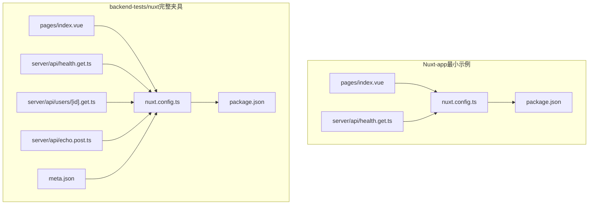
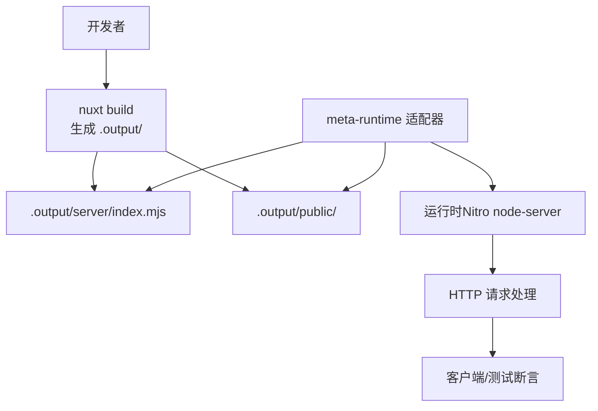
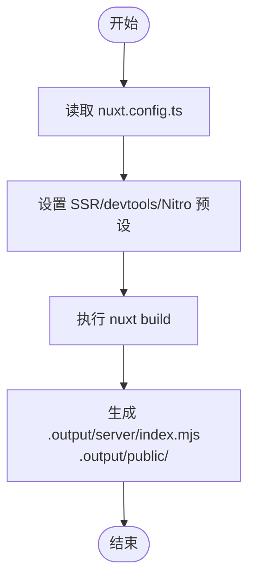
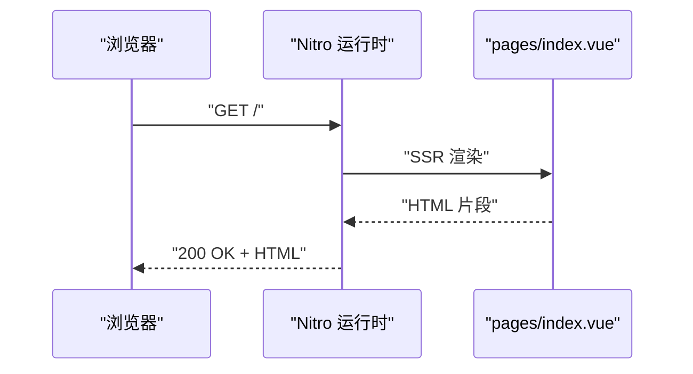
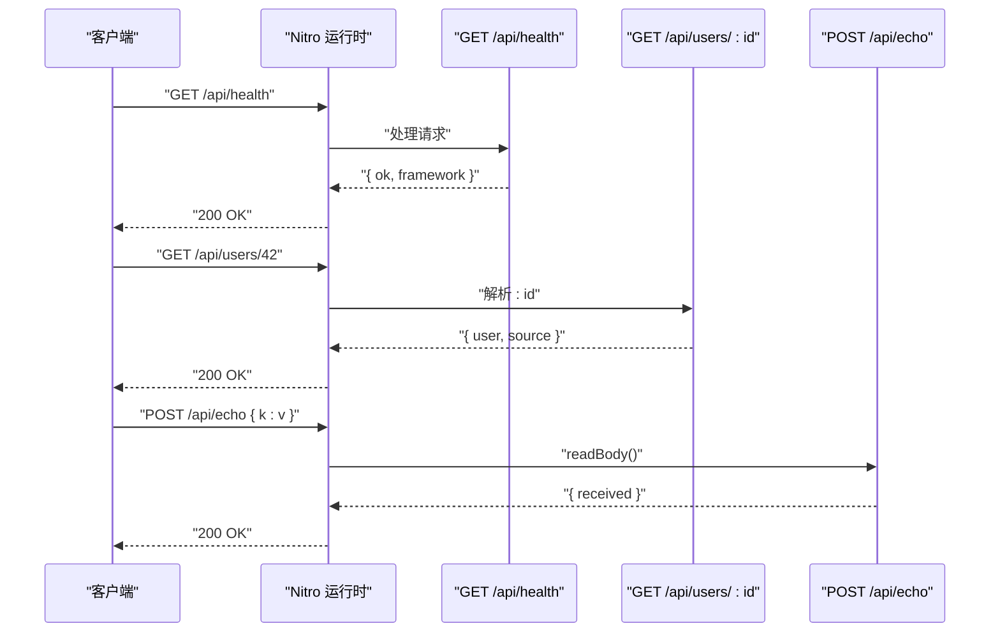
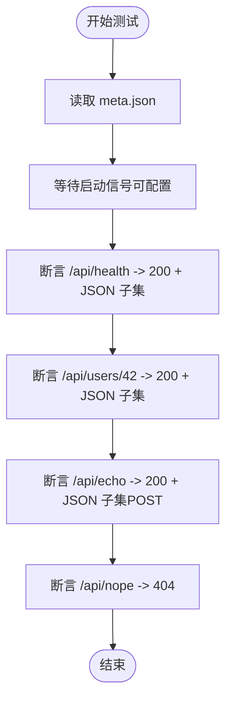
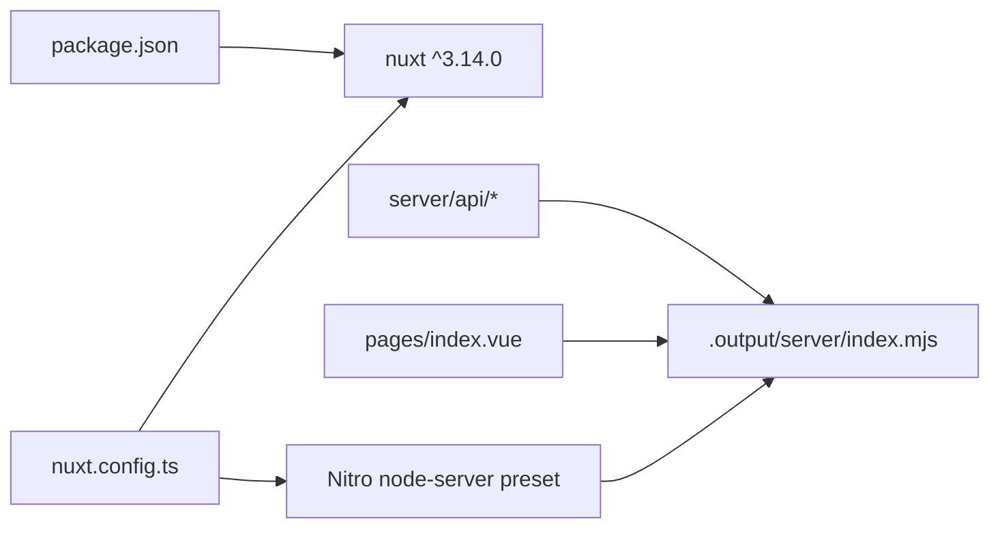

# 元框架测试

<cite>
**本文引用的文件**
- [Nuxt-app/nuxt.config.ts](file://Nuxt-app/nuxt.config.ts)
- [Nuxt-app/package.json](file://Nuxt-app/package.json)
- [Nuxt-app/pages/index.vue](file://Nuxt-app/pages/index.vue)
- [Nuxt-app/server/api/health.get.ts](file://Nuxt-app/server/api/health.get.ts)
- [backend-tests/nuxt/nuxt.config.ts](file://backend-tests/nuxt/nuxt.config.ts)
- [backend-tests/nuxt/package.json](file://backend-tests/nuxt/package.json)
- [backend-tests/nuxt/pages/index.vue](file://backend-tests/nuxt/pages/index.vue)
- [backend-tests/nuxt/server/api/health.get.ts](file://backend-tests/nuxt/server/api/health.get.ts)
- [backend-tests/nuxt/server/api/users/[id].get.ts](file://backend-tests/nuxt/server/api/users/[id].get.ts)
- [backend-tests/nuxt/server/api/echo.post.ts](file://backend-tests/nuxt/server/api/echo.post.ts)
- [backend-tests/nuxt/meta.json](file://backend-tests/nuxt/meta.json)
- [Nuxt-app/README.md](file://Nuxt-app/README.md)
- [backend-tests/README.md](file://backend-tests/README.md)
- [README.md](file://README.md)
</cite>

## 目录
1. [简介](#简介)
2. [项目结构](#项目结构)
3. [核心组件](#核心组件)
4. [架构总览](#架构总览)
5. [详细组件分析](#详细组件分析)
6. [依赖关系分析](#依赖关系分析)
7. [性能考虑](#性能考虑)
8. [故障排查指南](#故障排查指南)
9. [结论](#结论)
10. [附录](#附录)

## 简介
本文件面向“元框架测试”场景，聚焦于 Nuxt.js 元框架在本仓库中的测试实现与验证方式。Nuxt 作为“元框架”，其构建产物与运行时与传统后端框架（如 Express/Koa/Hono）存在显著差异：Nuxt 自身负责生成自包含的服务端入口与静态资源，测试模块通过 meta-runtime 适配器直接消费 Nuxt 的输出目录，避免使用 nft 静态追踪，从而简化打包与部署流程。

本测试模块的核心目标包括：
- 验证 Nuxt 应用在 meta-framework 模式下的构建与运行
- 验证页面路由与 API 端点的正确性
- 验证构建命令、产物收集与适配器集成
- 对比 Nuxt 与传统后端框架在检测、打包与运行时上的差异

## 项目结构
本仓库包含两套与 Nuxt 相关的测试资产：
- Nuxt-app：最小化 Nuxt 3 示例，用于演示元框架特性与产物结构
- backend-tests/nuxt：完整的后端测试夹具，包含页面、API、断言与构建脚本

关键目录与文件：
- Nuxt-app
  - pages/index.vue：首页页面组件
  - server/api/health.get.ts：健康检查 API
  - nuxt.config.ts：Nuxt 配置（ssr 开启、禁用 devtools、node-server 预设）
  - package.json：构建脚本与依赖
- backend-tests/nuxt
  - pages/index.vue：SSR 页面组件
  - server/api/health.get.ts：健康检查 API
  - server/api/users/[id].get.ts：动态路由参数示例
  - server/api/echo.post.ts：请求体读取与回显示例
  - meta.json：HTTP 断言与运行参数
  - nuxt.config.ts / package.json：与 Nuxt-app 类似的配置与脚本

**图表来源**
- [Nuxt-app/nuxt.config.ts:1-9](file://Nuxt-app/nuxt.config.ts#L1-L9)
- [Nuxt-app/package.json:1-12](file://Nuxt-app/package.json#L1-L12)
- [Nuxt-app/pages/index.vue:1-7](file://Nuxt-app/pages/index.vue#L1-L7)
- [Nuxt-app/server/api/health.get.ts:1-6](file://Nuxt-app/server/api/health.get.ts#L1-L6)
- [backend-tests/nuxt/nuxt.config.ts:1-10](file://backend-tests/nuxt/nuxt.config.ts#L1-L10)
- [backend-tests/nuxt/package.json:1-13](file://backend-tests/nuxt/package.json#L1-L13)
- [backend-tests/nuxt/pages/index.vue:1-7](file://backend-tests/nuxt/pages/index.vue#L1-L7)
- [backend-tests/nuxt/server/api/health.get.ts:1-6](file://backend-tests/nuxt/server/api/health.get.ts#L1-L6)
- [backend-tests/nuxt/server/api/users/[id].get.ts](file://backend-tests/nuxt/server/api/users/[id].get.ts#L1-L6)
- [backend-tests/nuxt/server/api/echo.post.ts:1-6](file://backend-tests/nuxt/server/api/echo.post.ts#L1-L6)
- [backend-tests/nuxt/meta.json:1-14](file://backend-tests/nuxt/meta.json#L1-L14)

**章节来源**
- [Nuxt-app/README.md:1-17](file://Nuxt-app/README.md#L1-L17)
- [backend-tests/README.md:1-133](file://backend-tests/README.md#L1-L133)

## 核心组件
- Nuxt 配置与构建
  - 配置启用 SSR，禁用 devtools，并指定 Nitro 的 node-server 预设，确保构建产物为自包含服务端入口
  - 构建脚本统一使用 nuxt build，保证与元框架适配器的集成一致性
- 页面路由
  - pages/index.vue 提供基础页面内容，验证 SSR 渲染与静态资源输出
- API 端点
  - server/api/health.get.ts：健康检查端点，返回框架标识
  - server/api/users/[id].get.ts：动态路由参数解析示例
  - server/api/echo.post.ts：请求体读取与回显示例
- 断言与运行参数
  - meta.json 定义了端口、断言集合与超时控制，覆盖 GET/POST/404 场景

**章节来源**
- [Nuxt-app/nuxt.config.ts:1-9](file://Nuxt-app/nuxt.config.ts#L1-L9)
- [Nuxt-app/package.json:1-12](file://Nuxt-app/package.json#L1-L12)
- [Nuxt-app/pages/index.vue:1-7](file://Nuxt-app/pages/index.vue#L1-L7)
- [Nuxt-app/server/api/health.get.ts:1-6](file://Nuxt-app/server/api/health.get.ts#L1-L6)
- [backend-tests/nuxt/server/api/users/[id].get.ts](file://backend-tests/nuxt/server/api/users/[id].get.ts#L1-L6)
- [backend-tests/nuxt/server/api/echo.post.ts:1-6](file://backend-tests/nuxt/server/api/echo.post.ts#L1-L6)
- [backend-tests/nuxt/meta.json:1-14](file://backend-tests/nuxt/meta.json#L1-L14)

## 架构总览
下图展示了 Nuxt 元框架在测试中的整体工作流：构建阶段生成 .output 目录，测试阶段通过 meta-runtime 适配器直接消费该目录，跳过 nft 静态追踪，减少打包复杂度。

**图表来源**
- [Nuxt-app/README.md:13-17](file://Nuxt-app/README.md#L13-L17)
- [backend-tests/README.md:1-133](file://backend-tests/README.md#L1-L133)

## 详细组件分析

### Nuxt 配置与构建流程
- 配置要点
  - ssr: true：启用服务端渲染
  - devtools: { enabled: false }：生产化关闭开发工具
  - nitro.preset: 'node-server'：生成自包含服务端入口
- 构建命令
  - scripts.build: "nuxt build"：统一构建入口
  - postinstall 中包含 nuxt prepare && nuxt build：确保依赖准备与构建同步

**图表来源**
- [Nuxt-app/nuxt.config.ts:1-9](file://Nuxt-app/nuxt.config.ts#L1-L9)
- [Nuxt-app/package.json:1-12](file://Nuxt-app/package.json#L1-L12)
- [backend-tests/nuxt/nuxt.config.ts:1-10](file://backend-tests/nuxt/nuxt.config.ts#L1-L10)
- [backend-tests/nuxt/package.json:1-13](file://backend-tests/nuxt/package.json#L1-L13)

**章节来源**
- [Nuxt-app/nuxt.config.ts:1-9](file://Nuxt-app/nuxt.config.ts#L1-L9)
- [Nuxt-app/package.json:1-12](file://Nuxt-app/package.json#L1-L12)
- [backend-tests/nuxt/nuxt.config.ts:1-10](file://backend-tests/nuxt/nuxt.config.ts#L1-L10)
- [backend-tests/nuxt/package.json:1-13](file://backend-tests/nuxt/package.json#L1-L13)

### 页面路由与 SSR
- pages/index.vue：基础页面组件，验证 SSR 输出与静态资源收集
- 适配器直接从 .output/public 拷贝静态资源，无需默认 dist/ 拷贝

**图表来源**
- [Nuxt-app/pages/index.vue:1-7](file://Nuxt-app/pages/index.vue#L1-L7)
- [backend-tests/nuxt/pages/index.vue:1-7](file://backend-tests/nuxt/pages/index.vue#L1-L7)

**章节来源**
- [Nuxt-app/pages/index.vue:1-7](file://Nuxt-app/pages/index.vue#L1-L7)
- [backend-tests/nuxt/pages/index.vue:1-7](file://backend-tests/nuxt/pages/index.vue#L1-L7)
- [Nuxt-app/README.md:13-17](file://Nuxt-app/README.md#L13-L17)

### API 端点与动态路由
- server/api/health.get.ts：返回框架标识与状态
- server/api/users/[id].get.ts：通过 getRouterParam 获取动态参数
- server/api/echo.post.ts：读取请求体并回显

**图表来源**
- [backend-tests/nuxt/server/api/health.get.ts:1-6](file://backend-tests/nuxt/server/api/health.get.ts#L1-L6)
- [backend-tests/nuxt/server/api/users/[id].get.ts](file://backend-tests/nuxt/server/api/users/[id].get.ts#L1-L6)
- [backend-tests/nuxt/server/api/echo.post.ts:1-6](file://backend-tests/nuxt/server/api/echo.post.ts#L1-L6)

**章节来源**
- [backend-tests/nuxt/server/api/health.get.ts:1-6](file://backend-tests/nuxt/server/api/health.get.ts#L1-L6)
- [backend-tests/nuxt/server/api/users/[id].get.ts](file://backend-tests/nuxt/server/api/users/[id].get.ts#L1-L6)
- [backend-tests/nuxt/server/api/echo.post.ts:1-6](file://backend-tests/nuxt/server/api/echo.post.ts#L1-L6)

### 测试断言与运行参数
- meta.json 定义了端口、断言集合与超时控制
- 断言规则：状态码严格匹配、JSON 子集匹配、POST 请求体自动序列化

**图表来源**
- [backend-tests/nuxt/meta.json:1-14](file://backend-tests/nuxt/meta.json#L1-L14)

**章节来源**
- [backend-tests/nuxt/meta.json:1-14](file://backend-tests/nuxt/meta.json#L1-L14)
- [backend-tests/README.md:38-93](file://backend-tests/README.md#L38-L93)

### 与传统框架的差异与优势
- 元框架（Nuxt）与后端框架（Express/Koa/Hono）的关键区别
  - 不进行 nft 静态追踪：Nuxt 自身构建出自包含的 .output/server/index.mjs
  - 静态资源直接从 .output/public 拷贝，跳过默认 dist/ 收集
  - 构建命令固定为 nuxt build，便于适配器统一处理
- 优势
  - 更少的打包与追踪开销
  - 更稳定的运行时入口与资源路径
  - 与 meta-runtime 适配器天然契合

**章节来源**
- [Nuxt-app/README.md:13-17](file://Nuxt-app/README.md#L13-L17)
- [backend-tests/README.md:1-133](file://backend-tests/README.md#L1-L133)

## 依赖关系分析
- 组件内聚与耦合
  - Nuxt 配置与构建脚本紧密耦合，确保构建产物稳定
  - 页面与 API 端点通过约定式路由组织，降低手动路由配置成本
- 外部依赖
  - 依赖 nuxt ^3.14.0，确保与 meta-runtime 适配器兼容
- 运行时依赖
  - Nitro node-server 预设提供自包含服务端入口

**图表来源**
- [Nuxt-app/nuxt.config.ts:1-9](file://Nuxt-app/nuxt.config.ts#L1-L9)
- [Nuxt-app/package.json:1-12](file://Nuxt-app/package.json#L1-L12)
- [backend-tests/nuxt/nuxt.config.ts:1-10](file://backend-tests/nuxt/nuxt.config.ts#L1-L10)
- [backend-tests/nuxt/package.json:1-13](file://backend-tests/nuxt/package.json#L1-L13)

**章节来源**
- [Nuxt-app/package.json:1-12](file://Nuxt-app/package.json#L1-L12)
- [backend-tests/nuxt/package.json:1-13](file://backend-tests/nuxt/package.json#L1-L13)

## 性能考虑
- SSR 开启与 devtools 关闭有助于减少构建体积与运行时开销
- 使用 Nitro node-server 预设生成自包含入口，避免额外的运行时探测与追踪
- 静态资源直接从 .output/public 拷贝，减少不必要的文件扫描与复制

**章节来源**
- [Nuxt-app/nuxt.config.ts:1-9](file://Nuxt-app/nuxt.config.ts#L1-L9)
- [Nuxt-app/README.md:13-17](file://Nuxt-app/README.md#L13-L17)

## 故障排查指南
- 构建失败或产物缺失
  - 确认 scripts.build 为 nuxt build
  - 确认 postinstall 包含 nuxt prepare && nuxt build
- 运行时无法启动
  - 检查 meta.json 中 port 设置与 warmupTimeoutMs
  - 确认 .output/server/index.mjs 存在且可执行
- 路由或 API 返回异常
  - 核对 server/api 下的路由命名与参数解析
  - 使用 meta.json 的断言规则逐条验证
- 静态资源未被收集
  - 确认 .output/public 存在且包含预期资源
  - 避免误用默认 dist/ 收集逻辑

**章节来源**
- [backend-tests/nuxt/package.json:1-13](file://backend-tests/nuxt/package.json#L1-L13)
- [backend-tests/nuxt/meta.json:1-14](file://backend-tests/nuxt/meta.json#L1-L14)
- [Nuxt-app/README.md:13-17](file://Nuxt-app/README.md#L13-L17)

## 结论
本测试模块通过 Nuxt-app 与 backend-tests/nuxt 两个层次，系统性地验证了 Nuxt 元框架在构建、运行与测试方面的关键路径。其核心优势在于自包含的构建产物与简化的运行时集成，使得适配器可以直接消费 .output 目录，避免传统框架的 nft 静态追踪与复杂的打包流程。配合 meta.json 的断言机制，能够快速定位问题并保障功能正确性。

## 附录
- 开发指南
  - 使用 nuxt build 作为统一构建入口
  - 在 server/api 下按约定式路由编写端点
  - 在 pages 下编写页面组件，验证 SSR 渲染
- 部署策略
  - 采用 Nitro node-server 预设，生成 .output/server/index.mjs
  - 将 .output/public 作为静态资源目录
- 常见配置问题与解决方案
  - 未开启 ssr 或 devtools 导致产物不符合预期：在 nuxt.config.ts 中启用 ssr 并关闭 devtools
  - 构建命令不一致导致适配器无法识别：统一使用 nuxt build
  - 动态路由参数解析失败：使用 getRouterParam(event, 'id') 获取参数

**章节来源**
- [Nuxt-app/README.md:1-17](file://Nuxt-app/README.md#L1-L17)
- [backend-tests/README.md:1-133](file://backend-tests/README.md#L1-L133)
- [README.md:1-31](file://README.md#L1-L31)