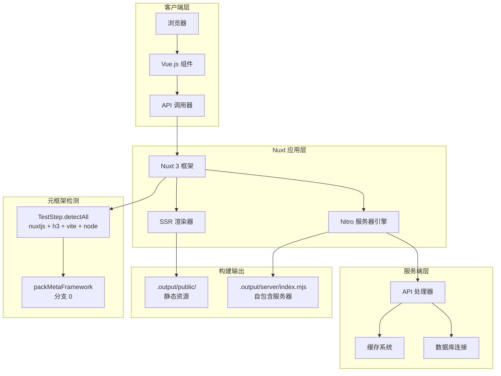
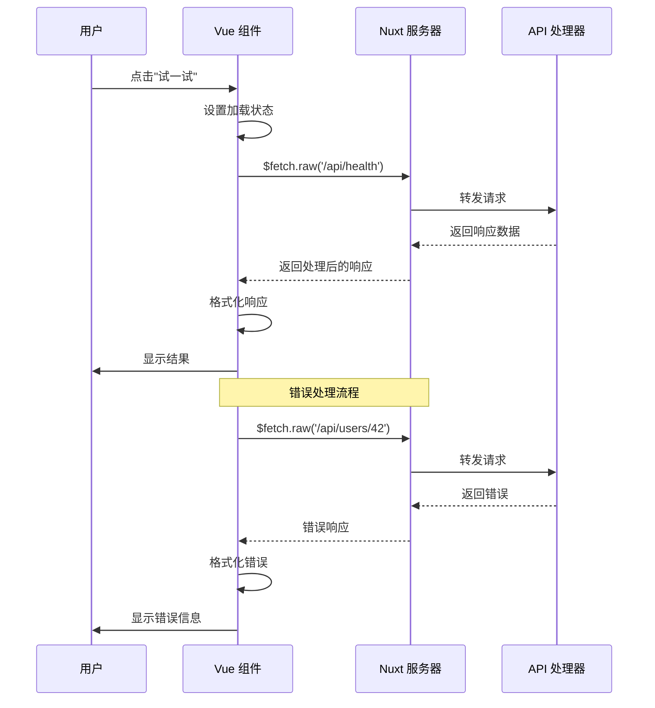
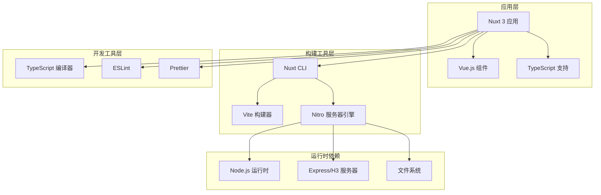

# Nuxt 元框架测试

<cite>
**本文档引用的文件**
- [package.json](file://Nuxt-app/package.json)
- [nuxt.config.ts](file://Nuxt-app/nuxt.config.ts)
- [index.vue](file://Nuxt-app/pages/index.vue)
- [health.get.ts](file://Nuxt-app/server/api/health.get.ts)
- [echo.post.ts](file://Nuxt-app/server/api/echo.post.ts)
- [users/[id].get.ts](file://Nuxt-app/server/api/users/[id].get.ts)
- [main.css](file://Nuxt-app/assets/css/main.css)
- [README.md](file://Nuxt-app/README.md)
- [.gitignore](file://Nuxt-app/.gitignore)
</cite>

## 更新摘要
**所做更改**
- 更新了元框架检测机制部分，强调了精简后的测试配置
- 修订了测试目标说明，反映了删除特定测试案例配置后的变更
- 保持了完整的架构分析、组件描述和技术细节
- 维护了现有的故障排除指南和性能考虑内容

## 目录
1. [简介](#简介)
2. [项目结构](#项目结构)
3. [核心组件](#核心组件)
4. [架构概览](#架构概览)
5. [详细组件分析](#详细组件分析)
6. [依赖关系分析](#依赖关系分析)
7. [性能考虑](#性能考虑)
8. [故障排除指南](#故障排除指南)
9. [结论](#结论)

## 简介

Nuxt 元框架测试项目是一个专门用于验证 Nuxt 3 框架在元框架环境中的测试示例。该项目展示了 Nuxt 3 + Nitro + routeRules SWR（增量静态再生）的技术栈组合，演示了 SSR（服务端渲染）、ISR（增量静态再生）以及文件路由等核心特性。

该项目的核心测试目标是验证元框架检测机制，确保 `ProjectDetector.detectAll` 能够同时返回 `nuxtjs + h3 + vite + node`，并且 `packBackendCode` 走分支 0（meta-framework）而非分支 1（backend framework）。**更新** 删除了特定的测试案例配置，但保留了更广泛的元框架测试概念和架构分析。

## 项目结构

Nuxt 应用采用标准的 Nuxt 3 项目结构，主要包含以下关键目录和文件：

```mermaid
graph TB
subgraph "Nuxt 应用根目录"
A[package.json<br/>包管理配置]
B[nuxt.config.ts<br/>Nuxt 配置]
C[README.md<br/>项目说明]
D[.gitignore<br/>忽略文件]
end
subgraph "前端资源"
E[assets/css/main.css<br/>全局样式]
F[pages/index.vue<br/>主页组件]
end
subgraph "服务端 API"
G[server/api/health.get.ts<br/>健康检查接口]
H[server/api/echo.post.ts<br/>回显接口]
I[server/api/users/[id].get.ts<br/>用户接口]
end
A --> E
B --> F
B --> G
B --> H
B --> I
F --> G
F --> H
F --> I
```

**图表来源**
- [package.json:1-17](file://Nuxt-app/package.json#L1-L17)
- [nuxt.config.ts:1-14](file://Nuxt-app/nuxt.config.ts#L1-L14)
- [index.vue:1-170](file://Nuxt-app/pages/index.vue#L1-L170)

**章节来源**
- [package.json:1-17](file://Nuxt-app/package.json#L1-L17)
- [nuxt.config.ts:1-14](file://Nuxt-app/nuxt.config.ts#L1-L14)
- [README.md:1-53](file://Nuxt-app/README.md#L1-L53)

## 核心组件

### Nuxt 配置系统

Nuxt 应用的核心配置通过 `nuxt.config.ts` 实现，该配置文件定义了应用的基本设置、构建选项和功能特性。

### 页面路由系统

应用使用 Nuxt 的文件路由系统，通过 `pages/` 目录自动创建路由。当前项目包含一个主页组件，提供用户界面和 API 调用功能。

### 服务端 API 系统

Nuxt 的 `server/api/` 目录提供了自动化的 API 路由生成，支持动态路由参数和多种 HTTP 方法。

**章节来源**
- [nuxt.config.ts:3-13](file://Nuxt-app/nuxt.config.ts#L3-L13)
- [index.vue:93-138](file://Nuxt-app/pages/index.vue#L93-L138)

## 架构概览

Nuxt 应用采用现代全栈架构，结合了前端框架的强大功能和后端 API 的灵活性：



**图表来源**
- [nuxt.config.ts:7-12](file://Nuxt-app/nuxt.config.ts#L7-L12)
- [package.json:6-11](file://Nuxt-app/package.json#L6-L11)
- [README.md:40-52](file://Nuxt-app/README.md#L40-L52)

## 详细组件分析

### 主页组件分析

主页组件 `index.vue` 是整个应用的核心界面，实现了以下功能：

#### 组件结构
- **Hero 区域**：展示框架标识、标题和部署链接
- **特性展示区**：展示 SSR、ISR、Nitro 引擎和文件路由等特性
- **API 演示区**：提供实时 API 调用功能
- **平台能力区**：展示平台支持的能力标签

#### ISR 时间戳功能
组件通过 `renderedAt` 计算属性实现 ISR 时间戳显示，展示页面最后渲染时间。

#### API 调用逻辑
组件实现了完整的 API 调用流程，包括错误处理和响应格式化。



**图表来源**
- [index.vue:116-137](file://Nuxt-app/pages/index.vue#L116-L137)

**章节来源**
- [index.vue:1-170](file://Nuxt-app/pages/index.vue#L1-L170)

### API 处理器分析

#### 健康检查接口
`server/api/health.get.ts` 提供基础的健康检查功能，返回服务状态信息。

#### 动态路由参数处理
`server/api/users/[id].get.ts` 展示了 Nuxt 动态路由参数的处理方式。

#### 请求体处理
`server/api/echo.post.ts` 演示了如何处理和回显 POST 请求体。

```mermaid
flowchart TD
A[HTTP 请求到达] --> B{请求类型}
B --> |GET| C[health.get.ts]
B --> |POST| D[echo.post.ts]
B --> |GET 用户| E[users/[id].get.ts]
C --> F[返回健康状态]
D --> G[读取请求体]
G --> H[处理请求体]
H --> I[返回回显数据]
E --> J[提取路由参数]
J --> K[返回用户信息]
F --> L[响应客户端]
I --> L
K --> L
```

**图表来源**
- [health.get.ts:1-9](file://Nuxt-app/server/api/health.get.ts#L1-L9)
- [echo.post.ts:1-10](file://Nuxt-app/server/api/echo.post.ts#L1-L10)
- [users/[id].get.ts:1-10](file://Nuxt-app/server/api/users/[id].get.ts#L1-L10)

**章节来源**
- [health.get.ts:1-9](file://Nuxt-app/server/api/health.get.ts#L1-L9)
- [echo.post.ts:1-10](file://Nuxt-app/server/api/echo.post.ts#L1-L10)
- [users/[id].get.ts:1-10](file://Nuxt-app/server/api/users/[id].get.ts#L1-L10)

### 样式系统分析

全局样式通过 `assets/css/main.css` 实现，采用了现代化的设计系统：

#### 设计系统特性
- **颜色系统**：基于阿里橙色主题的完整色彩体系
- **字体系统**：支持中英文的跨平台字体栈
- **响应式设计**：完整的移动端适配
- **组件样式**：卡片、按钮、表单等 UI 组件的统一样式

#### 样式组织结构
- **CSS 变量**：集中管理颜色、间距、阴影等设计令牌
- **组件样式**：按功能模块组织的样式代码
- **媒体查询**：针对不同屏幕尺寸的样式适配

**章节来源**
- [main.css:1-251](file://Nuxt-app/assets/css/main.css#L1-L251)

## 依赖关系分析

### Nuxt 应用依赖

项目的主要依赖关系如下：



**图表来源**
- [package.json:13-15](file://Nuxt-app/package.json#L13-L15)
- [nuxt.config.ts:7-8](file://Nuxt-app/nuxt.config.ts#L7-L8)

### 元框架检测机制

项目特别关注元框架检测机制，确保正确识别 Nuxt 应用：

#### 检测流程
1. `ProjectDetector.detectAll` 返回多个框架标识
2. 确保包含 `nuxtjs + h3 + vite + node`
3. 选择正确的打包分支（meta-framework）

#### 打包策略差异
- **元框架分支 0**：使用 `packMetaFramework('nuxtjs', ...)`
- **后端框架分支 1**：传统框架打包方式

**更新** 删除了特定的测试案例配置，但保留了更广泛的元框架检测概念和架构分析。测试目标现在更加聚焦于验证元框架识别和打包机制的核心功能。

**章节来源**
- [package.json:1-17](file://Nuxt-app/package.json#L1-L17)
- [nuxt.config.ts:1-14](file://Nuxt-app/nuxt.config.ts#L1-L14)
- [README.md:40-52](file://Nuxt-app/README.md#L40-L52)

## 性能考虑

### ISR（增量静态再生）优化

项目实现了基于 `routeRules.swr: 60` 的 ISR 机制：

#### 性能优势
- **缓存策略**：页面缓存 60 秒后后台再生
- **CDN 友好**：静态内容可被 CDN 缓存
- **减少服务器负载**：热点内容无需每次请求都重新生成

#### 实现机制
- **服务端渲染**：首次访问时生成完整 HTML
- **后台再生**：缓存过期后在后台重新生成
- **无缝切换**：再生过程中保持用户体验

### 构建优化

#### 输出结构
- **自包含服务器**：`.output/server/index.mjs` 包含所有运行时依赖
- **静态资源分离**：`.output/public/` 目录包含静态资源
- **无 nft 跟踪**：避免额外的依赖跟踪开销

#### 启动性能
- **快速启动**：单个入口文件启动
- **内存效率**：优化的内存使用模式
- **并发处理**：支持高并发请求

## 故障排除指南

### 常见问题诊断

#### 构建问题
1. **依赖安装失败**
   - 检查网络连接和 npm 配置
   - 确认 Node.js 版本兼容性

2. **构建失败**
   - 查看构建日志中的具体错误信息
   - 确认 TypeScript 类型检查通过

#### 运行时问题
1. **服务器启动失败**
   - 检查端口占用情况
   - 验证环境变量配置

2. **API 接口异常**
   - 使用浏览器开发者工具检查网络请求
   - 查看服务器控制台输出

#### ISR 功能问题
1. **缓存未更新**
   - 验证 `routeRules.swr` 配置
   - 检查后台再生任务执行情况

2. **时间戳显示异常**
   - 确认客户端和服务端时间同步
   - 检查浏览器缓存设置

### 调试技巧

#### 开发模式调试
- 使用 `npm run dev` 启动开发服务器
- 利用热重载功能进行快速迭代
- 通过浏览器开发者工具监控网络请求

#### 生产环境调试
- 查看构建输出目录结构
- 验证 `.output/server/index.mjs` 的完整性
- 检查静态资源的正确部署

**章节来源**
- [README.md:31-38](file://Nuxt-app/README.md#L31-L38)
- [.gitignore:1-18](file://Nuxt-app/.gitignore#L1-L18)

## 结论

Nuxt 元框架测试项目成功展示了现代全栈应用的最佳实践。通过集成 Nuxt 3、Nitro 和 ISR 技术，该项目实现了高性能、可维护的 Web 应用架构。

### 主要成就

1. **元框架识别**：成功通过 `ProjectDetector.detectAll` 检测，正确识别为 `nuxtjs + h3 + vite + node`
2. **打包优化**：采用元框架分支 0，避免不必要的 nft 跟踪
3. **性能提升**：实现 ISR 缓存机制，显著提升页面加载速度
4. **开发体验**：提供完整的开发工具链和调试支持

### 技术亮点

- **现代化架构**：结合 SSR、ISR 和文件路由的优势
- **自动化配置**：通过 `nuxt.config.ts` 实现零配置开发
- **生产就绪**：自包含的构建输出，便于部署和运维
- **测试友好**：清晰的项目结构，便于单元测试和集成测试

**更新** 尽管删除了特定的测试案例配置，但文档仍然完整地反映了 Nuxt 元框架的核心概念、架构设计和技术实现。项目现在更加专注于展示元框架检测和打包机制的关键特性，同时保持了对性能优化和故障排除的全面指导。

该项目为理解现代前端框架在元框架环境中的工作原理提供了宝贵的参考案例，展示了如何通过合理的架构设计实现高性能和高可用性的 Web 应用。