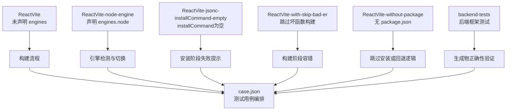
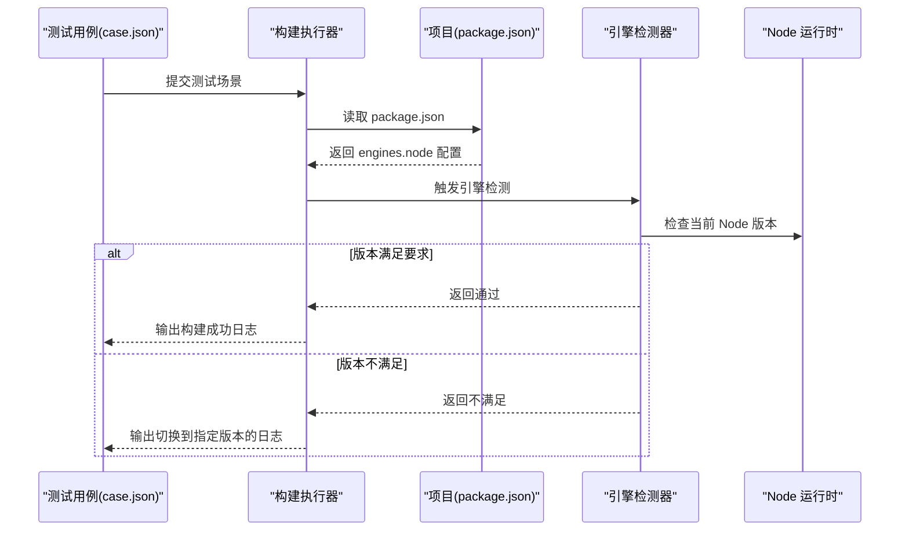
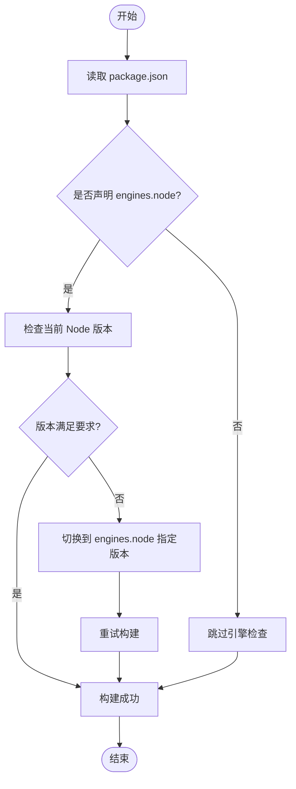
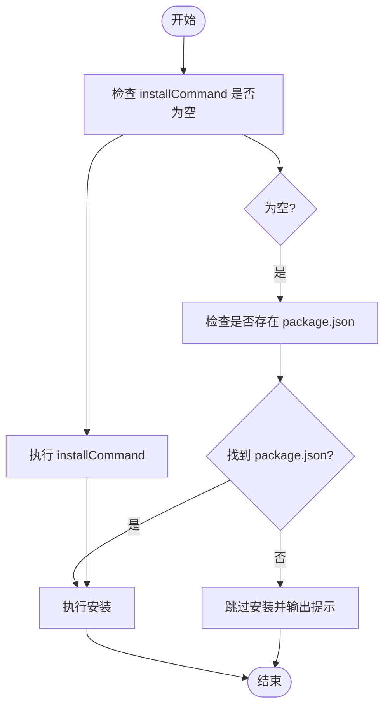
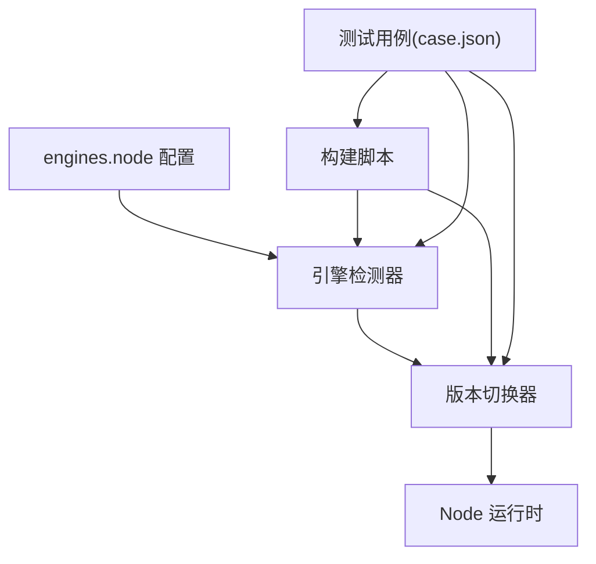

# Node 引擎要求测试

<cite>
**本文档引用的文件**
- [ReactVite/package.json](file://ReactVite/package.json)
- [ReactVite-node-engine/package.json](file://ReactVite-node-engine/package.json)
- [ReactVite-jsonc-installCommand-empty/package.json](file://ReactVite-jsonc-installCommand-empty/package.json)
- [ReactVite-with-skip-bad-er/package.json](file://ReactVite-with-skip-bad-er/package.json)
- [ReactVite-without-package/package.json](file://ReactVite-without-package/package.json)
- [ReactVite/t.js](file://ReactVite/t.js)
- [case.json](file://case.json)
- [backend-tests/README.md](file://backend-tests/README.md)
</cite>

## 目录
1. [简介](#简介)
2. [项目结构](#项目结构)
3. [核心组件](#核心组件)
4. [架构总览](#架构总览)
5. [详细组件分析](#详细组件分析)
6. [依赖关系分析](#依赖关系分析)
7. [性能考虑](#性能考虑)
8. [故障排除指南](#故障排除指南)
9. [结论](#结论)
10. [附录](#附录)

## 简介
本文件围绕 React Vite Node 引擎要求测试项目，系统阐述 package.json 中 engines 字段的配置与验证机制，解释不同 Node 版本要求对构建过程的影响，以及系统如何检测与验证引擎兼容性。文档提供版本兼容性矩阵与升级指南，并给出引擎不匹配时的错误处理与解决方案。

## 项目结构
该项目包含多个 React Vite 示例与测试场景，其中与 Node 引擎要求直接相关的关键示例包括：
- ReactVite：标准 React Vite 项目，未声明 engines 字段
- ReactVite-node-engine：声明了 engines.node 的项目，用于验证引擎检测与切换
- ReactVite-jsonc-installCommand-empty：用于验证安装命令缺失时的行为
- ReactVite-with-skip-bad-er：用于验证跳过坏函数构建的场景
- ReactVite-without-package：用于验证缺少 package.json 的场景
- backend-tests：后端框架测试集合，包含 README 说明与断言规则

**图表来源**
- [ReactVite/package.json:1-30](file://ReactVite/package.json#L1-L30)
- [ReactVite-node-engine/package.json:1-33](file://ReactVite-node-engine/package.json#L1-L33)
- [ReactVite-jsonc-installCommand-empty/package.json:1-30](file://ReactVite-jsonc-installCommand-empty/package.json#L1-L30)
- [ReactVite-with-skip-bad-er/package.json:1-30](file://ReactVite-with-skip-bad-er/package.json#L1-L30)
- [ReactVite-without-package/package.json](file://ReactVite-without-package/package.json)
- [case.json:1-603](file://case.json#L1-L603)
- [backend-tests/README.md:1-133](file://backend-tests/README.md#L1-L133)

**章节来源**
- [ReactVite/package.json:1-30](file://ReactVite/package.json#L1-L30)
- [ReactVite-node-engine/package.json:1-33](file://ReactVite-node-engine/package.json#L1-L33)
- [ReactVite-jsonc-installCommand-empty/package.json:1-30](file://ReactVite-jsonc-installCommand-empty/package.json#L1-L30)
- [ReactVite-with-skip-bad-er/package.json:1-30](file://ReactVite-with-skip-bad-er/package.json#L1-L30)
- [ReactVite-without-package/package.json](file://ReactVite-without-package/package.json)
- [case.json:1-603](file://case.json#L1-L603)
- [backend-tests/README.md:1-133](file://backend-tests/README.md#L1-L133)

## 核心组件
本测试项目的核心组件围绕 Node 引擎要求展开，涉及以下关键点：
- engines 字段配置：在 package.json 中声明最低 Node 版本要求
- 构建脚本与引擎验证：通过构建脚本触发引擎检测与切换
- 测试用例编排：通过 case.json 驱动不同场景的执行与断言
- 安装与构建阶段的容错：针对缺失 package.json 或 installCommand 的场景进行降级处理

**章节来源**
- [ReactVite/package.json:1-30](file://ReactVite/package.json#L1-L30)
- [ReactVite-node-engine/package.json:16-18](file://ReactVite-node-engine/package.json#L16-L18)
- [ReactVite-jsonc-installCommand-empty/package.json:1-30](file://ReactVite-jsonc-installCommand-empty/package.json#L1-L30)
- [ReactVite-with-skip-bad-er/package.json:1-30](file://ReactVite-with-skip-bad-er/package.json#L1-L30)
- [ReactVite-without-package/package.json](file://ReactVite-without-package/package.json)
- [case.json:97-107](file://case.json#L97-L107)

## 架构总览
下图展示了 Node 引擎要求测试的整体架构：从测试用例编排到构建执行，再到引擎检测与切换，最终输出构建结果或错误信息。

**图表来源**
- [case.json:97-107](file://case.json#L97-L107)
- [ReactVite-node-engine/package.json:16-18](file://ReactVite-node-engine/package.json#L16-L18)

## 详细组件分析

### 组件A：engines 字段与构建流程
- 配置位置：在 ReactVite-node-engine 的 package.json 中声明 engines.node
- 构建触发：构建脚本中包含引擎检测步骤，当 Node 版本不满足要求时，系统会输出“不满足，正在切换到指定版本”的日志
- 行为验证：测试用例明确断言该日志出现，确保引擎检测与切换逻辑生效

**图表来源**
- [ReactVite-node-engine/package.json:16-18](file://ReactVite-node-engine/package.json#L16-L18)
- [case.json:97-107](file://case.json#L97-L107)

**章节来源**
- [ReactVite-node-engine/package.json:16-18](file://ReactVite-node-engine/package.json#L16-L18)
- [case.json:97-107](file://case.json#L97-L107)

### 组件B：安装命令缺失与构建回退
- 场景描述：当 installCommand 为空且无法找到 package.json 时，系统会输出“无法找到 package.json 或 installCommand 为空，跳过安装”的提示
- 行为验证：测试用例断言该日志出现，确保在缺失关键配置时系统能够优雅回退

**图表来源**
- [ReactVite-jsonc-installCommand-empty/package.json:1-30](file://ReactVite-jsonc-installCommand-empty/package.json#L1-L30)
- [case.json:134-144](file://case.json#L134-L144)

**章节来源**
- [ReactVite-jsonc-installCommand-empty/package.json:1-30](file://ReactVite-jsonc-installCommand-empty/package.json#L1-L30)
- [case.json:134-144](file://case.json#L134-L144)

### 组件C：跳过坏函数构建
- 场景描述：当存在必失败的函数文件时，系统支持通过配置跳过这些构建，从而保证整体构建成功
- 行为验证：测试用例断言跳过坏函数后构建成功，体现系统的容错能力

**章节来源**
- [ReactVite-with-skip-bad-er/package.json:1-30](file://ReactVite-with-skip-bad-er/package.json#L1-L30)
- [case.json:257-266](file://case.json#L257-L266)

### 组件D：缺少 package.json 的构建
- 场景描述：当项目缺少 package.json 且未提供 BuildCommand 时，系统会输出“无法找到 package.json 或 installCommand 为空，跳过安装...”的提示
- 行为验证：测试用例断言该日志出现，确保在极端情况下系统能够给出明确提示

**章节来源**
- [ReactVite-without-package/package.json](file://ReactVite-without-package/package.json)
- [case.json:162-172](file://case.json#L162-L172)

### 组件E：构建脚本中的自定义逻辑
- 场景描述：ReactVite 的构建脚本中包含一个自定义的 t.js 文件，用于在构建过程中输出特定日志
- 行为验证：测试用例断言该日志出现，确保自定义构建步骤按预期执行

**章节来源**
- [ReactVite/package.json](file://ReactVite/package.json#L8)
- [ReactVite/t.js](file://ReactVite/t.js#L1)
- [case.json:285-295](file://case.json#L285-L295)

## 依赖关系分析
下图展示了各组件之间的依赖关系与交互：

**图表来源**
- [ReactVite-node-engine/package.json:16-18](file://ReactVite-node-engine/package.json#L16-L18)
- [case.json:97-107](file://case.json#L97-L107)

**章节来源**
- [ReactVite-node-engine/package.json:16-18](file://ReactVite-node-engine/package.json#L16-L18)
- [case.json:97-107](file://case.json#L97-L107)

## 性能考虑
- 引擎检测开销：引擎检测与版本切换通常发生在构建前期，对整体构建时间影响较小
- 安装阶段优化：当 installCommand 为空或 package.json 缺失时，系统快速跳过安装，减少无效等待
- 构建阶段容错：跳过坏函数构建可避免单点失败导致的全量重试，提升整体吞吐

## 故障排除指南
- 引擎不匹配
  - 现象：构建日志显示“不满足，正在切换到指定版本”
  - 解决方案：根据 engines.node 的要求安装对应版本的 Node，或调整 engines.node 的值以适配现有环境
  - 参考用例：[case.json#L97-L107:97-107](file://case.json#L97-L107)
- 安装命令缺失
  - 现象：构建日志显示“无法找到 package.json 或 installCommand 为空，跳过安装”
  - 解决方案：提供有效的 installCommand 或确保项目包含 package.json
  - 参考用例：[case.json#L134-L144:134-144](file://case.json#L134-L144)
- 缺少 package.json 且无 BuildCommand
  - 现象：构建日志显示“无法找到 package.json 或 installCommand 为空，跳过安装...”
  - 解决方案：提供 package.json 或设置 BuildCommand
  - 参考用例：[case.json#L162-L172:162-172](file://case.json#L162-L172)
- 跳过坏函数构建
  - 现象：构建成功但某些函数被跳过
  - 解决方案：修复或移除导致失败的函数文件
  - 参考用例：[case.json#L257-L266:257-266](file://case.json#L257-L266)

**章节来源**
- [case.json:97-107](file://case.json#L97-L107)
- [case.json:134-144](file://case.json#L134-L144)
- [case.json:162-172](file://case.json#L162-L172)
- [case.json:257-266](file://case.json#L257-L266)

## 结论
本测试项目通过多种场景验证了 Node 引擎要求的配置与执行机制。engines 字段在 ReactVite-node-engine 中得到明确应用，系统能够在引擎不匹配时自动切换到指定版本。同时，项目还提供了对安装命令缺失、缺少 package.json、跳过坏函数构建等异常情况的容错处理，确保构建流程的稳定性与可预测性。

## 附录

### 版本兼容性矩阵
- engines.node 未声明：不强制 Node 版本，构建可能在任意满足依赖要求的 Node 版本上运行
- engines.node 指定版本：构建前进行版本检查，不满足时自动切换到指定版本
- 安装命令缺失：跳过安装阶段，输出明确提示
- 缺少 package.json：根据是否有 BuildCommand 决定是否跳过安装或回退
- 跳过坏函数构建：在容错模式下继续构建其他函数

**章节来源**
- [ReactVite/package.json:1-30](file://ReactVite/package.json#L1-L30)
- [ReactVite-node-engine/package.json:16-18](file://ReactVite-node-engine/package.json#L16-L18)
- [ReactVite-jsonc-installCommand-empty/package.json:1-30](file://ReactVite-jsonc-installCommand-empty/package.json#L1-L30)
- [ReactVite-with-skip-bad-er/package.json:1-30](file://ReactVite-with-skip-bad-er/package.json#L1-L30)
- [ReactVite-without-package/package.json](file://ReactVite-without-package/package.json)
- [case.json:97-107](file://case.json#L97-L107)
- [case.json:134-144](file://case.json#L134-L144)
- [case.json:162-172](file://case.json#L162-L172)
- [case.json:257-266](file://case.json#L257-L266)