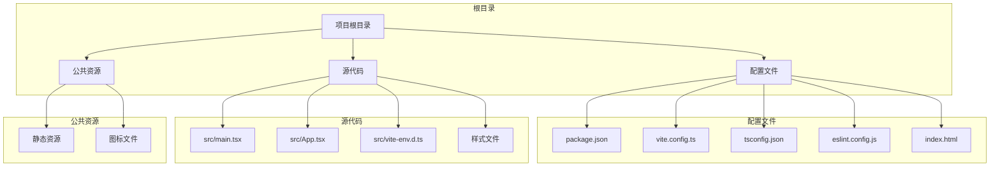
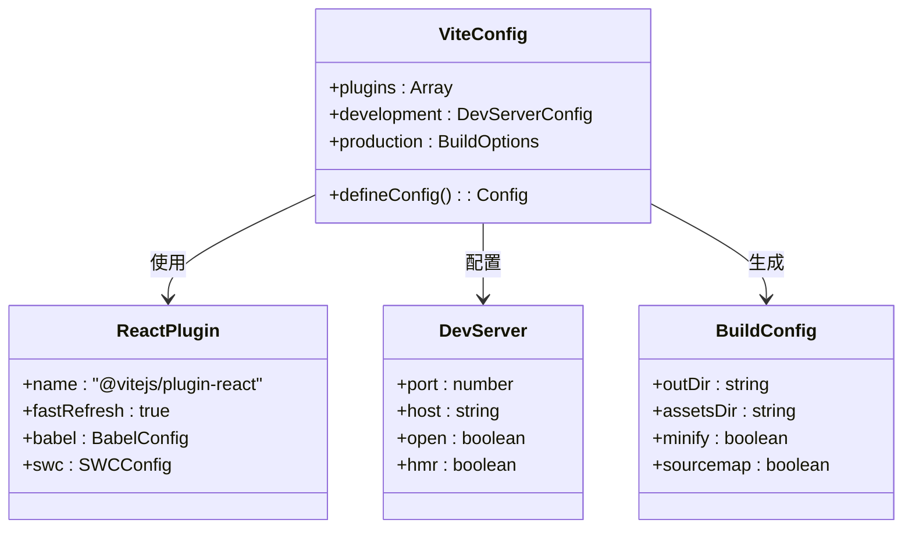
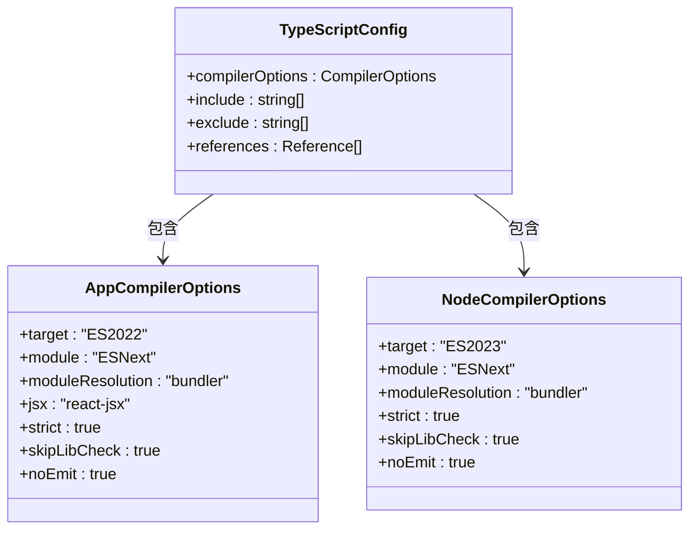
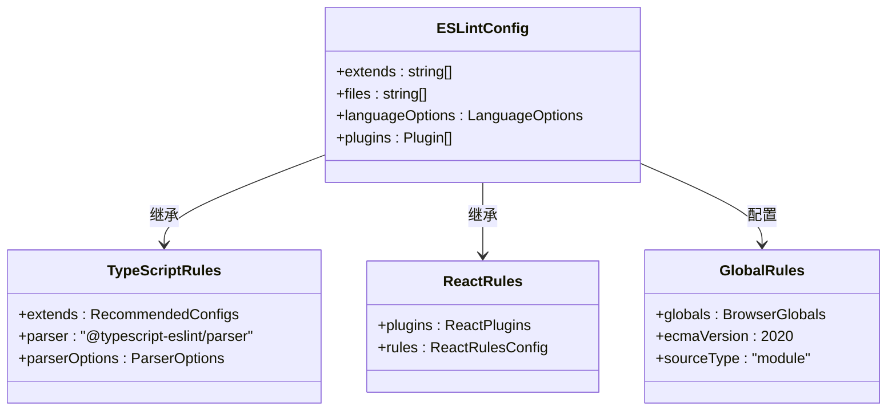
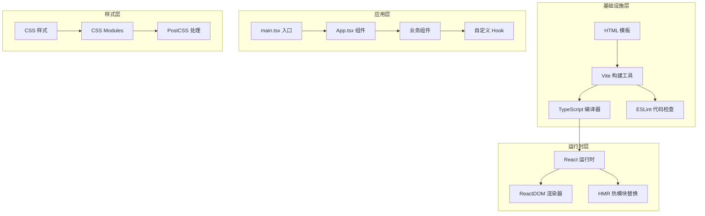
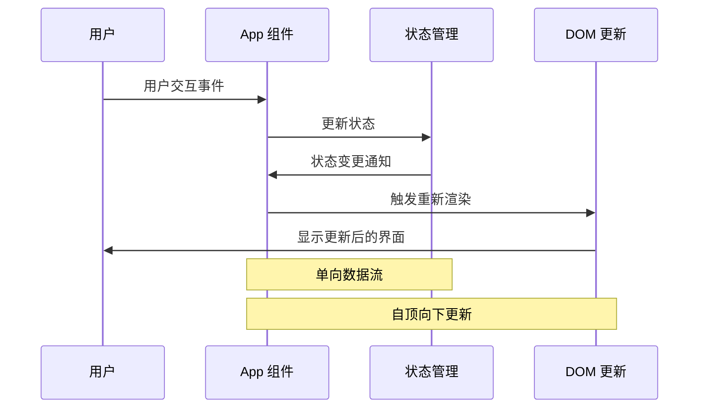
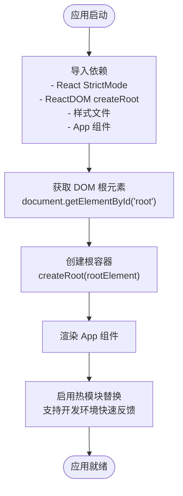
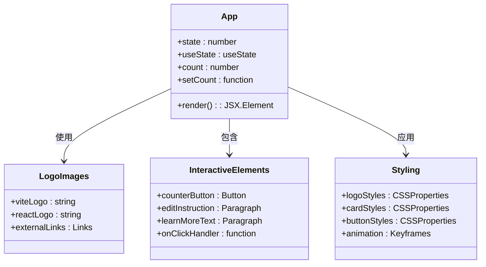
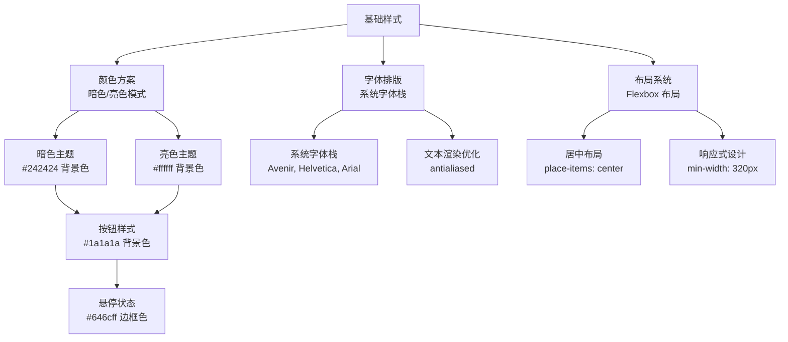
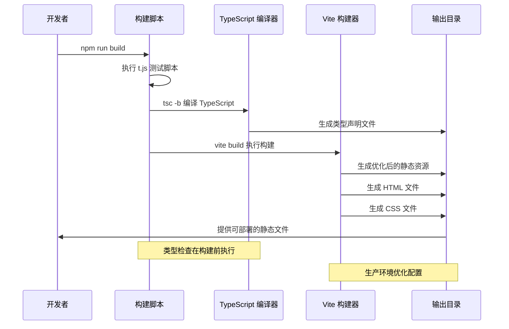

# React Vite 核心项目

<cite>
**本文档引用的文件**
- [package.json](file://ReactVite/package.json)
- [vite.config.ts](file://ReactVite/vite.config.ts)
- [tsconfig.json](file://ReactVite/tsconfig.json)
- [tsconfig.app.json](file://ReactVite/tsconfig.app.json)
- [tsconfig.node.json](file://ReactVite/tsconfig.node.json)
- [eslint.config.js](file://ReactVite/eslint.config.js)
- [src/main.tsx](file://ReactVite/src/main.tsx)
- [src/App.tsx](file://ReactVite/src/App.tsx)
- [index.html](file://ReactVite/index.html)
- [src/index.css](file://ReactVite/src/index.css)
- [src/App.css](file://ReactVite/src/App.css)
- [src/vite-env.d.ts](file://ReactVite/src/vite-env.d.ts)
- [README.md](file://ReactVite/README.md)
- [t.js](file://ReactVite/t.js)
</cite>

## 目录
1. [简介](#简介)
2. [项目结构](#项目结构)
3. [核心组件](#核心组件)
4. [架构概览](#架构概览)
5. [详细组件分析](#详细组件分析)
6. [依赖关系分析](#依赖关系分析)
7. [性能考虑](#性能考虑)
8. [故障排除指南](#故障排除指南)
9. [结论](#结论)
10. [附录](#附录)

## 简介

React Vite 核心项目是一个基于现代前端技术栈的高性能应用模板，集成了 React 19、TypeScript 5.8、Vite 7.1 和 ESLint 9.33。该项目提供了完整的开发环境配置，包括热模块替换(HMR)、类型安全检查、代码质量保证和生产级构建优化。

该模板采用最新的前端开发实践，使用 ESNext 模块系统、Bundler 模式解析和现代化的编译配置。项目结构清晰，配置文件分离明确，便于维护和扩展。

## 项目结构

React Vite 项目遵循标准的 Vite 项目布局，采用功能驱动的组织方式：



**图表来源**
- [package.json:1-30](file://ReactVite/package.json#L1-L30)
- [vite.config.ts:1-8](file://ReactVite/vite.config.ts#L1-L8)
- [tsconfig.json:1-8](file://ReactVite/tsconfig.json#L1-L8)

### 目录结构详解

**配置文件层**
- `package.json`: 项目元数据、依赖管理和脚本命令
- `vite.config.ts`: Vite 构建工具配置
- `tsconfig.json`: TypeScript 编译器配置入口
- `eslint.config.js`: 代码质量检查规则配置
- `index.html`: 应用入口 HTML 模板

**源代码层**
- `src/main.tsx`: 应用入口点，负责渲染根组件
- `src/App.tsx`: 主应用组件，包含核心业务逻辑
- `src/vite-env.d.ts`: TypeScript 环境声明文件
- `src/index.css` & `src/App.css`: 全局样式和组件样式

**公共资源层**
- `public/`: 静态资源目录，构建时直接复制到输出目录

**章节来源**
- [package.json:1-30](file://ReactVite/package.json#L1-L30)
- [index.html:1-14](file://ReactVite/index.html#L1-L14)

## 核心组件

### Vite 构建配置

Vite 配置采用最小化原则，专注于 React 开发的最佳实践：



**图表来源**
- [vite.config.ts:1-8](file://ReactVite/vite.config.ts#L1-L8)

### TypeScript 编译配置

项目采用双配置文件策略，分别针对应用代码和 Node.js 配置：



**图表来源**
- [tsconfig.app.json:1-28](file://ReactVite/tsconfig.app.json#L1-L28)
- [tsconfig.node.json:1-26](file://ReactVite/tsconfig.node.json#L1-L26)

### ESLint 代码质量规则

现代化的 ESLint 配置集成了 TypeScript 和 React 特定的规则：



**图表来源**
- [eslint.config.js:1-24](file://ReactVite/eslint.config.js#L1-L24)

**章节来源**
- [vite.config.ts:1-8](file://ReactVite/vite.config.ts#L1-L8)
- [tsconfig.app.json:1-28](file://ReactVite/tsconfig.app.json#L1-L28)
- [tsconfig.node.json:1-26](file://ReactVite/tsconfig.node.json#L1-L26)
- [eslint.config.js:1-24](file://ReactVite/eslint.config.js#L1-L24)

## 架构概览

React Vite 应用采用分层架构设计，从底层基础设施到上层业务逻辑清晰分离：



**图表来源**
- [src/main.tsx:1-11](file://ReactVite/src/main.tsx#L1-L11)
- [src/App.tsx:1-36](file://ReactVite/src/App.tsx#L1-L36)

### 数据流架构

应用的数据流向体现了 React 的单向数据流原则：



**图表来源**
- [src/App.tsx:6-33](file://ReactVite/src/App.tsx#L6-L33)

## 详细组件分析

### 应用入口组件 (main.tsx)

应用入口组件负责初始化 React 应用并挂载到 DOM 中：



**图表来源**
- [src/main.tsx:1-11](file://ReactVite/src/main.tsx#L1-L11)

### 主应用组件 (App.tsx)

主应用组件实现了核心的用户交互逻辑和状态管理：



**图表来源**
- [src/App.tsx:1-36](file://ReactVite/src/App.tsx#L1-L36)

### 样式系统分析

项目采用了现代化的样式处理方案，结合 CSS 变量和媒体查询：



**图表来源**
- [src/index.css:1-69](file://ReactVite/src/index.css#L1-L69)
- [src/App.css:1-43](file://ReactVite/src/App.css#L1-L43)

**章节来源**
- [src/main.tsx:1-11](file://ReactVite/src/main.tsx#L1-L11)
- [src/App.tsx:1-36](file://ReactVite/src/App.tsx#L1-L36)
- [src/index.css:1-69](file://ReactVite/src/index.css#L1-L69)
- [src/App.css:1-43](file://ReactVite/src/App.css#L1-L43)

### 构建流程分析

项目采用多步骤构建流程，确保开发效率和生产质量：



**图表来源**
- [package.json:8-8](file://ReactVite/package.json#L8-L8)
- [t.js:1-1](file://ReactVite/t.js#L1-L1)

**章节来源**
- [package.json:6-11](file://ReactVite/package.json#L6-L11)
- [t.js:1-1](file://ReactVite/t.js#L1-L1)

## 依赖关系分析

### 依赖层次结构

项目依赖关系呈现清晰的层次结构，从核心框架到底层工具：

```mermaid
graph TB
subgraph "应用层"
React[react ^19.1.1]
ReactDOM[react-dom ^19.1.1]
end
subgraph "开发工具层"
Vite[vite ^7.1.2]
TypeScript[typescript ~5.8.3]
ESLint[eslint ^9.33.0]
ReactPlugin[@vitejs/plugin-react ^5.0.0]
end
subgraph "类型定义层"
ReactTypes[@types/react ^19.1.10]
ReactDOMTypes[@types/react-dom ^19.1.7]
Globals[globals ^16.3.0]
end
subgraph "ESLint 插件层"
TSESLint[typescript-eslint ^8.39.1]
ReactHooks[eslint-plugin-react-hooks ^5.2.0]
ReactRefresh[eslint-plugin-react-refresh ^0.4.20]
end
subgraph "配置层"
JSConfig[@eslint/js ^9.33.0]
end
React --> ReactDOM
Vite --> ReactPlugin
Vite --> TypeScript
ESLint --> TSESLint
ESLint --> ReactHooks
ESLint --> ReactRefresh
TSESLint --> TypeScript
ReactPlugin --> React
```

**图表来源**
- [package.json:12-28](file://ReactVite/package.json#L12-L28)

### 开发脚本分析

构建脚本的设计体现了现代前端开发的最佳实践：

| 脚本名称 | 命令 | 功能描述 | 执行时机 |
|---------|------|----------|----------|
| dev | vite | 启动开发服务器，支持热重载 | 开发环境 |
| build | node t.js && tsc -b && vite build | 多步骤构建流程 | 生产环境 |
| lint | eslint . | 代码质量检查 | 开发/CI 环境 |
| preview | vite preview | 预览生产构建结果 | 验证部署 |

**章节来源**
- [package.json:6-11](file://ReactVite/package.json#L6-L11)

## 性能考虑

### 构建优化策略

项目采用多种策略确保最佳的构建性能和运行时表现：

**Tree Shaking 优化**
- 使用 ESNext 模块语法
- 避免无用代码引入
- 启用生产环境压缩

**缓存策略**
- TypeScript 构建信息缓存
- Vite 内置模块缓存
- 浏览器资源缓存

**代码分割**
- 动态导入支持
- 路由级别的代码分割
- 第三方库独立打包

### 开发体验优化

**热模块替换 (HMR)**
- 实时代码更新
- 状态保持机制
- 快速反馈循环

**类型检查集成**
- 开发时类型验证
- 错误实时提示
- 编辑器智能提示

## 故障排除指南

### 常见问题及解决方案

**TypeScript 类型错误**
- 确保所有文件都符合 TypeScript 规范
- 检查类型声明文件的完整性
- 验证 tsconfig 配置的正确性

**ESLint 规则冲突**
- 检查插件版本兼容性
- 验证配置文件的语法正确性
- 确认全局变量声明的完整性

**构建失败问题**
- 清理 node_modules 和缓存
- 检查依赖版本兼容性
- 验证构建脚本的执行权限

**开发服务器问题**
- 检查端口占用情况
- 验证网络连接状态
- 确认防火墙设置

### 性能问题诊断

**构建时间过长**
- 分析大型依赖包
- 启用并行构建
- 优化第三方库加载

**运行时性能问题**
- 检查内存泄漏
- 分析重渲染频率
- 优化组件结构

**章节来源**
- [README.md:10-70](file://ReactVite/README.md#L10-L70)

## 结论

React Vite 核心项目提供了一个完整、现代化的前端开发环境，具备以下优势：

**技术先进性**
- 采用最新的 React 19 和 TypeScript 5.8
- 集成 Vite 7.1 的高性能构建工具
- 配置现代化的 ESLint 规则体系

**开发效率**
- 完善的热模块替换支持
- 强类型的开发体验
- 自动化的代码质量检查

**可维护性**
- 清晰的项目结构
- 模块化的配置管理
- 标准化的开发流程

该模板为 React 应用开发提供了坚实的基础，开发者可以在此基础上快速构建高质量的生产级应用。

## 附录

### 最佳实践建议

**项目初始化**
- 使用官方模板作为起点
- 定期更新依赖版本
- 建立代码审查流程

**团队协作**
- 制定统一的编码规范
- 建立持续集成流程
- 定期进行技术分享

**生产部署**
- 配置适当的构建优化
- 设置监控和日志记录
- 建立回滚机制