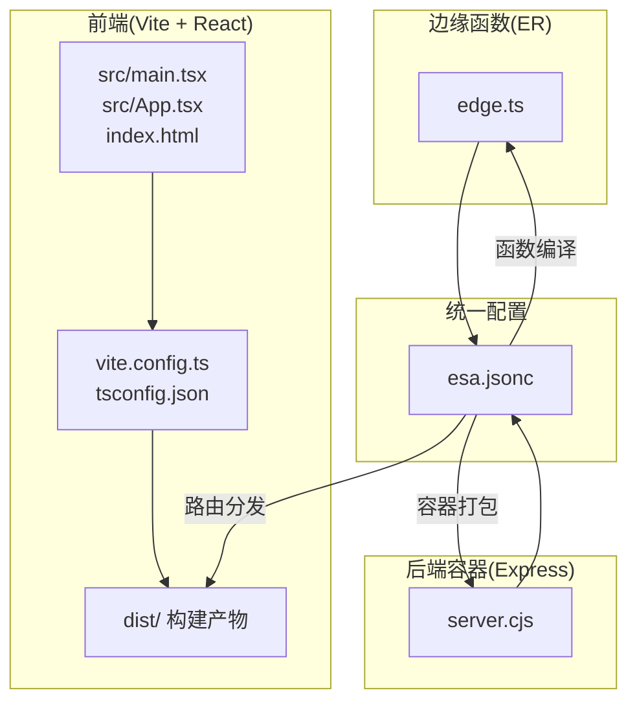
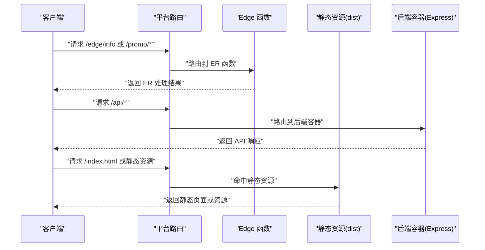
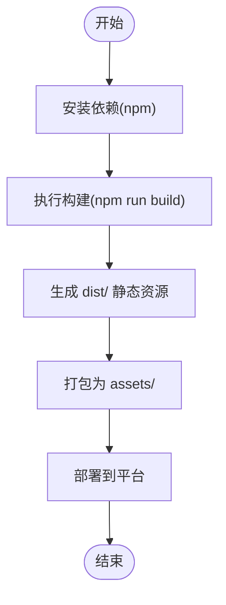
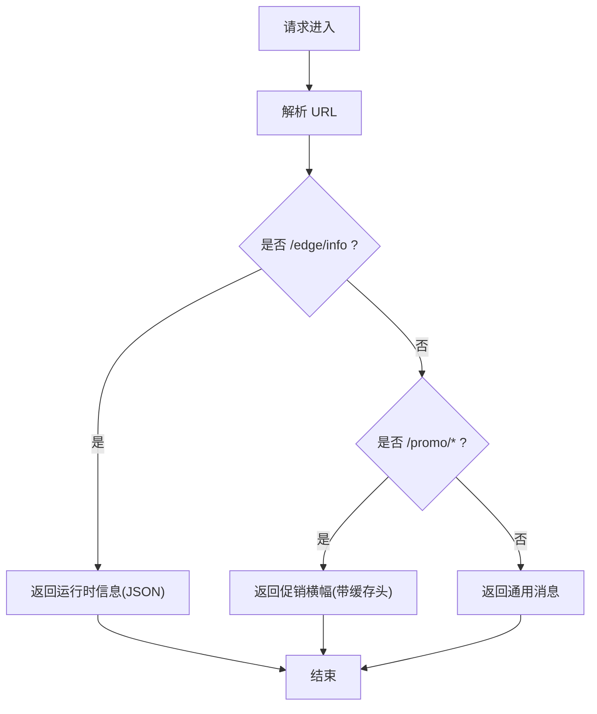
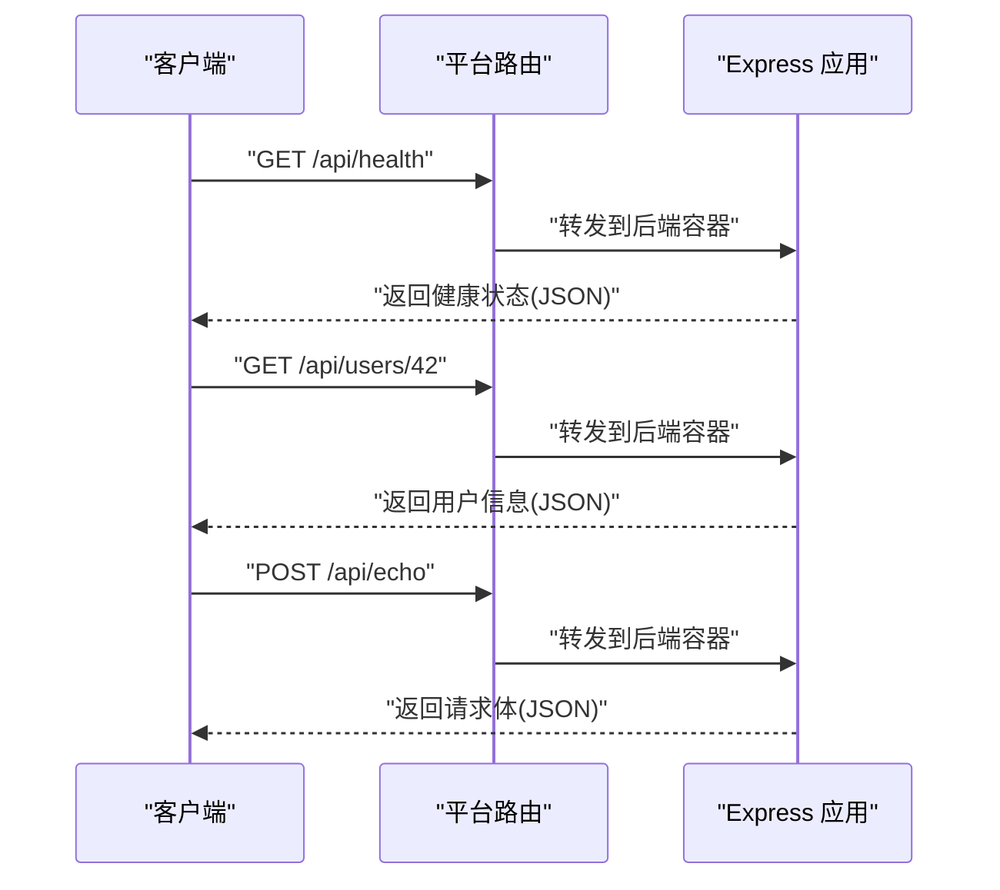
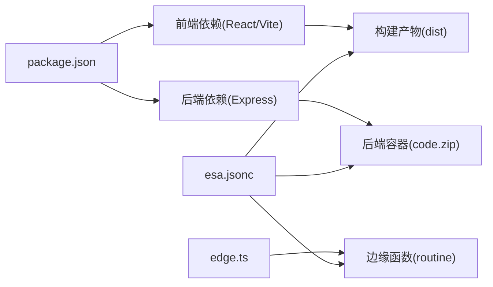

# 全栈应用测试

<cite>
**本文引用的文件**
- [package.json](file://Fullstack-react-express/package.json)
- [vite.config.ts](file://Fullstack-react-express/vite.config.ts)
- [server.cjs](file://Fullstack-react-express/server.cjs)
- [edge.ts](file://Fullstack-react-express/edge.ts)
- [esa.jsonc](file://Fullstack-react-express/esa.jsonc)
- [src/App.tsx](file://Fullstack-react-express/src/App.tsx)
- [src/main.tsx](file://Fullstack-react-express/src/main.tsx)
- [index.html](file://Fullstack-react-express/index.html)
- [tsconfig.json](file://Fullstack-react-express/tsconfig.json)
- [README.md](file://Fullstack-react-express/README.md)
- [case.json](file://case.json)
- [backend-tests/README.md](file://backend-tests/README.md)
</cite>

## 目录
1. [简介](#简介)
2. [项目结构](#项目结构)
3. [核心组件](#核心组件)
4. [架构总览](#架构总览)
5. [详细组件分析](#详细组件分析)
6. [依赖关系分析](#依赖关系分析)
7. [性能考虑](#性能考虑)
8. [故障排查指南](#故障排查指南)
9. [结论](#结论)
10. [附录](#附录)

## 简介
本项目是一个全栈 React + Express + Edge 函数（ER）的综合测试夹具，旨在验证构建与打包流水线能够同时处理前端、边缘函数与后端容器三类产物，并在部署阶段根据路由策略进行智能分发。项目通过单一配置文件统一描述前端构建、静态资源、边缘函数入口与路由优先级，确保 CI 场景下完整链路的稳定性与可重复性。

## 项目结构
该项目采用“多产物来源、统一配置”的组织方式：
- 前端：基于 Vite + React 的静态站点，构建产物输出至 dist 目录
- 边缘函数：基于 TypeScript 的 ER 函数，经 esbuild 编译为平台可执行的函数
- 后端容器：基于 Express 的 Node.js 应用，通过 nft trace 打包为可运行的容器代码

图表来源
- [package.json:1-22](file://Fullstack-react-express/package.json#L1-L22)
- [vite.config.ts:1-7](file://Fullstack-react-express/vite.config.ts#L1-L7)
- [server.cjs:1-20](file://Fullstack-react-express/server.cjs#L1-L20)
- [edge.ts:1-30](file://Fullstack-react-express/edge.ts#L1-L30)
- [esa.jsonc:1-20](file://Fullstack-react-express/esa.jsonc#L1-L20)

章节来源
- [package.json:1-22](file://Fullstack-react-express/package.json#L1-L22)
- [vite.config.ts:1-7](file://Fullstack-react-express/vite.config.ts#L1-L7)
- [server.cjs:1-20](file://Fullstack-react-express/server.cjs#L1-L20)
- [edge.ts:1-30](file://Fullstack-react-express/edge.ts#L1-L30)
- [esa.jsonc:1-20](file://Fullstack-react-express/esa.jsonc#L1-L20)
- [README.md:1-59](file://Fullstack-react-express/README.md#L1-L59)

## 核心组件
- 前端构建与运行时
  - 使用 Vite 作为构建工具，React 作为 UI 框架，TypeScript 提供类型安全
  - 构建脚本通过 npm run build 触发，产物输出至 dist 目录
- 边缘函数（Edge Function）
  - 以 fetch 风格导出，支持基于路径的条件分支与缓存头设置
  - 通过 esbuild 编译为平台可执行的函数模块
- 后端容器（Express）
  - 采用 CJS 写法，配合 package.json 的 type: module 以兼容前端 ESM
  - 提供健康检查、参数化路由与回显接口，便于验证容器运行与路由转发
- 统一配置（esa.jsonc）
  - 描述安装命令、构建命令、静态资源目录、边缘函数入口与路由优先级
  - 控制部署阶段的路由分发策略与产物打包行为

章节来源
- [package.json:6-8](file://Fullstack-react-express/package.json#L6-L8)
- [vite.config.ts:4-6](file://Fullstack-react-express/vite.config.ts#L4-L6)
- [server.cjs:7-15](file://Fullstack-react-express/server.cjs#L7-L15)
- [edge.ts:4-8](file://Fullstack-react-express/edge.ts#L4-L8)
- [esa.jsonc:4-18](file://Fullstack-react-express/esa.jsonc#L4-L18)

## 架构总览
全栈应用在部署阶段按路由优先级进行分流：
- Edge Function First：命中 /edge/* 与 /promo/* 的请求直接由 ER 函数处理
- 静态资源：其余命中静态页面的请求由 dist 目录提供的静态资源响应
- 后端容器：其他 API 请求由 Express 容器处理

图表来源
- [esa.jsonc:17-18](file://Fullstack-react-express/esa.jsonc#L17-L18)
- [edge.ts:10-29](file://Fullstack-react-express/edge.ts#L10-L29)
- [server.cjs:7-15](file://Fullstack-react-express/server.cjs#L7-L15)
- [index.html:8-12](file://Fullstack-react-express/index.html#L8-L12)

章节来源
- [README.md:23-26](file://Fullstack-react-express/README.md#L23-L26)
- [esa.jsonc:17-18](file://Fullstack-react-express/esa.jsonc#L17-L18)

## 详细组件分析

### 前端组件分析（Vite + React + TypeScript）
- 构建配置
  - Vite 插件：使用 @vitejs/plugin-react 提升开发体验与构建效率
  - TypeScript 配置：启用严格模式、隔离模块与 bundler 解析，确保类型安全与打包兼容性
- 运行时入口
  - main.tsx 作为应用入口，挂载根组件 App
  - index.html 提供挂载点与模块入口脚本
- 产物与分发
  - 构建产物 dist 目录作为静态资源，由平台按单页应用策略处理未匹配路由

图表来源
- [package.json:6-8](file://Fullstack-react-express/package.json#L6-L8)
- [vite.config.ts:4-6](file://Fullstack-react-express/vite.config.ts#L4-L6)
- [tsconfig.json:1-16](file://Fullstack-react-express/tsconfig.json#L1-L16)
- [index.html:8-12](file://Fullstack-react-express/index.html#L8-L12)

章节来源
- [vite.config.ts:1-7](file://Fullstack-react-express/vite.config.ts#L1-L7)
- [tsconfig.json:1-16](file://Fullstack-react-express/tsconfig.json#L1-L16)
- [src/main.tsx:1-10](file://Fullstack-react-express/src/main.tsx#L1-L10)
- [src/App.tsx:1-9](file://Fullstack-react-express/src/App.tsx#L1-L9)
- [index.html:1-13](file://Fullstack-react-express/index.html#L1-L13)

### 边缘函数组件分析（Edge 函数）
- 导出规范
  - 以默认导出对象形式提供 fetch 方法，符合平台 V8 isolate 运行时要求
- 路由处理
  - /edge/info：返回运行时信息（路径、查询参数）
  - /promo/*：返回促销横幅文本并设置缓存头
  - 其他路径：返回通用提示消息
- 编译与打包
  - 通过 esbuild 编译为平台可执行的函数模块，放置于 routine 目录

图表来源
- [edge.ts:10-29](file://Fullstack-react-express/edge.ts#L10-L29)

章节来源
- [edge.ts:1-30](file://Fullstack-react-express/edge.ts#L1-L30)
- [esa.jsonc:14-18](file://Fullstack-react-express/esa.jsonc#L14-L18)

### 后端容器组件分析（Express）
- 应用结构
  - 使用 CJS 写法，避免与前端 ESM 冲突
  - 提供 /api/health（健康检查）、/api/users/:id（参数化路由）、/api/echo（回显）等接口
- 监听端口与拦截
  - 用户代码中设置的监听端口会在运行时被 start.js 补丁接管，实际端口由平台配置决定
- 打包与运行
  - 通过 nft trace 将 Express 与 server.cjs 打包为 fc/code.zip，配合 fc/conf.jsonc 运行

图表来源
- [server.cjs:7-15](file://Fullstack-react-express/server.cjs#L7-L15)

章节来源
- [server.cjs:1-20](file://Fullstack-react-express/server.cjs#L1-L20)
- [README.md:42-58](file://Fullstack-react-express/README.md#L42-L58)

### 配置与部署组件分析（esa.jsonc）
- 前端构建
  - installCommand：前端依赖安装命令
  - buildCommand：前端构建命令
  - assets.directory：静态资源目录
  - assets.notFoundStrategy：单页应用回退策略
- 边缘函数
  - entry：ER 函数入口文件
  - edgeFunctionFirst：优先由 ER 处理的路由前缀列表
- 产物打包
  - 构建完成后，平台将 dist/、编译后的 ER 函数与后端容器代码打包为 index.zip

章节来源
- [esa.jsonc:1-20](file://Fullstack-react-express/esa.jsonc#L1-L20)

## 依赖关系分析
- 语言与模块系统
  - package.json 设置 type: module，前端使用 ESM；后端使用 CJS（server.cjs）以规避解析冲突
- 构建与运行时
  - Vite 与 React 用于前端构建与运行
  - Express 用于后端 API 服务
  - Edge 函数用于低延迟边缘处理与静态资源优化
- 配置驱动
  - esa.jsonc 统一声明安装、构建、静态资源与路由优先级，确保部署阶段的可预测行为

图表来源
- [package.json:9-20](file://Fullstack-react-express/package.json#L9-L20)
- [esa.jsonc:4-18](file://Fullstack-react-express/esa.jsonc#L4-L18)

章节来源
- [package.json:1-22](file://Fullstack-react-express/package.json#L1-L22)
- [esa.jsonc:1-20](file://Fullstack-react-express/esa.jsonc#L1-L20)

## 性能考虑
- 边缘优先路由
  - 将热点路径（如 /edge/* 与 /promo/*）交由 ER 处理，减少后端容器负载并降低延迟
- 缓存策略
  - 在边缘层设置合适的缓存头（如公共缓存），提升静态资源命中率
- 构建优化
  - 使用 Vite 的插件体系与 TypeScript 的隔离模块，减少打包体积与构建时间
- 资源回退
  - 单页应用回退策略确保未匹配路由的健壮性，避免 404

## 故障排查指南
- Express 识别与打包
  - 若检测不到后端项目，请确认 Express 入口文件存在且可被框架探测器识别
  - 确认 nft trace 成功完成并生成后端压缩包
- 前端构建
  - 若前端构建失败，检查安装命令与构建命令是否正确配置
  - 确保静态资源目录与回退策略符合预期
- 边缘函数
  - 若 ER 函数未生效，检查入口文件与路由优先级配置
  - 确认 esbuild 编译产物路径与平台要求一致
- 生成物与日志
  - CI 日志中应包含“检测到后端项目（框架：Express）”、“nft trace 完成”、“后端压缩包创建完成”、“构建产物生成成功”等关键断言

章节来源
- [README.md:28-36](file://Fullstack-react-express/README.md#L28-L36)
- [case.json:561-576](file://case.json#L561-L576)
- [backend-tests/README.md:86-92](file://backend-tests/README.md#L86-L92)

## 结论
本项目通过统一配置与多产物来源的协同，实现了前端、边缘函数与后端容器的一体化构建与部署。其路由优先策略与严格的 CI 断言保证了在复杂场景下的稳定性与可维护性。建议在实际工程中遵循相同的配置模式与最佳实践，以获得一致的构建体验与可靠的运行表现。

## 附录
- 运行与验证
  - 本地验证后端打包流程：将 server.cjs 当作独立 Express 项目运行，并通过健康检查接口验证
  - 参考 backend-tests 目录中的断言规范，确保生成物在本机即可正确响应 HTTP 请求

章节来源
- [README.md:42-58](file://Fullstack-react-express/README.md#L42-L58)
- [backend-tests/README.md:94-110](file://backend-tests/README.md#L94-L110)