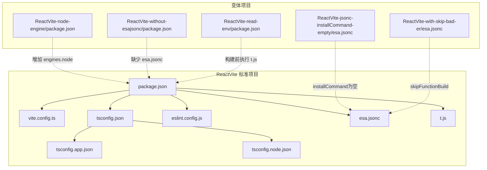
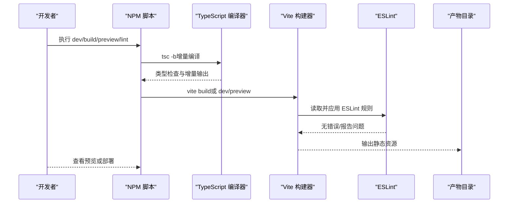
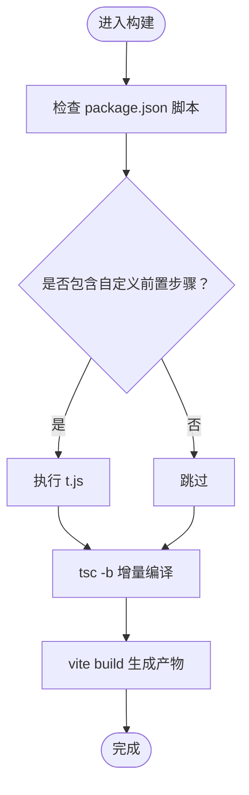
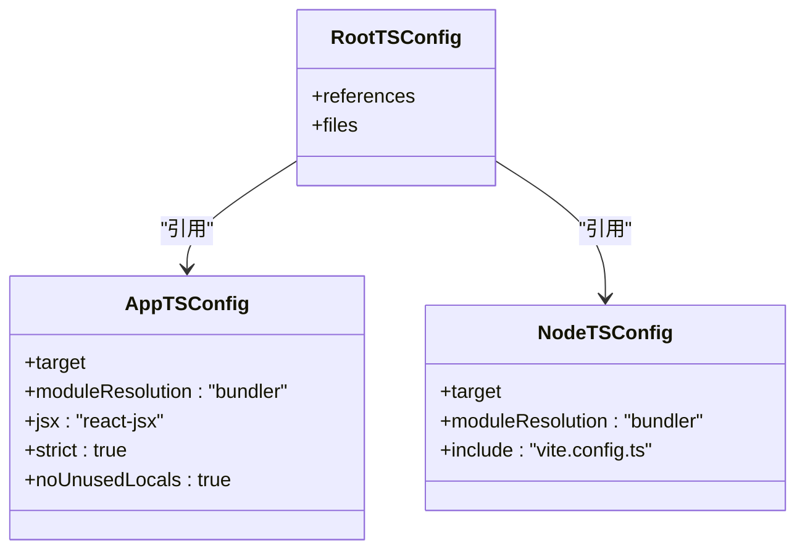
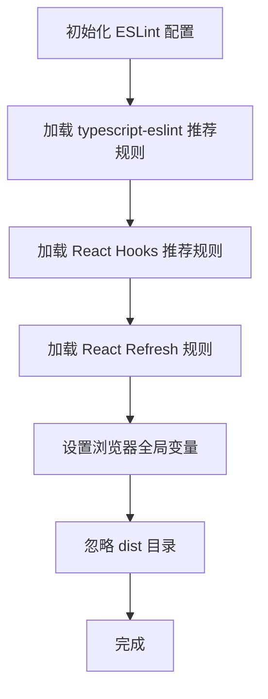
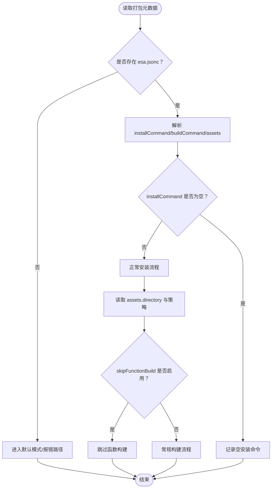
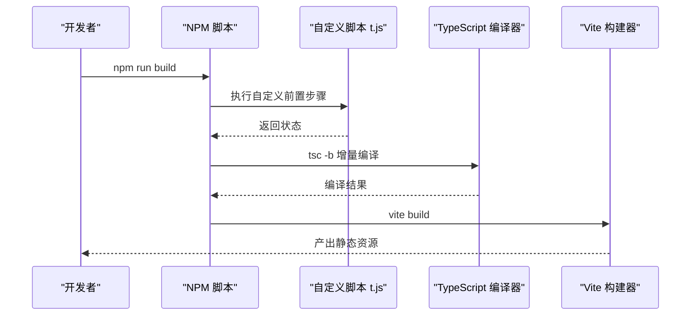
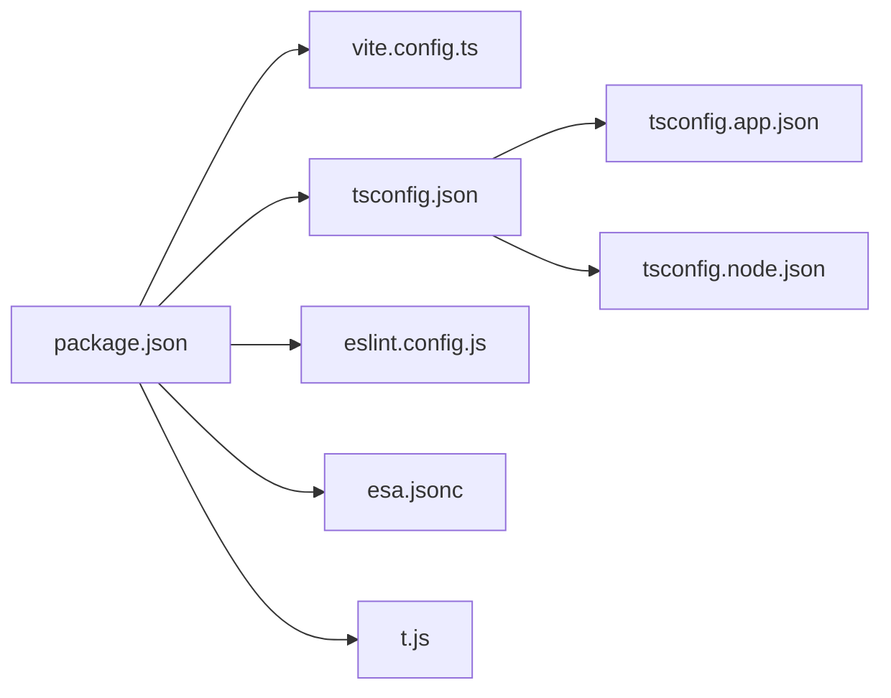

# 前端框架测试

<cite>
**本文引用的文件**
- [ReactVite/package.json](file://ReactVite/package.json)
- [ReactVite/vite.config.ts](file://ReactVite/vite.config.ts)
- [ReactVite/tsconfig.json](file://ReactVite/tsconfig.json)
- [ReactVite/tsconfig.app.json](file://ReactVite/tsconfig.app.json)
- [ReactVite/tsconfig.node.json](file://ReactVite/tsconfig.node.json)
- [ReactVite/eslint.config.js](file://ReactVite/eslint.config.js)
- [ReactVite/esa.jsonc](file://ReactVite/esa.jsonc)
- [ReactVite/t.js](file://ReactVite/t.js)
- [ReactVite-node-engine/package.json](file://ReactVite-node-engine/package.json)
- [ReactVite-jsonc-installCommand-empty/esa.jsonc](file://ReactVite-jsonc-installCommand-empty/esa.jsonc)
- [ReactVite-with-skip-bad-er/esa.jsonc](file://ReactVite-with-skip-bad-er/esa.jsonc)
- [ReactVite-without-esajsonc/package.json](file://ReactVite-without-esajsonc/package.json)
- [ReactVite-read-env/package.json](file://ReactVite-read-env/package.json)
- [backend-tests/README.md](file://backend-tests/README.md)
- [case.json](file://case.json)
</cite>

## 目录
1. [简介](#简介)
2. [项目结构](#项目结构)
3. [核心组件](#核心组件)
4. [架构总览](#架构总览)
5. [详细组件分析](#详细组件分析)
6. [依赖关系分析](#依赖关系分析)
7. [性能考虑](#性能考虑)
8. [故障排除指南](#故障排除指南)
9. [结论](#结论)
10. [附录](#附录)

## 简介
本文件面向前端框架测试模块，聚焦于 React Vite 项目的多种变体与测试场景，系统性阐述 Vite 构建配置、TypeScript 支持、ESLint 规则与构建优化策略。同时对不同测试变体（如缺失 esa.jsonc、缺失 package.json、Node 引擎要求等）进行目的与实现差异说明，并提供完整配置说明、故障排除指南与性能优化建议。

## 项目结构
该仓库包含多个前端与后端示例及测试用例，其中与 React Vite 测试相关的关键目录如下：
- ReactVite：标准 Vite + React + TypeScript + ESLint 配置
- ReactVite-node-engine：增加 engines.node 要求的变体
- ReactVite-jsonc-installCommand-empty：installCommand 为空的变体
- ReactVite-with-skip-bad-er：启用 skipFunctionBuild 的变体
- ReactVite-without-esajsonc：移除 esa.jsonc 的变体
- ReactVite-read-env：在构建脚本中执行自定义脚本的变体
- backend-tests：后端框架测试样例集合
- 根级配置：case.json、README.md 等

下图展示 ReactVite 及其变体的核心文件关系与职责分工：

图表来源
- [ReactVite/package.json:1-30](file://ReactVite/package.json#L1-L30)
- [ReactVite/vite.config.ts:1-8](file://ReactVite/vite.config.ts#L1-L8)
- [ReactVite/tsconfig.json:1-8](file://ReactVite/tsconfig.json#L1-L8)
- [ReactVite/tsconfig.app.json:1-28](file://ReactVite/tsconfig.app.json#L1-L28)
- [ReactVite/tsconfig.node.json:1-26](file://ReactVite/tsconfig.node.json#L1-L26)
- [ReactVite/eslint.config.js:1-24](file://ReactVite/eslint.config.js#L1-L24)
- [ReactVite/esa.jsonc:1-10](file://ReactVite/esa.jsonc#L1-L10)
- [ReactVite/t.js:1-1](file://ReactVite/t.js#L1-L1)
- [ReactVite-node-engine/package.json:1-33](file://ReactVite-node-engine/package.json#L1-L33)
- [ReactVite-jsonc-installCommand-empty/esa.jsonc:1-9](file://ReactVite-jsonc-installCommand-empty/esa.jsonc#L1-L9)
- [ReactVite-with-skip-bad-er/esa.jsonc:1-10](file://ReactVite-with-skip-bad-er/esa.jsonc#L1-L10)
- [ReactVite-without-esajsonc/package.json:1-30](file://ReactVite-without-esajsonc/package.json#L1-L30)
- [ReactVite-read-env/package.json:1-30](file://ReactVite-read-env/package.json#L1-L30)

章节来源
- [ReactVite/package.json:1-30](file://ReactVite/package.json#L1-L30)
- [ReactVite/vite.config.ts:1-8](file://ReactVite/vite.config.ts#L1-L8)
- [ReactVite/tsconfig.json:1-8](file://ReactVite/tsconfig.json#L1-L8)
- [ReactVite/tsconfig.app.json:1-28](file://ReactVite/tsconfig.app.json#L1-L28)
- [ReactVite/tsconfig.node.json:1-26](file://ReactVite/tsconfig.node.json#L1-L26)
- [ReactVite/eslint.config.js:1-24](file://ReactVite/eslint.config.js#L1-L24)
- [ReactVite/esa.jsonc:1-10](file://ReactVite/esa.jsonc#L1-L10)
- [ReactVite/t.js:1-1](file://ReactVite/t.js#L1-L1)
- [ReactVite-node-engine/package.json:1-33](file://ReactVite-node-engine/package.json#L1-L33)
- [ReactVite-jsonc-installCommand-empty/esa.jsonc:1-9](file://ReactVite-jsonc-installCommand-empty/esa.jsonc#L1-L9)
- [ReactVite-with-skip-bad-er/esa.jsonc:1-10](file://ReactVite-with-skip-bad-er/esa.jsonc#L1-L10)
- [ReactVite-without-esajsonc/package.json:1-30](file://ReactVite-without-esajsonc/package.json#L1-L30)
- [ReactVite-read-env/package.json:1-30](file://ReactVite-read-env/package.json#L1-L30)

## 核心组件
- 包管理与脚本（package.json）
  - 定义开发与生产脚本，集成 Vite、TypeScript、ESLint。
  - 标准项目包含自定义构建前置步骤（执行 t.js），部分变体调整或移除该步骤。
- Vite 构建配置（vite.config.ts）
  - 使用 @vitejs/plugin-react 插件，提供 React 开发体验与构建能力。
- TypeScript 配置（tsconfig.json、tsconfig.app.json、tsconfig.node.json）
  - 多配置分层：根配置引用应用与 Node 环境配置；应用配置启用 bundler 模式与严格类型检查；Node 配置聚焦工具链与 Vite 配置文件。
- ESLint 规则（eslint.config.js）
  - 使用 typescript-eslint 推荐规则集，结合 React Hooks 与 React Refresh 插件，限定浏览器全局变量。
- 平台打包元数据（esa.jsonc）
  - 定义安装命令、构建命令、产物目录与 SPA 回退策略；部分变体调整 installCommand 或新增 skipFunctionBuild 字段。
- 自定义构建前置脚本（t.js）
  - 在标准构建流程中插入自定义逻辑（例如打印提交信息），用于验证构建链路。

章节来源
- [ReactVite/package.json:6-11](file://ReactVite/package.json#L6-L11)
- [ReactVite/vite.config.ts:1-8](file://ReactVite/vite.config.ts#L1-L8)
- [ReactVite/tsconfig.json:1-8](file://ReactVite/tsconfig.json#L1-L8)
- [ReactVite/tsconfig.app.json:1-28](file://ReactVite/tsconfig.app.json#L1-L28)
- [ReactVite/tsconfig.node.json:1-26](file://ReactVite/tsconfig.node.json#L1-L26)
- [ReactVite/eslint.config.js:1-24](file://ReactVite/eslint.config.js#L1-L24)
- [ReactVite/esa.jsonc:1-10](file://ReactVite/esa.jsonc#L1-L10)
- [ReactVite/t.js:1-1](file://ReactVite/t.js#L1-L1)

## 架构总览
下图展示 React Vite 项目的典型构建与运行时流程，涵盖开发、预览与生产构建阶段，以及 ESLint 与 TypeScript 的参与点。

图表来源
- [ReactVite/package.json:6-11](file://ReactVite/package.json#L6-L11)
- [ReactVite/vite.config.ts:1-8](file://ReactVite/vite.config.ts#L1-L8)
- [ReactVite/eslint.config.js:1-24](file://ReactVite/eslint.config.js#L1-L24)
- [ReactVite/tsconfig.app.json:1-28](file://ReactVite/tsconfig.app.json#L1-L28)

章节来源
- [ReactVite/package.json:6-11](file://ReactVite/package.json#L6-L11)
- [ReactVite/vite.config.ts:1-8](file://ReactVite/vite.config.ts#L1-L8)
- [ReactVite/eslint.config.js:1-24](file://ReactVite/eslint.config.js#L1-L24)
- [ReactVite/tsconfig.app.json:1-28](file://ReactVite/tsconfig.app.json#L1-L28)

## 详细组件分析

### Vite 构建配置分析
- 插件体系
  - @vitejs/plugin-react 提供 React 快速刷新与 JSX 转换支持。
- 开发服务器与预览
  - dev 启动开发服务器；preview 启动本地预览服务器。
- 生产构建
  - vite build 生成静态资源，配合 tsconfig 的 bundler 模式与 moduleResolution=bundler 实现现代打包行为。

图表来源
- [ReactVite/package.json:6-11](file://ReactVite/package.json#L6-L11)
- [ReactVite/t.js:1-1](file://ReactVite/t.js#L1-L1)
- [ReactVite/vite.config.ts:1-8](file://ReactVite/vite.config.ts#L1-L8)

章节来源
- [ReactVite/vite.config.ts:1-8](file://ReactVite/vite.config.ts#L1-L8)
- [ReactVite/package.json:6-11](file://ReactVite/package.json#L6-L11)

### TypeScript 支持与配置策略
- 多配置分层
  - 根 tsconfig.json 通过 references 引用应用与 Node 配置，实现清晰的边界与增量编译。
- 应用配置（tsconfig.app.json）
  - 目标环境与模块解析采用 bundler 模式，启用 JSX 与严格模式，强化类型安全与未使用项检查。
- Node 配置（tsconfig.node.json）
  - 专注于工具链与 Vite 配置文件的类型检查，避免与应用层混淆。
- 构建优化
  - 使用 bundler 模式与 verbatimModuleSyntax，减少打包期额外转换，提升构建速度与兼容性。

图表来源
- [ReactVite/tsconfig.json:1-8](file://ReactVite/tsconfig.json#L1-L8)
- [ReactVite/tsconfig.app.json:1-28](file://ReactVite/tsconfig.app.json#L1-L28)
- [ReactVite/tsconfig.node.json:1-26](file://ReactVite/tsconfig.node.json#L1-L26)

章节来源
- [ReactVite/tsconfig.json:1-8](file://ReactVite/tsconfig.json#L1-L8)
- [ReactVite/tsconfig.app.json:1-28](file://ReactVite/tsconfig.app.json#L1-L28)
- [ReactVite/tsconfig.node.json:1-26](file://ReactVite/tsconfig.node.json#L1-L26)

### ESLint 规则与质量保障
- 规则集
  - 使用 typescript-eslint 推荐规则，结合 React Hooks 与 React Refresh 插件，确保 React + TS 场景下的最佳实践。
- 全局变量
  - 限定浏览器全局变量，避免误用 Node 环境 API。
- 忽略策略
  - 通过 globalIgnores 对 dist 目录进行忽略，避免重复扫描。

图表来源
- [ReactVite/eslint.config.js:1-24](file://ReactVite/eslint.config.js#L1-L24)

章节来源
- [ReactVite/eslint.config.js:1-24](file://ReactVite/eslint.config.js#L1-L24)

### 平台打包元数据（esa.jsonc）与测试变体
- 标准变体（ReactVite/esa.jsonc）
  - 定义安装命令、构建命令、产物目录与 SPA 回退策略。
- installCommand 为空（ReactVite-jsonc-installCommand-empty/esa.jsonc）
  - 用于测试平台在 installCommand 缺失或为空时的行为。
- skipFunctionBuild（ReactVite-with-skip-bad-er/esa.jsonc）
  - 用于测试平台跳过函数构建场景，验证回退或降级处理。
- 缺失 esa.jsonc（ReactVite-without-esajsonc）
  - 用于测试平台在缺少打包元数据时的默认行为与容错。
- Node 引擎要求（ReactVite-node-engine/package.json）
  - 通过 engines.node 指定 Node 版本，用于测试平台对引擎版本的校验与提示。

图表来源
- [ReactVite/esa.jsonc:1-10](file://ReactVite/esa.jsonc#L1-L10)
- [ReactVite-jsonc-installCommand-empty/esa.jsonc:1-9](file://ReactVite-jsonc-installCommand-empty/esa.jsonc#L1-L9)
- [ReactVite-with-skip-bad-er/esa.jsonc:1-10](file://ReactVite-with-skip-bad-er/esa.jsonc#L1-L10)
- [ReactVite-without-esajsonc/package.json:1-30](file://ReactVite-without-esajsonc/package.json#L1-L30)
- [ReactVite-node-engine/package.json:16-18](file://ReactVite-node-engine/package.json#L16-L18)

章节来源
- [ReactVite/esa.jsonc:1-10](file://ReactVite/esa.jsonc#L1-L10)
- [ReactVite-jsonc-installCommand-empty/esa.jsonc:1-9](file://ReactVite-jsonc-installCommand-empty/esa.jsonc#L1-L9)
- [ReactVite-with-skip-bad-er/esa.jsonc:1-10](file://ReactVite-with-skip-bad-er/esa.jsonc#L1-L10)
- [ReactVite-without-esajsonc/package.json:1-30](file://ReactVite-without-esajsonc/package.json#L1-L30)
- [ReactVite-node-engine/package.json:16-18](file://ReactVite-node-engine/package.json#L16-L18)

### 构建前置脚本与环境读取
- 标准构建链路
  - 在构建脚本中串联 t.js、tsc -b 与 vite build，确保类型检查与构建顺序正确。
- 环境读取变体
  - 通过在构建脚本中执行自定义脚本（如 t.js），验证构建链路中的可执行步骤与环境注入。

图表来源
- [ReactVite/package.json](file://ReactVite/package.json#L8)
- [ReactVite/t.js:1-1](file://ReactVite/t.js#L1-L1)
- [ReactVite/vite.config.ts:1-8](file://ReactVite/vite.config.ts#L1-L8)

章节来源
- [ReactVite/package.json:6-11](file://ReactVite/package.json#L6-L11)
- [ReactVite/t.js:1-1](file://ReactVite/t.js#L1-L1)

## 依赖关系分析
- 组件耦合
  - package.json 中的脚本与 Vite/TypeScript/ESLint 形成强耦合；tsconfig.json 作为多配置入口，分别约束应用与 Node 层。
- 外部依赖
  - React、React DOM、@vitejs/plugin-react、typescript、eslint 及其插件构成前端开发栈核心。
- 变体差异
  - 不同变体通过修改 esa.jsonc 或 package.json 的字段，影响平台侧的安装、构建与产物处理逻辑。

图表来源
- [ReactVite/package.json:1-30](file://ReactVite/package.json#L1-L30)
- [ReactVite/vite.config.ts:1-8](file://ReactVite/vite.config.ts#L1-L8)
- [ReactVite/tsconfig.json:1-8](file://ReactVite/tsconfig.json#L1-L8)
- [ReactVite/tsconfig.app.json:1-28](file://ReactVite/tsconfig.app.json#L1-L28)
- [ReactVite/tsconfig.node.json:1-26](file://ReactVite/tsconfig.node.json#L1-L26)
- [ReactVite/eslint.config.js:1-24](file://ReactVite/eslint.config.js#L1-L24)
- [ReactVite/esa.jsonc:1-10](file://ReactVite/esa.jsonc#L1-L10)
- [ReactVite/t.js:1-1](file://ReactVite/t.js#L1-L1)

章节来源
- [ReactVite/package.json:1-30](file://ReactVite/package.json#L1-L30)
- [ReactVite/tsconfig.json:1-8](file://ReactVite/tsconfig.json#L1-L8)

## 性能考虑
- 构建模式选择
  - 使用 bundler 模式的 moduleResolution 与 verbatimModuleSyntax，减少打包期转换开销，提升构建速度与兼容性。
- 增量编译
  - tsc -b 结合 tsconfig 的引用关系，实现多配置增量编译，缩短开发迭代周期。
- 严格类型检查
  - 在 tsconfig.app.json 中启用严格模式与未使用项检查，提前发现潜在问题，降低运行时风险。
- 产物目录与回退策略
  - 通过 esa.jsonc 的 assets.directory 与 SPA 回退策略，确保静态资源正确发布与路由兼容。

## 故障排除指南
- 缺少 esa.jsonc
  - 现象：平台无法识别安装/构建命令与产物目录。
  - 处理：在项目根目录补充 esa.jsonc，或确认平台默认行为是否满足需求。
  - 参考
    - [ReactVite-without-esajsonc/package.json:1-30](file://ReactVite-without-esajsonc/package.json#L1-L30)
- installCommand 为空
  - 现象：平台可能跳过安装步骤或报错。
  - 处理：在 esa.jsonc 中设置有效的安装命令，或根据平台文档调整策略。
  - 参考
    - [ReactVite-jsonc-installCommand-empty/esa.jsonc:1-9](file://ReactVite-jsonc-installCommand-empty/esa.jsonc#L1-L9)
- skipFunctionBuild 启用
  - 现象：平台跳过函数构建，直接进入静态资源处理。
  - 处理：确认业务场景允许跳过函数构建，否则关闭该选项。
  - 参考
    - [ReactVite-with-skip-bad-er/esa.jsonc:1-10](file://ReactVite-with-skip-bad-er/esa.jsonc#L1-L10)
- Node 引擎版本不匹配
  - 现象：平台提示引擎版本不符合要求。
  - 处理：升级/降级 Node 版本以满足 engines.node 要求，或调整项目配置。
  - 参考
    - [ReactVite-node-engine/package.json:16-18](file://ReactVite-node-engine/package.json#L16-L18)
- 构建前置脚本失败
  - 现象：构建脚本在执行 t.js 时中断。
  - 处理：检查 t.js 的执行权限与输出日志，修复脚本逻辑后再重试。
  - 参考
    - [ReactVite/package.json](file://ReactVite/package.json#L8)
    - [ReactVite/t.js:1-1](file://ReactVite/t.js#L1-L1)
- ESLint 报错
  - 现象：ESLint 规则导致构建失败。
  - 处理：根据 eslint.config.js 的规则集修正代码风格与类型问题。
  - 参考
    - [ReactVite/eslint.config.js:1-24](file://ReactVite/eslint.config.js#L1-L24)

章节来源
- [ReactVite-without-esajsonc/package.json:1-30](file://ReactVite-without-esajsonc/package.json#L1-L30)
- [ReactVite-jsonc-installCommand-empty/esa.jsonc:1-9](file://ReactVite-jsonc-installCommand-empty/esa.jsonc#L1-L9)
- [ReactVite-with-skip-bad-er/esa.jsonc:1-10](file://ReactVite-with-skip-bad-er/esa.jsonc#L1-L10)
- [ReactVite-node-engine/package.json:16-18](file://ReactVite-node-engine/package.json#L16-L18)
- [ReactVite/package.json](file://ReactVite/package.json#L8)
- [ReactVite/t.js:1-1](file://ReactVite/t.js#L1-L1)
- [ReactVite/eslint.config.js:1-24](file://ReactVite/eslint.config.js#L1-L24)

## 结论
本测试模块围绕 React Vite 项目提供了从配置到构建、从 TypeScript 到 ESLint 的全链路覆盖，并通过多种变体验证平台在不同配置下的行为与容错能力。建议在实际项目中遵循多配置分层、严格类型检查与合理的构建前置策略，以获得稳定且高性能的开发与发布体验。

## 附录
- 后端测试集合说明
  - backend-tests 目录包含多种后端框架的测试样例，便于对比前后端测试策略与配置差异。
  - 参考
    - [backend-tests/README.md](file://backend-tests/README.md)
- 测试用例清单
  - case.json 提供测试用例的统一描述与执行策略，建议结合各变体逐一验证。
  - 参考
    - [case.json](file://case.json)