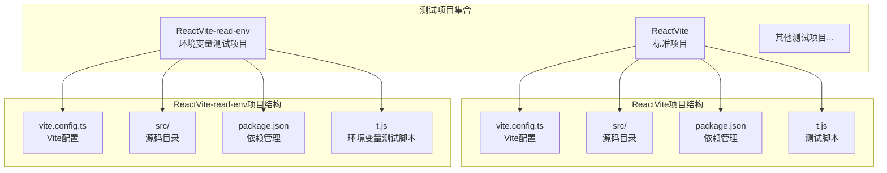
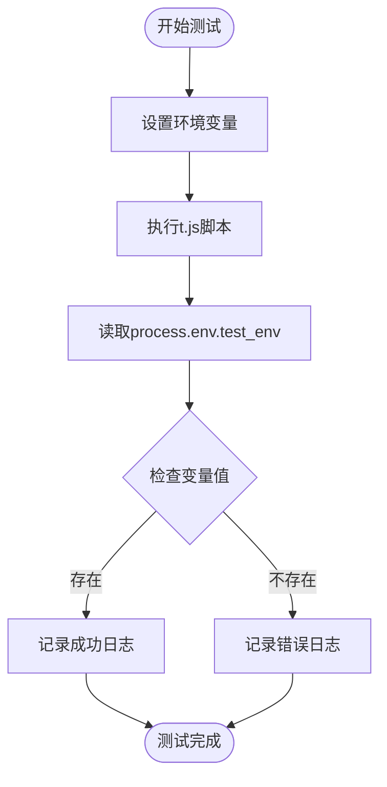
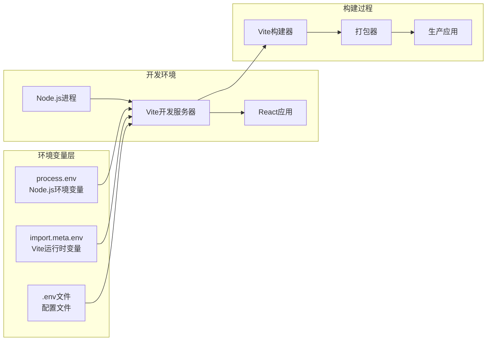
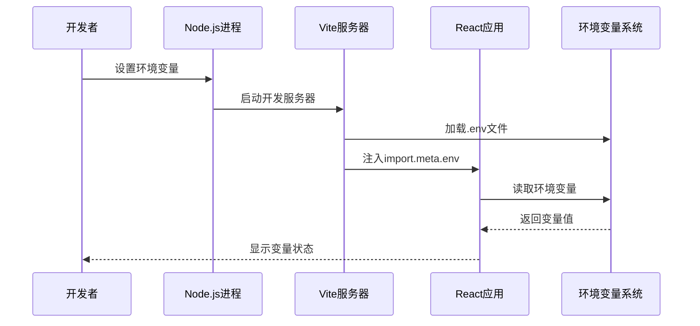
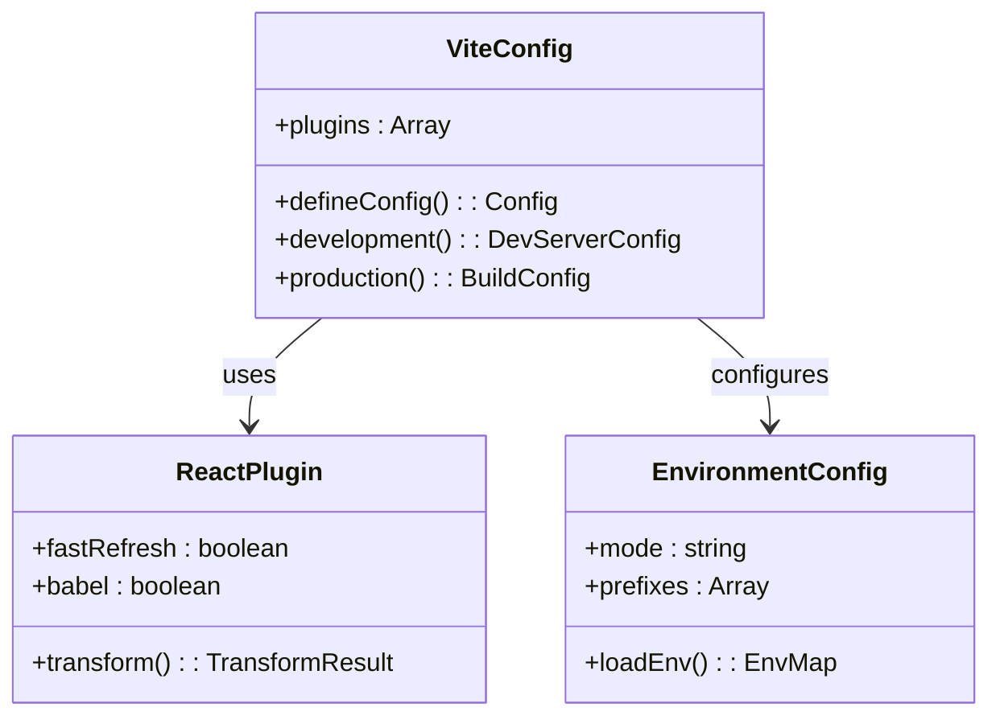
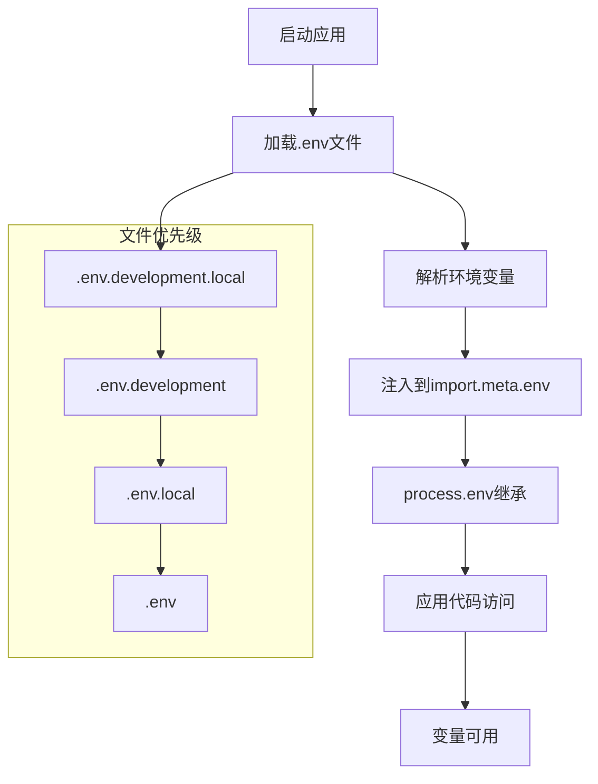
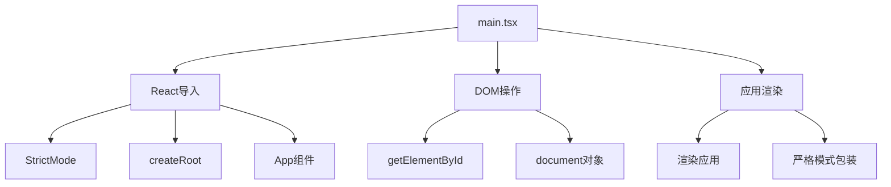
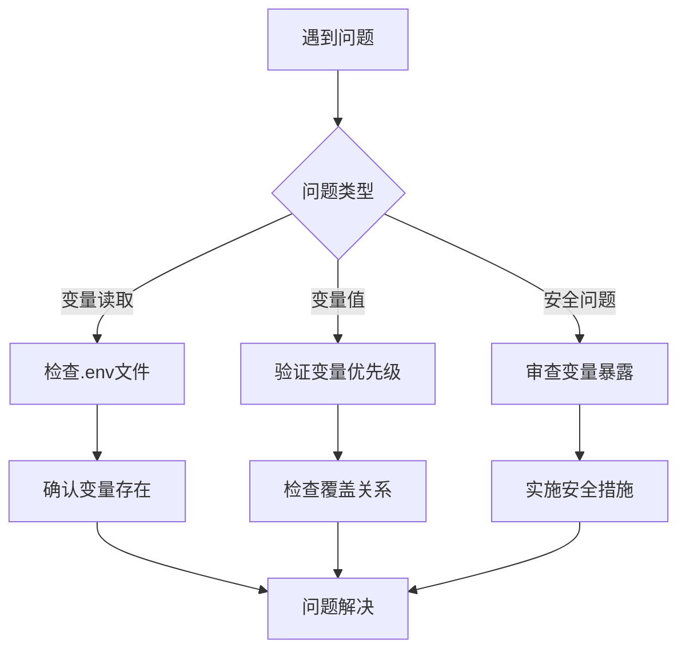

# 环境变量读取测试

<cite>
**本文档引用的文件**
- [ReactVite/vite.config.ts](file://ReactVite/vite.config.ts)
- [ReactVite/src/App.tsx](file://ReactVite/src/App.tsx)
- [ReactVite/src/main.tsx](file://ReactVite/src/main.tsx)
- [ReactVite/src/vite-env.d.ts](file://ReactVite/src/vite-env.d.ts)
- [ReactVite/package.json](file://ReactVite/package.json)
- [ReactVite/README.md](file://ReactVite/README.md)
- [ReactVite/t.js](file://ReactVite/t.js)
- [ReactVite-read-env/vite.config.ts](file://ReactVite-read-env/vite.config.ts)
- [ReactVite-read-env/src/App.tsx](file://ReactVite-read-env/src/App.tsx)
- [ReactVite-read-env/src/main.tsx](file://ReactVite-read-env/src/main.tsx)
- [ReactVite-read-env/src/vite-env.d.ts](file://ReactVite-read-env/src/vite-env.d.ts)
- [ReactVite-read-env/package.json](file://ReactVite-read-env/package.json)
- [ReactVite-read-env/README.md](file://ReactVite-read-env/README.md)
- [ReactVite-read-env/t.js](file://ReactVite-read-env/t.js)
- [README.md](file://README.md)
</cite>

## 目录
1. [简介](#简介)
2. [项目结构](#项目结构)
3. [核心组件](#核心组件)
4. [架构概览](#架构概览)
5. [详细组件分析](#详细组件分析)
6. [依赖关系分析](#依赖关系分析)
7. [性能考虑](#性能考虑)
8. [故障排除指南](#故障排除指南)
9. [结论](#结论)

## 简介

本项目是一个专门用于测试React Vite环境中变量读取的测试案例集合。该项目通过对比两个相似的React Vite项目来演示Vite如何处理和注入环境变量，重点展示`process.env`和`import.meta.env`两种环境变量访问方式的区别。

项目包含两个主要测试场景：
- **ReactVite项目**：标准的React Vite应用，展示了基本的环境变量处理
- **ReactVite-read-env项目**：专门用于测试环境变量读取的应用，通过`t.js`脚本演示了`process.env`变量的读取

## 项目结构

整个测试项目采用多项目并行结构，每个项目都包含完整的React Vite应用骨架：



**图表来源**
- [ReactVite/vite.config.ts:1-8](file://ReactVite/vite.config.ts#L1-L8)
- [ReactVite-read-env/vite.config.ts:1-8](file://ReactVite-read-env/vite.config.ts#L1-L8)

**章节来源**
- [ReactVite/package.json:1-30](file://ReactVite/package.json#L1-L30)
- [ReactVite-read-env/package.json:1-30](file://ReactVite-read-env/package.json#L1-L30)

## 核心组件

### Vite配置组件

两个项目都使用相同的Vite配置模式，主要特点包括：

- **插件系统**：统一使用`@vitejs/plugin-react`插件
- **开发服务器**：标准的Vite开发服务器配置
- **构建优化**：针对React应用的优化设置

### 应用入口组件

两个项目都包含标准的React应用入口点：

- **main.tsx**：应用的根入口文件
- **App.tsx**：主应用组件
- **类型声明**：通过`vite-env.d.ts`提供类型支持

### 环境变量测试组件

**ReactVite-read-env项目**中的`t.js`文件是环境变量测试的核心：



**图表来源**
- [ReactVite-read-env/t.js:1-1](file://ReactVite-read-env/t.js#L1-L1)

**章节来源**
- [ReactVite/src/main.tsx:1-11](file://ReactVite/src/main.tsx#L1-L11)
- [ReactVite/src/App.tsx:1-36](file://ReactVite/src/App.tsx#L1-L36)
- [ReactVite-read-env/src/main.tsx:1-11](file://ReactVite-read-env/src/main.tsx#L1-L11)
- [ReactVite-read-env/src/App.tsx:1-36](file://ReactVite-read-env/src/App.tsx#L1-L36)

## 架构概览

### 环境变量处理架构



**图表来源**
- [ReactVite/vite.config.ts:1-8](file://ReactVite/vite.config.ts#L1-L8)
- [ReactVite/package.json:6-11](file://ReactVite/package.json#L6-L11)

### 环境变量读取流程



**图表来源**
- [ReactVite-read-env/t.js:1-1](file://ReactVite-read-env/t.js#L1-L1)
- [ReactVite/src/vite-env.d.ts:1-2](file://ReactVite/src/vite-env.d.ts#L1-L2)

## 详细组件分析

### Vite配置分析

两个项目都使用相同的配置模式，体现了Vite的核心设计理念：

#### 配置文件结构

| 配置项 | ReactVite | ReactVite-read-env |
|--------|-----------|-------------------|
| 插件配置 | `@vitejs/plugin-react` | `@vitejs/plugin-react` |
| 开发服务器 | 标准配置 | 标准配置 |
| 构建输出 | 默认设置 | 默认设置 |

#### 配置最佳实践



**图表来源**
- [ReactVite/vite.config.ts:1-8](file://ReactVite/vite.config.ts#L1-L8)
- [ReactVite-read-env/vite.config.ts:1-8](file://ReactVite-read-env/vite.config.ts#L1-L8)

**章节来源**
- [ReactVite/vite.config.ts:1-8](file://ReactVite/vite.config.ts#L1-L8)
- [ReactVite-read-env/vite.config.ts:1-8](file://ReactVite-read-env/vite.config.ts#L1-L8)

### 环境变量处理机制

#### process.env vs import.meta.env

| 特性 | process.env | import.meta.env |
|------|-------------|-----------------|
| **作用域** | Node.js全局对象 | Vite运行时对象 |
| **构建时处理** | 编译期替换 | 运行时访问 |
| **安全性** | 完全暴露 | 受限访问 |
| **性能** | 直接访问 | 间接访问 |
| **可预测性** | 确定性 | 取决于构建 |

#### 环境变量加载顺序



**图表来源**
- [ReactVite/src/vite-env.d.ts:1-2](file://ReactVite/src/vite-env.d.ts#L1-L2)

**章节来源**
- [ReactVite/src/vite-env.d.ts:1-2](file://ReactVite/src/vite-env.d.ts#L1-L2)
- [ReactVite-read-env/src/vite-env.d.ts:1-2](file://ReactVite-read-env/src/vite-env.d.ts#L1-L2)

### 应用入口分析

#### 主入口文件结构

两个项目都遵循相同的入口文件模式：



**图表来源**
- [ReactVite/src/main.tsx:1-11](file://ReactVite/src/main.tsx#L1-L11)
- [ReactVite-read-env/src/main.tsx:1-11](file://ReactVite-read-env/src/main.tsx#L1-L11)

**章节来源**
- [ReactVite/src/main.tsx:1-11](file://ReactVite/src/main.tsx#L1-L11)
- [ReactVite/src/App.tsx:1-36](file://ReactVite/src/App.tsx#L1-L36)
- [ReactVite-read-env/src/main.tsx:1-11](file://ReactVite-read-env/src/main.tsx#L1-L11)
- [ReactVite-read-env/src/App.tsx:1-36](file://ReactVite-read-env/src/App.tsx#L1-L36)

## 依赖关系分析

### 项目依赖结构

```mermaid
graph TB
subgraph "ReactVite项目"
A[React应用]
B[Vite构建工具]
C[TypeScript支持]
D[ESLint规则]
end
subgraph "开发依赖"
E[@vitejs/plugin-react]
F[typescript]
G[eslint相关包]
H[globals]
I[typescript-eslint]
end
subgraph "运行时依赖"
J[react]
K[react-dom]
end
A --> J
A --> K
B --> E
B --> F
B --> G
B --> H
B --> I
```

**图表来源**
- [ReactVite/package.json:12-28](file://ReactVite/package.json#L12-L28)

### 环境变量相关依赖

| 依赖包 | 版本 | 用途 |
|--------|------|------|
| `vite` | ^7.1.2 | 核心构建工具 |
| `@vitejs/plugin-react` | ^5.0.0 | React插件支持 |
| `react` | ^19.1.1 | 用户界面库 |
| `react-dom` | ^19.1.1 | DOM渲染库 |
| `typescript` | ~5.8.3 | 类型检查 |
| `eslint` | ^9.33.0 | 代码质量 |

**章节来源**
- [ReactVite/package.json:1-30](file://ReactVite/package.json#L1-L30)
- [ReactVite-read-env/package.json:1-30](file://ReactVite-read-env/package.json#L1-L30)

## 性能考虑

### 环境变量性能影响

1. **构建时优化**
   - `import.meta.env`变量在构建时被静态分析
   - 未使用的变量会被Tree-shaking移除
   - 减少运行时开销

2. **内存使用**
   - `process.env`完全暴露给客户端
   - 可能导致意外的内存泄漏
   - 建议仅在必要时使用

3. **缓存策略**
   - 开发环境下的热更新
   - 生产环境下的缓存优化
   - 环境变量变更的重新构建

## 故障排除指南

### 常见环境变量问题

#### 问题1：变量无法读取

**症状**：`process.env.VARIABLE_NAME`返回`undefined`

**解决方案**：
1. 检查变量是否正确设置在`.env`文件中
2. 确认变量名符合Vite命名约定
3. 验证构建命令是否正确执行

#### 问题2：变量值不正确

**症状**：读取到的变量值与预期不符

**解决方案**：
1. 检查变量的优先级顺序
2. 确认是否有多个同名变量定义
3. 验证变量的类型转换

#### 问题3：安全风险

**症状**：敏感信息泄露

**解决方案**：
1. 使用`VITE_`前缀标记公开变量
2. 避免在客户端暴露敏感信息
3. 实施适当的访问控制

### 调试技巧



**章节来源**
- [ReactVite/t.js:1-1](file://ReactVite/t.js#L1-L1)
- [ReactVite-read-env/t.js:1-1](file://ReactVite-read-env/t.js#L1-L1)

## 结论

本测试项目成功演示了React Vite环境中环境变量的处理机制，通过对比两个相似项目展示了以下关键概念：

1. **Vite环境变量系统**：`import.meta.env`提供了更安全、更可控的环境变量访问方式
2. **构建时优化**：Vite能够智能地处理和优化环境变量的使用
3. **安全最佳实践**：通过正确的变量命名和访问方式确保应用安全
4. **开发体验**：提供了良好的开发和调试体验

建议在实际项目中：
- 优先使用`import.meta.env`而非`process.env`
- 正确设置环境变量前缀
- 实施适当的安全措施
- 建立完善的测试流程

这些实践将帮助开发者构建更加安全、高效的React应用。