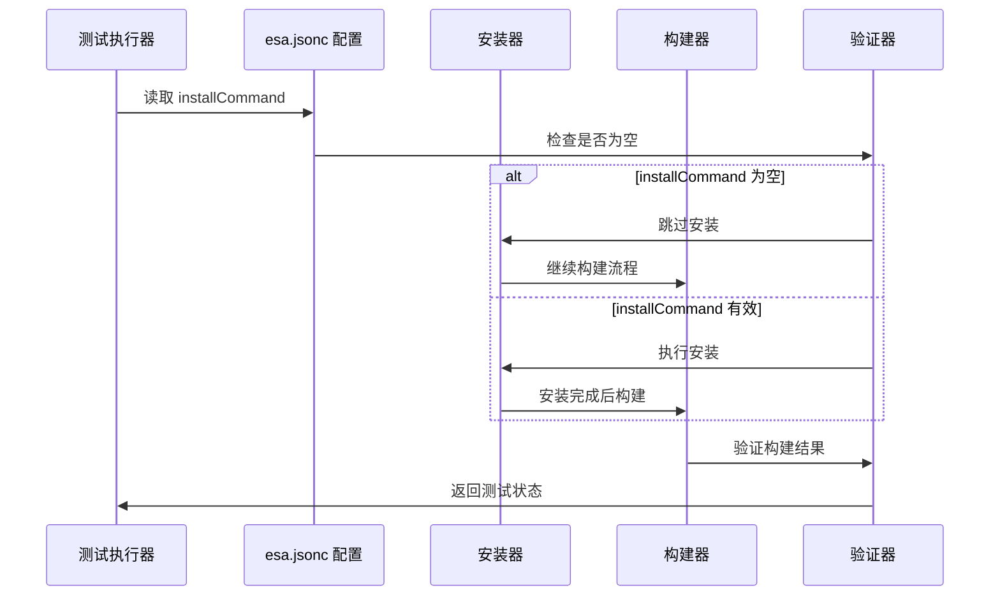
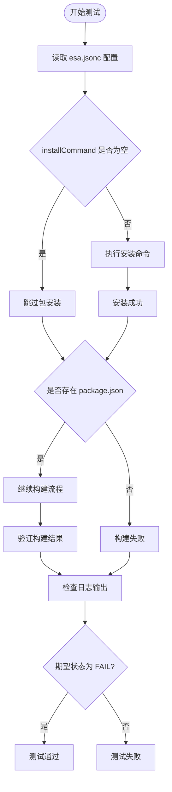

# 空 installCommand 的 esajsonc 测试

<cite>
**本文档引用的文件**
- [ReactVite-jsonc-installCommand-empty/esa.jsonc](file://ReactVite-jsonc-installCommand-empty/esa.jsonc)
- [ReactVite/esa.jsonc](file://ReactVite/esa.jsonc)
- [ReactVite-jsonc-installCommand-empty/package.json](file://ReactVite-jsonc-installCommand-empty/package.json)
- [ReactVite/package.json](file://ReactVite/package.json)
- [ReactVite-jsonc-installCommand-empty/vite.config.ts](file://ReactVite-jsonc-installCommand-empty/vite.config.ts)
- [ReactVite/vite.config.ts](file://ReactVite/vite.config.ts)
- [case.json](file://case.json)
- [ReactVite-jsonc-installCommand-empty/README.md](file://ReactVite-jsonc-installCommand-empty/README.md)
- [ReactVite/README.md](file://ReactVite/README.md)
- [ReactVite-without-esajsonc/package.json](file://ReactVite-without-esajsonc/package.json)
- [ReactVite-without-package/package.json](file://ReactVite-without-package/package.json)
- [ReactVite/t.js](file://ReactVite/t.js)
</cite>

## 目录
1. [简介](#简介)
2. [项目结构](#项目结构)
3. [核心组件](#核心组件)
4. [架构概览](#架构概览)
5. [详细组件分析](#详细组件分析)
6. [依赖关系分析](#依赖关系分析)
7. [性能考虑](#性能考虑)
8. [故障排除指南](#故障排除指南)
9. [结论](#结论)
10. [附录](#附录)

## 简介

本项目旨在测试 React Vite 项目中 `esa.jsonc` 配置文件里 `installCommand` 字段为空字符串时的特殊处理逻辑。这是一个关键的边界条件测试，用于验证构建系统如何处理缺失或无效的安装命令。

该测试通过对比两个相似的 React Vite 项目配置来展示不同 `installCommand` 设置对构建流程的影响：

- **ReactVite-jsonc-installCommand-empty**: `installCommand` 为空字符串
- **ReactVite**: 正常的 `installCommand` 配置

## 项目结构

```mermaid
graph TB
subgraph "React Vite 测试项目"
A[ReactVite-jsonc-installCommand-empty/] --> A1[esa.jsonc<br/>installCommand = ""]
A --> A2[package.json<br/>标准 React Vite 配置]
A --> A3[vite.config.ts<br/>React 插件配置]
B[ReactVite/] --> B1[esa.jsonc<br/>installCommand = "bun install"]
B --> B2[package.json<br/>包含自定义脚本]
B --> B3[vite.config.ts<br/>React 插件配置]
C[测试配置 case.json] --> C1[边界条件测试]
C --> C2[日志验证]
C --> C3[状态检查]
end
subgraph "相关变体项目"
D[ReactVite-without-esajsonc/] --> D1[无 esa.jsonc 配置]
E[ReactVite-without-package/] --> E1[无 package.json]
F[ReactVite-node-engine/] --> F1[Node 版本引擎配置]
G[ReactVite-read-env/] --> G1[环境变量读取]
end
A1 -.-> C1
B1 -.-> C1
C1 --> C2
C1 --> C3
```

**图表来源**
- [ReactVite-jsonc-installCommand-empty/esa.jsonc:1-9](file://ReactVite-jsonc-installCommand-empty/esa.jsonc#L1-L9)
- [ReactVite/esa.jsonc:1-10](file://ReactVite/esa.jsonc#L1-L10)
- [case.json:134-145](file://case.json#L134-L145)

**章节来源**
- [ReactVite-jsonc-installCommand-empty/esa.jsonc:1-9](file://ReactVite-jsonc-installCommand-empty/esa.jsonc#L1-L9)
- [ReactVite/esa.jsonc:1-10](file://ReactVite/esa.jsonc#L1-L10)
- [case.json:134-145](file://case.json#L134-L145)

## 核心组件

### 配置文件对比分析

#### 空 installCommand 配置
ReactVite-jsonc-installCommand-empty 项目中的关键配置特点：
- `installCommand`: 空字符串 `""`
- `assets.directory`: `"./dist"`
- `assets.notFoundStrategy`: `"singlePageApplication"`

#### 正常配置对比
ReactVite 项目中的配置特点：
- `installCommand`: `"bun install"`
- `buildCommand`: `"npm run build"`
- `assets.directory`: `"./dist"`
- 包含自定义构建脚本 `t.js`

### 构建脚本差异

两个项目在构建脚本上的关键区别：

| 项目 | installCommand | buildCommand | 自定义脚本 |
|------|----------------|--------------|------------|
| ReactVite-jsonc-installCommand-empty | 空字符串 | 未设置 | 无 |
| ReactVite | "bun install" | "npm run build" | 包含 t.js |

**章节来源**
- [ReactVite-jsonc-installCommand-empty/esa.jsonc:1-9](file://ReactVite-jsonc-installCommand-empty/esa.jsonc#L1-L9)
- [ReactVite/esa.jsonc:1-10](file://ReactVite/esa.jsonc#L1-L10)
- [ReactVite-jsonc-installCommand-empty/package.json:1-30](file://ReactVite-jsonc-installCommand-empty/package.json#L1-L30)
- [ReactVite/package.json:1-30](file://ReactVite/package.json#L1-L30)

## 架构概览



**图表来源**
- [ReactVite-jsonc-installCommand-empty/esa.jsonc:3-3](file://ReactVite-jsonc-installCommand-empty/esa.jsonc#L3-L3)
- [case.json:142-144](file://case.json#L142-L144)

### 处理流程图



**图表来源**
- [ReactVite-jsonc-installCommand-empty/esa.jsonc:3-3](file://ReactVite-jsonc-installCommand-empty/esa.jsonc#L3-L3)
- [case.json:142-144](file://case.json#L142-L144)

## 详细组件分析

### esa.jsonc 配置文件分析

#### ReactVite-jsonc-installCommand-empty 配置
该配置文件展示了空 `installCommand` 的完整配置结构：

```jsonc
{
  "name": "vite-react-template",
  "installCommand": "",  // 关键：空字符串
  "assets": {
    "directory": "./dist",
    "notFoundStrategy": "singlePageApplication"
  }
}
```

#### ReactVite 正常配置对比
正常配置包含完整的安装和构建指令：

```jsonc
{
  "name": "vite-react-template",
  "installCommand": "bun install",
  "buildCommand": "npm run build",
  "assets": {
    "directory": "./dist",
    "notFoundStrategy": "singlePageApplication"
  }
}
```

### 构建流程差异

#### 空 installCommand 处理逻辑
当 `installCommand` 为空时，系统执行以下处理流程：

1. **配置验证**: 检测到空字符串安装命令
2. **安装跳过**: 跳过包管理器安装步骤
3. **依赖检查**: 验证是否存在 `package.json`
4. **构建决策**: 根据是否存在 `package.json` 决定后续操作

#### 正常安装流程
当 `installCommand` 有效时，系统执行标准的安装流程：

1. **安装执行**: 运行指定的包管理器命令
2. **依赖解析**: 解析和安装项目依赖
3. **构建准备**: 准备构建环境
4. **构建执行**: 执行构建脚本

**章节来源**
- [ReactVite-jsonc-installCommand-empty/esa.jsonc:1-9](file://ReactVite-jsonc-installCommand-empty/esa.jsonc#L1-L9)
- [ReactVite/esa.jsonc:1-10](file://ReactVite/esa.jsonc#L1-L10)
- [case.json:142-144](file://case.json#L142-L144)

### Vite 配置对比

两个项目都使用相同的 Vite 配置，确保构建工具链的一致性：

```typescript
import { defineConfig } from 'vite'
import react from '@vitejs/plugin-react'

export default defineConfig({
  plugins: [react()],
})
```

这种一致性设计使得测试重点集中在 `installCommand` 配置差异上，而不是构建工具配置差异。

**章节来源**
- [ReactVite-jsonc-installCommand-empty/vite.config.ts:1-8](file://ReactVite-jsonc-installCommand-empty/vite.config.ts#L1-L8)
- [ReactVite/vite.config.ts:1-8](file://ReactVite/vite.config.ts#L1-L8)

## 依赖关系分析

### 测试用例设计

```mermaid
graph LR
subgraph "测试场景"
A[空 installCommand 场景] --> A1[预期: FAIL]
A --> A2[日志: "Cannot find package.json or installCommand is empty, skipping installation"]
B[正常 installCommand 场景] --> B1[预期: SUCCESS]
B --> B2[日志: 标准构建流程]
C[无 package.json 场景] --> C1[预期: FAIL]
C --> C2[日志: "Cannot find package.json or installCommand is empty, skipping installation..."]
end
subgraph "验证机制"
D[日志文本检查]
E[构建状态验证]
F[错误消息匹配]
end
A1 --> D
A2 --> E
B1 --> D
B2 --> E
C1 --> D
C2 --> E
```

**图表来源**
- [case.json:134-145](file://case.json#L134-L145)
- [case.json:162-173](file://case.json#L162-L173)

### 配置验证方法

#### 配置文件验证
1. **字段完整性检查**: 验证 `installCommand` 字段存在且类型正确
2. **空值处理**: 确认空字符串被正确识别为无效安装命令
3. **默认值处理**: 验证系统对空配置的默认行为

#### 构建流程验证
1. **安装步骤跳过**: 确认空 `installCommand` 导致安装步骤被跳过
2. **依赖检查**: 验证系统检查 `package.json` 存在性
3. **构建决策**: 确认基于配置的构建流程选择

**章节来源**
- [case.json:134-145](file://case.json#L134-L145)
- [case.json:162-173](file://case.json#L162-L173)

## 性能考虑

### 空 installCommand 的性能影响

1. **时间节省**: 跳过安装步骤显著减少构建时间
2. **资源节约**: 避免不必要的包管理器调用
3. **网络优化**: 不进行远程依赖下载

### 构建效率对比

| 方面 | 空 installCommand | 正常 installCommand |
|------|-------------------|---------------------|
| 安装时间 | 0ms | 取决于依赖数量 |
| 网络使用 | 0KB | 依赖下载量 |
| 磁盘IO | 0KB | 依赖安装 |
| 内存占用 | 降低 | 增加 |
| 构建速度 | 快速 | 取决于安装速度 |

## 故障排除指南

### 常见问题及解决方案

#### 问题1: 构建失败但期望成功
**症状**: 空 `installCommand` 配置导致构建失败
**原因**: 系统检测到空安装命令并跳过安装
**解决方案**: 
- 提供有效的 `installCommand` 配置
- 确保项目包含 `package.json`
- 检查构建命令配置

#### 问题2: 日志信息不明确
**症状**: 错误日志不够具体
**原因**: 缺少详细的错误信息
**解决方案**:
- 检查 `case.json` 中的日志验证配置
- 添加更详细的日志记录
- 验证错误消息格式

#### 问题3: 配置验证失败
**症状**: 配置文件解析错误
**原因**: JSON 格式或语法错误
**解决方案**:
- 使用 JSON 验证工具检查配置文件
- 确认所有字符串都正确转义
- 验证配置文件编码

### 调试技巧

1. **日志分析**: 仔细检查测试日志中的错误消息
2. **配置对比**: 对比正常和异常配置文件的差异
3. **环境隔离**: 确保测试环境的独立性
4. **逐步验证**: 分别测试每个配置项的影响

**章节来源**
- [case.json:142-144](file://case.json#L142-L144)
- [case.json:171-172](file://case.json#L171-L172)

## 结论

空 `installCommand` 配置测试展示了构建系统对边界条件的健壮处理能力。该测试验证了以下关键点：

1. **配置验证**: 系统能够正确识别和处理空的安装命令
2. **流程控制**: 空配置导致安装步骤的智能跳过
3. **错误处理**: 清晰的错误消息帮助诊断问题
4. **测试覆盖**: 全面的测试用例确保功能正确性

这种设计确保了构建系统的稳定性和可靠性，即使在配置不完整的情况下也能提供有意义的反馈和适当的处理策略。

## 附录

### 相关测试项目对比

| 项目 | installCommand | package.json | 构建结果 |
|------|----------------|--------------|----------|
| ReactVite-jsonc-installCommand-empty | "" | 存在 | FAIL（预期） |
| ReactVite | "bun install" | 存在 | SUCCESS |
| ReactVite-without-esajsonc | 未设置 | 存在 | SUCCESS |
| ReactVite-without-package | 未设置 | 不存在 | FAIL（预期） |

### 配置最佳实践

1. **明确配置**: 始终提供清晰的 `installCommand` 配置
2. **备份方案**: 考虑无配置时的降级策略
3. **错误处理**: 实现完善的错误处理和用户提示
4. **测试覆盖**: 确保边界条件得到充分测试