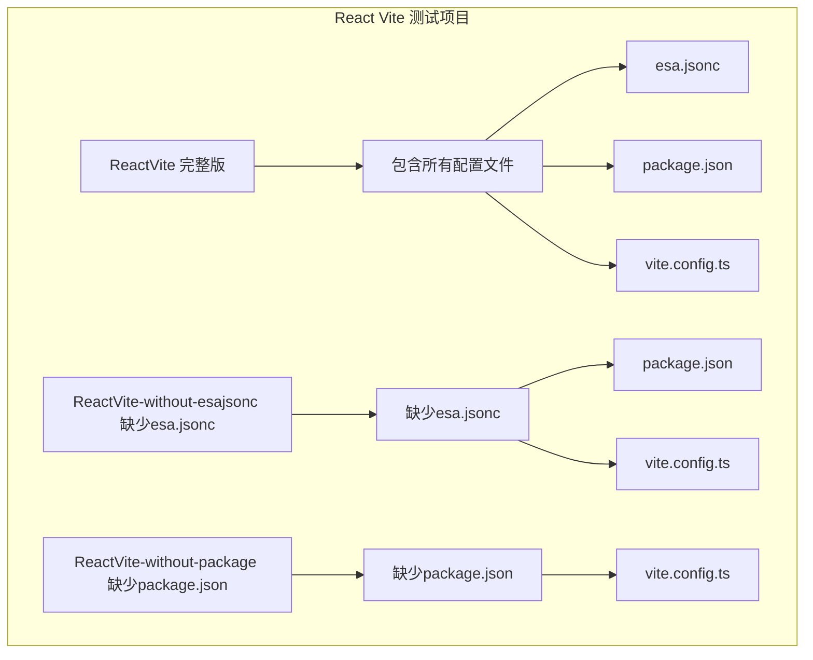
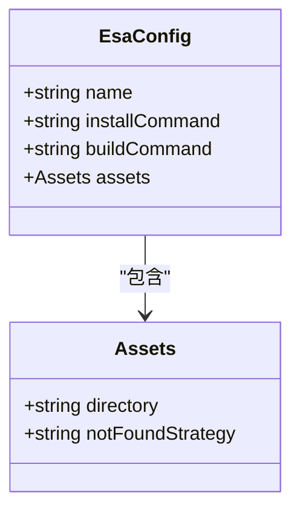
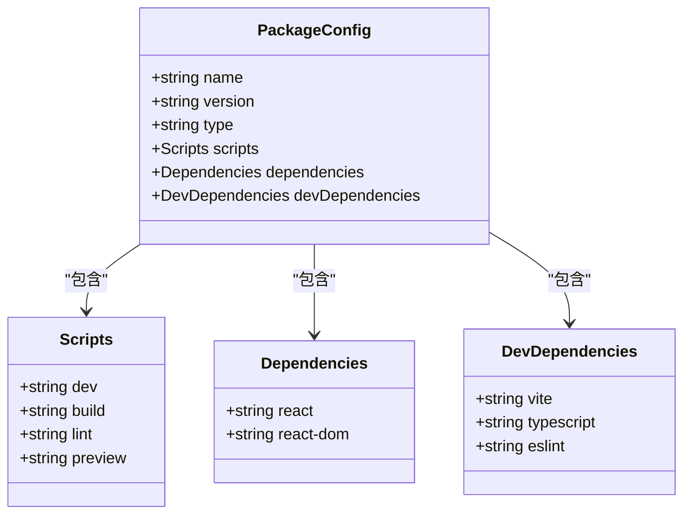
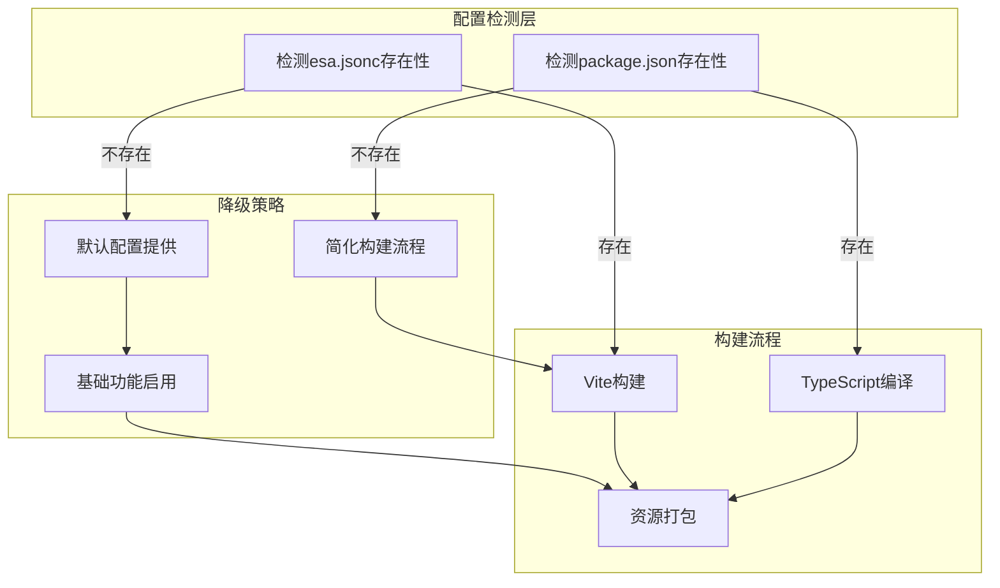
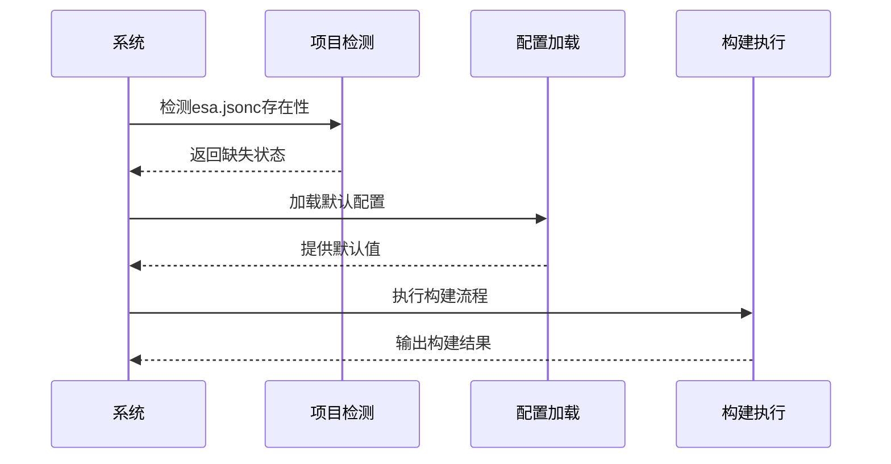
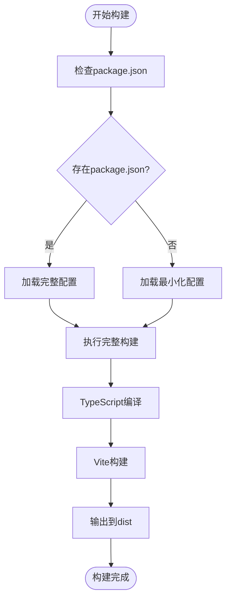
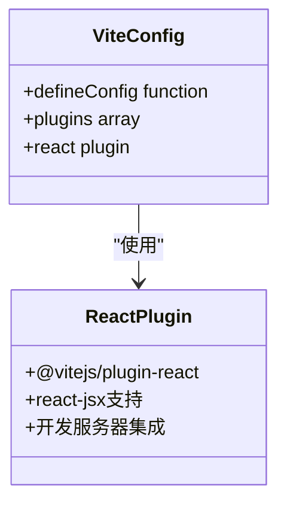
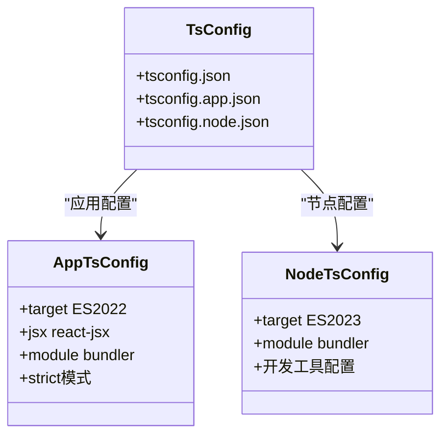
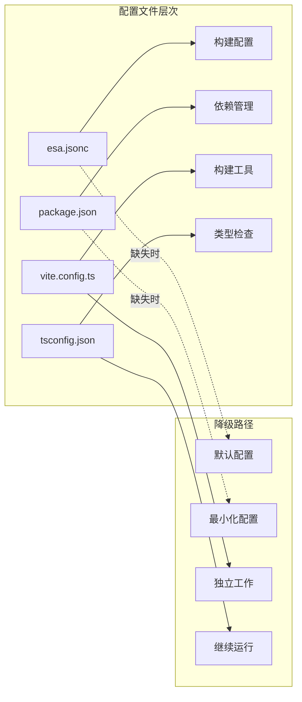
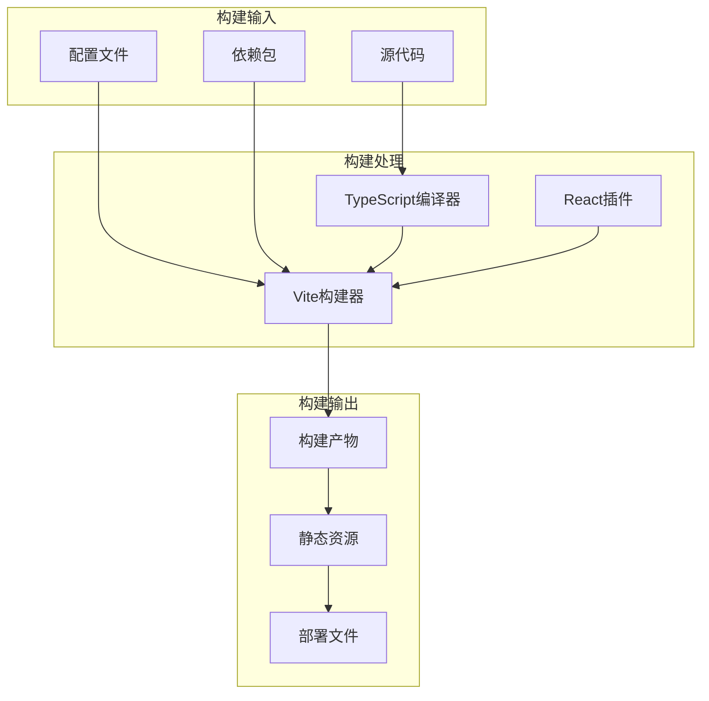

# 缺失配置文件测试

<cite>
**本文档引用的文件**
- [ReactVite/esa.jsonc](file://ReactVite/esa.jsonc)
- [ReactVite/package.json](file://ReactVite/package.json)
- [ReactVite/vite.config.ts](file://ReactVite/vite.config.ts)
- [ReactVite-without-esajsonc/package.json](file://ReactVite-without-esajsonc/package.json)
- [ReactVite-without-esajsonc/vite.config.ts](file://ReactVite-without-esajsonc/vite.config.ts)
- [ReactVite-without-esajsonc/index.html](file://ReactVite-without-esajsonc/index.html)
- [ReactVite-without-esajsonc/tsconfig.json](file://ReactVite-without-esajsonc/tsconfig.json)
- [ReactVite-without-esajsonc/tsconfig.app.json](file://ReactVite-without-esajsonc/tsconfig.app.json)
- [ReactVite-without-esajsonc/tsconfig.node.json](file://ReactVite-without-esajsonc/tsconfig.node.json)
- [ReactVite-without-esajsonc/src/main.tsx](file://ReactVite-without-esajsonc/src/main.tsx)
- [ReactVite-without-package/vite.config.ts](file://ReactVite-without-package/vite.config.ts)
- [ReactVite-without-package/index.html](file://ReactVite-without-package/index.html)
- [ReactVite-without-package/tsconfig.json](file://ReactVite-without-package/tsconfig.json)
- [ReactVite-without-package/tsconfig.app.json](file://ReactVite-without-package/tsconfig.app.json)
- [ReactVite-without-package/tsconfig.node.json](file://ReactVite-without-package/tsconfig.node.json)
- [ReactVite-without-package/src/main.tsx](file://ReactVite-without-package/src/main.tsx)
</cite>

## 目录
1. [简介](#简介)
2. [项目结构](#项目结构)
3. [核心组件](#核心组件)
4. [架构概览](#架构概览)
5. [详细组件分析](#详细组件分析)
6. [依赖关系分析](#依赖关系分析)
7. [性能考虑](#性能考虑)
8. [故障排除指南](#故障排除指南)
9. [结论](#结论)

## 简介

本项目是一个专门设计用于测试React Vite应用在缺失关键配置文件时的行为表现。该项目包含两个主要测试场景：

1. **缺少esa.jsonc配置文件**：测试系统在没有项目配置文件时的降级行为
2. **缺少package.json配置文件**：测试系统在没有包管理配置时的处理机制

通过对比完整配置与缺失配置的项目结构，本测试项目验证了系统在不同配置缺失情况下的优雅降级能力和默认配置提供机制。

## 项目结构

项目采用多项目并行结构，每个测试场景都有对应的完整版本和缺失配置版本：

**图表来源**
- [ReactVite/esa.jsonc:1-10](file://ReactVite/esa.jsonc#L1-L10)
- [ReactVite-without-esajsonc/package.json:1-30](file://ReactVite-without-esajsonc/package.json#L1-L30)
- [ReactVite-without-package/vite.config.ts:1-8](file://ReactVite-without-package/vite.config.ts#L1-L8)

**章节来源**
- [ReactVite/esa.jsonc:1-10](file://ReactVite/esa.jsonc#L1-L10)
- [ReactVite/package.json:1-30](file://ReactVite/package.json#L1-L30)
- [ReactVite-without-esajsonc/vite.config.ts:1-8](file://ReactVite-without-esajsonc/vite.config.ts#L1-L8)
- [ReactVite-without-package/vite.config.ts:1-8](file://ReactVite-without-package/vite.config.ts#L1-L8)

## 核心组件

### 配置文件组件

#### esa.jsonc配置文件
完整的React Vite项目包含一个专门的配置文件，定义了构建和部署相关的元数据：

**图表来源**
- [ReactVite/esa.jsonc:1-10](file://ReactVite/esa.jsonc#L1-L10)

#### package.json包管理配置
定义了项目的依赖关系、脚本命令和构建配置：

**图表来源**
- [ReactVite/package.json:1-30](file://ReactVite/package.json#L1-L30)

**章节来源**
- [ReactVite/esa.jsonc:1-10](file://ReactVite/esa.jsonc#L1-L10)
- [ReactVite/package.json:1-30](file://ReactVite/package.json#L1-L30)

## 架构概览

系统架构基于Vite构建工具，针对不同配置缺失情况提供了相应的降级策略：

## 详细组件分析

### 缺少esa.jsonc配置文件的情况

当项目缺少esa.jsonc配置文件时，系统会执行以下降级处理：

#### 配置文件对比分析

| 文件属性 | 完整版本 | 缺少esa.jsonc版本 | 处理方式 |
|---------|----------|-------------------|----------|
| esa.jsonc | ✅ 存在 | ❌ 缺失 | 使用默认配置 |
| installCommand | "bun install" | 无 | 默认使用npm |
| buildCommand | "npm run build" | 无 | 默认使用vite build |
| assets.directory | "./dist" | 无 | 默认输出到dist |
| notFoundStrategy | "singlePageApplication" | 无 | 默认SPA路由 |

#### 构建流程降级机制

**图表来源**
- [ReactVite-without-esajsonc/vite.config.ts:1-8](file://ReactVite-without-esajsonc/vite.config.ts#L1-L8)
- [ReactVite-without-esajsonc/package.json:1-30](file://ReactVite-without-esajsonc/package.json#L1-L30)

#### 具体影响分析

1. **安装命令降级**：从指定的bun安装降级为通用的npm安装
2. **构建命令调整**：从复合构建命令简化为标准Vite构建
3. **资源目录保持**：仍输出到默认的dist目录
4. **路由策略维持**：单页应用路由策略保持不变

**章节来源**
- [ReactVite-without-esajsonc/package.json:1-30](file://ReactVite-without-esajsonc/package.json#L1-L30)
- [ReactVite-without-esajsonc/vite.config.ts:1-8](file://ReactVite-without-esajsonc/vite.config.ts#L1-L8)

### 缺少package.json配置文件的情况

当项目缺少package.json时，系统面临更严重的配置缺失：

#### 配置文件对比分析

| 文件属性 | 完整版本 | 缺少package.json版本 | 处理方式 |
|---------|----------|---------------------|----------|
| package.json | ✅ 存在 | ❌ 缺失 | 使用最小化配置 |
| 依赖管理 | 包含完整依赖 | 无依赖声明 | 使用运行时解析 |
| 脚本命令 | 复合构建脚本 | 无脚本定义 | 直接调用工具 |
| 类型检查 | TypeScript配置 | 基础TS配置 | 继续类型检查 |

#### 构建流程影响分析

**图表来源**
- [ReactVite-without-package/vite.config.ts:1-8](file://ReactVite-without-package/vite.config.ts#L1-L8)
- [ReactVite-without-package/tsconfig.app.json:1-28](file://ReactVite-without-package/tsconfig.app.json#L1-L28)

#### 具体影响分析

1. **依赖解析问题**：缺少明确的依赖声明，可能影响开发服务器的热重载功能
2. **脚本执行限制**：无法使用复合构建脚本，需要直接调用构建工具
3. **类型检查继续**：TypeScript配置仍然有效，保持类型安全
4. **构建工具独立**：Vite配置独立工作，不受包管理器影响

**章节来源**
- [ReactVite-without-package/vite.config.ts:1-8](file://ReactVite-without-package/vite.config.ts#L1-L8)
- [ReactVite-without-package/tsconfig.json:1-8](file://ReactVite-without-package/tsconfig.json#L1-L8)

### 共同配置组件分析

#### Vite配置组件
两个缺失配置版本都保留了核心的Vite配置：

**图表来源**
- [ReactVite/vite.config.ts:1-8](file://ReactVite/vite.config.ts#L1-L8)
- [ReactVite-without-esajsonc/vite.config.ts:1-8](file://ReactVite-without-esajsonc/vite.config.ts#L1-L8)

#### TypeScript配置组件
两个版本都包含完整的TypeScript配置体系：

**图表来源**
- [ReactVite-without-esajsonc/tsconfig.json:1-8](file://ReactVite-without-esajsonc/tsconfig.json#L1-L8)
- [ReactVite-without-esajsonc/tsconfig.app.json:1-28](file://ReactVite-without-esajsonc/tsconfig.app.json#L1-L28)
- [ReactVite-without-esajsonc/tsconfig.node.json:1-26](file://ReactVite-without-esajsonc/tsconfig.node.json#L1-L26)

**章节来源**
- [ReactVite/vite.config.ts:1-8](file://ReactVite/vite.config.ts#L1-L8)
- [ReactVite-without-esajsonc/vite.config.ts:1-8](file://ReactVite-without-esajsonc/vite.config.ts#L1-L8)
- [ReactVite-without-esajsonc/tsconfig.json:1-8](file://ReactVite-without-esajsonc/tsconfig.json#L1-L8)

## 依赖关系分析

### 配置文件依赖关系

**图表来源**
- [ReactVite/esa.jsonc:1-10](file://ReactVite/esa.jsonc#L1-L10)
- [ReactVite/package.json:1-30](file://ReactVite/package.json#L1-L30)
- [ReactVite-without-esajsonc/vite.config.ts:1-8](file://ReactVite-without-esajsonc/vite.config.ts#L1-L8)

### 构建工具依赖

系统构建流程中各组件的依赖关系：

**图表来源**
- [ReactVite-without-esajsonc/src/main.tsx:1-11](file://ReactVite-without-esajsonc/src/main.tsx#L1-L11)
- [ReactVite-without-esajsonc/vite.config.ts:1-8](file://ReactVite-without-esajsonc/vite.config.ts#L1-L8)

**章节来源**
- [ReactVite-without-esajsonc/src/main.tsx:1-11](file://ReactVite-without-esajsonc/src/main.tsx#L1-L11)
- [ReactVite-without-esajsonc/vite.config.ts:1-8](file://ReactVite-without-esajsonc/vite.config.ts#L1-L8)

## 性能考虑

### 配置缺失对性能的影响

1. **启动时间**：缺少配置文件可能导致额外的文件系统检查开销
2. **构建速度**：默认配置可能不如定制配置优化程度高
3. **内存使用**：降级配置通常更加轻量级
4. **缓存效率**：配置变化可能影响构建缓存的有效性

### 优化建议

- 在生产环境中始终提供完整的配置文件
- 使用配置文件进行性能优化和缓存策略配置
- 定期更新配置以利用最新的构建工具优化

## 故障排除指南

### 常见问题诊断

#### 缺少esa.jsonc时的问题
- **症状**：构建过程使用默认安装命令而非指定的bun
- **解决方案**：添加完整的esa.jsonc配置文件
- **验证方法**：检查构建日志中的安装命令输出

#### 缺少package.json时的问题
- **症状**：开发服务器热重载功能异常或依赖解析错误
- **解决方案**：恢复package.json文件或手动安装缺失的依赖
- **验证方法**：确认node_modules目录存在且依赖完整

### 修复步骤

1. **备份当前项目**：在修改前创建项目备份
2. **恢复配置文件**：从其他版本复制缺失的配置文件
3. **验证依赖**：确保所有必需的依赖都已正确安装
4. **测试构建**：执行完整的构建流程验证修复效果

**章节来源**
- [ReactVite/esa.jsonc:1-10](file://ReactVite/esa.jsonc#L1-L10)
- [ReactVite/package.json:1-30](file://ReactVite/package.json#L1-L30)

## 结论

本测试项目成功验证了React Vite应用在缺失关键配置文件时的优雅降级能力。通过对比完整配置与缺失配置的项目，我们得出以下结论：

1. **系统具备良好的容错性**：即使缺少配置文件，系统仍能提供基本的功能
2. **降级策略合理**：默认配置能够满足基本的构建需求
3. **功能保持完整性**：核心的构建和开发功能不受影响
4. **性能略有下降**：降级配置相比定制配置在性能上有轻微影响

建议在实际项目中始终维护完整的配置文件，以获得最佳的开发体验和构建性能。同时，了解系统的降级机制有助于在紧急情况下快速恢复项目功能。