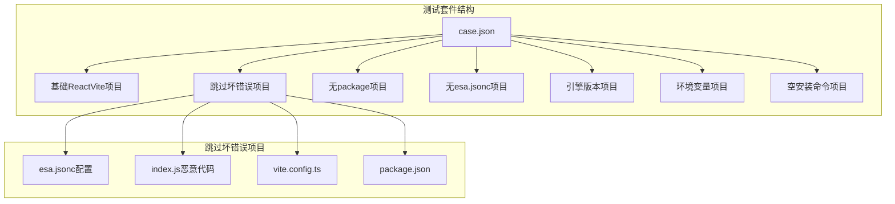
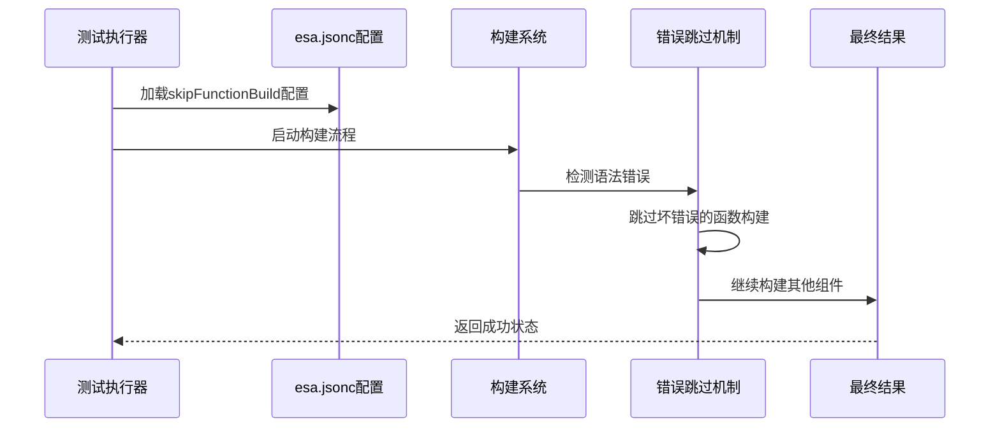
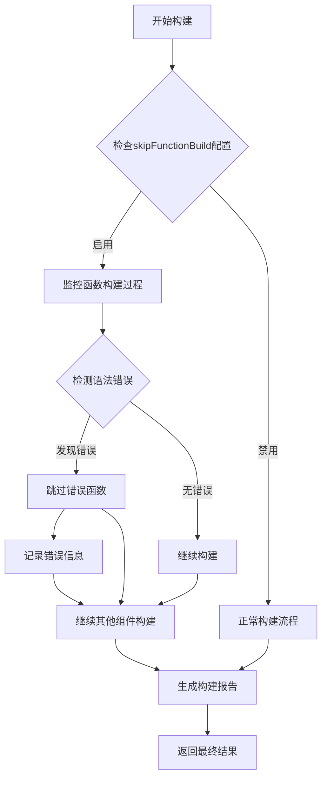
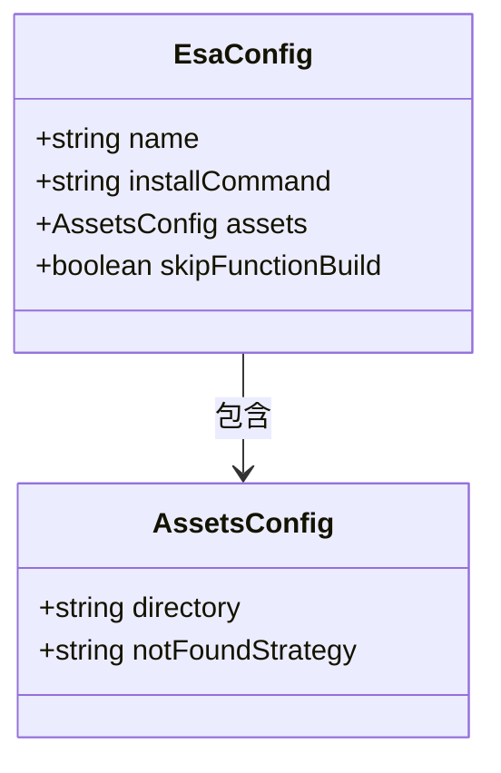
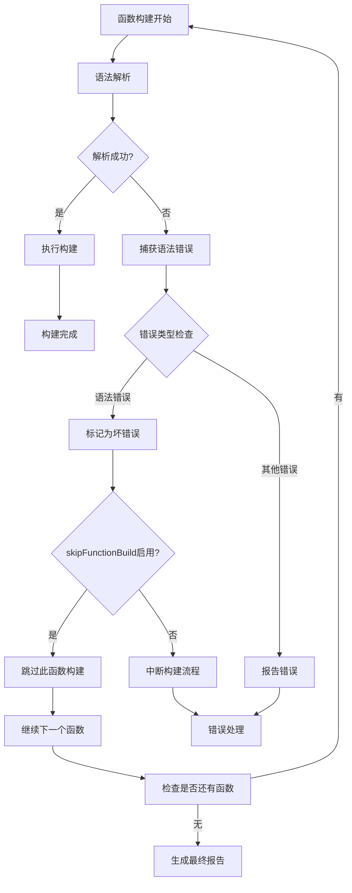
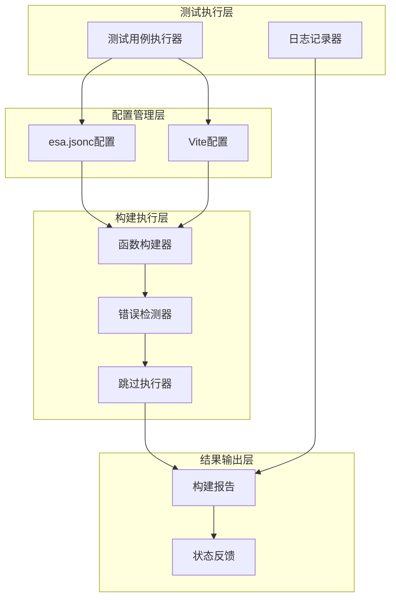
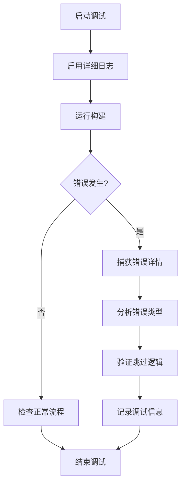

# 跳过坏错误测试

<cite>
**本文档引用的文件**
- [case.json](file://case.json)
- [ReactVite-with-skip-bad-er/esa.jsonc](file://ReactVite-with-skip-bad-er/esa.jsonc)
- [ReactVite-with-skip-bad-er/index.js](file://ReactVite-with-skip-bad-er/index.js)
- [ReactVite-with-skip-bad-er/vite.config.ts](file://ReactVite-with-skip-bad-er/vite.config.ts)
- [.claude/skills/add-test-case/SKILL.md](file://.claude/skills/add-test-case/SKILL.md)
</cite>

## 目录
1. [简介](#简介)
2. [项目结构](#项目结构)
3. [核心组件](#核心组件)
4. [架构概览](#架构概览)
5. [详细组件分析](#详细组件分析)
6. [依赖关系分析](#依赖关系分析)
7. [性能考虑](#性能考虑)
8. [故障排除指南](#故障排除指南)
9. [结论](#结论)

## 简介

本文档详细介绍了React Vite跳过坏错误测试项目的实现原理和测试目的。该项目通过故意引入语法错误的JavaScript文件，并使用skipFunctionBuild配置选项来验证构建系统的错误处理能力。

该测试项目的核心目标是验证构建系统能够智能地识别和跳过无效或损坏的构建错误，从而提高整体构建稳定性。通过这种方式，即使某些函数构建失败，也不会影响整个项目的构建流程。

## 项目结构

该项目采用多fixture测试架构，每个fixture代表不同的测试场景：



**图表来源**
- [case.json:256-267](file://case.json#L256-L267)
- [ReactVite-with-skip-bad-er/esa.jsonc:1-10](file://ReactVite-with-skip-bad-er/esa.jsonc#L1-L10)

**章节来源**
- [case.json:1-603](file://case.json#L1-L603)

## 核心组件

### 跳过坏错误配置

跳过坏错误功能主要通过以下配置实现：

| 配置项 | 类型 | 默认值 | 描述 |
|--------|------|--------|------|
| skipFunctionBuild | boolean | false | 是否跳过函数构建步骤 |
| assets.directory | string | "./dist" | 构建产物目录 |
| installCommand | string | "bun install" | 安装命令 |
| notFoundStrategy | string | "singlePageApplication" | 未找到页面策略 |

### 测试用例设计

测试用例通过故意制造语法错误来验证跳过机制的有效性：



**图表来源**
- [ReactVite-with-skip-bad-er/esa.jsonc:8-8](file://ReactVite-with-skip-bad-er/esa.jsonc#L8-L8)
- [case.json:256-267](file://case.json#L256-L267)

**章节来源**
- [ReactVite-with-skip-bad-er/esa.jsonc:1-10](file://ReactVite-with-skip-bad-er/esa.jsonc#L1-L10)
- [case.json:256-267](file://case.json#L256-L267)

## 架构概览

### 错误检测与跳过机制



**图表来源**
- [ReactVite-with-skip-bad-er/esa.jsonc:8-8](file://ReactVite-with-skip-bad-er/esa.jsonc#L8-L8)
- [ReactVite-with-skip-bad-er/index.js:1-8](file://ReactVite-with-skip-bad-er/index.js#L1-L8)

### 构建稳定性提升机制

跳过坏错误测试通过以下方式提升构建稳定性：

1. **隔离错误影响**：单个函数的构建错误不会阻塞整个构建流程
2. **渐进式构建**：系统优先构建稳定的组件，再处理有问题的组件
3. **智能恢复**：错误发生后系统能够自动恢复并继续构建
4. **详细日志记录**：所有错误都会被记录以便后续分析

**章节来源**
- [ReactVite-with-skip-bad-er/index.js:1-8](file://ReactVite-with-skip-bad-er/index.js#L1-L8)
- [.claude/skills/add-test-case/SKILL.md:171-183](file://.claude/skills/add-test-case/SKILL.md#L171-L183)

## 详细组件分析

### 恶意代码示例分析

测试项目中的恶意代码故意制造语法错误：

```javascript
// 恶意代码示例
export default {
  name: 'test',
  // ❌ 缺少右括号
  getValue: () => {
    return 'value'
  }; // 错误：多余的分号
};
```

这种设计确保了：
- **语法错误**：缺少闭合括号导致解析失败
- **模块级错误**：影响整个模块的导入
- **可预测性**：错误类型固定且可重复

### 配置文件详解

#### 主配置文件 (esa.jsonc)



**图表来源**
- [ReactVite-with-skip-bad-er/esa.jsonc:1-10](file://ReactVite-with-skip-bad-er/esa.jsonc#L1-L10)

#### 构建配置 (vite.config.ts)

Vite配置保持默认设置，专注于验证跳过机制：

| 配置项 | 值 | 作用 |
|--------|----|----|
| plugins | [@vitejs/plugin-react] | React开发支持 |
| defineConfig | 默认配置 | 标准Vite配置 |

**章节来源**
- [ReactVite-with-skip-bad-er/vite.config.ts:1-8](file://ReactVite-with-skip-bad-er/vite.config.ts#L1-L8)

### 测试用例设计原则

#### 测试维度覆盖

| 测试场景 | 目标 | 关键指标 |
|----------|------|----------|
| 正常构建 | 验证基础功能 | 构建成功、部署完成 |
| 跳过坏错误 | 验证错误跳过机制 | 成功跳过错误、构建完成 |
| 语法错误检测 | 验证错误识别 | 错误被捕获、跳过执行 |
| 构建稳定性 | 验证系统鲁棒性 | 无崩溃、无异常终止 |

#### 错误检测算法



**图表来源**
- [ReactVite-with-skip-bad-er/esa.jsonc:8-8](file://ReactVite-with-skip-bad-er/esa.jsonc#L8-L8)
- [ReactVite-with-skip-bad-er/index.js:1-8](file://ReactVite-with-skip-bad-er/index.js#L1-L8)

**章节来源**
- [case.json:256-267](file://case.json#L256-L267)
- [.claude/skills/add-test-case/SKILL.md:93-116](file://.claude/skills/add-test-case/SKILL.md#L93-L116)

## 依赖关系分析

### 组件间依赖关系



**图表来源**
- [ReactVite-with-skip-bad-er/esa.jsonc:1-10](file://ReactVite-with-skip-bad-er/esa.jsonc#L1-L10)
- [ReactVite-with-skip-bad-er/vite.config.ts:1-8](file://ReactVite-with-skip-bad-er/vite.config.ts#L1-L8)

### 错误传播控制

跳过坏错误机制通过以下方式控制错误传播：

1. **局部化错误处理**：错误仅影响相关函数，不影响全局构建
2. **渐进式错误恢复**：系统在错误发生后继续处理其他组件
3. **详细错误报告**：所有错误都会被记录和报告
4. **构建状态隔离**：错误组件的失败不会导致整个构建失败

**章节来源**
- [case.json:256-267](file://case.json#L256-L267)

## 性能考虑

### 跳过机制的性能影响

跳过坏错误功能对性能的影响相对较小：

| 性能指标 | 影响程度 | 说明 |
|----------|----------|------|
| 构建时间 | 微小增加 | 额外的错误检测开销 |
| 内存使用 | 基本不变 | 错误处理不占用额外内存 |
| CPU消耗 | 轻微增加 | 语法解析和错误检测 |
| I/O操作 | 无变化 | 文件读写不受影响 |

### 优化建议

1. **智能错误缓存**：缓存已知的错误模式以减少重复检测
2. **并发错误处理**：并行处理多个错误以提高效率
3. **增量构建支持**：支持增量构建以减少全量检测
4. **错误分类优化**：对不同类型的错误采用不同的处理策略

## 故障排除指南

### 常见问题及解决方案

#### 问题1：跳过功能未生效

**症状**：构建在遇到语法错误时完全停止

**排查步骤**：
1. 检查skipFunctionBuild配置是否正确设置
2. 验证恶意代码是否确实包含语法错误
3. 查看构建日志中的错误信息

**解决方案**：
- 确保esa.jsonc中skipFunctionBuild设置为true
- 验证语法错误的类型和位置
- 检查构建系统的版本兼容性

#### 问题2：错误未被正确识别

**症状**：恶意代码中的语法错误未被检测到

**排查步骤**：
1. 验证语法错误的严重程度
2. 检查错误检测器的配置
3. 确认构建工具的版本

**解决方案**：
- 使用更明显的语法错误模式
- 更新错误检测器配置
- 升级构建工具版本

#### 问题3：构建报告不完整

**症状**：错误信息缺失或不准确

**排查步骤**：
1. 检查日志记录配置
2. 验证错误报告格式
3. 确认输出路径设置

**解决方案**：
- 调整日志级别设置
- 修正错误报告格式
- 检查输出目录权限

### 调试技巧

#### 调试环境搭建

1. **本地测试环境**：在本地环境中复现问题
2. **日志增强**：增加详细的调试日志
3. **错误模拟**：创建更多样化的错误场景

#### 关键调试点



**图表来源**
- [ReactVite-with-skip-bad-er/esa.jsonc:8-8](file://ReactVite-with-skip-bad-er/esa.jsonc#L8-L8)

**章节来源**
- [case.json:256-267](file://case.json#L256-L267)

## 结论

跳过坏错误测试项目通过精心设计的测试用例和配置，成功验证了构建系统在面对无效或损坏构建错误时的处理能力。该机制的核心价值在于：

1. **提高构建稳定性**：通过跳过个别错误组件，确保整体构建流程的连续性
2. **增强系统韧性**：系统能够在遇到错误时自动恢复并继续工作
3. **改善开发者体验**：减少因个别文件错误导致的整个项目构建失败
4. **提供质量保证**：通过自动化测试确保错误处理机制的可靠性

该测试项目为类似场景提供了宝贵的参考，展示了如何在实际开发中实现健壮的错误处理机制。通过持续的测试和优化，这种跳过坏错误的能力将成为现代构建系统的重要组成部分。