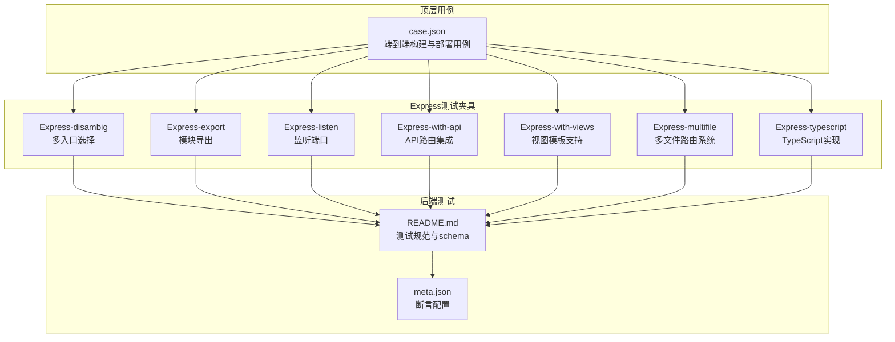
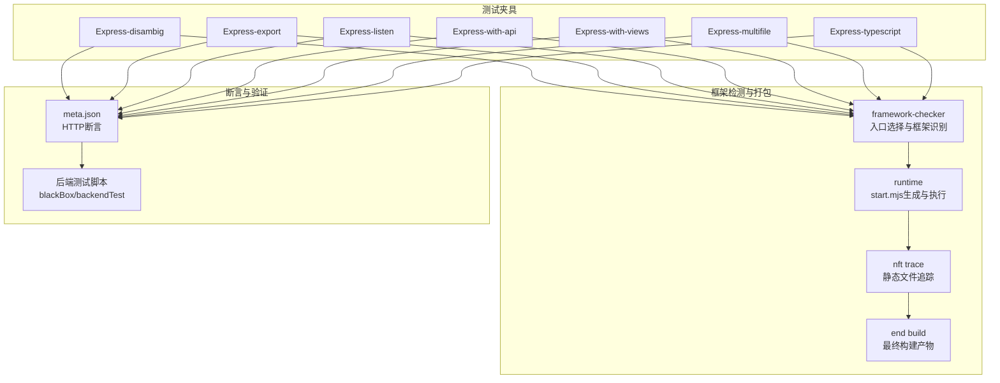
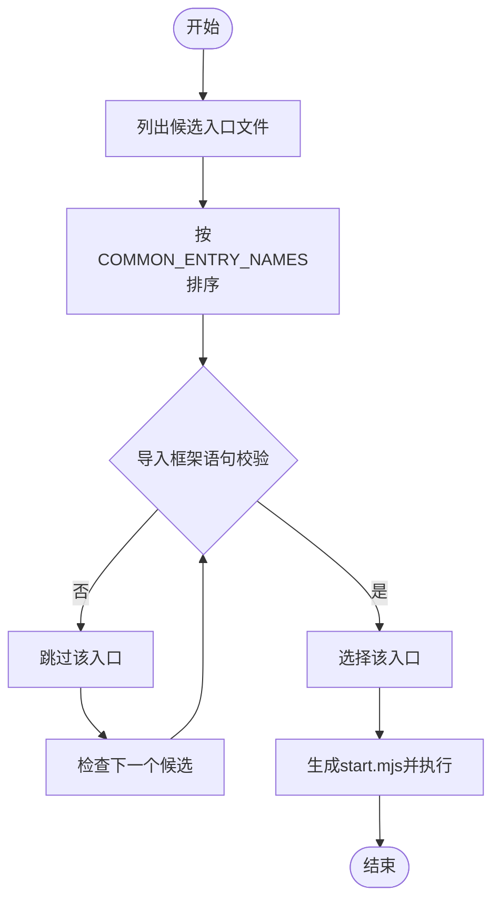
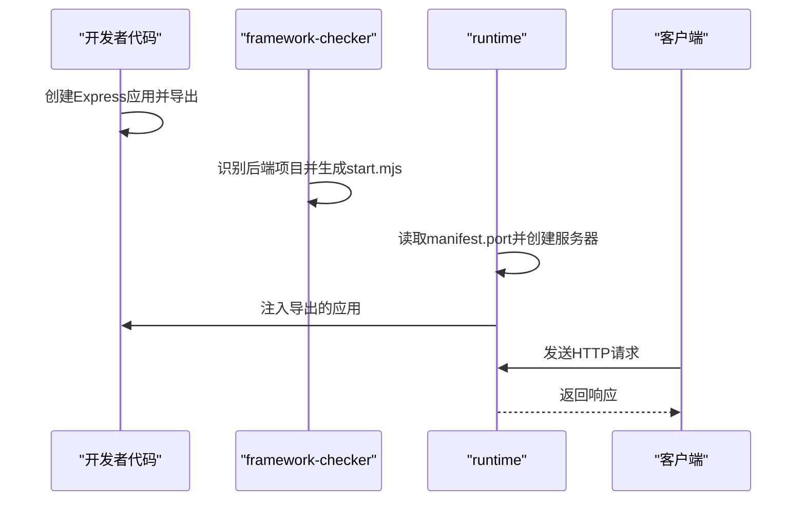
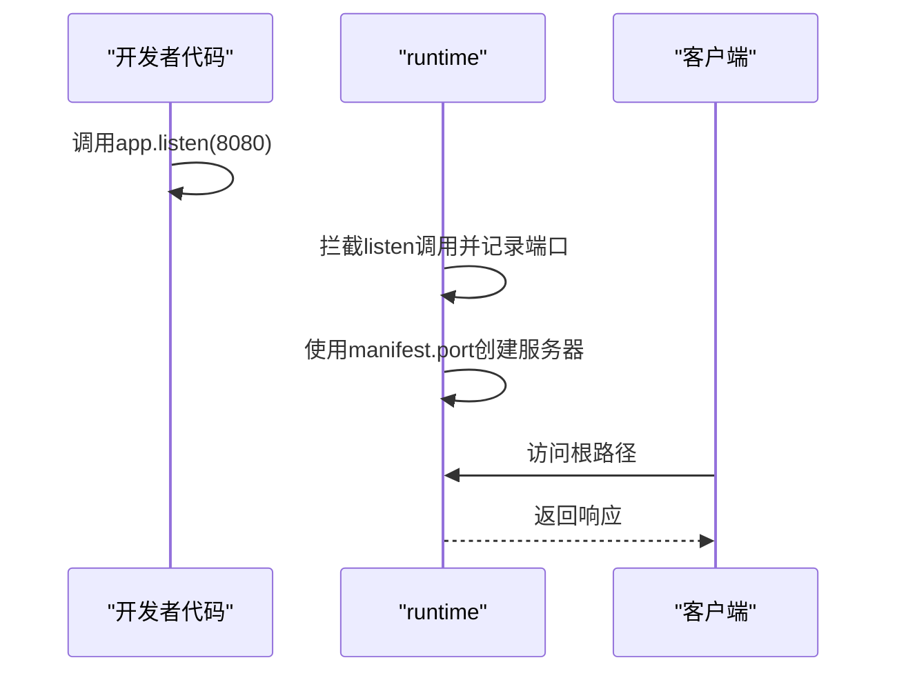
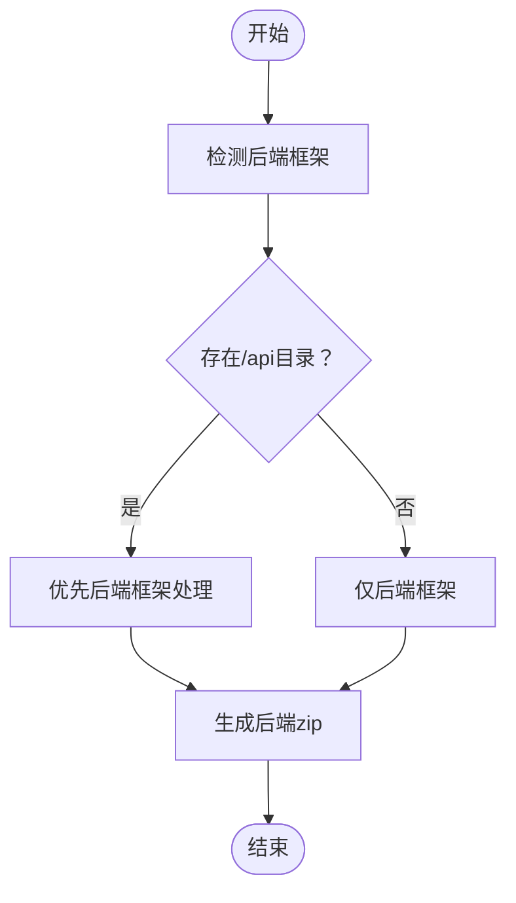
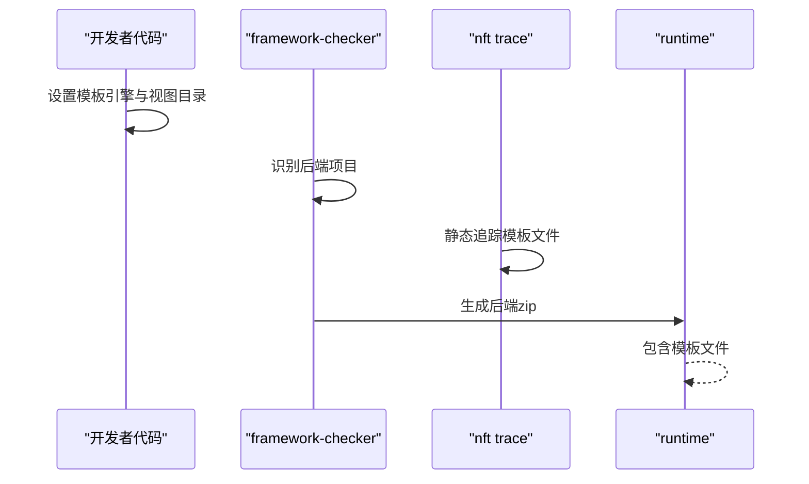
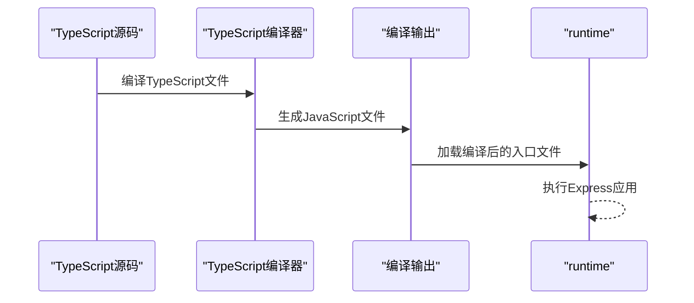
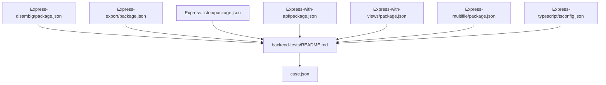

# Express框架测试

<cite>
**本文档引用的文件**
- [Express-disambig/app.js](file://Express-disambig/app.js)
- [Express-disambig/server.js](file://Express-disambig/server.js)
- [Express-disambig/package.json](file://Express-disambig/package.json)
- [Express-export/app.js](file://Express-export/app.js)
- [Express-export/package.json](file://Express-export/package.json)
- [Express-listen/server.js](file://Express-listen/server.js)
- [Express-listen/package.json](file://Express-listen/package.json)
- [Express-with-api/server.js](file://Express-with-api/server.js)
- [Express-with-api/package.json](file://Express-with-api/package.json)
- [Express-with-views/server.js](file://Express-with-views/server.js)
- [Express-with-views/package.json](file://Express-with-views/package.json)
- [backend-tests/README.md](file://backend-tests/README.md)
- [backend-tests/express-export/meta.json](file://backend-tests/express-export/meta.json)
- [backend-tests/express-listen/meta.json](file://backend-tests/express-listen/meta.json)
- [backend-tests/express-multifile/app.js](file://backend-tests/express-multifile/app.js)
- [backend-tests/express-multifile/meta.json](file://backend-tests/express-multifile/meta.json)
- [backend-tests/express-multifile/package.json](file://backend-tests/express-multifile/package.json)
- [backend-tests/express-multifile/routes/health.js](file://backend-tests/express-multifile/routes/health.js)
- [backend-tests/express-multifile/middleware/auth.js](file://backend-tests/express-multifile/middleware/auth.js)
- [backend-tests/express-typescript/src/index.ts](file://backend-tests/express-typescript/src/index.ts)
- [backend-tests/express-typescript/src/routes/health.ts](file://backend-tests/express-typescript/src/routes/health.ts)
- [backend-tests/express-typescript/src/routes/users.ts](file://backend-tests/express-typescript/src/routes/users.ts)
- [backend-tests/express-typescript/meta.json](file://backend-tests/express-typescript/meta.json)
- [backend-tests/express-typescript/tsconfig.json](file://backend-tests/express-typescript/tsconfig.json)
- [case.json](file://case.json)
</cite>

## 目录
1. [简介](#简介)
2. [项目结构](#项目结构)
3. [核心组件](#核心组件)
4. [架构总览](#架构总览)
5. [详细组件分析](#详细组件分析)
6. [依赖关系分析](#依赖关系分析)
7. [性能考量](#性能考量)
8. [故障排查指南](#故障排查指南)
9. [结论](#结论)
10. [附录](#附录)

## 简介
本技术文档围绕Express框架在不同使用模式下的测试场景展开，系统梳理以下六类典型模式：app.listen()监听端口模式、module.exports导出模式、多文件入口选择（disambiguation）模式、API路由集成模式、视图模板支持模式以及新增的**多文件路由系统模式**和**TypeScript Express实现模式**。文档从实现原理、配置要求、构建流程、测试断言、性能对比与最佳实践等方面进行深入解析，并给出框架检测算法如何识别不同类型Express项目的说明。

## 项目结构
该仓库包含多个Express测试夹具（fixture），每个夹具代表一种典型的Express使用方式或组合特性，配合独立的断言配置（meta.json）与后端测试脚本，验证framework-checker与runtime生成物在本机环境中的可运行性与HTTP响应正确性。

**图表来源**
- [Express-disambig/app.js:1-6](file://Express-disambig/app.js#L1-L6)
- [Express-disambig/server.js:1-7](file://Express-disambig/server.js#L1-L7)
- [Express-export/app.js:1-8](file://Express-export/app.js#L1-L8)
- [Express-listen/server.js:1-9](file://Express-listen/server.js#L1-L9)
- [Express-with-api/server.js:1-5](file://Express-with-api/server.js#L1-L5)
- [Express-with-views/server.js:1-11](file://Express-with-views/server.js#L1-L11)
- [backend-tests/express-multifile/app.js:1-26](file://backend-tests/express-multifile/app.js#L1-L26)
- [backend-tests/express-typescript/src/index.ts:1-19](file://backend-tests/express-typescript/src/index.ts#L1-L19)
- [backend-tests/README.md:1-133](file://backend-tests/README.md#L1-L133)
- [case.json:298-521](file://case.json#L298-L521)

**章节来源**
- [backend-tests/README.md:18-84](file://backend-tests/README.md#L18-L84)
- [case.json:298-521](file://case.json#L298-L521)

## 核心组件
- 多入口选择（disambiguation）夹具：通过"诱饵入口"与"真实入口"的对比，演示框架检测器如何基于导入语义与入口文件列表进行甄别，最终选择真正引入框架的入口。
- 导出模式夹具：不直接监听端口，而是通过module.exports导出应用，交由runtime统一创建服务。
- 监听端口模式夹具：显式调用app.listen并指定端口，验证runtime对listen调用的拦截与端口接管。
- API路由集成夹具：在Express应用中集成/api路由，验证当项目同时包含后端框架与/api目录时，优先走后端框架而非FC多路由分发。
- 视图模板夹具：启用模板引擎与视图目录，验证nft静态追踪对模板文件的打包，避免线上渲染缺失导致的错误。
- **多文件路由系统夹具**：采用模块化架构，将路由、中间件和服务分离到不同文件夹，展示Express应用的工程化组织方式。
- **TypeScript Express夹具**：使用TypeScript编译输出，配置tsconfig.json指定输出目录，验证TypeScript到JavaScript的转换与运行。

**章节来源**
- [Express-disambig/app.js:1-6](file://Express-disambig/app.js#L1-L6)
- [Express-disambig/server.js:1-7](file://Express-disambig/server.js#L1-L7)
- [Express-export/app.js:1-8](file://Express-export/app.js#L1-L8)
- [Express-listen/server.js:1-9](file://Express-listen/server.js#L1-L9)
- [Express-with-api/server.js:1-5](file://Express-with-api/server.js#L1-L5)
- [Express-with-views/server.js:1-11](file://Express-with-views/server.js#L1-L11)
- [backend-tests/express-multifile/app.js:1-26](file://backend-tests/express-multifile/app.js#L1-L26)
- [backend-tests/express-typescript/src/index.ts:1-19](file://backend-tests/express-typescript/src/index.ts#L1-L19)

## 架构总览
下图展示了Express测试夹具与后端测试框架的关系：每个夹具对应一个独立的测试用例，通过meta.json定义HTTP断言；顶层case.json定义端到端构建与部署流程，其中包含对Express各类模式的检测与打包验证。

**图表来源**
- [backend-tests/README.md:38-84](file://backend-tests/README.md#L38-L84)
- [case.json:298-521](file://case.json#L298-L521)

## 详细组件分析

### 多文件入口选择（disambiguation）模式
- 实现原理
  - 项目同时包含server.js与app.js两个候选入口。server.js"看起来像入口"，但并未导入Express；app.js才是真正的入口，导入并导出Express应用。
  - 检测算法通过"入口文件列表 + 导入语义校验"进行甄别：先按COMMON_ENTRY_NAMES排序，再用正则检查是否导入框架，跳过未导入框架的文件，最终选择真正导入框架的入口。
- 配置要求
  - package.json声明Express依赖。
  - app.js导出Express应用。
  - server.js不导入Express，仅作为诱饵。
- 构建流程
  - framework-checker识别入口：优先候选文件 → 正则导入校验 → 选择app.js。
  - runtime生成start.mjs并执行，监听由manifest.port接管。
- 测试断言
  - 顶层case.json验证"同时存在server.js与app.js时，能选中真正require框架的入口"。

**图表来源**
- [Express-disambig/server.js:1-7](file://Express-disambig/server.js#L1-L7)
- [Express-disambig/app.js:1-6](file://Express-disambig/app.js#L1-L6)
- [Express-disambig/package.json:1-9](file://Express-disambig/package.json#L1-L9)
- [case.json:505-521](file://case.json#L505-L521)

**章节来源**
- [Express-disambig/server.js:1-7](file://Express-disambig/server.js#L1-L7)
- [Express-disambig/app.js:1-6](file://Express-disambig/app.js#L1-L6)
- [Express-disambig/package.json:1-9](file://Express-disambig/package.json#L1-L9)
- [case.json:505-521](file://case.json#L505-L521)

### module.exports导出模式
- 实现原理
  - 应用创建后不直接监听端口，而是通过module.exports导出应用，交由runtime统一创建HTTP服务器。
- 配置要求
  - package.json声明Express依赖。
  - app.js导出Express应用。
- 构建流程
  - framework-checker识别为后端项目，生成start.mjs。
  - runtime根据manifest.port创建服务器并注入导出的应用。
- 测试断言
  - backend-tests/express-export/meta.json定义了多条HTTP断言，覆盖健康检查、用户查询与回显接口。

**图表来源**
- [Express-export/app.js:1-8](file://Express-export/app.js#L1-L8)
- [Express-export/package.json:1-9](file://Express-export/package.json#L1-L9)
- [backend-tests/express-export/meta.json:1-14](file://backend-tests/express-export/meta.json#L1-L14)

**章节来源**
- [Express-export/app.js:1-8](file://Express-export/app.js#L1-L8)
- [Express-export/package.json:1-9](file://Express-export/package.json#L1-L9)
- [backend-tests/express-export/meta.json:1-14](file://backend-tests/express-export/meta.json#L1-L14)

### app.listen()监听端口模式
- 实现原理
  - 应用显式调用app.listen并指定端口；runtime会拦截该listen调用，统一由manifest.port接管端口分配。
- 配置要求
  - package.json声明Express依赖。
  - server.js中调用app.listen。
- 构建流程
  - framework-checker识别为后端项目，生成start.mjs。
  - runtime启动时忽略用户自定义端口，使用分配的端口。
- 测试断言
  - backend-tests/express-listen/meta.json定义了多条HTTP断言，包含健康检查、用户查询与回显接口，并设置合理的预热超时。

**图表来源**
- [Express-listen/server.js:1-9](file://Express-listen/server.js#L1-L9)
- [Express-listen/package.json:1-9](file://Express-listen/package.json#L1-L9)
- [backend-tests/express-listen/meta.json:1-36](file://backend-tests/express-listen/meta.json#L1-L36)

**章节来源**
- [Express-listen/server.js:1-9](file://Express-listen/server.js#L1-L9)
- [Express-listen/package.json:1-9](file://Express-listen/package.json#L1-L9)
- [backend-tests/express-listen/meta.json:1-36](file://backend-tests/express-listen/meta.json#L1-L36)

### API路由集成模式
- 实现原理
  - 项目同时包含Express后端框架与/api目录下的函数计算处理器。检测器优先识别后端框架，由Express自身处理/api路由，而非生成FC多路由分发包。
- 配置要求
  - package.json声明Express依赖。
  - server.js中定义基础路由并监听端口。
- 构建流程
  - framework-checker识别后端项目，生成后端zip，不生成FC handlers zip。
- 测试断言
  - 顶层case.json验证"同时存在Express与/api目录时，优先走后端框架"。

**图表来源**
- [Express-with-api/server.js:1-5](file://Express-with-api/server.js#L1-L5)
- [Express-with-api/package.json:1-9](file://Express-with-api/package.json#L1-L9)
- [case.json:410-429](file://case.json#L410-L429)

**章节来源**
- [Express-with-api/server.js:1-5](file://Express-with-api/server.js#L1-L5)
- [Express-with-api/package.json:1-9](file://Express-with-api/package.json#L1-L9)
- [case.json:410-429](file://case.json#L410-L429)

### 视图模板支持模式
- 实现原理
  - 应用启用模板引擎并设置视图目录，nft静态追踪会自动包含模板文件，避免线上渲染缺失导致的错误。
- 配置要求
  - package.json声明Express与模板引擎依赖。
  - server.js中设置模板引擎与视图目录。
- 构建流程
  - framework-checker识别后端项目，nft trace包含模板文件，生成后端zip。
- 测试断言
  - 顶层case.json验证"带views/模板时，模板文件会自动打包"。

**图表来源**
- [Express-with-views/server.js:1-11](file://Express-with-views/server.js#L1-L11)
- [Express-with-views/package.json:1-10](file://Express-with-views/package.json#L1-L10)
- [case.json:486-502](file://case.json#L486-L502)

**章节来源**
- [Express-with-views/server.js:1-11](file://Express-with-views/server.js#L1-L11)
- [Express-with-views/package.json:1-10](file://Express-with-views/package.json#L1-L10)
- [case.json:486-502](file://case.json#L486-L502)

### 多文件路由系统模式
**新增** 该模式展示了Express应用的工程化组织方式，采用模块化架构将路由、中间件和服务分离到不同文件夹，提升代码可维护性和团队协作效率。

- 实现原理
  - 应用采用模块化设计，将不同功能分离到独立文件：路由逻辑放在routes文件夹，认证中间件放在middleware文件夹，业务服务放在services文件夹。
  - 主应用文件负责组装各个模块并通过Express Router进行路由注册。
  - 支持全局错误处理中间件，提供统一的错误处理机制。
- 配置要求
  - package.json声明Express依赖。
  - app.js作为主入口文件，导入并组装各个模块。
  - 路由文件导出Express Router实例。
  - 中间件文件导出对应的处理函数。
- 构建流程
  - framework-checker识别为标准Express项目，生成start.mjs。
  - runtime执行时加载所有模块，包括路由、中间件和主应用。
- 测试断言
  - backend-tests/express-multifile/meta.json定义了完整的HTTP断言，覆盖健康检查、用户管理、认证授权、分页查询等场景。

**图表来源**
- [backend-tests/express-multifile/app.js:1-26](file://backend-tests/express-multifile/app.js#L1-L26)
- [backend-tests/express-multifile/meta.json:1-68](file://backend-tests/express-multifile/meta.json#L1-L68)

**章节来源**
- [backend-tests/express-multifile/app.js:1-26](file://backend-tests/express-multifile/app.js#L1-L26)
- [backend-tests/express-multifile/meta.json:1-68](file://backend-tests/express-multifile/meta.json#L1-L68)
- [backend-tests/express-multifile/package.json:1-8](file://backend-tests/express-multifile/package.json#L1-L8)
- [backend-tests/express-multifile/routes/health.js:1-9](file://backend-tests/express-multifile/routes/health.js#L1-L9)
- [backend-tests/express-multifile/middleware/auth.js:1-14](file://backend-tests/express-multifile/middleware/auth.js#L1-L14)

### TypeScript Express实现模式
**新增** 该模式展示了如何使用TypeScript开发Express应用，包括类型安全的路由处理、接口定义和编译配置。

- 实现原理
  - 使用TypeScript编写Express应用，提供类型安全的路由处理和参数验证。
  - 通过tsconfig.json配置编译选项，指定输出目录为dist，源码目录为src。
  - 路由文件使用TypeScript接口定义数据结构，提供更好的开发体验。
  - 编译后生成JavaScript文件供runtime执行。
- 配置要求
  - package.json声明Express和TypeScript依赖。
  - tsconfig.json配置编译选项，包括目标版本、模块系统、严格模式等。
  - 源码文件位于src目录，编译输出位于dist目录。
  - 路由文件使用TypeScript语法，提供类型定义。
- 构建流程
  - framework-checker识别TypeScript项目，配置编译流程。
  - TypeScript编译器将src目录下的TypeScript文件编译为JavaScript。
  - 生成的dist/index.js作为runtime入口文件。
- 测试断言
  - backend-tests/express-typescript/meta.json定义了HTTP断言，验证TypeScript编译后的功能正确性。

**图表来源**
- [backend-tests/express-typescript/src/index.ts:1-19](file://backend-tests/express-typescript/src/index.ts#L1-L19)
- [backend-tests/express-typescript/src/routes/health.ts:1-8](file://backend-tests/express-typescript/src/routes/health.ts#L1-L8)
- [backend-tests/express-typescript/src/routes/users.ts:1-26](file://backend-tests/express-typescript/src/routes/users.ts#L1-L26)
- [backend-tests/express-typescript/tsconfig.json:1-18](file://backend-tests/express-typescript/tsconfig.json#L1-L18)

**章节来源**
- [backend-tests/express-typescript/src/index.ts:1-19](file://backend-tests/express-typescript/src/index.ts#L1-L19)
- [backend-tests/express-typescript/src/routes/health.ts:1-8](file://backend-tests/express-typescript/src/routes/health.ts#L1-L8)
- [backend-tests/express-typescript/src/routes/users.ts:1-26](file://backend-tests/express-typescript/src/routes/users.ts#L1-L26)
- [backend-tests/express-typescript/meta.json:1-16](file://backend-tests/express-typescript/meta.json#L1-L16)
- [backend-tests/express-typescript/tsconfig.json:1-18](file://backend-tests/express-typescript/tsconfig.json#L1-L18)

## 依赖关系分析
- 夹具与测试规范
  - 各Express夹具遵循backend-tests目录约定，包含package.json、入口文件与meta.json断言。
  - 顶层case.json定义端到端构建与部署流程，覆盖Express各类模式的检测与打包。
- 关键依赖
  - Express版本：各夹具均使用^4.18.0。
  - 视图模板：Express-with-views额外依赖ejs模板引擎。
  - **TypeScript支持**：Express-typescript夹具需要TypeScript编译器和相关类型定义。
  - **模块化架构**：Express-multifile夹具展示工程化组织方式，包含路由、中间件和服务分离。

**图表来源**
- [Express-disambig/package.json:1-9](file://Express-disambig/package.json#L1-L9)
- [Express-export/package.json:1-9](file://Express-export/package.json#L1-L9)
- [Express-listen/package.json:1-9](file://Express-listen/package.json#L1-L9)
- [Express-with-api/package.json:1-9](file://Express-with-api/package.json#L1-L9)
- [Express-with-views/package.json:1-10](file://Express-with-views/package.json#L1-L10)
- [backend-tests/express-multifile/package.json:1-8](file://backend-tests/express-multifile/package.json#L1-L8)
- [backend-tests/express-typescript/tsconfig.json:1-18](file://backend-tests/express-typescript/tsconfig.json#L1-L18)
- [backend-tests/README.md:18-28](file://backend-tests/README.md#L18-L28)
- [case.json:298-521](file://case.json#L298-L521)

**章节来源**
- [Express-disambig/package.json:1-9](file://Express-disambig/package.json#L1-L9)
- [Express-export/package.json:1-9](file://Express-export/package.json#L1-L9)
- [Express-listen/package.json:1-9](file://Express-listen/package.json#L1-L9)
- [Express-with-api/package.json:1-9](file://Express-with-api/package.json#L1-L9)
- [Express-with-views/package.json:1-10](file://Express-with-views/package.json#L1-L10)
- [backend-tests/express-multifile/package.json:1-8](file://backend-tests/express-multifile/package.json#L1-L8)
- [backend-tests/express-typescript/tsconfig.json:1-18](file://backend-tests/express-typescript/tsconfig.json#L1-L18)
- [backend-tests/README.md:18-28](file://backend-tests/README.md#L18-L28)
- [case.json:298-521](file://case.json#L298-L521)

## 性能考量
- 启动时间
  - 监听端口模式（express-listen）设置了较长的预热超时，确保服务稳定就绪后再接受请求。
  - **TypeScript模式**设置了更长的预热超时（10000ms），因为需要等待TypeScript编译完成。
- 文件打包
  - 视图模板模式通过nft静态追踪自动包含模板文件，避免运行时缺失导致的二次启动或错误。
  - **多文件路由模式**需要确保所有模块文件都被正确打包，包括路由、中间件和服务文件。
- 断言粒度
  - 后端测试通过多条HTTP断言覆盖核心路径，快速定位问题点。
  - **多文件路由模式**包含更复杂的断言场景，涵盖认证授权、分页查询等多个方面。

**章节来源**
- [backend-tests/express-listen/meta.json:6-7](file://backend-tests/express-listen/meta.json#L6-L7)
- [backend-tests/express-multifile/meta.json:7](file://backend-tests/express-multifile/meta.json#L7)
- [backend-tests/express-typescript/meta.json:7](file://backend-tests/express-typescript/meta.json#L7)
- [backend-tests/README.md:86-93](file://backend-tests/README.md#L86-L93)

## 故障排查指南
- 无法识别入口
  - 检查是否存在"诱饵入口"未导入框架，确认真正入口是否被正确识别。
- 监听端口异常
  - 确认runtime是否拦截了app.listen调用并使用manifest.port。
- /api路由冲突
  - 若同时存在后端框架与/api目录，优先由后端框架处理，避免生成FC多路由分发包。
- 模板文件缺失
  - 确保nft trace包含模板文件，避免线上渲染错误。
- **多文件路由模块加载失败**
  - 检查模块路径是否正确，确认路由、中间件和服务文件的导出格式。
  - 验证模块间的依赖关系，确保正确的导入顺序。
- **TypeScript编译错误**
  - 检查tsconfig.json配置是否正确，确认输出目录和源码目录设置。
  - 验证TypeScript语法和类型定义，确保编译无误。
  - 确认runtime加载的是编译后的JavaScript文件而非TypeScript源码。

**章节来源**
- [Express-disambig/server.js:1-7](file://Express-disambig/server.js#L1-L7)
- [Express-listen/server.js:6-8](file://Express-listen/server.js#L6-L8)
- [case.json:410-429](file://case.json#L410-L429)
- [backend-tests/README.md:86-93](file://backend-tests/README.md#L86-L93)
- [backend-tests/express-multifile/app.js:1-26](file://backend-tests/express-multifile/app.js#L1-L26)
- [backend-tests/express-typescript/tsconfig.json:1-18](file://backend-tests/express-typescript/tsconfig.json#L1-L18)

## 结论
本测试体系通过七个Express典型模式夹具与配套断言，全面覆盖了Express在不同使用场景下的检测、打包与运行验证。多入口选择模式展示了检测算法的健壮性；导出模式与监听端口模式分别验证了runtime对两种常见写法的兼容；API路由集成模式强调了后端框架优先策略；视图模板模式体现了nft静态追踪对资源完整性的重要性；**多文件路由系统模式**展示了工程化组织的最佳实践；**TypeScript Express模式**验证了类型安全开发的支持。结合顶层case.json的端到端验证，形成从框架识别到部署产物的完整测试闭环。

## 附录
- 测试运行建议
  - 在backend-tests目录下批量安装依赖后，使用blackBox/backendTest入口脚本运行单个或全部夹具。
- 新增夹具步骤
  - 按照目录约定创建新夹具，编写最小可运行入口与meta.json断言，本地验证后提交。
- **多文件路由开发建议**
  - 采用清晰的文件夹结构：routes、middleware、services分离不同职责。
  - 使用统一的中间件处理认证、日志、错误等横切关注点。
  - 定义清晰的接口契约，确保模块间的松耦合。
- **TypeScript开发建议**
  - 合理配置tsconfig.json，平衡编译速度和代码质量。
  - 使用严格的类型检查，提高代码可靠性。
  - 定义清晰的接口和类型，提升开发体验。

**章节来源**
- [backend-tests/README.md:94-133](file://backend-tests/README.md#L94-L133)