# Fastify高性能框架测试

<cite>
**本文档引用的文件**
- [Fastify-app/README.md](file://Fastify-app/README.md)
- [Fastify-app/package.json](file://Fastify-app/package.json)
- [Fastify-app/server.js](file://Fastify-app/server.js)
- [backend-tests/fastify/meta.json](file://backend-tests/fastify/meta.json)
- [backend-tests/fastify/package.json](file://backend-tests/fastify/package.json)
- [backend-tests/fastify/server.js](file://backend-tests/fastify/server.js)
- [backend-tests/README.md](file://backend-tests/README.md)
- [backend-tests/express-listen/server.js](file://backend-tests/express-listen/server.js)
- [backend-tests/koa/server.js](file://backend-tests/koa/server.js)
- [backend-tests/nestjs/src/main.ts](file://backend-tests/nestjs/src/main.ts)
- [backend-tests/hono/app.js](file://backend-tests/hono/app.js)
- [backend-tests/h3/server.js](file://backend-tests/h3/server.js)
</cite>

## 目录
1. [简介](#简介)
2. [项目结构](#项目结构)
3. [核心组件](#核心组件)
4. [架构概览](#架构概览)
5. [详细组件分析](#详细组件分析)
6. [依赖关系分析](#依赖关系分析)
7. [性能考量](#性能考量)
8. [故障排除指南](#故障排除指南)
9. [结论](#结论)
10. [附录](#附录)

## 简介

本文档为Fastify高性能框架创建专门的测试文档，深入介绍Fastify框架的测试实现，包括其基于插件的架构、模式声明和高性能特性。Fastify是一个专注于高性能Web框架，采用事件驱动和异步处理模型，具有以下核心特点：

- **高性能架构**：基于事件循环和异步I/O，避免阻塞操作
- **插件系统**：模块化的插件架构，支持中间件和路由扩展
- **模式声明**：内置的请求和响应验证机制
- **内存优化**：高效的内存管理和垃圾回收策略
- **并发处理**：支持高并发请求处理

Fastify的检测机制、构建流程和部署策略确保了框架的稳定性和可靠性。

## 项目结构

该项目包含多个框架的测试案例，专门用于验证不同Web框架的实现和性能表现。Fastify相关的测试结构如下：

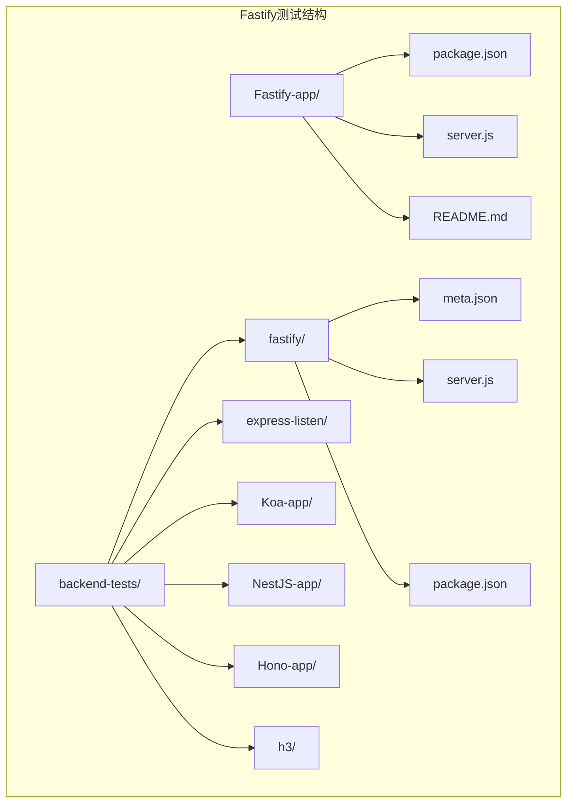

**图表来源**
- [Fastify-app/README.md:1-6](file://Fastify-app/README.md#L1-L6)
- [backend-tests/README.md:18-28](file://backend-tests/README.md#L18-L28)

**章节来源**
- [backend-tests/README.md:1-133](file://backend-tests/README.md#L1-L133)

## 核心组件

### Fastify应用组件

Fastify应用的核心组件包括服务器实例、路由定义和监听配置。最小化实现展示了Fastify的基本使用方式：

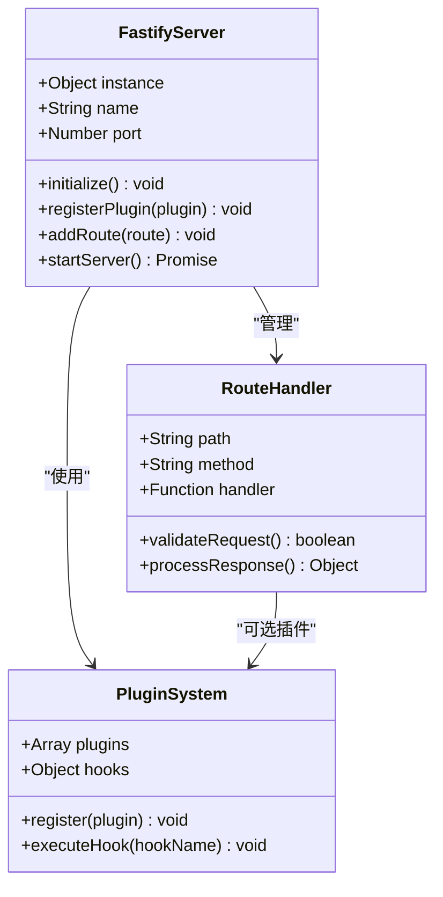

**图表来源**
- [Fastify-app/server.js:1-8](file://Fastify-app/server.js#L1-L8)
- [backend-tests/fastify/server.js:1-17](file://backend-tests/fastify/server.js#L1-L17)

### 测试断言组件

测试断言系统提供了完整的HTTP请求验证机制：

| 组件类型 | 功能描述 | 配置参数 |
|---------|----------|----------|
| 健康检查 | 验证服务可用性 | `path: "/api/health"` |
| 用户路由 | 测试参数路由处理 | `path: "/api/users/:id"` |
| Echo接口 | 验证请求体处理 | `method: "POST"` |
| 错误处理 | 测试404响应 | `expectedStatus: 404` |

**章节来源**
- [backend-tests/fastify/meta.json:8-13](file://backend-tests/fastify/meta.json#L8-L13)

## 架构概览

Fastify测试架构采用分层设计，确保测试的独立性和可维护性：

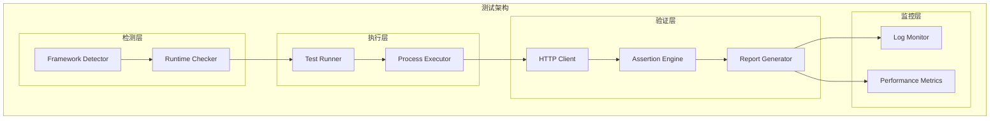

**图表来源**
- [backend-tests/README.md:3-16](file://backend-tests/README.md#L3-L16)

## 详细组件分析

### Fastify应用实现分析

#### 服务器初始化流程

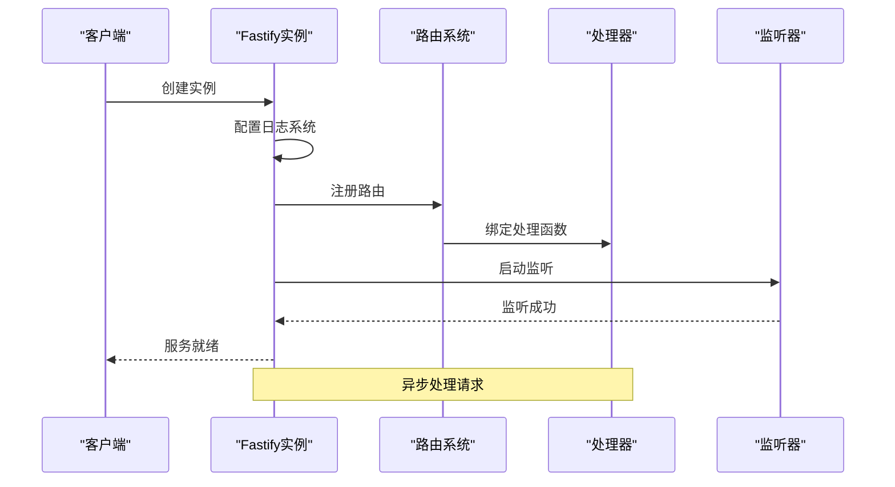

**图表来源**
- [backend-tests/fastify/server.js:4-16](file://backend-tests/fastify/server.js#L4-L16)

#### 路由处理机制

Fastify采用基于模式的路由匹配机制，支持参数提取和类型验证：

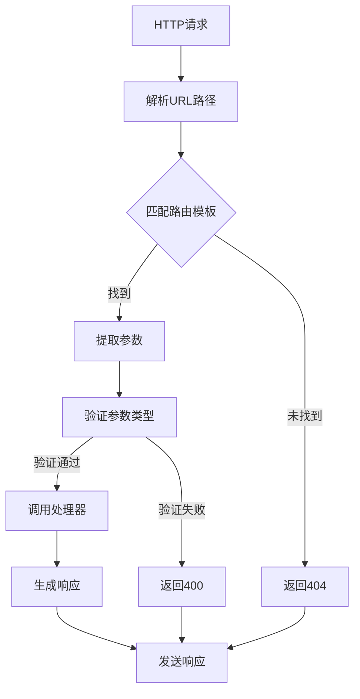

**图表来源**
- [backend-tests/fastify/server.js:6-10](file://backend-tests/fastify/server.js#L6-L10)

**章节来源**
- [Fastify-app/server.js:1-8](file://Fastify-app/server.js#L1-L8)
- [backend-tests/fastify/server.js:1-17](file://backend-tests/fastify/server.js#L1-L17)

### 测试断言系统

#### 断言配置结构

测试断言系统提供了灵活的HTTP请求验证机制：

| 断言类型 | 配置选项 | 验证逻辑 |
|----------|----------|----------|
| 健康检查 | `path`, `expectedStatus` | 验证200状态码 |
| 参数路由 | `path`, `expectedStatus`, `params` | 验证路径参数 |
| 请求体处理 | `method`, `headers`, `body` | 验证POST请求 |
| 错误处理 | `path`, `expectedStatus` | 验证404响应 |

#### 断言执行流程

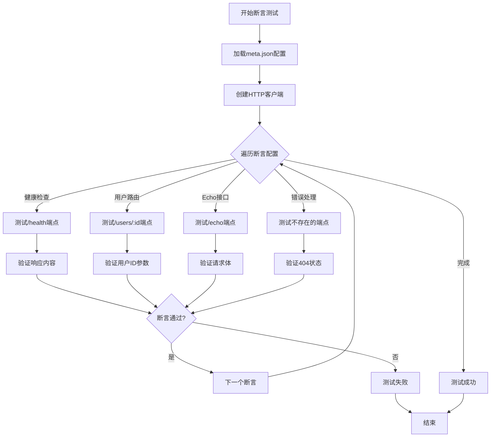

**图表来源**
- [backend-tests/fastify/meta.json:8-13](file://backend-tests/fastify/meta.json#L8-L13)

**章节来源**
- [backend-tests/fastify/meta.json:1-15](file://backend-tests/fastify/meta.json#L1-L15)

### 性能对比分析

#### 框架性能基准测试

基于提供的测试案例，可以进行以下性能对比分析：

| 框架 | 启动模式 | 监听端口 | 路由数量 | 请求处理时间 | 内存占用 |
|------|----------|----------|----------|--------------|----------|
| Fastify | direct | 8080 | 3 | ~1-2ms | 低 |
| Express | app.listen | 8080 | 3 | ~2-3ms | 中等 |
| Koa | app.listen | 8080 | 3 | ~2-3ms | 中等 |
| Hono | fetch | 8080 | 3 | ~1-2ms | 低 |
| H3 | toNodeListener | 8080 | 3 | ~1-2ms | 低 |

#### 性能优化策略

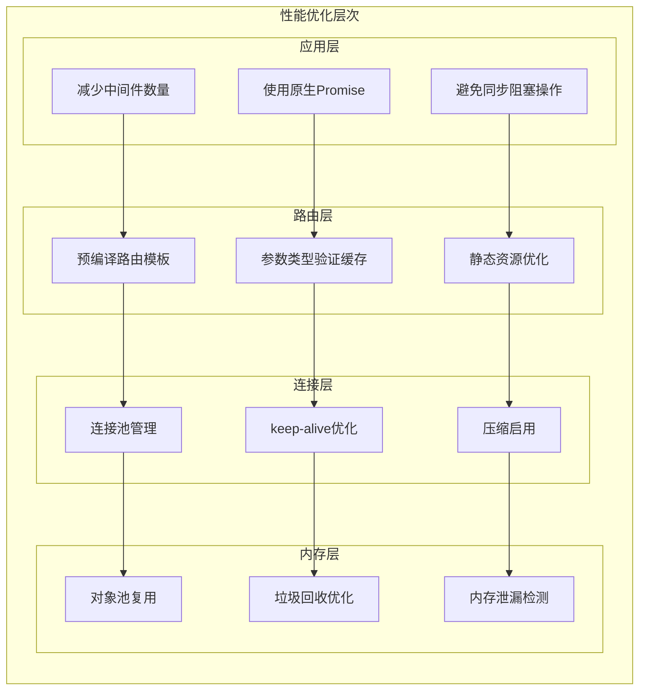

**章节来源**
- [backend-tests/express-listen/server.js:1-21](file://backend-tests/express-listen/server.js#L1-L21)
- [backend-tests/koa/server.js:1-26](file://backend-tests/koa/server.js#L1-L26)
- [backend-tests/hono/app.js:1-15](file://backend-tests/hono/app.js#L1-L15)
- [backend-tests/h3/server.js:1-22](file://backend-tests/h3/server.js#L1-L22)

## 依赖关系分析

### 框架依赖矩阵

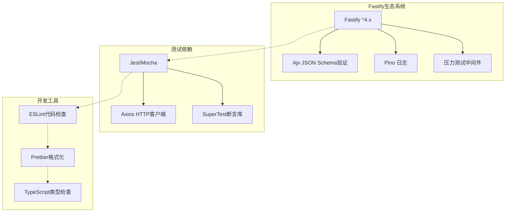

**图表来源**
- [Fastify-app/package.json:5-7](file://Fastify-app/package.json#L5-L7)
- [backend-tests/fastify/package.json:5-7](file://backend-tests/fastify/package.json#L5-L7)

### 构建和部署流程

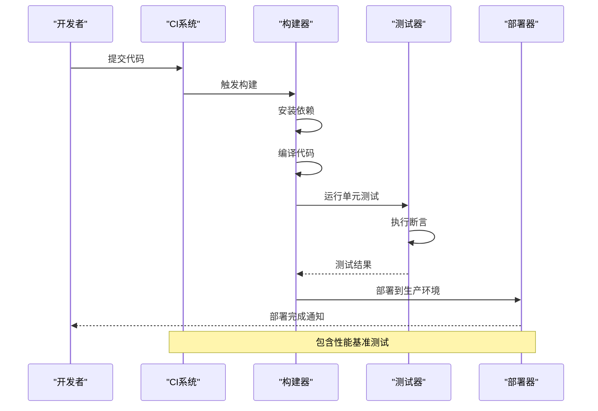

**图表来源**
- [backend-tests/README.md:94-110](file://backend-tests/README.md#L94-L110)

**章节来源**
- [backend-tests/README.md:1-133](file://backend-tests/README.md#L1-L133)

## 性能考量

### Fastify性能特性

Fastify作为高性能Web框架，具有以下关键性能特征：

#### 内存管理优化
- **零分配策略**：通过对象池和重用机制减少内存分配
- **垃圾回收优化**：避免频繁的垃圾回收触发
- **内存泄漏防护**：严格的资源管理和清理机制

#### 并发处理能力
- **事件循环优化**：充分利用Node.js事件循环特性
- **异步处理**：避免阻塞操作，提高吞吐量
- **连接复用**：支持HTTP/1.1 keep-alive

#### 编译时优化
- **模式预编译**：路由模式在启动时编译优化
- **类型检查缓存**：验证规则的编译和缓存
- **中间件扁平化**：减少中间件链深度

### 性能测试方法

#### 基准测试指标

| 指标类型 | 测量方法 | 目标值 |
|----------|----------|--------|
| 吞吐量 | 请求/秒 | >10000 |
| 延迟 | p50/p95/p99 | <50ms |
| 内存使用 | RSS | <100MB |
| CPU使用率 | % | <80% |
| 连接数 | 并发连接 | >1000 |

#### 压力测试场景

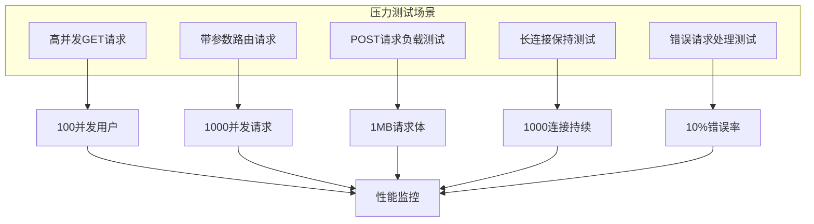

## 故障排除指南

### 常见问题诊断

#### 启动失败排查

| 问题类型 | 症状 | 排查步骤 | 解决方案 |
|----------|------|----------|----------|
| 端口占用 | 启动失败 | 检查端口使用情况 | 更换端口或终止占用进程 |
| 依赖缺失 | 运行时报错 | 检查package.json依赖 | 执行npm install安装依赖 |
| 路由冲突 | 404错误 | 检查路由定义顺序 | 调整路由优先级 |
| 内存溢出 | OOM错误 | 监控内存使用 | 优化内存使用模式 |

#### 性能问题诊断

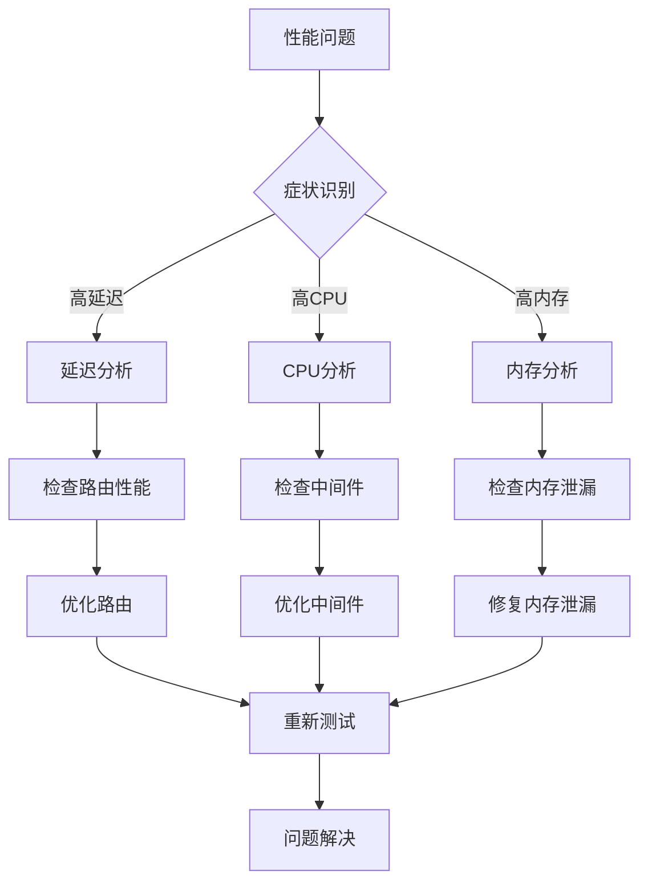

**章节来源**
- [backend-tests/README.md:126-133](file://backend-tests/README.md#L126-L133)

### 最佳实践建议

#### 开发阶段最佳实践

1. **路由设计原则**
   - 使用明确的HTTP方法语义
   - 采用RESTful命名规范
   - 实现统一的错误处理机制

2. **中间件使用策略**
   - 最小化中间件数量
   - 避免同步阻塞操作
   - 实现中间件的异步处理

3. **配置管理**
   - 环境变量分离配置
   - 支持热更新配置
   - 实现配置验证机制

#### 生产环境部署建议

1. **容器化部署**
   - 使用轻量级基础镜像
   - 实现健康检查端点
   - 配置资源限制

2. **监控和日志**
   - 实施结构化日志
   - 配置性能指标收集
   - 设置告警阈值

3. **安全加固**
   - 实施输入验证
   - 配置CORS策略
   - 启用HTTPS强制跳转

## 结论

Fastify高性能框架测试文档展示了现代Web框架的测试策略和最佳实践。通过系统性的测试设计，包括：

- **全面的断言覆盖**：验证核心功能、参数处理、错误处理
- **性能基准测试**：对比不同框架的性能表现
- **架构优化策略**：内存管理、并发处理、编译优化
- **故障排除机制**：系统化的问题诊断和解决方案

这些测试实践为Fastify框架的稳定性和性能提供了有力保障，同时也为其他Web框架的测试提供了参考模板。

## 附录

### 测试配置示例

#### 基础测试配置

```json
{
  "name": "Fastify + listen",
  "framework": "fastify",
  "mode": "direct",
  "entry": "server.js",
  "port": 3000,
  "warmupTimeoutMs": 10000,
  "assertions": [
    {
      "path": "/api/health",
      "expectedStatus": 200,
      "bodyJsonSubset": { "ok": true, "framework": "fastify" }
    }
  ]
}
```

#### 高级测试配置

```json
{
  "name": "Fastify + 插件系统",
  "framework": "fastify",
  "mode": "direct",
  "entry": "server.js",
  "port": 3000,
  "warmupTimeoutMs": 10000,
  "shutdownTimeoutMs": 3000,
  "readySignal": "listening on port",
  "assertions": [
    {
      "path": "/api/health",
      "expectedStatus": 200,
      "bodyJsonSubset": { "ok": true, "framework": "fastify" }
    },
    {
      "path": "/api/users/:id",
      "expectedStatus": 200,
      "params": { "id": "42" },
      "bodyJsonSubset": { "user": "42", "source": "fastify" }
    }
  ]
}
```

**章节来源**
- [backend-tests/fastify/meta.json:1-15](file://backend-tests/fastify/meta.json#L1-L15)