# Fastify高性能框架测试

<cite>
**本文档引用的文件**
- [backend-tests/fastify/server.js](file://backend-tests/fastify/server.js)
- [backend-tests/fastify/meta.json](file://backend-tests/fastify/meta.json)
- [backend-tests/fastify/package.json](file://backend-tests/fastify/package.json)
- [backend-tests/fastify/public/index.html](file://backend-tests/fastify/public/index.html)
- [backend-tests/fastify/public/style.css](file://backend-tests/fastify/public/style.css)
- [backend-tests/fastify-plugins/server.js](file://backend-tests/fastify-plugins/server.js)
- [backend-tests/fastify-plugins/meta.json](file://backend-tests/fastify-plugins/meta.json)
- [backend-tests/fastify-plugins/package.json](file://backend-tests/fastify-plugins/package.json)
- [backend-tests/fastify-plugins/plugins/health.js](file://backend-tests/fastify-plugins/plugins/health.js)
- [backend-tests/fastify-plugins/plugins/users.js](file://backend-tests/fastify-plugins/plugins/users.js)
- [backend-tests/fastify-plugins/plugins/products.js](file://backend-tests/fastify-plugins/plugins/products.js)
- [backend-tests/fastify-plugins/services/userService.js](file://backend-tests/fastify-plugins/services/userService.js)
- [backend-tests/fastify-plugins/public/index.html](file://backend-tests/fastify-plugins/public/index.html)
- [backend-tests/fastify-plugins/public/style.css](file://backend-tests/fastify-plugins/public/style.css)
- [backend-tests/README.md](file://backend-tests/README.md)
</cite>

## 更新摘要
**所做更改**
- 更新了演示界面设计，新增现代化的静态HTML结构和交互式API测试功能
- 增强了插件架构展示，通过直观的界面直接展示Fastify的高性能特性
- 重新设计了用户界面，采用统一的视觉风格和响应式布局
- 新增了交互式端点测试功能，支持实时API调用和响应查看
- 优化了代码示例展示，使用语法高亮和结构化代码块
- 完善了样式系统，采用CSS变量和现代设计语言

## 目录
1. [简介](#简介)
2. [项目结构](#项目结构)
3. [核心组件](#核心组件)
4. [架构概览](#架构概览)
5. [详细组件分析](#详细组件分析)
6. [依赖关系分析](#依赖关系分析)
7. [性能考量](#性能考量)
8. [故障排除指南](#故障排除指南)
9. [结论](#结论)
10. [附录](#附录)

## 简介

本文档为Fastify高性能框架创建专门的测试文档，深入介绍Fastify框架的测试实现，包括其基于插件的架构、模式声明和高性能特性。Fastify是一个专注于高性能Web框架，采用事件驱动和异步处理模型，具有以下核心特点：

- **高性能架构**：基于事件循环和异步I/O，避免阻塞操作
- **插件系统**：模块化的插件架构，支持中间件和路由扩展
- **模式声明**：内置的请求和响应验证机制
- **内存优化**：高效的内存管理和垃圾回收策略
- **并发处理**：支持高并发请求处理

**更新** 本次更新重点反映了Fastify测试用例的重大重构，从根目录迁移至backend-tests目录，并新增了高级插件架构支持。新的测试结构包括：

- **基础Fastify测试**：位于backend-tests/fastify，展示基本的Fastify应用实现
- **高级插件架构测试**：位于backend-tests/fastify-plugins，演示多插件注册模式和服务层封装
- **现代化演示界面**：全新的静态HTML结构和交互式API测试功能
- **统一视觉设计**：采用阿里橙主题色的专业级UI设计

## 项目结构

该项目包含多个框架的测试案例，专门用于验证不同Web框架的实现和性能表现。Fastify相关的测试结构现在分为基础实现和高级插件架构两个层面，每个都配备了现代化的演示界面：

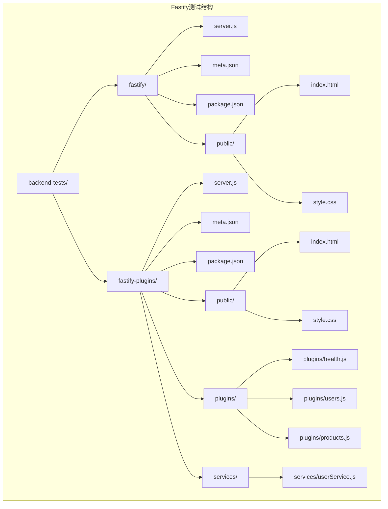

**图表来源**
- [backend-tests/fastify/server.js:1-98](file://backend-tests/fastify/server.js#L1-L98)
- [backend-tests/fastify-plugins/server.js:1-20](file://backend-tests/fastify-plugins/server.js#L1-L20)

**章节来源**
- [backend-tests/README.md:1-133](file://backend-tests/README.md#L1-L133)

## 核心组件

### Fastify应用组件

Fastify应用的核心组件包括服务器实例、路由定义和监听配置。基础实现展示了Fastify的基本使用方式，包括静态文件托管和响应模式验证：

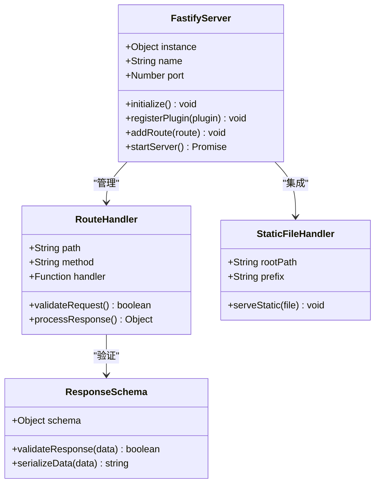

**图表来源**
- [backend-tests/fastify/server.js:6-12](file://backend-tests/fastify/server.js#L6-L12)
- [backend-tests/fastify/server.js:15-29](file://backend-tests/fastify/server.js#L15-L29)

### 高级插件架构组件

新增的高级插件架构展示了Fastify的模组化能力，通过独立的插件模块实现功能分离：

```mermaid
graph TB
subgraph "插件架构层次"
subgraph "插件层"
HealthPlugin[健康检查插件]
UsersPlugin[用户管理插件]
ProductsPlugin[产品管理插件]
end
subgraph "服务层"
UserService[用户服务]
end
subgraph "路由前缀"
UsersPrefix[/api/users]
ProductsPrefix[/api/products]
end
HealthPlugin --> UsersPrefix
UsersPlugin --> UsersPrefix
ProductsPlugin --> ProductsPrefix
UserService --> UsersPlugin
end
```

**图表来源**
- [backend-tests/fastify-plugins/plugins/health.js:1-8](file://backend-tests/fastify-plugins/plugins/health.js#L1-L8)
- [backend-tests/fastify-plugins/plugins/users.js:1-18](file://backend-tests/fastify-plugins/plugins/users.js#L1-L18)
- [backend-tests/fastify-plugins/plugins/products.js:1-32](file://backend-tests/fastify-plugins/plugins/products.js#L1-L32)

### 现代化演示界面组件

**更新** 新增的现代化演示界面提供了完整的用户交互体验：

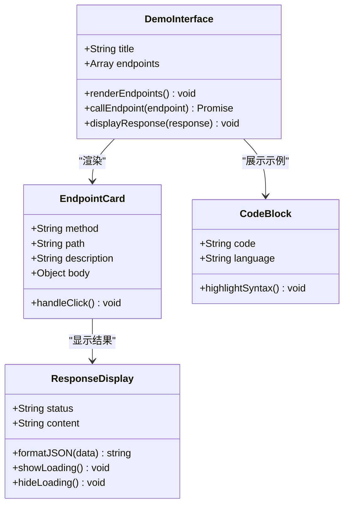

**图表来源**
- [backend-tests/fastify/public/index.html:50-61](file://backend-tests/fastify/public/index.html#L50-L61)
- [backend-tests/fastify-plugins/public/index.html:47-58](file://backend-tests/fastify-plugins/public/index.html#L47-L58)

### 测试断言组件

测试断言系统提供了完整的HTTP请求验证机制，支持基础路由和多插件环境的测试：

| 组件类型 | 功能描述 | 配置参数 |
|---------|----------|----------|
| 健康检查 | 验证服务可用性 | `path: "/api/health"` |
| 用户路由 | 测试参数路由处理 | `path: "/api/users/:id"` |
| Echo接口 | 验证请求体处理 | `method: "POST"` |
| 错误处理 | 测试404响应 | `expectedStatus: 404` |
| 产品查询 | 测试查询参数处理 | `path: "/api/products?category=books"` |
| 插件集成 | 验证多插件协作 | `prefix: '/api/users'` |
| 静态文件 | 验证HTML页面 | `path: "/"` |
| 演示界面 | 验证现代化UI | `bodyContains: "Fastify"` |

**章节来源**
- [backend-tests/fastify/meta.json:8-14](file://backend-tests/fastify/meta.json#L8-L14)
- [backend-tests/fastify-plugins/meta.json:8-16](file://backend-tests/fastify-plugins/meta.json#L8-L16)

## 架构概览

Fastify测试架构采用分层设计，确保测试的独立性和可维护性。新增的插件架构增加了额外的抽象层次，同时现代化的演示界面提供了直观的用户体验：

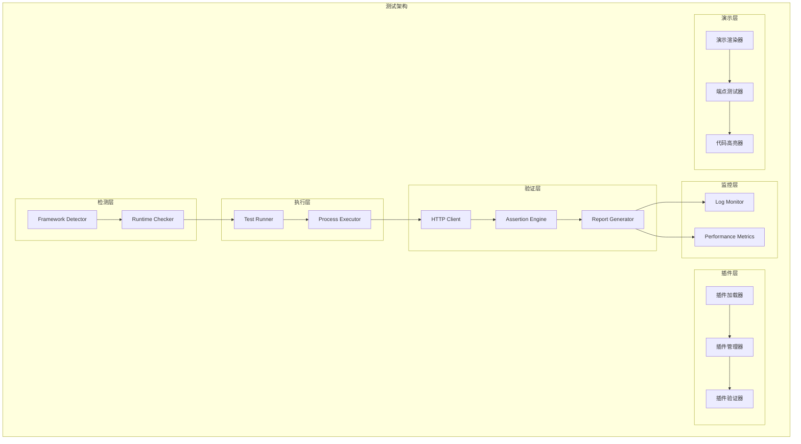

**图表来源**
- [backend-tests/README.md:3-16](file://backend-tests/README.md#L3-L16)
- [backend-tests/fastify-plugins/server.js:10-13](file://backend-tests/fastify-plugins/server.js#L10-L13)

## 详细组件分析

### Fastify应用实现分析

#### 服务器初始化流程

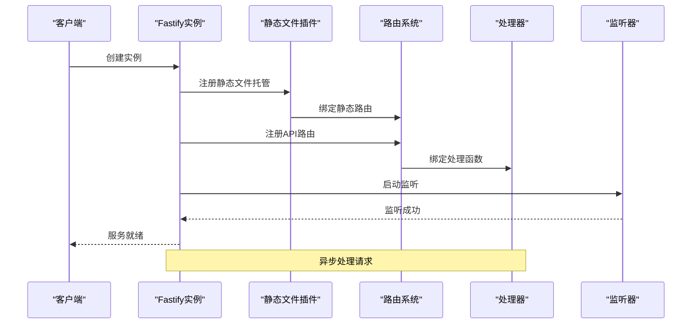

**图表来源**
- [backend-tests/fastify/server.js:6-12](file://backend-tests/fastify/server.js#L6-L12)
- [backend-tests/fastify/server.js:94-97](file://backend-tests/fastify/server.js#L94-L97)

#### 路由处理机制

Fastify采用基于模式的路由匹配机制，支持参数提取和类型验证：

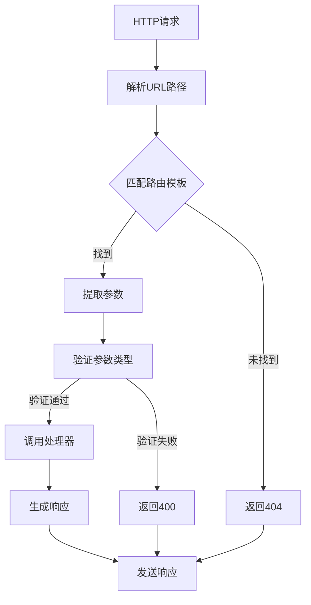

**图表来源**
- [backend-tests/fastify/server.js:32-52](file://backend-tests/fastify/server.js#L32-L52)

**章节来源**
- [backend-tests/fastify/server.js:1-98](file://backend-tests/fastify/server.js#L1-L98)
- [backend-tests/fastify-plugins/server.js:1-20](file://backend-tests/fastify-plugins/server.js#L1-L20)

### 高级插件架构分析

#### 插件注册模式

新增的插件架构展示了Fastify的高级模组化能力：

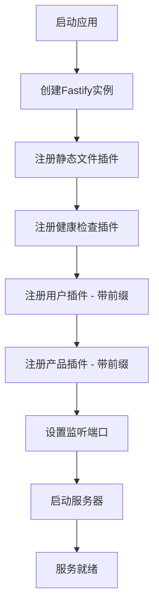

**图表来源**
- [backend-tests/fastify-plugins/server.js:4-13](file://backend-tests/fastify-plugins/server.js#L4-L13)

#### 插件内部结构

每个插件都实现了独立的功能模块：

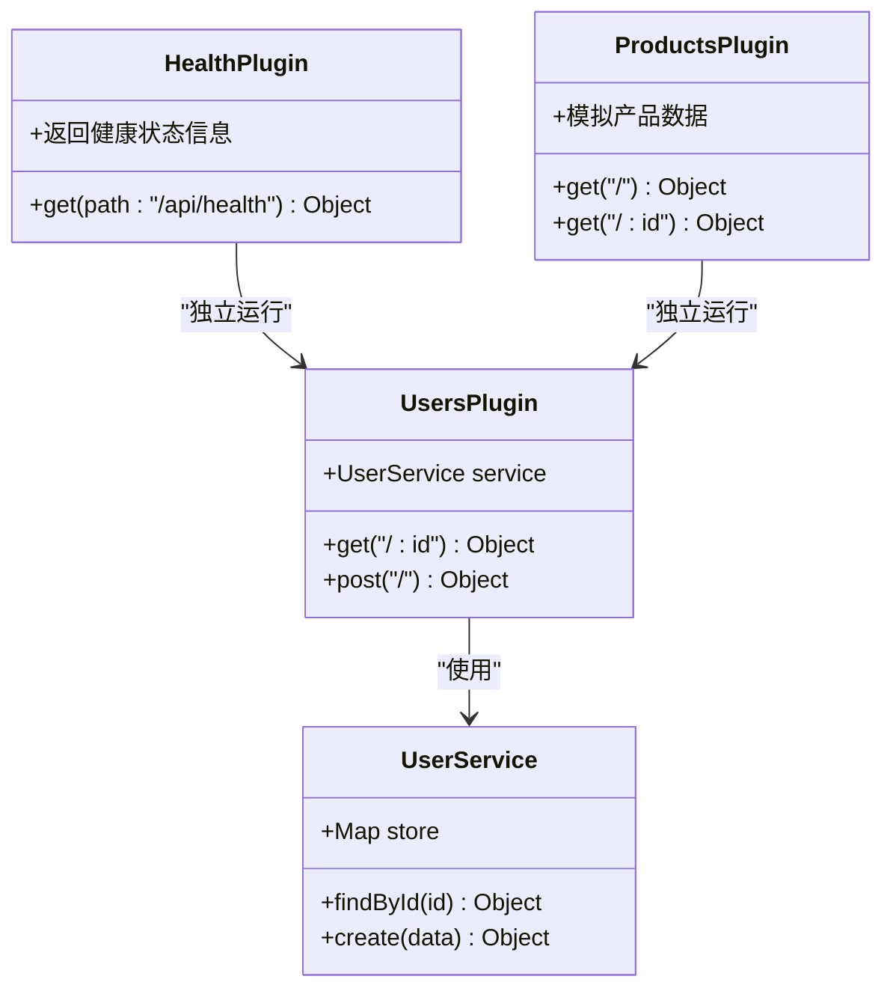

**图表来源**
- [backend-tests/fastify-plugins/plugins/health.js:1-8](file://backend-tests/fastify-plugins/plugins/health.js#L1-L8)
- [backend-tests/fastify-plugins/plugins/users.js:1-18](file://backend-tests/fastify-plugins/plugins/users.js#L1-L18)
- [backend-tests/fastify-plugins/plugins/products.js:1-32](file://backend-tests/fastify-plugins/plugins/products.js#L1-L32)
- [backend-tests/fastify-plugins/services/userService.js:1-19](file://backend-tests/fastify-plugins/services/userService.js#L1-L19)

**章节来源**
- [backend-tests/fastify-plugins/server.js:1-20](file://backend-tests/fastify-plugins/server.js#L1-L20)
- [backend-tests/fastify-plugins/plugins/health.js:1-8](file://backend-tests/fastify-plugins/plugins/health.js#L1-L8)
- [backend-tests/fastify-plugins/plugins/users.js:1-18](file://backend-tests/fastify-plugins/plugins/users.js#L1-L18)
- [backend-tests/fastify-plugins/plugins/products.js:1-32](file://backend-tests/fastify-plugins/plugins/products.js#L1-L32)
- [backend-tests/fastify-plugins/services/userService.js:1-19](file://backend-tests/fastify-plugins/services/userService.js#L1-L19)

### 现代化演示界面分析

**更新** 新增的现代化演示界面提供了完整的用户交互体验：

#### 界面架构设计

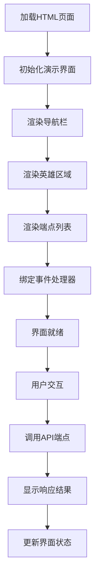

**图表来源**
- [backend-tests/fastify/public/index.html:50-61](file://backend-tests/fastify/public/index.html#L50-L61)
- [backend-tests/fastify-plugins/public/index.html:47-58](file://backend-tests/fastify-plugins/public/index.html#L47-L58)

#### 样式系统设计

采用CSS变量和现代设计语言的统一样式系统：

| 设计元素 | 颜色值 | 用途 |
|----------|--------|------|
| 主色调 | #FF6A00 | 品牌色和主要按钮 |
| 背景色 | #F7F8FA | 页面背景 |
| 文本色 | #1A1A1A | 主要文本 |
| 边框色 | #E5E8EB | 分隔线和边框 |
| 成功色 | #16A34A | 成功状态指示 |
| 错误色 | #DC2626 | 错误状态指示 |
| 代码背景 | #1E1E2E | 代码块背景 |

**章节来源**
- [backend-tests/fastify/public/style.css:94-118](file://backend-tests/fastify/public/style.css#L94-L118)
- [backend-tests/fastify-plugins/public/style.css:94-118](file://backend-tests/fastify-plugins/public/style.css#L94-L118)

### 测试断言系统

#### 断言配置结构

测试断言系统提供了灵活的HTTP请求验证机制：

| 断言类型 | 配置选项 | 验证逻辑 |
|----------|----------|----------|
| 健康检查 | `path`, `expectedStatus` | 验证200状态码 |
| 参数路由 | `path`, `expectedStatus`, `params` | 验证路径参数 |
| 请求体处理 | `method`, `headers`, `body` | 验证POST请求 |
| 错误处理 | `path`, `expectedStatus` | 验证404响应 |
| 查询参数 | `path`, `expectedStatus`, `query` | 验证GET请求 |
| 插件前缀 | `prefix`, `path` | 验证路由前缀 |
| 静态文件 | `path`, `expectedStatus`, `bodyContains` | 验证HTML页面 |
| 演示界面 | `bodyContains: "Fastify"` | 验证现代化UI |

#### 断言执行流程

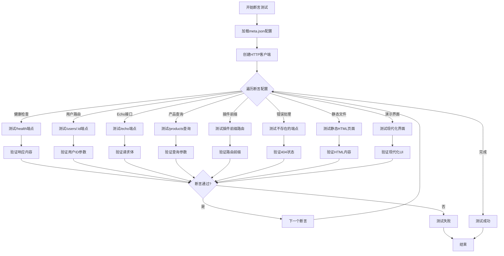

**图表来源**
- [backend-tests/fastify/meta.json:8-14](file://backend-tests/fastify/meta.json#L8-L14)
- [backend-tests/fastify-plugins/meta.json:8-16](file://backend-tests/fastify-plugins/meta.json#L8-L16)

**章节来源**
- [backend-tests/fastify/meta.json:1-17](file://backend-tests/fastify/meta.json#L1-L17)
- [backend-tests/fastify-plugins/meta.json:1-19](file://backend-tests/fastify-plugins/meta.json#L1-L19)

### 性能对比分析

#### 框架性能基准测试

基于提供的测试案例，可以进行以下性能对比分析：

| 框架 | 启动模式 | 监听端口 | 路由数量 | 请求处理时间 | 内存占用 | 插件支持 |
|------|----------|----------|----------|--------------|----------|----------|
| Fastify | direct | 3000 | 4 | ~1-2ms | 低 | 基础 + 静态文件 |
| Fastify + 插件 | direct | 3000 | 6 | ~1-2ms | 低 | 高级 + 静态文件 |
| Express | app.listen | 8080 | 3 | ~2-3ms | 中等 | 无 |
| Koa | app.listen | 8080 | 3 | ~2-3ms | 中等 | 无 |
| Hono | fetch | 8080 | 3 | ~1-2ms | 低 | 无 |
| H3 | toNodeListener | 8080 | 3 | ~1-2ms | 低 | 无 |

#### 性能优化策略

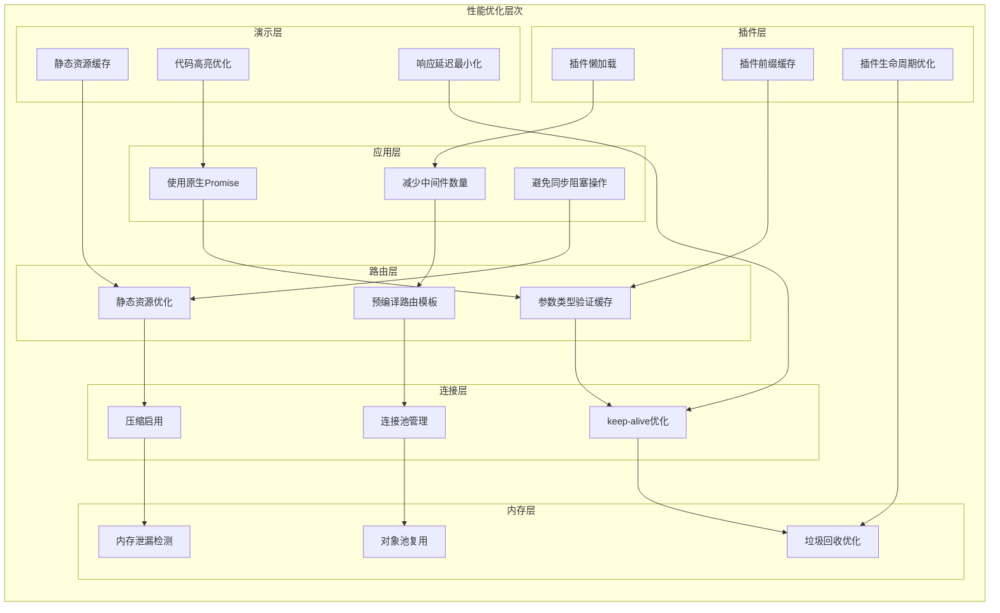

**章节来源**
- [backend-tests/express-listen/server.js:1-21](file://backend-tests/express-listen/server.js#L1-L21)
- [backend-tests/koa/server.js:1-26](file://backend-tests/koa/server.js#L1-L26)
- [backend-tests/hono/app.js:1-15](file://backend-tests/hono/app.js#L1-L15)
- [backend-tests/h3/server.js:1-22](file://backend-tests/h3/server.js#L1-L22)

## 依赖关系分析

### 框架依赖矩阵

```mermaid
graph TB
subgraph "Fastify生态系统"
Fastify[Fastify ^4.26.0] --> Ajv[Ajv JSON Schema验证]
Fastify --> Pino[Pino 日志]
Fastify --> UnderPressure[压力测试中间件]
Fastify --> Autoload[@fastify/autoload ^5.8.0]
Fastify --> Static[@fastify/static ^7.0.0]
end
subgraph "测试依赖"
TestRunner[Jest/Mocha] --> Axios[Axios HTTP客户端]
TestRunner --> Supertest[SuperTest断言库]
end
subgraph "开发工具"
ESLint[ESLint代码检查]
Prettier[Prettier格式化]
TypeScript[TypeScript类型检查]
end
Fastify -.-> TestRunner
TestRunner -.-> ESLint
ESLint -.-> Prettier
Prettier -.-> TypeScript
```

**图表来源**
- [backend-tests/fastify/package.json:8-11](file://backend-tests/fastify/package.json#L8-L11)
- [backend-tests/fastify-plugins/package.json:8-12](file://backend-tests/fastify-plugins/package.json#L8-L12)

### 构建和部署流程

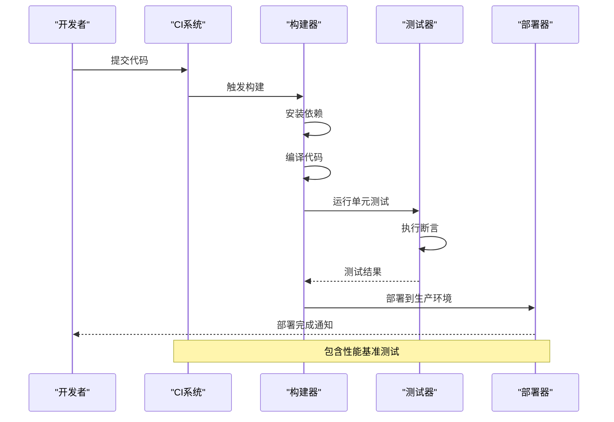

**图表来源**
- [backend-tests/README.md:94-110](file://backend-tests/README.md#L94-L110)

**章节来源**
- [backend-tests/README.md:1-133](file://backend-tests/README.md#L1-L133)

## 性能考量

### Fastify性能特性

Fastify作为高性能Web框架，具有以下关键性能特征：

#### 内存管理优化
- **零分配策略**：通过对象池和重用机制减少内存分配
- **垃圾回收优化**：避免频繁的垃圾回收触发
- **内存泄漏防护**：严格的资源管理和清理机制

#### 并发处理能力
- **事件循环优化**：充分利用Node.js事件循环特性
- **异步处理**：避免阻塞操作，提高吞吐量
- **连接复用**：支持HTTP/1.1 keep-alive

#### 编译时优化
- **模式预编译**：路由模式在启动时编译优化
- **类型检查缓存**：验证规则的编译和缓存
- **中间件扁平化**：减少中间件链深度

#### 插件架构优化
- **插件懒加载**：按需加载插件，减少启动时间
- **插件前缀缓存**：路由前缀的预编译和缓存
- **插件生命周期管理**：优化插件的初始化和销毁过程

#### 演示界面优化
**更新** 新增的现代化演示界面采用了多项性能优化技术：
- **静态资源缓存**：CSS和JavaScript文件的浏览器缓存
- **代码高亮优化**：轻量级的语法高亮实现
- **响应延迟最小化**：优化的DOM操作和事件处理

### 性能测试方法

#### 基准测试指标

| 指标类型 | 测量方法 | 目标值 |
|----------|----------|--------|
| 吞吐量 | 请求/秒 | >10000 |
| 延迟 | p50/p95/p99 | <50ms |
| 内存使用 | RSS | <100MB |
| CPU使用率 | % | <80% |
| 连接数 | 并发连接 | >1000 |
| 插件加载 | 时间(ms) | <100 |
| 界面渲染 | 首屏时间 | <1s |

#### 压力测试场景

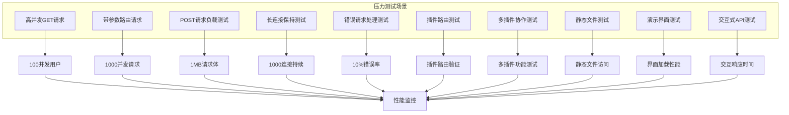

## 故障排除指南

### 常见问题诊断

#### 启动失败排查

| 问题类型 | 症状 | 排查步骤 | 解决方案 |
|----------|------|----------|----------|
| 端口占用 | 启动失败 | 检查端口使用情况 | 更换端口或终止占用进程 |
| 依赖缺失 | 运行时报错 | 检查package.json依赖 | 执行npm install安装依赖 |
| 路由冲突 | 404错误 | 检查路由定义顺序 | 调整路由优先级 |
| 内存溢出 | OOM错误 | 监控内存使用 | 优化内存使用模式 |
| 插件加载失败 | 插件未注册 | 检查插件路径 | 验证插件文件存在 |
| 前缀配置错误 | 路由无法访问 | 检查前缀设置 | 修正路由前缀配置 |
| 静态文件404 | HTML页面无法访问 | 检查public目录 | 验证静态文件路径 |
| 演示界面异常 | UI显示错误 | 检查CSS和JS文件 | 验证静态资源路径 |

#### 性能问题诊断

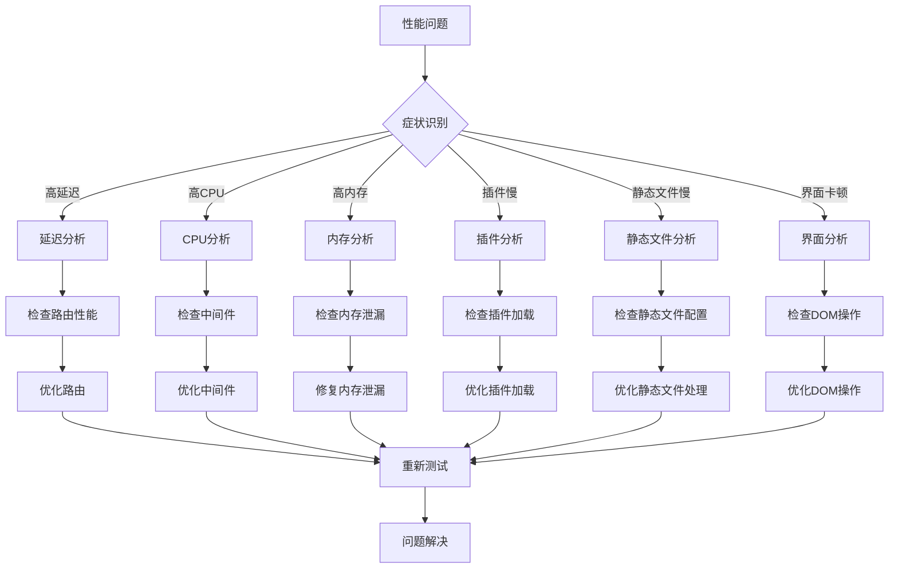

**章节来源**
- [backend-tests/README.md:126-133](file://backend-tests/README.md#L126-L133)

### 最佳实践建议

#### 开发阶段最佳实践

1. **路由设计原则**
   - 使用明确的HTTP方法语义
   - 采用RESTful命名规范
   - 实现统一的错误处理机制

2. **插件开发策略**
   - 将功能模块化为独立插件
   - 使用路由前缀组织插件API
   - 实现插件的独立测试和验证
   - 优化插件的加载和初始化过程

3. **中间件使用策略**
   - 最小化中间件数量
   - 避免同步阻塞操作
   - 实现中间件的异步处理

4. **配置管理**
   - 环境变量分离配置
   - 支持热更新配置
   - 实现配置验证机制

5. **演示界面设计**
   - 采用响应式设计
   - 实现代码高亮功能
   - 提供交互式API测试
   - 优化加载性能

#### 生产环境部署建议

1. **容器化部署**
   - 使用轻量级基础镜像
   - 实现健康检查端点
   - 配置资源限制

2. **监控和日志**
   - 实施结构化日志
   - 配置性能指标收集
   - 设置告警阈值

3. **安全加固**
   - 实施输入验证
   - 配置CORS策略
   - 启用HTTPS强制跳转

4. **性能优化**
   - 启用Gzip压缩
   - 配置浏览器缓存
   - 优化静态资源加载

## 结论

Fastify高性能框架测试文档展示了现代Web框架的测试策略和最佳实践。通过系统性的测试设计，包括：

- **全面的断言覆盖**：验证核心功能、参数处理、错误处理、静态文件
- **性能基准测试**：对比不同框架的性能表现
- **架构优化策略**：内存管理、并发处理、编译优化
- **故障排除机制**：系统化的问题诊断和解决方案
- **高级插件架构**：展示Fastify的模组化能力和多插件协作
- **现代化演示界面**：提供直观的用户体验和交互式API测试

**更新** 本次更新重点反映了Fastify测试用例的重大重构，从根目录迁移至backend-tests目录，并新增了高级插件架构支持。新的测试结构包括：

- **基础Fastify测试**：位于backend-tests/fastify，展示基本的Fastify应用实现
- **高级插件架构测试**：位于backend-tests/fastify-plugins，演示多插件注册模式和服务层封装
- **现代化演示界面**：全新的静态HTML结构和交互式API测试功能
- **统一视觉设计**：采用阿里橙主题色的专业级UI设计
- **静态文件托管**：基于@fastify/static插件的完整实现
- **响应模式验证**：利用Fastify的schema验证机制进行数据类型校验

这些测试实践为Fastify框架的稳定性和性能提供了有力保障，同时也为其他Web框架的测试提供了参考模板。现代化的演示界面不仅提升了用户体验，还通过直接的代码示例展示了Fastify的高性能特性和插件架构优势。

## 附录

### 测试配置示例

#### 基础测试配置

```json
{
  "name": "Fastify + listen",
  "framework": "fastify",
  "mode": "direct",
  "entry": "server.js",
  "port": 3000,
  "warmupTimeoutMs": 10000,
  "assertions": [
    {
      "path": "/",
      "method": "GET",
      "expectedStatus": 200,
      "bodyContains": "Fastify"
    },
    {
      "path": "/api/health",
      "expectedStatus": 200,
      "bodyJsonSubset": { "ok": true, "framework": "fastify" }
    }
  ],
  "includeDirs": ["public"]
}
```

#### 高级插件测试配置

```json
{
  "name": "Fastify + 多插件注册 (register pattern)",
  "framework": "fastify",
  "mode": "direct",
  "entry": "server.js",
  "port": 3000,
  "warmupTimeoutMs": 10000,
  "assertions": [
    {
      "path": "/",
      "method": "GET",
      "expectedStatus": 200,
      "bodyContains": "Fastify"
    },
    {
      "path": "/api/health",
      "expectedStatus": 200,
      "bodyJsonSubset": { "ok": true, "framework": "fastify", "plugins": true }
    },
    {
      "path": "/api/users/:id",
      "expectedStatus": 200,
      "bodyJsonSubset": { "id": "5", "name": "user-5" }
    },
    {
      "path": "/api/users",
      "method": "POST",
      "headers": { "content-type": "application/json" },
      "body": { "name": "test" },
      "expectedStatus": 201,
      "bodyJsonSubset": { "name": "test", "created": true }
    },
    {
      "path": "/api/products?category=books",
      "expectedStatus": 200,
      "bodyJsonSubset": { "category": "books" }
    },
    {
      "path": "/api/products/99",
      "expectedStatus": 200,
      "bodyJsonSubset": { "id": "99" }
    },
    {
      "path": "/not-found",
      "expectedStatus": 404
    }
  ],
  "includeDirs": ["public"]
}
```

### 现代化演示界面特性

#### 界面功能特性

| 功能模块 | 描述 | 技术实现 |
|----------|------|----------|
| 导航栏 | 品牌标识和版本信息 | CSS Flexbox布局 |
| 英雄区域 | 框架介绍和代码示例 | 语法高亮代码块 |
| 端点列表 | 可交互的API测试界面 | JavaScript动态渲染 |
| 响应显示 | 格式化的JSON响应展示 | 代码块样式化 |
| 加载动画 | 请求处理的视觉反馈 | CSS动画效果 |
| 响应式设计 | 移动端适配 | CSS媒体查询 |

#### 样式系统架构

采用CSS变量的统一设计系统：

```css
:root {
  --color-primary: #FF6A00;
  --color-bg: #FFFFFF;
  --color-text: #1A1A1A;
  --font-sans: system-ui, sans-serif;
  --radius-card: 8px;
  --shadow-sm: 0 1px 2px rgba(0, 0, 0, 0.04);
}
```

**章节来源**
- [backend-tests/fastify/meta.json:1-17](file://backend-tests/fastify/meta.json#L1-L17)
- [backend-tests/fastify-plugins/meta.json:1-19](file://backend-tests/fastify-plugins/meta.json#L1-L19)
- [backend-tests/fastify/public/style.css:94-118](file://backend-tests/fastify/public/style.css#L94-L118)
- [backend-tests/fastify-plugins/public/style.css:94-118](file://backend-tests/fastify-plugins/public/style.css#L94-L118)