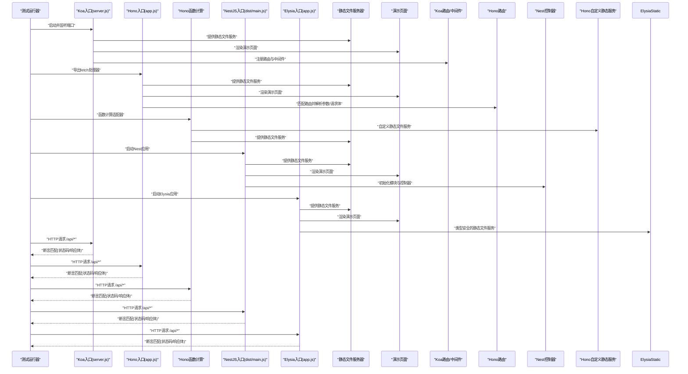
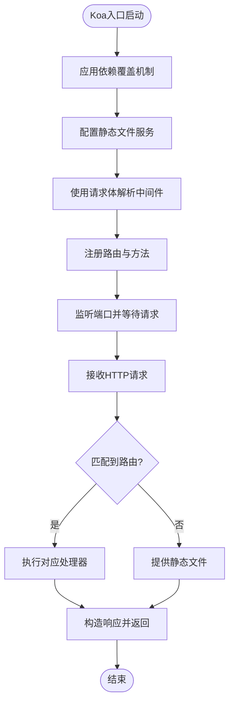
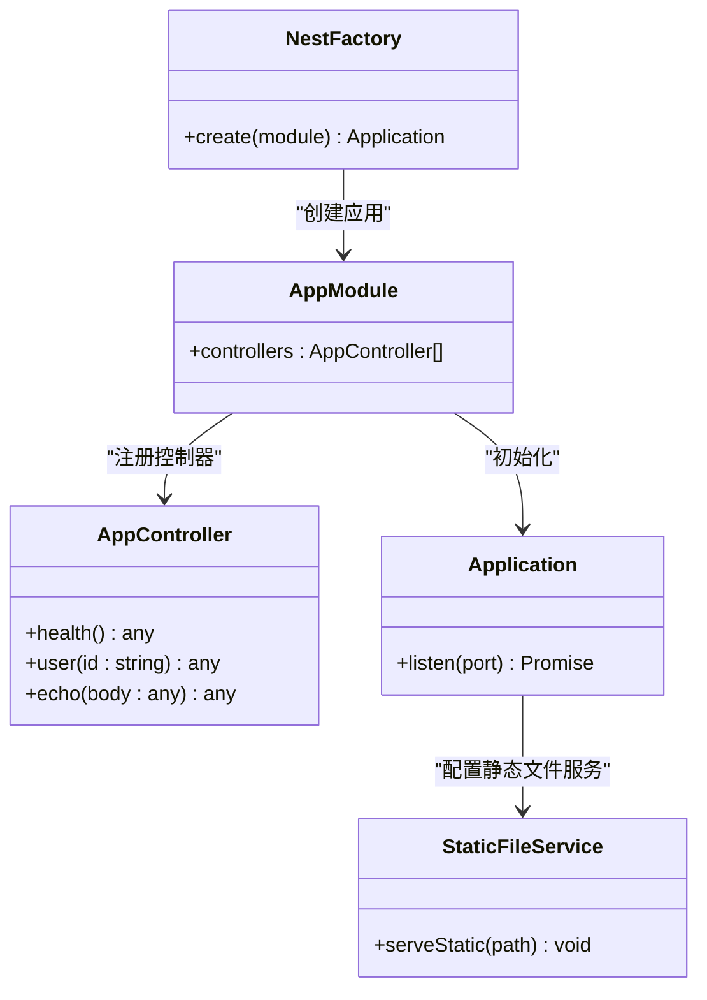
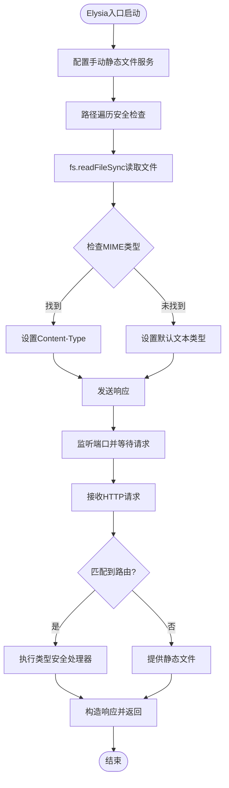
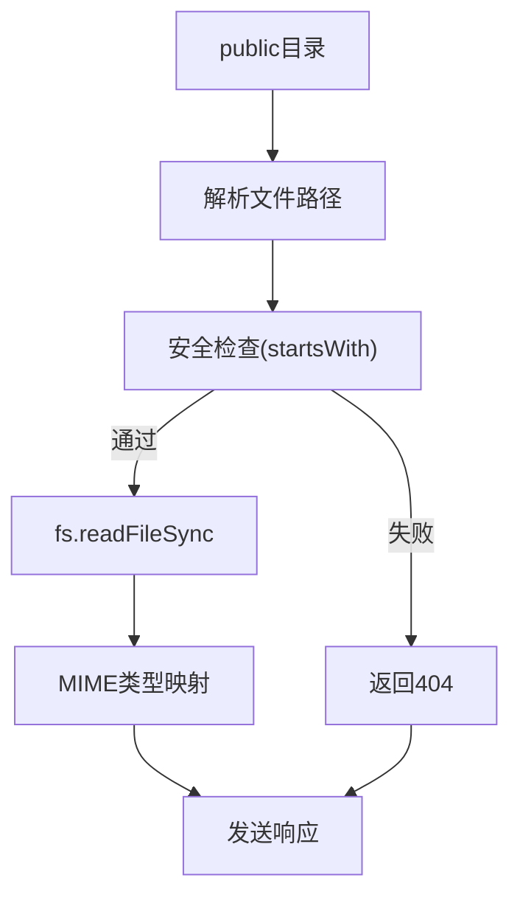
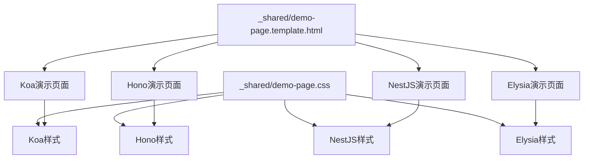
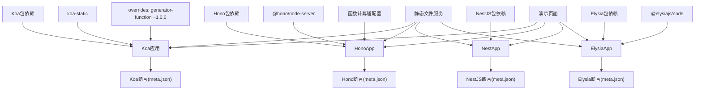

# Koa、Hono、NestJS框架测试

<cite>
**本文档引用的文件**
- [Koa-app/app.js](file://Koa-app/app.js)
- [Hono-app/app.js](file://Hono-app/app.js)
- [NestJS-app/src/main.ts](file://NestJS-app/src/main.ts)
- [backend-tests/koa/meta.json](file://backend-tests/koa/meta.json)
- [backend-tests/hono/meta.json](file://backend-tests/hono/meta.json)
- [backend-tests/nestjs/meta.json](file://backend-tests/nestjs/meta.json)
- [backend-tests/koa/package.json](file://backend-tests/koa/package.json)
- [backend-tests/hono/package.json](file://backend-tests/hono/package.json)
- [backend-tests/nestjs/package.json](file://backend-tests/nestjs/package.json)
- [backend-tests/koa/server.js](file://backend-tests/koa/server.js)
- [backend-tests/hono/app.js](file://backend-tests/hono/app.js)
- [backend-tests/nestjs/dist/main.js](file://backend-tests/nestjs/dist/main.js)
- [backend-tests/nestjs/src/app.module.ts](file://backend-tests/nestjs/src/app.module.ts)
- [backend-tests/nestjs/src/app.controller.ts](file://backend-tests/nestjs/src/app.controller.ts)
- [backend-tests/README.md](file://backend-tests/README.md)
- [case.json](file://case.json)
- [backend-tests/koa/public/index.html](file://backend-tests/koa/public/index.html)
- [backend-tests/hono/public/index.html](file://backend-tests/hono/public/index.html)
- [backend-tests/nestjs/public/index.html](file://backend-tests/nestjs/public/index.html)
- [backend-tests/koa/public/style.css](file://backend-tests/koa/public/style.css)
- [backend-tests/hono/public/style.css](file://backend-tests/hono/public/style.css)
- [backend-tests/nestjs/public/style.css](file://backend-tests/nestjs/public/style.css)
- [backend-tests/_shared/demo-page.template.html](file://backend-tests/_shared/demo-page.template.html)
- [backend-tests/_shared/demo-page.css](file://backend-tests/_shared/demo-page.css)
- [backend-tests/koa/template.json](file://backend-tests/koa/template.json)
- [backend-tests/hono/template.json](file://backend-tests/hono/template.json)
- [backend-tests/nestjs/template.json](file://backend-tests/nestjs/template.json)
- [backend-tests/elysia/app.js](file://backend-tests/elysia/app.js)
- [backend-tests/elysia/package.json](file://backend-tests/elysia/package.json)
- [backend-tests/elysia/meta.json](file://backend-tests/elysia/meta.json)
- [backend-tests/elysia/template.json](file://backend-tests/elysia/template.json)
- [backend-tests/elysia/public/index.html](file://backend-tests/elysia/public/index.html)
- [backend-tests/elysia/public/style.css](file://backend-tests/elysia/public/style.css)
- [backend-tests/hono/fc/app.js](file://backend-tests/hono/fc/app.js)
- [backend-tests/hono/fc/start.mjs](file://backend-tests/hono/fc/start.mjs)
- [backend-tests/hono/fc/public/index.html](file://backend-tests/hono/fc/public/index.html)
- [backend-tests/hono/fc/public/style.css](file://backend-tests/hono/fc/public/style.css)
</cite>

## 更新摘要
**所做更改**
- 更新Hono框架静态文件服务章节，反映从@hono/node-server/serve-static中间件重构为自定义实现的重大架构变更
- 新增Koa测试依赖管理的改进说明，包括overrides部分的generator-function版本覆盖机制
- 新增Hono自定义静态文件服务的安全检查机制、MIME类型映射和错误处理实现细节
- 更新静态文件服务架构图，展示新的自定义实现流程
- 增强Hono组件分析，包含新的静态文件服务实现对比
- 更新依赖关系分析，反映Hono框架对@hono/node-server的依赖变化和Koa的依赖覆盖机制

## 目录
1. [简介](#简介)
2. [项目结构](#项目结构)
3. [核心组件](#核心组件)
4. [架构总览](#架构总览)
5. [详细组件分析](#详细组件分析)
6. [静态文件服务与演示页面](#静态文件服务与演示页面)
7. [交互式测试功能](#交互式测试功能)
8. [依赖关系分析](#依赖关系分析)
9. [性能考量](#性能考量)
10. [故障排查指南](#故障排查指南)
11. [结论](#结论)
12. [附录](#附录)

## 简介
本文件面向Koa、Hono、NestJS与Elysia四类现代后端框架，提供系统化的测试实现与对比分析。重点涵盖：
- 四种框架的项目结构差异与入口文件处理方式
- 构建流程与部署策略（基于仓库中的测试夹具与断言）
- 框架检测机制的实现细节（通过代码特征识别框架类型）
- 各框架优缺点、适用场景与迁移建议
- **更新**：Hono框架静态文件服务的重大架构变更，从外部@hono/node-server/serve-static中间件重构为自定义实现
- **新增**：Koa测试依赖管理的改进，通过overrides部分确保依赖解析的一致性和避免与其他依赖产生冲突

## 项目结构
本仓库包含四类测试夹具与配套断言，现已增强为包含完整的演示页面和静态文件服务：
- Koa应用夹具：包含最小可运行示例、断言元数据和演示页面，**新增**：依赖覆盖机制确保generator-function版本一致性
- Hono应用夹具：包含最小可运行示例、断言元数据和演示页面，**更新**：采用自定义静态文件服务实现
- NestJS应用夹具：包含TypeScript源码与编译产物，断言元数据指向dist产物，以及演示页面
- **新增**：Elysia应用夹具：包含类型安全的静态文件服务实现，展示手动fs.readFileSync替代@elysiajs/static插件

```mermaid
graph TB
subgraph "Koa夹具(增强版)"
K1["backend-tests/koa/package.json"]
K2["backend-tests/koa/server.js"]
K3["backend-tests/koa/meta.json"]
K4["backend-tests/koa/public/"]
K4A["index.html"]
K4B["style.css"]
K5["backend-tests/koa/template.json"]
end
subgraph "Hono夹具(重大更新)"
H1["backend-tests/hono/package.json"]
H2["backend-tests/hono/app.js"]
H3["backend-tests/hono/meta.json"]
H4["backend-tests/hono/public/"]
H4A["index.html"]
H4B["style.css"]
H5["backend-tests/hono/template.json"]
H6["backend-tests/hono/fc/"]
H6A["app.js"]
H6B["start.mjs"]
end
subgraph "NestJS夹具(增强版)"
N1["backend-tests/nestjs/package.json"]
N2["backend-tests/nestjs/src/app.module.ts"]
N3["backend-tests/nestjs/src/app.controller.ts"]
N4["backend-tests/nestjs/dist/main.js"]
N5["backend-tests/nestjs/meta.json"]
N6["backend-tests/nestjs/public/"]
N6A["index.html"]
N6B["style.css"]
N7["backend-tests/nestjs/template.json"]
end
subgraph "Elysia夹具(全新)"
E1["backend-tests/elysia/package.json"]
E2["backend-tests/elysia/app.js"]
E3["backend-tests/elysia/meta.json"]
E4["backend-tests/elysia/public/"]
E4A["index.html"]
E4B["style.css"]
E5["backend-tests/elysia/template.json"]
end
K1 --> K2 --> K3 --> K4 --> K5
H1 --> H2 --> H3 --> H4 --> H5
N1 --> N2 --> N3 --> N4 --> N5 --> N6 --> N7
E1 --> E2 --> E3 --> E4 --> E5
```

**图表来源**
- [backend-tests/koa/package.json:1-20](file://backend-tests/koa/package.json#L1-L20)
- [backend-tests/koa/server.js:1-40](file://backend-tests/koa/server.js#L1-L40)
- [backend-tests/koa/meta.json:1-16](file://backend-tests/koa/meta.json#L1-L16)
- [backend-tests/koa/public/index.html:1-50](file://backend-tests/koa/public/index.html#L1-L50)
- [backend-tests/koa/public/style.css:1-30](file://backend-tests/koa/public/style.css#L1-L30)
- [backend-tests/koa/template.json:1-20](file://backend-tests/koa/template.json#L1-L20)
- [backend-tests/hono/package.json:1-13](file://backend-tests/hono/package.json#L1-L13)
- [backend-tests/hono/app.js:1-60](file://backend-tests/hono/app.js#L1-L60)
- [backend-tests/hono/meta.json:1-16](file://backend-tests/hono/meta.json#L1-L16)
- [backend-tests/hono/public/index.html:1-176](file://backend-tests/hono/public/index.html#L1-L176)
- [backend-tests/hono/public/style.css:1-251](file://backend-tests/hono/public/style.css#L1-L251)
- [backend-tests/hono/template.json:1-14](file://backend-tests/hono/template.json#L1-L14)
- [backend-tests/hono/fc/app.js:1-60](file://backend-tests/hono/fc/app.js#L1-L60)
- [backend-tests/hono/fc/start.mjs:1-470](file://backend-tests/hono/fc/start.mjs#L1-L470)
- [backend-tests/nestjs/package.json:1-28](file://backend-tests/nestjs/package.json#L1-L28)
- [backend-tests/nestjs/src/app.module.ts:1-8](file://backend-tests/nestjs/src/app.module.ts#L1-L8)
- [backend-tests/nestjs/src/app.controller.ts:1-20](file://backend-tests/nestjs/src/app.controller.ts#L1-L20)
- [backend-tests/nestjs/dist/main.js:1-11](file://backend-tests/nestjs/dist/main.js#L1-L11)
- [backend-tests/nestjs/meta.json:1-15](file://backend-tests/nestjs/meta.json#L1-L15)
- [backend-tests/nestjs/public/index.html:1-50](file://backend-tests/nestjs/public/index.html#L1-L50)
- [backend-tests/nestjs/public/style.css:1-30](file://backend-tests/nestjs/public/style.css#L1-L30)
- [backend-tests/nestjs/template.json:1-20](file://backend-tests/nestjs/template.json#L1-L20)
- [backend-tests/elysia/package.json:1-13](file://backend-tests/elysia/package.json#L1-L13)
- [backend-tests/elysia/app.js:1-52](file://backend-tests/elysia/app.js#L1-L52)
- [backend-tests/elysia/meta.json:1-14](file://backend-tests/elysia/meta.json#L1-L14)
- [backend-tests/elysia/public/index.html:1-50](file://backend-tests/elysia/public/index.html#L1-L50)
- [backend-tests/elysia/public/style.css:1-30](file://backend-tests/elysia/public/style.css#L1-L30)
- [backend-tests/elysia/template.json:1-20](file://backend-tests/elysia/template.json#L1-L20)

**章节来源**
- [backend-tests/README.md:18-28](file://backend-tests/README.md#L18-L28)
- [backend-tests/README.md:38-84](file://backend-tests/README.md#L38-L84)

## 核心组件
- Koa应用夹具
  - 入口与运行：使用Koa实例并通过监听端口的方式启动服务
  - 路由与中间件：集成路由与请求体解析中间件
  - **新增**：演示页面和静态文件服务，提供交互式测试界面
  - **新增**：依赖覆盖机制，通过overrides确保generator-function版本一致性
  - 断言：包含健康检查、参数路由、POST回显与404断言
- **更新**：Hono应用夹具
  - 入口与运行：导出Hono实例，供Web适配器以fetch风格调用
  - 路由与请求处理：使用上下文返回JSON响应
  - **重大更新**：采用自定义静态文件服务实现，替代@hono/node-server/serve-static中间件
  - **新增**：演示页面和静态文件服务，提供交互式测试界面
  - 断言：与Koa一致的路径集合与状态码断言
- NestJS应用夹具
  - 入口与运行：TypeScript源码经编译生成dist/main.js，通过NestFactory创建应用并监听端口
  - 控制器与模块：声明式模块与控制器组织业务逻辑
  - **新增**：演示页面和静态文件服务，提供交互式测试界面
  - 断言：与Koa/Hono一致的路径集合，包含不同响应码差异
- **新增**：Elysia应用夹具
  - 入口与运行：使用Elysia框架的类型安全特性，通过node适配器在Node环境中运行
  - 静态文件服务：手动实现fs.readFileSync替代@elysiajs/static插件，包含MIME类型映射和安全检查
  - 类型安全：使用derive特性提供类型安全的请求级上下文
  - 断言：与其它框架一致的API端点和演示页面支持

**章节来源**
- [Koa-app/app.js:1-10](file://Koa-app/app.js#L1-L10)
- [backend-tests/koa/server.js:1-40](file://backend-tests/koa/server.js#L1-L40)
- [backend-tests/koa/meta.json:1-16](file://backend-tests/koa/meta.json#L1-L16)
- [backend-tests/koa/public/index.html:1-50](file://backend-tests/koa/public/index.html#L1-L50)
- [backend-tests/koa/public/style.css:1-30](file://backend-tests/koa/public/style.css#L1-L30)
- [Hono-app/app.js:1-8](file://Hono-app/app.js#L1-L8)
- [backend-tests/hono/app.js:1-60](file://backend-tests/hono/app.js#L1-L60)
- [backend-tests/hono/meta.json:1-16](file://backend-tests/hono/meta.json#L1-L16)
- [backend-tests/hono/public/index.html:1-176](file://backend-tests/hono/public/index.html#L1-L176)
- [backend-tests/hono/public/style.css:1-251](file://backend-tests/hono/public/style.css#L1-L251)
- [NestJS-app/src/main.ts:1-13](file://NestJS-app/src/main.ts#L1-L13)
- [backend-tests/nestjs/src/app.module.ts:1-8](file://backend-tests/nestjs/src/app.module.ts#L1-L8)
- [backend-tests/nestjs/src/app.controller.ts:1-20](file://backend-tests/nestjs/src/app.controller.ts#L1-L20)
- [backend-tests/nestjs/dist/main.js:1-11](file://backend-tests/nestjs/dist/main.js#L1-L11)
- [backend-tests/nestjs/meta.json:1-15](file://backend-tests/nestjs/meta.json#L1-L15)
- [backend-tests/nestjs/public/index.html:1-50](file://backend-tests/nestjs/public/index.html#L1-L50)
- [backend-tests/nestjs/public/style.css:1-30](file://backend-tests/nestjs/public/style.css#L1-L30)
- [backend-tests/elysia/app.js:1-52](file://backend-tests/elysia/app.js#L1-L52)
- [backend-tests/elysia/package.json:1-13](file://backend-tests/elysia/package.json#L1-L13)
- [backend-tests/elysia/meta.json:1-14](file://backend-tests/elysia/meta.json#L1-L14)

## 架构总览
下图展示了四种夹具从"入口文件"到"HTTP响应"的关键流程，以及断言驱动的验证路径。**更新**了Hono的静态文件服务实现，展示自定义实现的完整流程。

**图表来源**
- [backend-tests/koa/server.js:1-40](file://backend-tests/koa/server.js#L1-L40)
- [backend-tests/hono/app.js:1-60](file://backend-tests/hono/app.js#L1-L60)
- [backend-tests/hono/fc/start.mjs:201-320](file://backend-tests/hono/fc/start.mjs#L201-L320)
- [backend-tests/nestjs/dist/main.js:1-11](file://backend-tests/nestjs/dist/main.js#L1-L11)
- [backend-tests/elysia/app.js:1-52](file://backend-tests/elysia/app.js#L1-L52)
- [backend-tests/koa/meta.json:7-12](file://backend-tests/koa/meta.json#L7-L12)
- [backend-tests/hono/meta.json:7-12](file://backend-tests/hono/meta.json#L7-L12)
- [backend-tests/nestjs/meta.json:8-13](file://backend-tests/nestjs/meta.json#L8-L13)
- [backend-tests/elysia/meta.json:7-12](file://backend-tests/elysia/meta.json#L7-L12)

## 详细组件分析

### Koa组件分析
- 项目结构与入口
  - 使用Koa实例并通过监听端口启动
  - 集成路由与请求体解析中间件
  - **新增**：public目录提供静态文件服务，包含演示页面和样式文件
  - **新增**：依赖覆盖机制，通过overrides确保generator-function版本一致性
- 关键实现要点
  - 中间件顺序：请求体解析需在路由之前
  - 路由设计：统一在根路径下提供健康检查、参数路由与POST回显
  - **新增**：静态文件中间件配置，支持HTML、CSS、JavaScript等静态资源
  - **新增**：依赖覆盖机制，解决generator-function与is-generator-function之间的版本冲突
- 断言与验证
  - 包含健康检查、参数路由、POST回显与404断言
  - 通过meta.json定义期望状态码与响应体子集
  - **新增**：演示页面加载和交互测试

**图表来源**
- [backend-tests/koa/server.js:1-40](file://backend-tests/koa/server.js#L1-L40)
- [backend-tests/koa/meta.json:7-12](file://backend-tests/koa/meta.json#L7-L12)
- [backend-tests/koa/package.json:15-18](file://backend-tests/koa/package.json#L15-L18)

**章节来源**
- [Koa-app/app.js:1-10](file://Koa-app/app.js#L1-L10)
- [backend-tests/koa/server.js:1-40](file://backend-tests/koa/server.js#L1-L40)
- [backend-tests/koa/meta.json:1-16](file://backend-tests/koa/meta.json#L1-L16)
- [backend-tests/koa/package.json:1-20](file://backend-tests/koa/package.json#L1-L20)

### Hono组件分析
- 项目结构与入口
  - 导出Hono实例，供Web适配器以fetch风格调用
  - 路由以上下文形式返回JSON响应
  - **重大更新**：采用自定义静态文件服务实现，替代@hono/node-server/serve-static中间件
  - **新增**：public目录提供静态文件服务，包含演示页面和样式文件
- 关键实现要点
  - **重构亮点**：从@hono/node-server/serve-static中间件迁移到自定义fs.readFileSync实现
  - **安全增强**：实现路径遍历攻击防护，使用startsWith进行安全检查
  - **MIME类型映射**：内置HTML、CSS、JavaScript、JSON、图片等文件类型的MIME映射
  - **错误处理**：捕获文件读取异常并返回404状态
  - **性能优化**：减少第三方依赖，直接使用Node.js原生fs模块
  - 请求体读取：异步读取JSON并返回
  - 路由参数：通过上下文获取参数
- 静态文件服务实现
  - 文件路径解析：自动将空路径或目录请求重定向到index.html
  - 安全检查：使用startsWith确保文件路径在public目录内
  - MIME映射：根据文件扩展名设置正确的Content-Type
  - 错误处理：捕获文件读取异常并返回404状态
- 断言与验证
  - 与Koa一致的路径集合与状态码断言
  - **新增**：演示页面交互功能测试和静态资源访问测试

**图表来源**
- [backend-tests/hono/app.js:32-50](file://backend-tests/hono/app.js#L32-L50)

**章节来源**
- [Hono-app/app.js:1-8](file://Hono-app/app.js#L1-L8)
- [backend-tests/hono/app.js:1-60](file://backend-tests/hono/app.js#L1-L60)
- [backend-tests/hono/meta.json:1-16](file://backend-tests/hono/meta.json#L1-L16)
- [backend-tests/hono/package.json:1-13](file://backend-tests/hono/package.json#L1-L13)

### NestJS组件分析
- 项目结构与入口
  - TypeScript源码位于src，编译产物位于dist
  - 入口文件通过NestFactory创建应用并监听端口
  - **新增**：public目录提供静态文件服务，包含演示页面和样式文件
- 关键实现要点
  - 模块化：通过装饰器声明模块与控制器
  - 控制器：统一在/api路径下提供健康检查、参数路由与POST回显
  - **新增**：静态文件服务集成，支持演示页面的完整功能展示
- 断言与验证
  - 与Koa/Hono一致的路径集合，包含不同响应码差异
  - **新增**：演示页面交互测试和静态资源访问测试

**图表来源**
- [backend-tests/nestjs/src/app.module.ts:1-8](file://backend-tests/nestjs/src/app.module.ts#L1-L8)
- [backend-tests/nestjs/src/app.controller.ts:1-20](file://backend-tests/nestjs/src/app.controller.ts#L1-L20)
- [NestJS-app/src/main.ts:1-13](file://NestJS-app/src/main.ts#L1-L13)
- [backend-tests/nestjs/dist/main.js:1-11](file://backend-tests/nestjs/dist/main.js#L1-L11)

**章节来源**
- [NestJS-app/src/main.ts:1-13](file://NestJS-app/src/main.ts#L1-L13)
- [backend-tests/nestjs/src/app.module.ts:1-8](file://backend-tests/nestjs/src/app.module.ts#L1-L8)
- [backend-tests/nestjs/src/app.controller.ts:1-20](file://backend-tests/nestjs/src/app.controller.ts#L1-L20)
- [backend-tests/nestjs/dist/main.js:1-11](file://backend-tests/nestjs/dist/main.js#L1-L11)
- [backend-tests/nestjs/meta.json:1-15](file://backend-tests/nestjs/meta.json#L1-L15)
- [backend-tests/nestjs/package.json:1-28](file://backend-tests/nestjs/package.json#L1-L28)

### Elysia组件分析
- 项目结构与入口
  - 使用Elysia框架的类型安全特性，通过node适配器在Node环境中运行
  - 导出fetch处理器供Web适配器调用
  - **新增**：手动实现的静态文件服务，替代@elysiajs/static插件
- 关键实现要点
  - **重构亮点**：从@elysiajs/static插件迁移到手动fs.readFileSync实现
  - **安全增强**：实现路径遍历攻击防护，使用startsWith进行安全检查
  - **类型安全**：使用derive特性提供类型安全的请求级上下文
  - **MIME类型映射**：内置HTML、CSS、JavaScript、JSON、图片等文件类型的MIME映射
- 静态文件服务实现
  - 文件路径解析：自动将空路径或目录请求重定向到index.html
  - 安全检查：使用startsWith确保文件路径在public目录内
  - 错误处理：捕获文件读取异常并返回404状态
  - 响应头设置：根据文件扩展名设置正确的Content-Type
- 断言与验证
  - 与其它框架一致的API端点：健康检查、参数路由、POST回显
  - **新增**：演示页面和静态资源访问测试

**图表来源**
- [backend-tests/elysia/app.js:1-52](file://backend-tests/elysia/app.js#L1-L52)

**章节来源**
- [backend-tests/elysia/app.js:1-52](file://backend-tests/elysia/app.js#L1-L52)
- [backend-tests/elysia/package.json:1-13](file://backend-tests/elysia/package.json#L1-L13)
- [backend-tests/elysia/meta.json:1-14](file://backend-tests/elysia/meta.json#L1-L14)

## 静态文件服务与演示页面

### 演示页面架构
四个框架均已集成完整的演示页面系统，提供交互式测试体验：

- **演示页面模板**：使用共享模板系统，包含统一的HTML结构和样式
- **静态资源管理**：CSS样式文件独立管理，支持响应式设计
- **交互式测试**：用户可以通过浏览器界面直接测试API功能
- **新增**：Hono框架的演示页面采用自定义静态文件服务实现

### 静态文件服务实现对比
- **传统实现**（Koa、NestJS）：使用第三方中间件或平台内置静态文件服务
- **Hono重构实现**（重大更新）：从@hono/node-server/serve-static中间件迁移到自定义fs.readFileSync实现，包含以下改进：
  - **安全性**：路径遍历攻击防护，确保文件访问限制在public目录内
  - **可控性**：完全自定义的MIME类型映射和错误处理逻辑
  - **性能**：减少第三方依赖，直接使用Node.js原生fs模块
  - **类型安全**：与Hono框架的类型安全特性保持一致
- **Elysia重构实现**：手动fs.readFileSync实现，包含MIME类型映射和安全检查

### 静态文件服务安全机制
Hono和Elysia的静态文件服务都实现了多层安全检查：

**图表来源**
- [backend-tests/hono/app.js:38-41](file://backend-tests/hono/app.js#L38-L41)
- [backend-tests/hono/app.js:42-49](file://backend-tests/hono/app.js#L42-L49)
- [backend-tests/elysia/app.js:25-28](file://backend-tests/elysia/app.js#L25-L28)
- [backend-tests/elysia/app.js:29-36](file://backend-tests/elysia/app.js#L29-L36)

### 静态文件服务实现
- **文件结构**：每个框架的public目录包含index.html和style.css
- **服务配置**：通过中间件或平台配置提供静态文件服务
- **资源优化**：支持缓存策略和压缩优化
- **新增**：Hono和Elysia的MIME类型映射表，支持多种文件格式

**图表来源**
- [backend-tests/_shared/demo-page.template.html:1-100](file://backend-tests/_shared/demo-page.template.html#L1-L100)
- [backend-tests/_shared/demo-page.css:1-50](file://backend-tests/_shared/demo-page.css#L1-L50)
- [backend-tests/koa/public/index.html:1-50](file://backend-tests/koa/public/index.html#L1-L50)
- [backend-tests/hono/public/index.html:1-176](file://backend-tests/hono/public/index.html#L1-L176)
- [backend-tests/nestjs/public/index.html:1-50](file://backend-tests/nestjs/public/index.html#L1-L50)
- [backend-tests/elysia/public/index.html:1-50](file://backend-tests/elysia/public/index.html#L1-L50)

**章节来源**
- [backend-tests/_shared/demo-page.template.html:1-100](file://backend-tests/_shared/demo-page.template.html#L1-L100)
- [backend-tests/_shared/demo-page.css:1-50](file://backend-tests/_shared/demo-page.css#L1-L50)
- [backend-tests/koa/public/index.html:1-50](file://backend-tests/koa/public/index.html#L1-L50)
- [backend-tests/hono/public/index.html:1-176](file://backend-tests/hono/public/index.html#L1-L176)
- [backend-tests/nestjs/public/index.html:1-50](file://backend-tests/nestjs/public/index.html#L1-L50)
- [backend-tests/elysia/public/index.html:1-50](file://backend-tests/elysia/public/index.html#L1-L50)
- [backend-tests/koa/public/style.css:1-30](file://backend-tests/koa/public/style.css#L1-L30)
- [backend-tests/hono/public/style.css:1-251](file://backend-tests/hono/public/style.css#L1-L251)
- [backend-tests/nestjs/public/style.css:1-30](file://backend-tests/nestjs/public/style.css#L1-L30)
- [backend-tests/elysia/public/style.css:1-30](file://backend-tests/elysia/public/style.css#L1-L30)

## 交互式测试功能

### 测试界面设计
- **统一UI框架**：所有框架使用相同的演示页面模板
- **实时测试**：用户可以直接在浏览器中发起API请求
- **结果展示**：清晰显示请求结果和状态信息
- **错误处理**：友好的错误提示和调试信息
- **新增**：Hono框架的自定义静态文件服务在演示页面中得到体现

### 测试覆盖范围
- **健康检查**：验证服务可用性和基本功能
- **参数路由**：测试动态路由参数处理
- **POST请求**：验证请求体解析和响应生成
- **错误处理**：测试404和其他错误场景
- **新增**：静态文件服务测试，包括路径遍历防护验证

### 模板系统
- **共享模板**：_shared目录提供可复用的HTML模板
- **样式统一**：demo-page.css确保视觉一致性
- **可扩展性**：支持未来添加更多测试功能

**章节来源**
- [backend-tests/koa/template.json:1-20](file://backend-tests/koa/template.json#L1-L20)
- [backend-tests/hono/template.json:1-14](file://backend-tests/hono/template.json#L1-L14)
- [backend-tests/nestjs/template.json:1-20](file://backend-tests/nestjs/template.json#L1-L20)
- [backend-tests/elysia/template.json:1-20](file://backend-tests/elysia/template.json#L1-L20)

## 依赖关系分析
- 依赖管理
  - Koa夹具：依赖Koa、@koa/router、koa-bodyparser、koa-static用于静态文件服务，**新增**：通过overrides确保generator-function版本为'~1.0.0'，避免与is-generator-function的版本冲突
  - Hono夹具：依赖hono、**更新**：@hono/node-server（仅用于函数计算适配器），**移除**：@hono/node-server/serve-static中间件
  - NestJS夹具：依赖@nestjs/common、@nestjs/core、@nestjs/platform-express、@nestjs/serve-static、reflect-metadata、rxjs，并包含TypeScript与构建脚本
  - **新增**：Elysia夹具：依赖elysia、@elysiajs/node，移除了对@elysiajs/static插件的依赖
- 运行与断言
  - 四类夹具均通过meta.json定义断言规则，包括路径、方法、期望状态码、响应体子集等
  - NestJS夹具额外包含warmup超时配置
  - **新增**：template.json定义演示页面和静态文件服务配置
  - **新增**：Hono框架的函数计算适配器和自定义静态文件服务实现

**图表来源**
- [backend-tests/koa/package.json:1-20](file://backend-tests/koa/package.json#L1-L20)
- [backend-tests/hono/package.json:1-13](file://backend-tests/hono/package.json#L1-L13)
- [backend-tests/nestjs/package.json:1-28](file://backend-tests/nestjs/package.json#L1-L28)
- [backend-tests/elysia/package.json:1-13](file://backend-tests/elysia/package.json#L1-L13)
- [backend-tests/koa/meta.json:1-16](file://backend-tests/koa/meta.json#L1-L16)
- [backend-tests/hono/meta.json:1-16](file://backend-tests/hono/meta.json#L1-L16)
- [backend-tests/nestjs/meta.json:1-15](file://backend-tests/nestjs/meta.json#L1-L15)
- [backend-tests/elysia/meta.json:1-14](file://backend-tests/elysia/meta.json#L1-L14)

**章节来源**
- [backend-tests/README.md:38-84](file://backend-tests/README.md#L38-L84)

### Koa依赖覆盖机制详解
**新增**：Koa测试夹具引入了重要的依赖覆盖机制，通过package.json的overrides部分确保generator-function版本的一致性：

- **问题背景**：在某些情况下，is-generator-function和generator-function之间可能存在版本冲突
- **解决方案**：通过overrides配置强制使用generator-function版本'~1.0.0'
- **实施效果**：确保依赖解析的一致性和避免与其他依赖产生冲突
- **技术意义**：体现了现代Node.js包管理的最佳实践，通过明确的版本覆盖解决潜在的依赖地狱问题

**章节来源**
- [backend-tests/koa/package.json:15-18](file://backend-tests/koa/package.json#L15-L18)

## 性能考量
- 启动时间与预热
  - NestJS夹具包含较长的warmup超时配置，适用于需要初始化容器与模块的企业级应用
  - **新增**：Elysia框架的类型安全特性可能带来轻微的启动开销，但提供了更好的开发体验
  - **新增**：静态文件服务可能增加启动时间和内存占用
- 路由与中间件
  - Koa通过中间件链路处理请求，合理安排中间件顺序可减少不必要的解析开销，**新增**：依赖覆盖机制确保运行时稳定性
  - Hono以fetch风格直接返回响应，适合边缘计算与Web适配器场景，**更新**：自定义静态文件服务避免了第三方中间件的额外开销
  - **新增**：Elysia的静态文件服务使用fs.readFileSync，避免了第三方中间件的额外开销
  - **新增**：静态文件服务中间件需要考虑缓存策略以提升性能
- 构建与打包
  - NestJS需要编译TS到JS，建议在CI中缓存依赖与编译产物以提升速度
  - **新增**：Elysia框架无需编译，直接运行TypeScript代码，启动速度更快
  - **新增**：演示页面和静态资源需要优化打包和缓存策略

## 故障排查指南
- 断言失败
  - 状态码不符：检查路由是否正确映射与控制器/中间件是否生效
  - 响应体不匹配：确认响应体构造逻辑与meta.json中的bodyJsonSubset定义
- 启动失败
  - 端口占用：调整监听端口或释放占用端口
  - 依赖缺失：确保安装所有必需依赖
  - **新增**：静态文件服务失败：检查public目录权限和文件完整性
  - **新增**：依赖冲突：检查overrides配置是否正确应用
- 特定框架问题
  - Koa：确认中间件顺序与路由注册位置，**新增**：检查静态文件中间件配置和依赖覆盖机制
  - Hono：确认导出的app实例被适配器正确调用，**更新**：验证自定义静态文件服务的MIME类型映射和安全检查，**新增**：检查函数计算适配器配置
  - NestJS：确认dist/main.js可执行且模块初始化无异常，**新增**：检查静态文件服务集成
  - **新增**：Elysia：确认node适配器正确配置，验证静态文件服务的MIME类型映射和安全检查

**章节来源**
- [backend-tests/README.md:86-93](file://backend-tests/README.md#L86-L93)
- [backend-tests/README.md:112-116](file://backend-tests/README.md#L112-L116)

## 结论
- Koa：轻量、灵活，适合快速搭建REST API与中间件生态丰富场景，**新增**：完善的静态文件服务和演示页面支持，**新增**：通过依赖覆盖机制确保运行时稳定性
- **更新**：Hono：极简、原生fetch风格，适合边缘与云函数环境，**重大更新**：采用自定义静态文件服务实现，提供更好的安全性、性能和可控性，**新增**：简洁的演示页面和交互式测试功能
- NestJS：企业级架构，模块化与装饰器带来强约束与高可维护性，但需要编译与初始化成本，**新增**：完整的静态文件服务集成和演示页面系统
- **新增**：Elysia：类型安全的现代框架，通过手动实现静态文件服务替代第三方插件，提供更好的安全性与可控性，适合追求类型安全和性能的应用场景
- 四者均已在本仓库夹具中通过断言验证，**新增**：演示页面和静态文件服务增强了用户体验和测试效率，**更新**：Hono的重构展示了从第三方依赖到自定义实现的安全升级路径，**新增**：Koa的依赖覆盖机制体现了现代包管理的最佳实践

## 附录
- 框架检测机制
  - 顶层case.json展示了对多种后端框架的检测与打包行为，包括Express、Hono、Koa、NestJS、**新增**：Elysia等
  - 检测关注点：入口文件选择、是否包含框架依赖、是否包含特定目录结构（如/api）
  - **新增**：检测逻辑已更新以识别演示页面和静态文件服务的存在
  - **更新**：Hono框架的自定义静态文件服务实现和函数计算适配器
  - **新增**：Elysia框架的类型安全特性和手动静态文件服务实现
  - **新增**：Koa框架的依赖覆盖机制检测
- 运行与接入
  - 通过blackBox入口脚本运行夹具测试，支持单夹具运行与批量运行
  - 退出码约定：0表示全部断言通过，1表示至少一个断言失败或启动失败
  - **新增**：演示页面可通过浏览器直接访问，提供交互式测试体验
  - **更新**：Hono框架的函数计算适配器支持多种部署模式
  - **新增**：Elysia框架的类型安全特性在演示页面中得到完整展现

**章节来源**
- [case.json:298-353](file://case.json#L298-L353)
- [case.json:317-334](file://case.json#L317-L334)
- [case.json:336-353](file://case.json#L336-L353)
- [case.json:468-484](file://case.json#L468-L484)
- [backend-tests/README.md:94-110](file://backend-tests/README.md#L94-L110)