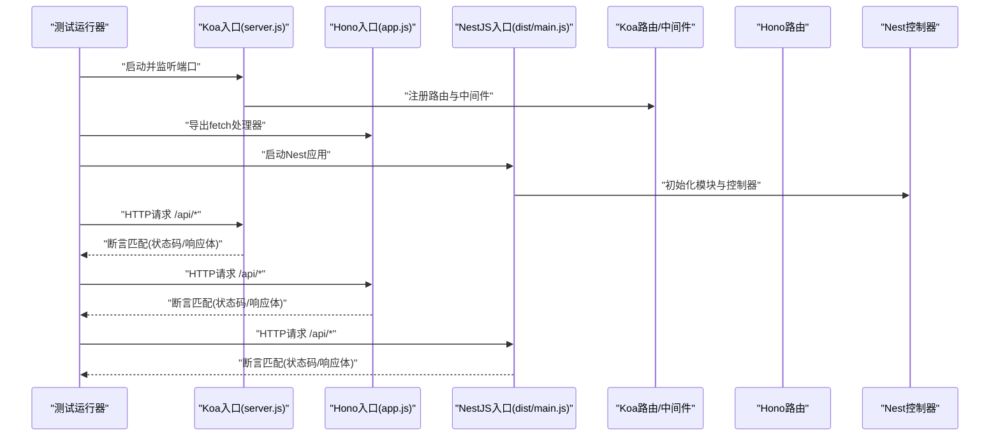
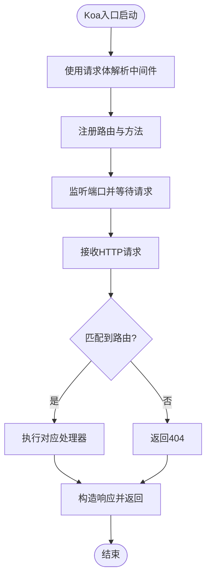
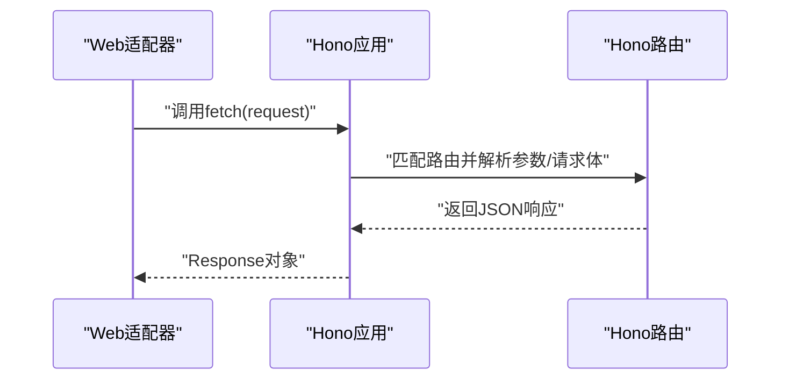
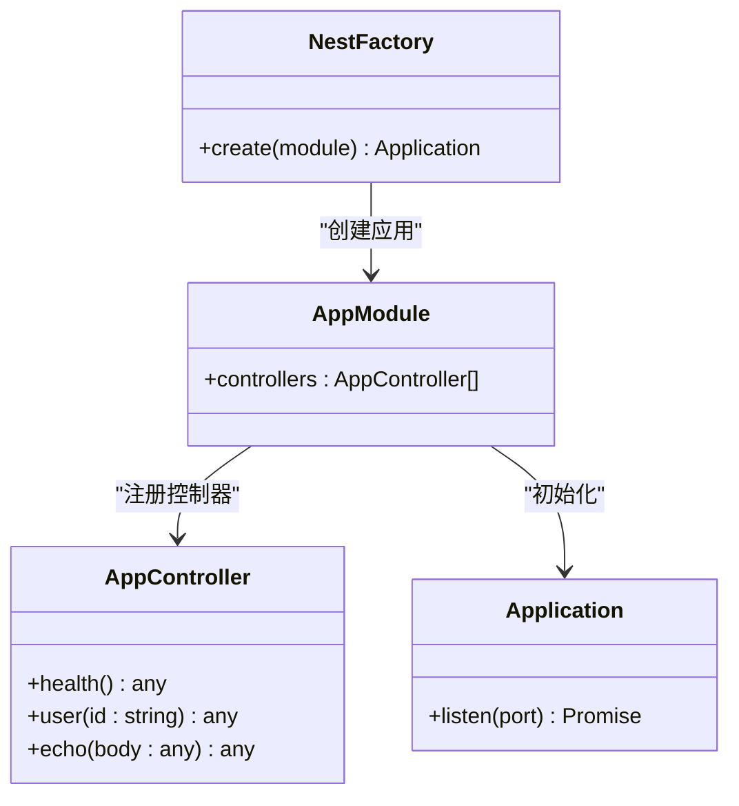
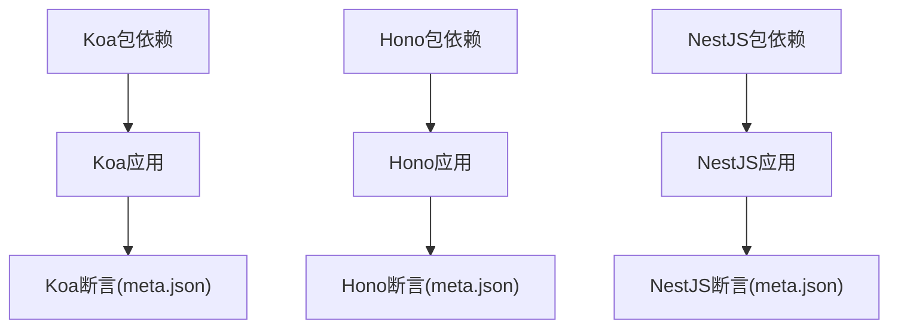

# Koa、Hono、NestJS框架测试

<cite>
**本文引用的文件**
- [Koa-app/app.js](file://Koa-app/app.js)
- [Hono-app/app.js](file://Hono-app/app.js)
- [NestJS-app/src/main.ts](file://NestJS-app/src/main.ts)
- [backend-tests/koa/meta.json](file://backend-tests/koa/meta.json)
- [backend-tests/hono/meta.json](file://backend-tests/hono/meta.json)
- [backend-tests/nestjs/meta.json](file://backend-tests/nestjs/meta.json)
- [backend-tests/koa/package.json](file://backend-tests/koa/package.json)
- [backend-tests/hono/package.json](file://backend-tests/hono/package.json)
- [backend-tests/nestjs/package.json](file://backend-tests/nestjs/package.json)
- [backend-tests/koa/server.js](file://backend-tests/koa/server.js)
- [backend-tests/hono/app.js](file://backend-tests/hono/app.js)
- [backend-tests/nestjs/dist/main.js](file://backend-tests/nestjs/dist/main.js)
- [backend-tests/nestjs/src/app.module.ts](file://backend-tests/nestjs/src/app.module.ts)
- [backend-tests/nestjs/src/app.controller.ts](file://backend-tests/nestjs/src/app.controller.ts)
- [backend-tests/README.md](file://backend-tests/README.md)
- [case.json](file://case.json)
</cite>

## 目录
1. [简介](#简介)
2. [项目结构](#项目结构)
3. [核心组件](#核心组件)
4. [架构总览](#架构总览)
5. [详细组件分析](#详细组件分析)
6. [依赖关系分析](#依赖关系分析)
7. [性能考量](#性能考量)
8. [故障排查指南](#故障排查指南)
9. [结论](#结论)
10. [附录](#附录)

## 简介
本文件面向Koa、Hono与NestJS三类现代后端框架，提供系统化的测试实现与对比分析。重点涵盖：
- 三种框架的项目结构差异与入口文件处理方式
- 构建流程与部署策略（基于仓库中的测试夹具与断言）
- 框架检测机制的实现细节（通过代码特征识别框架类型）
- 各框架优缺点、适用场景与迁移建议

## 项目结构
本仓库包含三类测试夹具与配套断言：
- Koa应用夹具：包含最小可运行示例与断言元数据
- Hono应用夹具：包含最小可运行示例与断言元数据
- NestJS应用夹具：包含TypeScript源码与编译产物，断言元数据指向dist产物

```mermaid
graph TB
subgraph "Koa夹具"
K1["backend-tests/koa/package.json"]
K2["backend-tests/koa/server.js"]
K3["backend-tests/koa/meta.json"]
end
subgraph "Hono夹具"
H1["backend-tests/hono/package.json"]
H2["backend-tests/hono/app.js"]
H3["backend-tests/hono/meta.json"]
end
subgraph "NestJS夹具"
N1["backend-tests/nestjs/package.json"]
N2["backend-tests/nestjs/src/app.module.ts"]
N3["backend-tests/nestjs/src/app.controller.ts"]
N4["backend-tests/nestjs/dist/main.js"]
N5["backend-tests/nestjs/meta.json"]
end
K1 --> K2 --> K3
H1 --> H2 --> H3
N1 --> N2 --> N3 --> N4 --> N5
```

图表来源
- [backend-tests/koa/package.json:1-11](file://backend-tests/koa/package.json#L1-L11)
- [backend-tests/koa/server.js:1-26](file://backend-tests/koa/server.js#L1-L26)
- [backend-tests/koa/meta.json:1-14](file://backend-tests/koa/meta.json#L1-L14)
- [backend-tests/hono/package.json:1-9](file://backend-tests/hono/package.json#L1-L9)
- [backend-tests/hono/app.js:1-15](file://backend-tests/hono/app.js#L1-L15)
- [backend-tests/hono/meta.json:1-14](file://backend-tests/hono/meta.json#L1-L14)
- [backend-tests/nestjs/package.json:1-21](file://backend-tests/nestjs/package.json#L1-L21)
- [backend-tests/nestjs/src/app.module.ts:1-8](file://backend-tests/nestjs/src/app.module.ts#L1-L8)
- [backend-tests/nestjs/src/app.controller.ts:1-20](file://backend-tests/nestjs/src/app.controller.ts#L1-L20)
- [backend-tests/nestjs/dist/main.js:1-11](file://backend-tests/nestjs/dist/main.js#L1-L11)
- [backend-tests/nestjs/meta.json:1-15](file://backend-tests/nestjs/meta.json#L1-L15)

章节来源
- [backend-tests/README.md:18-28](file://backend-tests/README.md#L18-L28)
- [backend-tests/README.md:38-84](file://backend-tests/README.md#L38-L84)

## 核心组件
- Koa应用夹具
  - 入口与运行：使用Koa实例并通过监听端口的方式启动服务
  - 路由与中间件：集成路由与请求体解析中间件
  - 断言：包含健康检查、参数路由、POST回显与404断言
- Hono应用夹具
  - 入口与运行：导出Hono实例，供Web适配器以fetch风格调用
  - 路由与请求处理：使用上下文返回JSON响应
  - 断言：与Koa一致的路径集合与状态码断言
- NestJS应用夹具
  - 入口与运行：TypeScript源码经编译生成dist/main.js，通过NestFactory创建应用并监听端口
  - 控制器与模块：声明式模块与控制器组织业务逻辑
  - 断言：与Koa/Hono一致的路径集合，包含不同响应码差异

章节来源
- [Koa-app/app.js:1-10](file://Koa-app/app.js#L1-L10)
- [backend-tests/koa/server.js:1-26](file://backend-tests/koa/server.js#L1-L26)
- [backend-tests/koa/meta.json:1-14](file://backend-tests/koa/meta.json#L1-L14)
- [Hono-app/app.js:1-8](file://Hono-app/app.js#L1-L8)
- [backend-tests/hono/app.js:1-15](file://backend-tests/hono/app.js#L1-L15)
- [backend-tests/hono/meta.json:1-14](file://backend-tests/hono/meta.json#L1-L14)
- [NestJS-app/src/main.ts:1-13](file://NestJS-app/src/main.ts#L1-L13)
- [backend-tests/nestjs/src/app.module.ts:1-8](file://backend-tests/nestjs/src/app.module.ts#L1-L8)
- [backend-tests/nestjs/src/app.controller.ts:1-20](file://backend-tests/nestjs/src/app.controller.ts#L1-L20)
- [backend-tests/nestjs/dist/main.js:1-11](file://backend-tests/nestjs/dist/main.js#L1-L11)
- [backend-tests/nestjs/meta.json:1-15](file://backend-tests/nestjs/meta.json#L1-L15)

## 架构总览
下图展示了三类夹具从“入口文件”到“HTTP响应”的关键流程，以及断言驱动的验证路径。

图表来源
- [backend-tests/koa/server.js:1-26](file://backend-tests/koa/server.js#L1-L26)
- [backend-tests/hono/app.js:1-15](file://backend-tests/hono/app.js#L1-L15)
- [backend-tests/nestjs/dist/main.js:1-11](file://backend-tests/nestjs/dist/main.js#L1-L11)
- [backend-tests/koa/meta.json:7-12](file://backend-tests/koa/meta.json#L7-L12)
- [backend-tests/hono/meta.json:7-12](file://backend-tests/hono/meta.json#L7-L12)
- [backend-tests/nestjs/meta.json:8-13](file://backend-tests/nestjs/meta.json#L8-L13)

## 详细组件分析

### Koa组件分析
- 项目结构与入口
  - 使用Koa实例并通过监听端口启动
  - 集成路由与请求体解析中间件
- 关键实现要点
  - 中间件顺序：请求体解析需在路由之前
  - 路由设计：统一在根路径下提供健康检查、参数路由与POST回显
- 断言与验证
  - 包含健康检查、参数路由、POST回显与404断言
  - 通过meta.json定义期望状态码与响应体子集

图表来源
- [backend-tests/koa/server.js:1-26](file://backend-tests/koa/server.js#L1-L26)
- [backend-tests/koa/meta.json:7-12](file://backend-tests/koa/meta.json#L7-L12)

章节来源
- [Koa-app/app.js:1-10](file://Koa-app/app.js#L1-L10)
- [backend-tests/koa/server.js:1-26](file://backend-tests/koa/server.js#L1-L26)
- [backend-tests/koa/meta.json:1-14](file://backend-tests/koa/meta.json#L1-L14)
- [backend-tests/koa/package.json:1-11](file://backend-tests/koa/package.json#L1-L11)

### Hono组件分析
- 项目结构与入口
  - 导出Hono实例，供Web适配器以fetch风格调用
  - 路由以上下文形式返回JSON响应
- 关键实现要点
  - 请求体读取：异步读取JSON并返回
  - 路由参数：通过上下文获取参数
- 断言与验证
  - 与Koa一致的路径集合与状态码断言

图表来源
- [Hono-app/app.js:1-8](file://Hono-app/app.js#L1-L8)
- [backend-tests/hono/app.js:1-15](file://backend-tests/hono/app.js#L1-L15)
- [backend-tests/hono/meta.json:7-12](file://backend-tests/hono/meta.json#L7-L12)

章节来源
- [Hono-app/app.js:1-8](file://Hono-app/app.js#L1-L8)
- [backend-tests/hono/app.js:1-15](file://backend-tests/hono/app.js#L1-L15)
- [backend-tests/hono/meta.json:1-14](file://backend-tests/hono/meta.json#L1-L14)
- [backend-tests/hono/package.json:1-9](file://backend-tests/hono/package.json#L1-L9)

### NestJS组件分析
- 项目结构与入口
  - TypeScript源码位于src，编译产物位于dist
  - 入口文件通过NestFactory创建应用并监听端口
- 关键实现要点
  - 模块化：通过装饰器声明模块与控制器
  - 控制器：统一在/api路径下提供健康检查、参数路由与POST回显
- 断言与验证
  - 与Koa/Hono一致的路径集合，包含不同响应码差异

图表来源
- [backend-tests/nestjs/src/app.module.ts:1-8](file://backend-tests/nestjs/src/app.module.ts#L1-L8)
- [backend-tests/nestjs/src/app.controller.ts:1-20](file://backend-tests/nestjs/src/app.controller.ts#L1-L20)
- [NestJS-app/src/main.ts:1-13](file://NestJS-app/src/main.ts#L1-L13)
- [backend-tests/nestjs/dist/main.js:1-11](file://backend-tests/nestjs/dist/main.js#L1-L11)

章节来源
- [NestJS-app/src/main.ts:1-13](file://NestJS-app/src/main.ts#L1-L13)
- [backend-tests/nestjs/src/app.module.ts:1-8](file://backend-tests/nestjs/src/app.module.ts#L1-L8)
- [backend-tests/nestjs/src/app.controller.ts:1-20](file://backend-tests/nestjs/src/app.controller.ts#L1-L20)
- [backend-tests/nestjs/dist/main.js:1-11](file://backend-tests/nestjs/dist/main.js#L1-L11)
- [backend-tests/nestjs/meta.json:1-15](file://backend-tests/nestjs/meta.json#L1-L15)
- [backend-tests/nestjs/package.json:1-21](file://backend-tests/nestjs/package.json#L1-L21)

## 依赖关系分析
- 依赖管理
  - Koa夹具：依赖Koa、@koa/router、koa-bodyparser
  - Hono夹具：依赖hono
  - NestJS夹具：依赖@nestjs/common、@nestjs/core、@nestjs/platform-express、reflect-metadata、rxjs，并包含TypeScript与构建脚本
- 运行与断言
  - 三类夹具均通过meta.json定义断言规则，包括路径、方法、期望状态码、响应体子集等
  - NestJS夹具额外包含warmup超时配置

图表来源
- [backend-tests/koa/package.json:1-11](file://backend-tests/koa/package.json#L1-L11)
- [backend-tests/hono/package.json:1-9](file://backend-tests/hono/package.json#L1-L9)
- [backend-tests/nestjs/package.json:1-21](file://backend-tests/nestjs/package.json#L1-L21)
- [backend-tests/koa/meta.json:1-14](file://backend-tests/koa/meta.json#L1-L14)
- [backend-tests/hono/meta.json:1-14](file://backend-tests/hono/meta.json#L1-L14)
- [backend-tests/nestjs/meta.json:1-15](file://backend-tests/nestjs/meta.json#L1-L15)

章节来源
- [backend-tests/README.md:38-84](file://backend-tests/README.md#L38-L84)

## 性能考量
- 启动时间与预热
  - NestJS夹具包含较长的warmup超时配置，适用于需要初始化容器与模块的企业级应用
- 路由与中间件
  - Koa通过中间件链路处理请求，合理安排中间件顺序可减少不必要的解析开销
  - Hono以fetch风格直接返回响应，适合边缘计算与Web适配器场景
- 构建与打包
  - NestJS需要编译TS到JS，建议在CI中缓存依赖与编译产物以提升速度

## 故障排查指南
- 断言失败
  - 状态码不符：检查路由是否正确映射与控制器/中间件是否生效
  - 响应体不匹配：确认响应体构造逻辑与meta.json中的bodyJsonSubset定义
- 启动失败
  - 端口占用：调整监听端口或释放占用端口
  - 依赖缺失：确保安装所有必需依赖
- 特定框架问题
  - Koa：确认中间件顺序与路由注册位置
  - Hono：确认导出的app实例被适配器正确调用
  - NestJS：确认dist/main.js可执行且模块初始化无异常

章节来源
- [backend-tests/README.md:86-93](file://backend-tests/README.md#L86-L93)
- [backend-tests/README.md:112-116](file://backend-tests/README.md#L112-L116)

## 结论
- Koa：轻量、灵活，适合快速搭建REST API与中间件生态丰富场景
- Hono：极简、原生fetch风格，适合边缘与云函数环境
- NestJS：企业级架构，模块化与装饰器带来强约束与高可维护性，但需要编译与初始化成本
- 三者均已在本仓库夹具中通过断言验证，可作为迁移与对比的基准

## 附录
- 框架检测机制
  - 顶层case.json展示了对多种后端框架的检测与打包行为，包括Express、Hono、Koa、NestJS等
  - 检测关注点：入口文件选择、是否包含框架依赖、是否包含特定目录结构（如/api）
- 运行与接入
  - 通过blackBox入口脚本运行夹具测试，支持单夹具运行与批量运行
  - 退出码约定：0表示全部断言通过，1表示至少一个断言失败或启动失败

章节来源
- [case.json:298-353](file://case.json#L298-L353)
- [case.json:317-334](file://case.json#L317-L334)
- [case.json:336-353](file://case.json#L336-L353)
- [case.json:468-484](file://case.json#L468-L484)
- [backend-tests/README.md:94-110](file://backend-tests/README.md#L94-L110)