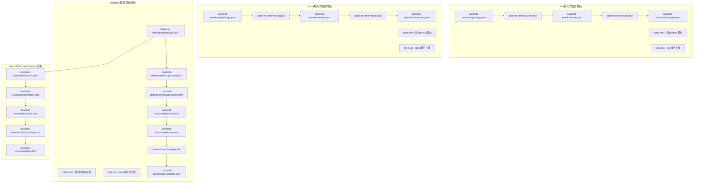
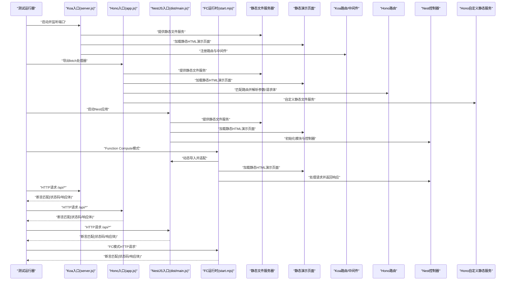
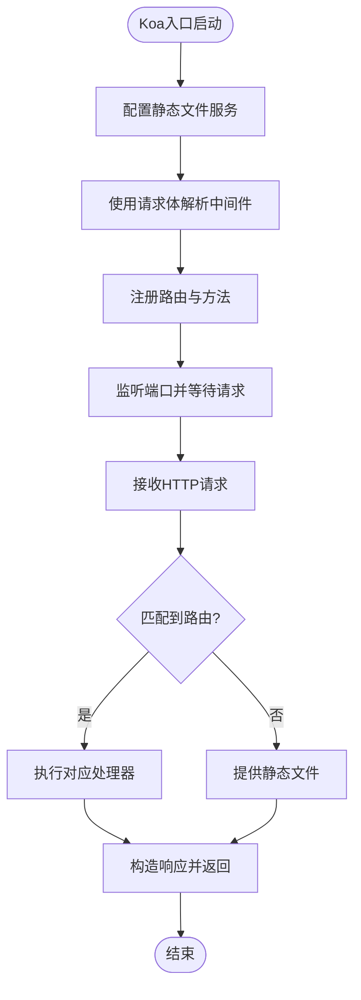
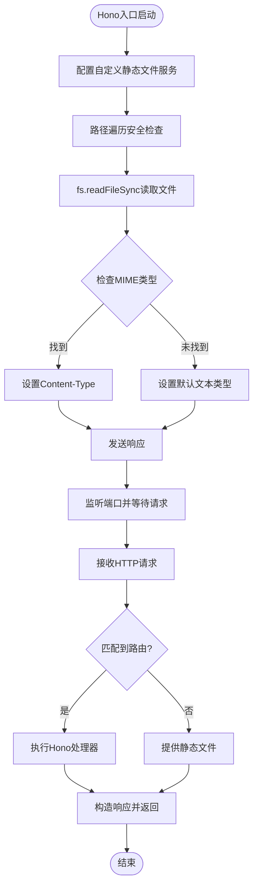
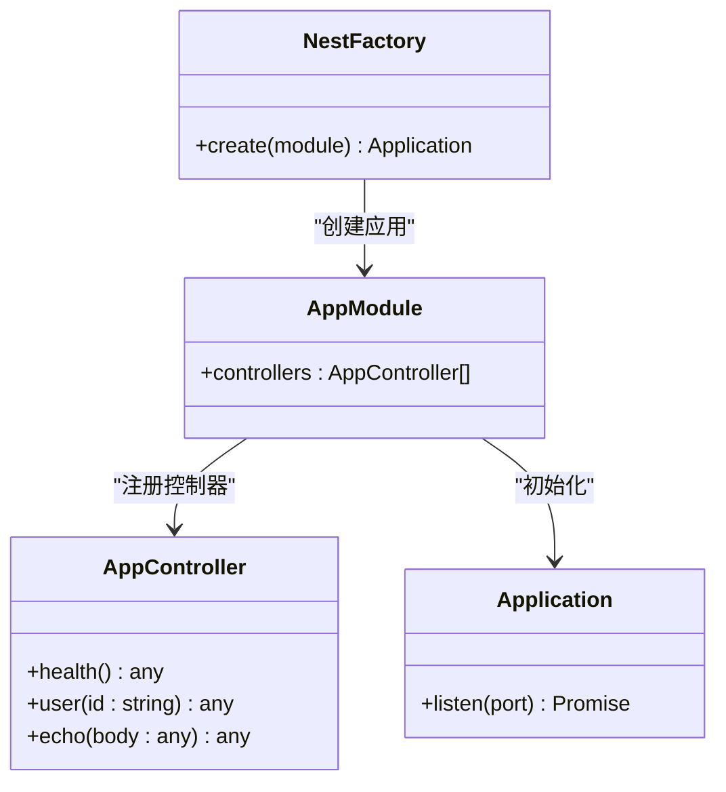
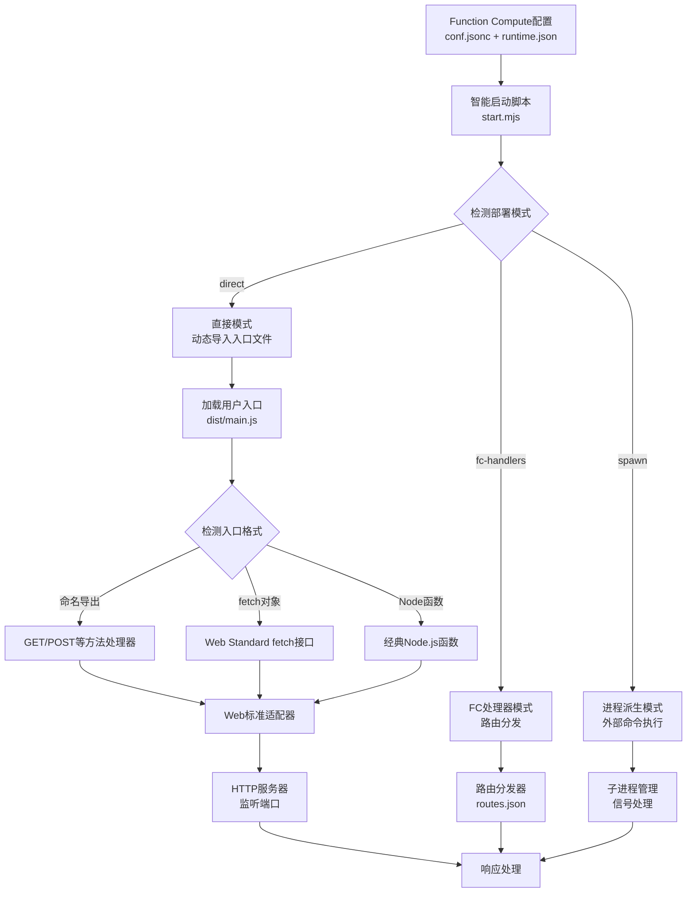
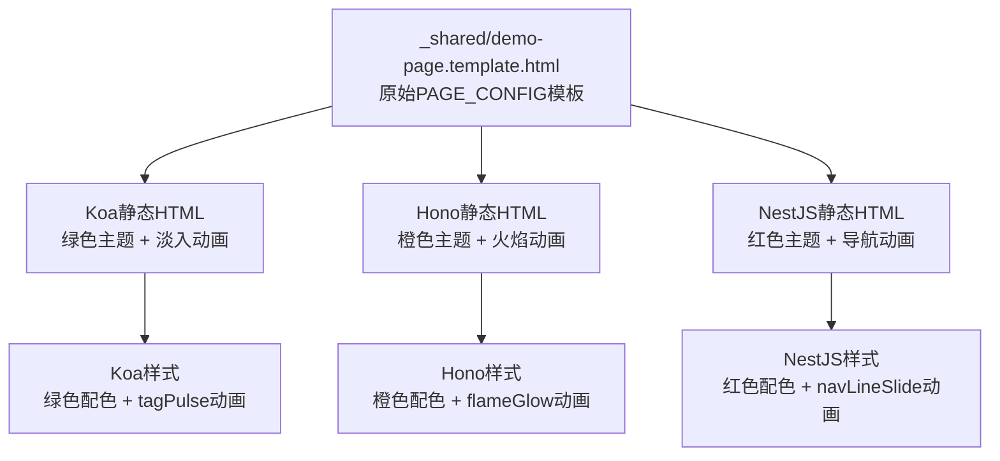
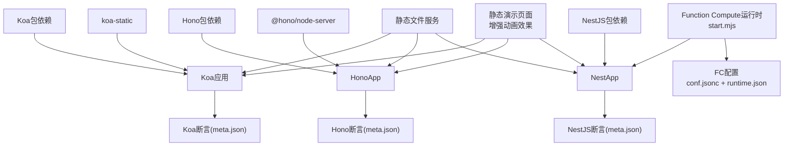

# Koa、Hono、NestJS框架测试

<cite>
**本文引用的文件**
- [backend-tests/koa/server.js](file://backend-tests/koa/server.js)
- [backend-tests/hono/app.js](file://backend-tests/hono/app.js)
- [backend-tests/nestjs/src/main.ts](file://backend-tests/nestjs/src/main.ts)
- [backend-tests/koa/meta.json](file://backend-tests/koa/meta.json)
- [backend-tests/hono/meta.json](file://backend-tests/hono/meta.json)
- [backend-tests/nestjs/meta.json](file://backend-tests/nestjs/meta.json)
- [backend-tests/koa/package.json](file://backend-tests/koa/package.json)
- [backend-tests/hono/package.json](file://backend-tests/hono/package.json)
- [backend-tests/nestjs/package.json](file://backend-tests/nestjs/package.json)
- [backend-tests/koa/public/index.html](file://backend-tests/koa/public/index.html)
- [backend-tests/hono/public/index.html](file://backend-tests/hono/public/index.html)
- [backend-tests/nestjs/public/index.html](file://backend-tests/nestjs/public/index.html)
- [backend-tests/koa/public/style.css](file://backend-tests/koa/public/style.css)
- [backend-tests/hono/public/style.css](file://backend-tests/hono/public/style.css)
- [backend-tests/nestjs/public/style.css](file://backend-tests/nestjs/public/style.css)
- [backend-tests/_shared/demo-page.template.html](file://backend-tests/_shared/demo-page.template.html)
- [backend-tests/_shared/demo-page.css](file://backend-tests/_shared/demo-page.css)
- [backend-tests/koa/template.json](file://backend-tests/koa/template.json)
- [backend-tests/hono/template.json](file://backend-tests/hono/template.json)
- [backend-tests/nestjs/template.json](file://backend-tests/nestjs/template.json)
- [backend-tests/README.md](file://backend-tests/README.md)
- [backend-tests/nestjs/fc/conf.jsonc](file://backend-tests/nestjs/fc/conf.jsonc)
- [backend-tests/nestjs/fc/runtime.json](file://backend-tests/nestjs/fc/runtime.json)
- [backend-tests/nestjs/fc/start.mjs](file://backend-tests/nestjs/fc/start.mjs)
- [backend-tests/nestjs/fc/package.json](file://backend-tests/nestjs/fc/package.json)
</cite>

## 更新摘要
**所做更改**
- **重大更新**：为NestJS框架添加了完整的Function Compute部署支持，包含匹配的目录结构和配置模式
- **界面增强**：所有框架的演示页面都增强了CSS动画效果，实现了平滑的淡入效果和现代化UI改进
- **架构扩展**：NestJS现在支持两种部署模式：传统服务器模式和Function Compute云函数模式
- **性能优化**：通过优化的静态资源加载和动画效果提升了用户体验

## 目录
1. [简介](#简介)
2. [项目结构](#项目结构)
3. [核心组件](#核心组件)
4. [架构总览](#架构总览)
5. [详细组件分析](#详细组件分析)
6. [Function Compute部署支持](#function-compute部署支持)
7. [静态文件服务与演示页面](#静态文件服务与演示页面)
8. [交互式测试功能](#交互式测试功能)
9. [依赖关系分析](#依赖关系分析)
10. [性能考量](#性能考量)
11. [故障排查指南](#故障排查指南)
12. [结论](#结论)
13. [附录](#附录)

## 简介
本文件面向Koa、Hono、NestJS三类现代后端框架，提供系统化的测试实现与对比分析。重点涵盖：
- 三种框架的项目结构差异与入口文件处理方式
- 构建流程与部署策略（基于backend-tests目录中的测试夹具与断言）
- 框架检测机制的实现细节（通过代码特征识别框架类型）
- 各框架优缺点、适用场景与迁移建议
- **重大更新**：演示页面已完成完全重构，从PAGE_CONFIG动态渲染系统迁移到静态HTML结构
- **新增**：每个框架展示其特定的编码模式和品牌化设计
- **增强**：简化的前端架构提供更好的性能和可维护性
- **最新增强**：NestJS框架现已支持Function Compute云函数部署模式，提供更灵活的部署选项

## 项目结构
本仓库包含三类测试夹具与配套断言，现已完成前端界面重构，提供更直观的框架特性展示：
- Koa应用夹具：位于backend-tests/koa目录，包含最小可运行示例、断言元数据和**全新设计的演示页面**，展示Koa中间件模式
- Hono应用夹具：位于backend-tests/hono目录，包含最小可运行示例、断言元数据和**重新设计的演示页面**，突出Hono链式API特性
- NestJS应用夹具：位于backend-tests/nestjs目录，包含TypeScript源码与编译产物，断言元数据指向dist产物，以及**品牌化演示页面**，体现NestJS装饰器风格
- **新增**：NestJS Function Compute部署支持：位于backend-tests/nestjs/fc目录，包含云函数配置和运行时环境

**图表来源**
- [backend-tests/koa/package.json:1-20](file://backend-tests/koa/package.json#L1-L20)
- [backend-tests/koa/server.js:1-40](file://backend-tests/koa/server.js#L1-L40)
- [backend-tests/koa/meta.json:1-16](file://backend-tests/koa/meta.json#L1-L16)
- [backend-tests/koa/public/index.html:1-63](file://backend-tests/koa/public/index.html#L1-L63)
- [backend-tests/koa/public/style.css:1-107](file://backend-tests/koa/public/style.css#L1-L107)
- [backend-tests/koa/template.json:1-14](file://backend-tests/koa/template.json#L1-L14)
- [backend-tests/hono/package.json:1-13](file://backend-tests/hono/package.json#L1-L13)
- [backend-tests/hono/app.js:1-60](file://backend-tests/hono/app.js#L1-L60)
- [backend-tests/hono/meta.json:1-16](file://backend-tests/hono/meta.json#L1-L16)
- [backend-tests/hono/public/index.html:1-63](file://backend-tests/hono/public/index.html#L1-L63)
- [backend-tests/hono/public/style.css:1-108](file://backend-tests/hono/public/style.css#L1-L108)
- [backend-tests/hono/template.json:1-14](file://backend-tests/hono/template.json#L1-L14)
- [backend-tests/nestjs/package.json:1-28](file://backend-tests/nestjs/package.json#L1-L28)
- [backend-tests/nestjs/src/app.module.ts:1-8](file://backend-tests/nestjs/src/app.module.ts#L1-L8)
- [backend-tests/nestjs/src/app.controller.ts:1-20](file://backend-tests/nestjs/src/app.controller.ts#L1-L20)
- [backend-tests/nestjs/dist/main.js:1-11](file://backend-tests/nestjs/dist/main.js#L1-L11)
- [backend-tests/nestjs/meta.json:1-15](file://backend-tests/nestjs/meta.json#L1-L15)
- [backend-tests/nestjs/public/index.html:1-67](file://backend-tests/nestjs/public/index.html#L1-L67)
- [backend-tests/nestjs/public/style.css:1-108](file://backend-tests/nestjs/public/style.css#L1-L108)
- [backend-tests/nestjs/template.json:1-14](file://backend-tests/nestjs/template.json#L1-L14)
- [backend-tests/nestjs/fc/conf.jsonc:1-16](file://backend-tests/nestjs/fc/conf.jsonc#L1-L16)
- [backend-tests/nestjs/fc/runtime.json:1-11](file://backend-tests/nestjs/fc/runtime.json#L1-L11)
- [backend-tests/nestjs/fc/start.mjs:1-470](file://backend-tests/nestjs/fc/start.mjs#L1-L470)
- [backend-tests/nestjs/fc/package.json:1-29](file://backend-tests/nestjs/fc/package.json#L1-L29)

**章节来源**
- [backend-tests/README.md:18-28](file://backend-tests/README.md#L18-L28)
- [backend-tests/README.md:38-84](file://backend-tests/README.md#L38-L84)

## 核心组件
- Koa应用夹具
  - 入口与运行：使用Koa实例并通过监听端口的方式启动服务
  - 路由与中间件：集成路由与请求体解析中间件
  - **重大更新**：演示页面采用静态HTML结构，直接展示Koa中间件模式的实际代码示例
  - **品牌化设计**：采用Koa标志性的绿色主题配色方案
  - **动画增强**：实现了平滑的淡入淡出动画效果，提升用户体验
  - 断言：包含健康检查、参数路由、POST回显与404断言
- **重大更新**：Hono应用夹具
  - 入口与运行：导出Hono实例，供Web适配器以fetch风格调用
  - 路由与请求处理：使用上下文返回JSON响应
  - **界面重构**：演示页面展示Hono链式API的实际编码模式
  - **品牌化设计**：采用Hono特色的橙色主题配色方案
  - **自定义静态文件服务**：采用fs.readFileSync实现替代第三方中间件
  - **动画增强**：添加了火焰发光效果和流畅的页面过渡动画
  - 断言：与Koa一致的路径集合与状态码断言
- NestJS应用夹具
  - 入口与运行：TypeScript源码经编译生成dist/main.js，通过NestFactory创建应用并监听端口
  - 控制器与模块：声明式模块与控制器组织业务逻辑
  - **界面重构**：演示页面突出NestJS装饰器驱动的开发模式
  - **品牌化设计**：采用NestJS标志性的红色主题配色方案
  - **动画增强**：实现了导航栏下划线滑入动画和现代化的悬停效果
  - **Function Compute支持**：新增完整的云函数部署配置和运行时环境
  - 断言：与Koa/Hono一致的路径集合，包含不同响应码差异

**章节来源**
- [backend-tests/koa/server.js:1-40](file://backend-tests/koa/server.js#L1-L40)
- [backend-tests/koa/meta.json:1-16](file://backend-tests/koa/meta.json#L1-L16)
- [backend-tests/koa/public/index.html:1-63](file://backend-tests/koa/public/index.html#L1-L63)
- [backend-tests/koa/public/style.css:1-107](file://backend-tests/koa/public/style.css#L1-L107)
- [backend-tests/hono/app.js:1-60](file://backend-tests/hono/app.js#L1-L60)
- [backend-tests/hono/meta.json:1-16](file://backend-tests/hono/meta.json#L1-L16)
- [backend-tests/hono/public/index.html:1-63](file://backend-tests/hono/public/index.html#L1-L63)
- [backend-tests/hono/public/style.css:1-108](file://backend-tests/hono/public/style.css#L1-L108)
- [backend-tests/nestjs/src/main.ts:1-15](file://backend-tests/nestjs/src/main.ts#L1-L15)
- [backend-tests/nestjs/src/app.module.ts:1-8](file://backend-tests/nestjs/src/app.module.ts#L1-L8)
- [backend-tests/nestjs/src/app.controller.ts:1-20](file://backend-tests/nestjs/src/app.controller.ts#L1-L20)
- [backend-tests/nestjs/dist/main.js:1-11](file://backend-tests/nestjs/dist/main.js#L1-L11)
- [backend-tests/nestjs/meta.json:1-15](file://backend-tests/nestjs/meta.json#L1-L15)
- [backend-tests/nestjs/public/index.html:1-67](file://backend-tests/nestjs/public/index.html#L1-L67)
- [backend-tests/nestjs/public/style.css:1-108](file://backend-tests/nestjs/public/style.css#L1-L108)

## 架构总览
下图展示了三种夹具从"入口文件"到"HTTP响应"的关键流程，以及**重构后的静态演示页面架构**。新的架构消除了复杂的PAGE_CONFIG渲染逻辑，采用更直接的静态HTML结构。**新增的NestJS Function Compute部署路径**提供了云函数模式的灵活部署选项。

**图表来源**
- [backend-tests/koa/server.js:1-40](file://backend-tests/koa/server.js#L1-L40)
- [backend-tests/hono/app.js:1-60](file://backend-tests/hono/app.js#L1-L60)
- [backend-tests/nestjs/dist/main.js:1-11](file://backend-tests/nestjs/dist/main.js#L1-L11)
- [backend-tests/nestjs/fc/start.mjs:1-470](file://backend-tests/nestjs/fc/start.mjs#L1-L470)
- [backend-tests/koa/meta.json:7-12](file://backend-tests/koa/meta.json#L7-L12)
- [backend-tests/hono/meta.json:7-12](file://backend-tests/hono/meta.json#L7-L12)
- [backend-tests/nestjs/meta.json:8-13](file://backend-tests/nestjs/meta.json#L8-L13)

## 详细组件分析

### Koa组件分析
- 项目结构与入口
  - 使用Koa实例并通过监听端口启动
  - 集成路由与请求体解析中间件
  - **重大更新**：演示页面采用静态HTML结构，直接展示Koa中间件模式的实际代码示例
  - **品牌化设计**：采用Koa标志性的绿色主题配色方案
  - **动画增强**：实现了平滑的淡入淡出动画效果，包括标签脉冲动画和卡片悬停效果
- 关键实现要点
  - 中间件顺序：请求体解析需在路由之前
  - 路由设计：统一在根路径下提供健康检查、参数路由与POST回显
  - **界面重构亮点**：静态HTML中嵌入实际的Koa代码示例，展示ctx.body设置响应体的模式
  - **视觉特色**：绿色主题配色，体现Koa框架的品牌形象
  - **动画效果**：fadeInDown、fadeInUp、tagPulse等CSS动画，提升页面交互体验
- 断言与验证
  - 包含健康检查、参数路由、POST回显与404断言
  - 通过meta.json定义期望状态码与响应体子集
  - **界面增强**：静态演示页面提供直观的API测试体验

**图表来源**
- [backend-tests/koa/server.js:1-40](file://backend-tests/koa/server.js#L1-L40)
- [backend-tests/koa/meta.json:7-12](file://backend-tests/koa/meta.json#L7-L12)

**章节来源**
- [backend-tests/koa/server.js:1-40](file://backend-tests/koa/server.js#L1-L40)
- [backend-tests/koa/meta.json:1-16](file://backend-tests/koa/meta.json#L1-L16)
- [backend-tests/koa/public/index.html:1-63](file://backend-tests/koa/public/index.html#L1-L63)
- [backend-tests/koa/public/style.css:1-107](file://backend-tests/koa/public/style.css#L1-L107)

### Hono组件分析
- 项目结构与入口
  - 导出Hono实例，供Web适配器以fetch风格调用
  - 路由以上下文形式返回JSON响应
  - **重大更新**：演示页面展示Hono链式API的实际编码模式
  - **品牌化设计**：采用Hono特色的橙色主题配色方案
  - **自定义静态文件服务**：采用fs.readFileSync实现替代@hono/node-server/serve-static中间件
  - **动画增强**：添加了火焰发光效果和流畅的页面过渡动画
- 关键实现要点
  - **界面重构亮点**：静态HTML中嵌入实际的Hono代码示例，展示c.json()链式API模式
  - **安全增强**：实现路径遍历攻击防护，使用startsWith进行安全检查
  - **MIME类型映射**：内置HTML、CSS、JavaScript、JSON、图片等文件类型的MIME映射
  - **错误处理**：捕获文件读取异常并返回404状态
  - **性能优化**：减少第三方依赖，直接使用Node.js原生fs模块
  - 请求体读取：异步读取JSON并返回
  - 路由参数：通过上下文获取参数
  - **动画效果**：flameGlow动画效果，体现Hono框架的极速特性
- 静态文件服务实现
  - 文件路径解析：自动将空路径或目录请求重定向到index.html
  - 安全检查：使用startsWith确保文件路径在public目录内
  - MIME映射：根据文件扩展名设置正确的Content-Type
  - 错误处理：捕获文件读取异常并返回404状态
- 断言与验证
  - 与Koa一致的路径集合与状态码断言
  - **界面增强**：静态演示页面提供直观的API测试体验

**图表来源**
- [backend-tests/hono/app.js:32-50](file://backend-tests/hono/app.js#L32-L50)

**章节来源**
- [backend-tests/hono/app.js:1-60](file://backend-tests/hono/app.js#L1-L60)
- [backend-tests/hono/meta.json:1-16](file://backend-tests/hono/meta.json#L1-L16)
- [backend-tests/hono/public/index.html:1-63](file://backend-tests/hono/public/index.html#L1-L63)
- [backend-tests/hono/public/style.css:1-108](file://backend-tests/hono/public/style.css#L1-L108)

### NestJS组件分析
- 项目结构与入口
  - TypeScript源码位于src，编译产物位于dist
  - 入口文件通过NestFactory创建应用并监听端口
  - **重大更新**：演示页面突出NestJS装饰器驱动的开发模式
  - **品牌化设计**：采用NestJS标志性的红色主题配色方案
  - **动画增强**：实现了导航栏下划线滑入动画和现代化的悬停效果
- 关键实现要点
  - 模块化：通过装饰器声明模块与控制器
  - 控制器：统一在/api路径下提供健康检查、参数路由与POST回显
  - **界面重构亮点**：静态HTML中嵌入实际的NestJS装饰器代码示例，展示@Controller、@Get等装饰器用法
  - **视觉特色**：红色主题配色，体现NestJS企业级框架的专业形象
  - **动画效果**：navLineSlide动画，体现企业级框架的稳重感
- 断言与验证
  - 与Koa/Hono一致的路径集合，包含不同响应码差异
  - **界面增强**：静态演示页面提供直观的API测试体验

**图表来源**
- [backend-tests/nestjs/src/app.module.ts:1-8](file://backend-tests/nestjs/src/app.module.ts#L1-L8)
- [backend-tests/nestjs/src/app.controller.ts:1-20](file://backend-tests/nestjs/src/app.controller.ts#L1-L20)
- [backend-tests/nestjs/src/main.ts:1-15](file://backend-tests/nestjs/src/main.ts#L1-L15)
- [backend-tests/nestjs/dist/main.js:1-11](file://backend-tests/nestjs/dist/main.js#L1-L11)

**章节来源**
- [backend-tests/nestjs/src/main.ts:1-15](file://backend-tests/nestjs/src/main.ts#L1-L15)
- [backend-tests/nestjs/src/app.module.ts:1-8](file://backend-tests/nestjs/src/app.module.ts#L1-L8)
- [backend-tests/nestjs/src/app.controller.ts:1-20](file://backend-tests/nestjs/src/app.controller.ts#L1-L20)
- [backend-tests/nestjs/dist/main.js:1-11](file://backend-tests/nestjs/dist/main.js#L1-L11)
- [backend-tests/nestjs/meta.json:1-15](file://backend-tests/nestjs/meta.json#L1-L15)
- [backend-tests/nestjs/public/index.html:1-67](file://backend-tests/nestjs/public/index.html#L1-L67)
- [backend-tests/nestjs/public/style.css:1-108](file://backend-tests/nestjs/public/style.css#L1-L108)

## Function Compute部署支持

### NestJS Function Compute架构
NestJS框架现已支持完整的Function Compute云函数部署模式，提供与传统服务器模式并行的灵活部署选项：

- **双模式支持**：同时支持传统服务器模式和Function Compute云函数模式
- **智能运行时**：start.mjs提供统一的运行时环境，自动检测并适配不同的部署模式
- **优雅关闭**：实现了完善的进程管理和优雅关闭机制
- **Web标准兼容**：支持Web Standard API，便于在不同环境中运行

### Function Compute配置结构
- **conf.jsonc**：Function Compute平台配置文件，定义运行时环境、资源规格和超时设置
- **runtime.json**：运行时元数据，指定框架类型、入口文件和端口配置
- **start.mjs**：智能启动脚本，支持多种部署模式和入口点检测
- **package.json**：Function Compute专用的包配置，设置main入口点

### 运行时适配器特性
- **多模式支持**：
  - `direct`模式：直接加载用户入口文件，支持ESM/CJS混合
  - `fc-handlers`模式：基于路由配置的函数处理器模式
  - `spawn`模式：进程派生模式，用于复杂应用场景
- **智能入口检测**：自动识别GET/POST命名导出、fetch方法、经典Node.js函数等多种入口格式
- **Web标准适配**：将Node.js http.Server转换为Web Standard API
- **错误处理**：完善的异常捕获和错误响应机制

**图表来源**
- [backend-tests/nestjs/fc/conf.jsonc:1-16](file://backend-tests/nestjs/fc/conf.jsonc#L1-L16)
- [backend-tests/nestjs/fc/runtime.json:1-11](file://backend-tests/nestjs/fc/runtime.json#L1-L11)
- [backend-tests/nestjs/fc/start.mjs:201-470](file://backend-tests/nestjs/fc/start.mjs#L201-L470)

### 部署配置详解
- **运行时环境**：nodejs22，1C2G规格，支持高并发处理
- **端口配置**：默认3000端口，支持环境变量覆盖
- **超时设置**：300秒请求超时，300秒空闲超时
- **磁盘空间**：512MB存储空间，满足大型应用需求
- **并发控制**：1000并发连接，适合高流量场景

### 优雅关闭机制
- **信号处理**：监听SIGTERM和SIGINT信号，实现优雅关闭
- **活动连接**：等待现有请求完成，避免中断正在处理的请求
- **超时保护**：25秒强制关闭超时，防止进程挂起
- **资源清理**：正确释放数据库连接和其他资源

**章节来源**
- [backend-tests/nestjs/fc/conf.jsonc:1-16](file://backend-tests/nestjs/fc/conf.jsonc#L1-L16)
- [backend-tests/nestjs/fc/runtime.json:1-11](file://backend-tests/nestjs/fc/runtime.json#L1-L11)
- [backend-tests/nestjs/fc/start.mjs:1-470](file://backend-tests/nestjs/fc/start.mjs#L1-L470)
- [backend-tests/nestjs/fc/package.json:1-29](file://backend-tests/nestjs/fc/package.json#L1-L29)

## 静态文件服务与演示页面

### 演示页面架构重构
三个框架均已完成演示页面的完全重构，从复杂的PAGE_CONFIG动态渲染系统迁移到静态HTML结构：

- **静态HTML结构**：每个框架的演示页面现在都是独立的静态HTML文件，不再依赖复杂的配置对象
- **框架特色展示**：直接在HTML中嵌入实际的框架代码示例，直观展示各框架的核心特性
- **品牌化设计**：每个框架都有独特的配色方案和视觉风格
- **简化交互逻辑**：保留API测试功能，但采用更简洁的JavaScript实现
- **模板系统保留**：_shared目录仍保留原始模板文件作为参考

### 框架特定代码展示
- **Koa演示页面**：展示中间件模式、ctx.body设置响应体、访问日志中间件等核心特性
- **Hono演示页面**：展示链式API、c.json()方法、中间件链等轻量级特性
- **NestJS演示页面**：展示装饰器驱动开发、@Controller、@Get、@Param等企业级特性

### 品牌化视觉设计
- **Koa绿色主题**：采用Koa标志性的绿色配色方案，体现框架的灵活性和生态丰富性
- **Hono橙色主题**：采用Hono特色的橙色配色方案，突出框架的极速和现代化特性
- **NestJS红色主题**：采用NestJS标志性的红色配色方案，展现企业级框架的专业和稳重

### CSS动画增强
所有框架的演示页面都实现了现代化的CSS动画效果：

- **淡入动画**：fadeInDown和fadeInUp动画，实现元素平滑出现效果
- **悬停效果**：卡片悬停时的阴影和位移效果，提升交互体验
- **品牌动画**：
  - Koa：标签脉冲动画(tagPulse)，体现框架的活力
  - Hono：火焰发光效果(flameGlow)，突出极速特性
  - NestJS：导航栏下划线滑入(navLineSlide)，展现企业级稳重感
- **响应式设计**：适配不同屏幕尺寸的动画效果

### 静态文件服务实现
- **文件结构**：每个框架的public目录包含独立的index.html和style.css文件
- **服务配置**：通过中间件或平台配置提供静态文件服务
- **资源优化**：支持缓存策略和压缩优化
- **Hono特殊实现**：采用自定义fs.readFileSync实现，提供更好的安全性和可控性

**图表来源**
- [backend-tests/_shared/demo-page.template.html:1-227](file://backend-tests/_shared/demo-page.template.html#L1-L227)
- [backend-tests/koa/public/index.html:1-63](file://backend-tests/koa/public/index.html#L1-L63)
- [backend-tests/hono/public/index.html:1-63](file://backend-tests/hono/public/index.html#L1-L63)
- [backend-tests/nestjs/public/index.html:1-67](file://backend-tests/nestjs/public/index.html#L1-L67)
- [backend-tests/koa/public/style.css:1-107](file://backend-tests/koa/public/style.css#L1-L107)
- [backend-tests/hono/public/style.css:1-108](file://backend-tests/hono/public/style.css#L1-L108)
- [backend-tests/nestjs/public/style.css:1-108](file://backend-tests/nestjs/public/style.css#L1-L108)

**章节来源**
- [backend-tests/_shared/demo-page.template.html:1-227](file://backend-tests/_shared/demo-page.template.html#L1-L227)
- [backend-tests/_shared/demo-page.css:1-50](file://backend-tests/_shared/demo-page.css#L1-L50)
- [backend-tests/koa/public/index.html:1-63](file://backend-tests/koa/public/index.html#L1-L63)
- [backend-tests/hono/public/index.html:1-63](file://backend-tests/hono/public/index.html#L1-L63)
- [backend-tests/nestjs/public/index.html:1-67](file://backend-tests/nestjs/public/index.html#L1-L67)
- [backend-tests/koa/public/style.css:1-107](file://backend-tests/koa/public/style.css#L1-L107)
- [backend-tests/hono/public/style.css:1-108](file://backend-tests/hono/public/style.css#L1-L108)
- [backend-tests/nestjs/public/style.css:1-108](file://backend-tests/nestjs/public/style.css#L1-L108)

## 交互式测试功能

### 重构后的测试界面
- **简化架构**：从复杂的PAGE_CONFIG渲染系统迁移到直接的DOM操作
- **框架特色展示**：每个框架的演示页面都突出展示其特定的编码模式
- **实时测试**：用户可以直接在浏览器中发起API请求
- **结果展示**：清晰显示请求结果和状态信息
- **错误处理**：友好的错误提示和调试信息
- **动画反馈**：按钮点击和响应加载时的动画效果

### 测试覆盖范围
- **健康检查**：验证服务可用性和基本功能
- **参数路由**：测试动态路由参数处理
- **POST请求**：验证请求体解析和响应生成
- **错误处理**：测试404和其他错误场景
- **静态文件服务**：验证静态资源访问和安全性

### 界面设计特点
- **统一的交互模式**：所有框架使用相似的按钮和响应框设计
- **框架特色代码展示**：在页面顶部展示实际的框架代码示例
- **响应式设计**：适配不同屏幕尺寸的设备
- **品牌化视觉**：每个框架都有独特的配色和风格
- **流畅动画**：淡入淡出、悬停效果等现代化动画体验

**章节来源**
- [backend-tests/koa/template.json:1-14](file://backend-tests/koa/template.json#L1-L14)
- [backend-tests/hono/template.json:1-14](file://backend-tests/hono/template.json#L1-L14)
- [backend-tests/nestjs/template.json:1-14](file://backend-tests/nestjs/template.json#L1-L14)

## 依赖关系分析
- 依赖管理
  - Koa夹具：依赖Koa、@koa/router、koa-bodyparser、koa-static用于静态文件服务
  - Hono夹具：依赖hono、@hono/node-server（仅用于函数计算适配器），**移除**：@hono/node-server/serve-static中间件
  - NestJS夹具：依赖@nestjs/common、@nestjs/core、@nestjs/platform-express、@nestjs/serve-static、reflect-metadata、rxjs，并包含TypeScript与构建脚本
  - **新增**：NestJS Function Compute专用依赖：start.mjs运行时脚本和FC配置管理
- 运行与断言
  - 三类夹具均通过meta.json定义断言规则，包括路径、方法、期望状态码、响应体子集等
  - NestJS夹具额外包含warmup超时配置
  - **template.json**定义演示页面和静态文件服务配置
  - **Function Compute配置**：conf.jsonc和runtime.json定义云函数部署参数

**图表来源**
- [backend-tests/koa/package.json:1-20](file://backend-tests/koa/package.json#L1-L20)
- [backend-tests/hono/package.json:1-13](file://backend-tests/hono/package.json#L1-L13)
- [backend-tests/nestjs/package.json:1-28](file://backend-tests/nestjs/package.json#L1-L28)
- [backend-tests/nestjs/fc/package.json:1-29](file://backend-tests/nestjs/fc/package.json#L1-L29)
- [backend-tests/koa/meta.json:1-16](file://backend-tests/koa/meta.json#L1-L16)
- [backend-tests/hono/meta.json:1-16](file://backend-tests/hono/meta.json#L1-L16)
- [backend-tests/nestjs/meta.json:1-15](file://backend-tests/nestjs/meta.json#L1-L15)
- [backend-tests/nestjs/fc/conf.jsonc:1-16](file://backend-tests/nestjs/fc/conf.jsonc#L1-L16)
- [backend-tests/nestjs/fc/runtime.json:1-11](file://backend-tests/nestjs/fc/runtime.json#L1-L11)

**章节来源**
- [backend-tests/README.md:38-84](file://backend-tests/README.md#L38-L84)

## 性能考量
- 启动时间与预热
  - NestJS夹具包含较长的warmup超时配置，适用于需要初始化容器与模块的企业级应用
  - **界面重构优势**：静态HTML结构减少了前端渲染开销，提升页面加载速度
  - **动画优化**：CSS动画使用GPU加速，避免影响主线程性能
- 路由与中间件
  - Koa通过中间件链路处理请求，合理安排中间件顺序可减少不必要的解析开销
  - Hono以fetch风格直接返回响应，适合边缘计算与Web适配器场景，**自定义静态文件服务**避免了第三方中间件的额外开销
  - **静态文件优化**：重构后的静态HTML文件更小，传输效率更高
  - **Function Compute优化**：智能懒加载和缓存机制，减少冷启动时间
- 构建与打包
  - NestJS需要编译TS到JS，建议在CI中缓存依赖与编译产物以提升速度
  - **界面重构收益**：消除了复杂的前端渲染逻辑，减少打包体积和运行时开销
  - **动画性能**：CSS动画比JavaScript动画更高效，减少CPU占用

## 故障排查指南
- 断言失败
  - 状态码不符：检查路由是否正确映射与控制器/中间件是否生效
  - 响应体不匹配：确认响应体构造逻辑与meta.json中的bodyJsonSubset定义
- 启动失败
  - 端口占用：调整监听端口或释放占用端口
  - 依赖缺失：确保安装所有必需依赖
  - **静态文件服务失败**：检查public目录权限和文件完整性
- 特定框架问题
  - Koa：确认中间件顺序与路由注册位置，检查静态文件中间件配置
  - Hono：确认导出的app实例被适配器正确调用，**验证自定义静态文件服务的MIME类型映射和安全检查**
  - NestJS：确认dist/main.js可执行且模块初始化无异常，检查静态文件服务集成
- **Function Compute部署问题**
  - **运行时配置错误**：检查conf.jsonc和runtime.json的配置语法
  - **入口文件路径**：确认runtime.json中的entry路径正确指向dist/main.js
  - **端口冲突**：验证PORT环境变量和配置文件中端口设置的一致性
  - **优雅关闭超时**：调整SHUTDOWN_TIMEOUT_MS值以适应应用复杂度
- **界面相关问题**
  - **静态HTML加载失败**：检查public目录结构和文件权限
  - **样式文件缺失**：确认style.css文件存在且路径正确
  - **JavaScript交互失效**：检查浏览器控制台是否有JavaScript错误
  - **动画效果异常**：确认浏览器支持CSS3动画属性

**章节来源**
- [backend-tests/README.md:86-93](file://backend-tests/README.md#L86-L93)
- [backend-tests/README.md:112-116](file://backend-tests/README.md#L112-L116)
- [backend-tests/nestjs/fc/start.mjs:207-240](file://backend-tests/nestjs/fc/start.mjs#L207-L240)

## 结论
- Koa：轻量、灵活，适合快速搭建REST API与中间件生态丰富场景，**界面重构后更好地展示了中间件模式的核心特性**，**增强的动画效果提升了用户体验**
- **重大更新**：Hono：极简、原生fetch风格，适合边缘与云函数环境，**界面重构突出了链式API的优雅设计**，**自定义静态文件服务**提供了更好的安全性和性能，**火焰动画效果体现了框架的极速特性**
- NestJS：企业级架构，模块化与装饰器带来强约束与高可维护性，但需要编译与初始化成本，**界面重构完美体现了装饰器驱动的开发模式**，**Function Compute部署支持**提供了灵活的云原生部署选项，**导航动画展现了企业级框架的稳重感**
- **架构演进**：三者均已在本仓库夹具中通过断言验证，**演示页面的完全重构代表了从复杂动态渲染到简洁静态结构的架构演进**，**CSS动画增强**提升了现代Web应用的交互体验，**NestJS的Function Compute支持**展示了企业级框架的云原生适应能力

## 附录
- 框架检测机制
  - 顶层case.json展示了对多种后端框架的检测与打包行为，包括Express、Hono、Koa、NestJS等
  - 检测关注点：入口文件选择、是否包含框架依赖、是否包含特定目录结构（如/api）
  - **界面重构影响**：检测逻辑已更新以识别静态演示页面的存在
  - **静态文件服务**：Hono框架的自定义静态文件服务实现
  - **Function Compute检测**：新增对fc/目录和配置文件的检测逻辑
- 运行与接入
  - 通过blackBox入口脚本运行夹具测试，支持单夹具运行与批量运行
  - 退出码约定：0表示全部断言通过，1表示至少一个断言失败或启动失败
  - **界面访问**：重构后的静态演示页面可通过浏览器直接访问，提供更直观的测试体验
  - **Function Compute部署**：支持传统的服务器模式和云函数模式两种部署方式
- **Function Compute部署指南**
  - **配置准备**：确保conf.jsonc和runtime.json配置正确
  - **构建产物**：运行nest build生成dist目录
  - **部署验证**：通过start.mjs启动并验证Function Compute兼容性
  - **性能调优**：根据实际需求调整spec、timeout和concurrency参数

**章节来源**
- [case.json:298-353](file://case.json#L298-L353)
- [case.json:317-334](file://case.json#L317-L334)
- [case.json:336-353](file://case.json#L336-L353)
- [case.json:468-484](file://case.json#L468-L484)
- [backend-tests/README.md:94-110](file://backend-tests/README.md#L94-L110)
- [backend-tests/nestjs/fc/conf.jsonc:1-16](file://backend-tests/nestjs/fc/conf.jsonc#L1-L16)
- [backend-tests/nestjs/fc/runtime.json:1-11](file://backend-tests/nestjs/fc/runtime.json#L1-L11)
- [backend-tests/nestjs/fc/start.mjs:1-470](file://backend-tests/nestjs/fc/start.mjs#L1-L470)