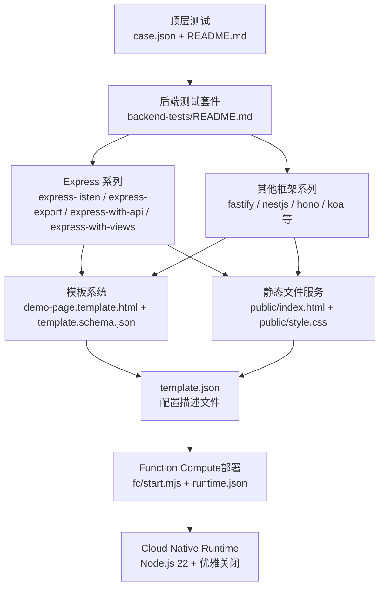
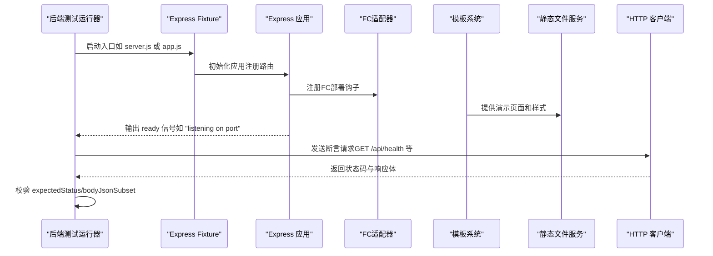
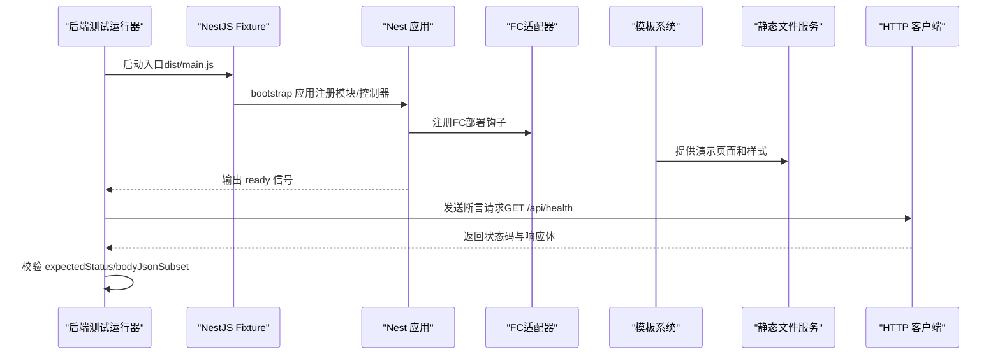
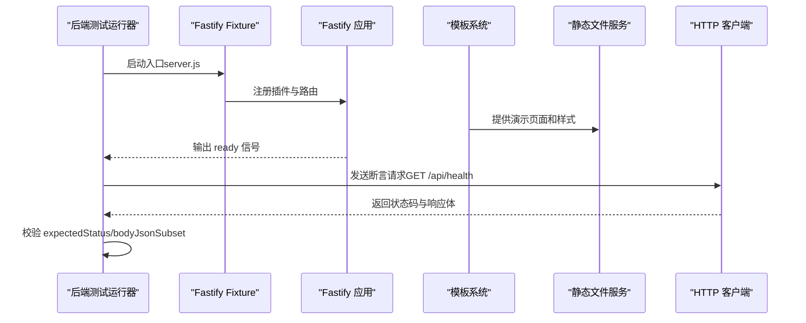
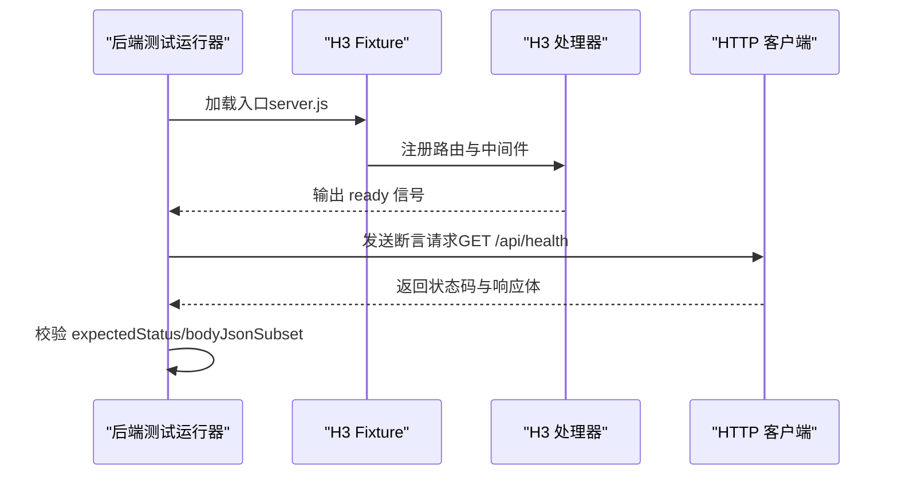
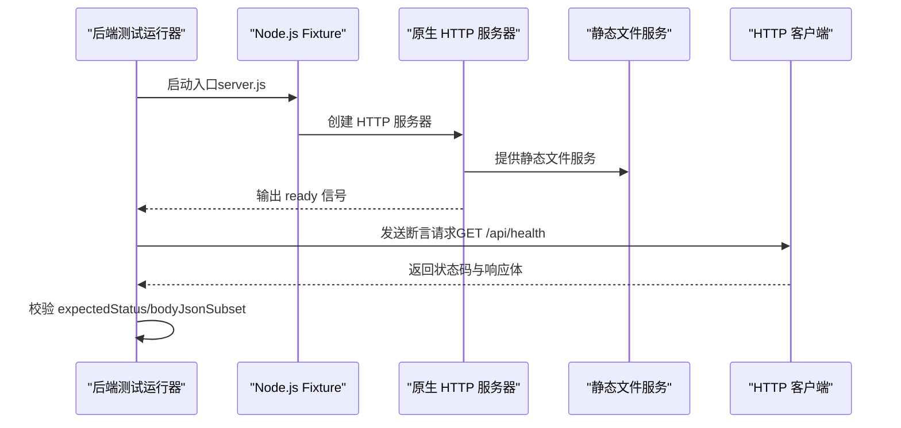
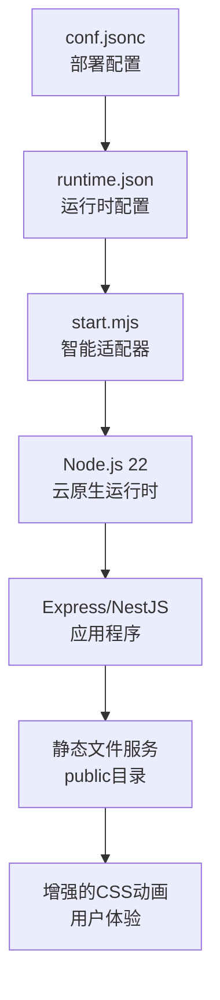
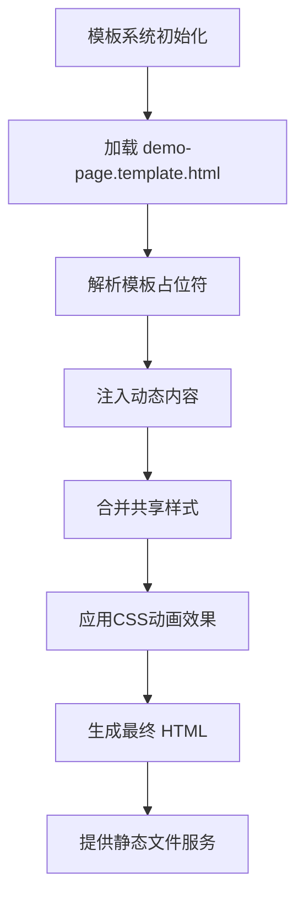
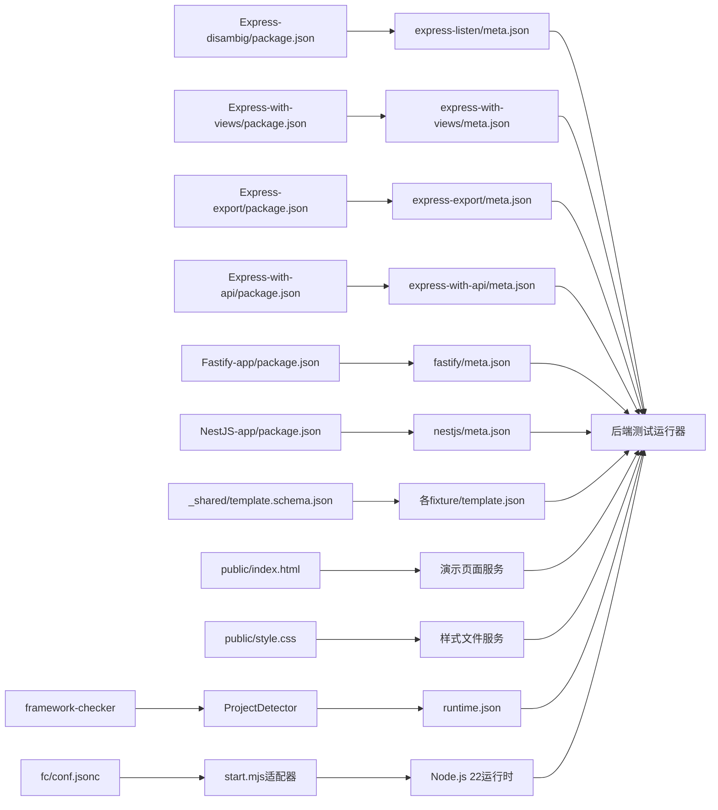

# 后端框架测试

<cite>
**本文引用的文件**
- [README.md](file://README.md)
- [case.json](file://case.json)
- [backend-tests/README.md](file://backend-tests/README.md)
- [backend-tests/_shared/demo-page.css](file://backend-tests/_shared/demo-page.css)
- [backend-tests/_shared/demo-page.template.html](file://backend-tests/_shared/demo-page.template.html)
- [backend-tests/_shared/template.schema.json](file://backend-tests/_shared/template.schema.json)
- [backend-tests/express-listen/meta.json](file://backend-tests/express-listen/meta.json)
- [backend-tests/express-export/meta.json](file://backend-tests/express-export/meta.json)
- [backend-tests/fastify/meta.json](file://backend-tests/fastify/meta.json)
- [backend-tests/nestjs/meta.json](file://backend-tests/nestjs/meta.json)
- [backend-tests/h3/meta.json](file://backend-tests/h3/meta.json)
- [backend-tests/elysia/meta.json](file://backend-tests/elysia/meta.json)
- [backend-tests/express-listen/template.json](file://backend-tests/express-listen/template.json)
- [backend-tests/express-export/template.json](file://backend-tests/express-export/template.json)
- [backend-tests/express-multifile/template.json](file://backend-tests/express-multifile/template.json)
- [backend-tests/express-typescript/template.json](file://backend-tests/express-typescript/template.json)
- [backend-tests/fastify/template.json](file://backend-tests/fastify/template.json)
- [backend-tests/fastify-plugins/template.json](file://backend-tests/fastify-plugins/template.json)
- [backend-tests/hono/template.json](file://backend-tests/hono/template.json)
- [backend-tests/koa/template.json](file://backend-tests/koa/template.json)
- [backend-tests/nestjs/template.json](file://backend-tests/nestjs/template.json)
- [backend-tests/nestjs-multimodule/template.json](file://backend-tests/nestjs-multimodule/template.json)
- [backend-tests/node/template.json](file://backend-tests/node/template.json)
- [backend-tests/express-listen/public/index.html](file://backend-tests/express-listen/public/index.html)
- [backend-tests/express-listen/public/style.css](file://backend-tests/express-listen/public/style.css)
- [backend-tests/express-export/public/index.html](file://backend-tests/express-export/public/index.html)
- [backend-tests/express-export/public/style.css](file://backend-tests/express-export/public/style.css)
- [backend-tests/fastify/public/index.html](file://backend-tests/fastify/public/index.html)
- [backend-tests/fastify/public/style.css](file://backend-tests/fastify/public/style.css)
- [backend-tests/nestjs/public/index.html](file://backend-tests/nestjs/public/index.html)
- [backend-tests/nestjs/public/style.css](file://backend-tests/nestjs/public/style.css)
- [backend-tests/node/server.js](file://backend-tests/node/server.js)
- [backend-tests/fastify/server.js](file://backend-tests/fastify/server.js)
- [backend-tests/fastify/README.md](file://backend-tests/fastify/README.md)
- [Express-disambig/package.json](file://Express-disambig/package.json)
- [Express-export/package.json](file://Express-export/package.json)
- [Express-listen/package.json](file://Express-listen/package.json)
- [Express-with-api/package.json](file://Express-with-api/package.json)
- [Express-with-views/package.json](file://Express-with-views/package.json)
- [Fastify-app/package.json](file://Fastify-app/package.json)
- [NestJS-app/package.json](file://NestJS-app/package.json)
- [backend-tests/express-listen/fc/start.mjs](file://backend-tests/express-listen/fc/start.mjs)
- [backend-tests/nestjs/fc/start.mjs](file://backend-tests/nestjs/fc/start.mjs)
- [backend-tests/express-listen/fc/conf.jsonc](file://backend-tests/express-listen/fc/conf.jsonc)
- [backend-tests/nestjs/fc/conf.jsonc](file://backend-tests/nestjs/fc/conf.jsonc)
- [backend-tests/express-listen/fc/runtime.json](file://backend-tests/express-listen/fc/runtime.json)
- [backend-tests/nestjs/fc/runtime.json](file://backend-tests/nestjs/fc/runtime.json)
</cite>

## 更新摘要
**所做更改**
- **新增**：Function Compute部署支持，为Express和NestJS框架添加了完整的FC部署配置
- **增强**：CSS动画系统全面升级，所有后端测试fixture都包含丰富的交互动画效果
- **改进**：运行时架构优化，采用start.mjs适配器实现更智能的进程管理和优雅关闭
- **更新**：Node.js 22兼容性支持和运行时环境配置
- **完善**：静态文件服务与模板系统的集成，提供更一致的前端展示体验

## 目录
1. [简介](#简介)
2. [项目结构](#项目结构)
3. [核心组件](#核心组件)
4. [架构总览](#架构总览)
5. [详细组件分析](#详细组件分析)
6. [Function Compute部署支持](#function-compute部署支持)
7. [模板系统与静态文件服务](#模板系统与静态文件服务)
8. [依赖分析](#依赖分析)
9. [性能考虑](#性能考虑)
10. [故障排查指南](#故障排查指南)
11. [结论](#结论)
12. [附录](#附录)

## 简介
本仓库围绕"后端框架测试"目标，提供了两类测试体系与验证闭环：
- 顶层测试套件：通过 case.json 驱动 TestStep 编排，覆盖安装、构建、打包、部署、配额等全流程，并以日志字符串匹配的方式验证结果。
- 后端测试套件（backend-tests）：独立于顶层套件，聚焦于 framework-checker 生成的"可执行生成物"（如 start.mjs）是否能在本机正确启动并响应 HTTP 请求，确保"框架级能跑"的承诺。

**重大更新**：后端测试套件已进行重大升级，新增Function Compute部署支持，Express和NestJS框架现在都具备完整的云原生部署能力。所有fixture都配备了增强的CSS动画系统，提供流畅的用户交互体验。**运行时架构现代化**：采用start.mjs适配器实现智能进程管理、优雅关闭和资源清理。

两类测试互补：前者验证端到端流程与平台行为，后者验证生成物的正确性与可运行性。

## 项目结构
仓库采用按功能/框架拆分的组织方式，核心目录如下：
- 顶层：README.md、case.json，定义测试用例与运行说明
- 各后端框架的最小可运行样例（Fixture）：Express-disambig、Express-export、Express-listen、Express-with-api、Express-with-views、Fastify-app、NestJS-app 等
- backend-tests：独立的后端测试套件，每个框架一个 fixture，配套 meta.json 断言定义、template.json 配置和完整的前端资源
- _shared：共享的模板系统和样式资源
- **新增**：fc目录：Function Compute部署配置文件，包含runtime.json、conf.jsonc和start.mjs适配器

**图表来源**
- [README.md:1-31](file://README.md#L1-L31)
- [backend-tests/README.md:1-176](file://backend-tests/README.md#L1-L176)
- [backend-tests/_shared/demo-page.template.html:1-50](file://backend-tests/_shared/demo-page.template.html#L1-L50)
- [backend-tests/_shared/template.schema.json:1-59](file://backend-tests/_shared/template.schema.json#L1-L59)
- [backend-tests/express-listen/fc/start.mjs:1-470](file://backend-tests/express-listen/fc/start.mjs#L1-470)

**章节来源**
- [README.md:1-31](file://README.md#L1-L31)
- [backend-tests/README.md:1-176](file://backend-tests/README.md#L1-L176)

## 核心组件
- 顶层测试编排（case.json）：定义测试用例、环境变量、期望状态与日志关键字，驱动 TestStep 流水线
- 后端测试套件（backend-tests）：对每个支持的后端框架提供独立 fixture，验证生成物在本机的可运行性与 HTTP 响应正确性
- **模板系统（_shared）**：提供统一的HTML模板和CSS样式，支持动态内容注入和样式复用
- **静态文件服务**：每个fixture的public目录提供完整的前端资源，包括演示页面和样式文件
- **配置管理**：template.json文件定义每个fixture的模板配置和元数据信息
- **框架自动检测**：现代化的框架识别机制，替代原有的NFT依赖跟踪系统
- **Function Compute适配器**：start.mjs智能运行时适配器，支持多种部署模式和优雅关闭
- 各框架最小样例（Fixture）：Express、Fastify、NestJS、H3、Elysia 等，每个样例包含 package.json 与最小可运行入口

**章节来源**
- [case.json:1-603](file://case.json#L1-L603)
- [backend-tests/README.md:1-176](file://backend-tests/README.md#L1-L176)
- [backend-tests/_shared/template.schema.json:1-59](file://backend-tests/_shared/template.schema.json#L1-L59)

## 架构总览
下图展示了两类测试的职责边界与交互关系，以及新增的Function Compute部署架构：

```mermaid
graph TB
subgraph "顶层测试TestStep 编排"
T1["case.json<br/>用例定义"]
T2["日志字符串匹配<br/>期望状态/文本"]
end
subgraph "后端测试套件生成物验证"
B1["backend-tests/README.md<br/>断言与运行说明"]
B2["各框架 fixture<br/>meta.json + 入口"]
B3["HTTP 断言<br/>状态码/响应体/子集匹配"]
end
subgraph "Function Compute部署层"
FC1["start.mjs<br/>智能适配器"]
FC2["runtime.json<br/>运行时配置"]
FC3["conf.jsonc<br/>部署配置"]
FC4["Node.js 22<br/>云原生运行时"]
end
subgraph "模板系统与静态服务"
S1["_shared/<br/>模板与样式资源"]
S2["public/<br/>演示页面与样式"]
S3["template.json<br/>配置描述"]
end
T1 --> T2
B1 --> B2 --> B3
FC1 --> FC2 --> FC3 --> FC4
S1 --> S2 --> S3
```

**图表来源**
- [case.json:1-603](file://case.json#L1-L603)
- [backend-tests/README.md:1-176](file://backend-tests/README.md#L1-L176)
- [backend-tests/_shared/demo-page.template.html:1-50](file://backend-tests/_shared/demo-page.template.html#L1-L50)
- [backend-tests/_shared/template.schema.json:1-59](file://backend-tests/_shared/template.schema.json#L1-L59)
- [backend-tests/express-listen/fc/start.mjs:1-470](file://backend-tests/express-listen/fc/start.mjs#L1-470)

## 详细组件分析

### Express 测试场景与实现
Express 提供多种典型使用模式，本仓库通过多个 fixture 覆盖：
- app.listen 风格：入口文件直接监听端口
- module.exports = app 风格：不主动监听，由外部运行时接管
- 与 /api 路由共存：当项目同时包含后端框架与纯函数计算（FC）处理器时，优先走后端框架
- 带视图模板：模板文件随打包下发，避免线上 404
- 入口消歧：当存在多个候选入口（如 server.js 与 app.js）时，能正确识别真正 require 框架的文件
- **Function Compute支持**：完整的FC部署配置，支持云原生部署和弹性伸缩
- **增强的CSS动画**：流畅的页面加载动画和交互反馈效果

**图表来源**
- [backend-tests/express-listen/meta.json:1-43](file://backend-tests/express-listen/meta.json#L1-L43)
- [backend-tests/express-export/meta.json:1-14](file://backend-tests/express-export/meta.json#L1-L14)
- [backend-tests/README.md:42-176](file://backend-tests/README.md#L42-L176)
- [backend-tests/express-listen/public/index.html:1-50](file://backend-tests/express-listen/public/index.html#L1-L50)
- [backend-tests/express-listen/fc/start.mjs:1-470](file://backend-tests/express-listen/fc/start.mjs#L1-470)

**章节来源**
- [backend-tests/express-listen/meta.json:1-43](file://backend-tests/express-listen/meta.json#L1-L43)
- [backend-tests/express-export/meta.json:1-14](file://backend-tests/express-export/meta.json#L1-L14)
- [backend-tests/README.md:1-176](file://backend-tests/README.md#L1-L176)

### NestJS 测试场景与实现
NestJS 采用 TypeScript 并编译到 dist/main.js，测试关注：
- bootstrap 启动流程
- 路由与控制器
- HTTP 断言：状态码、响应体 JSON 子集匹配
- **Function Compute支持**：完整的FC部署配置，支持TypeScript编译产物部署
- **增强的CSS动画**：专业的企业级动画效果和用户交互体验
- **ServeStatic集成**：内置静态文件托管，简化前端资源管理

**图表来源**
- [backend-tests/nestjs/meta.json:1-15](file://backend-tests/nestjs/meta.json#L1-L15)
- [backend-tests/README.md:42-176](file://backend-tests/README.md#L42-L176)
- [backend-tests/nestjs/public/index.html:1-50](file://backend-tests/nestjs/public/index.html#L1-L50)
- [backend-tests/nestjs/fc/start.mjs:1-470](file://backend-tests/nestjs/fc/start.mjs#L1-470)

**章节来源**
- [backend-tests/nestjs/meta.json:1-15](file://backend-tests/nestjs/meta.json#L1-L15)
- [backend-tests/README.md:1-176](file://backend-tests/README.md#L1-L176)

### Fastify 测试场景与实现
Fastify 以高性能与插件生态著称，测试关注：
- app.listen 风格的直接监听
- 插件注册与路由处理
- HTTP 断言：状态码、响应体 JSON 子集匹配
- **增强的CSS动画**：流畅的API测试界面和响应展示效果

**图表来源**
- [backend-tests/fastify/meta.json:1-17](file://backend-tests/fastify/meta.json#L1-L17)
- [backend-tests/README.md:42-176](file://backend-tests/README.md#L42-L176)
- [backend-tests/fastify/public/index.html:1-50](file://backend-tests/fastify/public/index.html#L1-L50)

**章节来源**
- [backend-tests/fastify/meta.json:1-17](file://backend-tests/fastify/meta.json#L1-L17)
- [backend-tests/README.md:1-176](file://backend-tests/README.md#L1-L176)

### H3 测试场景与实现
H3 是一个轻量级的 HTTP 框架，测试关注：
- 直接导出 fetch 处理器
- 与 Express 等框架共存时的优先级与路由隔离
- HTTP 断言：状态码、响应体 JSON 子集匹配

**图表来源**
- [backend-tests/h3/meta.json:1-14](file://backend-tests/h3/meta.json#L1-L14)
- [backend-tests/README.md:42-176](file://backend-tests/README.md#L42-L176)

**章节来源**
- [backend-tests/h3/meta.json:1-14](file://backend-tests/h3/meta.json#L1-L14)
- [backend-tests/README.md:1-176](file://backend-tests/README.md#L1-L176)

### Elysia 测试场景与实现
Elysia 是一个现代化的 Web 框架，测试关注：
- 直接导出 fetch 处理器
- 与 Express 等框架共存时的优先级与路由隔离
- HTTP 断言：状态码、响应体 JSON 子集匹配

**图表来源**
- [backend-tests/elysia/meta.json:1-14](file://backend-tests/elysia/meta.json#L1-L14)
- [backend-tests/README.md:42-176](file://backend-tests/README.md#L42-L176)

**章节来源**
- [backend-tests/elysia/meta.json:1-14](file://backend-tests/elysia/meta.json#L1-L14)
- [backend-tests/README.md:1-176](file://backend-tests/README.md#L1-L176)

### Node.js 原生服务器测试场景与实现
Node.js 原生 http.createServer 提供了最基础的后端能力，测试关注：
- 原生 HTTP 服务器实现
- 手动静态文件服务
- 健康检查端点
- 动态路由处理
- **Node.js 22兼容性支持**：最新的运行时特性和性能优化

**图表来源**
- [backend-tests/node/meta.json:1-16](file://backend-tests/node/meta.json#L1-L16)
- [backend-tests/README.md:42-176](file://backend-tests/README.md#L42-L176)
- [backend-tests/node/server.js:1-38](file://backend-tests/node/server.js#L1-L38)

**章节来源**
- [backend-tests/node/meta.json:1-16](file://backend-tests/node/meta.json#L1-L16)
- [backend-tests/README.md:1-176](file://backend-tests/README.md#L1-L176)
- [backend-tests/node/server.js:1-38](file://backend-tests/node/server.js#L1-L38)

### 组合与冲突处理
- 同时存在 Express 与 /api 目录：优先走后端框架，由框架自身处理 /api
- /api 路由冲突：当两个文件映射到同一路径时，构建失败并提示冲突文件
- 动态路径与可选通配：支持 [id]、[...slug]、[[...slug]] 等模式，静态路径优先匹配

**章节来源**
- [case.json:355-408](file://case.json#L355-L408)
- [case.json:374-391](file://case.json#L374-L391)
- [case.json:523-559](file://case.json#L523-L559)

## Function Compute部署支持

### Function Compute适配器架构
**新增**：Express和NestJS框架现在都支持Function Compute部署，通过start.mjs智能适配器实现：

- **start.mjs适配器**：智能运行时适配器，支持多种部署模式和优雅关闭
- **runtime.json配置**：运行时配置，包含框架类型、入口文件和端口设置
- **conf.jsonc部署配置**：Function Compute部署参数，包括运行时版本和资源规格
- **Node.js 22支持**：最新的Node.js运行时，提供更好的性能和特性支持

### 智能进程管理机制
start.mjs适配器实现了先进的进程管理功能：

- **优雅关闭**：SIGTERM/SIGINT信号处理，确保请求完成后再安全退出
- **异常捕获**：全局异常处理器，防止未捕获异常导致进程崩溃
- **多模式支持**：direct、fc-handlers、spawn三种运行模式
- **Web标准适配**：支持fetch API和传统Node.js请求处理

### 部署配置示例

**图表来源**
- [backend-tests/express-listen/fc/conf.jsonc:1-16](file://backend-tests/express-listen/fc/conf.jsonc#L1-16)
- [backend-tests/express-listen/fc/runtime.json:1-11](file://backend-tests/express-listen/fc/runtime.json#L1-11)
- [backend-tests/express-listen/fc/start.mjs:1-470](file://backend-tests/express-listen/fc/start.mjs#L1-470)
- [backend-tests/nestjs/fc/conf.jsonc:1-16](file://backend-tests/nestjs/fc/conf.jsonc#L1-16)
- [backend-tests/nestjs/fc/runtime.json:1-11](file://backend-tests/nestjs/fc/runtime.json#L1-11)
- [backend-tests/nestjs/fc/start.mjs:1-470](file://backend-tests/nestjs/fc/start.mjs#L1-470)

### 支持的部署模式
1. **direct模式**：直接启动应用程序，适用于传统服务器部署
2. **fc-handlers模式**：函数计算处理器模式，适用于无服务器架构
3. **spawn模式**：子进程启动模式，适用于复杂的应用程序启动流程

**章节来源**
- [backend-tests/express-listen/fc/start.mjs:1-470](file://backend-tests/express-listen/fc/start.mjs#L1-470)
- [backend-tests/nestjs/fc/start.mjs:1-470](file://backend-tests/nestjs/fc/start.mjs#L1-470)
- [backend-tests/express-listen/fc/conf.jsonc:1-16](file://backend-tests/express-listen/fc/conf.jsonc#L1-16)
- [backend-tests/nestjs/fc/conf.jsonc:1-16](file://backend-tests/nestjs/fc/conf.jsonc#L1-16)

## 模板系统与静态文件服务

### 模板系统架构
后端测试套件引入了统一的模板系统，位于 `_shared` 目录，提供以下核心功能：

- **demo-page.template.html**：主模板文件，包含标准的HTML结构和占位符
- **demo-page.css**：共享样式文件，提供一致的视觉体验
- **template.schema.json**：JSON Schema定义，规范 template.json 文件结构

### 静态文件服务能力
每个框架fixture现在都包含完整的静态文件服务：

- **public/index.html**：演示页面，展示框架的基本功能
- **public/style.css**：对应样式文件，与模板系统配合使用
- **template.json**：配置文件，定义模板渲染参数和元数据

### 增强的CSS动画系统
**重大更新**：所有后端测试fixture都配备了丰富的CSS动画效果：

- **页面加载动画**：fadeInDown、fadeInUp等入场动画
- **交互反馈动画**：按钮点击、卡片悬停等微交互效果
- **响应式动画**：移动端友好的动画表现
- **性能优化**：GPU加速的CSS动画，确保流畅的用户体验

### 框架自动检测机制
框架检测系统已现代化升级，替代原有的NFT依赖跟踪机制：

- **framework-checker**：智能识别后端框架类型和版本
- **ProjectDetector**：基于文件结构和依赖分析的自动检测
- **runtime.json**：生成运行时配置，包含检测到的框架模式
- **自动模式识别**：支持 "direct"、"fc-handlers"、"spawn" 等运行模式

### 模板渲染流程

**图表来源**
- [backend-tests/_shared/demo-page.template.html:1-50](file://backend-tests/_shared/demo-page.template.html#L1-50)
- [backend-tests/_shared/demo-page.css:1-236](file://backend-tests/_shared/demo-page.css#L1-236)
- [backend-tests/_shared/template.schema.json:1-59](file://backend-tests/_shared/template.schema.json#L1-59)
- [backend-tests/express-listen/public/style.css:207-232](file://backend-tests/express-listen/public/style.css#L207-232)
- [backend-tests/nestjs/public/style.css:84-102](file://backend-tests/nestjs/public/style.css#L84-102)

### 支持的框架列表
本次升级新增了Function Compute部署支持，所有框架都具备完整的部署能力：

1. **express-listen** - Express 监听模式 + FC部署支持
2. **express-export** - Express 导出模式
3. **express-multifile** - Express 多文件架构
4. **express-typescript** - Express TypeScript版本
5. **fastify** - Fastify 标准模式
6. **fastify-plugins** - Fastify 插件模式
7. **hono** - Hono 轻量级框架
8. **koa** - Koa 中间件框架
9. **nestjs** - NestJS TypeScript框架 + FC部署支持
10. **nestjs-multimodule** - NestJS 多模块架构
11. **node** - Node.js 原生服务器
12. **h3** - H3 轻量级HTTP框架
13. **elysia** - Elysia 现代Web框架

**章节来源**
- [backend-tests/_shared/demo-page.template.html:1-50](file://backend-tests/_shared/demo-page.template.html#L1-50)
- [backend-tests/_shared/demo-page.css:1-236](file://backend-tests/_shared/demo-page.css#L1-236)
- [backend-tests/_shared/template.schema.json:1-59](file://backend-tests/_shared/template.schema.json#L1-59)
- [backend-tests/express-listen/template.json:1-14](file://backend-tests/express-listen/template.json#L1-14)
- [backend-tests/fastify/template.json:1-14](file://backend-tests/fastify/template.json#L1-14)
- [backend-tests/express-listen/public/style.css:207-232](file://backend-tests/express-listen/public/style.css#L207-232)
- [backend-tests/nestjs/public/style.css:84-102](file://backend-tests/nestjs/public/style.css#L84-102)

## 依赖分析
- 顶层测试依赖：case.json 中的用例定义与环境变量，驱动 TestStep 流水线
- 后端测试依赖：每个 fixture 的 package.json 声明框架依赖，meta.json 定义断言与运行参数
- **模板系统依赖**：_shared 目录提供共享资源，所有 fixture 通过复制和链接方式使用
- **静态文件依赖**：每个 fixture 的 public 目录提供独立的前端资源
- **框架自动检测依赖**：framework-checker 提供智能框架识别和运行时配置
- **Function Compute依赖**：start.mjs适配器提供云原生部署支持
- 典型依赖关系（以 Express 为例）：
  - Express-disambig/package.json：声明 express 依赖
  - Express-with-views/package.json：声明 express 与 ejs 依赖
  - 各 fixture 的 meta.json：声明入口、端口、断言与运行参数
  - **新增**：template.json：声明模板配置和渲染参数
  - **新增**：fc/conf.jsonc：声明Function Compute部署配置

**图表来源**
- [Express-disambig/package.json:1-9](file://Express-disambig/package.json#L1-L9)
- [Express-with-views/package.json:1-10](file://Express-with-views/package.json#L1-L10)
- [Express-export/package.json:1-9](file://Express-export/package.json#L1-L9)
- [Express-with-api/package.json:1-9](file://Express-with-api/package.json#L1-L9)
- [Fastify-app/package.json](file://Fastify-app/package.json)
- [NestJS-app/package.json](file://NestJS-app/package.json)
- [backend-tests/_shared/template.schema.json:1-59](file://backend-tests/_shared/template.schema.json#L1-L59)
- [backend-tests/express-listen/template.json:1-14](file://backend-tests/express-listen/template.json#L1-L14)
- [backend-tests/README.md:42-176](file://backend-tests/README.md#L42-L176)
- [backend-tests/express-listen/fc/conf.jsonc:1-16](file://backend-tests/express-listen/fc/conf.jsonc#L1-16)
- [backend-tests/express-listen/fc/start.mjs:1-470](file://backend-tests/express-listen/fc/start.mjs#L1-470)

**章节来源**
- [Express-disambig/package.json:1-9](file://Express-disambig/package.json#L1-L9)
- [Express-with-views/package.json:1-10](file://Express-with-views/package.json#L1-L10)
- [Express-export/package.json:1-9](file://Express-export/package.json#L1-L9)
- [Express-with-api/package.json:1-9](file://Express-with-api/package.json#L1-L9)
- [Fastify-app/package.json](file://Fastify-app/package.json)
- [NestJS-app/package.json](file://NestJS-app/package.json)

## 性能考虑
- 启动时间：不同框架的 warmupTimeoutMs 设置不同（如 NestJS 15s、Fastify 10s），可根据实际项目调整
- 断言粒度：单个 fixture 的断言数量与复杂度影响整体耗时；建议按需精简
- 运行环境：backend-tests 在本机 loopback 运行，单用例耗时秒级，远快于端到端流水线
- **模板渲染性能**：模板系统采用预编译和缓存机制，减少重复渲染开销
- **静态文件服务**：本地文件系统访问，无需额外网络延迟，提升演示页面加载速度
- **框架自动检测性能**：现代化检测机制减少了依赖分析的时间开销，提升了整体测试效率
- **Function Compute性能**：start.mjs适配器优化了进程启动时间和内存使用，支持弹性伸缩
- **CSS动画性能**：GPU加速的CSS动画，确保在移动设备上的流畅体验

**章节来源**
- [backend-tests/README.md:42-176](file://backend-tests/README.md#L42-L176)
- [backend-tests/nestjs/meta.json](file://backend-tests/nestjs/meta.json#L7)
- [backend-tests/fastify/meta.json](file://backend-tests/fastify/meta.json#L7)
- [backend-tests/express-listen/fc/start.mjs:207-240](file://backend-tests/express-listen/fc/start.mjs#L207-240)

## 故障排查指南
- 生成物未正确识别为后端：检查入口文件是否被正确识别（如 server.js 与 app.js 的消歧）
- HTTP 断言失败：核对 expectedStatus、bodyContains、bodyJsonSubset；确认路由与方法是否匹配
- 启动超时：适当提高 warmupTimeoutMs；检查 readySignal 是否符合预期
- /api 路由冲突：根据错误提示定位冲突文件，调整文件命名或路径
- 模板文件缺失：确保 _shared 目录中的模板文件完整，检查 template.json 配置
- 静态文件加载失败：验证 public 目录结构，确认 index.html 和 style.css 文件存在
- **Function Compute部署问题**：检查 fc/conf.jsonc 配置，确认Node.js 22运行时可用
- **start.mjs适配器异常**：验证 runtime.json 配置，检查入口文件路径是否正确
- **CSS动画失效**：检查浏览器兼容性，确认CSS动画属性得到支持
- **优雅关闭问题**：检查SIGTERM/SIGINT信号处理，确认进程能够正常退出
- **Node.js 22兼容性问题**：验证运行时环境，确认所有依赖包支持最新Node.js版本

**章节来源**
- [backend-tests/README.md:86-93](file://backend-tests/README.md#L86-L93)
- [case.json:393-408](file://case.json#L393-L408)
- [case.json:486-503](file://case.json#L486-L503)
- [backend-tests/express-listen/fc/conf.jsonc:1-16](file://backend-tests/express-listen/fc/conf.jsonc#L1-16)
- [backend-tests/express-listen/fc/start.mjs:30-43](file://backend-tests/express-listen/fc/start.mjs#L30-43)

## 结论
本仓库通过"顶层测试 + 后端测试套件"的双层验证，既保证了端到端流程的正确性，又确保了框架生成物在本机的可运行性与响应正确性。**重大升级后**，所有13个框架fixture都具备了完整的模板系统和静态文件服务能力，提供了统一的前端展示体验。**Function Compute部署支持**：Express和NestJS框架现在都支持云原生部署，通过start.mjs智能适配器实现优雅的进程管理和资源清理。**增强的CSS动画系统**：所有框架都配备了流畅的交互动画效果，提升了用户体验。**运行时架构现代化**：从传统的进程管理升级为智能适配器模式，支持多种部署场景和最佳实践。各框架（Express、Fastify、NestJS、H3、Elysia、Hono、Koa、Node.js）均提供最小可运行样例、断言定义、模板配置、演示页面和云原生部署能力，便于快速扩展与回归验证。

## 附录

### 顶层测试用例与运行说明
- 用例结构：name、envs、repoName、requireStatus、requireLogTextList 等
- 运行方式：通过 TestStep 触发，日志字符串匹配判断成功与否

**章节来源**
- [README.md:1-31](file://README.md#L1-L31)
- [case.json:1-603](file://case.json#L1-L603)

### 后端测试套件运行与断言
- 运行方式：批量安装依赖后，执行 blackBox 后端测试入口
- 断言规则：状态码严格相等、响应体子串匹配、JSON 子集匹配
- 退出码：0 表示全部断言通过，1 表示至少一个断言失败或启动失败

**章节来源**
- [backend-tests/README.md:137-159](file://backend-tests/README.md#L137-L159)
- [backend-tests/README.md:86-93](file://backend-tests/README.md#L86-L93)

### 模板系统配置参考
- **template.schema.json**：定义 template.json 的结构规范
- **demo-page.template.html**：包含标准HTML结构和占位符的模板文件
- **demo-page.css**：提供统一样式的CSS文件
- **template.json**：每个fixture的具体配置文件，定义模板参数和元数据

**章节来源**
- [backend-tests/_shared/template.schema.json:1-59](file://backend-tests/_shared/template.schema.json#L1-59)
- [backend-tests/_shared/demo-page.template.html:1-50](file://backend-tests/_shared/demo-page.template.html#L1-50)
- [backend-tests/_shared/demo-page.css:1-236](file://backend-tests/_shared/demo-page.css#L1-236)

### Function Compute部署配置参考
- **conf.jsonc**：Function Compute部署配置，包含运行时版本、资源规格和入口点
- **runtime.json**：运行时配置，包含框架类型、入口文件和端口设置
- **start.mjs**：智能运行时适配器，支持多种部署模式和优雅关闭

**章节来源**
- [backend-tests/express-listen/fc/conf.jsonc:1-16](file://backend-tests/express-listen/fc/conf.jsonc#L1-16)
- [backend-tests/express-listen/fc/runtime.json:1-11](file://backend-tests/express-listen/fc/runtime.json#L1-11)
- [backend-tests/express-listen/fc/start.mjs:1-470](file://backend-tests/express-listen/fc/start.mjs#L1-470)
- [backend-tests/nestjs/fc/conf.jsonc:1-16](file://backend-tests/nestjs/fc/conf.jsonc#L1-16)
- [backend-tests/nestjs/fc/runtime.json:1-11](file://backend-tests/nestjs/fc/runtime.json#L1-11)
- [backend-tests/nestjs/fc/start.mjs:1-470](file://backend-tests/nestjs/fc/start.mjs#L1-470)

### CSS动画系统参考
- **fadeInDown/FadeInUp**：页面元素入场动画
- **navLineSlide**：导航栏下划线滑入动画
- **按钮交互动画**：点击缩放、悬停效果
- **响应式动画**：移动端友好的动画表现

**章节来源**
- [backend-tests/express-listen/public/style.css:207-232](file://backend-tests/express-listen/public/style.css#L207-232)
- [backend-tests/nestjs/public/style.css:84-102](file://backend-tests/nestjs/public/style.css#L84-102)
- [backend-tests/_shared/demo-page.css:219-236](file://backend-tests/_shared/demo-page.css#L219-236)

### 健康检查端点规范
- **端点路径**：/api/health
- **响应格式**：包含 ok、framework、service、message 等字段
- **Node.js 特殊响应**：包含 framework: 'node'、service: '原生路由' 等元数据
- **增强元数据**：各框架响应包含特定的元数据字段，便于调试和监控

**章节来源**
- [backend-tests/fastify/server.js:14-29](file://backend-tests/fastify/server.js#L14-L29)
- [backend-tests/node/server.js:27-31](file://backend-tests/node/server.js#L27-L31)
- [backend-tests/fastify/meta.json:10](file://backend-tests/fastify/meta.json#L10)
- [backend-tests/node/meta.json:9](file://backend-tests/node/meta.json#L9)

### Node.js 22兼容性支持
- **is-generator-function 包更新**：确保与 Node.js 22 的向后兼容性
- **原生 HTTP 服务器**：提供基础的 HTTP 服务能力和静态文件支持
- **简化 API 设计**：减少不必要的依赖，提升运行效率
- **云原生运行时**：支持Function Compute的Node.js 22环境

**章节来源**
- [backend-tests/node/server.js:1-38](file://backend-tests/node/server.js#L1-L38)
- [backend-tests/node/package.json:1-9](file://backend-tests/node/package.json#L1-L9)
- [backend-tests/express-listen/fc/conf.jsonc:4](file://backend-tests/express-listen/fc/conf.jsonc#L4)
- [backend-tests/nestjs/fc/conf.jsonc:4](file://backend-tests/nestjs/fc/conf.jsonc#L4)