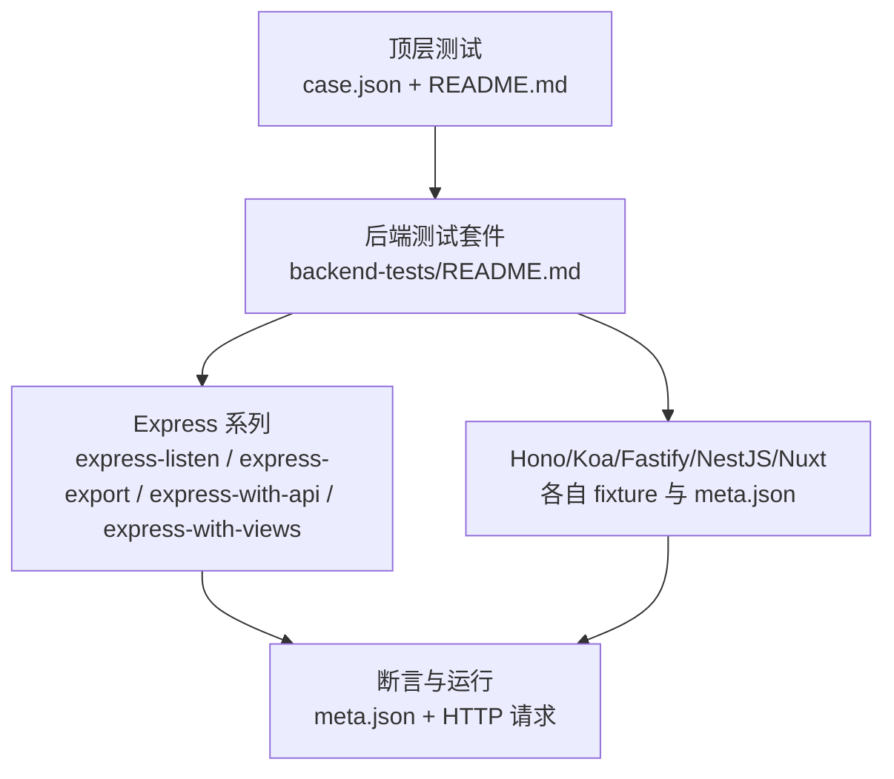
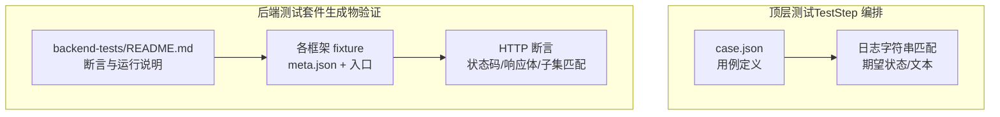
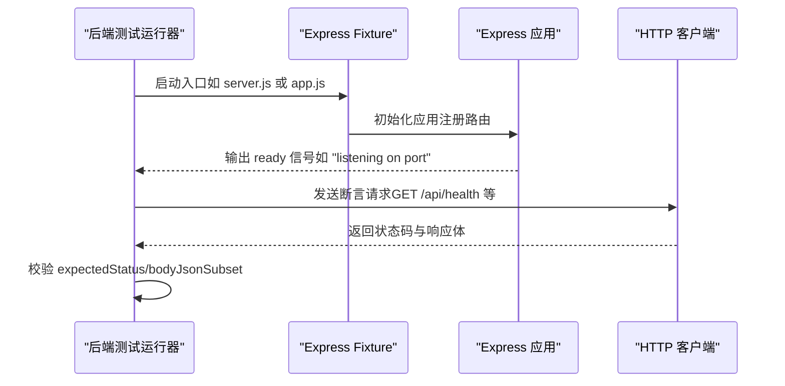
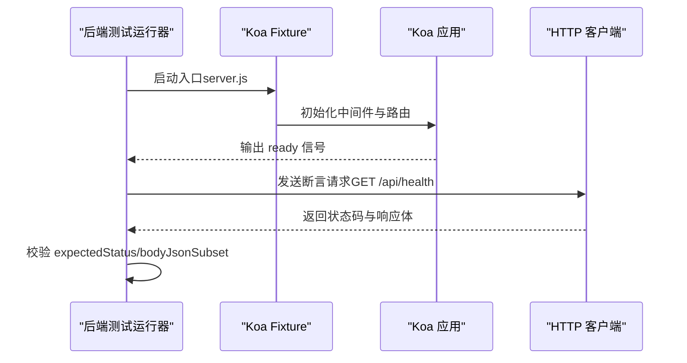
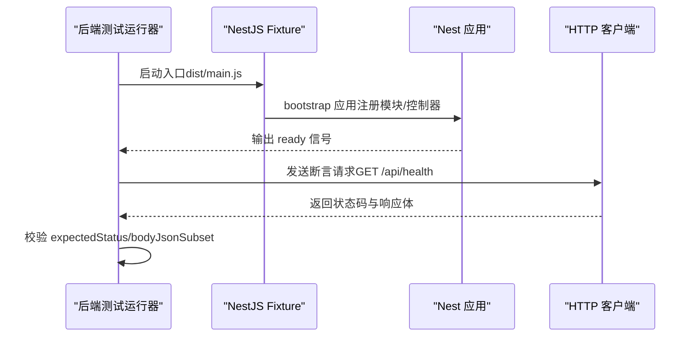
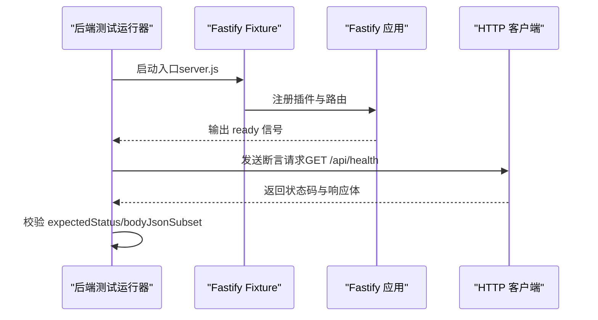
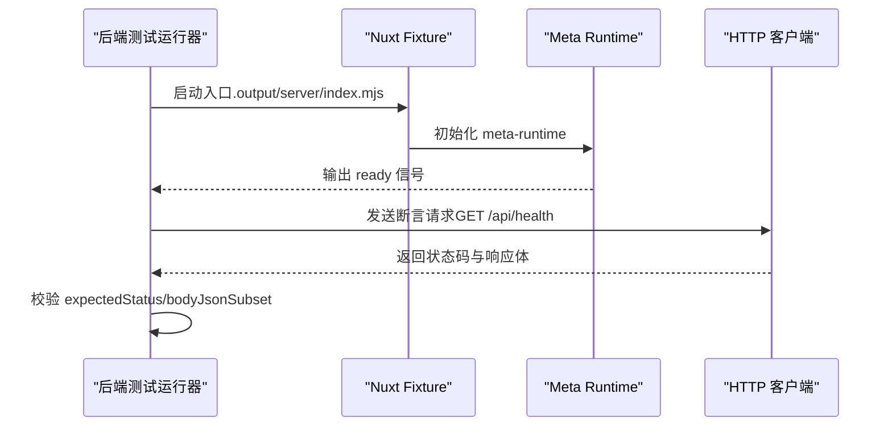
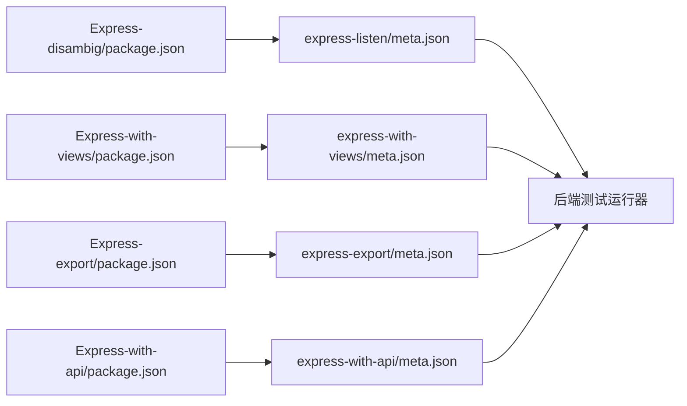

# 后端框架测试

<cite>
**本文引用的文件**
- [README.md](file://README.md)
- [case.json](file://case.json)
- [backend-tests/README.md](file://backend-tests/README.md)
- [backend-tests/express-listen/meta.json](file://backend-tests/express-listen/meta.json)
- [backend-tests/express-export/meta.json](file://backend-tests/express-export/meta.json)
- [backend-tests/hono/meta.json](file://backend-tests/hono/meta.json)
- [backend-tests/koa/meta.json](file://backend-tests/koa/meta.json)
- [backend-tests/nestjs/meta.json](file://backend-tests/nestjs/meta.json)
- [backend-tests/fastify/meta.json](file://backend-tests/fastify/meta.json)
- [backend-tests/nuxt/meta.json](file://backend-tests/nuxt/meta.json)
- [Express-disambig/package.json](file://Express-disambig/package.json)
- [Express-export/package.json](file://Express-export/package.json)
- [Express-listen/package.json](file://Express-listen/package.json)
- [Express-with-api/package.json](file://Express-with-api/package.json)
- [Express-with-views/package.json](file://Express-with-views/package.json)
</cite>

## 目录
1. [简介](#简介)
2. [项目结构](#项目结构)
3. [核心组件](#核心组件)
4. [架构总览](#架构总览)
5. [详细组件分析](#详细组件分析)
6. [依赖分析](#依赖分析)
7. [性能考虑](#性能考虑)
8. [故障排查指南](#故障排查指南)
9. [结论](#结论)
10. [附录](#附录)

## 简介
本仓库围绕“后端框架测试”目标，提供了两类测试体系与验证闭环：
- 顶层测试套件：通过 case.json 驱动 TestStep 编排，覆盖安装、构建、打包、部署、配额等全流程，并以日志字符串匹配的方式验证结果。
- 后端测试套件（backend-tests）：独立于顶层套件，聚焦于 framework-checker 生成的“可执行生成物”（如 start.mjs）是否能在本机正确启动并响应 HTTP 请求，确保“框架级能跑”的承诺。

两类测试互补：前者验证端到端流程与平台行为，后者验证生成物的正确性与可运行性。

## 项目结构
仓库采用按功能/框架拆分的组织方式，核心目录如下：
- 顶层：README.md、case.json，定义测试用例与运行说明
- 各后端框架的最小可运行样例（Fixture）：Express-disambig、Express-export、Express-listen、Express-with-api、Express-with-views、Fastify-app、Hono-app、Koa-app、NestJS-app、Nuxt-app 等
- backend-tests：独立的后端测试套件，每个框架一个 fixture，配套 meta.json 断言定义与运行脚本

图表来源
- [README.md:1-31](file://README.md#L1-L31)
- [backend-tests/README.md:1-133](file://backend-tests/README.md#L1-L133)

章节来源
- [README.md:1-31](file://README.md#L1-L31)
- [backend-tests/README.md:1-133](file://backend-tests/README.md#L1-L133)

## 核心组件
- 顶层测试编排（case.json）：定义测试用例、环境变量、期望状态与日志关键字，驱动 TestStep 流水线
- 后端测试套件（backend-tests）：对每个支持的后端框架提供独立 fixture，验证生成物在本机的可运行性与 HTTP 响应正确性
- 各框架最小样例（Fixture）：Express、Hono、Koa、NestJS、Fastify、Nuxt 等，每个样例包含 package.json 与最小可运行入口

章节来源
- [case.json:1-603](file://case.json#L1-L603)
- [backend-tests/README.md:1-133](file://backend-tests/README.md#L1-L133)

## 架构总览
下图展示了两类测试的职责边界与交互关系：

图表来源
- [case.json:1-603](file://case.json#L1-L603)
- [backend-tests/README.md:1-133](file://backend-tests/README.md#L1-L133)

## 详细组件分析

### Express 测试场景与实现
Express 提供多种典型使用模式，本仓库通过多个 fixture 覆盖：
- app.listen 风格：入口文件直接监听端口
- module.exports = app 风格：不主动监听，由外部运行时接管
- 与 /api 路由共存：当项目同时包含后端框架与纯函数计算（FC）处理器时，优先走后端框架
- 带视图模板：模板文件随打包下发，避免线上 404
- 入口消歧：当存在多个候选入口（如 server.js 与 app.js）时，能正确识别真正 require 框架的文件

图表来源
- [backend-tests/express-listen/meta.json:1-36](file://backend-tests/express-listen/meta.json#L1-L36)
- [backend-tests/express-export/meta.json:1-14](file://backend-tests/express-export/meta.json#L1-L14)
- [backend-tests/README.md:94-110](file://backend-tests/README.md#L94-L110)

章节来源
- [backend-tests/express-listen/meta.json:1-36](file://backend-tests/express-listen/meta.json#L1-L36)
- [backend-tests/express-export/meta.json:1-14](file://backend-tests/express-export/meta.json#L1-L14)
- [backend-tests/README.md:1-133](file://backend-tests/README.md#L1-L133)

### Hono 测试场景与实现
Hono 采用 fetch 风格导出，适合边缘或无服务器环境。测试关注点包括：
- 直接导出 fetch 处理器
- 与 Express 等框架共存时的优先级与路由隔离
- HTTP 断言：状态码、响应体 JSON 子集匹配

图表来源
- [backend-tests/hono/meta.json:1-14](file://backend-tests/hono/meta.json#L1-L14)
- [backend-tests/README.md:94-110](file://backend-tests/README.md#L94-L110)

章节来源
- [backend-tests/hono/meta.json:1-14](file://backend-tests/hono/meta.json#L1-L14)
- [backend-tests/README.md:1-133](file://backend-tests/README.md#L1-L133)

### Koa 测试场景与实现
Koa 以中间件为核心，测试重点在于：
- app.listen 风格的直接监听
- 中间件链路与路由处理
- HTTP 断言：GET/POST、状态码、JSON 子集匹配

图表来源
- [backend-tests/koa/meta.json:1-14](file://backend-tests/koa/meta.json#L1-L14)
- [backend-tests/README.md:94-110](file://backend-tests/README.md#L94-L110)

章节来源
- [backend-tests/koa/meta.json:1-14](file://backend-tests/koa/meta.json#L1-L14)
- [backend-tests/README.md:1-133](file://backend-tests/README.md#L1-L133)

### NestJS 测试场景与实现
NestJS 采用 TypeScript 并编译到 dist/main.js，测试关注：
- bootstrap 启动流程
- 路由与控制器
- HTTP 断言：状态码、响应体 JSON 子集匹配

图表来源
- [backend-tests/nestjs/meta.json:1-15](file://backend-tests/nestjs/meta.json#L1-L15)
- [backend-tests/README.md:94-110](file://backend-tests/README.md#L94-L110)

章节来源
- [backend-tests/nestjs/meta.json:1-15](file://backend-tests/nestjs/meta.json#L1-L15)
- [backend-tests/README.md:1-133](file://backend-tests/README.md#L1-L133)

### Fastify 测试场景与实现
Fastify 以高性能与插件生态著称，测试关注：
- app.listen 风格的直接监听
- 插件注册与路由处理
- HTTP 断言：状态码、响应体 JSON 子集匹配

图表来源
- [backend-tests/fastify/meta.json:1-15](file://backend-tests/fastify/meta.json#L1-L15)
- [backend-tests/README.md:94-110](file://backend-tests/README.md#L94-L110)

章节来源
- [backend-tests/fastify/meta.json:1-15](file://backend-tests/fastify/meta.json#L1-L15)
- [backend-tests/README.md:1-133](file://backend-tests/README.md#L1-L133)

### Nuxt 测试场景与实现
Nuxt 属于元框架（Meta-framework），采用 meta-runtime adapter，而非 nft trace：
- 通过 nuxt.config.ts 配置
- 构建产物位于 .output/server/index.mjs
- 测试关注：meta 模式下的启动与路由响应

图表来源
- [backend-tests/nuxt/meta.json:1-14](file://backend-tests/nuxt/meta.json#L1-L14)
- [backend-tests/README.md:588-597](file://backend-tests/README.md#L588-L597)

章节来源
- [backend-tests/nuxt/meta.json:1-14](file://backend-tests/nuxt/meta.json#L1-L14)
- [backend-tests/README.md:1-133](file://backend-tests/README.md#L1-L133)

### 组合与冲突处理
- 同时存在 Express 与 /api 目录：优先走后端框架，由框架自身处理 /api
- /api 路由冲突：当两个文件映射到同一路径时，构建失败并提示冲突文件
- 动态路径与可选通配：支持 [id]、[...slug]、[[...slug]] 等模式，静态路径优先匹配

章节来源
- [case.json:355-408](file://case.json#L355-L408)
- [case.json:374-391](file://case.json#L374-L391)
- [case.json:523-559](file://case.json#L523-L559)

## 依赖分析
- 顶层测试依赖：case.json 中的用例定义与环境变量，驱动 TestStep 流水线
- 后端测试依赖：每个 fixture 的 package.json 声明框架依赖，meta.json 定义断言与运行参数
- 典型依赖关系（以 Express 为例）：
  - Express-disambig/package.json：声明 express 依赖
  - Express-with-views/package.json：声明 express 与 ejs 依赖
  - 各 fixture 的 meta.json：声明入口、端口、断言与运行参数

图表来源
- [Express-disambig/package.json:1-9](file://Express-disambig/package.json#L1-L9)
- [Express-with-views/package.json:1-10](file://Express-with-views/package.json#L1-L10)
- [Express-export/package.json:1-9](file://Express-export/package.json#L1-L9)
- [Express-with-api/package.json:1-9](file://Express-with-api/package.json#L1-L9)
- [backend-tests/README.md:94-110](file://backend-tests/README.md#L94-L110)

章节来源
- [Express-disambig/package.json:1-9](file://Express-disambig/package.json#L1-L9)
- [Express-with-views/package.json:1-10](file://Express-with-views/package.json#L1-L10)
- [Express-export/package.json:1-9](file://Express-export/package.json#L1-L9)
- [Express-with-api/package.json:1-9](file://Express-with-api/package.json#L1-L9)

## 性能考虑
- 启动时间：不同框架的 warmupTimeoutMs 设置不同（如 NestJS 15s、Fastify 10s、Nuxt 20s），可根据实际项目调整
- 断言粒度：单个 fixture 的断言数量与复杂度影响整体耗时；建议按需精简
- 运行环境：backend-tests 在本机 loopback 运行，单用例耗时秒级，远快于端到端流水线

章节来源
- [backend-tests/README.md:94-110](file://backend-tests/README.md#L94-L110)
- [backend-tests/nestjs/meta.json](file://backend-tests/nestjs/meta.json#L7)
- [backend-tests/fastify/meta.json](file://backend-tests/fastify/meta.json#L7)
- [backend-tests/nuxt/meta.json](file://backend-tests/nuxt/meta.json#L6)

## 故障排查指南
- 生成物未正确识别为后端：检查入口文件是否被正确识别（如 server.js 与 app.js 的消歧）
- HTTP 断言失败：核对 expectedStatus、bodyContains、bodyJsonSubset；确认路由与方法是否匹配
- 启动超时：适当提高 warmupTimeoutMs；检查 readySignal 是否符合预期
- /api 路由冲突：根据错误提示定位冲突文件，调整文件命名或路径
- 模板文件缺失：Express 带 views/ 时需确保模板随打包下发

章节来源
- [backend-tests/README.md:86-93](file://backend-tests/README.md#L86-L93)
- [case.json:393-408](file://case.json#L393-L408)
- [case.json:486-503](file://case.json#L486-L503)

## 结论
本仓库通过“顶层测试 + 后端测试套件”的双层验证，既保证了端到端流程的正确性，又确保了框架生成物在本机的可运行性与响应正确性。各框架（Express、Hono、Koa、NestJS、Fastify、Nuxt）均提供最小可运行样例与断言定义，便于快速扩展与回归验证。

## 附录

### 顶层测试用例与运行说明
- 用例结构：name、envs、repoName、requireStatus、requireLogTextList 等
- 运行方式：通过 TestStep 触发，日志字符串匹配判断成功与否

章节来源
- [README.md:1-31](file://README.md#L1-L31)
- [case.json:1-603](file://case.json#L1-L603)

### 后端测试套件运行与断言
- 运行方式：批量安装依赖后，执行 blackBox 后端测试入口
- 断言规则：状态码严格相等、响应体子串匹配、JSON 子集匹配
- 退出码：0 表示全部断言通过，1 表示至少一个断言失败或启动失败

章节来源
- [backend-tests/README.md:94-116](file://backend-tests/README.md#L94-L116)
- [backend-tests/README.md:86-93](file://backend-tests/README.md#L86-L93)