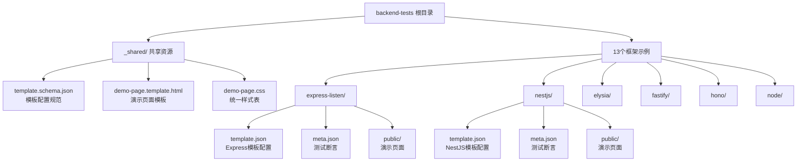
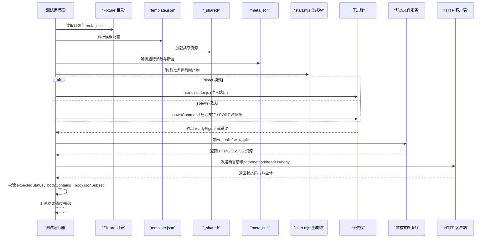
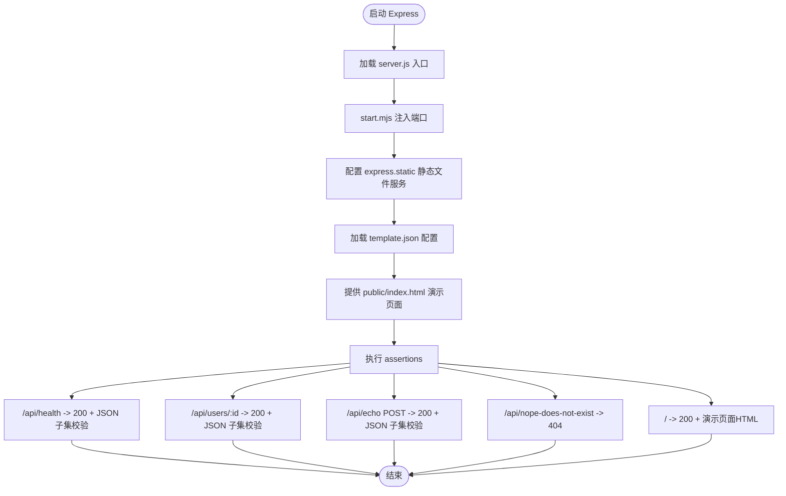
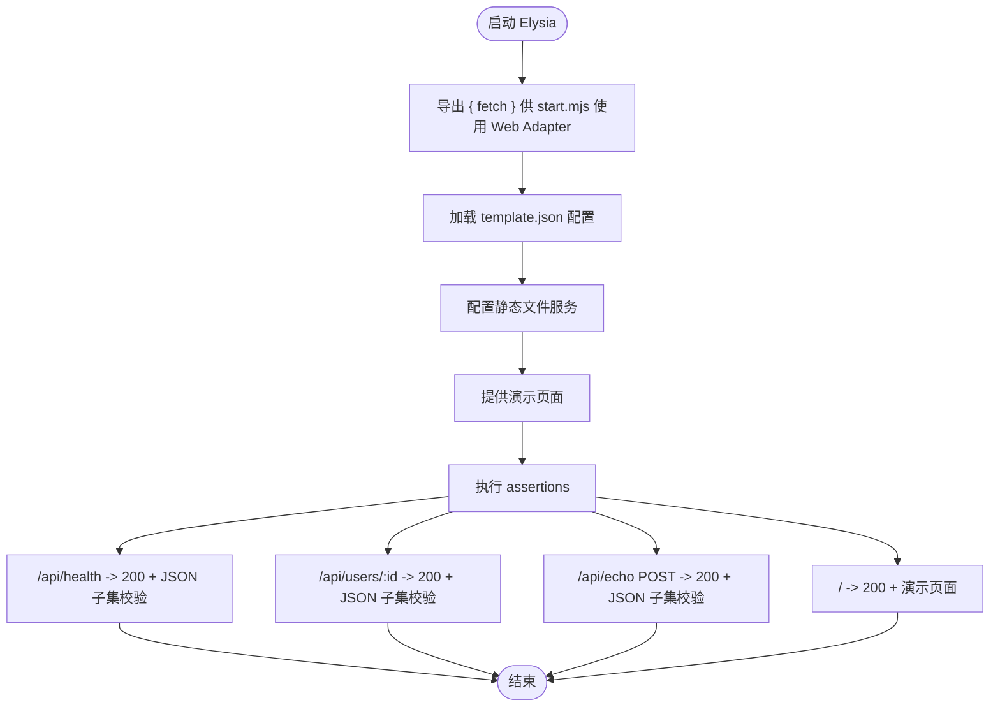
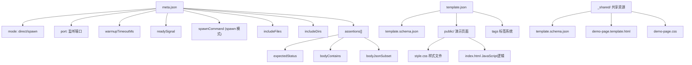

# 后端框架测试套件

<cite>
**本文引用的文件**
- [backend-tests/README.md](file://backend-tests/README.md)
- [backend-tests/_shared/template.schema.json](file://backend-tests/_shared/template.schema.json)
- [backend-tests/_shared/demo-page.template.html](file://backend-tests/_shared/demo-page.template.html)
- [backend-tests/_shared/demo-page.css](file://backend-tests/_shared/demo-page.css)
- [backend-tests/express-listen/template.json](file://backend-tests/express-listen/template.json)
- [backend-tests/nestjs/template.json](file://backend-tests/nestjs/template.json)
- [backend-tests/elysia/template.json](file://backend-tests/elysia/template.json)
- [backend-tests/fastify/template.json](file://backend-tests/fastify/template.json)
- [backend-tests/hono/template.json](file://backend-tests/hono/template.json)
- [backend-tests/node/template.json](file://backend-tests/node/template.json)
- [backend-tests/express-listen/meta.json](file://backend-tests/express-listen/meta.json)
- [backend-tests/nestjs/meta.json](file://backend-tests/nestjs/meta.json)
- [backend-tests/express-listen/public/index.html](file://backend-tests/express-listen/public/index.html)
- [backend-tests/nestjs/public/index.html](file://backend-tests/nestjs/public/index.html)
</cite>

## 更新摘要
**所做更改**
- 新增统一模板系统章节，详细介绍_shared目录下的共享资源架构
- 新增交互式演示页面章节，说明demo-page模板的使用方式和配置方法
- 更新项目结构图，反映统一的模板系统和静态文件服务架构
- 新增模板配置文件格式说明和字段定义
- 更新所有框架的演示页面实现，展示统一的视觉设计和交互体验
- 增强框架对比和学习体验的功能描述

## 目录
1. [简介](#简介)
2. [项目结构](#项目结构)
3. [统一模板系统](#统一模板系统)
4. [交互式演示页面](#交互式演示页面)
5. [核心组件](#核心组件)
6. [架构总览](#架构总览)
7. [详细组件分析](#详细组件分析)
8. [依赖关系分析](#依赖关系分析)
9. [性能考量](#性能考量)
10. [故障排查指南](#故障排查指南)
11. [结论](#结论)
12. [附录](#附录)

## 简介
本测试套件位于 backend-tests 目录，旨在对 framework-checker 生成的运行时产物进行"真跑"验证，确保各后端框架在本机上能够正确启动并返回预期的 HTTP 响应。与顶层 case.json 的端到端部署验证不同，本套件专注于验证生成物的正确性与运行时稳定性，单个用例耗时通常在秒级，便于快速反馈与定位问题。

**重大更新** 测试套件现已完成统一模板系统升级，所有13个框架测试都包含统一的演示页面和静态文件服务，提供一致的视觉设计、交互式API演示和框架对比功能，大幅增强了学习体验和开发效率。

## 项目结构
backend-tests 目录采用"按框架分隔"的结构，每个框架一个子目录，包含：
- 最小可运行的用户入口文件（如 server.js、app.js、bootstrap.js 等）
- 依赖声明 package.json
- 构建产物（如 dist/）与源码（src/）
- meta.json：断言定义与运行参数
- **新增** template.json：控制台模板元数据配置
- **新增** public/ 目录：包含统一的交互式演示页面和样式文件
- **新增** _shared/ 目录：共享模板资源和CSS样式



**图表来源**
- [backend-tests/README.md:6-23](file://backend-tests/README.md#L6-L23)
- [backend-tests/_shared/template.schema.json:1-59](file://backend-tests/_shared/template.schema.json#L1-L59)

**章节来源**
- [backend-tests/README.md:6-23](file://backend-tests/README.md#L6-L23)

## 统一模板系统
为提升开发体验和框架对比效果，测试套件引入了统一的模板系统，位于 _shared 目录下，为所有框架提供标准化的演示页面和配置管理。

### 共享资源架构
- **template.schema.json**：定义模板配置的标准格式和验证规则，包含13个必填和可选字段
- **demo-page.template.html**：交互式演示页面的HTML模板，支持动态内容渲染
- **demo-page.css**：统一的演示页面样式表，采用阿里橙品牌色 #FF6A00

### 模板配置规范
每个框架的 template.json 文件遵循统一的schema定义：

| 字段 | 类型 | 必填 | 说明 |
|------|------|------|------|
| templateName | string | ✅ | 控制台展示的模板名称 |
| templateId | string | ❌ | 模板唯一标识，占位符 {{TEMPLATE_ID}} |
| framework | string | ✅ | framework-checker识别到的框架slug |
| description | string | ✅ | 模板一句话描述 |
| icon | string | ❌ | 模板图标（emoji或资源路径） |
| category | enum | ✅ | starter=框架入门示例，solution=业务场景示例 |
| entry | string | ✅ | 后端入口文件 |
| rootDirectory | string | ✅ | 平台构建时的RootDirectory |
| deployUrl | string | ❌ | 一键部署链接，占位符 {{DEPLOY_URL}} |
| demoUrl | string | ❌ | 在线Demo URL，占位符 {{DEMO_URL}} |
| tags | array | ❌ | 模板标签，用于控制台筛选 |

### 框架模板配置示例
**Express模板配置**：
```json
{
  "templateName": "Express + app.listen 留言板",
  "framework": "express",
  "description": "Express 经典 app.listen 风格，演示异步路由包装与全局错误处理中间件。",
  "icon": "🎧",
  "category": "starter",
  "entry": "server.js",
  "rootDirectory": "/backend-tests/express-listen",
  "tags": ["express", "listen", "async", "错误处理", "留言板"]
}
```

**章节来源**
- [backend-tests/_shared/template.schema.json:1-59](file://backend-tests/_shared/template.schema.json#L1-L59)
- [backend-tests/express-listen/template.json:1-14](file://backend-tests/express-listen/template.json#L1-L14)
- [backend-tests/nestjs/template.json:1-14](file://backend-tests/nestjs/template.json#L1-L14)

## 交互式演示页面
所有框架现在都集成了统一的交互式演示页面，提供一致的用户体验和功能特性。

### 演示页面功能特性
- **框架特色展示**：突出显示各框架的核心特性和优势
- **实时API调用**：内置"试一试"按钮，可直接调用后端接口查看响应
- **响应可视化**：JSON响应自动格式化显示，支持状态码和错误信息
- **产品能力展示**：底部展示平台零配置、自动检测、一键部署等特性
- **品牌化设计**：统一的阿里橙主题色和现代化的UI设计

### 页面配置系统
每个框架通过 PAGE_CONFIG 对象自定义演示内容：

```javascript
const PAGE_CONFIG = {
  framework: "Express",                    // 框架名称
  frameworkSlug: "express",               // 框架标识
  tagline: "Express + app.listen 经典风格...", // 标语
  deployUrl: "{{DEPLOY_URL}}",            // 部署链接
  demoUrl: "{{DEMO_URL}}",                // 演示链接
  features: [                             // 框架特色列表
    { icon: "🎧", title: "app.listen 风格", desc: "最经典的 Express 启动方式..." }
  ],
  endpoints: [                            // API端点列表
    { method: "GET", path: "/api/health", desc: "健康检查" },
    { method: "POST", path: "/api/echo", desc: "回显请求体", body: { hello: "world" } }
  ],
  productTags: [                           // 产品特性标签
    "零配置自动识别框架",
    "nft 自动追踪依赖打包",
    "一键部署到函数计算"
  ]
};
```

### 视觉设计规范
- **品牌色**：阿里橙 #FF6A00（按钮、高亮、badge）
- **设计风格**：亮色简洁，白底 + 浅灰分区
- **字体规范**：系统字体栈 + SF Mono 代码字体
- **响应式布局**：适配移动端和桌面端显示

**章节来源**
- [backend-tests/_shared/demo-page.template.html:1-227](file://backend-tests/_shared/demo-page.template.html#L1-L227)
- [backend-tests/_shared/demo-page.css:1-236](file://backend-tests/_shared/demo-page.css#L1-L236)
- [backend-tests/express-listen/public/index.html:44-67](file://backend-tests/express-listen/public/index.html#L44-L67)
- [backend-tests/nestjs/public/index.html:44-69](file://backend-tests/nestjs/public/index.html#L44-L69)

## 核心组件
- **断言定义（meta.json）**
  - 必填字段：name、framework、mode、port、assertions
  - assertions：包含至少一条 HTTP 断言，每条断言支持 path、method、headers、body、expectedStatus、bodyContains、bodyJsonSubset
  - 可选字段：entry、warmupTimeoutMs、shutdownTimeoutMs、readySignal、skip、skipReason、spawnCommand（spawn 模式）、includeFiles、includeDirs
- **运行模式**
  - direct：直接以用户入口文件启动，由 start.mjs 注入监听端口
  - spawn：通过自定义命令启动（如 egg-scripts），适合需要 launcher 的框架
- **启动与停止**
  - warmupTimeoutMs：等待 readySignal 出现的超时时间
  - shutdownTimeoutMs：SIGTERM 后等待子进程退出的超时时间
  - readySignal：启动完成的输出特征字符串
- **文件包含策略**
  - includeFiles：将指定文件精确加入 nft 文件列表
  - includeDirs：将目录内所有文件递归加入 nft 文件列表，用于解决静态追踪遗漏动态加载模块的问题
- **模板系统集成**
  - template.json：定义演示页面配置和元数据
  - public/ 目录：包含HTML和CSS文件，提供交互式演示
  - 共享样式：统一的视觉设计和用户体验
  - 静态文件服务：各框架通过不同的方式托管 public/ 目录

**章节来源**
- [backend-tests/README.md:81-127](file://backend-tests/README.md#L81-L127)
- [backend-tests/express-listen/meta.json:1-43](file://backend-tests/express-listen/meta.json#L1-L43)
- [backend-tests/nestjs/meta.json:1-17](file://backend-tests/nestjs/meta.json#L1-L17)

## 架构总览
测试套件的运行流程分为三个阶段：准备阶段、启动阶段、断言阶段，现在还包括演示页面的加载和渲染。



**图表来源**
- [backend-tests/README.md:94-110](file://backend-tests/README.md#L94-L110)
- [backend-tests/express-listen/meta.json:41-42](file://backend-tests/express-listen/meta.json#L41-L42)

## 详细组件分析

### Express（app.listen 风格）组件分析
- **运行模式**：direct
- **入口文件**：server.js，使用 app.listen(8080)，start.mjs 将拦截并改为 manifest.port
- **静态文件服务**：express.static 托管 public/ 目录
- **演示页面**：基于统一模板系统，展示Express的特色功能和API演示
- **断言要点**：健康检查、路由参数、POST 回显、未命中路由 404、演示页面访问



**图表来源**
- [backend-tests/express-listen/meta.json:1-43](file://backend-tests/express-listen/meta.json#L1-L43)
- [backend-tests/express-listen/template.json:1-14](file://backend-tests/express-listen/template.json#L1-L14)

**章节来源**
- [backend-tests/express-listen/meta.json:1-43](file://backend-tests/express-listen/meta.json#L1-L43)
- [backend-tests/express-listen/template.json:1-14](file://backend-tests/express-listen/template.json#L1-L14)

### NestJS 组件分析
- **运行模式**：direct
- **入口文件**：nestjs/src/main.ts，使用 @nestjs/core 创建应用并监听 8080
- **静态文件服务**：@nestjs/serve-static 托管 public/ 目录
- **演示页面**：支持多模块架构的演示，展示企业级应用特性
- **断言要点**：健康检查、路由参数、POST 回显、未命中路由 404、演示页面访问


**图表来源**
- [backend-tests/nestjs/meta.json:1-17](file://backend-tests/nestjs/meta.json#L1-L17)
- [backend-tests/nestjs/template.json:1-14](file://backend-tests/nestjs/template.json#L1-L14)

**章节来源**
- [backend-tests/nestjs/meta.json:1-17](file://backend-tests/nestjs/meta.json#L1-L17)
- [backend-tests/nestjs/template.json:1-14](file://backend-tests/nestjs/template.json#L1-L14)

### Elysia 组件分析
- **运行模式**：direct
- **入口风格**：export { fetch }，通过 Web Adapter 在 Node 上运行
- **静态文件服务**：手动 fs 实现静态文件托管
- **演示页面**：轻量级框架的现代化展示界面
- **断言要点**：健康检查、路由参数、POST 回显、演示页面访问



**图表来源**
- [backend-tests/elysia/template.json:1-14](file://backend-tests/elysia/template.json#L1-L14)

**章节来源**
- [backend-tests/elysia/template.json:1-14](file://backend-tests/elysia/template.json#L1-L14)

## 依赖关系分析
- **入口文件与运行模式**
  - direct 模式：入口文件由 start.mjs 注入端口并启动
  - spawn 模式：通过 spawnCommand 启动，支持 $PORT 占位符
- **文件包含策略**
  - Egg/Midway 等动态加载插件的框架建议 includeDirs 包含 node_modules，避免静态追踪遗漏
  - includeFiles 用于精确补充特定文件
  - **新增** includeDirs: ["public"] 用于包含演示页面静态资源
- **断言规则**
  - expectedStatus 严格相等
  - bodyContains 子串匹配（区分大小写）
  - bodyJsonSubset 对响应体解析后进行对象包含校验（响应可包含更多字段）
- **模板系统依赖**
  - template.json：定义演示页面配置和元数据
  - _shared/：共享模板资源和CSS样式
  - public/：框架特定的演示页面实现
  - 静态文件服务：各框架通过不同的方式托管 public/ 目录



**图表来源**
- [backend-tests/README.md:81-127](file://backend-tests/README.md#L81-L127)
- [backend-tests/_shared/template.schema.json:1-59](file://backend-tests/_shared/template.schema.json#L1-L59)
- [backend-tests/express-listen/meta.json:41-42](file://backend-tests/express-listen/meta.json#L41-L42)

**章节来源**
- [backend-tests/README.md:81-127](file://backend-tests/README.md#L81-L127)
- [backend-tests/_shared/template.schema.json:1-59](file://backend-tests/_shared/template.schema.json#L1-L59)
- [backend-tests/express-listen/meta.json:41-42](file://backend-tests/express-listen/meta.json#L41-L42)

## 性能考量
- **单用例耗时**：秒级，显著快于端到端部署验证
- **启动超时**：warmupTimeoutMs 可根据框架特性调整
- **关闭超时**：shutdownTimeoutMs 控制 SIGTERM 后等待退出时间
- **文件包含策略**：includeDirs 虽更稳妥但可能增加扫描时间，建议按需启用
- **模板系统性能优化**
  - 共享资源缓存：_shared 目录中的模板资源可被多个框架复用
  - 演示页面优化：统一的CSS和HTML模板减少重复加载
  - 静态文件服务：各框架原生静态文件服务性能良好
  - 模板渲染：template.json 配置简化了演示页面的生成过程
- **网络请求优化**：演示页面的API调用使用fetch API，支持Promise和错误处理

## 故障排查指南
- **启动失败**
  - 检查 readySignal 是否出现在 stdout
  - 调整 warmupTimeoutMs
  - spawn 模式检查 spawnCommand 参数与 $PORT 占位符替换
- **HTTP 响应异常**
  - expectedStatus 严格相等，确认端口与路径
  - bodyContains 与 bodyJsonSubset 的大小写敏感性
- **文件缺失或加载失败**
  - Egg/Midway 等框架启用 includeDirs 包含 node_modules
  - 使用 includeFiles 精确补充必要文件
  - **新增** 检查 includeDirs: ["public"] 是否正确配置
- **模板系统问题**
  - 检查 template.json 格式是否符合 template.schema.json 定义
  - 验证 _shared 目录中的共享资源是否存在
  - 确认 public/ 目录中的演示页面文件完整
  - 检查静态文件服务配置是否正确
- **演示页面问题**
  - 验证 PAGE_CONFIG 配置是否正确
  - 检查浏览器控制台是否有JavaScript错误
  - 确认API端点路径和方法配置正确
- **退出码**
  - 0：所有非跳过的 fixture 断言全部通过
  - 1：至少一个 fixture 的断言失败、启动失败或 framework-checker 报错

**章节来源**
- [backend-tests/README.md:112-116](file://backend-tests/README.md#L112-L116)
- [backend-tests/README.md:126-131](file://backend-tests/README.md#L126-L131)

## 结论
backend-tests 提供了针对 framework-checker 生成物的"真跑"验证能力，通过 direct 与 spawn 两种模式覆盖主流后端框架，结合 meta.json 的断言定义与文件包含策略，确保构建产物在本机上的正确性、HTTP 响应的准确性以及运行时行为的稳定性。

**重大升级** 新的统一模板系统进一步增强了测试套件的功能，通过共享样式和交互式演示页面，提供了完整的框架对比和学习资源。测试套件现在不仅能够验证框架的正确性，还能为开发者提供直观的框架特性展示和学习指导。所有13个框架现在都拥有统一的视觉设计、交互式API演示和一致的用户体验，大大提升了开发者的学习和对比效率。

## 附录
- **新增框架 fixture 的步骤**
  - 在 backend-tests/<framework-slug>-<flavor>/ 建目录
  - 编写最小可运行的入口与 package.json
  - **新增** 创建 template.json 文件，定义演示页面配置
  - **新增** 在 public/ 目录中添加 HTML 和 CSS 文件
  - 编写 meta.json（参考现有示例）
  - 本地安装依赖并验证
  - 提交（遵循仓库策略）
- **模板系统开发指南**
  - 参考 template.schema.json 的字段定义
  - 复用 _shared/ 目录中的共享资源
  - 确保演示页面的兼容性和一致性
  - 配置正确的静态文件服务
  - 添加适当的断言验证演示页面可用性
- **演示页面定制指南**
  - 修改 PAGE_CONFIG 对象来自定义内容
  - 添加新的 API 端点到 endpoints 数组
  - 自定义框架特色功能到 features 数组
  - 调整产品特性标签到 productTags 数组
  - 保持统一的视觉风格和交互体验

**章节来源**
- [backend-tests/README.md:117-125](file://backend-tests/README.md#L117-L125)
- [backend-tests/_shared/template.schema.json:1-59](file://backend-tests/_shared/template.schema.json#L1-L59)