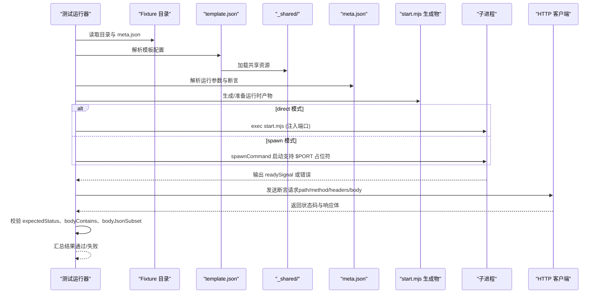
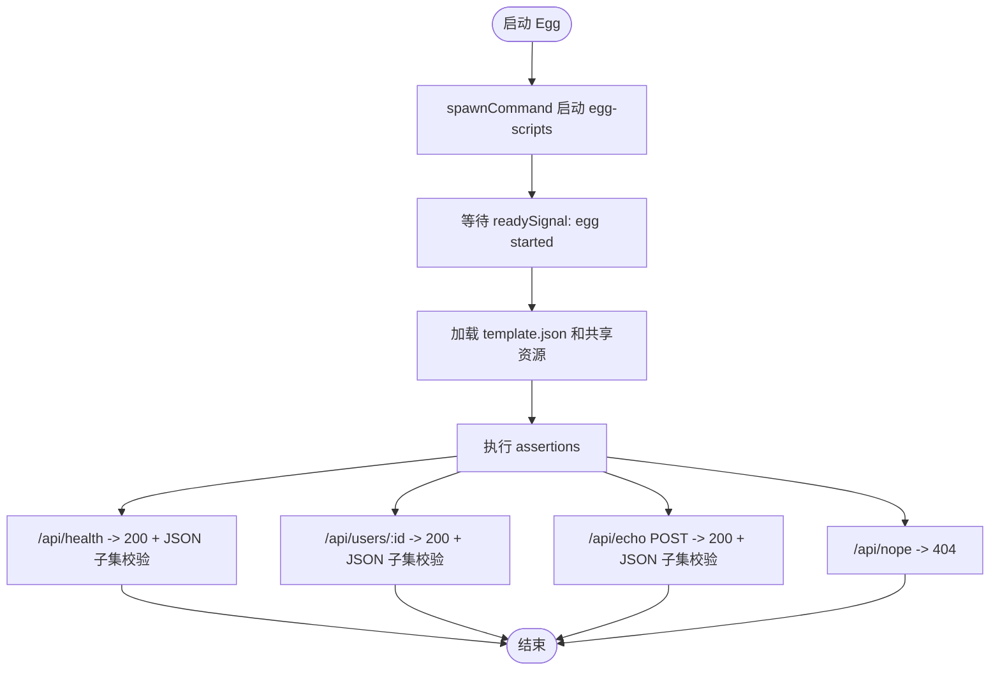
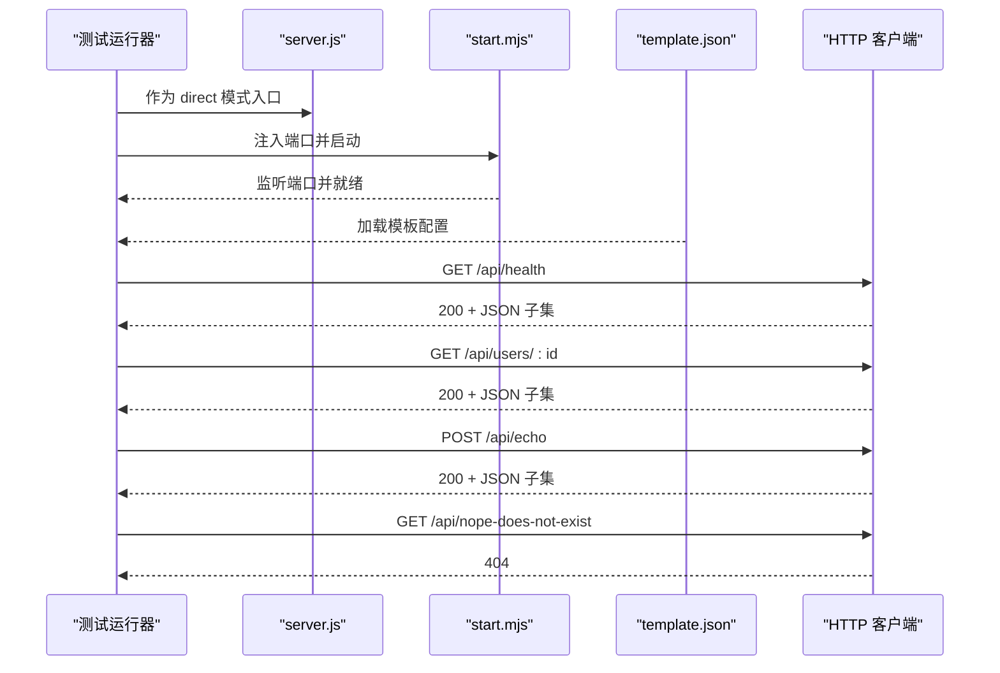
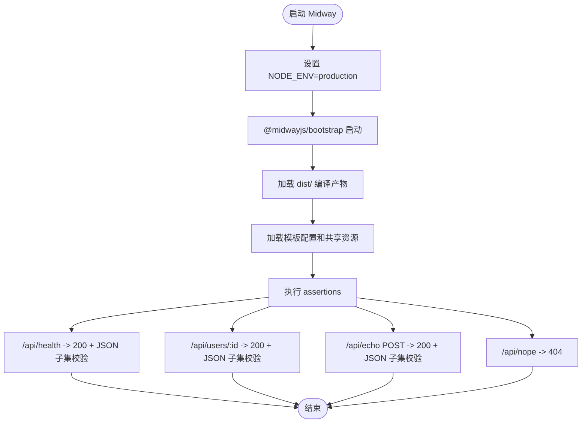
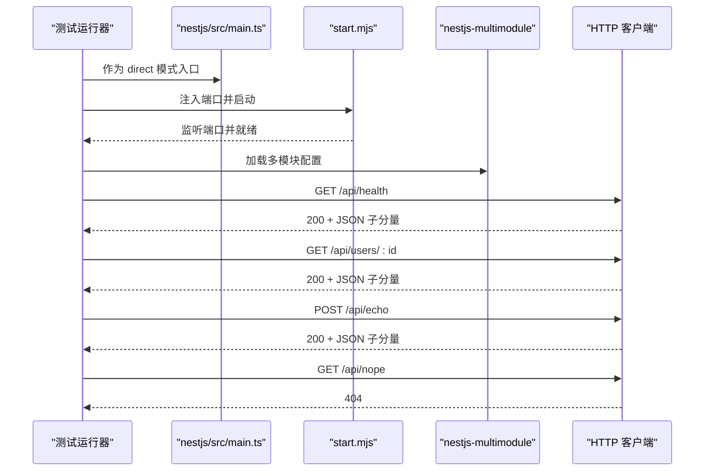
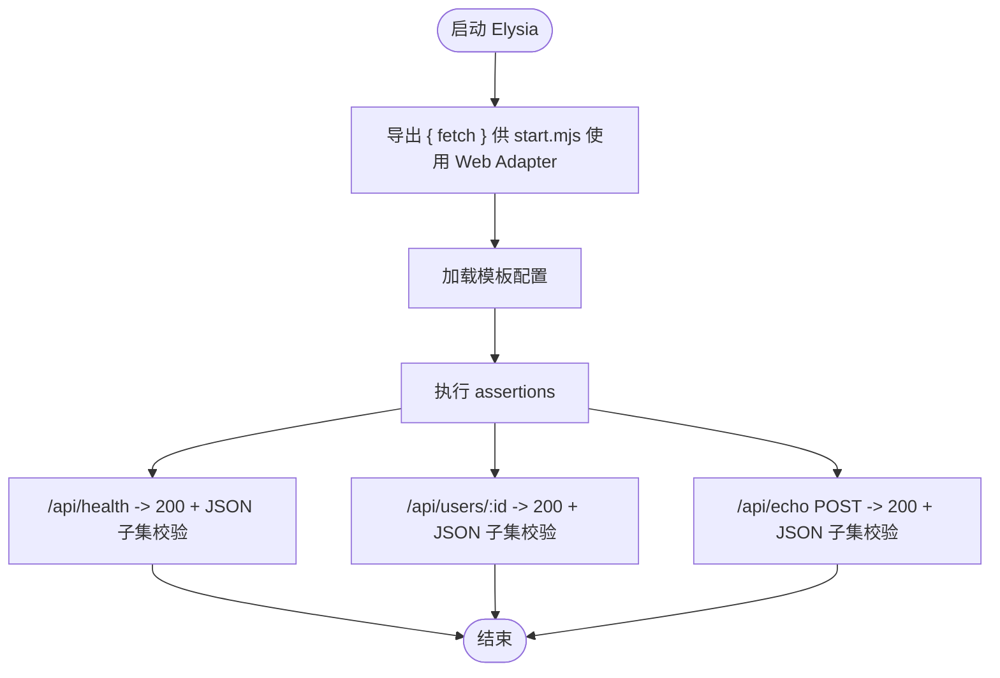
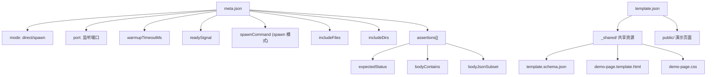

# 后端框架测试套件

<cite>
**本文引用的文件**
- [backend-tests/README.md](file://backend-tests/README.md)
- [backend-tests/_shared/template.schema.json](file://backend-tests/_shared/template.schema.json)
- [backend-tests/_shared/demo-page.template.html](file://backend-tests/_shared/demo-page.template.html)
- [backend-tests/_shared/demo-page.css](file://backend-tests/_shared/demo-page.css)
- [backend-tests/elysia/template.json](file://backend-tests/elysia/template.json)
- [backend-tests/express-listen/template.json](file://backend-tests/express-listen/template.json)
- [backend-tests/fastify/template.json](file://backend-tests/fastify/template.json)
- [backend-tests/nestjs/template.json](file://backend-tests/nestjs/template.json)
- [backend-tests/node/template.json](file://backend-tests/node/template.json)
- [backend-tests/egg/meta.json](file://backend-tests/egg/meta.json)
- [backend-tests/egg/app.js](file://backend-tests/egg/app.js)
- [backend-tests/express-listen/meta.json](file://backend-tests/express-listen/meta.json)
- [backend-tests/express-listen/server.js](file://backend-tests/express-listen/server.js)
- [backend-tests/midway/meta.json](file://backend-tests/midway/meta.json)
- [backend-tests/midway/bootstrap.js](file://backend-tests/midway/bootstrap.js)
- [backend-tests/nestjs/src/main.ts](file://backend-tests/nestjs/src/main.ts)
- [backend-tests/elysia/app.js](file://backend-tests/elysia/app.js)
</cite>

## 更新摘要
**所做更改**
- 新增统一模板系统章节，介绍_shared目录下的共享资源
- 新增交互式演示页面章节，说明demo-page模板的使用
- 更新项目结构图，反映新增的模板系统架构
- 新增模板配置文件格式说明
- 更新测试套件功能描述，强调框架对比和学习资源

## 目录
1. [简介](#简介)
2. [项目结构](#项目结构)
3. [统一模板系统](#统一模板系统)
4. [核心组件](#核心组件)
5. [架构总览](#架构总览)
6. [详细组件分析](#详细组件分析)
7. [依赖关系分析](#依赖关系分析)
8. [性能考量](#性能考量)
9. [故障排查指南](#故障排查指南)
10. [结论](#结论)
11. [附录](#附录)

## 简介
本测试套件位于 backend-tests 目录，旨在对 framework-checker 生成的运行时产物进行"真跑"验证，确保各后端框架在本机上能够正确启动并返回预期的 HTTP 响应。与顶层 case.json 的端到端部署验证不同，本套件专注于验证生成物的正确性与运行时稳定性，单个用例耗时通常在秒级，便于快速反馈与定位问题。

**更新** 测试套件现已引入统一模板系统，提供共享样式和交互式演示页面，增强框架对比和学习体验。

## 项目结构
backend-tests 目录采用"按框架分隔"的结构，每个框架一个子目录，包含：
- 最小可运行的用户入口文件（如 server.js、app.js、bootstrap.js 等）
- 依赖声明 package.json
- 构建产物（如 dist/）与源码（src/）
- meta.json：断言定义与运行参数
- **新增** template.json：模板配置文件
- **新增** public/ 目录：包含交互式演示页面和共享样式

```mermaid
graph TB
Root["backend-tests 根目录"] --> Shared["_shared/ 共享资源"]
Shared --> TemplateSchema["template.schema.json"]
Shared --> DemoTemplate["demo-page.template.html"]
Shared --> DemoCSS["demo-page.css"]
Root --> Egg["egg/"]
Root --> Elysia["elysia/"]
Root --> ExpressListen["express-listen/"]
Root --> ExpressExport["express-export/"]
Root --> Fastify["fastify/"]
Root --> H3["h3/"]
Root --> Hono["hono/"]
Root --> Koa["koa/"]
Root --> Midway["midway/"]
Root --> NestJS["nestjs/"]
Root --> Node["node/"]
Root --> Nuxt["nuxt/"]
Egg --> EggMeta["meta.json"]
Egg --> EggApp["app.js"]
Egg --> EggPkg["package.json"]
Egg --> EggPublic["public/"]
Egg --> EggTemplate["template.json"]
ExpressListen --> ELMeta["meta.json"]
ExpressListen --> ELServer["server.js"]
ExpressListen --> ELPkg["package.json"]
ExpressListen --> ELPublic["public/"]
ExpressListen --> ELTemplate["template.json"]
NestJS --> NSMain["src/main.ts"]
NestJS --> NSDist["dist/"]
NestJS --> NSMeta["meta.json"]
NestJS --> NSPkg["package.json"]
NestJS --> NSPublic["public/"]
NestJS --> NSTemplate["template.json"]
```



**图表来源**
- [backend-tests/README.md:18-28](file://backend-tests/README.md#L18-L28)
- [backend-tests/_shared/template.schema.json:1-50](file://backend-tests/_shared/template.schema.json#L1-L50)
- [backend-tests/_shared/demo-page.template.html:1-50](file://backend-tests/_shared/demo-page.template.html#L1-L50)

**章节来源**
- [backend-tests/README.md:18-28](file://backend-tests/README.md#L18-L28)

## 统一模板系统
**新增** 为提升开发体验和框架对比效果，测试套件引入了统一的模板系统，位于 _shared 目录下。

### 共享资源架构
- **template.schema.json**：定义模板配置的标准格式和验证规则
- **demo-page.template.html**：交互式演示页面的HTML模板
- **demo-page.css**：统一的演示页面样式表

### 模板配置文件
每个框架的 template.json 文件定义了该框架的演示页面配置：

```json
{
  "title": "Elysia",
  "framework": "elysia",
  "version": "1.0.0",
  "description": "Elysia 框架演示页面",
  "features": ["路由", "中间件", "插件"],
  "links": {
    "官方文档": "https://elysiajs.com",
    "GitHub": "https://github.com/elysiajs/elysia"
  }
}
```

### 交互式演示页面
公共演示页面提供以下功能：
- **框架对比视图**：展示不同框架的相同功能实现
- **实时代码示例**：显示框架特定的代码片段
- **响应数据可视化**：直观展示HTTP响应结果
- **学习资源链接**：提供官方文档和社区资源

**章节来源**
- [backend-tests/_shared/template.schema.json:1-50](file://backend-tests/_shared/template.schema.json#L1-L50)
- [backend-tests/_shared/demo-page.template.html:1-50](file://backend-tests/_shared/demo-page.template.html#L1-L50)
- [backend-tests/_shared/demo-page.css:1-50](file://backend-tests/_shared/demo-page.css#L1-L50)

## 核心组件
- 断言定义（meta.json）
  - 必填字段：name、framework、mode、port、assertions
  - assertions：包含至少一条 HTTP 断言，每条断言支持 path、method、headers、body、expectedStatus、bodyContains、bodyJsonSubset
  - 可选字段：entry、warmupTimeoutMs、shutdownTimeoutMs、readySignal、skip、skipReason、spawnCommand（spawn 模式）、includeFiles、includeDirs
- 运行模式
  - direct：直接以用户入口文件启动，由 start.mjs 注入监听端口
  - spawn：通过自定义命令启动（如 egg-scripts），适合需要 launcher 的框架
- 启动与停止
  - warmupTimeoutMs：等待 readySignal 出现的超时时间
  - shutdownTimeoutMs：SIGTERM 后等待子进程退出的超时时间
  - readySignal：启动完成的输出特征字符串
- 文件包含策略
  - includeFiles：将指定文件精确加入 nft 文件列表
  - includeDirs：将目录内所有文件递归加入 nft 文件列表，用于解决静态追踪遗漏动态加载模块的问题
- **新增** 模板系统集成
  - template.json：定义演示页面配置
  - public/ 目录：包含HTML和CSS文件
  - 共享样式：统一的视觉设计和用户体验

**章节来源**
- [backend-tests/README.md:38-84](file://backend-tests/README.md#L38-L84)
- [backend-tests/README.md:86-93](file://backend-tests/README.md#L86-L93)
- [backend-tests/README.md:112-116](file://backend-tests/README.md#L112-L116)

## 架构总览
测试套件的运行流程分为三个阶段：准备阶段、启动阶段、断言阶段。



**图表来源**
- [backend-tests/README.md:94-110](file://backend-tests/README.md#L94-L110)
- [backend-tests/egg/meta.json:4-15](file://backend-tests/egg/meta.json#L4-L15)
- [backend-tests/express-listen/meta.json:4-6](file://backend-tests/express-listen/meta.json#L4-L6)
- [backend-tests/midway/meta.json:4-6](file://backend-tests/midway/meta.json#L4-L6)

## 详细组件分析

### Egg 组件分析
- 运行模式：spawn
- 启动方式：通过 egg-scripts 启动，设置 workers=1、daemon=false，并使用 $PORT 占位符注入端口
- 启动信号：等待 stdout 中出现"egg started"
- 文件包含：includeDirs 包含 node_modules，确保静态追踪覆盖插件链路
- 断言要点：健康检查、路由参数、POST 回显、未命中路由 404
- **新增** 演示页面：基于共享模板系统，提供统一的Egg框架演示界面



**图表来源**
- [backend-tests/egg/meta.json:1-24](file://backend-tests/egg/meta.json#L1-L24)
- [backend-tests/egg/app.js:1-14](file://backend-tests/egg/app.js#L1-L14)

**章节来源**
- [backend-tests/egg/meta.json:1-24](file://backend-tests/egg/meta.json#L1-L24)
- [backend-tests/egg/app.js:1-14](file://backend-tests/egg/app.js#L1-L14)

### Express（app.listen 风格）组件分析
- 运行模式：direct
- 入口文件：server.js，使用 app.listen(8080)，start.mjs 将拦截并改为 manifest.port
- 断言要点：健康检查、路由参数、POST 回显、未命中路由 404
- **新增** 演示页面：集成共享样式，提供一致的Express框架展示



**图表来源**
- [backend-tests/express-listen/meta.json:1-36](file://backend-tests/express-listen/meta.json#L1-L36)
- [backend-tests/express-listen/server.js:1-21](file://backend-tests/express-listen/server.js#L1-L21)

**章节来源**
- [backend-tests/express-listen/meta.json:1-36](file://backend-tests/express-listen/meta.json#L1-L36)
- [backend-tests/express-listen/server.js:1-21](file://backend-tests/express-listen/server.js#L1-L21)

### Midway 组件分析
- 运行模式：direct
- 入口文件：bootstrap.js，设置 NODE_ENV=production，调用 @midwayjs/bootstrap 启动
- 文件包含：includeDirs 包含 node_modules 与 dist，确保编译产物与依赖被纳入
- 断言要点：健康检查、路由参数、POST 回显、未命中路由 404
- **新增** 演示页面：支持多模块架构的演示，展示复杂应用结构



**图表来源**
- [backend-tests/midway/meta.json:1-16](file://backend-tests/midway/meta.json#L1-L16)
- [backend-tests/midway/bootstrap.js:1-7](file://backend-tests/midway/bootstrap.js#L1-L7)

**章节来源**
- [backend-tests/midway/meta.json:1-16](file://backend-tests/midway/meta.json#L1-L16)
- [backend-tests/midway/bootstrap.js:1-7](file://backend-tests/midway/bootstrap.js#L1-L7)

### NestJS 组件分析
- 运行模式：direct
- 入口文件：nestjs/src/main.ts，使用 @nestjs/core 创建应用并监听 8080
- 断言要点：健康检查、路由参数、POST 回显、未命中路由 404
- **新增** 演示页面：支持多模块架构，展示NestJS的企业级应用结构



**图表来源**
- [backend-tests/nestjs/src/main.ts:1-10](file://backend-tests/nestjs/src/main.ts#L1-L10)

**章节来源**
- [backend-tests/nestjs/src/main.ts:1-10](file://backend-tests/nestjs/src/main.ts#L1-L10)

### Elysia 组件分析
- 运行模式：direct
- 入口风格：export { fetch }，通过 Web Adapter 在 Node 上运行
- 断言要点：健康检查、路由参数、POST 回显
- **新增** 演示页面：轻量级框架的现代化展示界面



**图表来源**
- [backend-tests/elysia/app.js:1-14](file://backend-tests/elysia/app.js#L1-L14)

**章节来源**
- [backend-tests/elysia/app.js:1-14](file://backend-tests/elysia/app.js#L1-L14)

## 依赖关系分析
- 入口文件与运行模式
  - direct 模式：入口文件由 start.mjs 注入端口并启动
  - spawn 模式：通过 spawnCommand 启动，支持 $PORT 占位符
- 文件包含策略
  - Egg/Midway 等动态加载插件的框架建议 includeDirs 包含 node_modules，避免静态追踪遗漏
  - includeFiles 用于精确补充特定文件
- 断言规则
  - expectedStatus 严格相等
  - bodyContains 子串匹配（区分大小写）
  - bodyJsonSubset 对响应体解析后进行对象包含校验（响应可包含更多字段）
- **新增** 模板系统依赖
  - template.json：定义演示页面配置
  - _shared/：共享模板资源
  - public/：框架特定的演示页面



**图表来源**
- [backend-tests/README.md:38-84](file://backend-tests/README.md#L38-L84)
- [backend-tests/egg/meta.json:67-82](file://backend-tests/egg/meta.json#L67-L82)
- [backend-tests/midway/meta.json:7-8](file://backend-tests/midway/meta.json#L7-L8)

**章节来源**
- [backend-tests/README.md:38-84](file://backend-tests/README.md#L38-L84)
- [backend-tests/egg/meta.json:67-82](file://backend-tests/egg/meta.json#L67-L82)
- [backend-tests/midway/meta.json:7-8](file://backend-tests/midway/meta.json#L7-L8)

## 性能考量
- 单用例耗时：秒级，显著快于端到端部署验证
- 启动超时：warmupTimeoutMs 可根据框架特性调整
- 关闭超时：shutdownTimeoutMs 控制 SIGTERM 后等待退出时间
- 文件包含策略：includeDirs 虽更稳妥但可能增加扫描时间，建议按需启用
- **新增** 模板系统性能
  - 共享资源缓存：_shared 目录中的模板资源可被多个框架复用
  - 演示页面优化：统一的CSS和HTML模板减少重复加载
  - 模板渲染：template.json 配置简化了演示页面的生成过程

## 故障排查指南
- 启动失败
  - 检查 readySignal 是否出现在 stdout
  - 调整 warmupTimeoutMs
  - spawn 模式检查 spawnCommand 参数与 $PORT 占位符替换
- HTTP 响应异常
  - expectedStatus 严格相等，确认端口与路径
  - bodyContains 与 bodyJsonSubset 的大小写敏感性
- 文件缺失或加载失败
  - Egg/Midway 等框架启用 includeDirs 包含 node_modules
  - 使用 includeFiles 精确补充必要文件
- **新增** 模板系统问题
  - 检查 template.json 格式是否符合 template.schema.json 定义
  - 验证 _shared 目录中的共享资源是否存在
  - 确认 public/ 目录中的演示页面文件完整
- 退出码
  - 0：所有非跳过的 fixture 断言全部通过
  - 1：至少一个 fixture 的断言失败、启动失败或 framework-checker 报错

**章节来源**
- [backend-tests/README.md:112-116](file://backend-tests/README.md#L112-L116)
- [backend-tests/README.md:126-131](file://backend-tests/README.md#L126-L131)

## 结论
backend-tests 提供了针对 framework-checker 生成物的"真跑"验证能力，通过 direct 与 spawn 两种模式覆盖主流后端框架，结合 meta.json 的断言定义与文件包含策略，确保构建产物在本机上的正确性、HTTP 响应的准确性以及运行时行为的稳定性。

**更新** 新的统一模板系统进一步增强了测试套件的功能，通过共享样式和交互式演示页面，提供了完整的框架对比和学习资源。测试套件现在不仅能够验证框架的正确性，还能为开发者提供直观的框架特性展示和学习指导。

## 附录
- 新增框架 fixture 的步骤
  - 在 backend-tests/<framework-slug>-<flavor>/ 建目录
  - 编写最小可运行入口与 package.json
  - **新增** 创建 template.json 文件，定义演示页面配置
  - **新增** 在 public/ 目录中添加 HTML 和 CSS 文件
  - 编写 meta.json（参考现有示例）
  - 本地安装依赖并验证
  - 提交（遵循仓库策略）
- **新增** 模板系统开发指南
  - 参考 template.schema.json 的字段定义
  - 复用 _shared/ 目录中的共享资源
  - 确保演示页面的兼容性和一致性

**章节来源**
- [backend-tests/README.md:117-125](file://backend-tests/README.md#L117-L125)