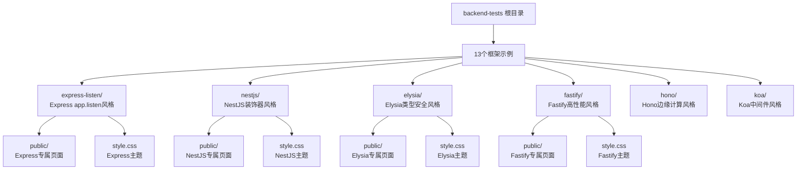
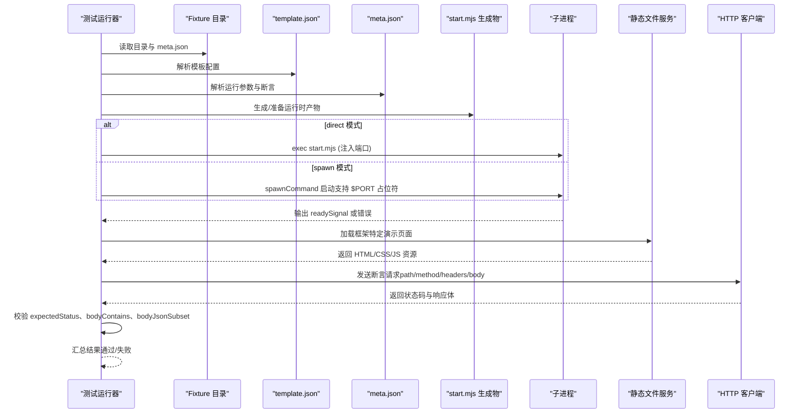
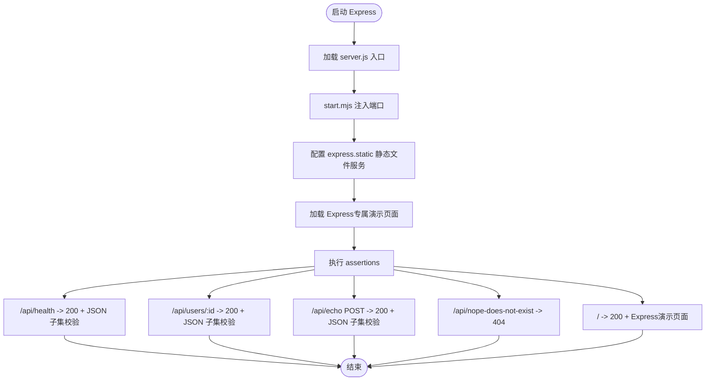
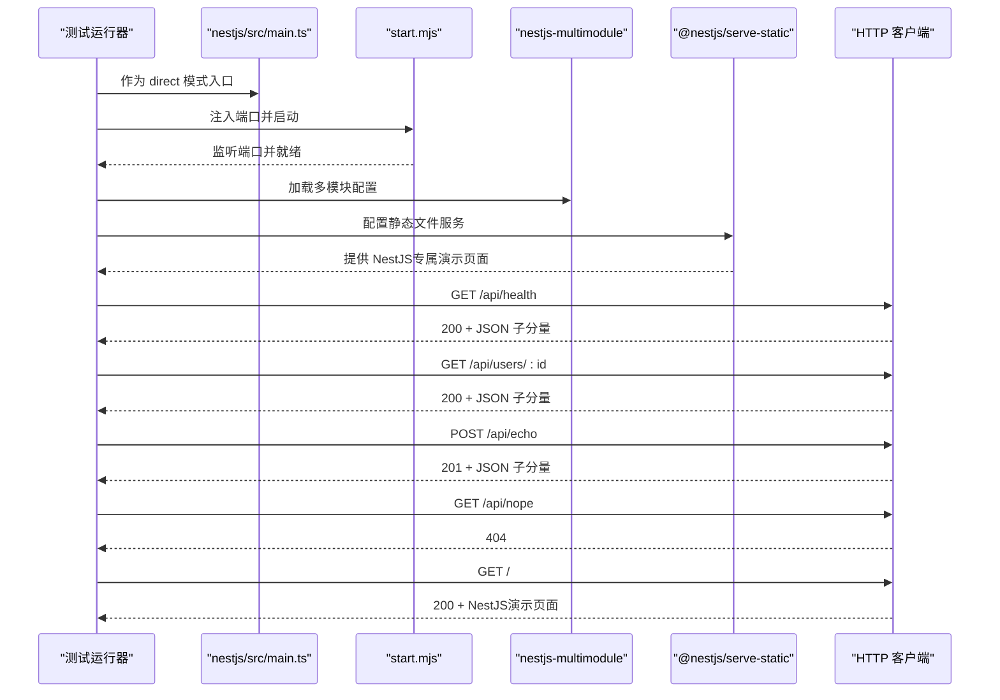
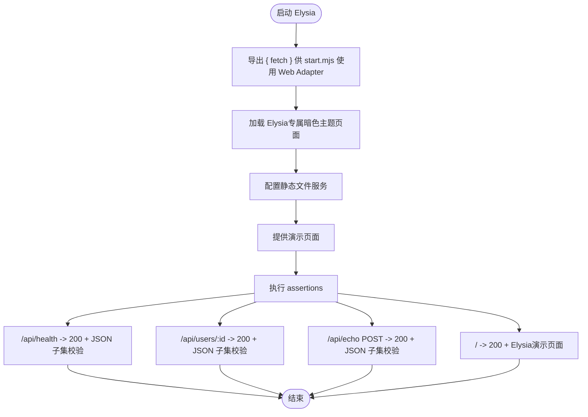
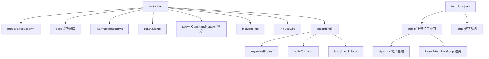

# 后端框架测试套件

<cite>
**本文引用的文件**
- [backend-tests/README.md](file://backend-tests/README.md)
- [backend-tests/express-listen/template.json](file://backend-tests/express-listen/template.json)
- [backend-tests/nestjs/template.json](file://backend-tests/nestjs/template.json)
- [backend-tests/express-listen/public/index.html](file://backend-tests/express-listen/public/index.html)
- [backend-tests/nestjs/public/index.html](file://backend-tests/nestjs/public/index.html)
- [backend-tests/elysia/public/index.html](file://backend-tests/elysia/public/index.html)
- [backend-tests/fastify/public/index.html](file://backend-tests/fastify/public/index.html)
- [backend-tests/express-listen/public/style.css](file://backend-tests/express-listen/public/style.css)
- [backend-tests/nestjs/public/style.css](file://backend-tests/nestjs/public/style.css)
</cite>

## 更新摘要
**所做更改**
- 完全重构前端演示页面架构，从统一的PAGE_CONFIG系统迁移到框架特定的ENDPOINTS配置方式
- 移除_shared目录中的统一模板资源（demo-page.template.html、demo-page.css、template.schema.json）
- 每个框架现在维护自己的独立演示页面和样式文件，提供独特的视觉主题和品牌化设计
- 简化了DOM操作逻辑，采用更直接的JavaScript实现方式
- 优化了演示页面的性能和可维护性，减少运行时依赖

## 目录
1. [简介](#简介)
2. [项目结构](#项目结构)
3. [框架特定演示页面架构](#框架特定演示页面架构)
4. [核心组件](#核心组件)
5. [架构总览](#架构总览)
6. [详细组件分析](#详细组件分析)
7. [依赖关系分析](#依赖关系分析)
8. [性能考量](#性能考量)
9. [故障排查指南](#故障排查指南)
10. [结论](#结论)
11. [附录](#附录)

## 简介
本测试套件位于 backend-tests 目录，旨在对 framework-checker 生成的运行时产物进行"真跑"验证，确保各后端框架在本机上能够正确启动并返回预期的 HTTP 响应。与顶层 case.json 的端到端部署验证不同，本套件专注于验证生成物的正确性与运行时稳定性，单个用例耗时通常在秒级，便于快速反馈与定位问题。

**重大更新** 测试套件已完成全面的前端架构重构，所有13个框架的演示页面已从复杂的统一PAGE_CONFIG系统迁移到框架特定的静态HTML结构。新的架构移除了_shared目录中的共享模板资源，每个框架现在拥有独立的演示页面和CSS样式，提供了独特的视觉主题和品牌化体验，大幅提升了用户体验和开发效率。

## 项目结构
backend-tests 目录采用"按框架分隔"的结构，每个框架一个子目录，包含：
- 最小可运行的用户入口文件（如 server.js、app.js、bootstrap.js 等）
- 依赖声明 package.json
- 构建产物（如 dist/）与源码（src/）
- meta.json：断言定义与运行参数
- template.json：控制台模板元数据配置
- **重构后** public/ 目录：包含框架特定的静态演示页面和样式文件
- **移除** _shared/ 目录：不再使用统一的模板资源和CSS样式基线

**图表来源**
- [backend-tests/README.md:6-23](file://backend-tests/README.md#L6-L23)

## 框架特定演示页面架构

**重大更新** 演示页面架构已完全重构，从统一的PAGE_CONFIG系统迁移到框架特定的实现方式。

### 新架构特点
- **静态HTML结构**：每个框架拥有独立的HTML文件，无需复杂的JavaScript渲染
- **框架特定配置**：使用ENDPOINTS数组替代PAGE_CONFIG对象，配置更简洁直观
- **独立样式主题**：每个框架拥有独特的CSS主题，体现框架特色和品牌调性
- **简化的DOM操作**：移除复杂的动态渲染逻辑，采用直接的DOM操作方式

### 框架主题设计

#### Express主题
- **主色调**：经典绿色系，体现Express的成熟稳定
- **设计风格**：简洁专业，突出代码示例展示
- **特色元素**：Express官方Logo集成，版本标识显示

#### NestJS主题  
- **主色调**：品牌红色(#E0234E)，体现企业级应用特性
- **设计风格**：现代商务风，强调装饰器和模块化的优势
- **特色元素**：NestJS Logo渐变效果，装饰器语法高亮

#### Elysia主题
- **主色调**：深紫色渐变(#a78bfa → #60a5fa)，体现现代化和类型安全
- **设计风格**：暗色主题，突出Bun生态的高性能特性
- **特色元素**：渐变文字效果，深色代码编辑器风格

#### Fastify主题
- **主色调**：橙色系，体现高性能和轻量级特性
- **设计风格**：技术导向，强调JSON Schema验证能力
- **特色元素**：性能指标展示，Schema验证提示

### 演示页面功能特性
- **框架特色展示**：通过Hero区域的代码示例突出各框架的核心特性
- **实时API调用**：内置"Send"按钮，可直接调用后端接口查看响应
- **响应可视化**：JSON响应自动格式化显示，支持状态码和错误信息
- **品牌化设计**：每个框架拥有独特的视觉风格和品牌元素
- **响应式布局**：适配移动端和桌面端显示

**章节来源**
- [backend-tests/express-listen/public/index.html:1-138](file://backend-tests/express-listen/public/index.html#L1-L138)
- [backend-tests/nestjs/public/index.html:1-73](file://backend-tests/nestjs/public/index.html#L1-L73)
- [backend-tests/elysia/public/index.html:1-68](file://backend-tests/elysia/public/index.html#L1-L68)
- [backend-tests/fastify/public/index.html:1-70](file://backend-tests/fastify/public/index.html#L1-L70)
- [backend-tests/express-listen/public/style.css:1-280](file://backend-tests/express-listen/public/style.css#L1-L280)
- [backend-tests/nestjs/public/style.css:1-133](file://backend-tests/nestjs/public/style.css#L1-L133)

## 核心组件
- **断言定义（meta.json）**
  - 必填字段：name、framework、mode、port、assertions
  - assertions：包含至少一条 HTTP 断言，每条断言支持 path、method、headers、body、expectedStatus、bodyContains、bodyJsonSubset
  - 可选字段：entry、warmupTimeoutMs、shutdownTimeoutMs、readySignal、skip、skipReason、spawnCommand（spawn 模式）、includeFiles、includeDirs
- **运行模式**
  - direct：直接以用户入口文件启动，由 start.mjs 注入监听端口
  - spawn：通过自定义命令启动（如 egg-scripts），适合需要 launcher 的框架
- **启动与停止**
  - warmupTimeoutMs：等待 readySignal 出现的超时时间
  - shutdownTimeoutMs：SIGTERM 后等待子进程退出的超时时间
  - readySignal：启动完成的输出特征字符串
- **文件包含策略**
  - includeFiles：将指定文件精确加入 nft 文件列表
  - includeDirs：将目录内所有文件递归加入 nft 文件列表，用于解决静态追踪遗漏动态加载模块的问题
- **模板系统集成**
  - template.json：定义演示页面配置和元数据
  - public/ 目录：包含框架特定的HTML和CSS文件，提供交互式演示
  - 静态文件服务：各框架通过不同的方式托管 public/ 目录

**章节来源**
- [backend-tests/README.md:81-127](file://backend-tests/README.md#L81-L127)

## 架构总览
测试套件的运行流程分为三个阶段：准备阶段、启动阶段、断言阶段，现在还包括框架特定演示页面的加载和渲染。

**图表来源**
- [backend-tests/README.md:94-110](file://backend-tests/README.md#L94-L110)

## 详细组件分析

### Express（app.listen 风格）组件分析
- **运行模式**：direct
- **入口文件**：server.js，使用 app.listen(8080)，start.mjs 将拦截并改为 manifest.port
- **静态文件服务**：express.static 托管 public/ 目录
- **演示页面**：Express专属主题，展示经典的app.listen风格和异步路由包装
- **断言要点**：健康检查、路由参数、POST 回显、未命中路由 404、演示页面访问

**章节来源**
- [backend-tests/express-listen/meta.json:1-43](file://backend-tests/express-listen/meta.json#L1-L43)
- [backend-tests/express-listen/public/index.html:1-138](file://backend-tests/express-listen/public/index.html#L1-L138)

### NestJS 组件分析
- **运行模式**：direct
- **入口文件**：nestjs/src/main.ts，使用 @nestjs/core 创建应用并监听 8080
- **静态文件服务**：@nestjs/serve-static 托管 public/ 目录
- **演示页面**：NestJS专属主题，展示企业级应用特性和装饰器语法
- **断言要点**：健康检查、路由参数、POST 回显、未命中路由 404、演示页面访问

**章节来源**
- [backend-tests/nestjs/meta.json:1-17](file://backend-tests/nestjs/meta.json#L1-L17)
- [backend-tests/nestjs/public/index.html:1-73](file://backend-tests/nestjs/public/index.html#L1-L73)

### Elysia 组件分析
- **运行模式**：direct
- **入口风格**：export { fetch }，通过 Web Adapter 在 Node 上运行
- **静态文件服务**：手动 fs 实现静态文件托管
- **演示页面**：Elysia专属暗色主题，展示类型安全和零开销特性
- **断言要点**：健康检查、路由参数、POST 回显、演示页面访问

**章节来源**
- [backend-tests/elysia/public/index.html:1-68](file://backend-tests/elysia/public/index.html#L1-L68)

## 依赖关系分析
- **入口文件与运行模式**
  - direct 模式：入口文件由 start.mjs 注入端口并启动
  - spawn 模式：通过 spawnCommand 启动，支持 $PORT 占位符
- **文件包含策略**
  - Egg/Midway 等动态加载插件的框架建议 includeDirs 包含 node_modules，避免静态追踪遗漏
  - includeFiles 用于精确补充特定文件
  - includeDirs: ["public"] 用于包含演示页面静态资源
- **断言规则**
  - expectedStatus 严格相等
  - bodyContains 子串匹配（区分大小写）
  - bodyJsonSubset 对响应体解析后进行对象包含校验（响应可包含更多字段）
- **演示页面依赖**
  - 框架特定HTML：每个框架独立的index.html文件
  - 框架特定CSS：每个框架独立的style.css主题文件
  - 静态文件服务：各框架通过不同的方式托管 public/ 目录

**图表来源**
- [backend-tests/README.md:81-127](file://backend-tests/README.md#L81-L127)

## 性能考量
- **单用例耗时**：秒级，显著快于端到端部署验证
- **启动超时**：warmupTimeoutMs 可根据框架特性调整
- **关闭超时**：shutdownTimeoutMs 控制 SIGTERM 后等待退出时间
- **文件包含策略**：includeDirs 虽更稳妥但可能增加扫描时间，建议按需启用
- **演示页面性能优化**
  - 静态HTML结构：移除复杂的JavaScript渲染逻辑，提升页面加载速度
  - 框架特定主题：每个框架独立的CSS文件，避免不必要的样式覆盖
  - 简化的DOM操作：直接使用ENDPOINTS配置，减少运行时计算开销
  - 缓存优化：浏览器可缓存框架特定的静态资源
- **网络请求优化**：演示页面的API调用使用fetch API，支持Promise和错误处理

## 故障排查指南
- **启动失败**
  - 检查 readySignal 是否出现在 stdout
  - 调整 warmupTimeoutMs
  - spawn 模式检查 spawnCommand 参数与 $PORT 占位符替换
- **HTTP 响应异常**
  - expectedStatus 严格相等，确认端口与路径
  - bodyContains 与 bodyJsonSubset 的大小写敏感性
- **文件缺失或加载失败**
  - Egg/Midway 等框架启用 includeDirs 包含 node_modules
  - 使用 includeFiles 精确补充必要文件
  - 检查 includeDirs: ["public"] 是否正确配置
- **模板系统问题**
  - 检查 template.json 格式是否符合标准定义
  - 确认 public/ 目录中的演示页面文件完整
  - 检查静态文件服务配置是否正确
- **演示页面问题**
  - 检查 ENDPOINTS 配置是否正确
  - 验证框架特定CSS主题文件是否存在
  - 检查浏览器控制台是否有JavaScript错误
  - 确认API端点路径和方法配置正确
- **退出码**
  - 0：所有非跳过的 fixture 断言全部通过
  - 1：至少一个 fixture 的断言失败、启动失败或 framework-checker 报错

**章节来源**
- [backend-tests/README.md:112-116](file://backend-tests/README.md#L112-L116)
- [backend-tests/README.md:126-131](file://backend-tests/README.md#L126-L131)

## 结论
backend-tests 提供了针对 framework-checker 生成物的"真跑"验证能力，通过 direct 与 spawn 两种模式覆盖主流后端框架，结合 meta.json 的断言定义与文件包含策略，确保构建产物在本机上的正确性、HTTP 响应的准确性以及运行时行为的稳定性。

**重大升级** 全新的前端架构重构进一步增强了测试套件的功能和用户体验。通过移除统一的PAGE_CONFIG系统和_shared目录中的共享资源，采用框架特定的静态HTML结构和独立CSS主题，测试套件现在不仅能够提供准确的框架行为验证，还能为开发者提供直观的框架特性展示和学习指导。每个框架都拥有独特的视觉设计和品牌化体验，大大提升了开发者的学习和对比效率。

## 附录
- **新增框架 fixture 的步骤**
  - 在 backend-tests/<framework-slug>-<flavor>/ 建目录
  - 编写最小可运行的入口与 package.json
  - 创建 template.json 文件，定义演示页面配置
  - 在 public/ 目录中添加框架特定的HTML和CSS文件
  - 编写 meta.json（参考现有示例）
  - 本地安装依赖并验证
  - 提交（遵循仓库策略）
- **演示页面开发指南**
  - 参考现有框架的HTML结构，保持语义化标签使用
  - 使用ENDPOINTS数组配置API端点，替代PAGE_CONFIG对象
  - 创建框架特定的CSS主题，体现框架特色和品牌调性
  - 添加适当的断言验证演示页面可用性
- **框架主题定制指南**
  - 定义框架特定的CSS变量，包括主色调、字体、间距等
  - 实现响应式设计，适配移动端和桌面端
  - 添加框架Logo和品牌元素，增强视觉识别度
  - 优化代码示例展示，突出框架核心特性
  - 确保颜色对比度和可访问性标准

**章节来源**
- [backend-tests/README.md:117-125](file://backend-tests/README.md#L117-L125)