# 无服务器函数处理器测试

<cite>
**本文档引用的文件**
- [FcHandlers-basic/README.md](file://FcHandlers-basic/README.md)
- [FcHandlers-basic/package.json](file://FcHandlers-basic/package.json)
- [FcHandlers-basic/api/foo.js](file://FcHandlers-basic/api/foo.js)
- [FcHandlers-basic/api/health.js](file://FcHandlers-basic/api/health.js)
- [FcHandlers-basic/api/items.js](file://FcHandlers-basic/api/items.js)
- [FcHandlers-dynamic/README.md](file://FcHandlers-dynamic/README.md)
- [FcHandlers-dynamic/package.json](file://FcHandlers-dynamic/package.json)
- [FcHandlers-dynamic/api/users/[id].js](file://FcHandlers-dynamic/api/users/[id].js)
- [FcHandlers-dynamic/api/users/profile.js](file://FcHandlers-dynamic/api/users/profile.js)
- [FcHandlers-dynamic/api/posts/[...slug].js](file://FcHandlers-dynamic/api/posts/[...slug].js)
- [FcHandlers-conflict/README.md](file://FcHandlers-conflict/README.md)
- [FcHandlers-conflict/package.json](file://FcHandlers-conflict/package.json)
- [FcHandlers-conflict/api/[id].js](file://FcHandlers-conflict/api/[id].js)
- [FcHandlers-conflict/api/[name].js](file://FcHandlers-conflict/api/[name].js)
- [FcHandlers-index/README.md](file://FcHandlers-index/README.md)
- [FcHandlers-optional/README.md](file://FcHandlers-optional/README.md)
</cite>

## 目录
1. [简介](#简介)
2. [项目结构](#项目结构)
3. [核心组件](#核心组件)
4. [架构概览](#架构概览)
5. [详细组件分析](#详细组件分析)
6. [依赖关系分析](#依赖关系分析)
7. [性能考虑](#性能考虑)
8. [故障排除指南](#故障排除指南)
9. [结论](#结论)

## 简介

本文档为FcHandlers系列项目的无服务器函数处理器测试提供了全面的技术文档。FcHandlers是基于文件系统路由的无服务器函数处理器，通过将API端点直接映射到文件系统结构来实现路由功能。该项目包含五个核心测试场景，涵盖了从基础函数处理器到高级路由特性的完整测试套件。

这些测试场景包括：
- 基础函数处理器：验证经典Node.js风格、Web Fetch对象和命名HTTP方法导出的处理器
- 动态路由支持：测试单段动态参数、静态路径和贪婪catch-all路由
- 路由冲突检测：验证相同URL模式的冲突检测机制
- 索引路由：测试末尾index折叠功能
- 可选通配符：验证可选参数的路由处理

## 项目结构

FcHandlers系列项目采用模块化结构，每个测试场景都是独立的项目实例，具有完整的文件系统结构：

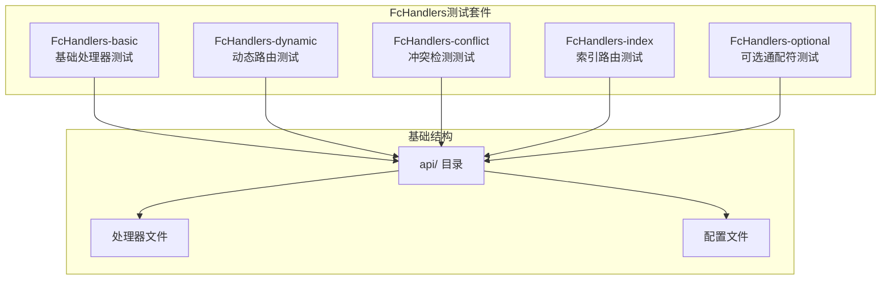

**图表来源**
- [FcHandlers-basic/README.md:1-13](file://FcHandlers-basic/README.md#L1-L13)
- [FcHandlers-dynamic/README.md:1-17](file://FcHandlers-dynamic/README.md#L1-L17)
- [FcHandlers-conflict/README.md:1-15](file://FcHandlers-conflict/README.md#L1-L15)
- [FcHandlers-index/README.md:1-9](file://FcHandlers-index/README.md#L1-L9)

每个项目都遵循统一的文件组织原则：
- 所有处理器文件位于`api/`目录下
- 使用标准的Node.js模块导出语法
- 包含必要的配置文件和README文档

**章节来源**
- [FcHandlers-basic/README.md:1-13](file://FcHandlers-basic/README.md#L1-L13)
- [FcHandlers-dynamic/README.md:1-17](file://FcHandlers-dynamic/README.md#L1-L17)
- [FcHandlers-conflict/README.md:1-15](file://FcHandlers-conflict/README.md#L1-L15)
- [FcHandlers-index/README.md:1-9](file://FcHandlers-index/README.md#L1-L9)

## 核心组件

FcHandlers系统的核心组件包括处理器文件、路由映射机制和构建打包流程。每个组件都有特定的功能和职责：

### 处理器类型分类

系统支持三种主要的处理器类型：

1. **经典Node.js处理器** (`api/foo.js`)
   - 使用`(req, res)`参数模式
   - 支持传统HTTP响应处理
   - 适用于需要精细控制响应头的场景

2. **Web Fetch处理器** (`api/health.js`)
   - 使用现代Fetch API风格
   - 返回Response对象
   - 符合Web标准接口

3. **命名HTTP方法处理器** (`api/items.js`)
   - 导出特定HTTP方法函数
   - 支持GET、POST等方法分离
   - 提供清晰的方法语义

### 路由映射规则

FcHandlers采用基于文件系统路径的自动路由映射机制：

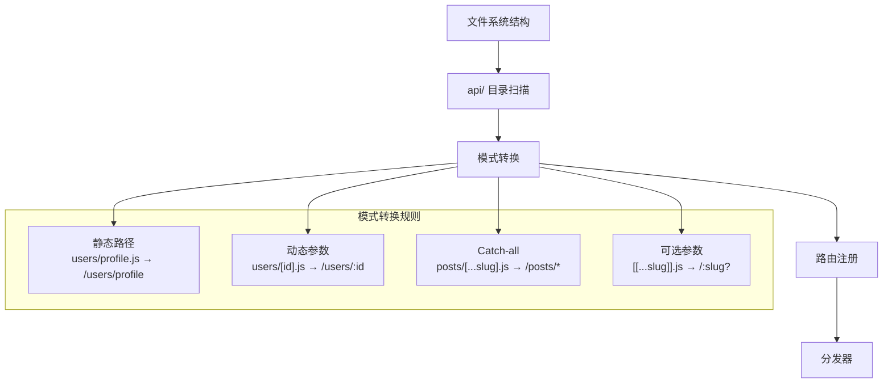

**图表来源**
- [FcHandlers-dynamic/README.md:9-16](file://FcHandlers-dynamic/README.md#L9-L16)
- [FcHandlers-basic/api/foo.js:1-6](file://FcHandlers-basic/api/foo.js#L1-L6)
- [FcHandlers-basic/api/health.js:1-7](file://FcHandlers-basic/api/health.js#L1-L7)
- [FcHandlers-basic/api/items.js:1-4](file://FcHandlers-basic/api/items.js#L1-L4)

**章节来源**
- [FcHandlers-basic/api/foo.js:1-6](file://FcHandlers-basic/api/foo.js#L1-L6)
- [FcHandlers-basic/api/health.js:1-7](file://FcHandlers-basic/api/health.js#L1-L7)
- [FcHandlers-basic/api/items.js:1-4](file://FcHandlers-basic/api/items.js#L1-L4)

## 架构概览

FcHandlers系统的整体架构采用分层设计，从文件系统扫描到最终的路由分发：

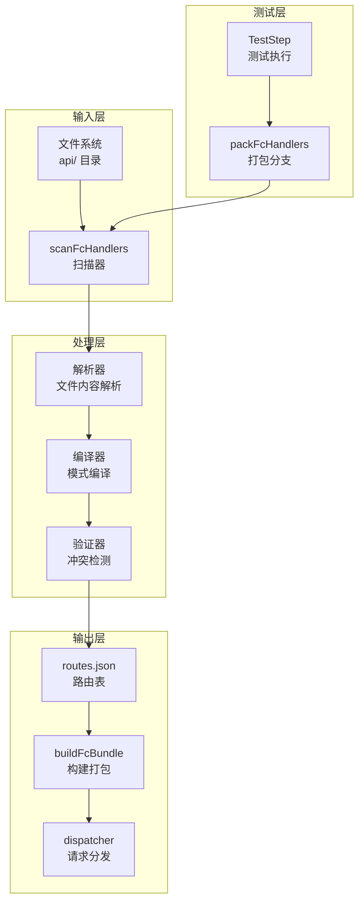

**图表来源**
- [FcHandlers-basic/README.md:9-12](file://FcHandlers-basic/README.md#L9-L12)
- [FcHandlers-conflict/README.md:10-14](file://FcHandlers-conflict/README.md#L10-L14)

系统的核心工作流程包括：

1. **文件扫描**：递归扫描api/目录下的所有处理器文件
2. **模式解析**：将文件路径转换为路由模式
3. **冲突检测**：验证路由模式的唯一性
4. **路由生成**：创建routes.json文件
5. **构建打包**：生成dispatcher启动文件

**章节来源**
- [FcHandlers-basic/README.md:9-12](file://FcHandlers-basic/README.md#L9-L12)
- [FcHandlers-conflict/README.md:10-14](file://FcHandlers-conflict/README.md#L10-L14)

## 详细组件分析

### 基础处理器组件分析

基础处理器组件验证了FcHandlers支持的三种基本处理器类型：

#### 处理器类图

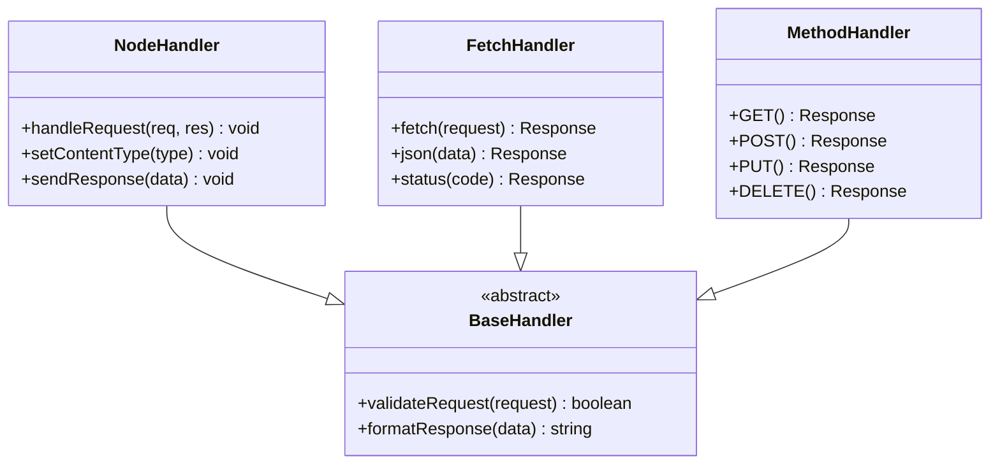

**图表来源**
- [FcHandlers-basic/api/foo.js:1-6](file://FcHandlers-basic/api/foo.js#L1-L6)
- [FcHandlers-basic/api/health.js:1-7](file://FcHandlers-basic/api/health.js#L1-L7)
- [FcHandlers-basic/api/items.js:1-4](file://FcHandlers-basic/api/items.js#L1-L4)

#### 基础处理器序列图

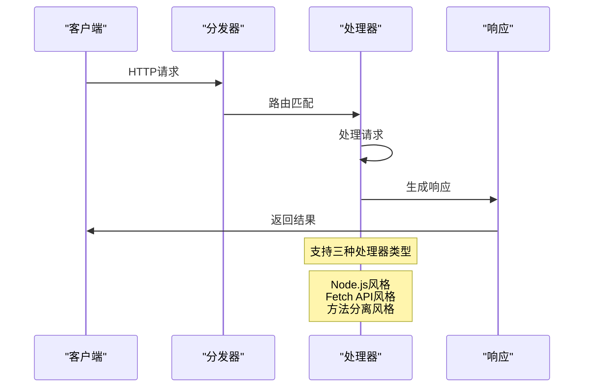

**图表来源**
- [FcHandlers-basic/README.md:9-12](file://FcHandlers-basic/README.md#L9-L12)

**章节来源**
- [FcHandlers-basic/README.md:1-13](file://FcHandlers-basic/README.md#L1-L13)
- [FcHandlers-basic/package.json:1-6](file://FcHandlers-basic/package.json#L1-L6)

### 动态路由组件分析

动态路由组件测试了FcHandlers对复杂路由模式的支持能力：

#### 动态路由类图

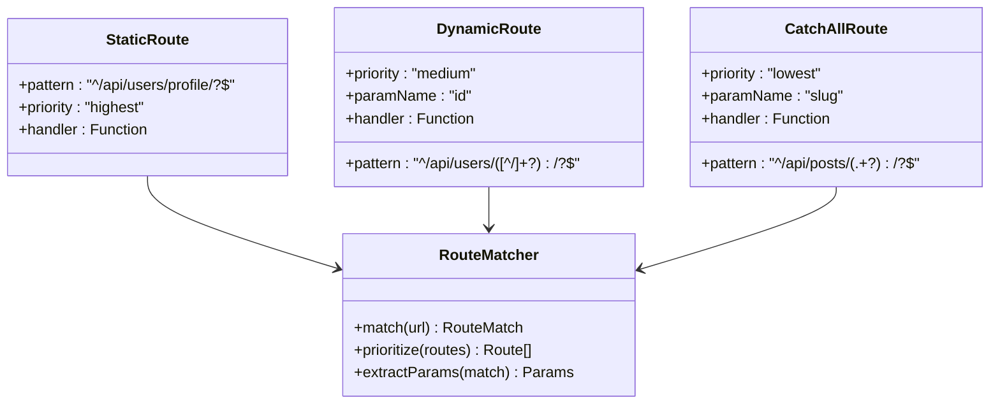

**图表来源**
- [FcHandlers-dynamic/README.md:12-16](file://FcHandlers-dynamic/README.md#L12-L16)
- [FcHandlers-dynamic/api/users/[id].js:1-7](file://FcHandlers-dynamic/api/users/[id].js#L1-L7)
- [FcHandlers-dynamic/api/users/profile.js:1-3](file://FcHandlers-dynamic/api/users/profile.js#L1-L3)
- [FcHandlers-dynamic/api/posts/[...slug].js:1-8](file://FcHandlers-dynamic/api/posts/[...slug].js#L1-L8)

#### 动态路由匹配流程

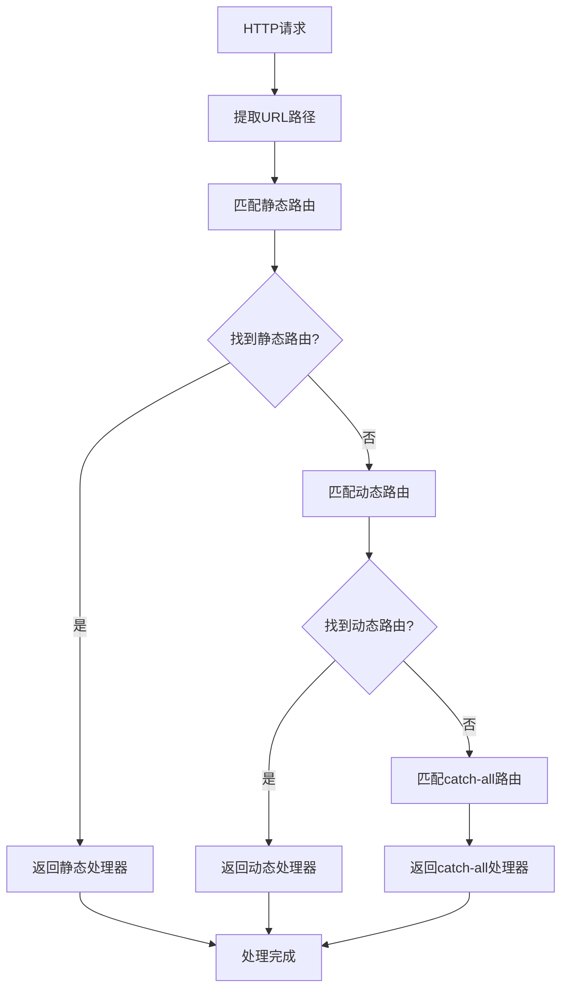

**图表来源**
- [FcHandlers-dynamic/README.md:12-16](file://FcHandlers-dynamic/README.md#L12-L16)

**章节来源**
- [FcHandlers-dynamic/README.md:1-17](file://FcHandlers-dynamic/README.md#L1-L17)
- [FcHandlers-dynamic/package.json:1-6](file://FcHandlers-dynamic/package.json#L1-L6)

### 路由冲突检测组件分析

路由冲突检测组件验证了FcHandlers的冲突检测机制：

#### 冲突检测流程图

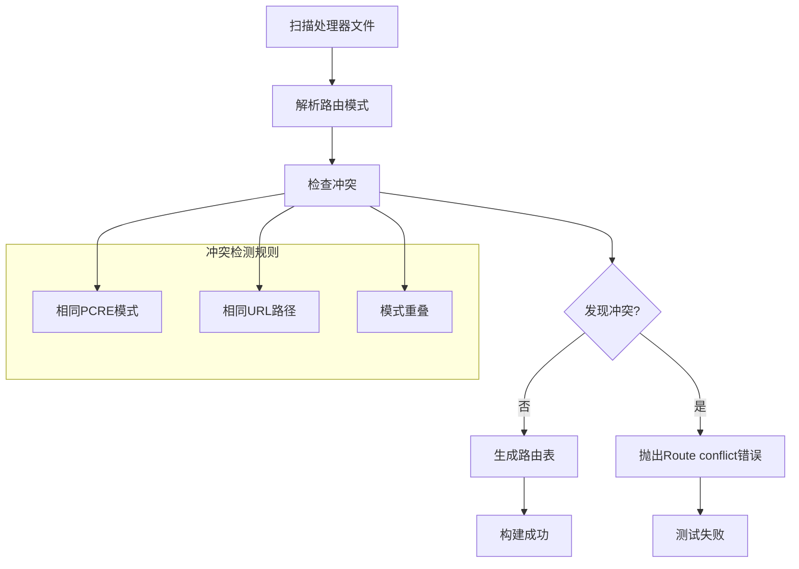

**图表来源**
- [FcHandlers-conflict/README.md:8-14](file://FcHandlers-conflict/README.md#L8-L14)
- [FcHandlers-conflict/api/[id].js:1-3](file://FcHandlers-conflict/api/[id].js#L1-L3)
- [FcHandlers-conflict/api/[name].js:1-3](file://FcHandlers-conflict/api/[name].js#L1-L3)

#### 冲突检测序列图

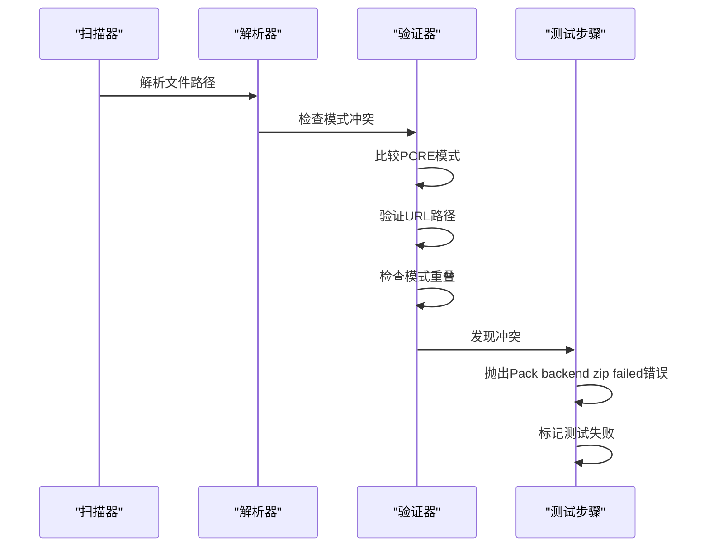

**图表来源**
- [FcHandlers-conflict/README.md:10-14](file://FcHandlers-conflict/README.md#L10-L14)

**章节来源**
- [FcHandlers-conflict/README.md:1-15](file://FcHandlers-conflict/README.md#L1-L15)
- [FcHandlers-conflict/package.json:1-6](file://FcHandlers-conflict/package.json#L1-L6)

### 索引路由组件分析

索引路由组件测试了FcHandlers对末尾index折叠的支持：

#### 索引路由映射

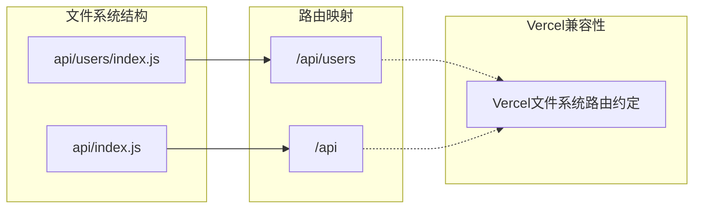

**图表来源**
- [FcHandlers-index/README.md:5-8](file://FcHandlers-index/README.md#L5-L8)

**章节来源**
- [FcHandlers-index/README.md:1-9](file://FcHandlers-index/README.md#L1-L9)

### 可选通配符组件分析

可选通配符组件验证了FcHandlers对可选参数的支持：

#### 可选通配符处理

可选通配符`[[...slug]]`的处理逻辑：
- 将`[[...slug]]`转换为可选的通配符参数
- 生成相应的路由模式
- 支持零个或多个参数值

**章节来源**
- [FcHandlers-optional/README.md:1-10](file://FcHandlers-optional/README.md#L1-L10)

## 依赖关系分析

FcHandlers项目的依赖关系相对简单，主要依赖于Node.js运行时环境：

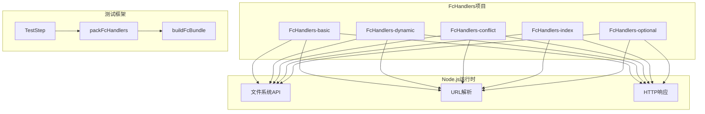

**图表来源**
- [FcHandlers-basic/package.json:1-6](file://FcHandlers-basic/package.json#L1-L6)
- [FcHandlers-dynamic/package.json:1-6](file://FcHandlers-dynamic/package.json#L1-L6)
- [FcHandlers-conflict/package.json:1-6](file://FcHandlers-conflict/package.json#L1-L6)

**章节来源**
- [FcHandlers-basic/package.json:1-6](file://FcHandlers-basic/package.json#L1-L6)
- [FcHandlers-dynamic/package.json:1-6](file://FcHandlers-dynamic/package.json#L1-L6)
- [FcHandlers-conflict/package.json:1-6](file://FcHandlers-conflict/package.json#L1-L6)

## 性能考虑

基于FcHandlers的测试场景，以下是相关的性能优化建议：

### 路由匹配优化

1. **静态路由优先级**
   - 静态路由具有最高优先级，应优先匹配
   - 减少不必要的模式匹配开销

2. **模式编译缓存**
   - 编译后的PCRE模式可以缓存复用
   - 避免重复编译相同模式

3. **参数提取优化**
   - 使用高效的正则表达式进行参数提取
   - 避免不必要的字符串操作

### 内存使用优化

1. **处理器实例化**
   - 处理器函数应该无状态设计
   - 避免在处理器中创建大型对象

2. **响应数据优化**
   - 使用流式响应处理大文件
   - 及时释放内存资源

### 并发处理

1. **异步处理**
   - 使用async/await处理异步操作
   - 避免阻塞主线程

2. **连接池管理**
   - 合理管理数据库连接
   - 使用连接池提高效率

## 故障排除指南

### 常见错误类型

#### 路由冲突错误

当两个或多个处理器编译为相同的URL模式时，系统会抛出路由冲突错误：

**错误特征**：
- 错误消息格式：`Pack backend zip failed: Route conflict: ...`
- 测试步骤标记为失败
- 冲突检测在构建阶段发生

**解决方法**：
1. 检查处理器文件的路径结构
2. 确保每个路由模式的唯一性
3. 使用不同的文件名或目录结构

#### 处理器格式错误

处理器文件必须符合特定的导出格式要求：

**检查清单**：
1. 确认使用正确的模块导出语法
2. 验证处理器函数签名
3. 检查响应格式是否正确

#### 路由模式编译错误

路由模式编译失败通常由以下原因引起：

**常见原因**：
1. 文件名包含非法字符
2. 路径结构不符合约定
3. 参数名称重复

**调试步骤**：
1. 查看编译后的routes.json文件
2. 验证PCRE模式的有效性
3. 检查路由优先级排序

**章节来源**
- [FcHandlers-conflict/README.md:10-14](file://FcHandlers-conflict/README.md#L10-L14)

### 测试验证方法

#### 基础处理器测试验证

1. **Node.js处理器验证**
   - 检查响应头设置
   - 验证JSON响应格式
   - 确认HTTP状态码正确

2. **Fetch处理器验证**
   - 验证Response对象创建
   - 检查JSON响应生成
   - 确认异步处理正确

3. **方法分离处理器验证**
   - 测试不同HTTP方法
   - 验证方法路由正确性
   - 检查状态码响应

#### 动态路由测试验证

1. **静态路由优先级验证**
   - 确认静态路由优先于动态路由
   - 验证路由匹配顺序
   - 检查优先级排序正确性

2. **动态参数提取验证**
   - 测试参数值提取
   - 验证参数类型转换
   - 检查参数默认值处理

3. **Catch-all路由验证**
   - 测试多段路径匹配
   - 验证参数数组生成
   - 检查路径分割处理

#### 冲突检测测试验证

1. **冲突识别验证**
   - 确认相同模式被识别为冲突
   - 验证错误消息格式
   - 检查测试失败标记

2. **构建流程验证**
   - 验证packFcHandlers分支
   - 确认buildFcBundle执行
   - 检查dispatcher生成

**章节来源**
- [FcHandlers-basic/README.md:9-12](file://FcHandlers-basic/README.md#L9-L12)
- [FcHandlers-dynamic/README.md:9-16](file://FcHandlers-dynamic/README.md#L9-L16)
- [FcHandlers-conflict/README.md:10-14](file://FcHandlers-conflict/README.md#L10-L14)

## 结论

FcHandlers系列项目为无服务器函数处理器提供了全面的测试覆盖，验证了从基础处理器到高级路由特性的完整功能集。通过这五个独立的测试场景，系统展示了：

1. **基础功能完整性**：支持多种处理器类型和路由模式
2. **路由智能性**：具备冲突检测和优先级排序能力
3. **兼容性**：与Vercel文件系统路由约定保持一致
4. **可靠性**：通过严格的测试确保构建流程稳定

这些测试场景为FcHandlers的实际应用提供了坚实的基础，确保在生产环境中能够可靠地处理各种路由需求。建议在实际部署前，根据具体业务需求对这些测试场景进行扩展和定制。