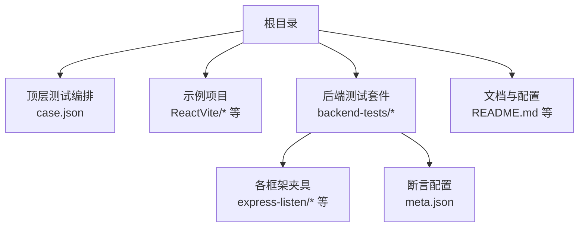
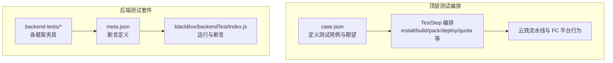
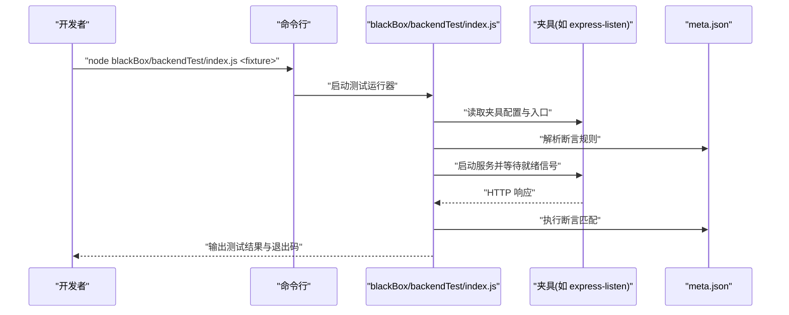
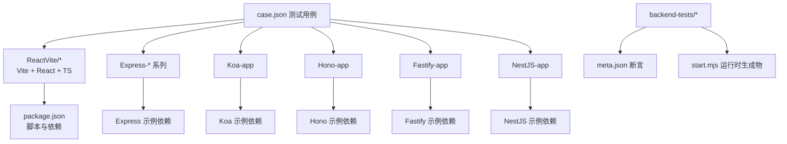

# 开发环境搭建

<cite>
**本文档引用的文件**
- [README.md](file://README.md)
- [case.json](file://case.json)
- [backend-tests/README.md](file://backend-tests/README.md)
- [ReactVite/package.json](file://ReactVite/package.json)
- [ReactVite/eslint.config.js](file://ReactVite/eslint.config.js)
- [ReactVite/vite.config.ts](file://ReactVite/vite.config.ts)
- [ReactVite/tsconfig.json](file://ReactVite/tsconfig.json)
- [ReactVite/.gitignore](file://ReactVite/.gitignore)
- [ReactVite-without-esajsonc/package.json](file://ReactVite-without-esajsonc/package.json)
- [ReactVite-without-esajsonc/pnpm-workspace.yaml](file://ReactVite-without-esajsonc/pnpm-workspace.yaml)
- [backend-tests/express-listen/meta.json](file://backend-tests/express-listen/meta.json)
- [Express-disambig/package.json](file://Express-disambig/package.json)
- [NestJS-app/package.json](file://NestJS-app/package.json)
</cite>

## 目录
1. [简介](#简介)
2. [项目结构](#项目结构)
3. [核心组件](#核心组件)
4. [架构总览](#架构总览)
5. [详细组件分析](#详细组件分析)
6. [依赖关系分析](#依赖关系分析)
7. [性能考虑](#性能考虑)
8. [故障排除指南](#故障排除指南)
9. [结论](#结论)
10. [附录](#附录)

## 简介
本指南面向开发者，帮助你在本地快速搭建并运行该测试仓库的开发与测试环境。内容涵盖：
- 本地开发环境配置要求：Node.js 版本、包管理器选择与依赖安装
- IDE 配置建议：VS Code 插件、代码格式化与调试配置
- 测试环境设置：单个测试用例运行、批量执行与结果查看
- Git 钩子与代码质量检查工具配置
- 开发工作流程最佳实践：分支管理、提交规范与测试驱动开发方法

## 项目结构
该仓库是一个多框架/多场景的测试集合，包含前端示例、后端框架示例以及专门的后端运行时验证测试套件。顶层通过 case.json 统一编排测试步骤与期望结果，backend-tests 目录提供针对框架生成物的黑盒验证。

图表来源
- [README.md:1-31](file://README.md#L1-L31)
- [case.json:1-603](file://case.json#L1-L603)
- [backend-tests/README.md:18-28](file://backend-tests/README.md#L18-L28)

章节来源
- [README.md:1-31](file://README.md#L1-L31)
- [case.json:1-603](file://case.json#L1-L603)
- [backend-tests/README.md:18-28](file://backend-tests/README.md#L18-L28)

## 核心组件
- 顶层测试编排：通过 case.json 定义测试用例、期望状态与日志断言，覆盖多种包管理器、Node 版本与工程形态。
- 示例项目：包含 Vite + React + TypeScript、Express/Koa/Hono/Fastify/NestJS 等后端示例，以及前后端混合示例。
- 后端测试套件：backend-tests 提供对 framework-checker 生成物的黑盒验证，确保生成的 start.mjs 能在本地正确响应 HTTP 请求。

章节来源
- [README.md:1-31](file://README.md#L1-L31)
- [backend-tests/README.md:1-133](file://backend-tests/README.md#L1-L133)

## 架构总览
下图展示了从测试用例到具体执行与断言的整体流程，包括顶层编排与后端测试套件两条主线。

图表来源
- [README.md:1-31](file://README.md#L1-L31)
- [backend-tests/README.md:94-110](file://backend-tests/README.md#L94-L110)

章节来源
- [README.md:1-31](file://README.md#L1-L31)
- [backend-tests/README.md:94-110](file://backend-tests/README.md#L94-L110)

## 详细组件分析

### 本地开发环境配置要求
- Node.js 版本
  - 仓库示例覆盖了不同 Node 版本场景，包括引擎声明与显式指定版本的用例。建议在本地准备可切换的 Node 版本管理工具（如 nvm 或 asdf），以便快速在不同版本间切换进行验证。
  - 参考用例涉及的 Node 版本与引擎字段出现在多个示例中，可据此在本地安装对应版本进行测试。
- 包管理器选择与依赖安装
  - 顶层测试用例覆盖了多种包管理器（npm、yarn、pnpm、cnpm、bun），可在本地按需安装并验证。
  - 示例项目中部分工程未包含 esa.jsonc，因此需要通过命令行参数或环境变量指定安装与构建命令。
  - pnpm 工作区示例展示了禁用某些构建工具的行为，便于理解不同包管理器的差异。

章节来源
- [case.json:14-121](file://case.json#L14-L121)
- [case.json:56-69](file://case.json#L56-L69)
- [ReactVite-without-esajsonc/pnpm-workspace.yaml:1-3](file://ReactVite-without-esajsonc/pnpm-workspace.yaml#L1-L3)

### IDE 配置建议（VS Code）
- 插件推荐
  - TypeScript/JavaScript 支持：TypeScript TSServer、ESLint、Prettier
  - React 开发：React Developer Tools（浏览器扩展）
  - Git 工具：GitLens、Git History
  - 格式化与 Lint：ESLint（已内置在示例项目中）、prettier-vscode
- 代码格式化规则
  - ESLint 配置位于示例项目的根目录，采用 TypeScript ESLint 推荐规则与 React Hooks、React Refresh 插件。
  - 建议在 VS Code 中启用“保存时自动格式化”，并在工作区设置中配置默认 formatter 为 ESLint。
- 调试配置
  - Vite 项目可通过 VS Code 的 JavaScript 调试器附加到 Vite Dev Server。
  - 后端测试套件可使用 Node 调试器附加到 blackBox/backendTest/index.js，结合 meta.json 中的断言进行断点调试。

章节来源
- [ReactVite/eslint.config.js:1-24](file://ReactVite/eslint.config.js#L1-L24)
- [ReactVite/vite.config.ts:1-8](file://ReactVite/vite.config.ts#L1-L8)
- [ReactVite/.gitignore:15-25](file://ReactVite/.gitignore#L15-L25)

### 测试环境设置
- 运行单个测试用例
  - 顶层测试：在 backend-tests 目录下，通过传入夹具名称运行特定框架的测试。
  - 后端测试套件：使用 Node 运行 blackBox/backendTest/index.js，并传入夹具名称。
- 批量执行测试
  - 可在 backend-tests 目录下循环安装依赖并批量运行所有夹具。
- 查看测试结果
  - 退出码为 0 表示所有非跳过的夹具断言均通过；否则至少有一个夹具断言失败或启动失败。
  - 断言失败会输出详细的失败清单，便于定位问题。

图表来源
- [backend-tests/README.md:94-110](file://backend-tests/README.md#L94-L110)
- [backend-tests/express-listen/meta.json:1-36](file://backend-tests/express-listen/meta.json#L1-L36)

章节来源
- [backend-tests/README.md:94-110](file://backend-tests/README.md#L94-L110)
- [backend-tests/express-listen/meta.json:1-36](file://backend-tests/express-listen/meta.json#L1-L36)

### Git 钩子与代码质量检查工具
- Git 钩子
  - 建议在本地安装 pre-commit 钩子，用于在提交前自动运行 ESLint 与格式化检查，减少 CI 失败概率。
  - 可结合 husky 与 lint-staged 实现按需检查与修复。
- 代码质量检查
  - 仓库内已提供 ESLint 配置与规则，建议在本地与 CI 中保持一致的规则集。
  - 可结合 editorconfig 与 Prettier 统一团队代码风格。

章节来源
- [ReactVite/eslint.config.js:1-24](file://ReactVite/eslint.config.js#L1-L24)
- [ReactVite/.gitignore:1-25](file://ReactVite/.gitignore#L1-L25)

### 开发工作流程最佳实践
- 分支管理
  - 使用功能分支开发特性，遵循清晰的命名规范（如 feature/xxx、fix/xxx）。
  - 在合并前进行自测与格式化检查，确保提交质量。
- 提交规范
  - 使用简短明确的提交信息，描述变更目的与影响范围。
  - 如涉及测试用例更新，同步更新 case.json 与相关断言。
- 测试驱动开发（TDD）
  - 在新增功能前先编写测试用例，确保用例能够覆盖关键路径与边界条件。
  - 通过后端测试套件验证生成物的正确性，保证框架识别与运行时行为符合预期。

章节来源
- [README.md:1-31](file://README.md#L1-L31)
- [backend-tests/README.md:117-133](file://backend-tests/README.md#L117-L133)

## 依赖关系分析
下图展示了示例项目与后端测试夹具之间的依赖关系，以及测试用例对不同包管理器与 Node 版本的覆盖情况。

图表来源
- [ReactVite/package.json:1-30](file://ReactVite/package.json#L1-L30)
- [Express-disambig/package.json:1-9](file://Express-disambig/package.json#L1-L9)
- [NestJS-app/package.json:1-13](file://NestJS-app/package.json#L1-L13)
- [backend-tests/README.md:18-28](file://backend-tests/README.md#L18-L28)
- [case.json:14-121](file://case.json#L14-L121)

章节来源
- [ReactVite/package.json:1-30](file://ReactVite/package.json#L1-L30)
- [Express-disambig/package.json:1-9](file://Express-disambig/package.json#L1-L9)
- [NestJS-app/package.json:1-13](file://NestJS-app/package.json#L1-L13)
- [backend-tests/README.md:18-28](file://backend-tests/README.md#L18-L28)
- [case.json:14-121](file://case.json#L14-L121)

## 性能考虑
- 依赖安装优化
  - 在本地开发时优先使用与 CI 一致的包管理器，减少锁文件差异导致的构建问题。
  - 对于 pnpm，可利用其链接策略提升安装速度；对于大型项目可考虑启用缓存与并行安装。
- 构建与预览
  - Vite 的 dev server 启动速度快，适合本地开发；生产构建时注意分析产物体积与依赖拆分。
- 测试执行效率
  - 后端测试套件单夹具秒级执行，适合频繁回归；建议在本地开启增量构建与热重载。

## 故障排除指南
- 无法找到 package.json 或 installCommand 为空
  - 现象：安装阶段跳过或失败。
  - 处理：确保项目根目录存在 package.json，或通过命令行参数提供 installCommand。
- Node 版本不满足引擎要求
  - 现象：提示切换到指定版本。
  - 处理：使用版本管理工具安装并切换到要求的 Node 版本。
- 资源配额超限
  - 现象：zip 大小、文件数量或单文件大小超过限制。
  - 处理：优化产物体积与结构，移除不必要的依赖与资源。
- 后端路由冲突
  - 现象：/api 下存在同路径的不同处理器导致冲突。
  - 处理：调整文件命名或路径设计，确保唯一映射。

章节来源
- [case.json:134-145](file://case.json#L134-L145)
- [case.json:189-200](file://case.json#L189-L200)
- [case.json:393-408](file://case.json#L393-L408)

## 结论
通过本指南，你可以在本地完成多框架、多场景的开发与测试环境搭建。建议优先使用与 CI 一致的工具链与版本，配合 ESLint、pre-commit 钩子与后端测试套件，形成高效的本地开发与回归流程。

## 附录
- 常用命令速查
  - 安装依赖：根据项目类型选择 npm/yarn/pnpm/bun
  - 启动开发服务器：Vite 项目使用 dev 脚本
  - 运行后端测试：node blackBox/backendTest/index.js <fixture>
  - 批量安装后端夹具依赖：在 backend-tests 目录下循环执行安装

章节来源
- [backend-tests/README.md:94-110](file://backend-tests/README.md#L94-L110)
- [ReactVite/package.json:6-11](file://ReactVite/package.json#L6-L11)