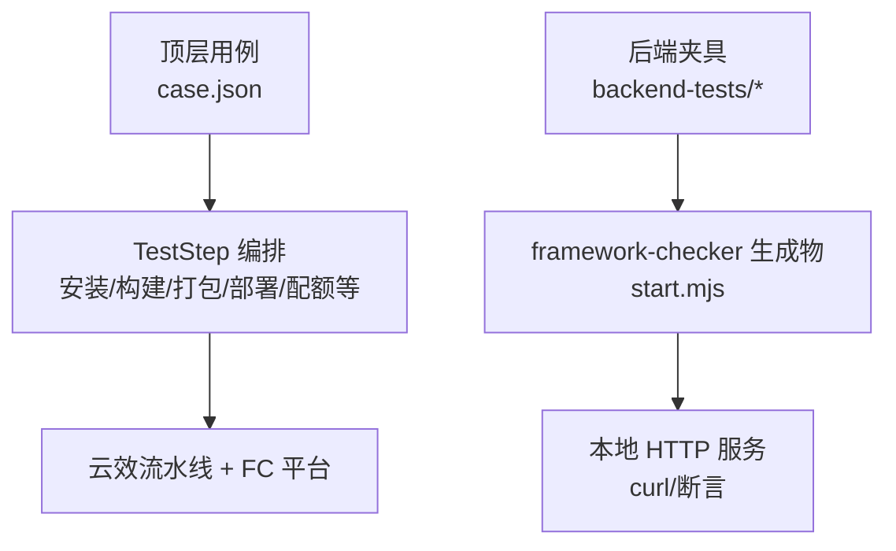
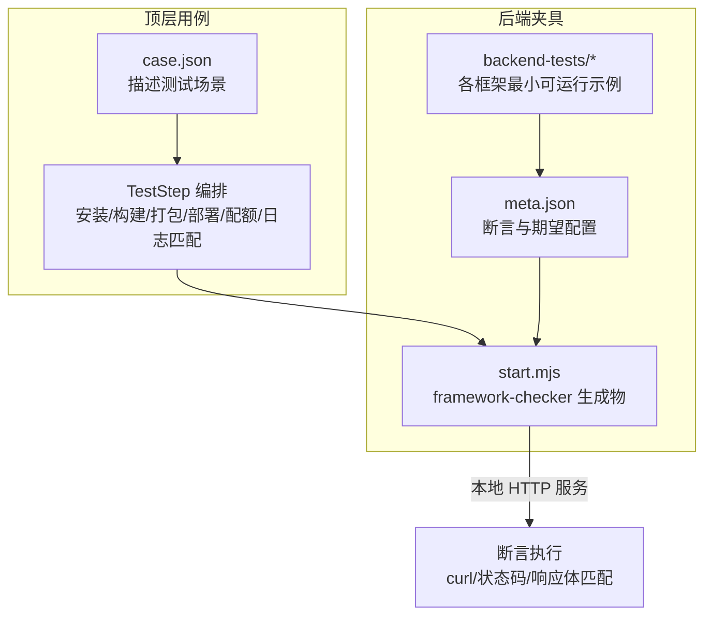
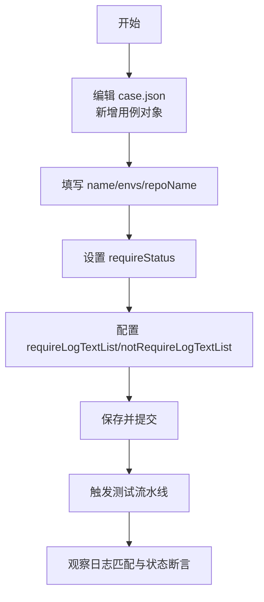
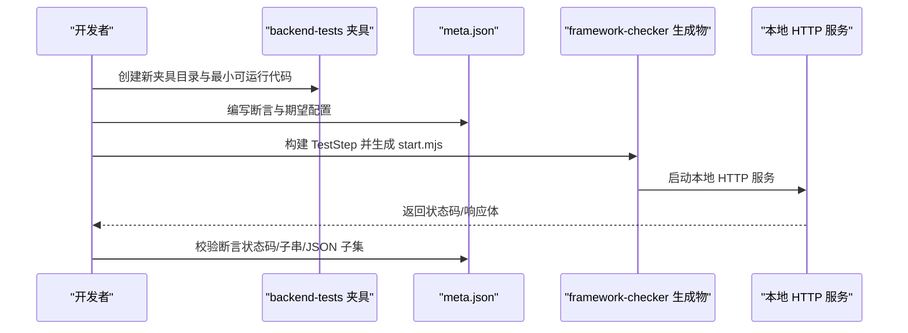
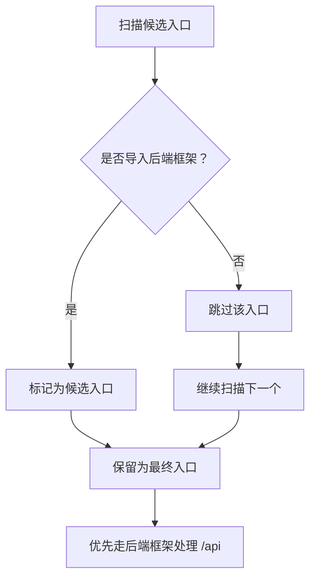
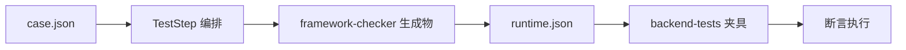

# 开发者指南

<cite>
**本文引用的文件**
- [README.md](file://README.md)
- [case.json](file://case.json)
- [backend-tests/README.md](file://backend-tests/README.md)
- [backend-tests/express-listen/meta.json](file://backend-tests/express-listen/meta.json)
- [backend-tests/express-export/meta.json](file://backend-tests/express-export/meta.json)
- [backend-tests/nuxt/meta.json](file://backend-tests/nuxt/meta.json)
- [backend-tests/nuxt/package.json](file://backend-tests/nuxt/package.json)
- [Express-disambig/server.js](file://Express-disambig/server.js)
- [Express-with-api/server.js](file://Express-with-api/server.js)
- [FcHandlers-basic/api/foo.js](file://FcHandlers-basic/api/foo.js)
</cite>

## 目录
1. [简介](#简介)
2. [项目结构](#项目结构)
3. [核心组件](#核心组件)
4. [架构总览](#架构总览)
5. [详细组件分析](#详细组件分析)
6. [依赖关系分析](#依赖关系分析)
7. [性能考虑](#性能考虑)
8. [故障排除指南](#故障排除指南)
9. [结论](#结论)
10. [附录](#附录)

## 简介
本指南面向希望参与测试框架开发与扩展的工程师，涵盖以下主题：
- 如何新增测试用例
- 如何扩展框架支持（添加新框架的后端测试夹具）
- 如何调试构建问题与进行故障排除
- 最佳实践与开发规范
- 项目的扩展机制与“夹具”测试体系
- 代码贡献流程、测试编写规范与文档更新流程
- 完整的开发环境搭建与调试工具使用

## 项目结构
该项目采用“用例驱动 + 夹具验证”的双层测试体系：
- 顶层用例：通过 case.json 描述测试场景，验证从安装、构建、打包到部署的全流程行为。
- 后端夹具：在 backend-tests 目录下，针对每个受支持的后端框架提供最小可运行示例与断言，验证 framework-checker 生成的运行时产物是否能在本地正确响应 HTTP。

图表来源
- [README.md:1-31](file://README.md#L1-L31)
- [backend-tests/README.md:1-133](file://backend-tests/README.md#L1-L133)

章节来源
- [README.md:1-31](file://README.md#L1-L31)
- [backend-tests/README.md:1-133](file://backend-tests/README.md#L1-L133)

## 核心组件
- 顶层用例引擎（case.json）
  - 通过 JSON 描述测试场景，包括环境变量覆盖、仓库名、期望状态、日志关键字等。
  - 支持正则表达式风格的日志匹配，便于验证构建过程中的关键步骤与结果。
- 后端夹具（backend-tests）
  - 每个框架一个夹具目录，包含最小可运行的入口文件、依赖声明与断言元数据。
  - 通过 meta.json 定义期望的框架识别、运行模式、端口、断言集合以及可选的启动/关闭超时、readySignal 等。
- 示例项目（Express-disambig、Express-with-api、FcHandlers-basic 等）
  - 提供真实框架的最小实现样例，用于验证框架检测、入口解析、路由打包等行为。

章节来源
- [case.json:1-603](file://case.json#L1-L603)
- [backend-tests/README.md:18-84](file://backend-tests/README.md#L18-L84)
- [backend-tests/express-listen/meta.json:1-36](file://backend-tests/express-listen/meta.json#L1-L36)
- [backend-tests/express-export/meta.json:1-14](file://backend-tests/express-export/meta.json#L1-L14)
- [backend-tests/nuxt/meta.json:1-14](file://backend-tests/nuxt/meta.json#L1-L14)

## 架构总览
下图展示了“用例驱动测试”与“夹具验证”的交互关系与职责边界：

图表来源
- [README.md:1-31](file://README.md#L1-L31)
- [backend-tests/README.md:1-133](file://backend-tests/README.md#L1-L133)

## 详细组件分析

### 用例管理与新增流程
- 新增用例步骤
  - 在 case.json 中追加一个用例对象，设置 name、envs、repoName、requireStatus、requireLogTextList 等字段。
  - envs 支持使用占位符如 $RANDOM，部分场景需提供 RootDirectory 指向示例项目根。
  - requireStatus 支持 SUCCESS、FAIL、CANCEL；requireLogTextList 支持正则表达式风格的关键字匹配。
- 参数说明
  - name：测试用例名称，用于结果展示。
  - envs：环境变量覆盖，支持特殊占位符与 JSON 字符串。
  - repoName：仓库名，空字符串通常表示创建新仓库。
  - requireStatus：期望的构建结果状态。
  - requireLogTextList/notRequireLogTextList：对构建日志中出现/不出现的关键字进行断言。

图表来源
- [README.md:21-31](file://README.md#L21-L31)
- [case.json:1-603](file://case.json#L1-L603)

章节来源
- [README.md:21-31](file://README.md#L21-L31)
- [case.json:1-603](file://case.json#L1-L603)

### 后端夹具：新增框架支持
- 目录约定
  - backend-tests/<framework-slug>-<flavor>/，例如 express-listen、express-export、nestjs-bootstrap 等。
  - 每个夹具包含：package.json（含目标框架依赖）、入口文件（如 server.js/app.js）、meta.json（断言与期望配置）。
- meta.json 字段说明
  - 必填：name、framework、mode、port、assertions。
  - 可选：entry、warmupTimeoutMs、shutdownTimeoutMs、readySignal、skip、skipReason。
  - mode 支持 direct、fc-handlers、spawn；spawn 模式需提供 spawnCommand。
  - includeFiles/includeDirs 可用于兜底包含额外文件或目录（如 egg/midway 动态加载场景）。
- 断言规则
  - expectedStatus 必须严格相等。
  - bodyContains 子串匹配（区分大小写）。
  - bodyJsonSubset 验证响应体 JSON 包含指定字段（响应可包含更多字段）。
  - 任一断言失败即整夹具失败；同一夹具内其它断言仍会继续执行以收集完整失败清单。
- 运行方式
  - 批量安装：遍历 backend-tests 下所有夹具执行 npm install。
  - 单夹具运行：在 TestStep 构建完成后，执行 blackBox 后端测试入口。
  - 接入主流程：blackBox 入口会自动调用后端测试。

图表来源
- [backend-tests/README.md:38-110](file://backend-tests/README.md#L38-L110)
- [backend-tests/express-listen/meta.json:1-36](file://backend-tests/express-listen/meta.json#L1-L36)
- [backend-tests/express-export/meta.json:1-14](file://backend-tests/express-export/meta.json#L1-L14)
- [backend-tests/nuxt/meta.json:1-14](file://backend-tests/nuxt/meta.json#L1-L14)

章节来源
- [backend-tests/README.md:18-133](file://backend-tests/README.md#L18-L133)
- [backend-tests/express-listen/meta.json:1-36](file://backend-tests/express-listen/meta.json#L1-L36)
- [backend-tests/express-export/meta.json:1-14](file://backend-tests/express-export/meta.json#L1-L14)
- [backend-tests/nuxt/meta.json:1-14](file://backend-tests/nuxt/meta.json#L1-L14)

### 示例项目：入口解析与路由识别
- Express 入口歧义消除
  - Express-disambig 目录演示了当存在多个候选入口时，如何通过 import 正则校验精准选择真正导入框架的入口文件。
- Express 与 /api 目录共存
  - Express-with-api 展示了当项目同时具备后端框架入口与 /api 函数计算处理器时，优先走后端框架处理路由。
- 纯 /api 处理器
  - FcHandlers-basic 展示了在无后端框架的情况下，自动识别 /api 下的处理器文件并打包为 FC handlers。

图表来源
- [Express-disambig/server.js:1-7](file://Express-disambig/server.js#L1-L7)
- [Express-with-api/server.js:1-5](file://Express-with-api/server.js#L1-L5)
- [FcHandlers-basic/api/foo.js:1-6](file://FcHandlers-basic/api/foo.js#L1-L6)

章节来源
- [Express-disambig/server.js:1-7](file://Express-disambig/server.js#L1-L7)
- [Express-with-api/server.js:1-5](file://Express-with-api/server.js#L1-L5)
- [FcHandlers-basic/api/foo.js:1-6](file://FcHandlers-basic/api/foo.js#L1-L6)

### Nuxt 元框架适配
- Nuxt 项目通过 meta-runtime 适配而非 nft trace，meta.json 中 mode 为 meta，并提供较长的 warmupTimeoutMs。
- 断言覆盖健康检查、用户路由与回显接口，确保 meta-runtime pack 成功。

章节来源
- [backend-tests/nuxt/meta.json:1-14](file://backend-tests/nuxt/meta.json#L1-L14)
- [backend-tests/nuxt/package.json:1-13](file://backend-tests/nuxt/package.json#L1-L13)

## 依赖关系分析
- 顶层用例与后端夹具的职责分离
  - 顶层用例关注端到端流程与平台行为；后端夹具关注 framework-checker 生成物的“能跑性”与断言。
- 夹具与框架生态
  - 每个 framework-slug 至少一个基础夹具，多 flavor 各自独立夹具。
  - 通过 meta.json 的 includeFiles/includeDirs 解决动态加载场景下的静态追踪遗漏。

图表来源
- [README.md:1-31](file://README.md#L1-L31)
- [backend-tests/README.md:1-133](file://backend-tests/README.md#L1-L133)

章节来源
- [README.md:1-31](file://README.md#L1-L31)
- [backend-tests/README.md:1-133](file://backend-tests/README.md#L1-L133)

## 性能考虑
- 用例粒度与耗时
  - 顶层 case.json 的单用例耗时通常为分钟级（涉及云效流水线与部署）。
  - 后端夹具单夹具耗时为秒级（全程本地 loopback），适合快速回归与生成物验证。
- 断言设计
  - 将断言拆分为多个独立请求，有助于快速定位失败点；同一夹具内断言并发执行以缩短总耗时。
- 资源与配额
  - 通过 ZipSizeQuota、FileCountQuota、FileSizeQuota 等参数验证资源限制与错误提示，避免不必要的构建与打包。

## 故障排除指南
- 用例层面
  - 日志关键字缺失：检查 requireLogTextList 是否与实际日志一致，注意大小写与正则表达式语法。
  - 期望状态不符：核对 requireStatus 与实际构建结果；必要时使用 notRequireLogTextList 排除干扰。
  - 环境变量问题：确认 envs 中的占位符与特殊键（如 RootDirectory、EnvironmentVariables）是否正确。
- 夹具层面
  - 启动失败：检查 warmupTimeoutMs、readySignal 是否合理；确认端口未被占用。
  - 断言失败：逐条断言排查，优先检查 expectedStatus；对 JSON 响应使用 bodyJsonSubset 精确定位字段缺失。
  - 动态加载遗漏：在 meta.json 中使用 includeFiles/includeDirs 将动态加载所需文件纳入 nft 文件列表。
- 平台与部署
  - 若云效流水线报错，优先查看日志匹配是否准确；若本地夹具通过而线上失败，重点排查平台特定配置（如 CDN、运行时版本）。

章节来源
- [backend-tests/README.md:86-116](file://backend-tests/README.md#L86-L116)
- [backend-tests/README.md:126-133](file://backend-tests/README.md#L126-L133)

## 结论
本项目通过“用例驱动 + 夹具验证”的双轨测试体系，既保证了端到端流程的稳定性，又确保了 framework-checker 生成物的可运行性与正确性。新增测试用例与扩展框架支持的核心在于：用例的清晰描述与日志匹配、夹具的最小可运行性与完备断言。遵循本文档的最佳实践与开发规范，可显著提升开发效率与质量。

## 附录

### 开发环境搭建
- 安装依赖
  - 在 backend-tests 下批量安装各夹具依赖。
- 构建与运行
  - 在 TestStep 仓库中执行构建，然后运行 blackBox 后端测试入口；可按夹具名称筛选运行。
- 文档与提交
  - 新增用例与夹具时，同步更新相关 README 或注释，保持文档一致性。

章节来源
- [backend-tests/README.md:94-110](file://backend-tests/README.md#L94-L110)

### 代码贡献指南
- 新增用例
  - 在 case.json 中追加用例，确保 envs、requireStatus、requireLogTextList 设置合理。
- 新增夹具
  - 在 backend-tests 下创建新目录，编写最小可运行入口与断言元数据，确保本地可运行并通过断言。
- 提交规范
  - 保持用例与夹具的最小化与可复现性；必要时附带说明文档或变更记录。

章节来源
- [backend-tests/README.md:117-125](file://backend-tests/README.md#L117-L125)
- [README.md:1-31](file://README.md#L1-L31)