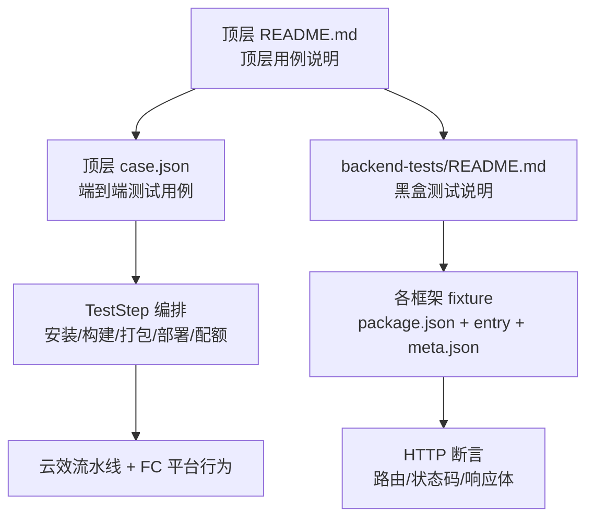
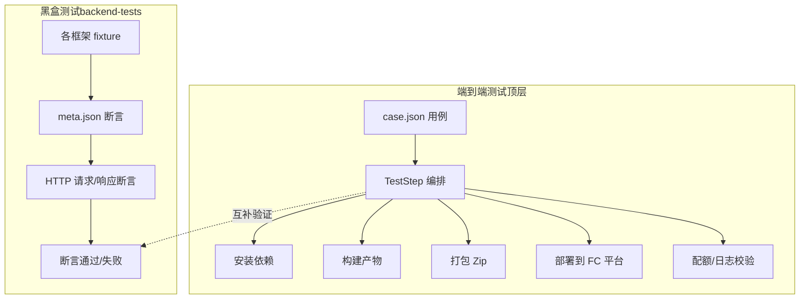
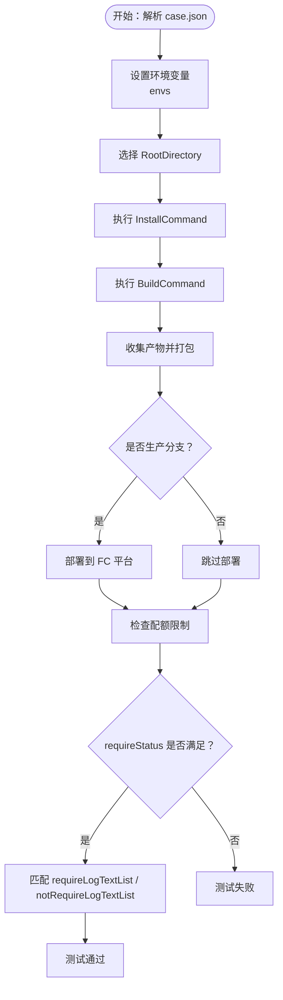
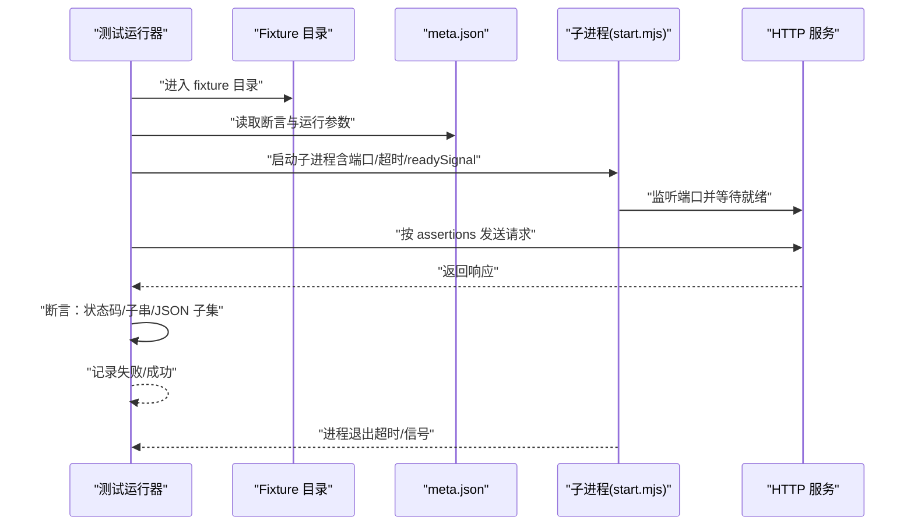
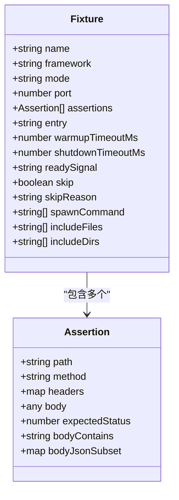
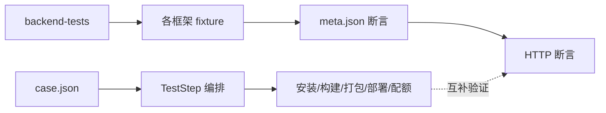

# 框架扩展支持

<cite>
**本文引用的文件**
- [README.md](file://README.md)
- [case.json](file://case.json)
- [backend-tests/README.md](file://backend-tests/README.md)
- [backend-tests/express-listen/meta.json](file://backend-tests/express-listen/meta.json)
- [backend-tests/express-export/meta.json](file://backend-tests/express-export/meta.json)
- [backend-tests/fastify/meta.json](file://backend-tests/fastify/meta.json)
- [backend-tests/nuxt/meta.json](file://backend-tests/nuxt/meta.json)
- [backend-tests/nestjs/meta.json](file://backend-tests/nestjs/meta.json)
- [backend-tests/koa/meta.json](file://backend-tests/koa/meta.json)
- [backend-tests/hono/meta.json](file://backend-tests/hono/meta.json)
- [backend-tests/node/meta.json](file://backend-tests/node/meta.json)
- [Express-disambig/package.json](file://Express-disambig/package.json)
- [Express-with-api/package.json](file://Express-with-api/package.json)
- [Fastify-app/package.json](file://Fastify-app/package.json)
- [Nuxt-app/package.json](file://Nuxt-app/package.json)
- [ReactVite/package.json](file://ReactVite/package.json)
</cite>

## 目录
1. [简介](#简介)
2. [项目结构](#项目结构)
3. [核心组件](#核心组件)
4. [架构总览](#架构总览)
5. [详细组件分析](#详细组件分析)
6. [依赖分析](#依赖分析)
7. [性能考虑](#性能考虑)
8. [故障排查指南](#故障排查指南)
9. [结论](#结论)
10. [附录](#附录)

## 简介
本指南面向希望为新后端或前端框架添加测试支持的开发者，系统阐述以下内容：
- 如何基于现有测试体系进行框架检测、构建流程适配与测试套件集成
- 如何创建符合规范的 fixture 项目（文件结构、配置、测试脚本）
- 如何设计框架特定的测试场景（路由、中间件、静态资源等）
- 如何处理框架的特殊配置与依赖关系，并验证框架正确集成

本仓库提供了两类测试：
- 顶层端到端测试：通过 case.json 驱动 TestStep 编排、安装、构建、打包、部署与配额等全流程验证
- 后端黑盒测试：在本地对 framework-checker 生成的可执行产物进行 HTTP 路由与响应断言，确保“框架能在本机跑起来并正确响应”

## 项目结构
仓库采用“功能/框架”组织方式，包含大量最小可运行的 fixture 示例，覆盖主流后端框架与前端工程化场景。关键目录与文件如下：
- 顶层测试编排与用例：README.md、case.json
- 后端测试套件：backend-tests/README.md 及各框架的 fixture 目录与断言配置
- 各框架最小可运行示例：Express-*、Fastify-app、Nuxt-app、ReactVite* 等

**图表来源**
- [README.md:1-31](file://README.md#L1-L31)
- [case.json:1-603](file://case.json#L1-L603)
- [backend-tests/README.md:1-133](file://backend-tests/README.md#L1-L133)

**章节来源**
- [README.md:1-31](file://README.md#L1-L31)
- [case.json:1-603](file://case.json#L1-L603)
- [backend-tests/README.md:1-133](file://backend-tests/README.md#L1-L133)

## 核心组件
- 顶层端到端测试用例（case.json）
  - 描述测试目标、环境变量、期望状态与日志关键字
  - 支持多种安装器（npm/yarn/pnpm/bun/cnpm）、引擎版本、部署分支、配额限制等参数
- 后端黑盒测试（backend-tests）
  - 每个框架一个 fixture，包含最小可运行的入口文件与依赖声明
  - 通过 meta.json 定义断言规则（HTTP 方法、路径、期望状态码、响应体片段等）
  - 提供统一的运行脚本与退出码约定，便于接入 CI

**章节来源**
- [case.json:1-603](file://case.json#L1-L603)
- [backend-tests/README.md:1-133](file://backend-tests/README.md#L1-L133)

## 架构总览
下图展示了从“用例驱动”到“黑盒断言”的两条主线，以及它们之间的互补关系。

**图表来源**
- [case.json:1-603](file://case.json#L1-L603)
- [backend-tests/README.md:1-133](file://backend-tests/README.md#L1-L133)

## 详细组件分析

### 1) 顶层端到端测试（case.json）
- 用例结构
  - name：测试用例名称
  - envs：环境变量集合，支持占位符与随机模板名
  - repoName：仓库名（可为空）
  - requireStatus：期望构建结果（SUCCESS/FAIL/CANCEL）
  - requireLogTextList/notRequireLogTextList：日志关键字匹配（支持正则）
- 关键参数说明
  - RootDirectory：指定根目录（如 /ReactVite、/Express-listen 等）
  - InstallCommand/BuildCommand/AssetsDirectory：命令与目录覆盖
  - NodeVersion/engines：Node 版本控制
  - Quota 参数：ZipSizeQuota/FileCountQuota/FileSizeQuota
  - CommitId/ProductionBranch：提交与分支控制
  - EnvironmentVariables：注入环境变量
- 典型场景
  - 多安装器兼容性测试
  - 引擎版本切换与日志提示
  - 配额超限失败路径
  - assets 目录缺失与 ER 入口存在时的行为
  - 跳过坏的函数构建（skipFunctionBuild）

**图表来源**
- [case.json:1-603](file://case.json#L1-L603)

**章节来源**
- [case.json:1-603](file://case.json#L1-L603)

### 2) 后端黑盒测试（backend-tests）
- 目录约定
  - backend-tests/<fixture>/：每个框架一个 fixture
  - package.json：声明目标框架依赖
  - <entry>.{js,cjs,mjs,ts}：用户代码入口
  - node_modules/：测试前需安装依赖
  - meta.json：断言定义与运行参数
- meta.json 字段
  - 必填：name、framework、mode、port、assertions
  - 可选：entry、warmupTimeoutMs、shutdownTimeoutMs、readySignal、skip、skipReason
  - spawn 模式：spawnCommand（支持 $PORT 占位符）
  - includeFiles/includeDirs：用于 nft 静态追踪遗漏的文件/目录
- 断言规则
  - expectedStatus 严格相等
  - bodyContains 子串匹配（区分大小写）
  - bodyJsonSubset JSON 子集匹配（响应必须包含该对象的所有键值）
  - 任一断言失败即整 fixture 失败
- 运行方式
  - 批量安装依赖后，运行 blackBox 入口脚本
  - 支持单 fixture 运行与接入主流程

**图表来源**
- [backend-tests/README.md:38-110](file://backend-tests/README.md#L38-L110)

**章节来源**
- [backend-tests/README.md:1-133](file://backend-tests/README.md#L1-L133)

### 3) fixture 创建规范（后端框架）
- 目录命名
  - <framework-slug>-<flavor>，如 express-listen、express-export、hono-default、nestjs-bootstrap
- 文件结构
  - package.json：声明目标框架依赖
  - <entry>.{js,cjs,mjs,ts}：最小可运行入口
  - node_modules/：测试前安装依赖
  - meta.json：断言与运行参数
- 配置要点
  - framework：期望被 ProjectDetector 识别的 slug
  - mode：direct/fc-handlers/spawn（根据框架类型选择）
  - port：start.mjs 监听端口
  - assertions：覆盖健康检查、路由参数、POST 回显、404 等典型场景
  - includeFiles/includeDirs：必要时补充 nft 静态追踪遗漏
- 示例参考
  - Express（listen/export）：入口文件与路由断言
  - Fastify：健康检查与 echo
  - Koa/Hono：基础路由与回显
  - NestJS：TS 编译产物入口与不同状态码
  - Nuxt：meta 模式与较长 warmup 超时

**图表来源**
- [backend-tests/README.md:38-84](file://backend-tests/README.md#L38-L84)

**章节来源**
- [backend-tests/README.md:18-84](file://backend-tests/README.md#L18-L84)
- [backend-tests/express-listen/meta.json:1-36](file://backend-tests/express-listen/meta.json#L1-L36)
- [backend-tests/express-export/meta.json:1-14](file://backend-tests/express-export/meta.json#L1-L14)
- [backend-tests/fastify/meta.json:1-15](file://backend-tests/fastify/meta.json#L1-L15)
- [backend-tests/nuxt/meta.json:1-14](file://backend-tests/nuxt/meta.json#L1-L14)
- [backend-tests/nestjs/meta.json:1-15](file://backend-tests/nestjs/meta.json#L1-L15)
- [backend-tests/koa/meta.json:1-14](file://backend-tests/koa/meta.json#L1-L14)
- [backend-tests/hono/meta.json:1-14](file://backend-tests/hono/meta.json#L1-L14)
- [backend-tests/node/meta.json:1-14](file://backend-tests/node/meta.json#L1-L14)

### 4) 前端工程化测试（ReactVite*）
- 用途
  - 验证前端工程化流程（安装、构建、产物生成）与相关参数（安装器、引擎版本、环境变量等）
- 关注点
  - 安装器兼容性（npm/yarn/pnpm/bun/cnpm）
  - engines 与 Node 版本切换
  - 缺失 package.json 或 installCommand 为空时的行为
  - assets 目录与 ER 入口的组合策略
  - 跳过坏的函数构建（skipFunctionBuild）
- 用例与断言
  - 通过 requireStatus 与 requireLogTextList 验证成功/失败路径
  - 通过 notRequireLogTextList 排除某些日志出现

**章节来源**
- [ReactVite/package.json:1-30](file://ReactVite/package.json#L1-L30)
- [case.json:15-280](file://case.json#L15-L280)

### 5) 框架特定测试场景设计方法
- 路由处理
  - 健康检查：/api/health 返回 200，包含框架标识
  - 动态路由：/api/users/:id 返回对应用户信息
  - POST 回显：/api/echo 接收 JSON 并原样返回
  - 404 未命中：/api/nope 应返回 404
- 中间件支持
  - 通过 meta.json 的 headers/body 字段构造请求，验证中间件链路
  - 对于需要启动时间的框架（如 NestJS、Nuxt），适当延长 warmupTimeoutMs
- 静态资源处理
  - 对于 Express 带 views 的项目，确保模板文件被打包，避免线上 404
- 特殊配置与依赖
  - spawn 模式：使用 spawnCommand 数组，支持 $PORT 占位符
  - includeFiles/includeDirs：补充 nft 静态追踪遗漏的文件/目录
  - entry：明确期望识别到的入口文件名（仅校验，不影响构建）

**章节来源**
- [backend-tests/README.md:67-83](file://backend-tests/README.md#L67-L83)
- [backend-tests/nestjs/meta.json:1-15](file://backend-tests/nestjs/meta.json#L1-L15)
- [backend-tests/nuxt/meta.json:1-14](file://backend-tests/nuxt/meta.json#L1-L14)

### 6) 框架检测机制与构建流程适配
- 框架检测
  - 顶层 case.json 通过 requireLogTextList 验证“检测到后端项目/元框架/具体框架”的日志
  - 示例：Express/Koa/Hono/Fastify/NestJS/Nuxt 等均能被正确识别
- 构建流程适配
  - 通过 InstallCommand/BuildCommand/AssetsDirectory 覆盖控制台参数
  - 对于无 package.json 的项目，若提供 BuildCommand 则失败；若未提供则按“无构建产物”处理
- 测试套件集成
  - 将框架 fixture 的断言纳入 backend-tests，确保生成物（start.mjs）能在本机正确响应
  - 与顶层端到端测试互补：前者验证“生成物正确”，后者验证“端到端流程正确”

**章节来源**
- [case.json:298-521](file://case.json#L298-L521)
- [backend-tests/README.md:1-16](file://backend-tests/README.md#L1-L16)

## 依赖分析
- 顶层端到端测试依赖
  - case.json 的用例结构与参数
  - TestStep 编排逻辑（安装/构建/打包/部署/配额）
- 黑盒测试依赖
  - backend-tests 的 fixture 结构与 meta.json 断言
  - framework-checker 生成的可执行产物（start.mjs）
  - 各框架依赖（Express/Fastify/Koa/NestJS/Nuxt 等）

**图表来源**
- [case.json:1-603](file://case.json#L1-L603)
- [backend-tests/README.md:1-133](file://backend-tests/README.md#L1-L133)

**章节来源**
- [case.json:1-603](file://case.json#L1-L603)
- [backend-tests/README.md:1-133](file://backend-tests/README.md#L1-L133)

## 性能考虑
- 黑盒测试单用例耗时约秒级，远快于端到端分钟级
- 通过合理设置 warmupTimeoutMs 与 shutdownTimeoutMs，平衡稳定性与效率
- 对于大型依赖（如 Nuxt），适当放宽 warmup 超时，避免误判

## 故障排查指南
- 无法识别框架
  - 检查 package.json 依赖是否正确声明
  - 确认入口文件命名与路径是否符合预期
- 生成物无法启动
  - 查看 readySignal 是否匹配（默认“listening on port”）
  - 检查端口占用与权限
- 断言失败
  - 使用 bodyContains/bodyJsonSubset 精确定位差异
  - 对比期望与实际响应体结构
- 顶层用例失败
  - 检查 requireStatus 与 requireLogTextList 的匹配条件
  - 关注配额限制与安装器选择

**章节来源**
- [backend-tests/README.md:86-110](file://backend-tests/README.md#L86-L110)
- [case.json:1-603](file://case.json#L1-L603)

## 结论
本指南提供了从“用例驱动”到“黑盒断言”的完整框架扩展支持路径：
- 通过 case.json 验证端到端流程与平台行为
- 通过 backend-tests 验证框架生成物的可运行性与路由正确性
- 以 fixture 为载体，标准化新增框架的支持流程，降低维护成本并提升覆盖率

## 附录
- 新增后端框架步骤
  - 在 backend-tests/<framework-slug>-<flavor>/ 建立目录
  - 编写最小可运行入口与 package.json
  - 编写 meta.json 断言（覆盖健康检查、动态路由、POST 回显、404）
  - 本地安装依赖并运行黑盒测试脚本验证
  - 提交变更（遵循仓库策略，建议不提交 node_modules）
- 参考示例
  - Express（listen/export）：入口与路由断言
  - Fastify：健康检查与 echo
  - Koa/Hono：基础路由与回显
  - NestJS：TS 编译产物入口与不同状态码
  - Nuxt：meta 模式与较长 warmup 超时

**章节来源**
- [backend-tests/README.md:117-133](file://backend-tests/README.md#L117-L133)
- [backend-tests/express-listen/meta.json:1-36](file://backend-tests/express-listen/meta.json#L1-L36)
- [backend-tests/fastify/meta.json:1-15](file://backend-tests/fastify/meta.json#L1-L15)
- [backend-tests/nestjs/meta.json:1-15](file://backend-tests/nestjs/meta.json#L1-L15)
- [backend-tests/nuxt/meta.json:1-14](file://backend-tests/nuxt/meta.json#L1-L14)
- [backend-tests/koa/meta.json:1-14](file://backend-tests/koa/meta.json#L1-L14)
- [backend-tests/hono/meta.json:1-14](file://backend-tests/hono/meta.json#L1-L14)
- [backend-tests/node/meta.json:1-14](file://backend-tests/node/meta.json#L1-L14)
- [Express-disambig/package.json:1-9](file://Express-disambig/package.json#L1-L9)
- [Express-with-api/package.json:1-9](file://Express-with-api/package.json#L1-L9)
- [Fastify-app/package.json:1-9](file://Fastify-app/package.json#L1-L9)
- [Nuxt-app/package.json:1-12](file://Nuxt-app/package.json#L1-L12)
- [ReactVite/package.json:1-30](file://ReactVite/package.json#L1-L30)