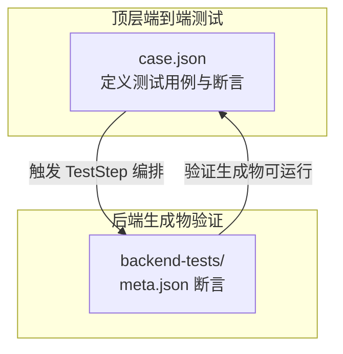
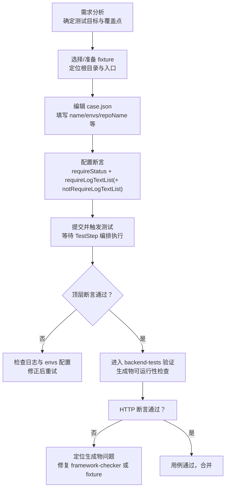
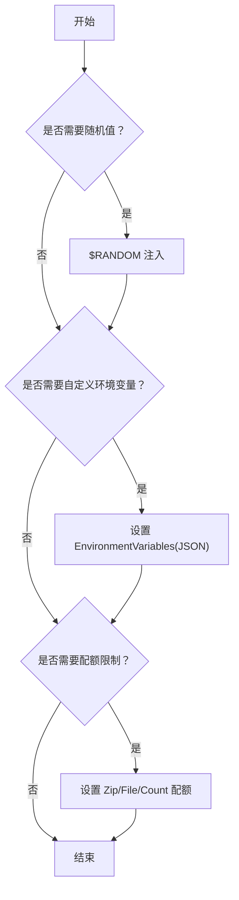
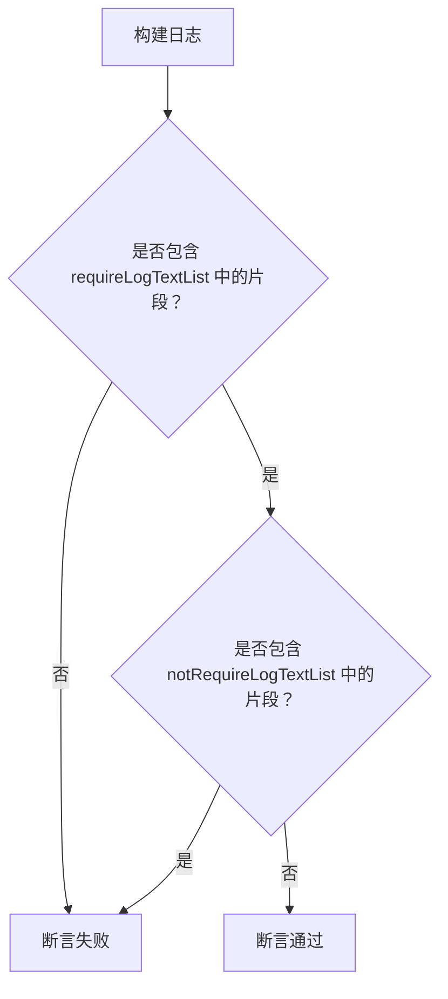
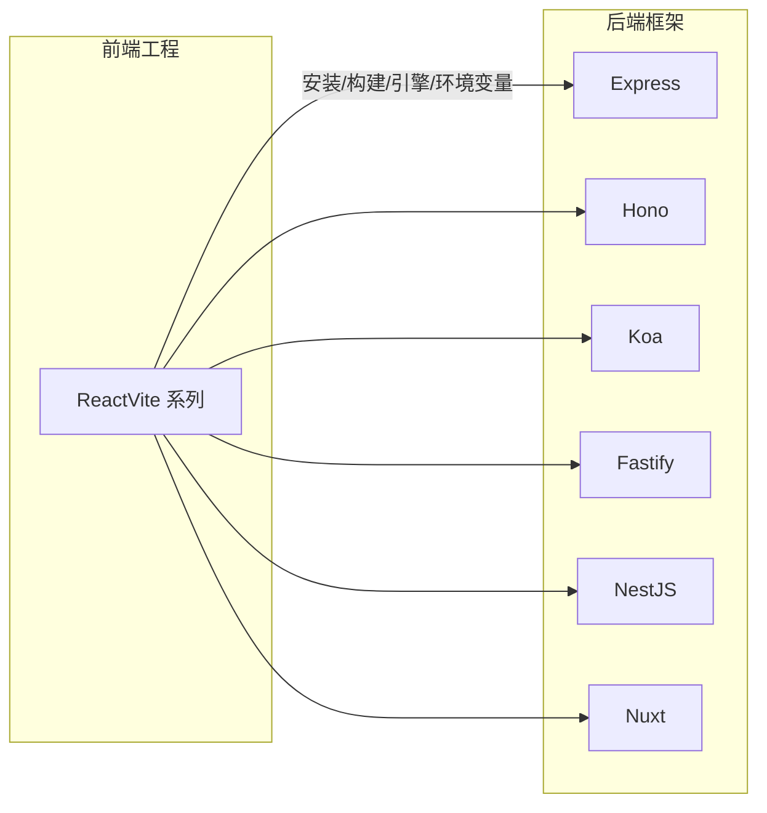
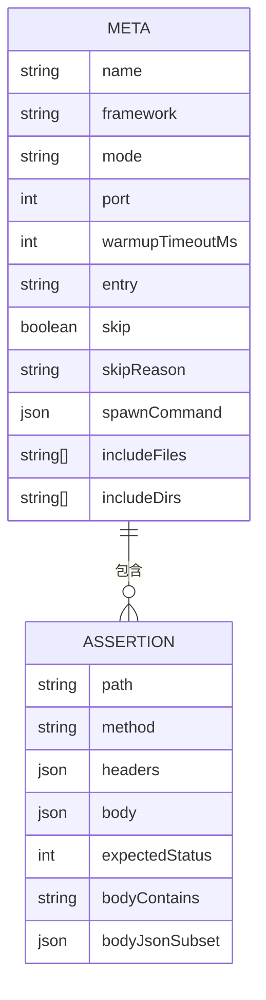
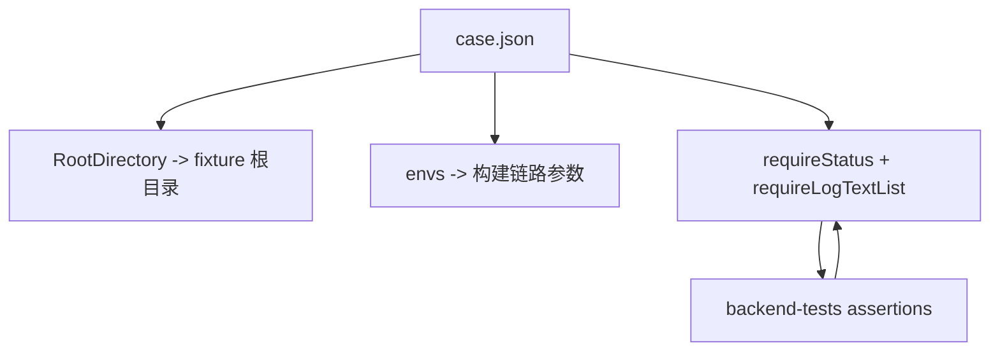

# 添加测试用例

<cite>
**本文引用的文件**
- [case.json](file://case.json)
- [README.md](file://README.md)
- [Express-disambig/README.md](file://Express-disambig/README.md)
- [Express-with-api/README.md](file://Express-with-api/README.md)
- [ReactVite/README.md](file://ReactVite/README.md)
- [backend-tests/README.md](file://backend-tests/README.md)
- [backend-tests/express-listen/meta.json](file://backend-tests/express-listen/meta.json)
- [backend-tests/express-export/meta.json](file://backend-tests/express-export/meta.json)
- [backend-tests/fastify/meta.json](file://backend-tests/fastify/meta.json)
</cite>

## 目录
1. [简介](#简介)
2. [项目结构](#项目结构)
3. [核心组件](#核心组件)
4. [架构总览](#架构总览)
5. [详细组件分析](#详细组件分析)
6. [依赖关系分析](#依赖关系分析)
7. [性能考量](#性能考量)
8. [故障排查指南](#故障排查指南)
9. [结论](#结论)
10. [附录](#附录)

## 简介
本指南面向希望向测试用例体系新增用例的开发者，系统讲解如何基于 case.json 定义高质量测试用例。内容涵盖：
- case.json 的字段结构与语义详解（name、envs、requireStatus、requireLogTextList、notRequireLogTextList、repoName 等）
- envs 参数的取值与用途，含特殊值 $RANDOM 的使用方法
- 测试用例设计最佳实践（fixture 选择、断言设计、日志匹配策略）
- 从需求分析到最终验证的完整流程
- 案例分析与反模式说明，帮助规避常见错误

## 项目结构
本仓库包含两类测试：
- 顶层端到端测试：通过 case.json 驱动 TestStep 编排（安装、构建、打包、部署、配额等），并结合云效流水线与 FC 平台进行真实部署验证
- backend-tests：对 framework-checker 生成的可执行产物进行快速黑盒验证，确保框架生成物能在本机正确响应 HTTP 请求

**图表来源**
- [case.json:1-603](file://case.json#L1-L603)
- [backend-tests/README.md:1-133](file://backend-tests/README.md#L1-L133)

**章节来源**
- [README.md:1-31](file://README.md#L1-L31)
- [backend-tests/README.md:1-133](file://backend-tests/README.md#L1-L133)

## 核心组件
本节聚焦 case.json 的字段结构与语义，帮助你准确编写测试用例。

- name
  - 类型：字符串
  - 作用：测试用例名称，用于显示在测试结果中
  - 示例路径：[示例用例名称:3-3](file://case.json#L3-L3)

- envs
  - 类型：对象
  - 作用：覆盖测试所需的环境变量键值对
  - 关键约束与建议：
    - 若使用 test-for-aone-ci 仓库作为基准，通常需设置 RootDirectory 指向具体 fixture
    - 支持特殊值 $RANDOM，用于注入随机字符串；例如 TemplateName 会被替换为当前线上可用的随机模板名
  - 示例路径：
    - [$RANDOM 使用示例:5-6](file://case.json#L5-L6)
    - [RootDirectory 设置示例:18-18](file://case.json#L18-L18)
    - [InstallCommand 设置示例:19-19](file://case.json#L19-L19)

- repoName
  - 类型：字符串
  - 作用：测试用例使用的仓库名；若为“创建新仓库”场景可留空或填写其他仓库名
  - 示例路径：[仓库名示例:8-8](file://case.json#L8-L8)

- requireStatus
  - 类型：字符串
  - 取值：SUCCESS、FAIL、CANCEL
  - 作用：期望的构建结果状态，决定用例是否通过
  - 示例路径：[期望状态示例:9-9](file://case.json#L9-L9)

- requireLogTextList
  - 类型：字符串数组
  - 作用：用例通过的必要日志片段列表；支持正则表达式
  - 示例路径：
    - [日志片段匹配示例:10-12](file://case.json#L10-L12)
    - [多条日志片段示例:23-26](file://case.json#L23-L26)

- notRequireLogTextList（可选）
  - 类型：字符串数组
  - 作用：用例不应出现的日志片段列表；用于排除某些分支或行为
  - 示例路径：
    - [排除日志片段示例:280-282](file://case.json#L280-L282)
    - [另一个排除示例:598-600](file://case.json#L598-L600)

- 其他常用 envs 键（示例中出现的）
  - InstallCommand：安装命令
  - BuildCommand：构建命令
  - AssetsDirectory：静态资源目录
  - ERName：工程名
  - ProductionBranch：生产分支名
  - CommitId：指定提交 ID
  - NodeVersion：Node 版本
  - EnvironmentVariables：环境变量 JSON 字符串
  - ZipSizeQuota/FileCountQuota/FileSizeQuota：配额限制
  - ErEntry：函数入口文件名
  - SkipFunctionBuild：跳过函数构建

示例路径（部分）：
- [InstallCommand/BuildCommand/AssetsDirectory 示例:150-154](file://case.json#L150-L154)
- [EnvironmentVariables 示例:88-88](file://case.json#L88-L88)
- [NodeVersion 示例:114-114](file://case.json#L114-L114)
- [ProductionBranch 示例:273-273](file://case.json#L273-L273)
- [CommitId 示例:289-289](file://case.json#L289-L289)
- [Zip/File/Count 配额示例:193-193](file://case.json#L193-L193)

**章节来源**
- [case.json:1-603](file://case.json#L1-L603)
- [README.md:21-30](file://README.md#L21-L30)

## 架构总览
下图展示了从新增用例到验证通过的整体流程，以及与 backend-tests 的协作关系：

**图表来源**
- [case.json:1-603](file://case.json#L1-L603)
- [backend-tests/README.md:1-133](file://backend-tests/README.md#L1-L133)

## 详细组件分析

### 组件A：envs 参数与取值策略
- 基本原则
  - 必填项：当使用 test-for-aone-ci 作为基准仓库时，通常需设置 RootDirectory 指向具体 fixture
  - 可选项：根据测试目标选择性设置 InstallCommand、BuildCommand、AssetsDirectory、ERName、ProductionBranch、CommitId、NodeVersion、EnvironmentVariables、配额相关键等
- 特殊值 $RANDOM
  - 作用：注入随机字符串，常用于模板名或工程名，避免冲突
  - 示例路径：[$RANDOM 使用示例:5-6](file://case.json#L5-L6)
- 环境变量 JSON
  - 通过 EnvironmentVariables 传入 JSON 字符串，确保格式合法
  - 示例路径：[EnvironmentVariables 示例:88-88](file://case.json#L88-L88)
- 配额限制
  - ZipSizeQuota、FileCountQuota、FileSizeQuota 用于模拟极端资源限制，验证错误提示与失败路径
  - 示例路径：
    - [ZipSizeQuota 示例:193-193](file://case.json#L193-L193)
    - [FileCountQuota 示例:206-206](file://case.json#L206-L206)
    - [FileSizeQuota 示例:219-219](file://case.json#L219-L219)

**图表来源**
- [case.json:5-6](file://case.json#L5-L6)
- [case.json:88-88](file://case.json#L88-L88)
- [case.json:193-193](file://case.json#L193-L193)
- [case.json:206-206](file://case.json#L206-L206)
- [case.json:219-219](file://case.json#L219-L219)

**章节来源**
- [case.json:1-603](file://case.json#L1-L603)

### 组件B：断言设计与日志匹配
- requireStatus
  - 用于声明期望的构建结果（SUCCESS/FAIL/CANCEL）
  - 示例路径：[SUCCESS 示例:22-22](file://case.json#L22-L22)
- requireLogTextList
  - 匹配构建过程中的关键日志片段；支持正则表达式
  - 示例路径：
    - [基础匹配示例:23-26](file://case.json#L23-L26)
    - [多片段匹配示例:568-576](file://case.json#L568-L576)
- notRequireLogTextList
  - 排除特定日志片段，避免某些分支或行为触发
  - 示例路径：
    - [排除示例1:280-282](file://case.json#L280-L282)
    - [排除示例2:598-600](file://case.json#L598-L600)

**图表来源**
- [case.json:23-26](file://case.json#L23-L26)
- [case.json:280-282](file://case.json#L280-L282)
- [case.json:568-576](file://case.json#L568-L576)
- [case.json:598-600](file://case.json#L598-L600)

**章节来源**
- [case.json:1-603](file://case.json#L1-L603)

### 组件C：典型场景与 fixture 选择
- 前端工程（React/Vite 系列）
  - 适用场景：验证安装器、构建器、静态资源目录、引擎版本、环境变量透传等
  - 示例路径：
    - [无 esa.jsonc 的 React 工程:134-145](file://case.json#L134-L145)
    - [安装命令为空但控制台不为空:134-145](file://case.json#L134-L145)
    - [Node 引擎版本覆盖:97-108](file://case.json#L97-L108)
    - [读取环境变量示例:84-95](file://case.json#L84-L95)
- 后端框架（Express/Hono/Koa/Fastify/NestJS/Nuxt 等）
  - 适用场景：验证框架检测、打包为后端、静态模板文件打包、/api 路由分发优先级等
  - 示例路径：
    - [Express 项目（app.listen）:298-315](file://case.json#L298-L315)
    - [Hono 项目（fetch 风格导出）:317-334](file://case.json#L317-L334)
    - [Koa 项目:336-353](file://case.json#L336-L353)
    - [纯 API 项目（/api 多路由）:355-372](file://case.json#L355-L372)
    - [动态路径与静态优先匹配:374-391](file://case.json#L374-L391)
    - [路由冲突导致失败:393-408](file://case.json#L393-L408)
    - [Express + /api 时优先框架打包:410-430](file://case.json#L410-L430)
    - [Express 项目（module.exports 导出）:432-448](file://case.json#L432-L448)
    - [Fastify 项目:450-466](file://case.json#L450-L466)
    - [NestJS 项目:468-484](file://case.json#L468-L484)
    - [Express 带 views/ 模板:486-503](file://case.json#L486-L503)
    - [多入口文件去歧义:505-521](file://case.json#L505-L521)
    - [index.js 作为父路径入口:523-540](file://case.json#L523-L540)
    - [可选通配 [[...slug]]](file://case.json#L542-L559)
    - [综合项目（前端+ER+后端+完整 esa.jsonc）:561-577](file://case.json#L561-L577)
    - [Nuxt 项目（meta-framework）:579-601](file://case.json#L579-L601)

**图表来源**
- [case.json:298-315](file://case.json#L298-L315)
- [case.json:317-334](file://case.json#L317-L334)
- [case.json:336-353](file://case.json#L336-L353)
- [case.json:355-372](file://case.json#L355-L372)
- [case.json:374-391](file://case.json#L374-L391)
- [case.json:393-408](file://case.json#L393-L408)
- [case.json:410-430](file://case.json#L410-L430)
- [case.json:432-448](file://case.json#L432-L448)
- [case.json:450-466](file://case.json#L450-L466)
- [case.json:468-484](file://case.json#L468-L484)
- [case.json:486-503](file://case.json#L486-L503)
- [case.json:505-521](file://case.json#L505-L521)
- [case.json:523-540](file://case.json#L523-L540)
- [case.json:542-559](file://case.json#L542-L559)
- [case.json:561-577](file://case.json#L561-L577)
- [case.json:579-601](file://case.json#L579-L601)

**章节来源**
- [case.json:1-603](file://case.json#L1-L603)

### 组件D：backend-tests 断言模型（对比参考）
backend-tests 提供更细粒度的 HTTP 层断言，便于验证生成物在本机的可运行性与路由行为。其断言模型可作为 case.json 日志断言的补充参考。

- 断言字段要点
  - path/method/headers/body：请求描述
  - expectedStatus：期望状态码
  - bodyContains/bodyJsonSubset：响应体匹配
- 示例路径：
  - [Express + app.listen 断言:8-34](file://backend-tests/express-listen/meta.json#L8-L34)
  - [Express + module.exports 断言:7-12](file://backend-tests/express-export/meta.json#L7-L12)
  - [Fastify 断言:8-13](file://backend-tests/fastify/meta.json#L8-L13)

**图表来源**
- [backend-tests/express-listen/meta.json:1-36](file://backend-tests/express-listen/meta.json#L1-L36)
- [backend-tests/express-export/meta.json:1-14](file://backend-tests/express-export/meta.json#L1-L14)
- [backend-tests/fastify/meta.json:1-15](file://backend-tests/fastify/meta.json#L1-L15)
- [backend-tests/README.md:38-84](file://backend-tests/README.md#L38-L84)

**章节来源**
- [backend-tests/README.md:1-133](file://backend-tests/README.md#L1-L133)
- [backend-tests/express-listen/meta.json:1-36](file://backend-tests/express-listen/meta.json#L1-L36)
- [backend-tests/express-export/meta.json:1-14](file://backend-tests/express-export/meta.json#L1-L14)
- [backend-tests/fastify/meta.json:1-15](file://backend-tests/fastify/meta.json#L1-L15)

## 依赖关系分析
- case.json 与各 fixture 的依赖
  - RootDirectory 指向具体 fixture 根目录，决定 TestStep 的工作基线
  - envs 中的键值影响构建链路（安装器、构建器、打包器、部署器）的行为
- 与 backend-tests 的协作
  - 顶层用例通过 requireStatus + requireLogTextList 验证端到端流程
  - backend-tests 通过 meta.json 的 assertions 验证生成物在本机的 HTTP 行为
- 可能的耦合点
  - 日志断言与实现细节耦合；建议尽量使用稳定的关键日志片段
  - 配额限制与平台行为耦合；建议明确边界并提供清晰的失败提示

**图表来源**
- [case.json:1-603](file://case.json#L1-L603)
- [backend-tests/README.md:1-133](file://backend-tests/README.md#L1-L133)

**章节来源**
- [case.json:1-603](file://case.json#L1-L603)
- [backend-tests/README.md:1-133](file://backend-tests/README.md#L1-L133)

## 性能考量
- 用例执行时间
  - 顶层 case.json 用例通常耗时分钟级（涉及云效流水线与部署）
  - backend-tests 用例耗时秒级（本机直连验证）
- 优化建议
  - 尽量复用现有 fixture，减少不必要的安装与构建
  - 使用 notRequireLogTextList 排除无关分支，降低误判概率
  - 将复杂场景拆分为多个小用例，提升定位效率

[本节为通用建议，无需特定文件引用]

## 故障排查指南
- 常见问题与定位
  - 安装/构建失败：检查 InstallCommand/BuildCommand 是否与 fixture 配置一致
  - 资源配额不足：调整 ZipSizeQuota/FileCountQuota/FileSizeQuota，观察失败提示
  - 日志断言不稳定：优先使用稳定的日志片段，避免依赖动态信息
  - 生成物不可运行：结合 backend-tests 的 assertions 进一步定位
- 参考示例
  - [安装命令为空但控制台不为空:134-145](file://case.json#L134-L145)
  - [不存在 package.json 且未设置 BuildCommand:175-187](file://case.json#L175-L187)
  - [assets 目录与 ER 入口均缺失:228-241](file://case.json#L228-L241)
  - [Nuxt 项目 meta-framework 路径排除:598-600](file://case.json#L598-L600)

**章节来源**
- [case.json:134-145](file://case.json#L134-L145)
- [case.json:175-187](file://case.json#L175-L187)
- [case.json:228-241](file://case.json#L228-L241)
- [case.json:598-600](file://case.json#L598-L600)

## 结论
通过规范的 case.json 字段使用、合理的 fixture 选择与严谨的日志断言设计，可以高效地覆盖端到端构建与部署的关键路径。配合 backend-tests 的 HTTP 层验证，能够进一步确保生成物在本机的正确性与稳定性。建议在新增用例时遵循“小步快跑、逐步收敛”的策略，持续完善测试矩阵。

[本节为总结性内容，无需特定文件引用]

## 附录

### A. 新增用例的完整流程
- 需求分析：明确测试目标（安装器、构建器、打包器、部署器、配额、框架检测等）
- fixture 选择：根据目标场景选择合适的 fixture，并设置 RootDirectory
- 编写用例：填充 name、envs、repoName、requireStatus、requireLogTextList、notRequireLogTextList
- 提交验证：提交后触发测试，观察日志与结果
- 问题修复：根据失败原因调整 envs 或断言，必要时补充 backend-tests 断言
- 合并发布：确认通过后合并

**章节来源**
- [README.md:2-31](file://README.md#L2-L31)
- [case.json:1-603](file://case.json#L1-L603)

### B. 最佳实践清单
- 用例命名：简洁明确，体现测试目标
- envs 设计：最小化变更，仅覆盖必要参数
- 断言策略：优先使用稳定日志片段，避免过度依赖动态信息
- fixture 复用：优先复用现有 fixture，减少维护成本
- 分层验证：先用 case.json 验证端到端流程，再用 backend-tests 验证生成物

**章节来源**
- [case.json:1-603](file://case.json#L1-L603)
- [backend-tests/README.md:1-133](file://backend-tests/README.md#L1-L133)

### C. 案例分析与反模式
- 案例分析
  - [Express 项目（app.listen）:298-315](file://case.json#L298-L315)：验证后端项目识别与打包
  - [Nuxt 项目（meta-framework）:579-601](file://case.json#L579-L601)：验证 meta-runtime 路径与 nft trace 的区别
  - [路由冲突导致失败:393-408](file://case.json#L393-L408)：验证 /api 路由冲突检测
- 反模式
  - 过度依赖动态日志：如时间戳、临时 ID 等
  - 忽视 notRequireLogTextList：导致误判某些分支
  - 环境变量 JSON 格式错误：导致解析失败或行为异常
  - 配额设置不合理：导致用例过早失败或无法覆盖边界

**章节来源**
- [case.json:298-315](file://case.json#L298-L315)
- [case.json:579-601](file://case.json#L579-L601)
- [case.json:393-408](file://case.json#L393-L408)