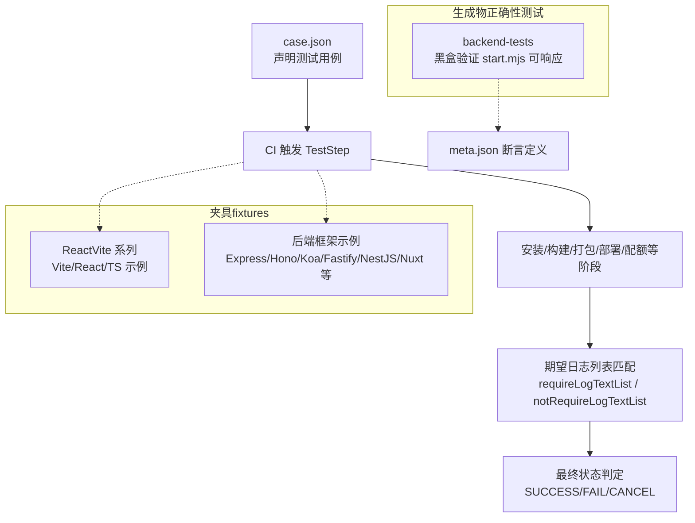
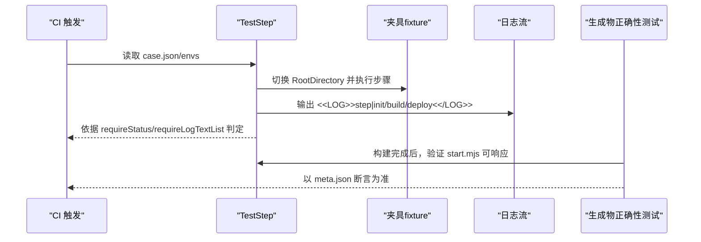
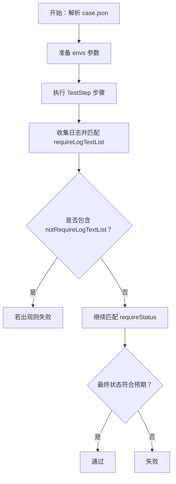
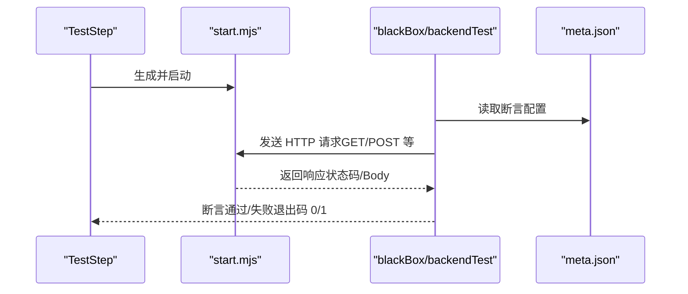
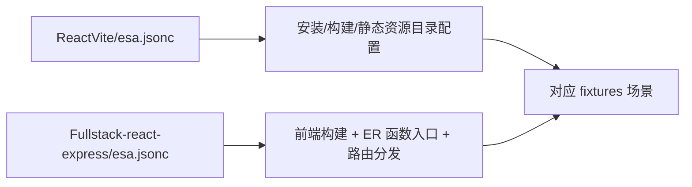
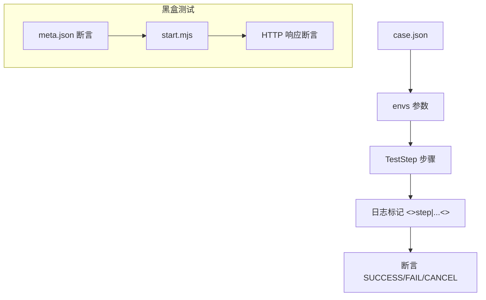

# 调试与故障排除

<cite>
**本文引用的文件**
- [README.md](file://README.md)
- [case.json](file://case.json)
- [backend-tests/README.md](file://backend-tests/README.md)
- [backend-tests/express-listen/meta.json](file://backend-tests/express-listen/meta.json)
- [backend-tests/nuxt/meta.json](file://backend-tests/nuxt/meta.json)
- [.claude/skills/add-test-case/SKILL.md](file://.claude/skills/add-test-case/SKILL.md)
- [ReactVite/esa.jsonc](file://ReactVite/esa.jsonc)
- [Fullstack-react-express/esa.jsonc](file://Fullstack-react-express/esa.jsonc)
</cite>

## 目录
1. [简介](#简介)
2. [项目结构](#项目结构)
3. [核心组件](#核心组件)
4. [架构总览](#架构总览)
5. [详细组件分析](#详细组件分析)
6. [依赖分析](#依赖分析)
7. [性能考虑](#性能考虑)
8. [故障排除指南](#故障排除指南)
9. [结论](#结论)
10. [附录](#附录)

## 简介
本指南面向在 TestStep CI 流水线环境中进行调试与故障排除的工程师，聚焦以下目标：
- 如何基于日志标记与“期望日志列表”快速定位测试失败的根因
- 如何区分“端到端构建/部署失败”与“生成物运行失败”
- 如何在本地模拟 CI 环境，重现并验证问题
- 如何利用 TestStep 的日志标记系统进行精确的测试点定位
- 如何针对构建失败、部署异常、环境变量配置错误等常见问题制定排查步骤
- 如何诊断性能问题并给出优化建议

## 项目结构
该仓库是一个端到端测试床，围绕 TestStep 步骤脚本进行多场景验证：
- 顶层通过 case.json 声明测试用例，驱动 CI 中的 TestStep 执行
- 各个 ReactVite-xxx 与后端框架示例作为“夹具（fixture）”提供具体工程场景
- backend-tests 目录提供“生成物正确性”的黑盒测试，验证 framework-checker 产出的可执行程序在本机可响应 HTTP

图表来源
- [case.json:1-603](file://case.json#L1-L603)
- [backend-tests/README.md:1-133](file://backend-tests/README.md#L1-L133)

章节来源
- [README.md:1-31](file://README.md#L1-L31)
- [case.json:1-603](file://case.json#L1-L603)
- [backend-tests/README.md:1-133](file://backend-tests/README.md#L1-L133)

## 核心组件
- 测试用例编排与断言
  - 顶层 case.json 通过 envs 注入参数，通过 requireStatus 与 requireLogTextList 控制断言
  - 日志标记 <<LOG>>step|...<</LOG>> 是阶段边界稳定锚点，建议每条用例至少包含一个结束标记
- 夹具（fixtures）
  - ReactVite 系列与各类后端框架示例，覆盖包管理器、引擎版本、入口文件、静态资源目录等场景
- 生成物正确性测试
  - backend-tests 通过 meta.json 定义 HTTP 断言，验证 start.mjs 在本机可正确响应

章节来源
- [README.md:1-31](file://README.md#L1-L31)
- [case.json:1-603](file://case.json#L1-L603)
- [backend-tests/README.md:1-133](file://backend-tests/README.md#L1-L133)

## 架构总览
下图展示了从“测试用例声明”到“日志标记断言”的端到端流程，以及“生成物正确性测试”的对比视角。

图表来源
- [case.json:1-603](file://case.json#L1-L603)
- [backend-tests/README.md:1-133](file://backend-tests/README.md#L1-L133)

## 详细组件分析

### 组件A：日志标记系统与用例断言
- 日志标记 <<LOG>>step|...<</LOG>> 是阶段边界稳定锚点，建议每条用例至少包含一个结束标记
- 用例断言由 requireStatus 与 requireLogTextList/ notRequireLogTextList 共同构成
- 常见标记：build、deploy、init 等阶段的开始与结束
- 推荐实践：在 requireLogTextList 中加入 <<LOG>>step|buildEnd<</LOG>>，并在非生产分支场景下，使用 notRequireLogTextList 断言 <<LOG>>step|deploy<</LOG>> 不出现

图表来源
- [case.json:1-603](file://case.json#L1-L603)
- [.claude/skills/add-test-case/SKILL.md:85-96](file://.claude/skills/add-test-case/SKILL.md#L85-L96)

章节来源
- [.claude/skills/add-test-case/SKILL.md:26-44](file://.claude/skills/add-test-case/SKILL.md#L26-L44)
- [.claude/skills/add-test-case/SKILL.md:85-96](file://.claude/skills/add-test-case/SKILL.md#L85-L96)

### 组件B：生成物正确性测试（backend-tests）
- 目标：验证 framework-checker 生成的 start.mjs 在本机可正确响应 HTTP
- 断言定义：meta.json 中的 assertions、framework、mode、port 等字段
- 运行方式：在 TestStep 构建完成后，直接运行 blackBox/backendTest/index.js 或单个 fixture

图表来源
- [backend-tests/README.md:94-110](file://backend-tests/README.md#L94-L110)
- [backend-tests/express-listen/meta.json:1-36](file://backend-tests/express-listen/meta.json#L1-L36)
- [backend-tests/nuxt/meta.json:1-14](file://backend-tests/nuxt/meta.json#L1-L14)

章节来源
- [backend-tests/README.md:1-133](file://backend-tests/README.md#L1-L133)
- [backend-tests/express-listen/meta.json:1-36](file://backend-tests/express-listen/meta.json#L1-L36)
- [backend-tests/nuxt/meta.json:1-14](file://backend-tests/nuxt/meta.json#L1-L14)

### 组件C：夹具（fixtures）与配置文件
- ReactVite/esa.jsonc 与 Fullstack-react-express/esa.jsonc 展示了 installCommand、buildCommand、assets.directory 等关键配置
- 不同 fixtures 覆盖包管理器、引擎版本、入口文件、静态资源目录等场景，便于对照式排查

图表来源
- [ReactVite/esa.jsonc:1-10](file://ReactVite/esa.jsonc#L1-L10)
- [Fullstack-react-express/esa.jsonc:1-20](file://Fullstack-react-express/esa.jsonc#L1-L20)

章节来源
- [ReactVite/esa.jsonc:1-10](file://ReactVite/esa.jsonc#L1-L10)
- [Fullstack-react-express/esa.jsonc:1-20](file://Fullstack-react-express/esa.jsonc#L1-L20)

## 依赖分析
- 用例层依赖
  - case.json 依赖各夹具目录（RootDirectory 指向）与 TestStep 参数（envs）
  - requireLogTextList/ notRequireLogTextList 依赖 TestStep 输出的日志标记
- 黑盒测试层依赖
  - backend-tests 依赖 TestStep 构建产物（start.mjs）与 meta.json 断言
- 配置层依赖
  - 各夹具的 esa.jsonc 决定安装/构建/静态资源等行为

图表来源
- [case.json:1-603](file://case.json#L1-L603)
- [backend-tests/README.md:94-110](file://backend-tests/README.md#L94-L110)

章节来源
- [case.json:1-603](file://case.json#L1-L603)
- [backend-tests/README.md:1-133](file://backend-tests/README.md#L1-L133)

## 性能考虑
- 生成物正确性测试（backend-tests）单用例耗时秒级，适合快速回归
- 端到端测试（case.json）受 CI 环境与部署链路影响，耗时分钟级
- 建议在本地优先用 backend-tests 快速定位“生成物可运行性”问题，再回到 case.json 定位端到端编排问题

章节来源
- [backend-tests/README.md:10-14](file://backend-tests/README.md#L10-L14)

## 故障排除指南

### 一、测试失败的根因定位方法
- 使用日志标记锚点
  - 在 requireLogTextList 中加入 <<LOG>>step|buildEnd<</LOG>> 等结束标记，确保流程走到对应阶段
  - 若 <<LOG>>step|deploy<</LOG>> 未出现，结合 notRequireLogTextList 判断是否为非生产分支导致跳过部署
- 区分两类失败
  - 端到端失败：由 case.json 的 requireStatus/requireLogTextList 判定，关注 CI 日志中的标记与最终状态
  - 生成物失败：由 backend-tests 的 meta.json 断言判定，关注 HTTP 响应状态与 Body
- 对照式排查
  - 仅变更 envs 参数时，优先复用现有 fixture，减少变量干扰
  - 新增场景时，新建 ReactVite-<场景>/ 夹具，最小化差异，便于定位

章节来源
- [.claude/skills/add-test-case/SKILL.md:85-96](file://.claude/skills/add-test-case/SKILL.md#L85-L96)
- [backend-tests/README.md:6-16](file://backend-tests/README.md#L6-L16)

### 二、常见问题与排查步骤

#### 1. 构建失败
- 症状
  - requireStatus 为 FAIL，且日志中出现“无法找到 package.json 或 installCommand 为空”等提示
- 排查步骤
  - 检查夹具中是否存在 package.json
  - 若缺失，确认 BuildCommand 是否为空；若为空，按要求返回 FAIL
  - 若存在 package.json，确认 InstallCommand 是否正确（如 cnpm/yarn/pnpm/bun）
- 相关用例参考
  - “不存在 package.json，但有 BuildCommand”
  - “不存在 package.json，且没有 BuildCommand”
  - “esa.jsonc installCommand 为空字符串，但控制台不为空”

章节来源
- [case.json:162-173](file://case.json#L162-L173)
- [case.json:175-187](file://case.json#L175-L187)
- [case.json:134-145](file://case.json#L134-L145)

#### 2. 部署异常
- 症状
  - 非生产分支下仍出现 <<LOG>>step|deploy<</LOG>> 标记
- 排查步骤
  - 检查 ProductionBranch 设置是否与预期分支一致
  - 使用 notRequireLogTextList 断言 <<LOG>>step|deploy<</LOG>> 不出现
- 相关用例参考
  - “正常构建，非生产分支”

章节来源
- [case.json:269-283](file://case.json#L269-L283)

#### 3. 环境变量配置错误
- 症状
  - EnvironmentVariables 传入非法 JSON（如值为 "{"），或注入的变量未生效
- 排查步骤
  - 确认 EnvironmentVariables 为字符串化的合法 JSON
  - 在夹具中增加对注入变量的断言（如读取环境变量的输出）
- 相关用例参考
  - “非法的 EnvironmentVariables 参数”
  - “测试是否存在输出的 node env”

章节来源
- [case.json:71-82](file://case.json#L71-L82)
- [case.json:84-95](file://case.json#L84-L95)

#### 4. 引擎版本与 Node 版本不匹配
- 症状
  - 日志提示 Node 版本不满足，切换到指定版本
- 排查步骤
  - 检查 package.json 的 engines.node 与 NodeVersion 设置
  - 确认 NodeVersion 是否与期望一致
- 相关用例参考
  - “engines node v24.13.0”
  - “env node 20.x”

章节来源
- [case.json:97-108](file://case.json#L97-L108)
- [case.json:110-121](file://case.json#L110-L121)

#### 5. 静态资源目录与入口文件配置
- 症状
  - AssetsDirectory 未设置或 EREntry 不存在，导致构建/部署异常
- 排查步骤
  - 确认 assets.directory 与 EREntry 的设置
  - 若仅需静态资源，可不设置 EREntry；若需要后端入口，确保 EREntry 指向有效文件
- 相关用例参考
  - “assets 目录、erEntry 不存在”
  - “assets 目录不存在，erEntry 存在”

章节来源
- [case.json:228-241](file://case.json#L228-L241)
- [case.json:243-255](file://case.json#L243-L255)

#### 6. 配额限制触发失败
- 症状
  - ZipSizeQuota/FileCountQuota/FileSizeQuota 设置过小，触发“超出限制”
- 排查步骤
  - 提高配额阈值或优化构建产物体积与数量
- 相关用例参考
  - “特别小的 ZipSizeQuota”
  - “特别小的 FileCountQuota”
  - “特别小的 FileSizeQuota”

章节来源
- [case.json:189-200](file://case.json#L189-L200)
- [case.json:202-213](file://case.json#L202-L213)
- [case.json:215-226](file://case.json#L215-L226)

#### 7. 后端框架识别与路由冲突
- 症状
  - 未检测到后端框架或 FC 处理器冲突
- 排查步骤
  - 确认 /api 下文件命名与路径规则（动态路径、索引入口、可选通配等）
  - 若存在同路径不同文件，会导致冲突并失败
- 相关用例参考
  - “纯 API 项目（无框架，只有 /api 下几个 handler 文件）能自动起多路由 dispatcher”
  - “/api 支持动态路径：用户参数 [id]、任意深度 [...slug]，静态路径优先匹配”
  - “/api 下两个文件名编出同一个路径时，构建直接失败并指出冲突文件”

章节来源
- [case.json:355-372](file://case.json#L355-L372)
- [case.json:374-391](file://case.json#L374-L391)
- [case.json:393-408](file://case.json#L393-L408)

### 三、本地调试与重现问题

#### 1. 使用 backend-tests 快速验证生成物
- 在 TestStep 构建完成后，进入 TestStep 目录执行黑盒测试入口
- 可单跑某个 fixture，快速定位“生成物可运行性”问题
- 退出码 0 表示所有断言通过，1 表示至少一个断言失败/启动失败

章节来源
- [backend-tests/README.md:94-110](file://backend-tests/README.md#L94-L110)

#### 2. 模拟 CI 环境的关键要点
- 使用 case.json 中的 envs 注入参数，确保与 CI 中的 Step 输入一致
- 通过 requireLogTextList 与 notRequireLogTextList 精确定位阶段边界
- 对照 fixtures 的最小差异，逐步缩小问题范围

章节来源
- [.claude/skills/add-test-case/SKILL.md:26-44](file://.claude/skills/add-test-case/SKILL.md#L26-L44)

### 四、性能问题诊断与优化建议
- 生成物正确性测试（backend-tests）单用例耗时秒级，适合快速回归
- 端到端测试（case.json）耗时分钟级，建议优先在本地用 backend-tests 定位问题
- 优化建议
  - 尽量复用现有 fixtures，减少无关变量
  - 在 requireLogTextList 中加入稳定标记，避免业务日志漂移导致断言不稳定
  - 对于大体积构建产物，优先优化静态资源与打包策略

章节来源
- [backend-tests/README.md:10-14](file://backend-tests/README.md#L10-L14)
- [.claude/skills/add-test-case/SKILL.md:85-96](file://.claude/skills/add-test-case/SKILL.md#L85-L96)

## 结论
- 用例断言的核心在于“日志标记锚点 + 最终状态 + 期望/禁止日志列表”
- 生成物正确性测试（backend-tests）提供了“生成物可运行性”的快速验证通道
- 本地调试建议优先使用 backend-tests，再回到 case.json 进行端到端定位
- 通过最小化夹具差异与稳定日志标记，可显著提升问题定位效率

## 附录

### A. 关键参数与场景速查
- 常用 envs 参数
  - ERName、RootDirectory、InstallCommand、BuildCommand、AssetsDirectory、EREntry、EnvironmentVariables、NodeVersion、ProductionBranch、CommitId、ZipSizeQuota、FileCountQuota、FileSizeQuota
- 关键日志标记
  - <<LOG>>step|init/build/deploy<</LOG>> 及其结束标记 <<LOG>>step|...End<</LOG>>

章节来源
- [.claude/skills/add-test-case/SKILL.md:64-83](file://.claude/skills/add-test-case/SKILL.md#L64-L83)
- [.claude/skills/add-test-case/SKILL.md:85-96](file://.claude/skills/add-test-case/SKILL.md#L85-L96)