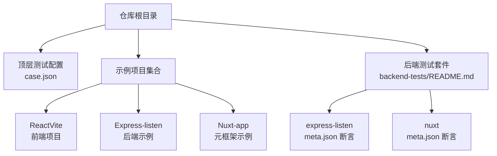
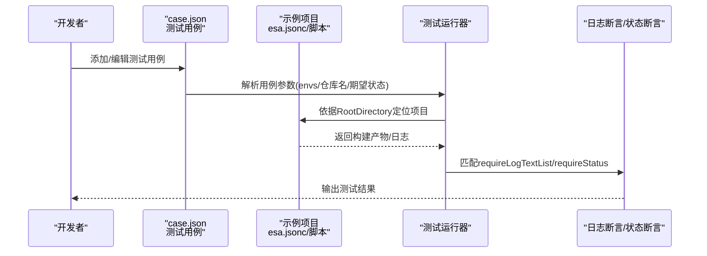
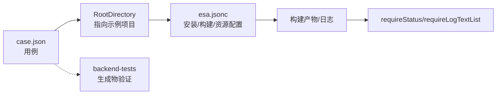

# 快速开始

<cite>
**本文引用的文件**
- [README.md](file://README.md)
- [case.json](file://case.json)
- [ReactVite/package.json](file://ReactVite/package.json)
- [ReactVite/esa.jsonc](file://ReactVite/esa.jsonc)
- [Express-listen/package.json](file://Express-listen/package.json)
- [Express-listen/server.js](file://Express-listen/server.js)
- [backend-tests/README.md](file://backend-tests/README.md)
- [backend-tests/express-listen/meta.json](file://backend-tests/express-listen/meta.json)
- [backend-tests/nuxt/meta.json](file://backend-tests/nuxt/meta.json)
- [backend-tests/nuxt/package.json](file://backend-tests/nuxt/package.json)
</cite>

## 目录
1. [简介](#简介)
2. [项目结构](#项目结构)
3. [核心组件](#核心组件)
4. [架构总览](#架构总览)
5. [详细组件分析](#详细组件分析)
6. [依赖关系分析](#依赖关系分析)
7. [性能考虑](#性能考虑)
8. [故障排除指南](#故障排除指南)
9. [结论](#结论)
10. [附录](#附录)

## 简介
本指南面向首次接触测试框架的新用户，帮助你在30分钟内完成环境准备、安装与配置，并成功运行你的第一个测试用例。你将学会：
- 环境要求与安装步骤
- 基本配置（case.json 与 esa.jsonc）
- 创建并添加第一个测试用例
- 理解测试参数与日志断言
- 常见问题排查与最佳实践

## 项目结构
该仓库是一个测试用例集合与验证框架，包含多个前端与后端示例项目，以及统一的测试编排配置文件。顶层的 case.json 描述了测试用例列表，每个用例通过环境变量驱动不同场景的构建与断言。

图表来源
- [README.md:1-31](file://README.md#L1-L31)
- [case.json:1-603](file://case.json#L1-L603)
- [backend-tests/README.md:1-133](file://backend-tests/README.md#L1-L133)

章节来源
- [README.md:1-31](file://README.md#L1-L31)
- [case.json:1-603](file://case.json#L1-L603)
- [backend-tests/README.md:1-133](file://backend-tests/README.md#L1-L133)

## 核心组件
- 测试用例编排：通过顶层的 case.json 组织测试场景，每个用例包含名称、环境变量、仓库名、期望状态与日志断言列表。
- 项目配置：各示例项目中的 esa.jsonc 定义安装命令、构建命令与静态资源目录等。
- 后端测试套件：backend-tests 提供对 framework-checker 生成物的“生成物正确性”验证，独立于顶层 case.json。

章节来源
- [README.md:1-31](file://README.md#L1-L31)
- [case.json:1-603](file://case.json#L1-L603)
- [backend-tests/README.md:1-133](file://backend-tests/README.md#L1-L133)

## 架构总览
下图展示了从测试用例到执行与断言的整体流程：

图表来源
- [README.md:1-31](file://README.md#L1-L31)
- [case.json:1-603](file://case.json#L1-L603)

## 详细组件分析

### 环境要求与安装
- Node.js 版本：根据具体示例项目要求，部分示例包含 engines 或 NodeVersion 参数，建议在本地安装对应版本或使用版本管理工具。
- 包管理器：示例中涵盖 npm、yarn、pnpm、bun、cnpm 等，确保你本地已安装所需包管理器。
- 依赖安装：对于 Express、Nuxt 等后端示例，需在项目根目录执行安装命令以准备运行环境。

章节来源
- [ReactVite/package.json:1-30](file://ReactVite/package.json#L1-L30)
- [Express-listen/package.json:1-9](file://Express-listen/package.json#L1-L9)
- [backend-tests/README.md:94-110](file://backend-tests/README.md#L94-L110)

### 基本配置
- 顶层测试配置：case.json 中的每个用例包含 name、envs、repoName、requireStatus、requireLogTextList 等字段。envs 用于覆盖环境变量，支持 $RANDOM 占位符。
- 项目配置：示例项目中的 esa.jsonc 定义 installCommand、buildCommand、assets.directory 等，用于控制构建与静态资源打包。

章节来源
- [README.md:21-31](file://README.md#L21-L31)
- [case.json:1-603](file://case.json#L1-L603)
- [ReactVite/esa.jsonc:1-10](file://ReactVite/esa.jsonc#L1-L10)

### 第一个测试用例：创建并添加
以下步骤带你创建并添加你的第一个测试用例：
1. 打开顶层的 case.json，在数组末尾新增一个对象，包含 name、envs、repoName、requireStatus、requireLogTextList。
2. 在 envs 中设置 ERName 与 RootDirectory，RootDirectory 指向你本地示例项目的相对路径（如 "/ReactVite"）。
3. 设置 repoName 为你希望关联的仓库名（若为新建仓库可留空）。
4. 设置 requireStatus 为 SUCCESS/FAIL/CANCEL 之一，或留空以仅依赖日志断言。
5. 在 requireLogTextList 中添加期望出现的日志片段（支持正则表达式），例如构建结束标记。
6. 保存后，运行测试以验证用例是否按预期通过。

章节来源
- [README.md:3-20](file://README.md#L3-L20)
- [case.json:1-603](file://case.json#L1-L603)

### 参数详解与使用方法
- name：测试用例名称，用于结果展示。
- envs：键值对形式的环境变量覆盖，支持 $RANDOM 表示随机字符串。
- repoName：测试用例使用的仓库名，新建仓库时可留空。
- requireStatus：期望的构建结果，支持 SUCCESS、FAIL、CANCEL。
- requireLogTextList：期望出现在日志中的文本列表，支持正则表达式。
- notRequireLogTextList：可选，用于排除某些日志片段，避免误判。

章节来源
- [README.md:21-29](file://README.md#L21-L29)
- [case.json:1-603](file://case.json#L1-L603)

### 实际操作示例
- 示例项目：ReactVite
  - 项目脚本与依赖位于 ReactVite/package.json。
  - 项目构建配置位于 ReactVite/esa.jsonc。
- 示例项目：Express-listen
  - 服务端示例位于 Express-listen/server.js。
  - 依赖声明位于 Express-listen/package.json。

章节来源
- [ReactVite/package.json:1-30](file://ReactVite/package.json#L1-L30)
- [ReactVite/esa.jsonc:1-10](file://ReactVite/esa.jsonc#L1-L10)
- [Express-listen/server.js:1-9](file://Express-listen/server.js#L1-L9)
- [Express-listen/package.json:1-9](file://Express-listen/package.json#L1-L9)

### 后端测试套件（可选）
- 用途：验证 framework-checker 生成的 start.mjs 在本地能正确响应 HTTP 请求。
- 运行方式：在 backend-tests 目录下批量安装依赖，然后运行 blackBox 后端测试入口。
- 断言规则：支持状态码、响应体子集匹配等，失败时输出详细断言清单。

章节来源
- [backend-tests/README.md:1-133](file://backend-tests/README.md#L1-L133)
- [backend-tests/express-listen/meta.json:1-36](file://backend-tests/express-listen/meta.json#L1-L36)
- [backend-tests/nuxt/meta.json:1-14](file://backend-tests/nuxt/meta.json#L1-L14)
- [backend-tests/nuxt/package.json:1-13](file://backend-tests/nuxt/package.json#L1-L13)

## 依赖关系分析
- case.json 与示例项目：每个用例通过 RootDirectory 关联到一个示例项目，测试运行器据此定位项目并执行构建。
- 项目配置与构建：esa.jsonc 决定安装与构建命令，影响构建产物与日志输出。
- 后端测试套件：独立于顶层 case.json，验证生成物在本地的可运行性。

图表来源
- [case.json:1-603](file://case.json#L1-L603)
- [ReactVite/esa.jsonc:1-10](file://ReactVite/esa.jsonc#L1-L10)
- [backend-tests/README.md:1-133](file://backend-tests/README.md#L1-L133)

章节来源
- [case.json:1-603](file://case.json#L1-L603)
- [ReactVite/esa.jsonc:1-10](file://ReactVite/esa.jsonc#L1-L10)
- [backend-tests/README.md:1-133](file://backend-tests/README.md#L1-L133)

## 性能考虑
- 选择合适的包管理器：不同包管理器在安装速度与缓存策略上存在差异，建议根据项目规模与网络环境选择。
- 控制构建范围：通过 assets.directory 精确指定静态资源目录，减少打包体积与时间。
- 合理设置超时：对于后端测试套件，可根据框架启动时间调整 warmupTimeoutMs，避免过早超时导致误判。

## 故障排除指南
- 无法找到 package.json 或 installCommand 为空：当项目缺少 package.json 或 installCommand 为空时，安装阶段会被跳过，可能导致后续构建失败。请确保 esa.jsonc 中的 installCommand 正确配置。
- 资源配额超限：ZipSizeQuota、FileCountQuota、FileSizeQuota 过小会导致构建失败。请适当提高配额或优化资源目录。
- 日志断言不匹配：若 requireLogTextList 中的关键日志未出现，请检查构建命令与日志输出是否一致，必要时调整断言内容。
- 后端测试启动失败：若 backend-tests 无法启动，请确认依赖已安装、端口未被占用，并检查 readySignal 是否符合预期。

章节来源
- [case.json:134-145](file://case.json#L134-L145)
- [case.json:189-213](file://case.json#L189-L213)
- [backend-tests/README.md:94-110](file://backend-tests/README.md#L94-L110)

## 结论
通过本指南，你已经完成了环境准备、基础配置与第一个测试用例的创建。建议在掌握基础后，逐步探索更多用例场景与参数组合，并结合后端测试套件验证生成物的正确性。遇到问题时，可参考故障排除指南与参数说明进行定位与修复。

## 附录

### 常用参数速查
- name：测试用例名称
- envs：环境变量覆盖（支持 $RANDOM）
- repoName：仓库名
- requireStatus：期望构建结果（SUCCESS/FAIL/CANCEL）
- requireLogTextList：期望日志片段（支持正则）
- notRequireLogTextList：排除日志片段（可选）

章节来源
- [README.md:21-29](file://README.md#L21-L29)
- [case.json:1-603](file://case.json#L1-L603)