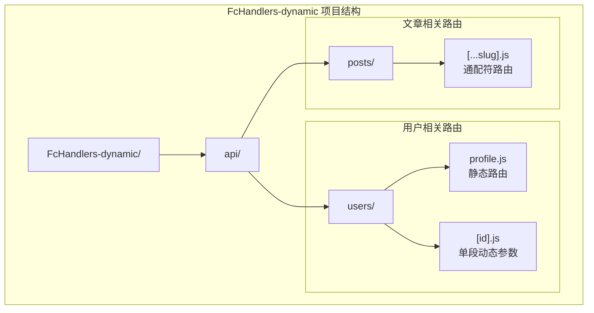
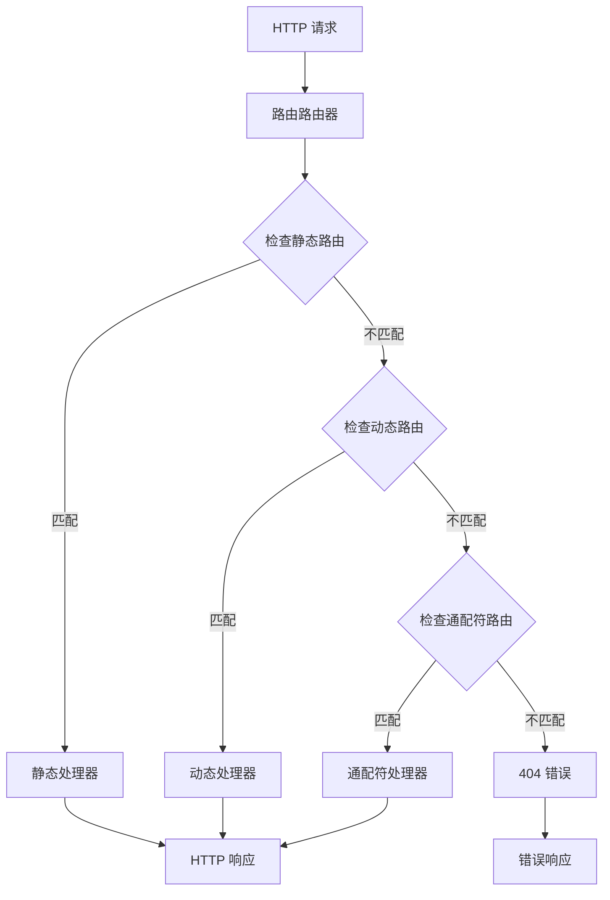
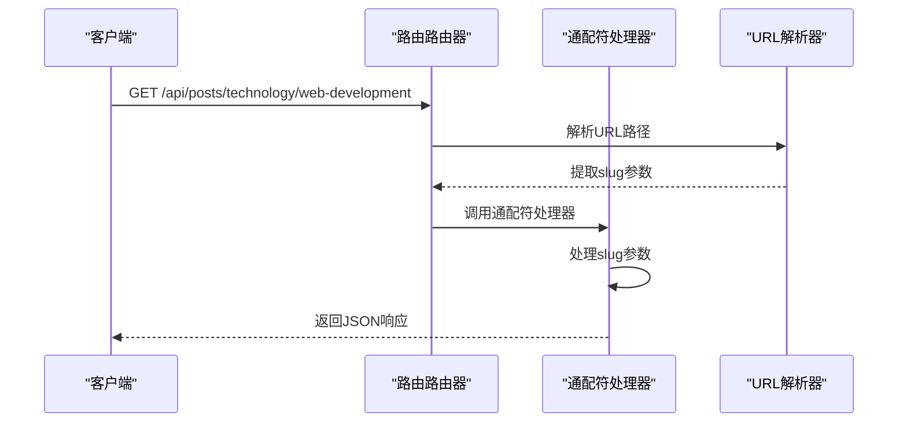
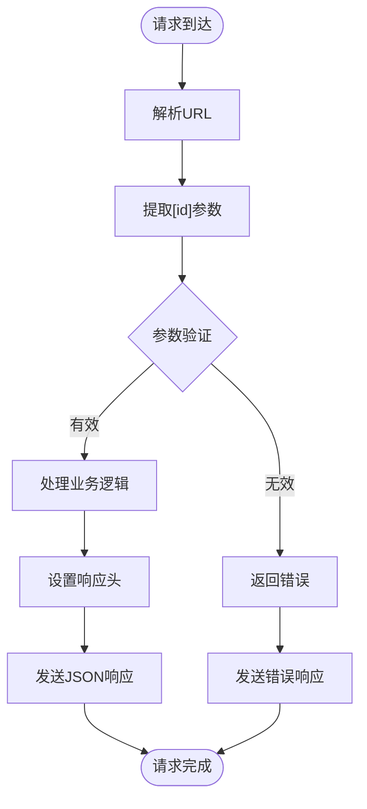
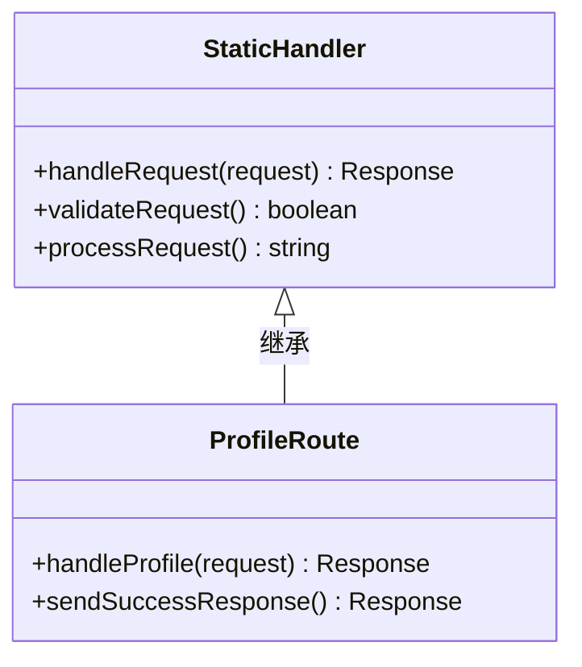
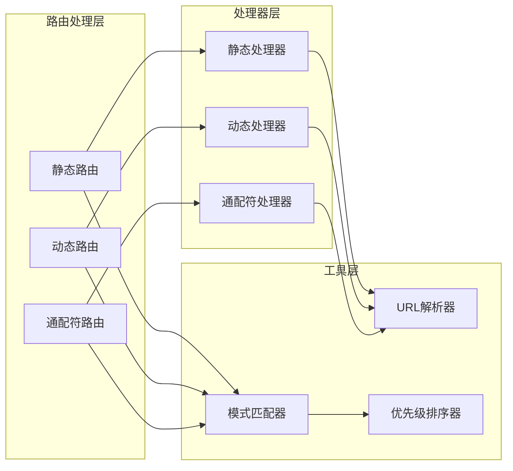
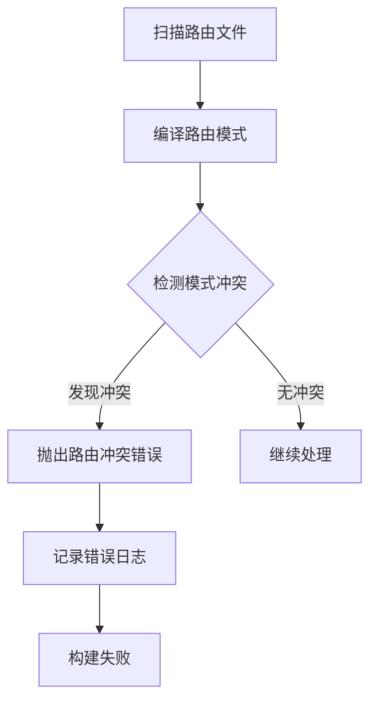

# 动态路由处理器测试

<cite>
**本文档引用的文件**
- [README.md](file://FcHandlers-dynamic/README.md)
- [package.json](file://FcHandlers-dynamic/package.json)
- [posts/[...slug].js](file://FcHandlers-dynamic/api/posts/[...slug].js)
- [users/[id].js](file://FcHandlers-dynamic/api/users/[id].js)
- [users/profile.js](file://FcHandlers-dynamic/api/users/profile.js)
- [case.json](file://case.json)
- [README.md](file://FcHandlers-index/README.md)
- [README.md](file://FcHandlers-optional/README.md)
</cite>

## 目录
1. [简介](#简介)
2. [项目结构](#项目结构)
3. [核心组件](#核心组件)
4. [架构概览](#架构概览)
5. [详细组件分析](#详细组件分析)
6. [依赖关系分析](#依赖关系分析)
7. [性能考虑](#性能考虑)
8. [故障排除指南](#故障排除指南)
9. [结论](#结论)

## 简介

FcHandlers-dynamic 是一个用于测试动态路由处理器的演示项目，专门验证无服务器环境下动态路由的实现。该项目展示了如何在 `/api/` 目录下混合使用静态路由、动态参数路由和通配符路由。

该项目的核心测试目标包括：
- 验证 `packFcHandlers` 分支的正确执行
- 确保路由总数为3条
- 验证模式编译的正确性
- 实现静态路由优先于动态路由的优先级处理

## 项目结构

FcHandlers-dynamic 项目采用简洁的目录结构，专注于演示动态路由的各种特性：

**图表来源**
- [README.md:1-17](file://FcHandlers-dynamic/README.md#L1-L17)
- [posts/[...slug].js](file://FcHandlers-dynamic/api/posts/[...slug].js#L1-L8)
- [users/[id].js](file://FcHandlers-dynamic/api/users/[id].js#L1-L7)
- [users/profile.js:1-3](file://FcHandlers-dynamic/api/users/profile.js#L1-L3)

**章节来源**
- [README.md:1-17](file://FcHandlers-dynamic/README.md#L1-L17)
- [package.json:1-6](file://FcHandlers-dynamic/package.json#L1-L6)

## 核心组件

### 静态路由组件

静态路由是最高优先级的路由类型，直接映射到特定的URL路径。在本项目中，用户资料路由 `api/users/profile.js` 展示了静态路由的实现方式。

### 动态参数路由组件

动态参数路由允许在URL路径中包含变量参数。`api/users/[id].js` 实现了一个单段动态参数路由，能够捕获用户ID并进行相应处理。

### 通配符路由组件

通配符路由是最灵活的路由类型，能够匹配任意深度的路径。`api/posts/[...slug].js` 实现了末尾贪婪catch-all功能，可以捕获整个路径片段。

**章节来源**
- [README.md:5-7](file://FcHandlers-dynamic/README.md#L5-L7)
- [users/profile.js:1-3](file://FcHandlers-dynamic/api/users/profile.js#L1-L3)
- [users/[id].js](file://FcHandlers-dynamic/api/users/[id].js#L1-L7)
- [posts/[...slug].js](file://FcHandlers-dynamic/api/posts/[...slug].js#L1-L8)

## 架构概览

FcHandlers-dynamic 项目实现了基于文件系统的路由架构，该架构遵循以下设计原则：

**图表来源**
- [README.md:9-16](file://FcHandlers-dynamic/README.md#L9-L16)

### 路由优先级机制

系统实现了明确的路由优先级处理机制：

1. **静态路由优先级最高**：精确匹配的静态路径优先于所有动态路由
2. **动态路由次之**：单段动态参数路由优先于通配符路由
3. **通配符路由最低**：能够匹配任意深度路径的路由具有最低优先级

这种优先级设计确保了最具体的路由能够优先处理相应的请求。

**章节来源**
- [README.md](file://FcHandlers-dynamic/README.md#L16)

## 详细组件分析

### 通配符路由实现 ([...slug])

通配符路由是FcHandlers-dynamic项目中最复杂的路由类型，实现了末尾贪婪匹配功能：

**图表来源**
- [posts/[...slug].js](file://FcHandlers-dynamic/api/posts/[...slug].js#L1-L8)

通配符路由的实现特点：
- 使用 `(.+?)` 模式进行非贪婪匹配
- 能够捕获整个路径片段
- 支持任意深度的嵌套目录结构
- 参数通过查询字符串传递

### 参数路由配置 ([id])

单段动态参数路由实现了基本的参数提取功能：

**图表来源**
- [users/[id].js](file://FcHandlers-dynamic/api/users/[id].js#L1-L7)

参数路由的关键特性：
- 使用 `([^/]+?)` 模式提取单段参数
- 自动处理URL编码和解码
- 支持多种数据类型的参数传递

### 静态路由处理 (profile)

静态路由提供了最直接的路由处理方式：

**图表来源**
- [users/profile.js:1-3](file://FcHandlers-dynamic/api/users/profile.js#L1-L3)

静态路由的优势：
- 最快的匹配速度
- 最简单的实现逻辑
- 最明确的路由意图

**章节来源**
- [posts/[...slug].js](file://FcHandlers-dynamic/api/posts/[...slug].js#L1-L8)
- [users/[id].js](file://FcHandlers-dynamic/api/users/[id].js#L1-L7)
- [users/profile.js:1-3](file://FcHandlers-dynamic/api/users/profile.js#L1-L3)

## 依赖关系分析

FcHandlers-dynamic 项目展示了动态路由处理的完整依赖链：

**图表来源**
- [README.md:9-16](file://FcHandlers-dynamic/README.md#L9-L16)

### 路径解析机制

系统实现了多层次的路径解析机制：

1. **文件系统扫描**：递归扫描 `/api/` 目录结构
2. **路由模式编译**：将文件路径转换为正则表达式模式
3. **优先级排序**：根据路由类型和具体程度进行排序
4. **请求匹配**：对传入请求进行模式匹配

**章节来源**
- [README.md:12-15](file://FcHandlers-dynamic/README.md#L12-L15)

## 性能考虑

动态路由处理器在性能方面需要考虑以下因素：

### 匹配算法优化

- **早期退出策略**：静态路由优先匹配，减少后续处理开销
- **模式缓存**：缓存编译后的正则表达式模式
- **路径预处理**：预处理URL路径以提高匹配效率

### 内存使用优化

- **处理器复用**：复用路由处理器实例
- **参数清理**：及时清理不再使用的参数对象
- **垃圾回收**：合理管理内存分配和回收

## 故障排除指南

### 常见问题及解决方案

#### 路由冲突检测

当多个路由文件编译为相同的URL模式时，系统会检测到冲突并报错：

**图表来源**
- [README.md:10-14](file://FcHandlers-conflict/README.md#L10-L14)

#### 路由优先级问题

如果路由优先级设置不当，可能导致请求被错误地路由：

- 确保静态路由优先于动态路由
- 验证动态路由的匹配顺序
- 检查通配符路由的位置

**章节来源**
- [README.md:1-15](file://FcHandlers-conflict/README.md#L1-L15)

## 结论

FcHandlers-dynamic 项目成功演示了无服务器环境下动态路由处理器的完整实现。通过静态路由、动态参数路由和通配符路由的组合使用，系统实现了灵活而高效的路由处理机制。

该项目的主要成就包括：

1. **完整的路由层次结构**：从静态到动态再到通配符的完整覆盖
2. **正确的优先级处理**：静态路由优先于动态路由的设计理念
3. **灵活的参数提取**：支持单段参数和多段通配符参数
4. **健壮的冲突检测**：防止路由模式冲突的机制

这些特性使得FcHandlers-dynamic成为理解和测试动态路由处理器的理想参考项目。