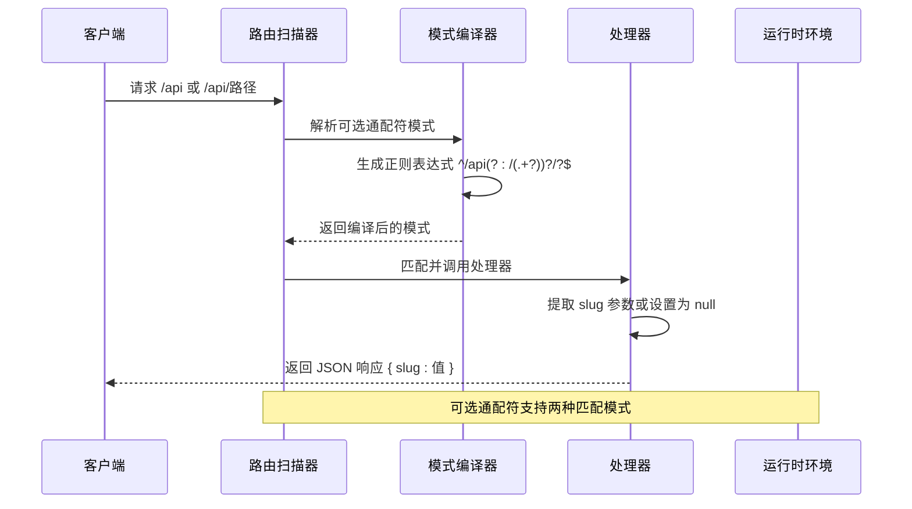
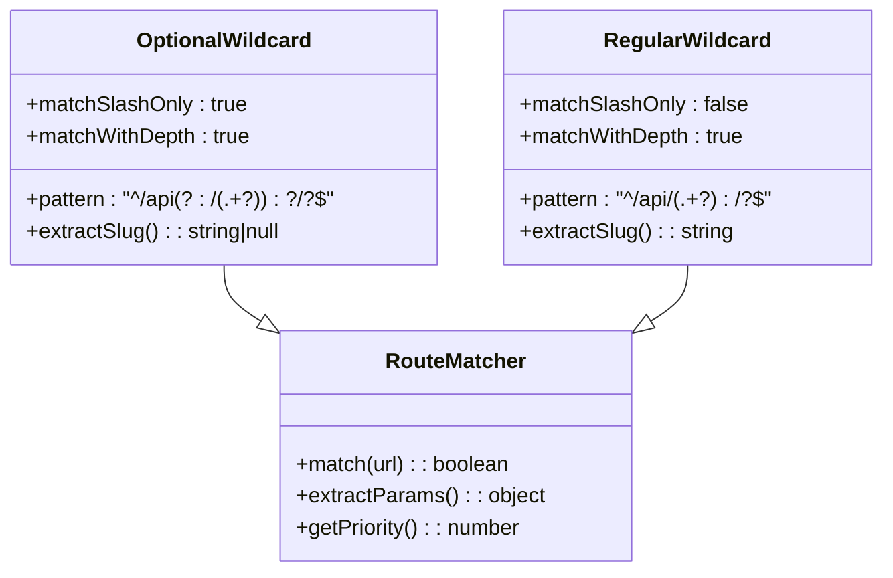
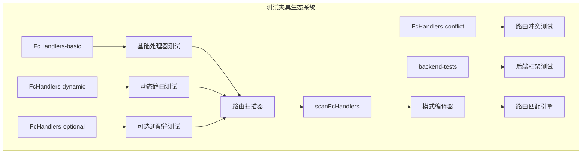

# 可选通配符处理器测试

<cite>
**本文档引用的文件**
- [README.md](file://FcHandlers-optional/README.md)
- [package.json](file://FcHandlers-optional/package.json)
- [[...slug].js](file://FcHandlers-optional/api/[[...slug]].js)
- [README.md](file://FcHandlers-dynamic/README.md)
- [README.md](file://FcHandlers-basic/README.md)
- [README.md](file://FcHandlers-conflict/README.md)
- [README.md](file://backend-tests/README.md)
- [case.json](file://case.json)
</cite>

## 目录
1. [项目概述](#项目概述)
2. [项目结构](#项目结构)
3. [核心组件](#核心组件)
4. [架构概览](#架构概览)
5. [详细组件分析](#详细组件分析)
6. [依赖关系分析](#依赖关系分析)
7. [性能考虑](#性能考虑)
8. [故障排除指南](#故障排除指南)
9. [结论](#结论)

## 项目概述

FcHandlers-optional 是一个专门用于测试可选通配符处理器的测试夹具项目。该项目的核心目标是验证扫描器能够正确编译 `[[...name]]` 段，这是四种段类型中语义最复杂的一种。

### 测试目标

该项目专注于以下测试目标：
- 验证扫描器正确编译可选通配符段 `[[...name]]`
- 确保可选通配符路由能够同时匹配 `/api` 和 `/api/任意深度` 路径
- 测试可选通配符与普通通配符的区别和处理机制
- 验证可选通配符在路由匹配中的特殊行为

### 关键特性

- **可选通配符语法**：`[[...slug]]` 表示可选的末尾通配符
- **双模式匹配**：既匹配根路径 `/api`（slug 为 null），也匹配任意深度路径 `/api/foo/bar/baz`
- **模式编译**：生成正则表达式模式 `^/api(?:/(.+?))?/?$`

## 项目结构

FcHandlers-optional 项目采用简洁的目录结构，专注于单一功能测试：

```mermaid
graph TB
subgraph "FcHandlers-optional 项目结构"
A[项目根目录] --> B[README.md]
A --> C[package.json]
A --> D[api/]
D --> E[[[...slug]].js]
F[测试夹具] --> G[可选通配符处理器]
G --> H[路由扫描器]
G --> I[模式编译器]
end
```

**图表来源**
- [README.md:1-9](file://FcHandlers-optional/README.md#L1-L9)
- [package.json:1-6](file://FcHandlers-optional/package.json#L1-L6)

**章节来源**
- [README.md:1-9](file://FcHandlers-optional/README.md#L1-L9)
- [package.json:1-6](file://FcHandlers-optional/package.json#L1-L6)

## 核心组件

### 可选通配符处理器

可选通配符处理器是项目的核心组件，负责处理 `[[...slug]]` 语法的路由映射。

#### 处理器配置

处理器通过文件命名约定 `[[...slug]].js` 实现：
- 文件名中的方括号表示可选段
- 点号表示文件扩展名
- 处理器导出标准的 fetch 方法接口

#### 路由匹配逻辑

处理器实现了智能的路由匹配逻辑：

```mermaid
flowchart TD
A[请求到达] --> B{检查 URL 参数}
B --> |存在 slug 参数| C[提取 slug 参数]
B --> |不存在 slug 参数| D[设置 slug 为 null]
C --> E[返回 { slug: 提取的值 }]
D --> F[返回 { slug: null }]
E --> G[响应客户端]
F --> G
```

**图表来源**
- [[...slug].js](file://FcHandlers-optional/api/[[...slug]].js#L1-L8)

**章节来源**
- [[...slug].js](file://FcHandlers-optional/api/[[...slug]].js#L1-L8)

## 架构概览

FcHandlers-optional 项目展示了完整的可选通配符处理架构：



**图表来源**
- [README.md:3-6](file://FcHandlers-optional/README.md#L3-L6)
- [[...slug].js](file://FcHandlers-optional/api/[[...slug]].js#L3-L6)

## 详细组件分析

### 可选通配符与普通通配符对比

#### 语法差异

| 特性 | 可选通配符 | 普通通配符 |
|------|------------|------------|
| 语法 | `[[...slug]]` | `[...slug]` |
| 匹配范围 | `/api` 和 `/api/任意深度` | 仅 `/api/任意深度` |
| 默认值 | null | 必需参数 |
| 匹配优先级 | 低（静态路由优先） | 高 |

#### 匹配行为分析



**图表来源**
- [README.md:5-6](file://FcHandlers-optional/README.md#L5-L6)
- [README.md:13-15](file://FcHandlers-dynamic/README.md#L13-L15)

#### 处理器实现对比

| 组件 | 可选通配符处理器 | 普通通配符处理器 |
|------|------------------|------------------|
| 文件命名 | `[[...slug]].js` | `[...slug].js` |
| 参数提取 | `URLSearchParams.get('slug')` | `URLSearchParams.get('slug')` |
| 默认行为 | 返回 `{ slug: null }` | 抛出参数缺失错误 |
| 路由优先级 | 低 | 高 |
| 使用场景 | 根路径和深层路径统一处理 | 仅深层路径处理 |

**章节来源**
- [README.md:3-6](file://FcHandlers-optional/README.md#L3-L6)
- [README.md:1-17](file://FcHandlers-dynamic/README.md#L1-L17)

### 路由匹配算法

可选通配符的路由匹配遵循以下算法：

```mermaid
flowchart TD
A[输入 URL] --> B[解析路径段]
B --> C{检查是否为 /api 根路径}
C --> |是| D[匹配可选通配符]
C --> |否| E[检查是否有额外路径段]
E --> |有| F[匹配普通通配符]
E --> |无| G[返回错误]
D --> H{提取 slug 参数}
H --> |存在| I[返回 { slug: 值 }]
H --> |不存在| J[返回 { slug: null }]
F --> K[提取 slug 参数]
K --> L[返回 { slug: 值 }]
I --> M[处理完成]
J --> M
L --> M
G --> M
```

**图表来源**
- [README.md:5-6](file://FcHandlers-optional/README.md#L5-L6)
- [[...slug].js](file://FcHandlers-optional/api/[[...slug]].js#L4-L5)

### 配置示例与使用场景

#### 基础配置示例

```javascript
// 可选通配符处理器配置
module.exports = {
  fetch(request) {
    const slug = new URL(request.url).searchParams.get('slug');
    return Response.json({ slug: slug || null });
  },
};
```

#### 常见使用场景

1. **内容管理系统**：统一处理根页面和子页面
2. **API 网关**：为不同深度的 API 路径提供统一处理
3. **静态站点生成**：支持动态生成的页面路径
4. **微服务路由**：在服务内部处理复杂的路径模式

#### 默认行为处理

当 slug 参数不存在时，可选通配符处理器会：
- 将 slug 设置为 null
- 返回标准化的 JSON 响应
- 保持与其他处理器的一致性

**章节来源**
- [[...slug].js](file://FcHandlers-optional/api/[[...slug]].js#L1-L8)

## 依赖关系分析

### 项目间依赖关系



**图表来源**
- [README.md:18-28](file://backend-tests/README.md#L18-L28)

### 测试夹具对比

| 测试夹具 | 主要功能 | 测试重点 | 处理器数量 |
|----------|----------|----------|------------|
| FcHandlers-basic | 基础处理器 | 静态路由、多种处理器风格 | 3个 |
| FcHandlers-dynamic | 动态路由 | 静态优先级、通配符匹配 | 3个 |
| FcHandlers-optional | 可选通配符 | 双模式匹配、默认行为 | 1个 |
| FcHandlers-conflict | 路由冲突 | 冲突检测、错误处理 | 2个 |

**章节来源**
- [README.md:1-13](file://FcHandlers-basic/README.md#L1-L13)
- [README.md:1-17](file://FcHandlers-dynamic/README.md#L1-L17)
- [README.md:1-15](file://FcHandlers-conflict/README.md#L1-L15)

## 性能考虑

### 模式编译优化

可选通配符的正则表达式模式 `^/api(?:/(.+?))?/?$` 设计考虑：

1. **非贪婪匹配**：使用 `(.*?)` 避免过度回溯
2. **可选分组**：使用 `(?:...)?` 表示可选部分
3. **锚点优化**：使用 `^` 和 `$` 确保完整匹配
4. **尾随斜杠处理**：支持可选的尾随斜杠

### 内存使用优化

- **模式缓存**：编译后的正则表达式可重复使用
- **参数提取**：仅提取必要的 slug 参数
- **响应优化**：返回最小化的 JSON 响应

## 故障排除指南

### 常见问题及解决方案

#### 1. 路由冲突错误

**症状**：构建失败，提示 Route conflict

**原因**：多个处理器编译为相同的 URL 模式

**解决方案**：
- 检查处理器文件命名
- 确保每个路由有唯一模式
- 使用不同的路径段名称

#### 2. 参数提取失败

**症状**：slug 参数始终为 null

**原因**：
- URL 中缺少 slug 查询参数
- 处理器逻辑错误

**解决方案**：
- 验证请求 URL 格式
- 检查处理器中的参数提取逻辑
- 确认查询参数命名一致

#### 3. 模式匹配错误

**症状**：路由无法正确匹配预期路径

**原因**：
- 正则表达式模式错误
- 路径段命名冲突

**解决方案**：
- 验证正则表达式模式
- 检查路径段的嵌套关系
- 确认路由优先级设置

**章节来源**
- [README.md:10-14](file://FcHandlers-conflict/README.md#L10-L14)

## 结论

FcHandlers-optional 项目成功实现了可选通配符处理器的完整测试框架。通过对比分析，我们可以看到：

1. **设计优势**：可选通配符提供了灵活的路由处理能力，支持根路径和深层路径的统一处理
2. **实现复杂度**：相比普通通配符，可选通配符需要处理更多的边界情况和默认行为
3. **应用价值**：在实际开发中，可选通配符特别适用于需要统一处理多种路径深度的场景

该项目为后续的路由系统开发提供了重要的参考和测试基准，确保了可选通配符功能的稳定性和可靠性。