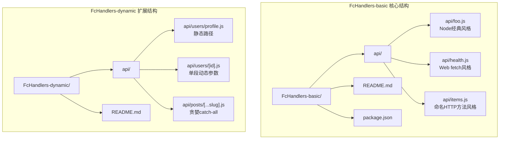
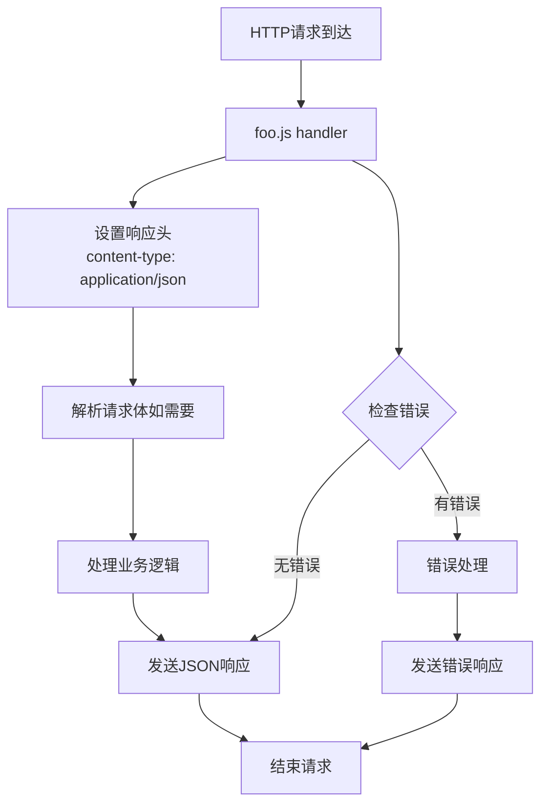
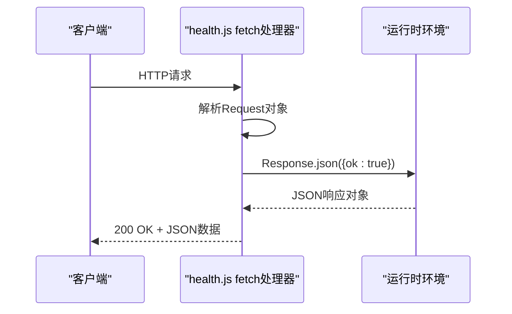
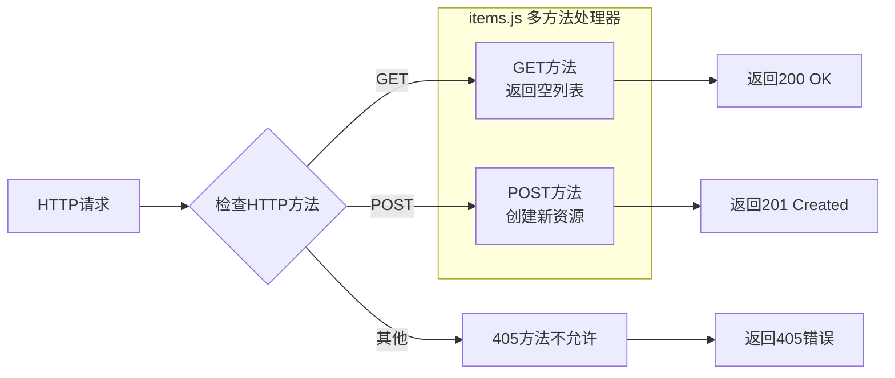
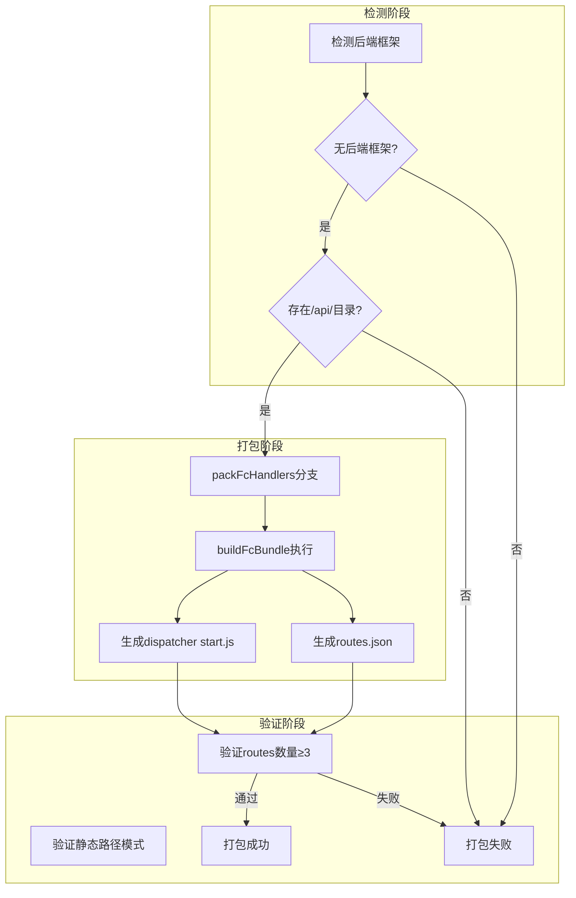
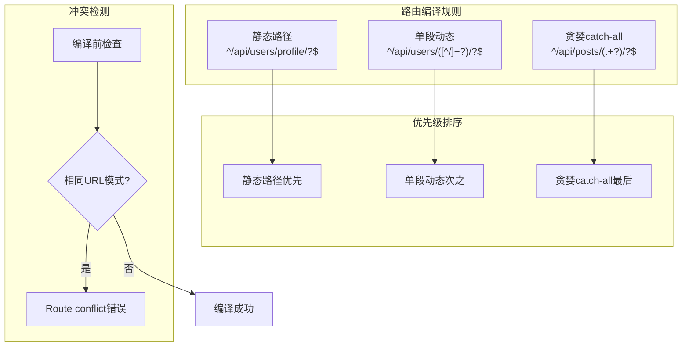
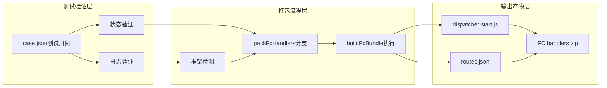

# 基础函数处理器测试

<cite>
**本文引用的文件**
- [README.md](file://FcHandlers-basic/README.md)
- [package.json](file://FcHandlers-basic/package.json)
- [foo.js](file://FcHandlers-basic/api/foo.js)
- [health.js](file://FcHandlers-basic/api/health.js)
- [items.js](file://FcHandlers-basic/api/items.js)
- [README.md](file://FcHandlers-dynamic/README.md)
- [[...slug].js](file://FcHandlers-dynamic/api/posts/[...slug].js)
- [[id].js](file://FcHandlers-dynamic/api/users/[id].js)
- [profile.js](file://FcHandlers-dynamic/api/users/profile.js)
- [case.json](file://case.json)
</cite>

## 目录
1. [简介](#简介)
2. [项目结构](#项目结构)
3. [核心组件](#核心组件)
4. [架构概览](#架构概览)
5. [详细组件分析](#详细组件分析)
6. [依赖关系分析](#依赖关系分析)
7. [性能考虑](#性能考虑)
8. [故障排除指南](#故障排除指南)
9. [结论](#结论)
10. [附录](#附录)

## 简介

FcHandlers-basic项目是一个专门用于测试基础函数处理器（FC Handlers）的夹具（fixture）。该项目的核心目标是验证无后端框架场景下的函数处理器打包流程，特别是测试Step中的packFcHandlers分支逻辑。

该项目通过在`/api/`目录下放置三种典型的handler风格来模拟真实的应用场景：
- Node经典`(req, res)`风格
- Web fetch对象风格
- 命名HTTP方法（GET/POST）风格

测试的关键要求包括：
- TestStep必须走`packFcHandlers`分支（既无后端框架依赖）
- backend-runtime的`buildFcBundle`需要生成dispatcher start.js + routes.json
- routes中至少包含3条静态路径

## 项目结构

FcHandlers-basic项目采用简洁的目录结构设计，专注于演示不同类型的函数处理器风格：

**图表来源**
- [README.md:1-13](file://FcHandlers-basic/README.md#L1-L13)
- [README.md:1-17](file://FcHandlers-dynamic/README.md#L1-L17)

**章节来源**
- [README.md:1-13](file://FcHandlers-basic/README.md#L1-L13)
- [package.json:1-6](file://FcHandlers-basic/package.json#L1-L6)

## 核心组件

### Node经典handler风格

Node经典风格是最传统的Web处理器实现方式，使用标准的Node.js回调模式：

**图表来源**
- [foo.js:1-6](file://FcHandlers-basic/api/foo.js#L1-L6)

### Web fetch对象handler风格

Fetch风格是现代Web标准的函数处理器实现，基于Fetch API规范：

**图表来源**
- [health.js:1-7](file://FcHandlers-basic/api/health.js#L1-L7)

### 命名HTTP方法handler风格

命名HTTP方法风格允许在同一文件中定义多个HTTP方法处理器：

**图表来源**
- [items.js:1-4](file://FcHandlers-basic/api/items.js#L1-L4)

**章节来源**
- [foo.js:1-6](file://FcHandlers-basic/api/foo.js#L1-L6)
- [health.js:1-7](file://FcHandlers-basic/api/health.js#L1-L7)
- [items.js:1-4](file://FcHandlers-basic/api/items.js#L1-L4)

## 架构概览

FcHandlers-basic项目展示了函数处理器打包系统的核心工作流程：

**图表来源**
- [README.md:9-12](file://FcHandlers-basic/README.md#L9-L12)
- [case.json:355-371](file://case.json#L355-L371)

## 详细组件分析

### Node经典handler实现详解

Node经典风格handler遵循传统Node.js回调模式，具有以下特点：

**实现特征**：
- 使用`module.exports`导出函数
- 接收`req`和`res`参数
- 手动设置响应头和状态码
- 使用`res.end()`发送响应

**最佳实践**：
-  stic路径优先于动态路径
- 错误处理应该包含适当的HTTP状态码
- 响应内容应该设置正确的Content-Type

### Web fetch对象handler实现详解

Fetch风格handler基于现代Web标准，提供了更简洁的API：

**实现特征**：
- 导出包含`fetch`方法的对象
- 使用`Response.json()`创建JSON响应
- 自动处理Content-Type设置
- 更好的异步处理能力

**最佳实践**：
- 利用现代浏览器兼容性
- 减少样板代码
- 更清晰的错误处理

### 命名HTTP方法handler实现详解

命名HTTP方法风格允许多种HTTP方法在同一文件中处理：

**实现特征**：
- 使用`exports.GET`、`exports.POST`等命名导出
- 每个方法处理特定的HTTP动词
- 可以在同一文件中管理相关的CRUD操作

**最佳实践**：
- 将相关的HTTP方法组织在同一文件中
- 保持方法职责单一
- 适当的错误处理和状态码设置

### 路由编译和冲突检测

FcHandlers-dynamic项目展示了更复杂的路由编译逻辑：

**图表来源**
- [README.md:9-16](file://FcHandlers-dynamic/README.md#L9-L16)

**章节来源**
- [README.md:1-17](file://FcHandlers-dynamic/README.md#L1-L17)
- [[...slug].js](file://FcHandlers-dynamic/api/posts/[...slug].js#L1-L8)
- [[id].js](file://FcHandlers-dynamic/api/users/[id].js#L1-L7)
- [profile.js:1-3](file://FcHandlers-dynamic/api/users/profile.js#L1-L3)

## 依赖关系分析

FcHandlers-basic项目的依赖关系相对简单，主要体现在测试验证层面：

**图表来源**
- [case.json:355-371](file://case.json#L355-L371)

**章节来源**
- [case.json:355-371](file://case.json#L355-L371)

## 性能考虑

在函数处理器测试中，性能主要体现在以下几个方面：

### 路由匹配效率
- 静态路径的匹配速度优于动态路径
- 优先级排序确保最优的匹配顺序
- 正则表达式优化减少匹配开销

### 内存使用优化
- 按需加载处理器模块
- 避免不必要的中间件链
- 合理的缓存策略

### 并发处理
- 异步处理提升并发性能
- 非阻塞I/O操作
- 合适的超时设置

## 故障排除指南

### 常见问题及解决方案

**问题1：打包失败 - Route conflict**
- **症状**：构建过程中出现Route conflict错误
- **原因**：多个文件编译为相同的URL模式
- **解决方案**：检查文件命名和路由模式，确保唯一性

**问题2：打包分支选择错误**
- **症状**：TestStep没有走packFcHandlers分支
- **原因**：项目中存在后端框架依赖
- **解决方案**：移除不必要的框架依赖或调整项目结构

**问题3：routes.json生成异常**
- **症状**：routes.json中缺少预期的静态路径
- **原因**：静态路径配置不符合要求
- **解决方案**：确保至少包含3条静态路径，遵循URL模式规范

**问题4：响应格式错误**
- **症状**：API响应格式不符合预期
- **原因**：Content-Type设置不正确或响应格式错误
- **解决方案**：检查响应头设置和JSON序列化

**章节来源**
- [README.md:9-12](file://FcHandlers-basic/README.md#L9-L12)
- [README.md:1-15](file://FcHandlers-conflict/README.md#L1-L15)

## 结论

FcHandlers-basic项目成功演示了三种核心的函数处理器风格及其在无后端框架场景下的打包流程。通过这个夹具，我们可以验证：

1. **packFcHandlers分支的正确性**：确保在无框架依赖时能够正确识别和处理函数处理器
2. **buildFcBundle的功能完整性**：验证dispatcher和routes文件的生成
3. **路由系统的健壮性**：支持静态、动态和通配符路由的混合使用
4. **冲突检测机制的有效性**：防止路由模式冲突导致的运行时错误

该项目为函数处理器的开发和测试提供了标准化的参考实现，有助于确保不同风格的处理器能够在统一的打包和部署流程中正常工作。

## 附录

### 最佳实践清单

**Node经典风格最佳实践**：
- 始终设置正确的Content-Type
- 实现完善的错误处理
- 使用异步操作避免阻塞

**Web fetch风格最佳实践**：
- 利用Response.json简化JSON响应
- 合理使用async/await语法
- 注意浏览器兼容性

**命名HTTP方法风格最佳实践**：
- 将相关的CRUD操作组织在同一文件
- 保持方法职责单一
- 实现一致的错误处理模式

**路由设计最佳实践**：
- 静态路径优先于动态路径
- 避免路由模式冲突
- 合理使用通配符路由
- 确保至少包含3条静态路径