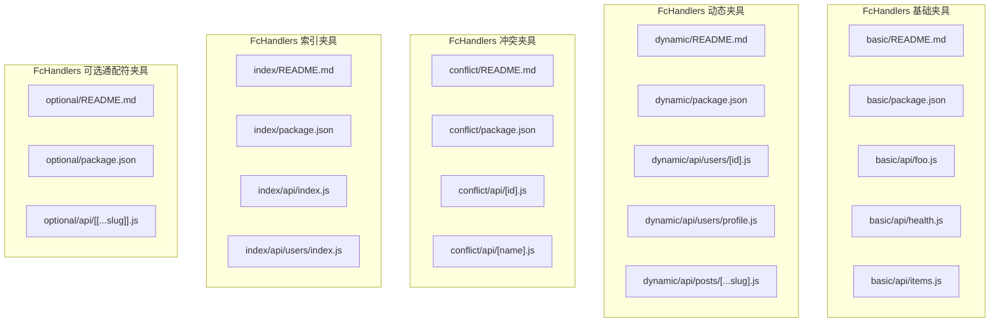
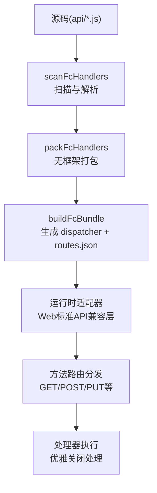
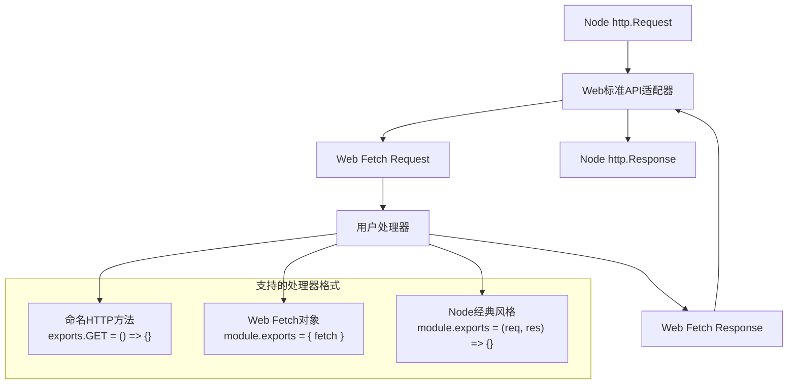
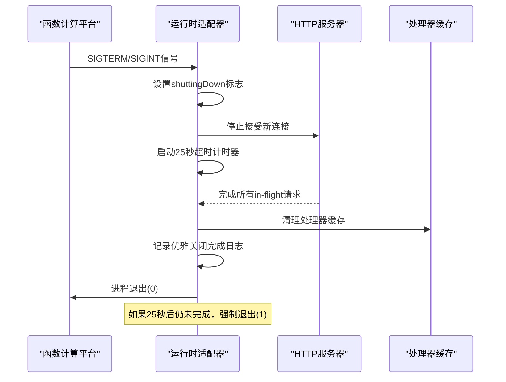
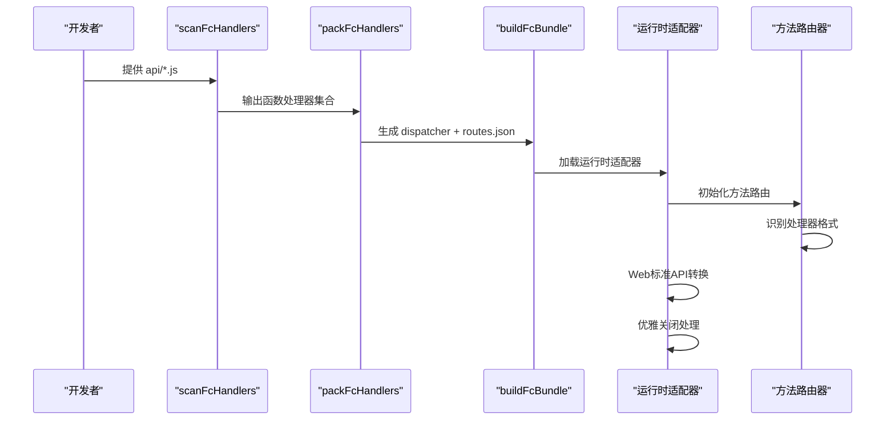
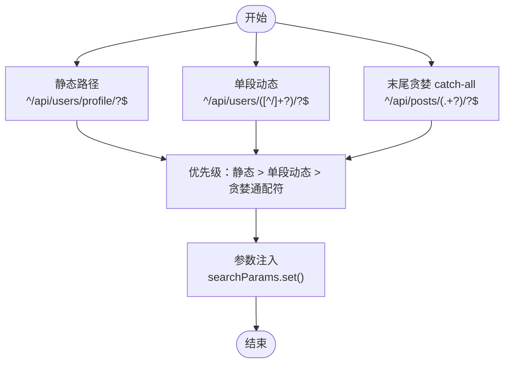
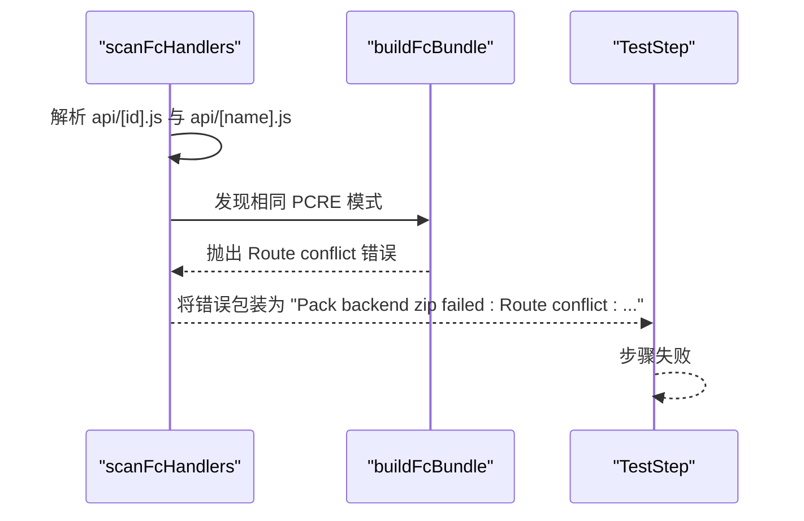
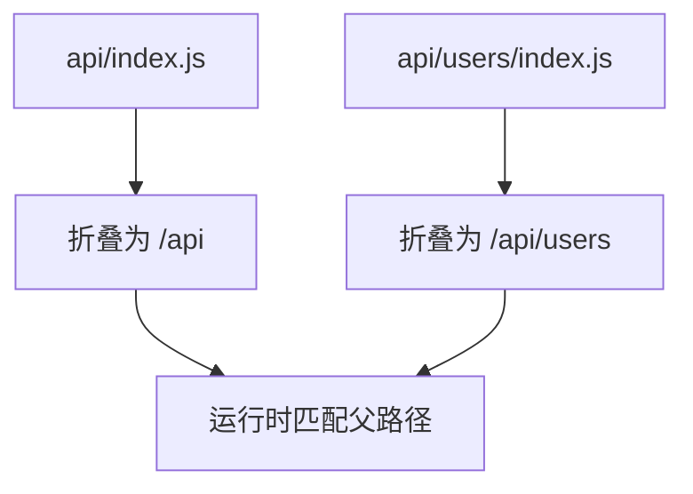
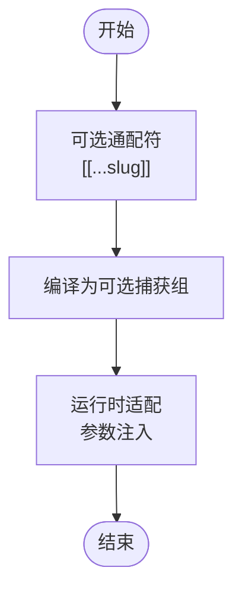
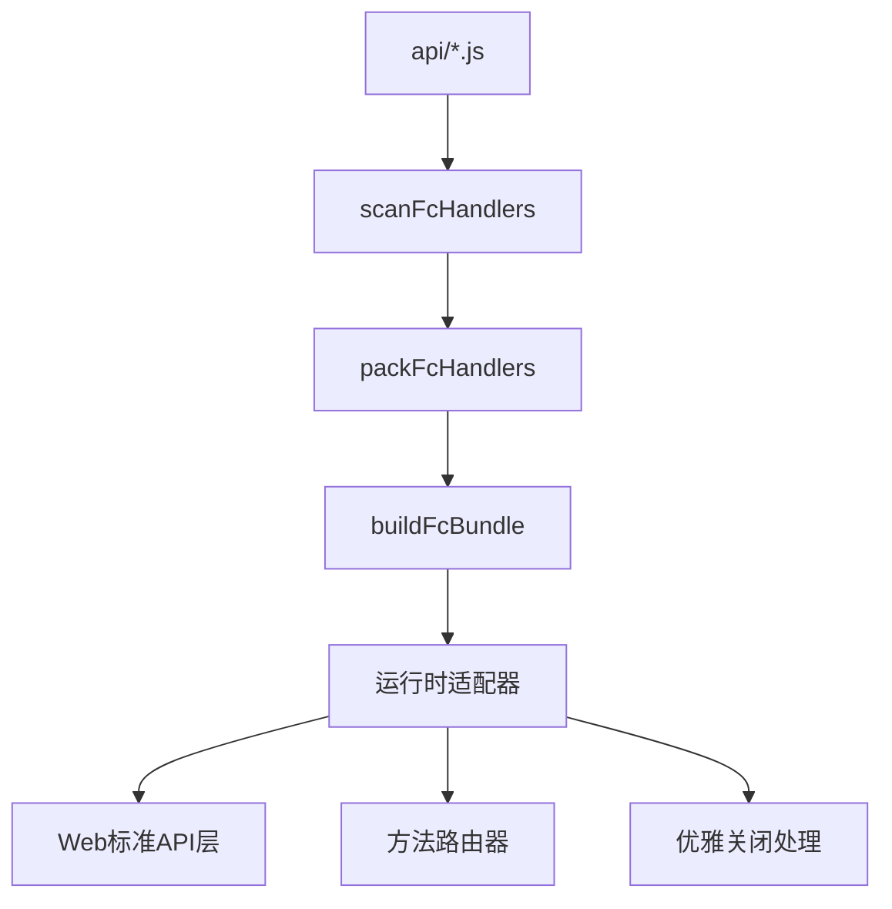

# 无服务器函数测试

<cite>
**本文引用的文件**
- [FcHandlers-basic/README.md](file://FcHandlers-basic/README.md)
- [FcHandlers-basic/package.json](file://FcHandlers-basic/package.json)
- [FcHandlers-basic/api/foo.js](file://FcHandlers-basic/api/foo.js)
- [FcHandlers-basic/api/health.js](file://FcHandlers-basic/api/health.js)
- [FcHandlers-basic/api/items.js](file://FcHandlers-basic/api/items.js)
- [FcHandlers-dynamic/README.md](file://FcHandlers-dynamic/README.md)
- [FcHandlers-dynamic/package.json](file://FcHandlers-dynamic/package.json)
- [FcHandlers-dynamic/api/users/[id].js](file://FcHandlers-dynamic/api/users/[id].js)
- [FcHandlers-dynamic/api/users/profile.js](file://FcHandlers-dynamic/api/users/profile.js)
- [FcHandlers-dynamic/api/posts/[...slug].js](file://FcHandlers-dynamic/api/posts/[...slug].js)
- [FcHandlers-conflict/README.md](file://FcHandlers-conflict/README.md)
- [FcHandlers-conflict/package.json](file://FcHandlers-conflict/package.json)
- [FcHandlers-conflict/api/[id].js](file://FcHandlers-conflict/api/[id].js)
- [FcHandlers-conflict/api/[name].js](file://FcHandlers-conflict/api/[name].js)
- [FcHandlers-index/README.md](file://FcHandlers-index/README.md)
- [FcHandlers-index/package.json](file://FcHandlers-index/package.json)
- [FcHandlers-index/api/index.js](file://FcHandlers-index/api/index.js)
- [FcHandlers-index/api/users/index.js](file://FcHandlers-index/api/users/index.js)
- [FcHandlers-optional/README.md](file://FcHandlers-optional/README.md)
- [FcHandlers-optional/package.json](file://FcHandlers-optional/package.json)
- [FcHandlers-optional/api/[[...slug]].js](file://FcHandlers-optional/api/[[...slug]].js)
- [backend-tests/express-listen/fc/start.mjs](file://backend-tests/express-listen/fc/start.mjs)
- [backend-tests/nestjs/fc/start.mjs](file://backend-tests/nestjs/fc/start.mjs)
- [backend-tests/express-listen/fc/runtime.json](file://backend-tests/express-listen/fc/runtime.json)
- [backend-tests/nestjs/fc/runtime.json](file://backend-tests/nestjs/fc/runtime.json)
</cite>

## 更新摘要
**变更内容**
- 新增运行时适配器系统章节，详细说明Web标准API兼容层实现
- 增强方法路由支持说明，包括命名HTTP方法导出机制
- 补充优雅关闭处理机制的详细实现原理
- 更新多层默认导出解包功能的架构说明
- 完善FC处理器模式的运行时行为描述

## 目录
1. [简介](#简介)
2. [项目结构](#项目结构)
3. [核心组件](#核心组件)
4. [架构总览](#架构总览)
5. [运行时适配器系统](#运行时适配器系统)
6. [详细组件分析](#详细组件分析)
7. [依赖关系分析](#依赖关系分析)
8. [性能考量](#性能考量)
9. [故障排查指南](#故障排查指南)
10. [结论](#结论)
11. [附录](#附录)

## 简介
本文件面向"FcHandlers"系列测试夹具，系统性阐述无服务器函数路由扫描与打包流程中的关键测试目标与实现原理。重点覆盖以下主题：
- 基础函数处理器风格：经典 Node `(req, res)`、Web Fetch 对象、命名 HTTP 方法导出
- 动态路由与通配符：单段动态参数、末尾贪婪 catch-all、可选通配符
- 路由冲突检测：同一模式编译冲突的报错机制
- 索引路由折叠：末尾 index 段的自动折叠规则
- **新增** 运行时适配器系统：Web标准API兼容层、方法路由、优雅关闭、多层导出解包
- 路由配置最佳实践与常见问题
- 无服务器函数的部署流程与运行时行为概览

## 项目结构
FcHandlers 系列通过多个独立夹具展示不同路由场景，每个夹具均位于独立目录中，包含：
- README.md：测试目标与预期行为说明
- package.json：项目元信息（名称、版本、私有标记）
- api/：按文件系统组织的路由处理器，遵循无后端框架约定

**图表来源**
- [FcHandlers-basic/README.md:1-13](file://FcHandlers-basic/README.md#L1-L13)
- [FcHandlers-basic/package.json:1-6](file://FcHandlers-basic/package.json#L1-L6)
- [FcHandlers-dynamic/README.md:1-17](file://FcHandlers-dynamic/README.md#L1-L17)
- [FcHandlers-dynamic/package.json:1-6](file://FcHandlers-dynamic/package.json#L1-L6)
- [FcHandlers-conflict/README.md:1-15](file://FcHandlers-conflict/README.md#L1-L15)
- [FcHandlers-conflict/package.json:1-6](file://FcHandlers-conflict/package.json#L1-L6)
- [FcHandlers-index/README.md:1-9](file://FcHandlers-index/README.md#L1-L9)
- [FcHandlers-index/package.json:1-6](file://FcHandlers-index/package.json#L1-L6)
- [FcHandlers-optional/README.md:1-10](file://FcHandlers-optional/README.md#L1-L10)
- [FcHandlers-optional/package.json:1-6](file://FcHandlers-optional/package.json#L1-L6)

**章节来源**
- [FcHandlers-basic/README.md:1-13](file://FcHandlers-basic/README.md#L1-L13)
- [FcHandlers-dynamic/README.md:1-17](file://FcHandlers-dynamic/README.md#L1-L17)
- [FcHandlers-conflict/README.md:1-15](file://FcHandlers-conflict/README.md#L1-L15)
- [FcHandlers-index/README.md:1-9](file://FcHandlers-index/README.md#L1-L9)
- [FcHandlers-optional/README.md:1-10](file://FcHandlers-optional/README.md#L1-L10)

## 核心组件
- 扫描器（scanFcHandlers）：负责遍历 api/ 目录，解析路由文件，构建路由表并进行冲突检测
- 打包器（packFcHandlers）：在无后端框架依赖场景下，生成可部署的函数处理器集合
- 构建器（buildFcBundle）：生成分发器入口与路由清单，供运行时匹配请求
- 路由编译器：将文件系统路径转换为正则表达式模式，并赋予优先级
- **新增** 运行时适配器：提供Web标准API兼容层，支持多种处理器格式

关键职责边界：
- 文件系统到路由模式映射：静态、动态、通配符、可选通配符
- 冲突检测：同一 PCRE 模式下的多路由定义
- 优先级排序：静态 > 单段动态 > 贪婪 catch-all
- 索引折叠：末尾 index 段去除，与父路径等价
- **新增** Web标准API适配：Node http.Server与Fetch API双向转换

**章节来源**
- [FcHandlers-basic/README.md:9-13](file://FcHandlers-basic/README.md#L9-L13)
- [FcHandlers-dynamic/README.md:9-17](file://FcHandlers-dynamic/README.md#L9-L17)
- [FcHandlers-conflict/README.md:10-15](file://FcHandlers-conflict/README.md#L10-L15)
- [FcHandlers-index/README.md:3-9](file://FcHandlers-index/README.md#L3-L9)

## 架构总览
下图展示了从源码到运行时的关键流程：扫描、编译、打包、构建与运行。

**图表来源**
- [FcHandlers-basic/README.md:9-12](file://FcHandlers-basic/README.md#L9-L12)
- [FcHandlers-dynamic/README.md:9-11](file://FcHandlers-dynamic/README.md#L9-L11)
- [FcHandlers-conflict/README.md:10-12](file://FcHandlers-conflict/README.md#L10-L12)
- [FcHandlers-index/README.md:8](file://FcHandlers-index/README.md#L8)

## 运行时适配器系统

### Web标准API兼容层
运行时适配器系统提供了完整的Web标准API兼容层，使开发者可以使用现代Web API编写无服务器函数：

**图表来源**
- [backend-tests/express-listen/fc/start.mjs:60-151](file://backend-tests/express-listen/fc/start.mjs#L60-L151)
- [backend-tests/nestjs/fc/start.mjs:60-151](file://backend-tests/nestjs/fc/start.mjs#L60-L151)

### 方法路由分发
系统支持多种处理器导出格式，按优先级进行智能识别和分发：

1. **命名HTTP方法导出**（最高优先级）
   - 支持 GET、POST、PUT、PATCH、DELETE、HEAD、OPTIONS
   - HEAD方法自动退化为GET处理
   - 未支持的方法返回405状态码

2. **Web Fetch对象导出**
   - 支持标准的fetch(request)接口
   - 返回Response对象的完整功能

3. **Node经典风格**
   - 传统的(req, res)回调函数
   - 保持向后兼容性

**章节来源**
- [backend-tests/express-listen/fc/start.mjs:153-188](file://backend-tests/express-listen/fc/start.mjs#L153-L188)
- [backend-tests/nestjs/fc/start.mjs:153-188](file://backend-tests/nestjs/fc/start.mjs#L153-L188)

### 优雅关闭处理机制
运行时实现了完善的优雅关闭机制，确保在进程终止时能够正确处理进行中的请求：

**图表来源**
- [backend-tests/express-listen/fc/start.mjs:207-240](file://backend-tests/express-listen/fc/start.mjs#L207-L240)
- [backend-tests/nestjs/fc/start.mjs:207-240](file://backend-tests/nestjs/fc/start.mjs#L207-L240)

### 多层默认导出解包
系统实现了类似Vercel @vercel/node的多层默认导出解包机制，支持各种模块导出模式：

- ESM命名空间对象：`{ default: app, ... }`
- CJS动态导入：`{ default: module.exports }`
- TypeScript编译产物：`{ default: { default: app } }`
- 自引用保护：避免循环引用导致死循环

**章节来源**
- [backend-tests/express-listen/fc/start.mjs:45-58](file://backend-tests/express-listen/fc/start.mjs#L45-L58)
- [backend-tests/nestjs/fc/start.mjs:45-58](file://backend-tests/nestjs/fc/start.mjs#L45-L58)

## 详细组件分析

### 基础函数处理器（FcHandlers-basic）
测试目标：
- 走 packFcHandlers 分支（无后端框架依赖）
- 生成 dispatcher 与 routes.json，其中至少包含三条静态路径
- **新增** 验证运行时适配器的三种处理器格式支持

处理器风格：
- 经典 Node 风格：`(req, res)` 形式
- Web Fetch 风格：导出对象包含 `fetch(request)` 方法
- 命名 HTTP 方法：分别导出 GET/POST 等方法，返回 JSON 响应

**图表来源**
- [FcHandlers-basic/README.md:9-12](file://FcHandlers-basic/README.md#L9-L12)
- [FcHandlers-basic/api/foo.js:1-6](file://FcHandlers-basic/api/foo.js#L1-L6)
- [FcHandlers-basic/api/health.js:1-7](file://FcHandlers-basic/api/health.js#L1-L7)
- [FcHandlers-basic/api/items.js:1-4](file://FcHandlers-basic/api/items.js#L1-L4)
- [backend-tests/express-listen/fc/start.mjs:284-319](file://backend-tests/express-listen/fc/start.mjs#L284-L319)

**章节来源**
- [FcHandlers-basic/README.md:1-13](file://FcHandlers-basic/README.md#L1-L13)
- [FcHandlers-basic/package.json:1-6](file://FcHandlers-basic/package.json#L1-L6)
- [FcHandlers-basic/api/foo.js:1-6](file://FcHandlers-basic/api/foo.js#L1-L6)
- [FcHandlers-basic/api/health.js:1-7](file://FcHandlers-basic/api/health.js#L1-L7)
- [FcHandlers-basic/api/items.js:1-4](file://FcHandlers-basic/api/items.js#L1-L4)

### 动态路由与通配符（FcHandlers-dynamic）
测试目标：
- 路由总数为 3 条
- 模式编译正确：静态、单段动态、末尾贪婪 catch-all
- 静态优先于动态（优先级排序）
- **新增** 验证运行时适配器对动态参数的正确处理

模式编译要点：
- 静态路径：以固定段结尾，带可选尾随斜杠
- 单段动态参数：捕获一段非斜杠字符
- 贪婪 catch-all：捕获剩余所有段
- **新增** 参数注入：动态参数自动注入到查询字符串

**图表来源**
- [FcHandlers-dynamic/README.md:9-17](file://FcHandlers-dynamic/README.md#L9-L17)
- [FcHandlers-dynamic/api/users/profile.js:1-3](file://FcHandlers-dynamic/api/users/profile.js#L1-L3)
- [FcHandlers-dynamic/api/users/[id].js:1-7](file://FcHandlers-dynamic/api/users/[id].js#L1-L7)
- [FcHandlers-dynamic/api/posts/[...slug].js:1-8](file://FcHandlers-dynamic/api/posts/[...slug].js#L1-L8)
- [backend-tests/express-listen/fc/start.mjs:376-385](file://backend-tests/express-listen/fc/start.mjs#L376-L385)

**章节来源**
- [FcHandlers-dynamic/README.md:1-17](file://FcHandlers-dynamic/README.md#L1-L17)
- [FcHandlers-dynamic/package.json:1-6](file://FcHandlers-dynamic/package.json#L1-L6)
- [FcHandlers-dynamic/api/users/profile.js:1-3](file://FcHandlers-dynamic/api/users/profile.js#L1-L3)
- [FcHandlers-dynamic/api/users/[id].js:1-7](file://FcHandlers-dynamic/api/users/[id].js#L1-L7)
- [FcHandlers-dynamic/api/posts/[...slug].js:1-8](file://FcHandlers-dynamic/api/posts/[...slug].js#L1-L8)

### 路由冲突检测（FcHandlers-conflict）
测试目标：
- 同一 PCRE 模式编译冲突（例如 `^/api/([^/]+?)/?$`）
- scanFcHandlers 在构建阶段检测到冲突并抛错
- 流程失败，提示"Route conflict"

**图表来源**
- [FcHandlers-conflict/README.md:10-15](file://FcHandlers-conflict/README.md#L10-L15)
- [FcHandlers-conflict/api/[id].js:1-3](file://FcHandlers-conflict/api/[id].js#L1-L3)
- [FcHandlers-conflict/api/[name].js:1-3](file://FcHandlers-conflict/api/[name].js#L1-L3)

**章节来源**
- [FcHandlers-conflict/README.md:1-15](file://FcHandlers-conflict/README.md#L1-L15)
- [FcHandlers-conflict/package.json:1-6](file://FcHandlers-conflict/package.json#L1-L6)
- [FcHandlers-conflict/api/[id].js:1-3](file://FcHandlers-conflict/api/[id].js#L1-L3)
- [FcHandlers-conflict/api/[name].js:1-3](file://FcHandlers-conflict/api/[name].js#L1-L3)

### 索引路由折叠（FcHandlers-index）
测试目标：
- 顶层与子目录的 index.js 被识别并折叠到父路径
- 顶层 index.js → URL `/api`
- 子目录 index.js → URL `/api/users`

**图表来源**
- [FcHandlers-index/README.md:3-9](file://FcHandlers-index/README.md#L3-L9)
- [FcHandlers-index/api/index.js:1-3](file://FcHandlers-index/api/index.js#L1-L3)
- [FcHandlers-index/api/users/index.js:1-3](file://FcHandlers-index/api/users/index.js#L1-L3)

**章节来源**
- [FcHandlers-index/README.md:1-9](file://FcHandlers-index/README.md#L1-L9)
- [FcHandlers-index/package.json:1-6](file://FcHandlers-index/package.json#L1-L6)
- [FcHandlers-index/api/index.js:1-3](file://FcHandlers-index/api/index.js#L1-L3)
- [FcHandlers-index/api/users/index.js:1-3](file://FcHandlers-index/api/users/index.js#L1-L3)

### 可选通配符（FcHandlers-optional）
测试目标：
- 支持可选通配符语法，作为对传统 catch-all 的补充
- 用于处理可选的剩余路径段
- **新增** 验证可选通配符在运行时适配器中的正确处理

**图表来源**
- [FcHandlers-optional/README.md:1-10](file://FcHandlers-optional/README.md#L1-L10)
- [FcHandlers-optional/api/[[...slug]].js](file://FcHandlers-optional/api/[[...slug]].js)

**章节来源**
- [FcHandlers-optional/README.md:1-10](file://FcHandlers-optional/README.md#L1-L10)
- [FcHandlers-optional/package.json:1-6](file://FcHandlers-optional/package.json#L1-L6)

## 依赖关系分析
- 无后端框架依赖：packFcHandlers 分支确保在不引入 Express/Koa/Nest 等框架的情况下完成打包
- 运行时依赖：基于浏览器/Node Web 标准接口（如 fetch、Response），兼容无服务器环境
- 路由依赖：依赖文件系统到路由的约定式映射与正则编译
- **新增** 运行时适配器依赖：需要Node 18+以支持Web全局变量

**图表来源**
- [FcHandlers-basic/README.md:9-12](file://FcHandlers-basic/README.md#L9-L12)
- [FcHandlers-dynamic/README.md:9-11](file://FcHandlers-dynamic/README.md#L9-L11)
- [FcHandlers-conflict/README.md:10-12](file://FcHandlers-conflict/README.md#L10-L12)
- [FcHandlers-index/README.md:8](file://FcHandlers-index/README.md#L8)
- [backend-tests/express-listen/fc/start.mjs:190-199](file://backend-tests/express-listen/fc/start.mjs#L190-L199)

**章节来源**
- [FcHandlers-basic/README.md:9-12](file://FcHandlers-basic/README.md#L9-L12)
- [FcHandlers-dynamic/README.md:9-11](file://FcHandlers-dynamic/README.md#L9-L11)
- [FcHandlers-conflict/README.md:10-12](file://FcHandlers-conflict/README.md#L10-L12)
- [FcHandlers-index/README.md:8](file://FcHandlers-index/README.md#L8)

## 性能考量
- 路由数量与编译复杂度：动态段越多，正则匹配开销越大；建议控制动态段数量与层级
- 优先级排序：静态优先于动态，有助于减少回溯与误匹配
- 索引折叠：避免重复注册等价路径，减少 routes.json 规模
- 处理器风格：Web Fetch 风格与命名方法导出更贴近标准，便于缓存与复用
- **新增** 处理器缓存：首次请求触发动态导入，后续请求复用Promise，避免重复加载
- **新增** 优雅关闭优化：25秒超时机制防止无限等待，确保资源及时释放

## 故障排查指南
- 路由冲突
  - 症状：构建时报错"Route conflict"
  - 排查：检查是否存在相同 PCRE 模式的多个路由定义（如单段动态参数）
  - 解决：调整文件命名或路径，确保唯一性
  - 参考
    - [FcHandlers-conflict/README.md:10-15](file://FcHandlers-conflict/README.md#L10-L15)
    - [FcHandlers-conflict/api/[id].js:1-3](file://FcHandlers-conflict/api/[id].js#L1-L3)
    - [FcHandlers-conflict/api/[name].js:1-3](file://FcHandlers-conflict/api/[name].js#L1-L3)

- 动态段未命中
  - 症状：请求未匹配到预期处理器
  - 排查：确认模式编译是否符合预期（静态 > 单段动态 > 贪婪通配符）
  - 解决：调整路径结构或使用更精确的静态路由
  - 参考
    - [FcHandlers-dynamic/README.md:9-17](file://FcHandlers-dynamic/README.md#L9-L17)
    - [FcHandlers-dynamic/api/users/[id].js:1-7](file://FcHandlers-dynamic/api/users/[id].js#L1-L7)
    - [FcHandlers-dynamic/api/posts/[...slug].js:1-8](file://FcHandlers-dynamic/api/posts/[...slug].js#L1-L8)

- 索引路由未折叠
  - 症状：访问 /api 或 /api/users 未命中
  - 排查：确认是否使用了 index.js 并处于正确目录
  - 解决：将处理器置于 index.js 并置于目标路径末尾
  - 参考
    - [FcHandlers-index/README.md:3-9](file://FcHandlers-index/README.md#L3-L9)
    - [FcHandlers-index/api/index.js:1-3](file://FcHandlers-index/api/index.js#L1-L3)
    - [FcHandlers-index/api/users/index.js:1-3](file://FcHandlers-index/api/users/index.js#L1-L3)

- 可选通配符无效
  - 症状：[[...slug]] 未生效
  - 排查：确认语法与路径层级是否正确
  - 解决：参考可选通配符夹具示例进行修正
  - 参考
    - [FcHandlers-optional/README.md:1-10](file://FcHandlers-optional/README.md#L1-L10)
    - [FcHandlers-optional/api/[[...slug]].js](file://FcHandlers-optional/api/[[...slug]].js)

- **新增** Web全局变量不可用
  - 症状：运行时报错"Web globals not available; need Node >= 18"
  - 排查：确认Node版本是否满足要求（18+）
  - 解决：升级Node版本或降级处理器格式
  - 参考
    - [backend-tests/express-listen/fc/start.mjs:190-199](file://backend-tests/express-listen/fc/start.mjs#L190-L199)

- **新增** 处理器格式识别失败
  - 症状：运行时抛出"Cannot detect handler shape"错误
  - 排查：确认处理器导出格式是否符合支持的标准
  - 解决：使用命名HTTP方法、Web Fetch对象或Node经典风格之一
  - 参考
    - [backend-tests/express-listen/fc/start.mjs:367-368](file://backend-tests/express-listen/fc/start.mjs#L367-L368)

- **新增** 优雅关闭超时
  - 症状：进程在SIGTERM后长时间不退出
  - 排查：检查是否有长时间运行的任务或未释放的资源
  - 解决：优化处理器逻辑，确保及时完成请求处理
  - 参考
    - [backend-tests/express-listen/fc/start.mjs:223-228](file://backend-tests/express-listen/fc/start.mjs#L223-L228)

## 结论
FcHandlers 系列夹具通过多样化的路由场景验证了无服务器函数在扫描、编译、打包与运行时匹配方面的关键能力。其设计强调：
- 约定式路由与严格冲突检测
- 明确的优先级与模式编译规则
- 与 Web 标准的兼容性
- 对索引折叠与可选通配符的支持
- **新增** 完善的运行时适配器系统，提供Web标准API兼容层、方法路由、优雅关闭和多格式处理器支持

这些特性共同保证了在无后端框架依赖下的稳定与可预测行为，同时为开发者提供了现代化的编程体验和强大的运行时支持。

## 附录
- 部署流程（概览）
  - 扫描：遍历 api/ 目录，解析处理器
  - 打包：生成函数处理器集合（无框架依赖）
  - 构建：输出 dispatcher 与 routes.json
  - 部署：上传至无服务器平台，运行时按路由匹配执行
  - **新增** 运行时适配：加载运行时适配器，初始化Web标准API兼容层
  - **新增** 方法路由：根据处理器格式选择相应的路由策略
  - **新增** 优雅关闭：监听进程信号，确保资源正确释放
- 调试技巧
  - 逐步核对 routes.json 中的 pattern 与 priority
  - 使用最小化示例快速定位冲突或模式问题
  - 利用可选通配符与索引折叠简化路径设计
  - **新增** 检查处理器格式是否符合运行时适配器要求
  - **新增** 监控优雅关闭日志，确保进程正常退出
  - **新增** 验证Web全局变量可用性，确保Node版本符合要求