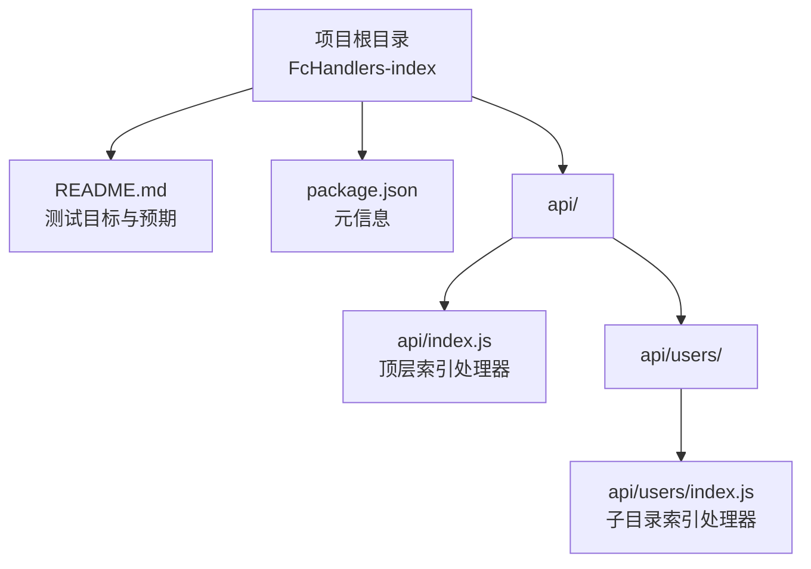
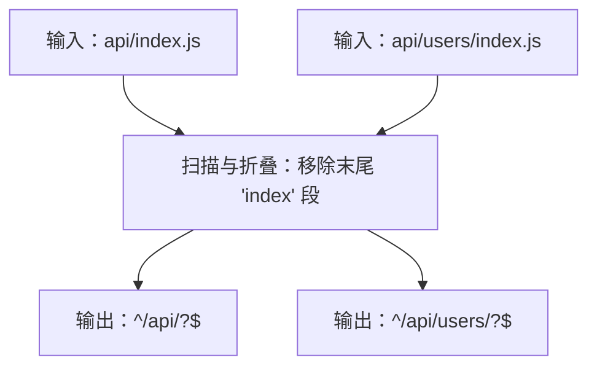
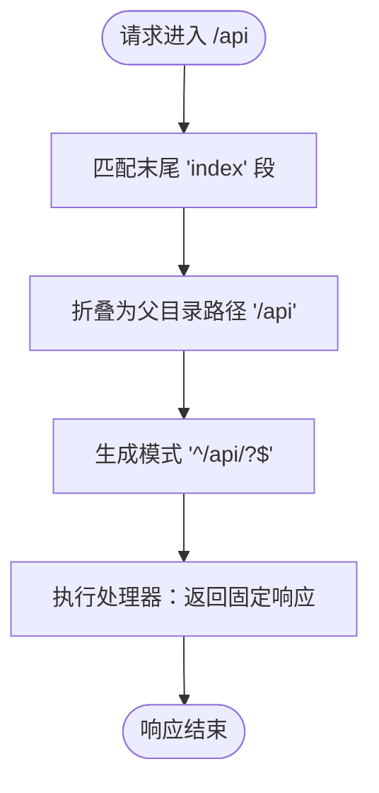
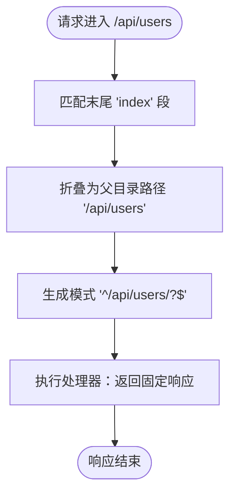
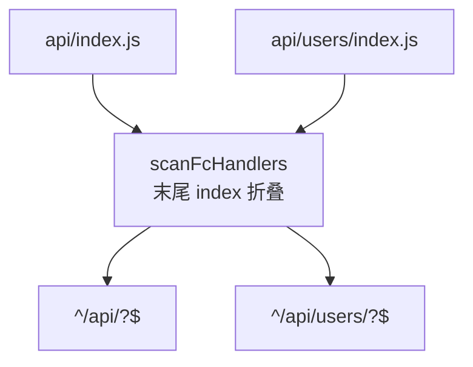

# 索引路由处理器测试

<cite>
**本文引用的文件**
- [README.md](file://FcHandlers-index/README.md)
- [package.json](file://FcHandlers-index/package.json)
- [api/index.js](file://FcHandlers-index/api/index.js)
- [api/users/index.js](file://FcHandlers-index/api/users/index.js)
- [README.md](file://FcHandlers-dynamic/README.md)
- [README.md](file://FcHandlers-conflict/README.md)
- [README.md](file://Express-with-api/README.md)
- [api/foo.js](file://Express-with-api/api/foo.js)
</cite>

## 目录
1. [简介](#简介)
2. [项目结构](#项目结构)
3. [核心组件](#核心组件)
4. [架构总览](#架构总览)
5. [详细组件分析](#详细组件分析)
6. [依赖关系分析](#依赖关系分析)
7. [性能考量](#性能考量)
8. [故障排查指南](#故障排查指南)
9. [结论](#结论)
10. [附录](#附录)

## 简介
本文件面向 FcHandlers-index 项目，聚焦“索引路由处理器测试”的技术文档。该测试旨在验证文件系统路由中“末尾 index 折叠”规则：扫描器将位于目录末尾的 index.js 路由段去除，使其与父目录路由等价。这一行为与 Vercel 文件系统路由约定一致，确保在无后端框架场景下，/api/index.js 和 /api/users/index.js 分别折叠为 /api 与 /api/users。

测试目标明确：
- 验证 scanFcHandlers 对末尾 index 段的折叠处理；
- 验证生成的 URL 模式与预期一致；
- 作为基准样例，支撑后续更复杂的路由规则（动态段、冲突检测、优先级排序）测试。

## 项目结构
FcHandlers-index 项目采用“无后端框架”的最小化结构，仅包含以下关键文件：
- 根目录：README.md（说明测试目标与预期）、package.json（元信息）
- api 目录：
  - api/index.js：顶层索引处理器
  - api/users/index.js：子目录索引处理器

图表来源
- [README.md:1-9](file://FcHandlers-index/README.md#L1-L9)
- [package.json:1-6](file://FcHandlers-index/package.json#L1-L6)
- [api/index.js:1-3](file://FcHandlers-index/api/index.js#L1-L3)
- [api/users/index.js:1-3](file://FcHandlers-index/api/users/index.js#L1-L3)

章节来源
- [README.md:1-9](file://FcHandlers-index/README.md#L1-L9)
- [package.json:1-6](file://FcHandlers-index/package.json#L1-L6)

## 核心组件
- 顶层索引处理器（api/index.js）
  - 作用：将 /api/index.js 折叠为 /api，返回固定响应。
  - 匹配模式：^/api/?$
- 子目录索引处理器（api/users/index.js）
  - 作用：将 /api/users/index.js 折叠为 /api/users，返回固定响应。
  - 匹配模式：^/api/users/?$

上述两个处理器共同验证“末尾 index 折叠”规则的一致性与正确性，确保扫描器对目录末尾 index 段的处理符合 Vercel 文件系统路由约定。

章节来源
- [api/index.js:1-3](file://FcHandlers-index/api/index.js#L1-L3)
- [api/users/index.js:1-3](file://FcHandlers-index/api/users/index.js#L1-L3)
- [README.md:5-6](file://FcHandlers-index/README.md#L5-L6)

## 架构总览
从测试视角，FcHandlers-index 的“架构”由三部分组成：
- 输入层：api/index.js 与 api/users/index.js
- 扫描与折叠层：scanFcHandlers 对末尾 index 段进行折叠，生成等价 URL 模式
- 输出层：对外暴露的路由模式 ^/api/?$ 与 ^/api/users/?$

图表来源
- [README.md:5-6](file://FcHandlers-index/README.md#L5-L6)
- [api/index.js:1-3](file://FcHandlers-index/api/index.js#L1-L3)
- [api/users/index.js:1-3](file://FcHandlers-index/api/users/index.js#L1-L3)

## 详细组件分析

### 顶层索引处理器（api/index.js）
- 文件位置：FcHandlers-index/api/index.js
- 作用：作为根级索引处理器，验证“末尾 index 折叠”规则在根目录下的行为。
- 匹配规则：折叠为 /api，对应正则 ^/api/?$。
- 处理机制：导出一个请求处理函数，直接结束响应，返回固定文本。

图表来源
- [README.md:5-6](file://FcHandlers-index/README.md#L5-L6)
- [api/index.js:1-3](file://FcHandlers-index/api/index.js#L1-L3)

章节来源
- [api/index.js:1-3](file://FcHandlers-index/api/index.js#L1-L3)
- [README.md:5-6](file://FcHandlers-index/README.md#L5-L6)

### 子目录索引处理器（api/users/index.js）
- 文件位置：FcHandlers-index/api/users/index.js
- 作用：验证“末尾 index 折叠”规则在嵌套子目录下的行为。
- 匹配规则：折叠为 /api/users，对应正则 ^/api/users/?$。
- 处理机制：导出一个请求处理函数，直接结束响应，返回固定文本。

图表来源
- [README.md:6-6](file://FcHandlers-index/README.md#L6-L6)
- [api/users/index.js:1-3](file://FcHandlers-index/api/users/index.js#L1-L3)

章节来源
- [api/users/index.js:1-3](file://FcHandlers-index/api/users/index.js#L1-L3)
- [README.md:6-6](file://FcHandlers-index/README.md#L6-L6)

### 路由配置差异与优先级
- 差异点
  - 顶层索引处理器（api/index.js）折叠为 /api；
  - 子目录索引处理器（api/users/index.js）折叠为 /api/users。
- 优先级处理
  - 在无后端框架场景下，FcHandlers-index 仅验证“末尾 index 折叠”，不涉及动态段或冲突检测。
  - 更复杂的优先级与冲突检测示例可参考 FcHandlers-dynamic 与 FcHandlers-conflict 的 README 描述，它们展示了静态优先于动态、以及冲突检测的场景。

章节来源
- [README.md:5-6](file://FcHandlers-index/README.md#L5-L6)
- [README.md:10-16](file://FcHandlers-dynamic/README.md#L10-L16)
- [README.md:10-14](file://FcHandlers-conflict/README.md#L10-L14)

### 与其他路由测试的关系
- 与 Express-with-api 的关系
  - 当检测到 Express 框架时，TestStep 会优先走 packBackendFramework 分支，而非 packFcHandlers。这体现了“有框架时由框架自身路由处理”的原则，避免与 FC dispatcher 冲突。
- 与 FcHandlers-dynamic、FcHandlers-conflict 的关系
  - FcHandlers-index 专注于“末尾 index 折叠”的基础能力验证；
  - FcHandlers-dynamic 展示静态优先于动态的优先级排序；
  - FcHandlers-conflict 展示冲突检测与错误处理。

章节来源
- [README.md:5-9](file://Express-with-api/README.md#L5-L9)
- [api/foo.js:1-4](file://Express-with-api/api/foo.js#L1-L4)
- [README.md:10-16](file://FcHandlers-dynamic/README.md#L10-L16)
- [README.md:10-14](file://FcHandlers-conflict/README.md#L10-L14)

## 依赖关系分析
- 组件内聚
  - api/index.js 与 api/users/index.js 分别代表根级与子目录的索引处理器，职责清晰、内聚性强。
- 组件耦合
  - 两者均依赖 scanFcHandlers 的“末尾 index 折叠”能力，耦合点在于路径与模式的生成一致性。
- 外部依赖
  - 本测试为“无后端框架”场景，不引入额外运行时依赖，仅依赖扫描器的路由解析与折叠逻辑。

图表来源
- [README.md:5-6](file://FcHandlers-index/README.md#L5-L6)
- [api/index.js:1-3](file://FcHandlers-index/api/index.js#L1-L3)
- [api/users/index.js:1-3](file://FcHandlers-index/api/users/index.js#L1-L3)

## 性能考量
- 路由扫描阶段
  - 末尾 index 折叠属于轻量级字符串处理，开销极低，对整体扫描性能影响可忽略。
- 请求处理阶段
  - 两个索引处理器均为简单响应，无复杂计算或 I/O，响应时间短。
- 建议
  - 在大规模路由场景中，保持路由层级扁平化有助于减少路径解析成本；
  - 将常用入口统一收敛至索引处理器，便于统一管理与缓存。

## 故障排查指南
- 症状：扫描后路由模式不符合预期
  - 排查要点：确认文件是否位于目录末尾且命名为 index.js；检查扫描器是否正确识别并折叠末尾 index 段。
- 症状：与后端框架冲突
  - 排查要点：若项目被检测为 Express 等框架，TestStep 会优先走 packBackendFramework 分支，不会走 packFcHandlers。此时应检查框架探测结果与路由分支选择逻辑。
- 症状：出现路由冲突
  - 排查要点：参考 FcHandlers-conflict 的冲突检测机制，确保不同路由文件生成的 URL 模式不重复。

章节来源
- [README.md:5-9](file://Express-with-api/README.md#L5-L9)
- [api/foo.js:1-4](file://Express-with-api/api/foo.js#L1-L4)
- [README.md:10-14](file://FcHandlers-conflict/README.md#L10-L14)

## 结论
FcHandlers-index 通过两个最小化的索引处理器，精准验证了“末尾 index 折叠”规则在文件系统路由中的行为。该测试为更复杂的路由规则（动态段、优先级、冲突检测）提供了可靠的基线，确保扫描器在无后端框架场景下能够稳定地生成正确的路由模式。

## 附录

### RESTful API 设计中的索引路由应用与最佳实践
- 应用场景
  - 根资源入口：使用 /api/index.js 作为根资源入口，统一对外提供聚合接口。
  - 资源组入口：使用 /api/users/index.js 作为用户资源组入口，统一处理用户相关操作。
- 最佳实践
  - 使用索引处理器作为资源组的统一入口，便于版本控制与权限管理；
  - 保持路径简洁与层级扁平，减少歧义与维护成本；
  - 在存在后端框架时，遵循“框架优先”的原则，避免与 FC dispatcher 冲突。

### 常见使用模式
- 根级索引：/api → api/index.js
- 子目录索引：/api/users → api/users/index.js
- 与动态段结合：在需要时将静态索引与动态段组合，遵循“静态优先于动态”的优先级规则。

章节来源
- [README.md:5-6](file://FcHandlers-index/README.md#L5-L6)
- [README.md:10-16](file://FcHandlers-dynamic/README.md#L10-L16)