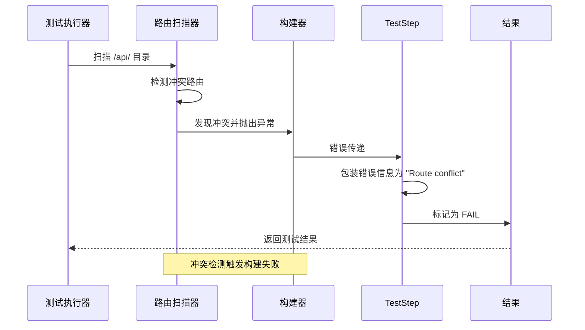
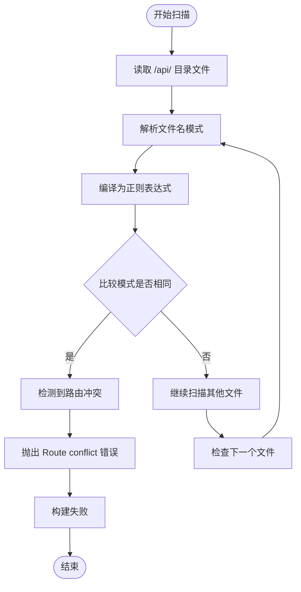
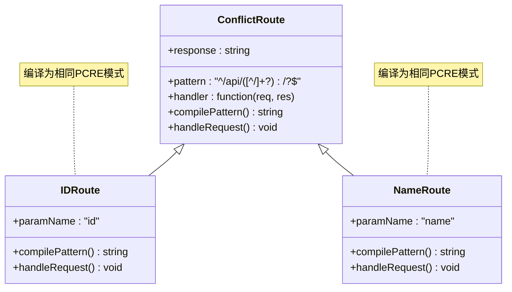
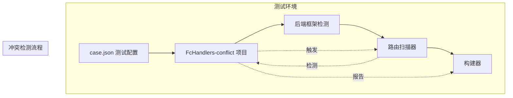

# 路由冲突检测测试

<cite>
**本文档引用的文件**
- [README.md](file://FcHandlers-conflict/README.md)
- [package.json](file://FcHandlers-conflict/package.json)
- [[id].js](file://FcHandlers-conflict/api/[id].js)
- [[name].js](file://FcHandlers-conflict/api/[name].js)
- [case.json](file://case.json)
- [README.md](file://FcHandlers-dynamic/README.md)
- [README.md](file://FcHandlers-basic/README.md)
</cite>

## 更新摘要
**变更内容**
- 更新了错误消息格式，从 `Pack backend zip failed: Route conflict: ...` 简化为 `Route conflict`
- 修正了测试断言中的错误消息描述
- 更新了故障排除指南中的错误消息参考

## 目录
1. [简介](#简介)
2. [项目结构](#项目结构)
3. [核心组件](#核心组件)
4. [架构概览](#架构概览)
5. [详细组件分析](#详细组件分析)
6. [依赖关系分析](#依赖关系分析)
7. [性能考虑](#性能考虑)
8. [故障排除指南](#故障排除指南)
9. [结论](#结论)
10. [附录](#附录)

## 简介

FcHandlers-conflict 是一个专门用于测试路由冲突检测的示例项目。该项目的核心目标是验证当同一层级存在多个动态参数路由时，系统能够正确检测并处理路由冲突。

该项目通过在 `/api/` 目录下故意放置两个会编译出相同 URL 模式的文件来模拟冲突场景：
- `api/[id].js` - 动态参数路由
- `api/[name].js` - 另一个动态参数路由

这两个路由文件都会编译为相同的正则表达式模式 `^/api/([^/]+?)/?$`，从而产生路由冲突。

## 项目结构

FcHandlers-conflict 项目采用简洁的文件组织结构：

```mermaid
graph TB
subgraph "FcHandlers-conflict 项目结构"
Root[项目根目录]
API[api/ 目录]
ID[id].js]
NAME[name].js]
README[README.md]
PACKAGE[package.json]
Root --> API
Root --> README
Root --> PACKAGE
API --> ID
API --> NAME
ID -.->|"编译为相同PCRE模式"| NAME
ID -.->|"编译为相同PCRE模式"| NAME
end
```

**图表来源**
- [README.md:1-15](file://FcHandlers-conflict/README.md#L1-L15)
- [package.json:1-6](file://FcHandlers-conflict/package.json#L1-L6)

**章节来源**
- [README.md:1-15](file://FcHandlers-conflict/README.md#L1-L15)
- [package.json:1-6](file://FcHandlers-conflict/package.json#L1-L6)

## 核心组件

### 冲突路由定义

项目中的两个冲突路由文件都采用了动态参数模式：

| 路由文件 | 编译后的URL模式 | 冲突原因 |
|---------|----------------|----------|
| `[id].js` | `^/api/([^/]+?)/?$` | 匹配任意单个路径段 |
| `[name].js` | `^/api/([^/]+?)/?$` | 匹配任意单个路径段 |

### 测试目标

根据项目文档，该测试的主要目标包括：

1. **路由扫描**：`scanFcHandlers` 检测到路由冲突并抛出错误
2. **构建流程**：走 `packFcHandlers` 分支
3. **错误包装**：TestStep 将错误包装为 `Route conflict`（**已更新**）
4. **测试失败**：整个 step 标记为 FAIL

**更新** 错误消息格式已简化，不再包含 `Pack backend zip failed: Route conflict: ...` 的完整前缀

**章节来源**
- [README.md:10-14](file://FcHandlers-conflict/README.md#L10-L14)

## 架构概览

FcHandlers-conflict 测试的整体架构流程如下：



**图表来源**
- [README.md:10-14](file://FcHandlers-conflict/README.md#L10-L14)

## 详细组件分析

### 冲突检测机制

#### 路由编译过程



**图表来源**
- [README.md:8-14](file://FcHandlers-conflict/README.md#L8-L14)

#### 冲突路由的实现细节

两个冲突路由文件都采用了相同的实现模式：



**图表来源**
- [README.md:3-8](file://FcHandlers-conflict/README.md#L3-L8)
- [[id].js](file://FcHandlers-conflict/api/[id].js#L1-L3)
- [[name].js](file://FcHandlers-conflict/api/[name].js#L1-L3)

**章节来源**
- [[id].js](file://FcHandlers-conflict/api/[id].js#L1-L3)
- [[name].js](file://FcHandlers-conflict/api/[name].js#L1-L3)

### 路由优先级规则

为了更好地理解冲突检测，需要对比其他路由测试案例中的优先级规则：

```mermaid
graph LR
subgraph "路由优先级排序"
Static[静态路由<br/>如: profile.js]
Dynamic[单段动态参数<br/>如: [id].js]
CatchAll[贪婪catch-all<br/>如: [...slug].js]
end
Static --> |"优先级最高"| Dynamic
Dynamic --> |"优先级中等"| CatchAll
CatchAll --> |"优先级最低"| Static
```

**图表来源**
- [README.md](file://FcHandlers-dynamic/README.md#L16)

**章节来源**
- [README.md:10-16](file://FcHandlers-dynamic/README.md#L10-L16)

### 冲突避免策略

基于项目测试案例，可以总结出以下冲突避免策略：

1. **唯一性原则**：确保同一层级的路由参数具有不同的名称
2. **明确的路由设计**：避免使用可能产生相同模式的参数名称
3. **提前检测**：在构建阶段就进行路由冲突检测

## 依赖关系分析

### 测试环境依赖



**图表来源**
- [case.json:392-408](file://case.json#L392-L408)

**章节来源**
- [case.json:392-408](file://case.json#L392-L408)

### 路由编译依赖

```mermaid
flowchart TD
API[api/ 目录] --> ID[id].js]
API --> NAME[name].js]
ID --> Pattern1["编译模式: ^/api/([^/]+?)/?$"]
NAME --> Pattern2["编译模式: ^/api/([^/]+?)/?$"]
Pattern1 --> Conflict{"模式相同?"}
Pattern2 --> Conflict
Conflict --> |是| Error["Route conflict 错误"]
Conflict --> |否| Success["构建成功"]
```

**图表来源**
- [README.md](file://FcHandlers-conflict/README.md#L8)

## 性能考虑

虽然路由冲突检测本身是一个相对轻量级的操作，但在大型项目中仍需考虑以下性能因素：

1. **扫描效率**：优化文件系统扫描算法
2. **模式比较**：使用高效的正则表达式比较策略
3. **缓存机制**：对已编译的模式进行缓存以避免重复计算

## 故障排除指南

### 常见冲突场景

| 冲突类型 | 示例 | 解决方案 |
|---------|------|----------|
| 相同参数名 | `[id].js` 和 `[id].js` | 更改参数名为 `[userId].js` 和 `[userName].js` |
| 相同模式 | `[id].js` 和 `[name].js` | 使用不同参数名或调整路由结构 |
| 混合冲突 | 静态+动态+通配符冲突 | 重新设计路由层次结构 |

### 调试步骤

1. **检查路由模式**：确认所有路由编译后的正则表达式
2. **验证文件命名**：确保同一层级的文件名不产生相同模式
3. **审查构建日志**：关注冲突检测相关的错误信息

**更新** 错误消息格式已简化为 `Route conflict`，不再包含 `Pack backend zip failed: Route conflict: ...` 的完整前缀

### 错误消息参考

**更新** 测试配置中使用的错误消息格式为：
- `Route conflict`（**已更新**）

**章节来源**
- [README.md:10-14](file://FcHandlers-conflict/README.md#L10-L14)
- [case.json:404-407](file://case.json#L404-L407)

## 结论

FcHandlers-conflict 项目成功演示了路由冲突检测的重要性和实现方式。通过在构建阶段早期发现并报告路由冲突，可以有效避免运行时的路由解析问题。

该测试案例的关键价值在于：
- 验证了路由冲突检测机制的有效性
- 提供了冲突避免的最佳实践指导
- 展示了完整的错误处理和报告流程

**更新** 错误消息格式的简化提供了更清晰和简洁的错误反馈，使开发者能够更快地识别和解决问题。

## 附录

### 最佳实践清单

1. **路由设计原则**
   - 确保同一层级路由参数的唯一性
   - 避免使用可能产生歧义的参数名称
   - 考虑路由的可维护性和扩展性

2. **冲突预防措施**
   - 在开发阶段进行路由模式验证
   - 建立代码审查中的路由冲突检查
   - 使用自动化工具进行路由冲突检测

3. **错误处理策略**
   - 提供清晰的冲突描述信息
   - 指导开发者如何修复冲突
   - 记录冲突检测的日志信息

4. **错误消息格式**
   - 使用简洁明了的错误消息格式
   - 避免冗余的前缀信息
   - 确保错误消息的可读性和实用性