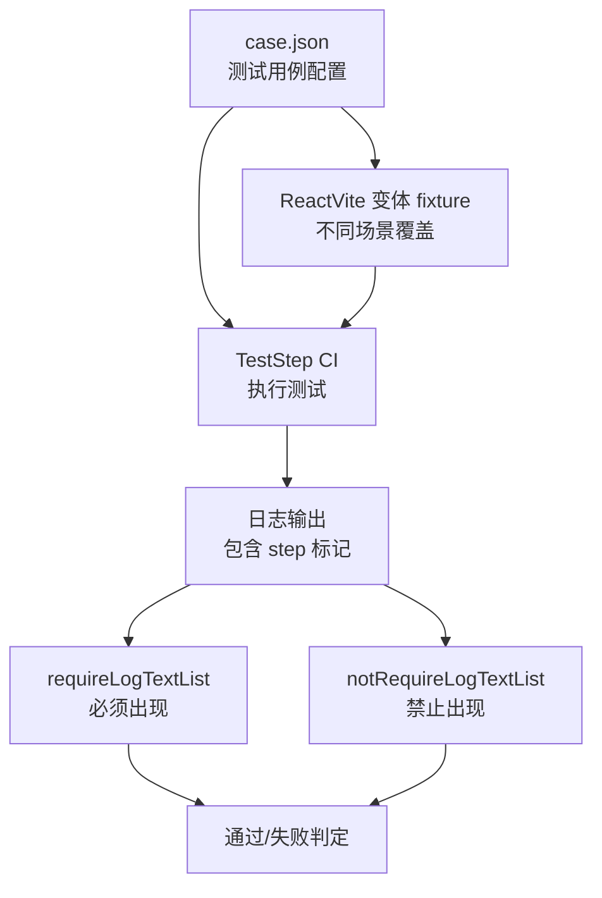
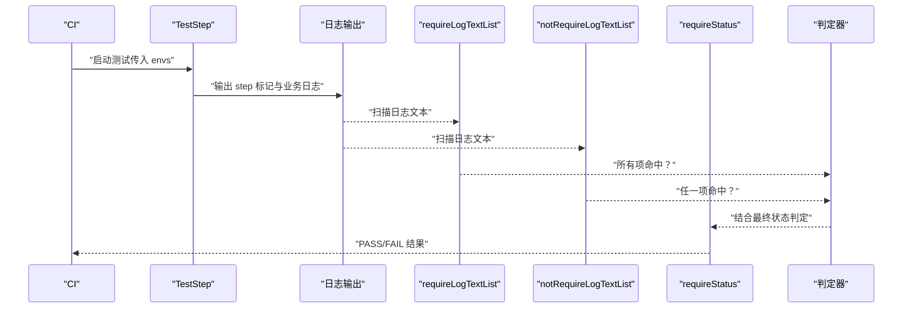
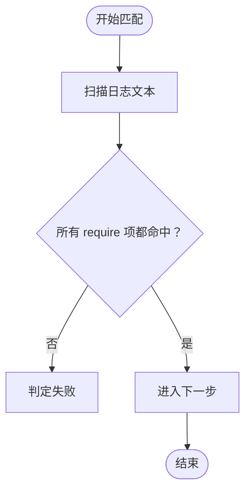
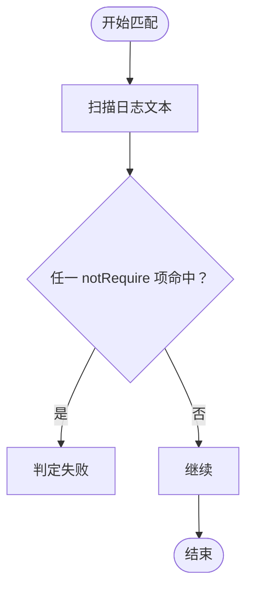
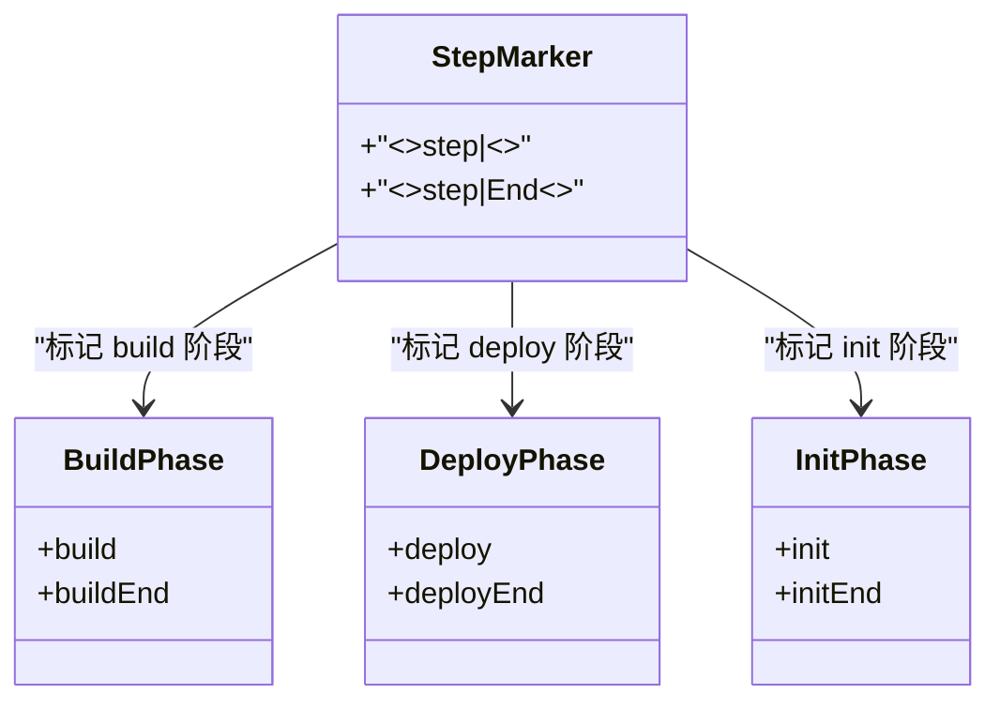
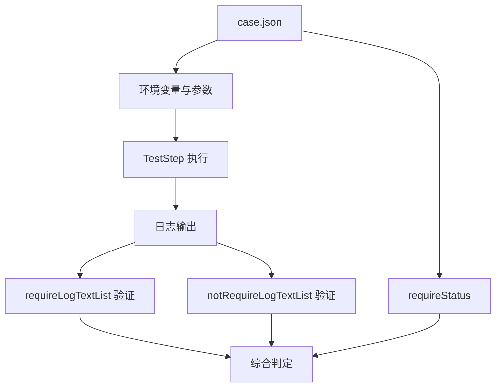

# 日志验证机制

<cite>
**本文引用的文件**
- [case.json](file://case.json)
- [SKILL.md](file://.claude/skills/add-test-case/SKILL.md)
- [README.md](file://README.md)
- [Fullstack-react-express/README.md](file://Fullstack-react-express/README.md)
</cite>

## 目录
1. [简介](#简介)
2. [项目结构](#项目结构)
3. [核心组件](#核心组件)
4. [架构概览](#架构概览)
5. [详细组件分析](#详细组件分析)
6. [依赖分析](#依赖分析)
7. [性能考虑](#性能考虑)
8. [故障排除指南](#故障排除指南)
9. [结论](#结论)
10. [附录](#附录)

## 简介
本文件面向日志验证系统的技术文档，重点解释以下内容：
- requireLogTextList 与 notRequireLogTextList 字段的工作原理与验证机制
- 特殊标记 <<LOG>>step|buildEnd<</LOG>> 的格式、含义与使用场景
- 正则表达式支持的实现方式与匹配规则
- 日志验证的配置示例与最佳实践
- 日志过滤与匹配的性能考量
- 常见日志验证场景的解决方案与故障排除指南
- 日志验证与测试状态判断的关系与影响

该仓库是一个端到端测试床，每条测试用例通过 CI 运行 TestStep，并依据 case.json 中声明的日志期望与最终状态进行通过/失败判定。

## 项目结构
本仓库采用"用例配置 + 多种 fixture 场景"的组织方式：
- 顶层 case.json：集中定义所有测试用例，包含用例名称、环境变量、期望最终状态、日志验证列表等
- 多个 ReactVite 变体 fixture：用于覆盖不同场景（如缺少特定文件、不同包管理器、不同 Node 版本等）
- 文档 SKILL.md：说明 case.json 字段语义、step 标记、参数清单与加 case 的标准流程
- README.md：简要介绍如何新增测试用例及字段说明
- Fullstack-react-express fixture：展示复杂场景下的日志断言要点

**图表来源**
- [case.json](file://case.json)
- [SKILL.md](file://.claude/skills/add-test-case/SKILL.md)

**章节来源**
- [case.json](file://case.json)
- [SKILL.md](file://.claude/skills/add-test-case/SKILL.md)
- [README.md](file://README.md)

## 核心组件
本节聚焦日志验证的核心字段与机制：

- requireLogTextList
  - 语义：数组中所有字符串都必须在日志中命中（AND 关系）
  - 支持：正则字面量（即字符串形式的正则表达式）
  - 作用：确保关键里程碑与业务行为按预期发生
  - 示例路径：[requireLogTextList 示例:15-17](file://case.json#L15-L17)，[更多示例:23-26](file://case.json#L23-L26)

- notRequireLogTextList
  - 语义：数组中任意一个字符串命中即判定失败
  - 作用：用于负向断言，防止某些不应该发生的流程或行为出现
  - 示例路径：[负向断言示例:598-600](file://case.json#L598-L600)

- 特殊标记 <<LOG>>step|<name><</LOG>>
  - 语义：TestStep 在每个阶段开始/结束时打的状态机标记
  - 作用：作为最稳定的断言锚点，比业务日志更不易漂移
  - 常见值：build/buildEnd、deploy/deployEnd、init/initEnd 等
  - 示例路径：[step 标记说明:85-95](file://.claude/skills/add-test-case/SKILL.md#L85-L95)

- 正则表达式支持
  - 说明：requireLogTextList 支持正则字面量字符串
  - 用途：灵活匹配动态内容（如版本号、时间戳、临时 ID 等）
  - 示例路径：[正则支持说明](file://.claude/skills/add-test-case/SKILL.md#L55)

**章节来源**
- [case.json:590-600](file://case.json#L590-L600)
- [.claude/skills/add-test-case/SKILL.md:26-56](file://.claude/skills/add-test-case/SKILL.md#L26-L56)
- [.claude/skills/add-test-case/SKILL.md:85-95](file://.claude/skills/add-test-case/SKILL.md#L85-L95)

## 架构概览
日志验证在测试执行中的整体流程如下：

**图表来源**
- [case.json](file://case.json)
- [.claude/skills/add-test-case/SKILL.md:26-56](file://.claude/skills/add-test-case/SKILL.md#L26-L56)

## 详细组件分析

### requireLogTextList 验证机制
- AND 关系：数组中每个元素都必须在日志中找到，否则判定失败
- 正则支持：允许使用正则字面量字符串，以应对动态内容
- 最佳实践：
  - 至少包含一个 step 标记锚点（如 buildEnd），确保关键阶段完成
  - 将业务关键信息与稳定性强的锚点组合使用
  - 对动态内容使用合适的正则模式，避免过度宽泛导致误判

**图表来源**
- [.claude/skills/add-test-case/SKILL.md](file://.claude/skills/add-test-case/SKILL.md#L55)

**章节来源**
- [.claude/skills/add-test-case/SKILL.md](file://.claude/skills/add-test-case/SKILL.md#L55)

### notRequireLogTextList 验证机制
- OR 关系：只要数组中任何一个字符串在日志中命中，即判定失败
- 适用场景：负向断言（如非生产分支不应触发部署）
- 最佳实践：
  - 与 requireLogTextList 配合使用，形成"必须出现 + 禁止出现"的双重约束
  - 选择具有明确语义的标记或关键字，避免误伤

**图表来源**
- [.claude/skills/add-test-case/SKILL.md](file://.claude/skills/add-test-case/SKILL.md#L56)

**章节来源**
- [.claude/skills/add-test-case/SKILL.md](file://.claude/skills/add-test-case/SKILL.md#L56)

### 特殊标记 <<LOG>>step|<name><</LOG>> 的格式与含义
- 格式：固定前后缀包裹 + 管道分隔符 + 名称 + 结束标签
- 含义：TestStep 在阶段开始（如 build、deploy、init）与结束（各自 + End）时输出的状态标记
- 使用建议：
  - 在 requireLogTextList 中至少包含一个以 End 结尾的标记，确保阶段完整执行
  - 与 notRequireLogTextList 配合，限制不希望出现的阶段

**图表来源**
- [.claude/skills/add-test-case/SKILL.md:85-95](file://.claude/skills/add-test-case/SKILL.md#L85-L95)

**章节来源**
- [.claude/skills/add-test-case/SKILL.md:85-95](file://.claude/skills/add-test-case/SKILL.md#L85-L95)

### 正则表达式支持与匹配规则
- 实现方式：将字符串视为正则字面量进行匹配
- 匹配规则：
  - 字面量匹配：直接比较字符串是否出现在日志中
  - 正则匹配：对字符串进行正则解析，匹配成功即视为命中
- 注意事项：
  - 正则表达式应简洁明确，避免过度宽泛导致误判
  - 对包含特殊字符的字符串，注意转义与边界控制

**章节来源**
- [.claude/skills/add-test-case/SKILL.md](file://.claude/skills/add-test-case/SKILL.md#L55)

### 配置示例与最佳实践
- 基础示例
  - 创建新仓库：包含 step 标记锚点，确保构建阶段完成
  - 包管理器测试：包含安装成功的提示与构建结束标记
  - 非生产分支：要求构建结束标记出现，且禁止部署标记出现
- 最佳实践
  - 至少包含一个 step 标记锚点（如 buildEnd）
  - 将业务关键信息与稳定性强的锚点组合使用
  - 对动态内容使用合适的正则模式
  - 与 requireStatus 配合，形成"日志 + 状态"的双重保障

**章节来源**
- [case.json:1-200](file://case.json#L1-L200)
- [.claude/skills/add-test-case/SKILL.md:221-276](file://.claude/skills/add-test-case/SKILL.md#L221-L276)

### 日志验证与测试状态判断的关系
- requireStatus：期望最终状态（SUCCESS/FAIL/CANCEL/空串表示不校验）
- 日志验证：通过 requireLogTextList 与 notRequireLogTextList 提供过程性证据
- 综合判定：通常需要日志锚点与最终状态共同满足，才能判定为 PASS
- 影响关系：日志验证有助于提前发现流程异常，减少对最终状态的依赖

**章节来源**
- [.claude/skills/add-test-case/SKILL.md:26-56](file://.claude/skills/add-test-case/SKILL.md#L26-L56)
- [README.md:21-31](file://README.md#L21-L31)

## 依赖分析
日志验证依赖于以下组件与关系：
- case.json：提供测试用例配置（包括日志验证列表与最终状态）
- TestStep：执行测试并输出日志，包含 step 标记
- 验证器：扫描日志，分别处理 requireLogTextList 与 notRequireLogTextList
- 状态判断器：结合 requireStatus 与日志验证结果进行最终判定

**图表来源**
- [case.json](file://case.json)
- [.claude/skills/add-test-case/SKILL.md:26-56](file://.claude/skills/add-test-case/SKILL.md#L26-L56)

**章节来源**
- [case.json](file://case.json)
- [.claude/skills/add-test-case/SKILL.md:26-56](file://.claude/skills/add-test-case/SKILL.md#L26-L56)

## 性能考虑
- 匹配策略
  - 顺序扫描：从上到下依次检查 require 与 notRequire 列表
  - 早期短路：一旦发现 notRequire 命中立即失败，避免多余扫描
- 正则优化
  - 避免过于复杂的正则，减少回溯成本
  - 对动态内容使用锚点与限定符，缩小匹配范围
- 日志规模
  - 控制日志输出量，避免无关噪声干扰
  - 优先使用稳定且唯一的 step 标记作为断言锚点
- 执行效率
  - 将最可能失败的 notRequire 项放在前面，提高失败检测速度
  - 合理拆分 require 列表，避免单条规则过于复杂

## 故障排除指南
- 常见问题
  - 步骤标记缺失：未包含以 End 结尾的 step 标记，导致无法确认阶段完成
  - 正则过于宽泛：匹配范围过大，导致误判或漏判
  - 负向断言误伤：notRequire 列表中包含与业务相关但不希望出现的关键词
- 排查步骤
  - 检查日志中是否出现期望的 step 标记
  - 验证正则表达式的准确性与边界控制
  - 确认 notRequire 列表是否包含不应出现的关键词
  - 对比相同 fixture 的其他用例，确认配置一致性
- 参考示例
  - 非生产分支不部署：要求构建结束标记出现，且禁止部署标记出现
  - 包管理器测试：包含安装成功的提示与构建结束标记

**章节来源**
- [.claude/skills/add-test-case/SKILL.md:162-168](file://.claude/skills/add-test-case/SKILL.md#L162-L168)
- [case.json:258-276](file://case.json#L258-L276)

## 结论
日志验证通过 requireLogTextList 与 notRequireLogTextList 提供了对测试流程的精细化控制，结合 step 标记锚点与正则表达式支持，能够有效提升测试的稳定性与可维护性。最佳实践强调使用稳定的锚点、合理的正则模式以及与最终状态的协同判断，从而在复杂场景下仍能可靠地识别流程异常并指导修复。

## 附录
- 相关文档与示例
  - [Fullstack-react-express/README.md:28-36](file://Fullstack-react-express/README.md#L28-L36)：展示复杂场景下的日志断言要点
  - [SKILL.md:221-276](file://.claude/skills/add-test-case/SKILL.md#L221-L276)：真实用例与加 case 的标准流程

**章节来源**
- [Fullstack-react-express/README.md:28-36](file://Fullstack-react-express/README.md#L28-L36)
- [.claude/skills/add-test-case/SKILL.md:221-276](file://.claude/skills/add-test-case/SKILL.md#L221-L276)