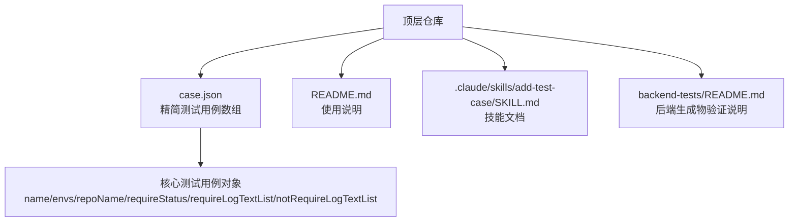
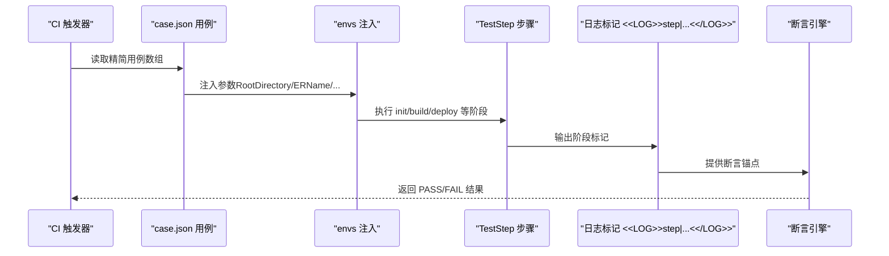
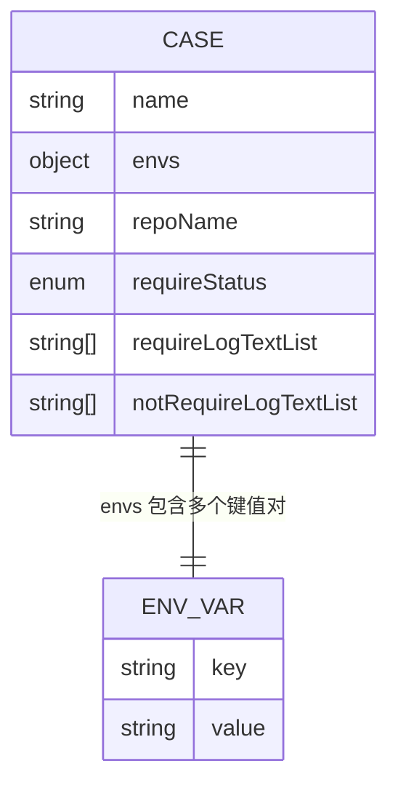
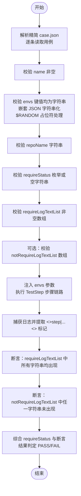
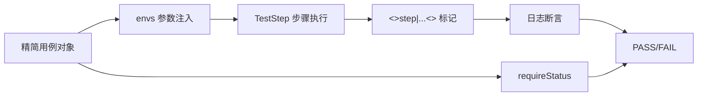

# 测试用例定义

<cite>
**本文引用的文件**
- [case.json](file://case.json)
- [README.md](file://README.md)
- [.claude/skills/add-test-case/SKILL.md](file://.claude/skills/add-test-case/SKILL.md)
- [backend-tests/README.md](file://backend-tests/README.md)
</cite>

## 更新摘要
**变更内容**
- 重构了 case.json 结构，移除了大量冗余的后端测试模板配置
- 简化了测试用例定义，仅保留核心测试逻辑
- 优化了字段验证和断言机制
- 提升了测试执行效率和可维护性

## 目录
1. [简介](#简介)
2. [项目结构](#项目结构)
3. [核心组件](#核心组件)
4. [架构概览](#架构概览)
5. [详细组件分析](#详细组件分析)
6. [依赖分析](#依赖分析)
7. [性能考虑](#性能考虑)
8. [故障排查指南](#故障排查指南)
9. [结论](#结论)
10. [附录](#附录)

## 简介
本文件面向"测试用例定义"场景，系统性阐述 case.json 的数据模型与使用规范。经过重大重构后，case.json 现在专注于核心测试定义，移除了冗余的后端测试模板配置，使测试结构更加简洁高效。每条用例在 CI 中逐条执行，依据声明的"期望日志片段"和"最终状态"判断通过或失败。

## 项目结构
- 顶层 case.json：精简后的测试用例数组，每条用例描述一次具体的测试场景
- README.md：简要说明如何新增用例及字段含义
- .claude/skills/add-test-case/SKILL.md：权威技能文档，包含字段细节、常用参数清单、log 标记、反模式与真实示例
- backend-tests/README.md：补充说明与顶层 case.json 解耦的后端生成物验证体系

**图表来源**
- [case.json](file://case.json)
- [README.md](file://README.md)
- [.claude/skills/add-test-case/SKILL.md](file://.claude/skills/add-test-case/SKILL.md)
- [backend-tests/README.md](file://backend-tests/README.md)

## 核心组件
本节聚焦 case.json 的数据模型与字段规范，结合仓库中的实际用例进行说明。

### 数据结构
- case.json 是一个 JSON 数组，数组元素为"测试用例对象"。每个用例对象包含以下核心字段：
  - name：字符串，必填，用于显示在测试结果中
  - envs：对象，必填，键值均为字符串。嵌套 JSON 需手动序列化为字符串；支持特殊占位符 "$RANDOM"
  - repoName：字符串，必填。若为空字符串，则触发"创新仓库"流程（通常配合 ERName="$RANDOM"）
  - requireStatus：字符串，取值为 "SUCCESS" | "FAIL" | "CANCEL" | ""。空字符串表示不校验状态
  - requireLogTextList：字符串数组，必填。数组中所有字符串都必须在日志中命中（AND 关系）。支持正则字面量
  - notRequireLogTextList：字符串数组，可选。数组中任一字符串命中即判定失败（NOT 关系）

### 字段验证规则
- name：非空字符串，建议唯一表达被测维度
- envs：键值均为字符串；嵌套 JSON 必须字符串化；支持 "$RANDOM" 占位符
- repoName：字符串；若为空字符串，表示创新仓库流程
- requireStatus：枚举值或空字符串；空字符串表示不校验
- requireLogTextList：非空数组；建议包含至少一个 <<LOG>>step|...End<</LOG>> 标记，确保覆盖关键阶段
- notRequireLogTextList：可选数组；用于负向断言，如"非生产分支不应触发部署"

### 字段组合与约束
- RootDirectory 必须以 "/" 开头，指向某个 fixture 子目录
- ERName="$RANDOM" 通常与 TemplateName="$RANDOM" 搭配，用于创新仓库场景
- requireStatus 与 requireLogTextList 应协同使用，避免仅凭状态判断导致路径错误
- notRequireLogTextList 与 requireLogTextList 可共同使用，形成"必须出现 AND 禁止出现"的复合断言

**章节来源**
- [case.json](file://case.json)
- [.claude/skills/add-test-case/SKILL.md](file://.claude/skills/add-test-case/SKILL.md)

## 架构概览
case.json 作为"测试编排层"的入口，驱动 CI 执行 TestStep 步骤链路。每条用例通过 envs 将参数注入 TestStep，按顺序执行 init/build/deploy 等阶段，并在关键节点打上 <<LOG>>step|...<</LOG>> 标记。测试引擎根据 requireLogTextList 与 requireStatus 判定用例通过或失败。

**图表来源**
- [.claude/skills/add-test-case/SKILL.md](file://.claude/skills/add-test-case/SKILL.md)
- [case.json](file://case.json)

## 详细组件分析

### JSON Schema 定义
以下 Schema 基于仓库提供的字段说明与实际用例提炼，用于指导字段校验与自动化工具集成。

**图表来源**
- [case.json](file://case.json)
- [.claude/skills/add-test-case/SKILL.md](file://.claude/skills/add-test-case/SKILL.md)

### 字段定义与约束
- **name**
  - 类型：string
  - 必填：是
  - 约束：建议唯一表达被测维度；可用于结果展示
  - 示例：参见实际用例中的 name 字段

- **envs**
  - 类型：object
  - 必填：是
  - 约束：键值均为 string；嵌套 JSON 需字符串化；支持 "$RANDOM" 占位符
  - 常用键（示例来源于仓库用例）：
    - ERName：测试仓库名或 "$RANDOM"
    - TemplateName："$RANDOM"（创新仓库场景）
    - RootDirectory：指向 fixture 子目录（以 "/" 开头）
    - InstallCommand：包管理器命令
    - BuildCommand：构建命令
    - AssetsDirectory：静态资源目录
    - EREntry/ErEntry：ER 函数入口文件
    - EnvironmentVariables：字符串化的 JSON
    - NodeVersion：Node 版本
    - ProductionBranch：非生产分支标识
    - CommitId：锁定提交
    - ZipSizeQuota/FileCountQuota/FileSizeQuota：配额阈值
  - 示例：参见实际用例中的 envs 字段

- **repoName**
  - 类型：string
  - 必填：是
  - 约束：若为空字符串，触发创新仓库流程
  - 示例：参见实际用例中的 repoName 字段

- **requireStatus**
  - 类型：enum | string
  - 取值："SUCCESS" | "FAIL" | "CANCEL" | ""
  - 必填：否（空字符串表示不校验）
  - 示例：参见实际用例中的 requireStatus 字段

- **requireLogTextList**
  - 类型：string[]
  - 必填：是
  - 约束：数组中所有字符串都必须出现（AND 关系）；建议包含至少一个 <<LOG>>step|...End<</LOG>> 标记
  - 示例：参见实际用例中的 requireLogTextList 字段

- **notRequireLogTextList**
  - 类型：string[]
  - 必填：否
  - 约束：数组中任一字符串出现即判定失败（NOT 关系）
  - 示例：参见实际用例中的 notRequireLogTextList 字段

**章节来源**
- [case.json](file://case.json)
- [.claude/skills/add-test-case/SKILL.md](file://.claude/skills/add-test-case/SKILL.md)

### 字段验证流程
以下流程图展示了用例字段的验证与断言过程，帮助理解"如何从用例定义到测试结果"。

**图表来源**
- [.claude/skills/add-test-case/SKILL.md](file://.claude/skills/add-test-case/SKILL.md)
- [case.json](file://case.json)

### 实际用例示例与场景说明
以下示例来自仓库中的真实用例，展示不同场景下的配置方式与断言要点。

#### 包管理器分支测试
- 场景：测试 pnpm/bun/yarn/cnpm 等包管理器的构建行为
- 关键字段：envs.InstallCommand、requireLogTextList（包含对应安装提示）、requireStatus="SUCCESS"
- 示例路径：[case.json](file://case.json)

#### 非生产分支不部署
- 场景：验证非生产分支不会触发部署
- 关键字段：envs.ProductionBranch、requireLogTextList（包含 buildEnd 标记）、notRequireLogTextList（包含 deploy 标记）
- 示例路径：[case.json](file://case.json)

#### 配额限制触发失败
- 场景：ZipSizeQuota/FileCountQuota/FileSizeQuota 设置极小值导致失败
- 关键字段：envs.ZipSizeQuota/FileCountQuota/FileSizeQuota、requireStatus="FAIL"
- 示例路径：[case.json](file://case.json)

#### 创新仓库与模板随机
- 场景：ERName="$RANDOM" + TemplateName="$RANDOM" 触发新仓库流程
- 关键字段：envs.ERName="$RANDOM"、envs.TemplateName="$RANDOM"、repoName=""
- 示例路径：[case.json](file://case.json)

#### 环境变量注入
- 场景：通过 EnvironmentVariables 注入键值对并在运行时读取
- 关键字段：envs.EnvironmentVariables（字符串化 JSON）、requireLogTextList（包含注入值）
- 示例路径：[case.json](file://case.json)

#### Node 版本选择
- 场景：engines.node 或 NodeVersion 指定版本
- 关键字段：envs.NodeVersion 或 envs.RootDirectory 指向含 engines.node 的 fixture
- 示例路径：[case.json](file://case.json)

#### 跳过 ER 函数构建
- 场景：skipFunctionBuild=true 时，错误的 ER 入口被跳过
- 关键字段：envs.RootDirectory 指向含故意写坏 ER 的 fixture、requireStatus="SUCCESS"
- 示例路径：[case.json](file://case.json)

#### 后端框架探测与打包
- 场景：Express/Hono/Koa/Fastify/NestJS 等框架的探测与打包
- 关键字段：envs.RootDirectory 指向对应框架 fixture、requireLogTextList（包含框架探测与打包信息）
- 示例路径：[case.json](file://case.json)

#### FC Handlers 路由编译与冲突检测
- 场景：/api 下动态路由、index 路由折叠、可选通配、冲突报错
- 关键字段：envs.RootDirectory 指向对应 fixture、requireLogTextList（包含路由数量与打包信息）、requireStatus="SUCCESS"/"FAIL"
- 示例路径：[case.json](file://case.json)

#### Meta-Framework（Nuxt）适配
- 场景：meta-runtime adapter 而非 nft trace
- 关键字段：envs.RootDirectory 指向 Nuxt fixture、requireLogTextList（包含 meta-runtime pack）、notRequireLogTextList（排除 nft trace）
- 示例路径：[case.json](file://case.json)

**章节来源**
- [case.json](file://case.json)

### 执行顺序与依赖关系
- **顺序原则**
  - case.json 中的用例按数组顺序依次执行，每条用例独立运行，彼此无强制依赖
  - 建议在 requireLogTextList 中包含至少一个 <<LOG>>step|...End<</LOG>> 标记，确保覆盖关键阶段
- **依赖关系**
  - 用例间无硬性依赖；但 fixture 共享可能导致"间接影响"。例如多个用例共享 ReactVite 基线，修改基线会影响所有相关用例
  - 建议新建 fixture 时遵循"最小差异"原则，避免对基线造成破坏性变更

**章节来源**
- [.claude/skills/add-test-case/SKILL.md](file://.claude/skills/add-test-case/SKILL.md)
- [case.json](file://case.json)

## 依赖分析
- **用例到参数注入**
  - envs 中的键值通过 TestStep 的参数机制注入，作为步骤输入传递
- **用例到日志标记**
  - requireLogTextList 与 notRequireLogTextList 依赖 TestStep 在各阶段输出的 <<LOG>>step|...<</LOG>> 标记
- **用例到状态断言**
  - requireStatus 与日志断言共同决定最终结果，避免仅凭状态误判

**图表来源**
- [.claude/skills/add-test-case/SKILL.md](file://.claude/skills/add-test-case/SKILL.md)
- [case.json](file://case.json)

**章节来源**
- [.claude/skills/add-test-case/SKILL.md](file://.claude/skills/add-test-case/SKILL.md)
- [case.json](file://case.json)

## 性能考虑
- **用例执行时间**
  - 顶层 case.json 的用例在 CI 中逐条执行，耗时通常为分钟级；若需快速验证，可在本地仅运行特定用例
- **日志断言稳定性**
  - 建议优先使用 <<LOG>>step|...End<</LOG>> 标记作为断言锚点，减少业务日志漂移带来的误判
- **fixture 共享与维护**
  - 基线 fixture（如 ReactVite）被多个用例共享，修改需谨慎评估影响范围

## 故障排查指南
- **常见问题与解决思路**
  - requireLogTextList 过于宽松：仅包含 "build" 等通用词，建议细化为具体关键字或 <<LOG>>step|...End<</LOG>> 标记
  - 仅设置 requireStatus="FAIL"：FAIL 必须是"期望就该失败"的场景，避免用 FAIL 掩盖用例设计错误
  - 修改基线 ReactVite：基线被多用例共享，修改会污染其它用例，应新建 fixture
  - 用例顺序不当：用例间无强制依赖，但建议按"happypath → 边界条件 → 失败场景"的顺序组织，便于定位问题
- **诊断步骤**
  - 检查 envs 中的参数名与取值是否符合权威清单（参考技能文档）
  - 确认 requireLogTextList 是否包含至少一个 <<LOG>>step|...End<</LOG>> 标记
  - 若使用负向断言，确保 notRequireLogTextList 中的字符串与预期失败路径一致
  - 如涉及文件级差异，确认 RootDirectory 指向的 fixture 是否存在且符合预期

**章节来源**
- [.claude/skills/add-test-case/SKILL.md](file://.claude/skills/add-test-case/SKILL.md)
- [case.json](file://case.json)

## 结论
经过重大重构后，case.json 通过精简的字段定义与严格的断言规则，为 TestStep 的端到端测试提供了更加稳定可靠的编排基础。新的结构移除了冗余的后端测试模板配置，专注于核心测试逻辑，提升了测试执行效率和可维护性。遵循"最小差异"原则创建 fixture、使用 <<LOG>>step|...<</LOG>> 标记作为断言锚点、合理组合 requireStatus 与日志断言，是保证用例质量与可维护性的关键。建议在新增用例前先查阅技能文档与现有用例，避免重复造轮子并降低维护成本。

## 附录

### 最佳实践清单
- **用例命名**：唯一表达被测维度，避免"测试 1/测试 2"这类模糊名称
- **参数设计**：优先复用现有 fixture，仅在文件层面有差异时新建 fixture
- **断言设计**：至少包含一个 <<LOG>>step|...End<</LOG>> 标记；必要时配合 notRequireLogTextList 进行负向断言
- **状态断言**：requireStatus 与日志断言协同使用，避免仅凭状态误判
- **维护策略**：修改基线需评估影响范围；新建 fixture 时在 README 中说明存在理由

### 常见错误模式
- ❌ 仅设置 requireStatus，忽略日志断言
- ❌ 用例顺序混乱，缺乏清晰的执行层次
- ❌ 为参数组合差异新建 fixture（属于 envs 范畴）
- ❌ 修改基线 ReactVite 导致多用例失败
- ❌ 用 FAIL 掩盖用例设计错误

**章节来源**
- [.claude/skills/add-test-case/SKILL.md](file://.claude/skills/add-test-case/SKILL.md)
- [case.json](file://case.json)