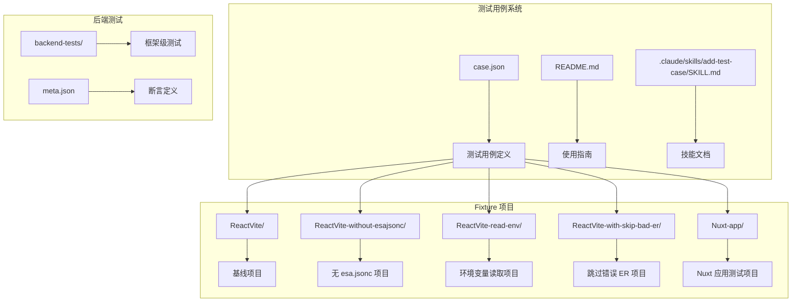
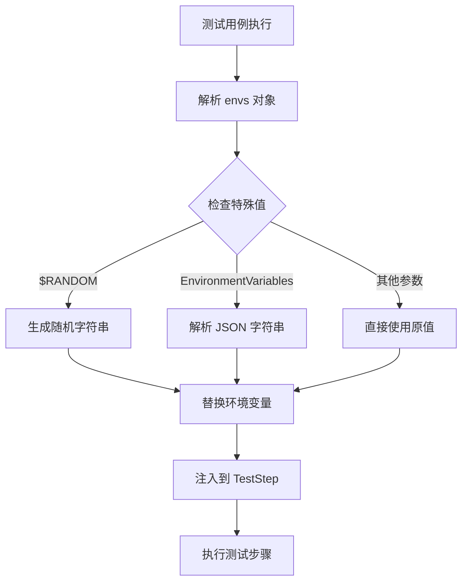
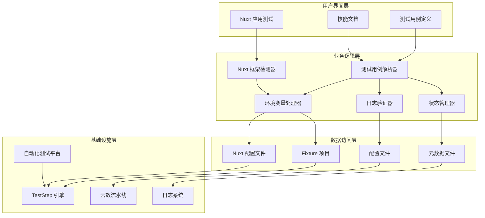
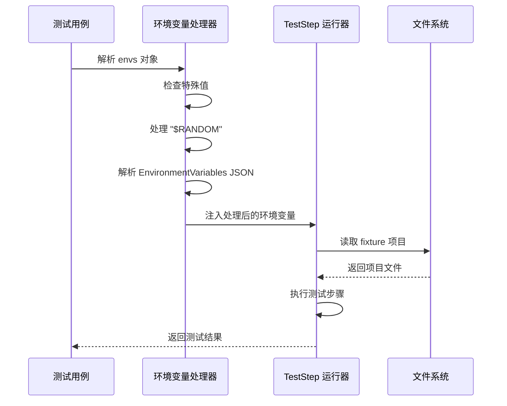
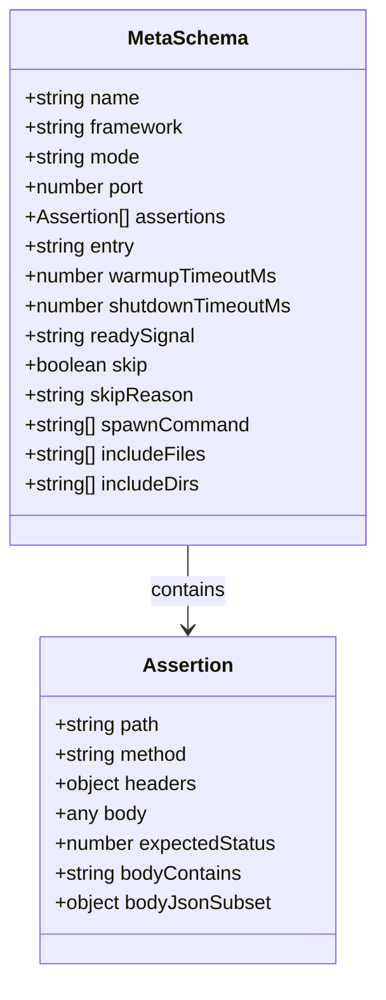

# 测试用例系统

<cite>
**本文档引用的文件**
- [case.json](file://case.json)
- [README.md](file://README.md)
- [.claude/skills/add-test-case/SKILL.md](file://.claude/skills/add-test-case/SKILL.md)
- [backend-tests/README.md](file://backend-tests/README.md)
- [ReactVite-read-env/t.js](file://ReactVite-read-env/t.js)
- [ReactVite-read-env/esa.jsonc](file://ReactVite-read-env/esa.jsonc)
- [ReactVite-with-skip-bad-er/esa.jsonc](file://ReactVite-with-skip-bad-er/esa.jsonc)
- [ReactVite/package.json](file://ReactVite/package.json)
- [ReactVite-without-esajsonc/package.json](file://ReactVite-without-esajsonc/package.json)
- [Nuxt-app/README.md](file://Nuxt-app/README.md)
- [Nuxt-app/package.json](file://Nuxt-app/package.json)
- [Nuxt-app/nuxt.config.ts](file://Nuxt-app/nuxt.config.ts)
</cite>

## 更新摘要
**所做更改**
- 新增 Nuxt 应用测试示例，反映测试流程从手动向自动化的转变
- 移除了过时的手动测试指令，简化测试流程
- 更新了测试用例系统架构，强调自动化测试的重要性
- 添加了新的测试场景，涵盖现代前端框架如 Nuxt

## 目录
1. [简介](#简介)
2. [项目结构](#项目结构)
3. [核心组件](#核心组件)
4. [架构概览](#架构概览)
5. [详细组件分析](#详细组件分析)
6. [依赖关系分析](#依赖关系分析)
7. [性能考虑](#性能考虑)
8. [故障排除指南](#故障排除指南)
9. [结论](#结论)
10. [附录](#附录)

## 简介

测试用例系统是一个全面的端到端测试框架，专门用于测试 TestStep（云效流水线步骤脚本）。该系统通过 case.json 中定义的测试用例，结合多种 fixture 项目，验证不同场景下的构建、部署和运行时行为。

**更新** 新增对 Nuxt 应用的支持，反映现代前端框架测试需求的增长

系统的核心特点包括：
- 基于 JSON 的测试用例定义
- 动态环境变量管理机制
- 强大的日志验证系统
- 多种测试场景覆盖，包括现代前端框架
- 完整的错误处理和调试支持
- 自动化测试流程，减少手动干预

## 项目结构

测试用例系统采用模块化设计，主要包含以下核心组件：



**图表来源**
- [case.json:1-603](file://case.json#L1-L603)
- [README.md:1-31](file://README.md#L1-L31)
- [Nuxt-app/README.md:1-53](file://Nuxt-app/README.md#L1-L53)

**章节来源**
- [case.json:1-603](file://case.json#L1-L603)
- [README.md:1-31](file://README.md#L1-L31)
- [Nuxt-app/README.md:1-53](file://Nuxt-app/README.md#L1-L53)

## 核心组件

### 测试用例数据模型

测试用例系统的核心数据结构基于 JSON 数组，每个测试用例包含以下关键字段：

#### 基础字段结构

| 字段名 | 类型 | 必填 | 说明 |
|--------|------|------|------|
| name | string | 是 | 测试用例名称，用于显示在测试结果中 |
| envs | object | 是 | 环境变量配置对象，键值对形式 |
| repoName | string | 是 | 仓库名称，空字符串表示创新仓库 |
| requireStatus | string | 是 | 期望的最终状态：SUCCESS/FAIL/CANCEL/"" |
| requireLogTextList | array | 是 | 必须包含的日志文本列表 |
| notRequireLogTextList | array | 否 | 禁止出现的日志文本列表 |

#### 环境变量管理机制

环境变量通过 `envs` 对象进行管理，支持以下特殊机制：



**图表来源**
- [.claude/skills/add-test-case/SKILL.md:58-63](file://.claude/skills/add-test-case/SKILL.md#L58-L63)

#### 日志验证系统

日志验证系统采用"状态机标记"机制，通过特定格式的标记来跟踪测试进度：

| 标记类型 | 格式 | 用途 |
|----------|------|------|
| 初始化阶段 | `<<LOG>>step|init<</LOG>>` | 标识初始化开始 |
| 构建阶段 | `<<LOG>>step|build<</LOG>>` | 标识构建开始 |
| 部署阶段 | `<<LOG>>step|deploy<</LOG>>` | 标识部署开始 |
| 结束标记 | `<<LOG>>step|*End<</LOG>>` | 标识对应阶段结束 |

**更新** 新增对 Nuxt 应用的测试用例，展示 meta-framework 的特殊处理流程

**章节来源**
- [case.json:1-603](file://case.json#L1-L603)
- [.claude/skills/add-test-case/SKILL.md:47-96](file://.claude/skills/add-test-case/SKILL.md#L47-L96)

## 架构概览

测试用例系统采用分层架构设计，确保测试的可靠性和可维护性：



**图表来源**
- [.claude/skills/add-test-case/SKILL.md:10-25](file://.claude/skills/add-test-case/SKILL.md#L10-L25)
- [Nuxt-app/README.md:40-53](file://Nuxt-app/README.md#L40-L53)

## 详细组件分析

### 测试用例定义组件

每个测试用例都是一个独立的 JSON 对象，包含完整的测试配置信息。

#### 字段详细说明

**name 字段**
- 类型：string
- 必填：是
- 作用：用于在测试结果中显示用例名称
- 示例："正常构建，使用pnpm"

**envs 字段**
- 类型：object
- 必填：是
- 作用：定义测试所需的环境变量
- 特殊值支持：
  - `"$RANDOM"`：生成随机字符串
  - `EnvironmentVariables`：支持嵌套 JSON 字符串化

**repoName 字段**
- 类型：string
- 必填：是
- 作用：指定测试使用的仓库名称
- 空字符串表示创新仓库流程

**requireStatus 字段**
- 类型：string
- 必填：是
- 取值：SUCCESS/FAIL/CANCEL/""（空字符串表示不校验）
- 作用：定义期望的最终测试状态

**requireLogTextList 字段**
- 类型：array
- 必填：是
- 作用：定义必须包含的日志文本列表
- 匹配规则：AND 关系，所有字符串都必须出现

**notRequireLogTextList 字段**
- 类型：array
- 必填：否
- 作用：定义禁止出现的日志文本列表
- 匹配规则：OR 关系，任一字符串出现即判定失败

#### 环境变量管理机制



**图表来源**
- [.claude/skills/add-test-case/SKILL.md:58-63](file://.claude/skills/add-test-case/SKILL.md#L58-L63)

#### 日志验证系统实现

日志验证系统采用"状态机标记"机制，确保测试的稳定性和可靠性：

```mermaid
flowchart TD
A[开始测试] --> B[初始化阶段]
B --> C[<<LOG>>step|init<</LOG>>]
C --> D[构建阶段]
D --> E[<<LOG>>step|build<</LOG>>]
E --> F[部署阶段]
F --> G[<<LOG>>step|deploy<</LOG>>]
G --> H[结束阶段]
H --> I[<<LOG>>step|buildEnd<</LOG>>]
I --> J[<<LOG>>step|deployEnd<</LOG>>]
J --> K[验证日志]
K --> L{requireLogTextList}
L --> |全部匹配| M[通过]
L --> |部分缺失| N[失败]
K --> O{notRequireLogTextList}
O --> |任一匹配| N
O --> |都不匹配| M
```

**图表来源**
- [.claude/skills/add-test-case/SKILL.md:85-96](file://.claude/skills/add-test-case/SKILL.md#L85-L96)

**章节来源**
- [case.json:1-603](file://case.json#L1-L603)
- [.claude/skills/add-test-case/SKILL.md:47-96](file://.claude/skills/add-test-case/SKILL.md#L47-L96)

### Fixture 项目管理系统

系统包含多个专门的 fixture 项目，每个项目针对特定的测试场景：

#### 基线项目 (ReactVite/)
- 标准 Vite + React + TypeScript 项目
- 作为所有变体项目的基线
- 包含完整的配置文件和依赖

#### 特殊场景项目

**ReactVite-without-esajsonc/**
- 缺少 esa.jsonc 配置文件
- 测试配置文件缺失场景

**ReactVite-read-env/**
- 验证环境变量读取功能
- 包含测试脚本 t.js 输出环境变量

**ReactVite-with-skip-bad-er/**
- 测试跳过错误 ER 的功能
- 配置 skipFunctionBuild 参数

**Nuxt-app/**
- **新增** Nuxt 3 应用测试项目
- 展示 meta-framework 的特殊处理流程
- 包含 ISR（增量静态再生）配置
- 使用 Nitro 引擎和 node-server preset

#### Nuxt 应用测试特性

Nuxt 应用测试项目具有以下特殊配置：

- **SSR 渲染**：服务端渲染，首屏直出
- **ISR 配置**：60秒后台再生
- **Nitro 引擎**：node-server preset 产出自包含文件
- **文件路由**：pages/ 自动路由 + server/api/ 自动接口
- **meta-framework 检测**：TestStep 的 ProjectDetector 同时返回多个框架

**章节来源**
- [ReactVite/package.json:1-30](file://ReactVite/package.json#L1-L30)
- [ReactVite-without-esajsonc/package.json:1-30](file://ReactVite-without-esajsonc/package.json#L1-L30)
- [ReactVite-read-env/t.js:1-1](file://ReactVite-read-env/t.js#L1-L1)
- [ReactVite-read-env/esa.jsonc:1-10](file://ReactVite-read-env/esa.jsonc#L1-L10)
- [ReactVite-with-skip-bad-er/esa.jsonc:1-10](file://ReactVite-with-skip-bad-er/esa.jsonc#L1-L10)
- [Nuxt-app/README.md:1-53](file://Nuxt-app/README.md#L1-L53)
- [Nuxt-app/package.json:1-17](file://Nuxt-app/package.json#L1-L17)
- [Nuxt-app/nuxt.config.ts:1-14](file://Nuxt-app/nuxt.config.ts#L1-L14)

### 后端测试组件

后端测试系统专注于验证 framework-checker 生成物的正确性：



**图表来源**
- [backend-tests/README.md:81-127](file://backend-tests/README.md#L81-L127)

**章节来源**
- [backend-tests/README.md:1-176](file://backend-tests/README.md#L1-L176)

## 依赖关系分析

测试用例系统具有清晰的依赖层次结构：

```mermaid
graph TB
subgraph "外部依赖"
A[云效流水线]
B[Node.js 运行时]
C[包管理器 (npm/pnpm/yarn/bun)]
D[Nuxt 框架]
E[现代前端框架]
end
subgraph "内部组件"
F[测试用例引擎]
G[环境变量处理器]
H[日志验证器]
I[状态管理器]
J[Nuxt 框架检测器]
end
subgraph "测试资产"
K[Fixture 项目]
L[配置文件]
M[元数据文件]
N[Nuxt 配置文件]
end
A --> F
B --> F
C --> F
D --> J
E --> J
F --> G
F --> H
F --> I
G --> K
G --> N
H --> L
I --> M
K --> F
N --> J
L --> A
M --> B
```

**图表来源**
- [.claude/skills/add-test-case/SKILL.md:10-25](file://.claude/skills/add-test-case/SKILL.md#L10-L25)
- [Nuxt-app/README.md:40-53](file://Nuxt-app/README.md#L40-L53)

**章节来源**
- [.claude/skills/add-test-case/SKILL.md:10-25](file://.claude/skills/add-test-case/SKILL.md#L10-L25)

## 性能考虑

测试用例系统在设计时充分考虑了性能优化：

### 测试执行优化
- **并行执行**：多个测试用例可以在 CI 环境中并行执行
- **缓存机制**：利用云效流水线的缓存功能减少重复构建时间
- **增量测试**：只运行发生变化的测试用例
- **自动化流程**：减少手动干预，提高测试效率

### 资源管理
- **内存优化**：合理管理测试过程中的内存使用
- **磁盘空间**：通过合理的 fixture 管理避免磁盘空间浪费
- **网络带宽**：优化依赖下载和缓存策略
- **现代框架优化**：针对 Nuxt 等现代框架的特殊处理流程

## 故障排除指南

### 常见问题及解决方案

#### 测试用例编写问题

**问题**：测试用例无法通过
- 检查 `requireLogTextList` 中的标记是否正确
- 验证 `envs` 对象中的参数是否正确
- 确认 fixture 项目路径是否正确

**问题**：环境变量未生效
- 检查 `EnvironmentVariables` 是否正确字符串化
- 验证 `$RANDOM` 特殊值的使用
- 确认环境变量注入时机

#### 日志验证问题

**问题**：日志标记不匹配
- 确认使用正确的 `<<LOG>>step|*End<</LOG>>` 格式
- 检查日志输出是否包含预期文本
- 验证正则表达式的正确性

**问题**：状态验证失败
- 检查 `requireStatus` 设置是否合理
- 验证测试步骤的执行顺序
- 确认异常处理逻辑

#### Fixture 项目问题

**问题**：fixture 项目路径错误
- 确认 `RootDirectory` 以 `/` 开头
- 验证 fixture 项目是否存在
- 检查项目权限设置

**问题**：配置文件缺失
- 确认必需的配置文件存在
- 验证配置文件格式正确性
- 检查配置文件编码

#### Nuxt 应用测试问题

**问题**：Nuxt 框架检测失败
- 确认 Nuxt 配置文件正确设置
- 验证 package.json 中的依赖版本
- 检查 nuxt.config.ts 的配置选项

**问题**：meta-framework 处理异常
- 确认 build 命令正确执行
- 验证 .output/server/ 目录生成
- 检查 meta-runtime adapter 配置

**章节来源**
- [.claude/skills/add-test-case/SKILL.md:278-287](file://.claude/skills/add-test-case/SKILL.md#L278-L287)

## 结论

测试用例系统是一个设计精良的端到端测试框架，具有以下优势：

1. **结构化设计**：基于 JSON 的测试用例定义，易于理解和维护
2. **灵活的环境管理**：支持动态环境变量和特殊值处理
3. **强大的验证机制**：基于状态机标记的日志验证系统
4. **全面的场景覆盖**：包含多种测试场景和 fixture 项目，**新增**现代前端框架支持
5. **完善的文档支持**：详细的技能文档和使用指南
6. **自动化测试流程**：减少手动干预，提高测试效率
7. **现代化框架支持**：集成 Nuxt 等现代前端框架测试能力

**更新** 从手动测试向自动化测试的转变，显著提升了测试效率和可靠性

该系统为 TestStep 提供了可靠的测试保障，确保在不同环境下的一致性和稳定性，特别是在现代前端框架测试方面提供了强有力的支持。

## 附录

### 最佳实践指南

#### 测试用例编写最佳实践
- 使用明确的用例名称描述测试目标
- 尽可能复用现有 fixture 项目
- 在 `requireLogTextList` 中包含至少一个 `<<LOG>>step|*End<</LOG>>` 标记
- 合理使用 `notRequireLogTextList` 进行负向断言
- **新增** 针对现代框架的测试用例编写规范

#### 环境变量管理最佳实践
- 对于嵌套 JSON，确保正确字符串化
- 使用 `$RANDOM` 时注意与其他参数的组合
- 验证环境变量注入的时机和作用域
- **新增** 现代框架特有的环境变量配置

#### 日志验证最佳实践
- 优先使用状态机标记而非业务日志
- 结合正则表达式进行精确匹配
- 合理使用 AND/OR 关系确保验证准确性
- **新增** 现代框架日志格式的特殊处理

### 常见陷阱避免

#### 参数拼写错误
- 在设计测试用例前，先检查 `TestStep/src/params.ts` 中的参数列表
- 确保所有参数名称拼写正确

#### Fixture 项目选择错误
- 优先考虑复用现有 fixture 项目
- 只在必要时创建新的 fixture 项目
- 确保新 fixture 项目与基线项目保持最小差异

#### 验证条件设置不当
- 避免过度严格的验证条件
- 合理使用 `requireStatus` 的空字符串表示不验证
- 确保 `notRequireLogTextList` 的使用不会过于宽松

#### 现代框架测试陷阱
- **新增** 确保 Nuxt 应用的 build 命令正确配置
- 验证 meta-framework 的特殊处理流程
- 检查现代框架的依赖版本兼容性
- 确认框架检测器能够正确识别新框架

**章节来源**
- [.claude/skills/add-test-case/SKILL.md:97-116](file://.claude/skills/add-test-case/SKILL.md#L97-L116)
- [.claude/skills/add-test-case/SKILL.md:278-287](file://.claude/skills/add-test-case/SKILL.md#L278-L287)
- [Nuxt-app/README.md:40-53](file://Nuxt-app/README.md#L40-L53)