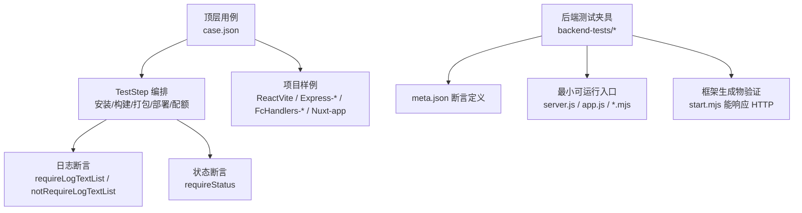
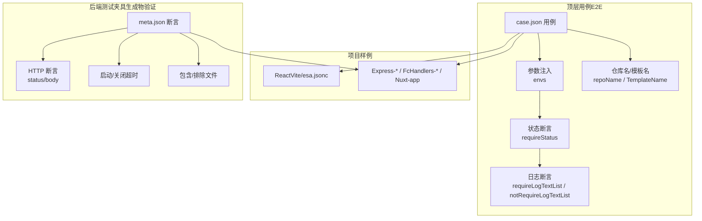
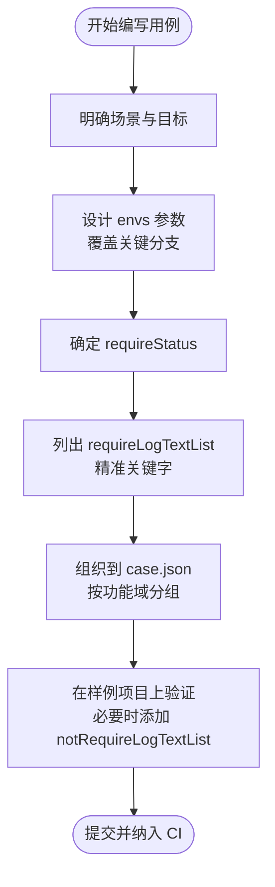
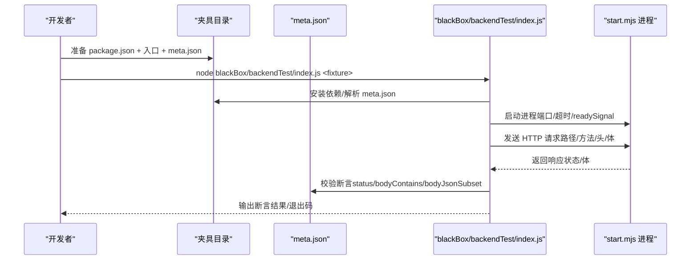
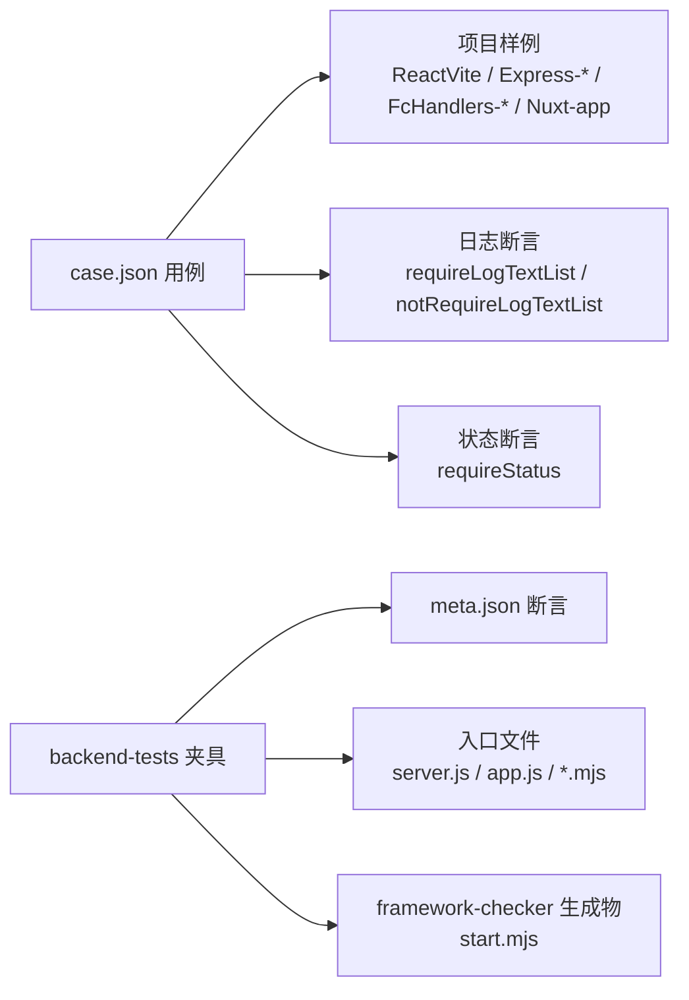

# 测试用例编写指南

<cite>
**本文引用的文件**
- [README.md](file://README.md)
- [case.json](file://case.json)
- [backend-tests/README.md](file://backend-tests/README.md)
- [Express-disambig/README.md](file://Express-disambig/README.md)
- [Express-with-api/README.md](file://Express-with-api/README.md)
- [ReactVite/esa.jsonc](file://ReactVite/esa.jsonc)
- [Express-listen/server.js](file://Express-listen/server.js)
- [FcHandlers-basic/api/foo.js](file://FcHandlers-basic/api/foo.js)
- [backend-tests/express-listen/meta.json](file://backend-tests/express-listen/meta.json)
- [backend-tests/nuxt/meta.json](file://backend-tests/nuxt/meta.json)
- [Express-with-views/server.js](file://Express-with-views/server.js)
- [Nuxt-app/nuxt.config.ts](file://Nuxt-app/nuxt.config.ts)
- [.claude/skills/add-test-case/SKILL.md](file://.claude/skills/add-test-case/SKILL.md)
</cite>

## 目录
1. [引言](#引言)
2. [项目结构](#项目结构)
3. [核心组件](#核心组件)
4. [架构总览](#架构总览)
5. [详细组件分析](#详细组件分析)
6. [依赖分析](#依赖分析)
7. [性能考虑](#性能考虑)
8. [故障排除指南](#故障排除指南)
9. [结论](#结论)
10. [附录](#附录)

## 引言
本指南面向测试工程师与开发者，系统化阐述如何基于现有仓库编写高质量的测试用例。内容覆盖测试设计原则、编写规范、场景分类与最佳实践、命名与组织结构、调试与故障排除、常见陷阱与规避建议，以及测试用例与实际项目配置的对应关系。仓库提供了两类测试体系：面向端到端编排与平台行为的顶层用例集合，以及面向框架生成物正确性的后端测试夹具（fixture）。本文将结合这两套体系，给出可操作的测试用例设计与落地方法。

## 项目结构
仓库采用“场景驱动 + 夹具验证”的双轨测试结构：
- 顶层用例（case.json）：描述不同工程场景（前端构建、后端框架、无服务器函数等）的参数、期望状态与日志断言，用于验证 TestStep 编排、安装命令、构建命令、资源打包、部署与配额等全流程。
- 后端测试夹具（backend-tests）：针对每个受支持的后端框架，提供最小可运行的入口与断言定义（meta.json），验证 framework-checker 生成的 start.mjs 在本机能正确响应 HTTP 请求，聚焦“生成物正确性”。

图表来源
- [case.json:1-603](file://case.json#L1-L603)
- [backend-tests/README.md:18-84](file://backend-tests/README.md#L18-L84)

章节来源
- [README.md:1-31](file://README.md#L1-L31)
- [case.json:1-603](file://case.json#L1-L603)
- [backend-tests/README.md:1-133](file://backend-tests/README.md#L1-L133)

## 核心组件
- 顶层用例集合（case.json）
  - 用例字段：name、envs、repoName、requireStatus、requireLogTextList、notRequireLogTextList
  - 作用：描述测试场景、注入环境变量、期望构建结果与日志关键字，覆盖前端构建、后端框架识别、无服务器函数路由、模板与配额等多类场景
- 项目样例（ReactVite、Express-*、FcHandlers-*、Nuxt-app 等）
  - 提供真实工程配置（如 esa.jsonc、package.json、入口文件），作为测试用例的根目录（RootDirectory）或参数来源
- 后端测试夹具（backend-tests）
  - 每个框架一个夹具目录，包含 package.json、入口文件与 meta.json
  - meta.json 定义断言：期望框架识别、运行模式、端口、HTTP 路径与期望响应、超时、包含/排除文件等

章节来源
- [README.md:21-31](file://README.md#L21-L31)
- [case.json:1-603](file://case.json#L1-L603)
- [backend-tests/README.md:18-84](file://backend-tests/README.md#L18-L84)

## 架构总览
下图展示了两类测试体系的交互关系与职责边界：

图表来源
- [case.json:1-603](file://case.json#L1-L603)
- [backend-tests/README.md:38-84](file://backend-tests/README.md#L38-L84)
- [ReactVite/esa.jsonc:1-10](file://ReactVite/esa.jsonc#L1-L10)

## 详细组件分析

### 顶层用例设计与编写规范
- 场景分类与最佳实践
  - 前端构建类：覆盖包管理器（npm/pnpm/bun/yarn/cnpm）、引擎版本（engines/node 版本）、安装/构建命令覆盖、assets 目录策略、skipFunctionBuild 等
  - 后端框架类：覆盖 Express/Koa/Hono/Fastify/NestJS 等，关注入口识别、模板视图打包、多入口歧义处理、与 /api 路由共存时的优先级
  - 无服务器函数类：覆盖基础 handler、动态路径、index 入口、可选通配、路由冲突等
  - 元框架类：Nuxt 项目走 meta-runtime adapter，避免 nft trace
- 命名约定与组织结构
  - 用例名称应清晰描述“做什么 + 期望结果”，便于在测试结果中快速定位
  - 将相似场景（如多种包管理器）归并到同一 RootDirectory 下，通过 envs 注入差异参数，减少重复样例
- 断言策略
  - requireStatus 与 requireLogTextList 双重保障：状态对了但路径错误也会被发现
  - notRequireLogTextList 用于排除特定路径（如非生产分支不应进入部署阶段）

图表来源
- [README.md:21-31](file://README.md#L21-L31)
- [case.json:1-603](file://case.json#L1-L603)

章节来源
- [README.md:21-31](file://README.md#L21-L31)
- [case.json:1-603](file://case.json#L1-L603)

### 后端测试夹具设计与编写规范
- 夹具结构与断言定义
  - 目录约定：backend-tests/<framework-slug>-<flavor>/，包含 package.json、入口文件与 meta.json
  - meta.json 关键字段：name、framework、mode、port、assertions、entry、warmup/shutdown 超时、readySignal、includeFiles/includeDirs 等
  - 断言规则：expectedStatus 严格相等；bodyContains 区分大小写；bodyJsonSubset 验证 JSON 子集；任一断言失败即整夹具失败
- 运行与接入
  - 批量安装依赖后运行 blackBox/backendTest/index.js，支持单夹具运行与主流程集成
  - 退出码：0 表示全部断言通过；1 表示至少一个断言失败/启动失败/framework-checker 报错

图表来源
- [backend-tests/README.md:94-116](file://backend-tests/README.md#L94-L116)
- [backend-tests/README.md:38-84](file://backend-tests/README.md#L38-L84)

章节来源
- [backend-tests/README.md:1-133](file://backend-tests/README.md#L1-L133)
- [backend-tests/express-listen/meta.json:1-36](file://backend-tests/express-listen/meta.json#L1-L36)
- [backend-tests/nuxt/meta.json:1-14](file://backend-tests/nuxt/meta.json#L1-L14)

### 典型场景示例与最佳实践

#### 前端构建场景
- 示例：ReactVite 项目，覆盖包管理器（bun/npm/pnpm/yarn/cnpm）、引擎版本、安装/构建命令覆盖、assets 目录策略、skipFunctionBuild、未找到 package.json 的处理等
- 关键点
  - 使用 esa.jsonc 控制 installCommand/buildCommand/assets.directory
  - 通过 RootDirectory 指向样例项目，envs 注入差异参数
  - 用 requireLogTextList 精准匹配“安装/构建/打包/部署”各阶段日志

章节来源
- [ReactVite/esa.jsonc:1-10](file://ReactVite/esa.jsonc#L1-L10)
- [case.json:15-55](file://case.json#L15-L55)
- [case.json:134-187](file://case.json#L134-L187)

#### 后端框架场景
- 示例：Express（app.listen 与 module.exports 两种风格）、Koa、Hono、Fastify、NestJS
- 关键点
  - 入口识别：确保监听调用或导出被正确拦截，由 manifest.port 接管
  - 模板视图：Express 带 views/ 时模板文件需随打包，避免线上 404
  - 多入口歧义：当存在 server.js 与 app.js 时，优先选择真正 import 框架的文件

章节来源
- [Express-listen/server.js:1-9](file://Express-listen/server.js#L1-L9)
- [Express-with-views/server.js:1-11](file://Express-with-views/server.js#L1-L11)
- [Express-disambig/README.md:1-11](file://Express-disambig/README.md#L1-L11)
- [case.json:298-521](file://case.json#L298-L521)

#### 无服务器函数场景
- 示例：FcHandlers 基础、动态路径、index 入口、可选通配、路由冲突
- 关键点
  - 无框架依赖，无需安装；通过 /api 下 handler 文件自动生成多路由 dispatcher
  - 动态路径编译顺序与静态优先级需被验证
  - 路由冲突应导致构建失败并明确指出冲突文件

章节来源
- [FcHandlers-basic/api/foo.js:1-6](file://FcHandlers-basic/api/foo.js#L1-L6)
- [case.json:355-408](file://case.json#L355-L408)
- [case.json:432-448](file://case.json#L432-L448)
- [case.json:523-559](file://case.json#L523-L559)

#### 元框架场景
- 示例：Nuxt 项目走 meta-runtime adapter
- 关键点
  - 通过 nuxt.config.ts 指定 node-server preset，产出 .output/server/index.mjs
  - 断言应体现“meta-framework”而非 nft trace 的特征

章节来源
- [Nuxt-app/nuxt.config.ts:1-9](file://Nuxt-app/nuxt.config.ts#L1-L9)
- [case.json:579-601](file://case.json#L579-L601)
- [backend-tests/nuxt/meta.json:1-14](file://backend-tests/nuxt/meta.json#L1-L14)

## 依赖分析
- 顶层用例依赖项目样例与配置文件（如 esa.jsonc、package.json、入口文件）
- 后端夹具依赖 framework-checker 生成的 start.mjs 与目标框架运行时
- 两类测试体系互补：前者验证端到端流程与平台行为，后者验证生成物正确性与 HTTP 响应

图表来源
- [case.json:1-603](file://case.json#L1-L603)
- [backend-tests/README.md:18-84](file://backend-tests/README.md#L18-L84)

章节来源
- [case.json:1-603](file://case.json#L1-L603)
- [backend-tests/README.md:1-133](file://backend-tests/README.md#L1-L133)

## 性能考虑
- 顶层用例（E2E）：涉及云效流水线与 FC 平台，单用例耗时较长，建议通过合理的日志断言与状态断言快速定位问题，避免冗余步骤
- 后端夹具（生成物验证）：全程单机 loopback，单用例耗时较短，适合高频回归与快速反馈
- 建议
  - 将高成本场景拆分为多个小用例，分别验证安装、构建、打包、部署等关键步骤
  - 对于参数组合差异场景，优先通过 envs 复用同一样例，减少夹具数量

## 故障排除指南
- 常见问题与排查思路
  - 日志断言过于宽松：使用更精准的关键字，避免“build”等通用词导致误判
  - 仅依赖状态断言：状态对了但路径错误无法被发现，需配合日志断言
  - 用 FAIL 掩盖错误：FAIL 仅适用于“期望就该失败”的场景，不应掩盖用例设计缺陷
  - 样例被多个用例共享：避免修改基线样例，以免影响其他用例
- 后端夹具调试
  - 启动失败：检查 warmupTimeoutMs、readySignal 是否合理
  - 断言失败：核对 expectedStatus、bodyContains、bodyJsonSubset 的预期是否与响应一致
  - 文件遗漏：必要时通过 includeFiles/includeDirs 将缺失文件加入 nft 文件列表
- 运行方式
  - 批量安装依赖后运行 blackBox/backendTest/index.js，支持单夹具运行与主流程集成

章节来源
- [backend-tests/README.md:86-116](file://backend-tests/README.md#L86-L116)
- [.claude/skills/add-test-case/SKILL.md:213-219](file://.claude/skills/add-test-case/SKILL.md#L213-L219)

## 结论
本指南总结了两类测试体系的设计理念与实施方法：顶层用例负责端到端流程与平台行为验证，后端夹具负责生成物正确性与 HTTP 响应验证。通过规范的命名与组织、严谨的断言策略、合理的参数注入与样例复用，可以高效地覆盖从前端构建到后端框架、再到无服务器函数的广泛场景，并在 CI 中稳定运行。

## 附录

### 测试用例命名约定与组织结构
- 命名约定
  - 清晰描述“做什么 + 期望结果”，便于在测试结果中快速定位
  - 对于参数组合差异场景，优先通过 envs 注入，避免新增夹具
- 组织结构
  - 将相似场景（如多种包管理器）归并到同一 RootDirectory 下
  - 用例分组：前端构建、后端框架、无服务器函数、元框架、配额与异常等

章节来源
- [.claude/skills/add-test-case/SKILL.md:213-219](file://.claude/skills/add-test-case/SKILL.md#L213-L219)

### 测试用例与实际项目配置的对应关系
- 前端构建
  - 通过 esa.jsonc 控制 installCommand/buildCommand/assets.directory
  - 通过 RootDirectory 指向样例项目，envs 注入差异参数
- 后端框架
  - 通过入口文件（如 server.js/app.js）与监听/导出风格，验证 framework-checker 的识别能力
  - 模板视图与多入口歧义场景通过样例项目与 README 描述进行验证
- 无服务器函数
  - 通过 /api 下 handler 文件的命名与结构，验证动态路径、index 入口与冲突检测
- 元框架
  - 通过 nuxt.config.ts 指定 preset，验证 meta-runtime adapter 的行为

章节来源
- [ReactVite/esa.jsonc:1-10](file://ReactVite/esa.jsonc#L1-L10)
- [Express-listen/server.js:1-9](file://Express-listen/server.js#L1-L9)
- [Express-with-views/server.js:1-11](file://Express-with-views/server.js#L1-L11)
- [Nuxt-app/nuxt.config.ts:1-9](file://Nuxt-app/nuxt.config.ts#L1-L9)
- [Express-disambig/README.md:1-11](file://Express-disambig/README.md#L1-L11)
- [Express-with-api/README.md:1-11](file://Express-with-api/README.md#L1-L11)