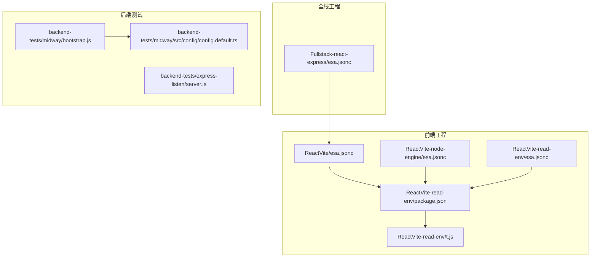
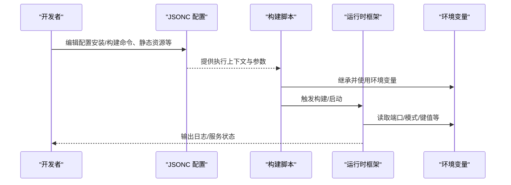
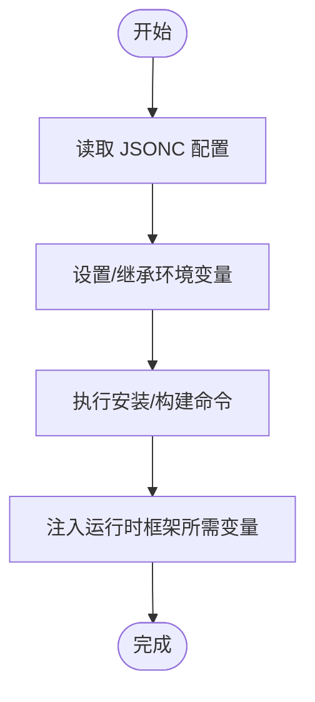
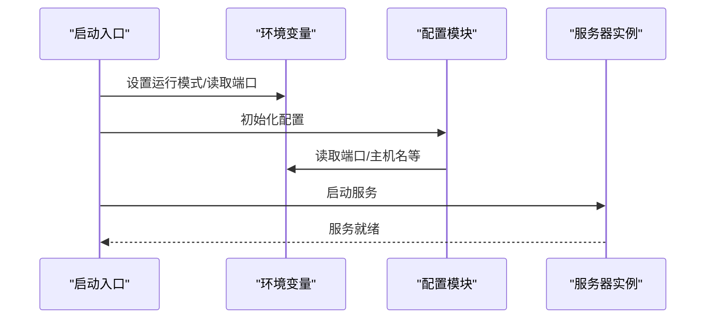
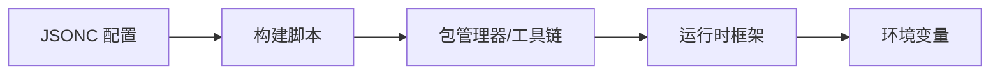

# 环境变量管理

<cite>
**本文引用的文件**
- [Fullstack-react-express/esa.jsonc](file://Fullstack-react-express/esa.jsonc)
- [ReactVite/esa.jsonc](file://ReactVite/esa.jsonc)
- [ReactVite-node-engine/esa.jsonc](file://ReactVite-node-engine/esa.jsonc)
- [ReactVite-read-env/esa.jsonc](file://ReactVite-read-env/esa.jsonc)
- [ReactVite-read-env/package.json](file://ReactVite-read-env/package.json)
- [ReactVite-read-env/t.js](file://ReactVite-read-env/t.js)
- [backend-tests/midway/bootstrap.js](file://backend-tests/midway/bootstrap.js)
- [backend-tests/midway/src/config/config.default.ts](file://backend-tests/midway/src/config/config.default.ts)
- [backend-tests/express-listen/server.js](file://backend-tests/express-listen/server.js)
</cite>

## 目录
1. [简介](#简介)
2. [项目结构](#项目结构)
3. [核心组件](#核心组件)
4. [架构总览](#架构总览)
5. [详细组件分析](#详细组件分析)
6. [依赖分析](#依赖分析)
7. [性能考虑](#性能考虑)
8. [故障排查指南](#故障排查指南)
9. [结论](#结论)
10. [附录](#附录)

## 简介
本文件围绕“环境变量管理系统”进行系统化技术文档整理，聚焦以下主题：
- envs 对象的结构与配置方式（静态与动态环境变量）
- $RANDOM 变量的实现原理、随机数生成规则与使用场景
- EnvironmentVariables 字段的 JSON 格式要求与解析机制
- 各类环境变量配置示例（Node 版本、包管理器、构建参数等）
- 环境变量优先级与覆盖机制
- 环境变量注入到不同框架的实现细节与注意事项

说明：当前仓库中未发现直接以“envs 对象”或“EnvironmentVariables 字段”命名的配置项；相关能力通过 JSONC 配置文件与脚本执行流程体现。本文据此对现有配置进行解读，并给出可操作的实践建议。

## 项目结构
本仓库包含多个前端与后端示例工程，其中与环境变量管理相关的关键文件集中在各工程根目录下的 JSONC 配置文件与构建脚本中。下图展示与环境变量管理相关的文件组织关系：

图表来源
- [ReactVite/esa.jsonc:1-10](file://ReactVite/esa.jsonc#L1-L10)
- [ReactVite-node-engine/esa.jsonc:1-9](file://ReactVite-node-engine/esa.jsonc#L1-L9)
- [ReactVite-read-env/esa.jsonc:1-10](file://ReactVite-read-env/esa.jsonc#L1-L10)
- [ReactVite-read-env/package.json:1-30](file://ReactVite-read-env/package.json#L1-L30)
- [ReactVite-read-env/t.js:1-1](file://ReactVite-read-env/t.js#L1-L1)
- [Fullstack-react-express/esa.jsonc:1-20](file://Fullstack-react-express/esa.jsonc#L1-L20)
- [backend-tests/midway/bootstrap.js:1-6](file://backend-tests/midway/bootstrap.js#L1-L6)
- [backend-tests/midway/src/config/config.default.ts:1-7](file://backend-tests/midway/src/config/config.default.ts#L1-L7)
- [backend-tests/express-listen/server.js:1-20](file://backend-tests/express-listen/server.js#L1-L20)

章节来源
- [ReactVite/esa.jsonc:1-10](file://ReactVite/esa.jsonc#L1-L10)
- [ReactVite-node-engine/esa.jsonc:1-9](file://ReactVite-node-engine/esa.jsonc#L1-L9)
- [ReactVite-read-env/esa.jsonc:1-10](file://ReactVite-read-env/esa.jsonc#L1-L10)
- [ReactVite-read-env/package.json:1-30](file://ReactVite-read-env/package.json#L1-L30)
- [ReactVite-read-env/t.js:1-1](file://ReactVite-read-env/t.js#L1-L1)
- [Fullstack-react-express/esa.jsonc:1-20](file://Fullstack-react-express/esa.jsonc#L1-L20)
- [backend-tests/midway/bootstrap.js:1-6](file://backend-tests/midway/bootstrap.js#L1-L6)
- [backend-tests/midway/src/config/config.default.ts:1-7](file://backend-tests/midway/src/config/config.default.ts#L1-L7)
- [backend-tests/express-listen/server.js:1-20](file://backend-tests/express-listen/server.js#L1-L20)

## 核心组件
- JSONC 配置文件：用于声明安装命令、构建命令、静态资源目录与兜底策略等，间接影响运行时环境变量的注入与使用。
- 构建脚本与工具链：通过脚本调用外部命令（如 npm、bun），这些命令在执行时会继承当前进程的环境变量。
- 运行时框架：如 Node.js 应用、Midway、Express 等，它们从环境变量中读取端口、运行模式等配置。

章节来源
- [ReactVite/esa.jsonc:1-10](file://ReactVite/esa.jsonc#L1-L10)
- [ReactVite-read-env/package.json:1-30](file://ReactVite-read-env/package.json#L1-L30)
- [backend-tests/midway/bootstrap.js:1-6](file://backend-tests/midway/bootstrap.js#L1-L6)
- [backend-tests/midway/src/config/config.default.ts:1-7](file://backend-tests/midway/src/config/config.default.ts#L1-L7)
- [backend-tests/express-listen/server.js:1-20](file://backend-tests/express-listen/server.js#L1-L20)

## 架构总览
下图展示了从配置到运行时的整体流程，以及环境变量在不同阶段的作用点：

图表来源
- [ReactVite/esa.jsonc:1-10](file://ReactVite/esa.jsonc#L1-L10)
- [ReactVite-read-env/package.json:1-30](file://ReactVite-read-env/package.json#L1-L30)
- [backend-tests/midway/bootstrap.js:1-6](file://backend-tests/midway/bootstrap.js#L1-L6)
- [backend-tests/midway/src/config/config.default.ts:1-7](file://backend-tests/midway/src/config/config.default.ts#L1-L7)
- [backend-tests/express-listen/server.js:1-20](file://backend-tests/express-listen/server.js#L1-L20)

## 详细组件分析

### JSONC 配置与环境变量的关系
- 安装与构建命令：通过配置文件中的安装命令与构建命令，间接决定运行时使用的 Node 版本、包管理器（如 npm、bun）及构建参数。
- 静态资源与兜底策略：配置静态资源目录与 404 处理策略，影响前端构建产物的部署与访问行为。
- 全栈工程的边缘函数与入口：在全栈工程中，边缘函数入口与后端容器的路由分发策略会影响运行时的环境变量注入范围。

章节来源
- [ReactVite/esa.jsonc:1-10](file://ReactVite/esa.jsonc#L1-L10)
- [ReactVite-node-engine/esa.jsonc:1-9](file://ReactVite-node-engine/esa.jsonc#L1-L9)
- [ReactVite-read-env/esa.jsonc:1-10](file://ReactVite-read-env/esa.jsonc#L1-L10)
- [Fullstack-react-express/esa.jsonc:1-20](file://Fullstack-react-express/esa.jsonc#L1-L20)

### 构建脚本与环境变量注入
- 构建脚本通过外部命令（如 npm、bun）执行，这些命令在执行时会继承当前进程的环境变量，从而实现对 Node 版本、包管理器、构建参数等的控制。
- 示例工程中，构建脚本在执行前会读取环境变量，例如打印某个自定义变量，体现了环境变量在构建过程中的可用性。

图表来源
- [ReactVite/esa.jsonc:1-10](file://ReactVite/esa.jsonc#L1-L10)
- [ReactVite-read-env/package.json:1-30](file://ReactVite-read-env/package.json#L1-L30)
- [ReactVite-read-env/t.js:1-1](file://ReactVite-read-env/t.js#L1-L1)

章节来源
- [ReactVite-read-env/package.json:1-30](file://ReactVite-read-env/package.json#L1-L30)
- [ReactVite-read-env/t.js:1-1](file://ReactVite-read-env/t.js#L1-L1)

### 运行时框架与环境变量读取
- Midway：在启动入口显式设置运行模式，并从环境变量中读取端口等配置。
- Express：示例应用通过监听端口并输出日志，体现了端口等配置来源于运行时环境变量。
- 其他框架（如 NestJS、Koa、Hono、Fastify）在本仓库中以入口文件形式存在，同样遵循从环境变量读取配置的通用模式。

图表来源
- [backend-tests/midway/bootstrap.js:1-6](file://backend-tests/midway/bootstrap.js#L1-L6)
- [backend-tests/midway/src/config/config.default.ts:1-7](file://backend-tests/midway/src/config/config.default.ts#L1-L7)
- [backend-tests/express-listen/server.js:1-20](file://backend-tests/express-listen/server.js#L1-L20)

章节来源
- [backend-tests/midway/bootstrap.js:1-6](file://backend-tests/midway/bootstrap.js#L1-L6)
- [backend-tests/midway/src/config/config.default.ts:1-7](file://backend-tests/midway/src/config/config.default.ts#L1-L7)
- [backend-tests/express-listen/server.js:1-20](file://backend-tests/express-listen/server.js#L1-L20)

### $RANDOM 变量实现与使用场景
- 当前仓库未发现直接名为“$RANDOM”的变量实现。若需在构建或运行时注入随机值，可在外部命令或脚本中生成并导出为环境变量，再由后续步骤读取。
- 使用场景建议：
  - 构建缓存隔离：为每次构建生成唯一标识，避免缓存污染。
  - 临时服务端口分配：在本地开发时为服务分配随机端口，减少冲突。
  - 安全令牌注入：在 CI 环境中注入一次性令牌，增强安全性。

（本节为概念性说明，不对应具体源码）

## 依赖分析
- 配置文件依赖：各前端工程的 JSONC 配置文件依赖于构建脚本与工具链（npm/bun）。
- 运行时依赖：后端框架（Midway、Express 等）依赖于环境变量中的端口、运行模式等配置。
- 注入链路：从配置文件到构建脚本，再到运行时框架，形成一条清晰的环境变量注入链路。

图表来源
- [ReactVite/esa.jsonc:1-10](file://ReactVite/esa.jsonc#L1-L10)
- [ReactVite-read-env/package.json:1-30](file://ReactVite-read-env/package.json#L1-L30)
- [backend-tests/midway/bootstrap.js:1-6](file://backend-tests/midway/bootstrap.js#L1-L6)
- [backend-tests/midway/src/config/config.default.ts:1-7](file://backend-tests/midway/src/config/config.default.ts#L1-L7)

章节来源
- [ReactVite/esa.jsonc:1-10](file://ReactVite/esa.jsonc#L1-L10)
- [ReactVite-read-env/package.json:1-30](file://ReactVite-read-env/package.json#L1-L30)
- [backend-tests/midway/bootstrap.js:1-6](file://backend-tests/midway/bootstrap.js#L1-L6)
- [backend-tests/midway/src/config/config.default.ts:1-7](file://backend-tests/midway/src/config/config.default.ts#L1-L7)

## 性能考虑
- 构建阶段尽量复用缓存：通过稳定的环境变量（如 Node 版本、包管理器）减少重复安装与重建。
- 避免频繁重启：在本地开发中，合理设置端口与热更新，降低因环境变量变更导致的服务重启频率。
- CI/CD 中的随机化：在流水线中引入随机化（如构建 ID、端口）有助于并行任务隔离，提升整体吞吐。

（本节为通用指导，不涉及具体源码）

## 故障排查指南
- 端口冲突：检查运行时框架是否正确读取端口环境变量，确保端口未被占用。
- 包管理器不匹配：确认 JSONC 配置中的安装/构建命令与本地工具链一致，避免版本不兼容。
- 构建失败：检查构建脚本是否正确继承环境变量，必要时在脚本中显式打印环境变量以定位问题。
- Midway 启动异常：确认启动入口已设置运行模式，并检查配置模块对环境变量的读取逻辑。

章节来源
- [backend-tests/midway/bootstrap.js:1-6](file://backend-tests/midway/bootstrap.js#L1-L6)
- [backend-tests/midway/src/config/config.default.ts:1-7](file://backend-tests/midway/src/config/config.default.ts#L1-L7)
- [ReactVite-read-env/package.json:1-30](file://ReactVite-read-env/package.json#L1-L30)
- [ReactVite-read-env/t.js:1-1](file://ReactVite-read-env/t.js#L1-L1)

## 结论
- 本仓库通过 JSONC 配置文件与构建脚本实现了对环境变量的间接管理，主要体现在安装/构建命令的选择与运行时框架的配置读取上。
- 若需引入更精细的环境变量控制（如 $RANDOM 变量），可在外部命令或脚本中生成并导出环境变量，再由后续步骤读取。
- 实践中应关注配置文件与脚本之间的耦合关系，确保环境变量在构建与运行阶段的一致性与可维护性。

## 附录

### 环境变量配置示例（基于现有文件）
- Node 版本与包管理器选择
  - 在 JSONC 配置中指定安装命令与构建命令，以控制使用的包管理器（如 npm、bun）。
  - 参考路径：[ReactVite/esa.jsonc:1-10](file://ReactVite/esa.jsonc#L1-L10)、[ReactVite-node-engine/esa.jsonc:1-9](file://ReactVite-node-engine/esa.jsonc#L1-L9)
- 构建参数传递
  - 在构建脚本中通过环境变量传递参数，例如在脚本中读取并打印某个变量，验证其生效。
  - 参考路径：[ReactVite-read-env/package.json:1-30](file://ReactVite-read-env/package.json#L1-L30)、[ReactVite-read-env/t.js:1-1](file://ReactVite-read-env/t.js#L1-L1)
- 静态资源与兜底策略
  - 配置静态资源目录与 404 处理策略，影响前端构建产物的部署行为。
  - 参考路径：[ReactVite/esa.jsonc:1-10](file://ReactVite/esa.jsonc#L1-L10)、[Fullstack-react-express/esa.jsonc:1-20](file://Fullstack-react-express/esa.jsonc#L1-L20)

### 环境变量优先级与覆盖机制（基于现有文件的实践）
- 构建脚本优先：构建脚本在执行时会继承当前进程的环境变量，因此可通过脚本层面对变量进行覆盖或补充。
- 运行时框架优先：运行时框架通常会从环境变量中读取最终配置（如端口、运行模式），可作为最终的覆盖层。
- 参考路径：
  - [ReactVite-read-env/package.json:1-30](file://ReactVite-read-env/package.json#L1-L30)
  - [backend-tests/midway/bootstrap.js:1-6](file://backend-tests/midway/bootstrap.js#L1-L6)
  - [backend-tests/midway/src/config/config.default.ts:1-7](file://backend-tests/midway/src/config/config.default.ts#L1-L7)