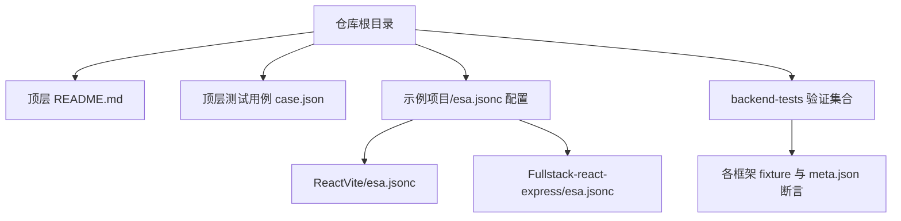
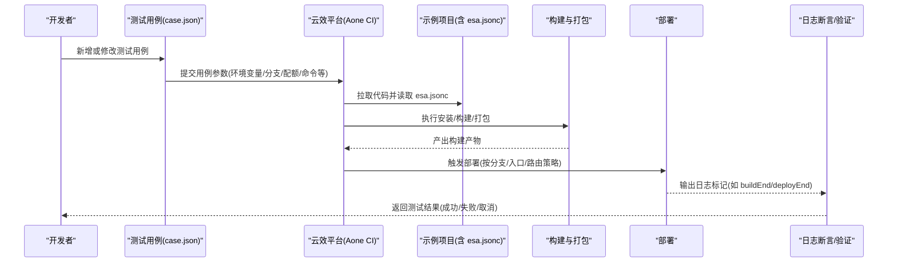
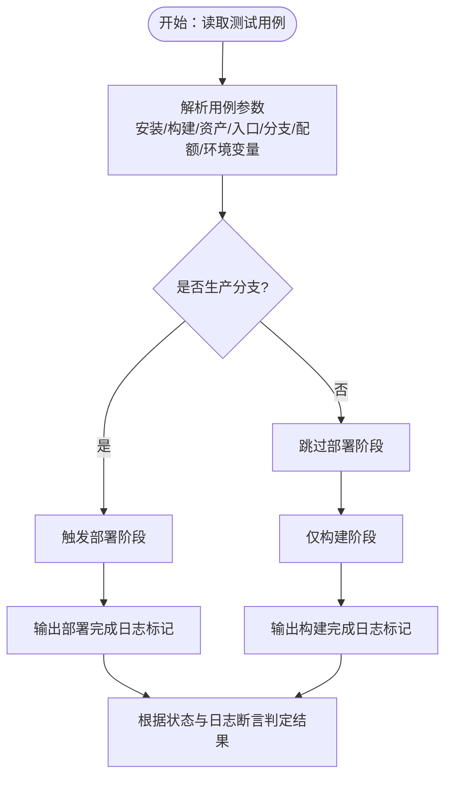
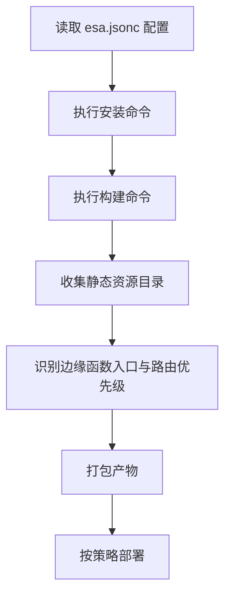
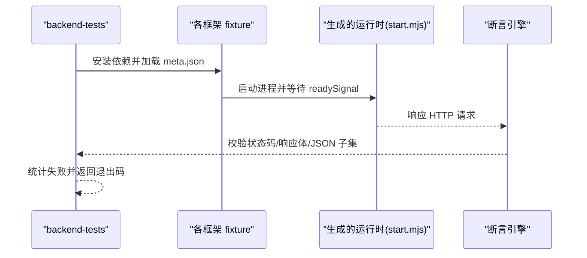
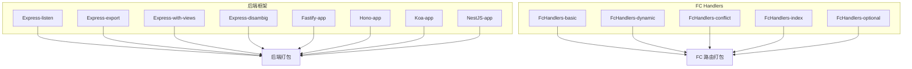
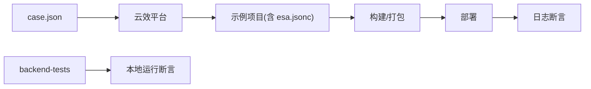

# 部署和集成

<cite>
**本文引用的文件**
- [README.md](file://README.md)
- [case.json](file://case.json)
- [Fullstack-react-express/esa.jsonc](file://Fullstack-react-express/esa.jsonc)
- [ReactVite/esa.jsonc](file://ReactVite/esa.jsonc)
- [backend-tests/README.md](file://backend-tests/README.md)
- [Express-listen/package.json](file://Express-listen/package.json)
- [Express-with-api/package.json](file://Express-with-api/package.json)
- [FcHandlers-basic/package.json](file://FcHandlers-basic/package.json)
- [NestJS-app/package.json](file://NestJS-app/package.json)
- [ReactVite/package.json](file://ReactVite/package.json)
</cite>

## 目录
1. [简介](#简介)
2. [项目结构](#项目结构)
3. [核心组件](#核心组件)
4. [架构总览](#架构总览)
5. [详细组件分析](#详细组件分析)
6. [依赖关系分析](#依赖关系分析)
7. [性能考量](#性能考量)
8. [故障排查指南](#故障排查指南)
9. [结论](#结论)
10. [附录](#附录)

## 简介
本文件面向“部署和集成模块”的技术文档，聚焦于如何将仓库中的各类前端与后端示例项目，通过统一的配置与测试体系对接到云效平台（Aone CI）进行自动化构建与部署。文档从项目结构、配置文件、测试编排、部署流程、环境管理、CI/CD 集成、监控与故障恢复、不同环境差异与运维检查清单等方面进行系统化说明，帮助读者快速理解并落地部署与集成。

## 项目结构
该仓库是一个用于验证多种框架与部署场景的测试仓库，包含大量前端与后端示例项目，以及一套基于云效平台的测试用例与配置文件。核心结构如下：
- 顶层 README 与测试用例配置：用于描述如何新增测试用例、参数说明与测试流程。
- case.json：定义了多条测试用例，覆盖安装命令、构建命令、资产目录、入口文件、节点版本、分支策略、配额限制、错误场景等，用于驱动云效流水线执行并校验构建与部署结果。
- 各示例项目下的 esa.jsonc：定义前端构建、静态资源、边缘函数入口与路由分发策略等，是部署与打包的关键配置。
- backend-tests：独立的后端框架生成物验证集合，用于在本地验证 framework-checker 生成的运行时产物是否能正确响应 HTTP 请求，与顶层测试用例形成互补。

图表来源
- [README.md:1-31](file://README.md#L1-L31)
- [case.json:1-603](file://case.json#L1-L603)
- [backend-tests/README.md:18-28](file://backend-tests/README.md#L18-L28)

章节来源
- [README.md:1-31](file://README.md#L1-L31)
- [case.json:1-603](file://case.json#L1-L603)
- [backend-tests/README.md:18-28](file://backend-tests/README.md#L18-L28)

## 核心组件
- 测试用例引擎（云效平台）：通过 case.json 中的用例参数驱动构建、打包、部署与校验，支持多种环境变量、分支策略、配额限制与日志断言。
- 配置文件（esa.jsonc）：定义前端安装与构建命令、静态资源目录、边缘函数入口与路由分发策略，决定打包与部署行为。
- 后端框架验证（backend-tests）：对 framework-checker 生成的运行时产物进行本地 HTTP 断言，确保框架级“能跑”承诺。
- 示例项目（Express、Hono、Koa、NestJS、FcHandlers 等）：提供不同后端框架与路由模式的最小可运行示例，用于验证识别与打包逻辑。

章节来源
- [case.json:1-603](file://case.json#L1-L603)
- [Fullstack-react-express/esa.jsonc:1-20](file://Fullstack-react-express/esa.jsonc#L1-L20)
- [ReactVite/esa.jsonc:1-10](file://ReactVite/esa.jsonc#L1-L10)
- [backend-tests/README.md:38-84](file://backend-tests/README.md#L38-L84)

## 架构总览
下图展示了从测试用例到构建、打包、部署与验证的整体流程，以及配置文件与示例项目在其中的作用。

图表来源
- [case.json:14-27](file://case.json#L14-L27)
- [case.json:28-55](file://case.json#L28-L55)
- [case.json:56-82](file://case.json#L56-L82)
- [case.json:268-283](file://case.json#L268-L283)
- [case.json:354-372](file://case.json#L354-L372)
- [case.json:431-430](file://case.json#L431-L430)
- [case.json:560-577](file://case.json#L560-L577)

## 详细组件分析

### 测试用例与云效平台集成
- 用例参数与行为
  - ERName、RootDirectory、InstallCommand、BuildCommand、AssetsDirectory、EREntry、NodeVersion、ProductionBranch、CommitId、EnvironmentVariables、ZipSize/FileCount/FileSizeQuota、SkipFunctionBuild 等。
  - 通过 requireStatus 与 requireLogTextList 控制成功/失败判定与日志断言。
- 日志标记
  - 使用特定日志标记（如 buildEnd、deployEnd、deploy）作为阶段完成信号，便于云效流水线解析与后续步骤触发。
- 分支与部署策略
  - ProductionBranch 与非生产分支的行为差异体现在是否触发部署阶段的日志标记。
- 错误与边界场景
  - 非法 EnvironmentVariables、缺失 package.json、过小的配额、assets 目录与 EREntry 均未设置等，均被设计为失败或特殊处理，保障健壮性。

图表来源
- [case.json:268-283](file://case.json#L268-L283)
- [case.json:284-296](file://case.json#L284-L296)
- [case.json:297-315](file://case.json#L297-L315)
- [case.json:316-334](file://case.json#L316-L334)
- [case.json:335-353](file://case.json#L335-L353)
- [case.json:354-372](file://case.json#L354-L372)
- [case.json:373-408](file://case.json#L373-L408)
- [case.json:409-430](file://case.json#L409-L430)
- [case.json:431-448](file://case.json#L431-L448)
- [case.json:449-466](file://case.json#L449-L466)
- [case.json:467-484](file://case.json#L467-L484)
- [case.json:485-503](file://case.json#L485-L503)
- [case.json:504-521](file://case.json#L504-L521)
- [case.json:522-540](file://case.json#L522-L540)
- [case.json:541-559](file://case.json#L541-L559)
- [case.json:560-577](file://case.json#L560-L577)
- [case.json:578-598](file://case.json#L578-L598)

章节来源
- [case.json:1-603](file://case.json#L1-L603)
- [README.md:21-31](file://README.md#L21-L31)

### 配置文件（esa.jsonc）与部署策略
- 前端构建与静态资源
  - installCommand、buildCommand、assets.directory、assets.notFoundStrategy 等，决定前端安装与构建命令、静态资源目录与 404 处理策略。
- 边缘函数与路由分发
  - entry、edgeFunctionFirst 等，定义边缘函数入口与路由优先级，实现部分路由走 ER、其余由平台兜底的混合部署策略。
- 示例对比
  - ReactVite/esa.jsonc：强调前端构建与 SPA 场景。
  - Fullstack-react-express/esa.jsonc：同时覆盖前端构建、静态资源、ER 入口与路由分发。

图表来源
- [ReactVite/esa.jsonc:1-10](file://ReactVite/esa.jsonc#L1-L10)
- [Fullstack-react-express/esa.jsonc:1-20](file://Fullstack-react-express/esa.jsonc#L1-L20)

章节来源
- [ReactVite/esa.jsonc:1-10](file://ReactVite/esa.jsonc#L1-L10)
- [Fullstack-react-express/esa.jsonc:1-20](file://Fullstack-react-express/esa.jsonc#L1-L20)

### 后端框架验证（backend-tests）
- 目标与范围
  - 验证 framework-checker 生成的运行时产物（如 start.mjs）在本地能正确响应 HTTP 请求，不依赖云效流水线与 FC 平台。
- 断言模型
  - meta.json 定义 assertions、framework、mode、port、readySignal、spawnCommand 等，支持对状态码、响应体子串、JSON 子集等进行断言。
- 运行方式
  - 通过 blackBox 入口脚本批量安装依赖并运行断言，退出码 0 表示全部断言通过，1 表示至少一条断言失败或启动失败。

图表来源
- [backend-tests/README.md:38-84](file://backend-tests/README.md#L38-L84)
- [backend-tests/README.md:94-110](file://backend-tests/README.md#L94-L110)

章节来源
- [backend-tests/README.md:1-133](file://backend-tests/README.md#L1-L133)

### 示例项目与部署差异
- Express 系列（listen/export/views/disambig）
  - 通过不同的导出风格与模板目录，验证后端项目识别与打包能力。
- Fastify、Hono、Koa
  - 验证不同后端框架的识别与打包流程。
- NestJS
  - 验证入口在 src/main.ts 的框架识别与打包。
- FcHandlers 系列（basic/dynamic/conflict/index/optional）
  - 验证纯 API 项目（无框架）的多路由自动分发与冲突检测、动态路径、索引入口与可选通配等场景。

图表来源
- [Express-listen/package.json:1-9](file://Express-listen/package.json#L1-L9)
- [Express-with-api/package.json:1-9](file://Express-with-api/package.json#L1-L9)
- [FcHandlers-basic/package.json:1-6](file://FcHandlers-basic/package.json#L1-L6)
- [NestJS-app/package.json:1-13](file://NestJS-app/package.json#L1-L13)

章节来源
- [Express-listen/package.json:1-9](file://Express-listen/package.json#L1-L9)
- [Express-with-api/package.json:1-9](file://Express-with-api/package.json#L1-L9)
- [FcHandlers-basic/package.json:1-6](file://FcHandlers-basic/package.json#L1-L6)
- [NestJS-app/package.json:1-13](file://NestJS-app/package.json#L1-L13)

## 依赖关系分析
- 顶层测试用例与云效平台：case.json 是驱动器，通过参数与日志标记控制构建、部署与校验。
- esa.jsonc 与示例项目：决定前端构建、静态资源与边缘函数策略，影响打包与部署行为。
- backend-tests 与 framework-checker：独立验证生成物的正确性，与云效流水线解耦。

图表来源
- [case.json:1-603](file://case.json#L1-L603)
- [backend-tests/README.md:38-84](file://backend-tests/README.md#L38-L84)

章节来源
- [case.json:1-603](file://case.json#L1-L603)
- [backend-tests/README.md:1-133](file://backend-tests/README.md#L1-L133)

## 性能考量
- 构建与安装命令的选择：不同包管理器（bun/pnpm/yarn/cnpm/npm）对安装速度与缓存策略的影响需结合项目规模评估。
- 资源体积与配额：ZipSizeQuota、FileCountQuota、FileSizeQuota 的设置直接影响打包与部署成功率，建议在预发环境先行压测。
- 静态资源策略：SPA 场景下的 notFoundStrategy 与 assets.directory 的合理配置可减少回源与 CDN 压力。
- 分支策略：非生产分支跳过部署阶段可缩短反馈周期，但需确保构建阶段的完整性。

## 故障排查指南
- 安装/构建失败
  - 检查 InstallCommand/BuildCommand 是否与项目实际一致；若 package.json 不存在或 installCommand 为空，将跳过安装。
- 资源打包问题
  - 若 assets.directory 未设置或 EREntry 未设置，可能导致打包失败或部署异常。
- 配额超限
  - ZipSizeQuota、FileCountQuota、FileSizeQuota 设置过小会导致失败，需根据产物规模调整。
- 路由冲突
  - /api 下存在冲突文件名时，构建会失败并提示路由冲突，需修正路径映射。
- 运行时验证失败
  - 使用 backend-tests 的 meta.json 断言定位生成物响应问题，关注 readySignal、expectedStatus、bodyContains、bodyJsonSubset 等字段。

章节来源
- [case.json:134-145](file://case.json#L134-L145)
- [case.json:174-187](file://case.json#L174-L187)
- [case.json:188-226](file://case.json#L188-L226)
- [case.json:393-408](file://case.json#L393-L408)
- [backend-tests/README.md:86-93](file://backend-tests/README.md#L86-L93)

## 结论
本仓库通过统一的测试用例与配置文件，实现了对多框架、多部署策略的自动化验证，并与云效平台紧密集成。顶层测试用例负责端到端编排与部署校验，backend-tests 负责框架级生成物验证，esa.jsonc 则决定了前端构建与边缘函数策略。结合合理的环境配置、监控与故障恢复机制，可稳定支撑从开发到生产的全链路交付。

## 附录

### 部署策略与环境配置管理
- 生产分支与非生产分支
  - 生产分支触发部署阶段，非生产分支仅构建，减少不必要的部署开销。
- 节点版本与引擎
  - 通过 NodeVersion 或 engines 字段控制运行时版本，确保与项目兼容。
- 包管理器选择
  - 根据团队与缓存策略选择合适的安装命令（bun/pnpm/yarn/cnpm/npm）。
- 配额与体积控制
  - 合理设置 ZipSizeQuota、FileCountQuota、FileSizeQuota，避免打包失败。

章节来源
- [case.json:268-283](file://case.json#L268-L283)
- [case.json:96-121](file://case.json#L96-L121)
- [case.json:188-226](file://case.json#L188-L226)

### CI/CD 集成要点
- 用例驱动：通过 case.json 的 requireStatus 与 requireLogTextList 实现自动化判定。
- 日志标记：使用 buildEnd、deployEnd、deploy 等标记串联流水线步骤。
- 产物收集：确保构建产物与静态资源目录符合 assets.directory 的预期。

章节来源
- [case.json:14-27](file://case.json#L14-L27)
- [case.json:28-55](file://case.json#L28-L55)
- [case.json:284-296](file://case.json#L284-L296)

### 监控与故障恢复
- 监控建议
  - 关注构建阶段与部署阶段的日志标记，结合 requireLogTextList 进行实时观测。
  - 对冷启动、路由命中率、静态资源命中率进行指标采集。
- 故障恢复
  - 遇到路由冲突或配额超限，先回滚到上一个稳定版本，再修复配置后重试。
  - 对运行时验证失败，使用 backend-tests 定位具体断言失败点并修复。

章节来源
- [case.json:393-408](file://case.json#L393-L408)
- [case.json:188-226](file://case.json#L188-L226)
- [backend-tests/README.md:86-93](file://backend-tests/README.md#L86-L93)

### 不同部署环境的配置差异与注意事项
- 开发环境
  - 非生产分支，跳过部署阶段，仅关注构建与打包。
- 预发环境
  - 接近生产分支策略，启用部署阶段，同时开启更严格的配额与体积控制。
- 生产环境
  - 严格遵循 ProductionBranch 与路由分发策略，确保边缘函数与静态资源协同工作。

章节来源
- [case.json:268-283](file://case.json#L268-L283)
- [Fullstack-react-express/esa.jsonc:17-19](file://Fullstack-react-express/esa.jsonc#L17-L19)

### 部署检查清单
- 项目配置
  - esa.jsonc 中 installCommand、buildCommand、assets.directory、entry、edgeFunctionFirst 是否正确。
- 测试用例
  - RootDirectory、InstallCommand、BuildCommand、AssetsDirectory、EREntry、NodeVersion、ProductionBranch、CommitId、EnvironmentVariables、配额参数是否符合预期。
- 日志断言
  - requireStatus 与 requireLogTextList 是否覆盖 buildEnd、deployEnd、deploy 等关键标记。
- 后端验证
  - backend-tests 的 meta.json 断言是否通过，readySignal、expectedStatus、bodyContains、bodyJsonSubset 是否合理。
- 回归与恢复
  - 是否具备回滚策略与重试机制，对冲突与配额超限场景有明确处理流程。

章节来源
- [ReactVite/esa.jsonc:1-10](file://ReactVite/esa.jsonc#L1-L10)
- [Fullstack-react-express/esa.jsonc:1-20](file://Fullstack-react-express/esa.jsonc#L1-L20)
- [case.json:1-603](file://case.json#L1-L603)
- [backend-tests/README.md:38-84](file://backend-tests/README.md#L38-L84)