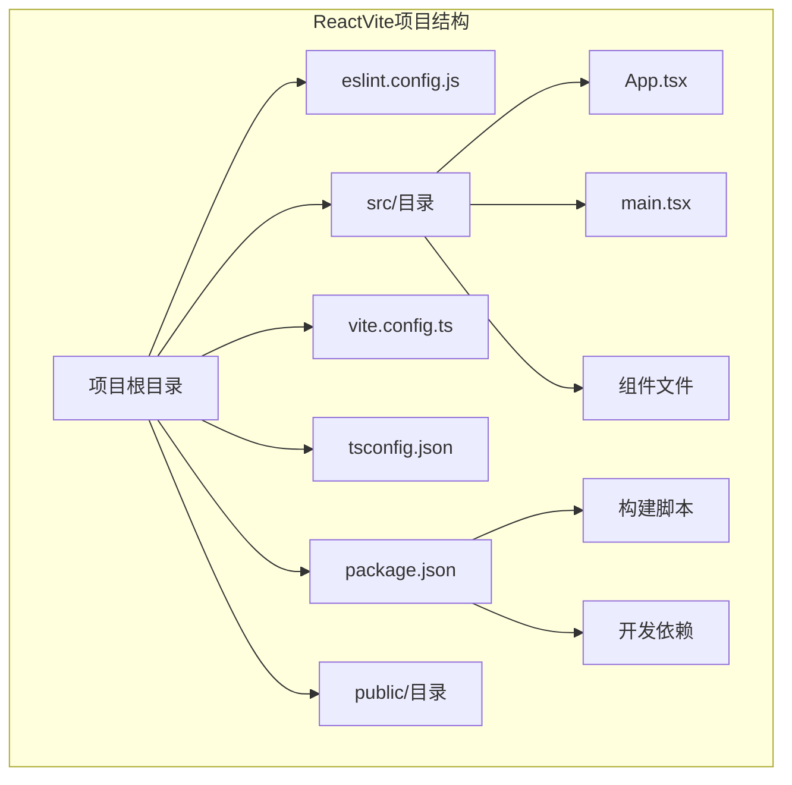
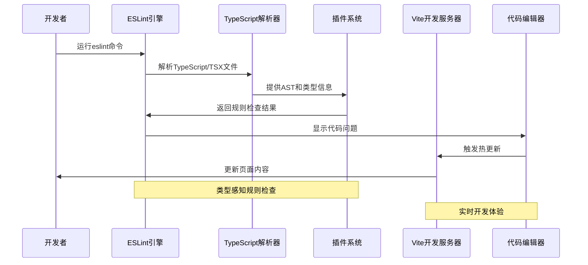
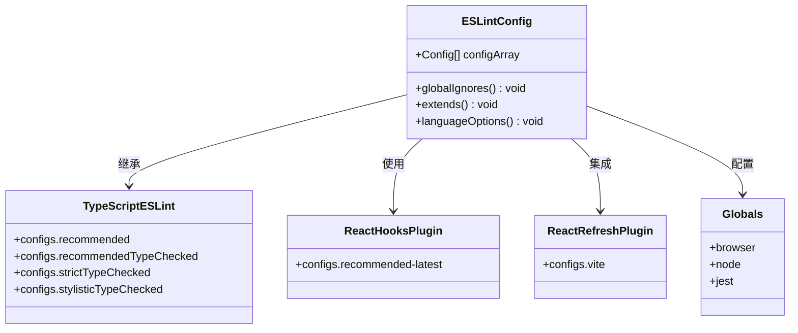
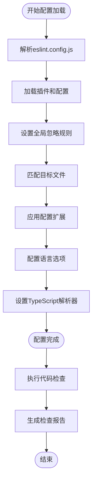

# ESLint代码质量配置

<cite>
**本文档引用的文件**
- [eslint.config.js](file://ReactVite/eslint.config.js)
- [package.json](file://ReactVite/package.json)
- [vite.config.ts](file://ReactVite/vite.config.ts)
- [tsconfig.json](file://ReactVite/tsconfig.json)
- [README.md](file://ReactVite/README.md)
- [esa.jsonc](file://ReactVite/esa.jsonc)
- [eslint.config.js](file://ReactVite-jsonc-installCommand-empty/eslint.config.js)
- [eslint.config.js](file://ReactVite-without-esajsonc/eslint.config.js)
- [eslint.config.js](file://ReactVite-with-skip-bad-er/eslint.config.js)
- [eslint.config.js](file://ReactVite-read-env/eslint.config.js)
- [package.json](file://ReactVite-jsonc-installCommand-empty/package.json)
- [package.json](file://ReactVite-without-esajsonc/package.json)
- [package.json](file://ReactVite-with-skip-bad-er/package.json)
- [package.json](file://ReactVite-read-env/package.json)
</cite>

## 目录
1. [简介](#简介)
2. [项目结构](#项目结构)
3. [核心组件](#核心组件)
4. [架构概览](#架构概览)
5. [详细组件分析](#详细组件分析)
6. [依赖关系分析](#依赖关系分析)
7. [性能考虑](#性能考虑)
8. [故障排除指南](#故障排除指南)
9. [结论](#结论)
10. [附录](#附录)

## 简介

本文件为ESLint代码质量配置的详细技术文档，专注于React + TypeScript + Vite项目的ESLint配置实现。ESLint作为静态代码分析工具，在现代前端开发中扮演着至关重要的角色，它能够帮助团队建立统一的代码规范、预防潜在错误、提升代码质量和可维护性。

在React生态系统中，ESLint配置需要特别关注以下方面：
- TypeScript类型检查与ESLint的集成
- React Hooks最佳实践检查
- React Refresh热更新支持
- Vite开发服务器的配置兼容性
- 全局变量和环境配置

本项目采用现代化的ESLint配置方式，使用ESLint 9.x的新式配置系统，通过`eslint.config.js`文件实现集中化的配置管理。

## 项目结构

ReactVite项目采用了标准的Vite + React + TypeScript模板结构，其中ESLint配置位于根目录的`eslint.config.js`文件中。项目包含多个变体版本，展示了不同的配置场景和测试用例。



**图表来源**
- [eslint.config.js:1-24](file://ReactVite/eslint.config.js#L1-L24)
- [package.json:1-30](file://ReactVite/package.json#L1-L30)
- [vite.config.ts:1-8](file://ReactVite/vite.config.ts#L1-L8)

**章节来源**
- [eslint.config.js:1-24](file://ReactVite/eslint.config.js#L1-L24)
- [package.json:1-30](file://ReactVite/package.json#L1-L30)
- [vite.config.ts:1-8](file://ReactVite/vite.config.ts#L1-L8)

## 核心组件

### ESLint配置文件结构

ESLint配置文件采用现代化的ESLint 9.x配置语法，使用`tseslint.config()`函数来创建配置数组。这种配置方式相比传统的`.eslintrc`文件具有更好的类型安全性和更清晰的结构。

配置文件的核心组成部分包括：

1. **全局忽略规则**：通过`globalIgnores(['dist'])`排除构建输出目录
2. **文件匹配模式**：使用`**/*.{ts,tsx}`匹配TypeScript和TypeScript JSX文件
3. **配置扩展**：继承多个预定义的配置集合
4. **语言选项**：设置ECMAScript版本和全局变量

### 配置扩展机制

项目配置通过`extends`属性继承了多个官方推荐配置：

- `@eslint/js`的推荐配置
- `typescript-eslint`的推荐配置
- `eslint-plugin-react-hooks`的推荐配置
- `eslint-plugin-react-refresh`的Vite集成配置

这种分层配置方式确保了基础规则、类型检查规则、React特定规则和开发环境规则的有机整合。

**章节来源**
- [eslint.config.js:8-23](file://ReactVite/eslint.config.js#L8-L23)

## 架构概览

ESLint在React + TypeScript + Vite项目中的工作流程如下：



**图表来源**
- [eslint.config.js:10-22](file://ReactVite/eslint.config.js#L10-L22)
- [package.json:9-9](file://ReactVite/package.json#L9-L9)

## 详细组件分析

### ESLint配置组件分析

#### 配置文件类图



**图表来源**
- [eslint.config.js:1-24](file://ReactVite/eslint.config.js#L1-L24)

#### 配置处理流程



**图表来源**
- [eslint.config.js:8-23](file://ReactVite/eslint.config.js#L8-L23)

**章节来源**
- [eslint.config.js:1-24](file://ReactVite/eslint.config.js#L1-L24)

### TypeScript集成组件

#### 类型检查配置

项目提供了两种类型的TypeScript集成配置：

1. **推荐配置**：使用`tseslint.configs.recommended`提供平衡的类型检查
2. **严格配置**：使用`tseslint.configs.strictTypeChecked`提供更严格的类型检查
3. **样式配置**：使用`tseslint.configs.stylisticTypeChecked`添加样式规则

这些配置通过`parserOptions.project`选项与`tsconfig.json`文件关联，实现完整的类型感知功能。

**章节来源**
- [README.md:14-40](file://ReactVite/README.md#L14-L40)

### React特定配置组件

#### React Hooks规则

项目使用`eslint-plugin-react-hooks`提供React Hooks的最佳实践检查，配置为最新的推荐版本，确保遵循React Hooks的正确使用模式。

#### React Refresh集成

通过`eslint-plugin-react-refresh`的Vite配置，实现了对React Refresh热更新的支持，确保在开发过程中组件状态的正确保持。

**章节来源**
- [eslint.config.js:3-4](file://ReactVite/eslint.config.js#L3-L4)

## 依赖关系分析

### 核心依赖关系

```mermaid
graph LR
subgraph "ESLint生态系统"
ESLintCore[ESLint核心]
TSESLint[typescript-eslint]
ReactHooks[eslint-plugin-react-hooks]
ReactRefresh[eslint-plugin-react-refresh]
Globals[globals]
end
subgraph "项目依赖"
React[React]
Vite[Vite]
TypeScript[TypeScript]
PluginReact[@vitejs/plugin-react]
end
ESLintCore --> TSESLint
ESLintCore --> ReactHooks
ESLintCore --> ReactRefresh
ESLintCore --> Globals
TSESLint --> TypeScript
ReactHooks --> React
ReactRefresh --> Vite
PluginReact --> Vite
```

**图表来源**
- [package.json:16-28](file://ReactVite/package.json#L16-L28)

### 版本兼容性矩阵

| 包名 | 版本 | 兼容性 | 用途 |
|------|------|--------|------|
| eslint | ^9.33.0 | ✅ 完全兼容 | 核心代码检查引擎 |
| typescript-eslint | ^8.39.1 | ✅ 兼容 | TypeScript解析和规则 |
| @eslint/js | ^9.33.0 | ✅ 兼容 | JavaScript基础规则 |
| eslint-plugin-react-hooks | ^5.2.0 | ✅ 兼容 | React Hooks检查 |
| eslint-plugin-react-refresh | ^0.4.20 | ✅ 兼容 | React热更新支持 |
| globals | ^16.3.0 | ✅ 兼容 | 全局变量定义 |

**章节来源**
- [package.json:16-28](file://ReactVite/package.json#L16-L28)

## 性能考虑

### 配置性能优化

1. **文件匹配优化**：通过精确的文件匹配模式减少不必要的文件扫描
2. **缓存机制**：利用ESLint的内置缓存提高重复运行速度
3. **插件选择**：仅启用必要的插件以减少处理开销
4. **忽略规则**：合理设置忽略规则避免处理大型依赖目录

### 开发环境性能

在Vite开发环境中，ESLint配置需要平衡检查准确性和开发响应速度：

- 启用增量编译以提高TypeScript检查效率
- 在开发模式下使用较宽松的规则集
- 利用Vite的快速热更新特性减少等待时间

## 故障排除指南

### 常见配置问题

#### TypeScript解析错误

**问题症状**：TypeScript文件无法正确解析或类型检查失败

**解决方案**：
1. 检查`tsconfig.json`文件的引用配置
2. 确认`parserOptions.project`路径正确
3. 验证TypeScript版本与`typescript-eslint`的兼容性

#### React Hooks规则冲突

**问题症状**：React Hooks相关规则报错或警告

**解决方案**：
1. 确保使用最新版本的`eslint-plugin-react-hooks`
2. 检查Hook的使用是否符合推荐模式
3. 避免在条件语句中调用Hook

#### Vite集成问题

**问题症状**：React Refresh功能异常或热更新失效

**解决方案**：
1. 确认`eslint-plugin-react-refresh`版本兼容
2. 检查Vite配置中的React插件设置
3. 验证开发服务器的正确启动

**章节来源**
- [eslint.config.js:18-21](file://ReactVite/eslint.config.js#L18-L21)

## 结论

本ESLint配置方案为React + TypeScript + Vite项目提供了全面的代码质量保障。通过现代化的配置方式和精心设计的插件组合，实现了：

1. **完整的类型检查**：通过TypeScript集成提供准确的类型感知
2. **React最佳实践**：确保React Hooks和组件开发的正确性
3. **开发体验优化**：与Vite热更新无缝集成
4. **团队协作支持**：统一的规则集便于多人协作

该配置方案既满足了开发效率的需求，又保证了代码质量的标准，是现代前端开发的理想选择。

## 附录

### 推荐的ESLint配置最佳实践

1. **规则定制**：根据团队规范调整规则严重级别
2. **性能监控**：定期检查ESLint运行时间并进行优化
3. **CI集成**：在持续集成中自动执行代码检查
4. **文档维护**：保持配置文档与实际规则的一致性

### 扩展配置选项

项目README提供了额外的配置扩展选项，包括：
- 更严格的类型检查配置
- React特定的lint规则插件
- 自定义规则集的集成方法

这些扩展选项为不同规模和需求的项目提供了灵活的配置选择。

**章节来源**
- [README.md:42-69](file://ReactVite/README.md#L42-L69)