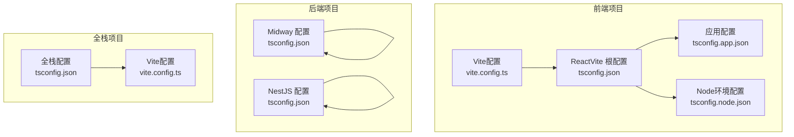
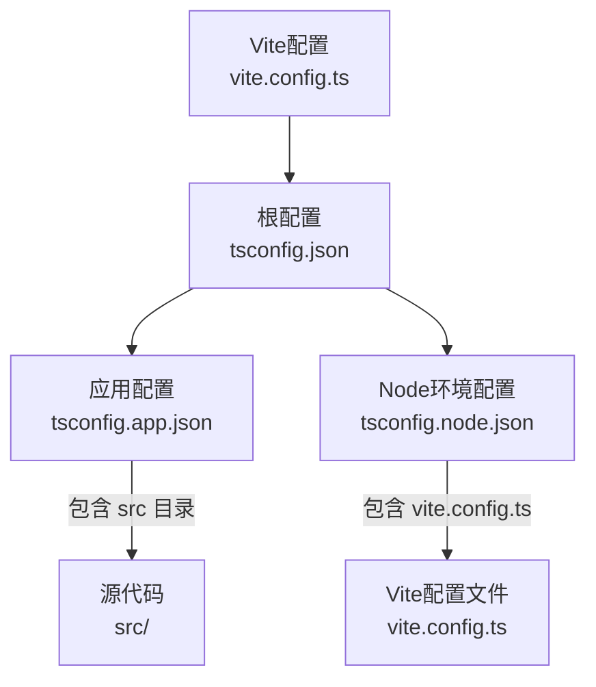
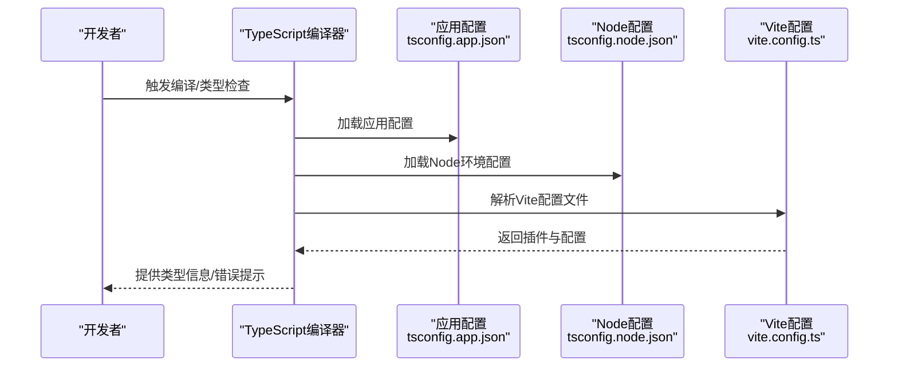
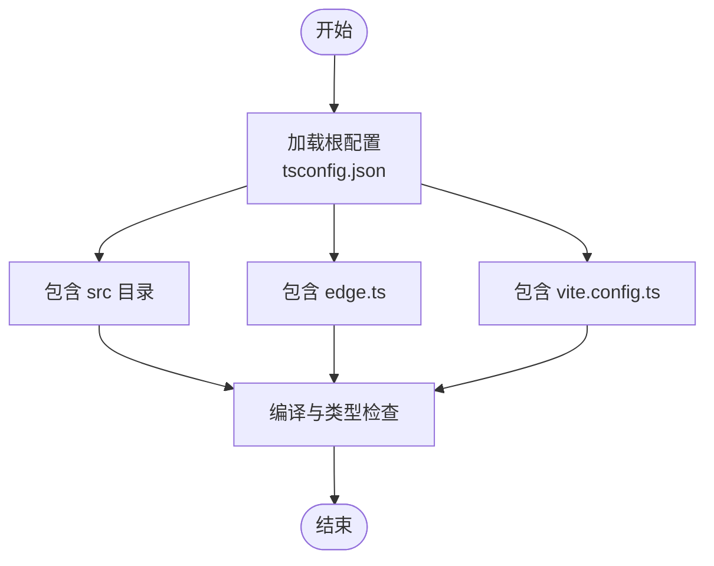
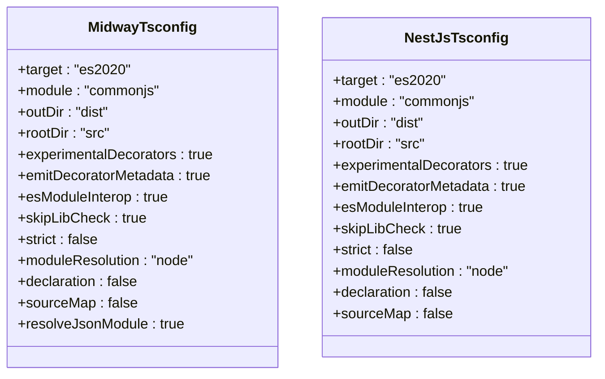
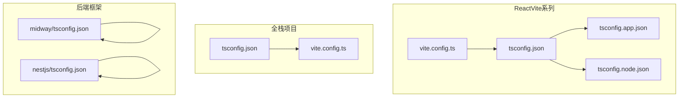

# TypeScript编译配置

<cite>
**本文档引用的文件**
- [ReactVite/tsconfig.json](file://ReactVite/tsconfig.json)
- [ReactVite/tsconfig.app.json](file://ReactVite/tsconfig.app.json)
- [ReactVite/tsconfig.node.json](file://ReactVite/tsconfig.node.json)
- [ReactVite/vite.config.ts](file://ReactVite/vite.config.ts)
- [backend-tests/midway/tsconfig.json](file://backend-tests/midway/tsconfig.json)
- [backend-tests/nestjs/tsconfig.json](file://backend-tests/nestjs/tsconfig.json)
- [Fullstack-react-express/tsconfig.json](file://Fullstack-react-express/tsconfig.json)
- [Fullstack-react-express/vite.config.ts](file://Fullstack-react-express/vite.config.ts)
- [ReactVite-jsonc-installCommand-empty/tsconfig.json](file://ReactVite-jsonc-installCommand-empty/tsconfig.json)
- [ReactVite-jsonc-installCommand-empty/tsconfig.app.json](file://ReactVite-jsonc-installCommand-empty/tsconfig.app.json)
- [ReactVite-jsonc-installCommand-empty/tsconfig.node.json](file://ReactVite-jsonc-installCommand-empty/tsconfig.node.json)
- [ReactVite-without-esajsonc/tsconfig.json](file://ReactVite-without-esajsonc/tsconfig.json)
- [ReactVite-without-esajsonc/tsconfig.app.json](file://ReactVite-without-esajsonc/tsconfig.app.json)
- [ReactVite-without-esajsonc/tsconfig.node.json](file://ReactVite-without-esajsonc/tsconfig.node.json)
- [ReactVite-with-skip-bad-er/tsconfig.app.json](file://ReactVite-with-skip-bad-er/tsconfig.app.json)
</cite>

## 目录
1. [简介](#简介)
2. [项目结构](#项目结构)
3. [核心组件](#核心组件)
4. [架构概览](#架构概览)
5. [详细组件分析](#详细组件分析)
6. [依赖关系分析](#依赖关系分析)
7. [性能考虑](#性能考虑)
8. [故障排除指南](#故障排除指南)
9. [结论](#结论)
10. [附录](#附录)

## 简介

本文件为TypeScript编译配置的综合技术文档，基于仓库中的实际配置案例，深入解析tsconfig.json文件的结构、编译选项及其在不同项目类型中的应用。文档重点涵盖：

- 编译目标（target）与模块系统（module）的选择策略
- 路径映射与模块解析机制
- 严格模式（strict）与类型检查选项
- 多配置文件组织（references）与分层配置
- 与Vite集成的最佳实践
- 配置验证、性能优化与常见问题解决方案

通过对比分析React Vite、全栈React+Express以及后端框架（Midway、NestJS）的配置，帮助读者建立可迁移的配置体系。

## 项目结构

本仓库包含多种TypeScript项目配置示例，主要集中在前端React Vite项目与后端框架项目中。关键配置文件分布如下：

- 前端多配置文件结构：ReactVite系列项目采用根tsconfig.json通过references引用多个子配置文件，分别用于应用代码与Node环境配置。
- 后端框架配置：Midway与NestJS项目使用单一tsconfig.json集中管理编译选项。
- 全栈项目：Fullstack-react-express同时包含前端源码与服务端配置，统一在tsconfig.json中进行编译控制。

**图表来源**
- [ReactVite/tsconfig.json:1-8](file://ReactVite/tsconfig.json#L1-L8)
- [ReactVite/tsconfig.app.json:1-28](file://ReactVite/tsconfig.app.json#L1-L28)
- [ReactVite/tsconfig.node.json:1-26](file://ReactVite/tsconfig.node.json#L1-L26)
- [ReactVite/vite.config.ts:1-8](file://ReactVite/vite.config.ts#L1-L8)
- [backend-tests/midway/tsconfig.json:1-19](file://backend-tests/midway/tsconfig.json#L1-L19)
- [backend-tests/nestjs/tsconfig.json:1-18](file://backend-tests/nestjs/tsconfig.json#L1-L18)
- [Fullstack-react-express/tsconfig.json:1-16](file://Fullstack-react-express/tsconfig.json#L1-L16)
- [Fullstack-react-express/vite.config.ts:1-7](file://Fullstack-react-express/vite.config.ts#L1-L7)

**章节来源**
- [ReactVite/tsconfig.json:1-8](file://ReactVite/tsconfig.json#L1-L8)
- [ReactVite/tsconfig.app.json:1-28](file://ReactVite/tsconfig.app.json#L1-L28)
- [ReactVite/tsconfig.node.json:1-26](file://ReactVite/tsconfig.node.json#L1-L26)
- [backend-tests/midway/tsconfig.json:1-19](file://backend-tests/midway/tsconfig.json#L1-L19)
- [backend-tests/nestjs/tsconfig.json:1-18](file://backend-tests/nestjs/tsconfig.json#L1-L18)
- [Fullstack-react-express/tsconfig.json:1-16](file://Fullstack-react-express/tsconfig.json#L1-L16)
- [Fullstack-react-express/vite.config.ts:1-7](file://Fullstack-react-express/vite.config.ts#L1-L7)

## 核心组件

本节从配置角度拆解TypeScript编译的核心组件，并结合仓库中的实际配置进行说明。

- 编译目标（target）
  - 前端项目普遍选择较新的ECMAScript版本，如ES2022或ES2023，以获得更好的语法支持与运行时特性。
  - 后端项目通常选择ES2020，兼顾兼容性与现代语法能力。

- 模块系统（module）
  - 前端Vite项目采用ESNext模块系统，配合bundler模式的模块解析，确保与打包器的协同工作。
  - 后端项目采用CommonJS模块系统，适配Node.js运行时。

- 模块解析（moduleResolution）
  - Vite前端项目使用bundler模式，强调与打包器的紧密协作。
  - 后端项目使用node模式，遵循Node.js的模块解析规则。

- JSX处理（jsx）
  - React Vite项目启用react-jsx，配合@vitejs/plugin-react插件，实现高效的开发体验。

- 严格模式（strict）
  - 前端项目普遍开启严格模式，提升类型安全与代码质量。
  - 后端项目根据团队规范选择开启或关闭。

- 输出控制（noEmit）
  - 开发阶段的前端配置通常设置noEmit为true，由Vite负责构建与打包。

- 类型检查与跳过库检查（skipLibCheck）
  - 为加速编译过程，多数项目开启skipLibCheck，减少第三方库的类型检查开销。

**章节来源**
- [ReactVite/tsconfig.app.json:2-25](file://ReactVite/tsconfig.app.json#L2-L25)
- [ReactVite/tsconfig.node.json:2-23](file://ReactVite/tsconfig.node.json#L2-L23)
- [backend-tests/midway/tsconfig.json:2-16](file://backend-tests/midway/tsconfig.json#L2-L16)
- [backend-tests/nestjs/tsconfig.json:2-15](file://backend-tests/nestjs/tsconfig.json#L2-L15)
- [Fullstack-react-express/tsconfig.json:2-13](file://Fullstack-react-express/tsconfig.json#L2-L13)

## 架构概览

下图展示了前端多配置文件的组织方式与依赖关系，以及与Vite的集成流程。

**图表来源**
- [ReactVite/tsconfig.json:1-8](file://ReactVite/tsconfig.json#L1-L8)
- [ReactVite/tsconfig.app.json:26-27](file://ReactVite/tsconfig.app.json#L26-L27)
- [ReactVite/tsconfig.node.json:24-25](file://ReactVite/tsconfig.node.json#L24-L25)
- [ReactVite/vite.config.ts:1-8](file://ReactVite/vite.config.ts#L1-L8)

**章节来源**
- [ReactVite/tsconfig.json:1-8](file://ReactVite/tsconfig.json#L1-L8)
- [ReactVite/vite.config.ts:1-8](file://ReactVite/vite.config.ts#L1-L8)

## 详细组件分析

### React Vite 多配置文件架构

React Vite项目采用根tsconfig.json通过references引用两个子配置文件：tsconfig.app.json用于应用代码，tsconfig.node.json用于Node环境（如Vite配置文件）。这种设计实现了职责分离与增量编译的优化。

**图表来源**
- [ReactVite/tsconfig.json:1-8](file://ReactVite/tsconfig.json#L1-L8)
- [ReactVite/tsconfig.app.json:1-28](file://ReactVite/tsconfig.app.json#L1-L28)
- [ReactVite/tsconfig.node.json:1-26](file://ReactVite/tsconfig.node.json#L1-L26)
- [ReactVite/vite.config.ts:1-8](file://ReactVite/vite.config.ts#L1-L8)

**章节来源**
- [ReactVite/tsconfig.json:1-8](file://ReactVite/tsconfig.json#L1-L8)
- [ReactVite/tsconfig.app.json:1-28](file://ReactVite/tsconfig.app.json#L1-L28)
- [ReactVite/tsconfig.node.json:1-26](file://ReactVite/tsconfig.node.json#L1-L26)
- [ReactVite/vite.config.ts:1-8](file://ReactVite/vite.config.ts#L1-L8)

### 全栈 React + Express 配置

全栈项目在tsconfig.json中统一管理编译选项，包含src目录与服务端相关文件（如edge.ts、vite.config.ts），确保前后端代码在同一编译上下文中进行类型检查。

**图表来源**
- [Fullstack-react-express/tsconfig.json:14-14](file://Fullstack-react-express/tsconfig.json#L14-L14)
- [Fullstack-react-express/vite.config.ts:1-7](file://Fullstack-react-express/vite.config.ts#L1-L7)

**章节来源**
- [Fullstack-react-express/tsconfig.json:1-16](file://Fullstack-react-express/tsconfig.json#L1-L16)
- [Fullstack-react-express/vite.config.ts:1-7](file://Fullstack-react-express/vite.config.ts#L1-L7)

### 后端框架（Midway/NestJS）配置

后端框架项目采用单一tsconfig.json集中管理编译选项，目标为ES2020，模块系统为CommonJS，适合Node.js运行时。这类项目通常不涉及前端构建工具的集成，因此配置相对简洁。

**图表来源**
- [backend-tests/midway/tsconfig.json:1-19](file://backend-tests/midway/tsconfig.json#L1-L19)
- [backend-tests/nestjs/tsconfig.json:1-18](file://backend-tests/nestjs/tsconfig.json#L1-L18)

**章节来源**
- [backend-tests/midway/tsconfig.json:1-19](file://backend-tests/midway/tsconfig.json#L1-L19)
- [backend-tests/nestjs/tsconfig.json:1-18](file://backend-tests/nestjs/tsconfig.json#L1-L18)

## 依赖关系分析

本节分析配置文件之间的依赖关系与耦合度，帮助理解配置的组织原则与维护策略。

**图表来源**
- [ReactVite/tsconfig.json:1-8](file://ReactVite/tsconfig.json#L1-L8)
- [ReactVite/tsconfig.app.json:1-28](file://ReactVite/tsconfig.app.json#L1-L28)
- [ReactVite/tsconfig.node.json:1-26](file://ReactVite/tsconfig.node.json#L1-L26)
- [ReactVite/vite.config.ts:1-8](file://ReactVite/vite.config.ts#L1-L8)
- [Fullstack-react-express/tsconfig.json:1-16](file://Fullstack-react-express/tsconfig.json#L1-L16)
- [Fullstack-react-express/vite.config.ts:1-7](file://Fullstack-react-express/vite.config.ts#L1-L7)
- [backend-tests/midway/tsconfig.json:1-19](file://backend-tests/midway/tsconfig.json#L1-L19)
- [backend-tests/nestjs/tsconfig.json:1-18](file://backend-tests/nestjs/tsconfig.json#L1-L18)

**章节来源**
- [ReactVite/tsconfig.json:1-8](file://ReactVite/tsconfig.json#L1-L8)
- [Fullstack-react-express/tsconfig.json:1-16](file://Fullstack-react-express/tsconfig.json#L1-L16)
- [backend-tests/midway/tsconfig.json:1-19](file://backend-tests/midway/tsconfig.json#L1-L19)
- [backend-tests/nestjs/tsconfig.json:1-18](file://backend-tests/nestjs/tsconfig.json#L1-L18)

## 性能考虑

- 跳过库检查（skipLibCheck）
  - 在大型项目中开启此选项可显著减少类型检查时间，适用于大多数前端与全栈项目。

- noEmit与打包器协作
  - 前端开发阶段建议保持noEmit为true，由Vite等打包器负责构建，避免重复编译与输出。

- 模块解析模式
  - 前端项目使用bundler模式，后端项目使用node模式，确保模块解析符合运行时环境，减少不必要的解析开销。

- 目标与模块系统选择
  - 选择与目标运行时兼容且不过于超前的目标版本，避免不必要的降级转换成本。

- 并行编译与增量构建
  - 使用references组织多配置文件，结合tsbuildinfo缓存，提升增量编译效率。

**章节来源**
- [ReactVite/tsconfig.app.json:8-8](file://ReactVite/tsconfig.app.json#L8-L8)
- [ReactVite/tsconfig.node.json:7-7](file://ReactVite/tsconfig.node.json#L7-L7)
- [backend-tests/midway/tsconfig.json:10-10](file://backend-tests/midway/tsconfig.json#L10-L10)
- [backend-tests/nestjs/tsconfig.json:10-10](file://backend-tests/nestjs/tsconfig.json#L10-L10)

## 故障排除指南

- 模块解析失败
  - 确认moduleResolution设置与运行时一致（前端使用bundler，后端使用node）。
  - 检查include路径是否覆盖到实际源码目录。

- JSX编译错误
  - 确保启用了react-jsx并正确配置了@vitejs/plugin-react插件。
  - 检查文件扩展名与导入语句是否符合jsx配置。

- 类型检查缓慢
  - 开启skipLibCheck以减少第三方库的类型检查。
  - 使用references组织配置，利用增量编译与tsbuildinfo缓存。

- 输出冲突
  - 前端开发阶段保持noEmit为true，避免与打包器产生输出冲突。
  - 后端项目合理设置outDir与rootDir，确保产物目录清晰。

- Vite集成问题
  - 确保vite.config.ts与tsconfig.json的moduleResolution一致。
  - 检查Vite插件与TypeScript配置的兼容性。

**章节来源**
- [ReactVite/tsconfig.app.json:11-14](file://ReactVite/tsconfig.app.json#L11-L14)
- [ReactVite/tsconfig.node.json:10-13](file://ReactVite/tsconfig.node.json#L10-L13)
- [ReactVite/vite.config.ts:1-8](file://ReactVite/vite.config.ts#L1-L8)
- [Fullstack-react-express/tsconfig.json:6-6](file://Fullstack-react-express/tsconfig.json#L6-L6)

## 结论

通过对仓库中多种TypeScript配置案例的分析，可以总结出以下最佳实践：

- 前端项目优先采用多配置文件结构（references），将应用代码与Node环境配置分离，提升可维护性与编译效率。
- 严格模式与类型检查应根据项目规模与团队规范灵活调整，平衡质量与性能。
- 与Vite等打包器的集成需确保模块解析与输出策略一致，避免冲突。
- 后端项目可采用单一配置文件，专注于CommonJS与Node.js运行时的兼容性。

这些经验可作为不同类型项目配置的参考模板，在保证开发体验的同时，确保构建与运行的稳定性。

## 附录

### 推荐配置模板

- 前端Vite项目（多配置文件）
  - 根配置：通过references引用应用与Node配置
  - 应用配置：启用bundler模式、react-jsx、严格模式
  - Node配置：针对Vite配置文件的独立编译环境

- 全栈项目
  - 统一在根配置中包含src、服务端入口与Vite配置文件
  - 保持与前端相同的模块解析与严格模式策略

- 后端框架项目（Midway/NestJS）
  - 目标版本：ES2020
  - 模块系统：CommonJS
  - 模块解析：node
  - 保持skipLibCheck与合理的输出目录设置

**章节来源**
- [ReactVite/tsconfig.json:1-8](file://ReactVite/tsconfig.json#L1-L8)
- [ReactVite/tsconfig.app.json:1-28](file://ReactVite/tsconfig.app.json#L1-L28)
- [ReactVite/tsconfig.node.json:1-26](file://ReactVite/tsconfig.node.json#L1-L26)
- [Fullstack-react-express/tsconfig.json:1-16](file://Fullstack-react-express/tsconfig.json#L1-L16)
- [backend-tests/midway/tsconfig.json:1-19](file://backend-tests/midway/tsconfig.json#L1-L19)
- [backend-tests/nestjs/tsconfig.json:1-18](file://backend-tests/nestjs/tsconfig.json#L1-L18)