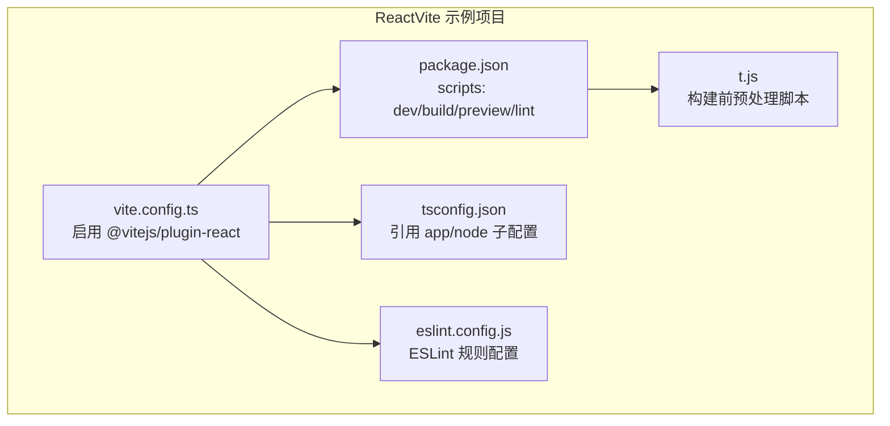
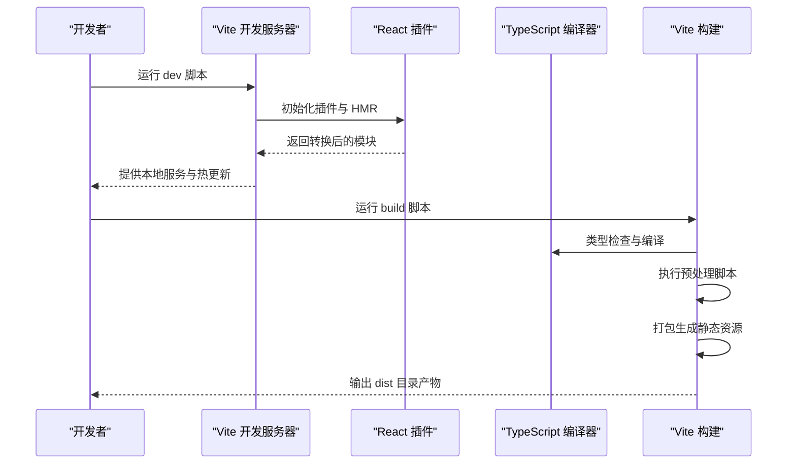
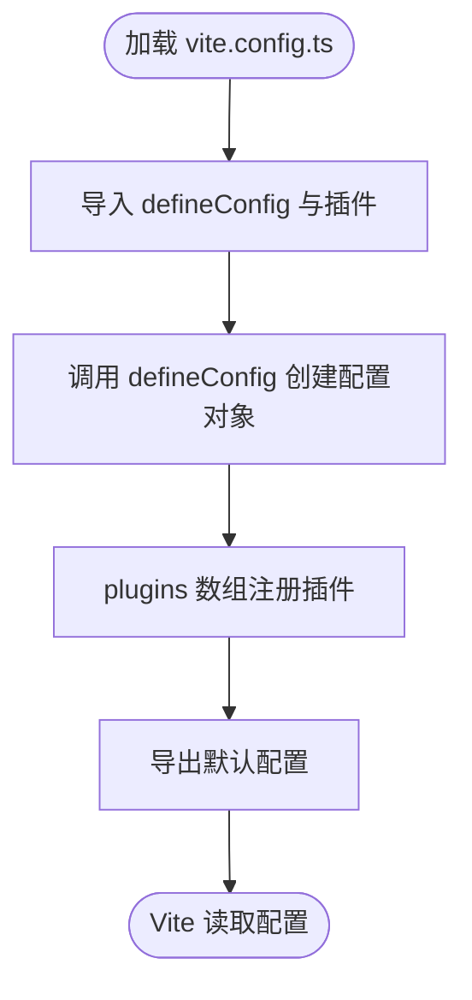
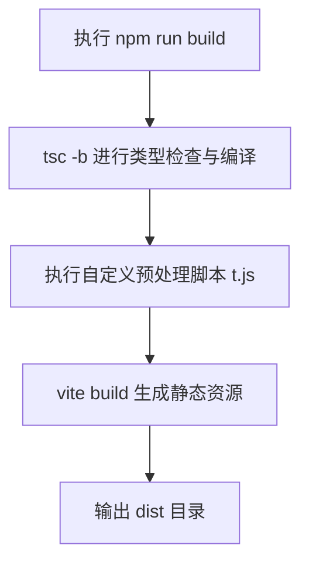
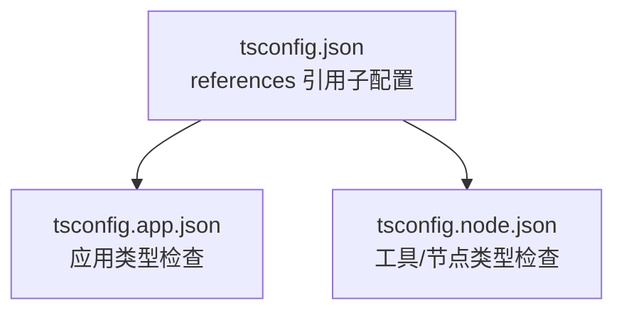
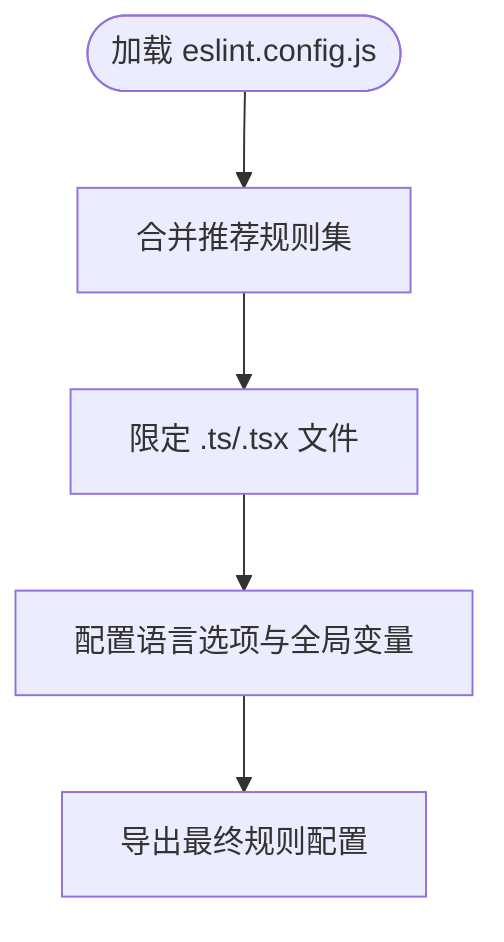
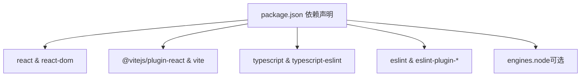

# Vite构建配置

<cite>
**本文档引用的文件**
- [ReactVite/vite.config.ts](file://ReactVite/vite.config.ts)
- [ReactVite-jsonc-installCommand-empty/vite.config.ts](file://ReactVite-jsonc-installCommand-empty/vite.config.ts)
- [ReactVite-node-engine/vite.config.ts](file://ReactVite-node-engine/vite.config.ts)
- [ReactVite-read-env/vite.config.ts](file://ReactVite-read-env/vite.config.ts)
- [ReactVite-without-esajsonc/vite.config.ts](file://ReactVite-without-esajsonc/vite.config.ts)
- [Fullstack-react-express/vite.config.ts](file://Fullstack-react-express/vite.config.ts)
- [ReactVite/package.json](file://ReactVite/package.json)
- [ReactVite-jsonc-installCommand-empty/package.json](file://ReactVite-jsonc-installCommand-empty/package.json)
- [ReactVite-node-engine/package.json](file://ReactVite-node-engine/package.json)
- [ReactVite-read-env/package.json](file://ReactVite-read-env/package.json)
- [ReactVite-without-esajsonc/package.json](file://ReactVite-without-esajsonc/package.json)
- [Fullstack-react-express/package.json](file://Fullstack-react-express/package.json)
- [ReactVite/tsconfig.json](file://ReactVite/tsconfig.json)
- [ReactVite/eslint.config.js](file://ReactVite/eslint.config.js)
- [ReactVite/t.js](file://ReactVite/t.js)
</cite>

## 目录
1. [简介](#简介)
2. [项目结构](#项目结构)
3. [核心组件](#核心组件)
4. [架构概览](#架构概览)
5. [详细组件分析](#详细组件分析)
6. [依赖分析](#依赖分析)
7. [性能考虑](#性能考虑)
8. [故障排除指南](#故障排除指南)
9. [结论](#结论)
10. [附录](#附录)

## 简介
本文件面向使用 Vite 构建 React 应用的开发者，系统性梳理 Vite 配置文件的基本结构与核心选项，重点覆盖插件配置、构建优化、开发服务器设置等关键配置项，并结合仓库中的多个 ReactVite 示例项目，总结开发与生产环境的配置差异、自定义构建行为、优化打包体积与提升构建性能的最佳实践。同时提供完整的配置参考与故障排除指南，帮助读者快速上手并稳定落地。

## 项目结构
本仓库包含多个 ReactVite 示例项目，均采用统一的 Vite 基础配置模式：通过一个最小化的配置文件启用 React 插件，配合 TypeScript 编译与 Vite 构建流程。主要目录与文件如下：
- 配置文件：vite.config.ts（各示例项目）
- 构建脚本：package.json 中的 scripts 字段（dev/build/preview/lint）
- 类型检查：tsconfig.json 及其子配置文件
- 代码规范：eslint.config.js
- 辅助脚本：t.js（用于演示构建前的预处理）

**图表来源**
- [ReactVite/vite.config.ts:1-8](file://ReactVite/vite.config.ts#L1-L8)
- [ReactVite/package.json:1-30](file://ReactVite/package.json#L1-L30)
- [ReactVite/tsconfig.json:1-8](file://ReactVite/tsconfig.json#L1-L8)
- [ReactVite/eslint.config.js:1-24](file://ReactVite/eslint.config.js#L1-L24)
- [ReactVite/t.js:1-1](file://ReactVite/t.js#L1-L1)

**章节来源**
- [ReactVite/vite.config.ts:1-8](file://ReactVite/vite.config.ts#L1-L8)
- [ReactVite/package.json:1-30](file://ReactVite/package.json#L1-L30)
- [ReactVite/tsconfig.json:1-8](file://ReactVite/tsconfig.json#L1-L8)
- [ReactVite/eslint.config.js:1-24](file://ReactVite/eslint.config.js#L1-L24)
- [ReactVite/t.js:1-1](file://ReactVite/t.js#L1-L1)

## 核心组件
- Vite 配置入口：通过 defineConfig 导出默认配置对象，集中声明插件、构建参数、开发服务器等。
- React 插件：@vitejs/plugin-react 提供 JSX 转换、HMR 支持与开发体验优化。
- 构建脚本：在 package.json 的 scripts 中定义 dev/build/preview/lint，串联 TypeScript 编译与 Vite 构建。
- 类型检查：tsconfig.json 使用 references 引入 app/node 子配置，实现多项目类型检查隔离。
- 代码规范：eslint.config.js 统一 ESLint、TypeScript ESLint、React Hooks 与 React Refresh 规则。
- 预处理脚本：t.js 展示构建前可执行的自定义逻辑（如打印信息）。

**章节来源**
- [ReactVite/vite.config.ts:1-8](file://ReactVite/vite.config.ts#L1-L8)
- [ReactVite/package.json:6-11](file://ReactVite/package.json#L6-L11)
- [ReactVite/tsconfig.json:3-6](file://ReactVite/tsconfig.json#L3-L6)
- [ReactVite/eslint.config.js:8-23](file://ReactVite/eslint.config.js#L8-L23)
- [ReactVite/t.js:1-1](file://ReactVite/t.js#L1-L1)

## 架构概览
下图展示从开发到生产的典型流程：开发时由 Vite 启动本地服务，热更新与插件协同；构建时先进行类型检查与预处理，再交由 Vite 打包输出静态资源。

**图表来源**
- [ReactVite/package.json:6-11](file://ReactVite/package.json#L6-L11)
- [ReactVite/vite.config.ts:5-7](file://ReactVite/vite.config.ts#L5-L7)
- [ReactVite/t.js:1-1](file://ReactVite/t.js#L1-L1)

## 详细组件分析

### Vite 配置文件分析
- 配置结构：统一采用 defineConfig 包裹，导出包含 plugins 数组的对象。
- 插件启用：所有示例项目均启用 @vitejs/plugin-react，确保 JSX 转换与开发体验。
- 扩展点：可在 plugins 数组中添加更多插件，或在 defineConfig 内扩展其他配置项（如 build、server、resolve 等）。

**图表来源**
- [ReactVite/vite.config.ts:1-8](file://ReactVite/vite.config.ts#L1-L8)

**章节来源**
- [ReactVite/vite.config.ts:5-7](file://ReactVite/vite.config.ts#L5-L7)
- [ReactVite-jsonc-installCommand-empty/vite.config.ts:5-7](file://ReactVite-jsonc-installCommand-empty/vite.config.ts#L5-L7)
- [ReactVite-node-engine/vite.config.ts:5-7](file://ReactVite-node-engine/vite.config.ts#L5-L7)
- [ReactVite-read-env/vite.config.ts:5-7](file://ReactVite-read-env/vite.config.ts#L5-L7)
- [ReactVite-without-esajsonc/vite.config.ts:5-7](file://ReactVite-without-esajsonc/vite.config.ts#L5-L7)
- [Fullstack-react-express/vite.config.ts:4-6](file://Fullstack-react-express/vite.config.ts#L4-L6)

### 构建脚本与流程
- 开发脚本：dev 直接启动 Vite 开发服务器。
- 构建脚本：build 先执行 TypeScript 编译（tsc -b），再运行 vite build 生成产物。
- 预览脚本：preview 在本地预览构建产物。
- 预处理：部分项目在构建前执行 t.js（例如打印信息），可替换为实际的构建前置任务。

**图表来源**
- [ReactVite/package.json:8-8](file://ReactVite/package.json#L8-L8)
- [ReactVite/t.js:1-1](file://ReactVite/t.js#L1-L1)

**章节来源**
- [ReactVite/package.json:6-11](file://ReactVite/package.json#L6-L11)
- [ReactVite-jsonc-installCommand-empty/package.json:6-11](file://ReactVite-jsonc-installCommand-empty/package.json#L6-L11)
- [ReactVite-node-engine/package.json:6-11](file://ReactVite-node-engine/package.json#L6-L11)
- [ReactVite-read-env/package.json:6-11](file://ReactVite-read-env/package.json#L6-L11)
- [ReactVite-without-esajsonc/package.json:6-11](file://ReactVite-without-esajsonc/package.json#L6-L11)
- [ReactVite/t.js:1-1](file://ReactVite/t.js#L1-L1)

### TypeScript 配置与多项目隔离
- 主配置：tsconfig.json 通过 references 引入 app 与 node 子配置，实现多项目类型检查分离。
- 应用侧：app 配置用于前端应用类型检查。
- 工具/节点侧：node 配置用于工具链或服务端类型检查。

**图表来源**
- [ReactVite/tsconfig.json:3-6](file://ReactVite/tsconfig.json#L3-L6)

**章节来源**
- [ReactVite/tsconfig.json:1-8](file://ReactVite/tsconfig.json#L1-L8)

### ESLint 规则与最佳实践
- 规则组合：统一启用 @eslint/js 推荐规则、typescript-eslint 推荐规则、React Hooks 最佳实践与 React Refresh 规则。
- 文件范围：对 .ts/.tsx 文件应用上述规则集。
- 全局忽略：忽略 dist 目录，避免对构建产物进行 lint。

**图表来源**
- [ReactVite/eslint.config.js:8-23](file://ReactVite/eslint.config.js#L8-L23)

**章节来源**
- [ReactVite/eslint.config.js:1-24](file://ReactVite/eslint.config.js#L1-L24)

### 开发服务器与构建优化（基于现有配置的扩展建议）
当前示例项目未显式配置开发服务器与构建优化参数。以下为常见扩展方向（概念性说明，不绑定具体文件）：
- 开发服务器：可通过 server 字段配置 host/port/https/proxy 等。
- 构建优化：可通过 build 字段配置 rollupOptions、minify、chunk 大小策略、资源路径等。
- 解析与别名：通过 resolve.alias 配置路径别名，提升开发体验。
- 环境变量：通过 envDir/envPrefix 等配置管理不同环境变量目录与前缀。

[本节为概念性说明，不直接分析具体文件，故无“章节来源”]

## 依赖分析
- 运行时依赖：React 生态（react、react-dom）。
- 开发时依赖：@vitejs/plugin-react、vite、TypeScript 及其 ESLint 插件、React Hooks/Refresh ESLint 规则。
- Node 版本：部分项目通过 engines 指定 Node 版本要求（如 24.13.0）。

**图表来源**
- [ReactVite/package.json:12-28](file://ReactVite/package.json#L12-L28)
- [ReactVite-node-engine/package.json:16-18](file://ReactVite-node-engine/package.json#L16-L18)

**章节来源**
- [ReactVite/package.json:12-28](file://ReactVite/package.json#L12-L28)
- [ReactVite-jsonc-installCommand-empty/package.json:12-28](file://ReactVite-jsonc-installCommand-empty/package.json#L12-L28)
- [ReactVite-node-engine/package.json:16-18](file://ReactVite-node-engine/package.json#L16-L18)
- [ReactVite-read-env/package.json:12-28](file://ReactVite-read-env/package.json#L12-L28)
- [ReactVite-without-esajsonc/package.json:12-28](file://ReactVite-without-esajsonc/package.json#L12-L28)
- [Fullstack-react-express/package.json:9-20](file://Fullstack-react-express/package.json#L9-L20)

## 性能考虑
- 并行编译：使用 tsc -b 启动增量编译，减少重复类型检查开销。
- 插件优先：仅启用必要插件，避免不必要的转换与扫描。
- 资源拆分：合理划分 chunk，利用浏览器缓存与按需加载。
- 预处理精简：预处理脚本仅执行必要操作，避免阻塞主构建流程。
- 环境隔离：区分开发与生产配置，生产环境开启压缩与 Tree-shaking。

[本节提供通用指导，不直接分析具体文件，故无“章节来源”]

## 故障排除指南
- 构建前脚本失败：检查预处理脚本（如 t.js）是否抛出异常或阻塞进程。
- 类型检查错误：确认 tsconfig.references 正确指向子配置，逐步缩小问题范围。
- 插件冲突：逐一禁用插件定位冲突来源，优先保留 @vitejs/plugin-react。
- 环境变量未生效：确认环境变量前缀与读取方式一致，避免拼写错误。
- Node 版本不匹配：若项目声明了 engines.node，请确保本地 Node 版本满足要求。

**章节来源**
- [ReactVite/t.js:1-1](file://ReactVite/t.js#L1-L1)
- [ReactVite/tsconfig.json:3-6](file://ReactVite/tsconfig.json#L3-L6)
- [ReactVite/package.json:16-28](file://ReactVite/package.json#L16-L28)
- [ReactVite-node-engine/package.json:16-18](file://ReactVite-node-engine/package.json#L16-L18)

## 结论
本仓库中的多个 ReactVite 示例项目展示了 Vite 配置的最小可行实践：以 @vitejs/plugin-react 为核心，结合 TypeScript 编译与 Vite 构建脚本，即可快速搭建现代化前端工程。在此基础上，可根据团队需求扩展开发服务器与构建优化配置，持续优化构建性能与开发体验。

## 附录
- 完整配置参考（概念性说明，不绑定具体文件）
  - 插件配置：在 plugins 数组中注册所需插件，如 @vitejs/plugin-react、unplugin-auto-import 等。
  - 开发服务器：通过 server 字段配置 host/port/https/proxy，提升开发效率。
  - 构建优化：通过 build.rollupOptions 自定义 Rollup 行为，结合 minify、chunk 策略优化产物体积。
  - 解析与别名：通过 resolve.alias 设置常用路径别名，简化导入语句。
  - 环境变量：通过 envDir/envPrefix 管理不同环境变量目录与前缀，确保安全与一致性。

[本节为概念性说明，不直接分析具体文件，故无“章节来源”]