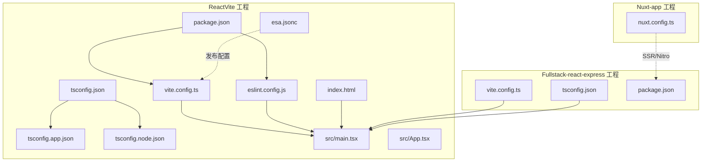
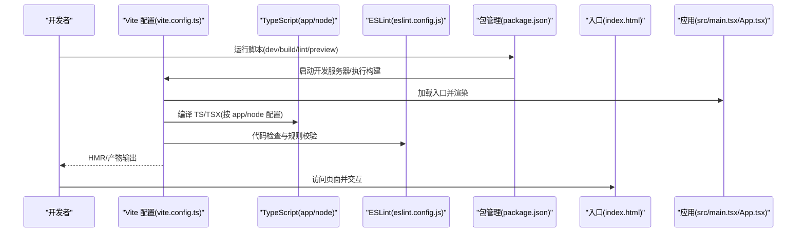
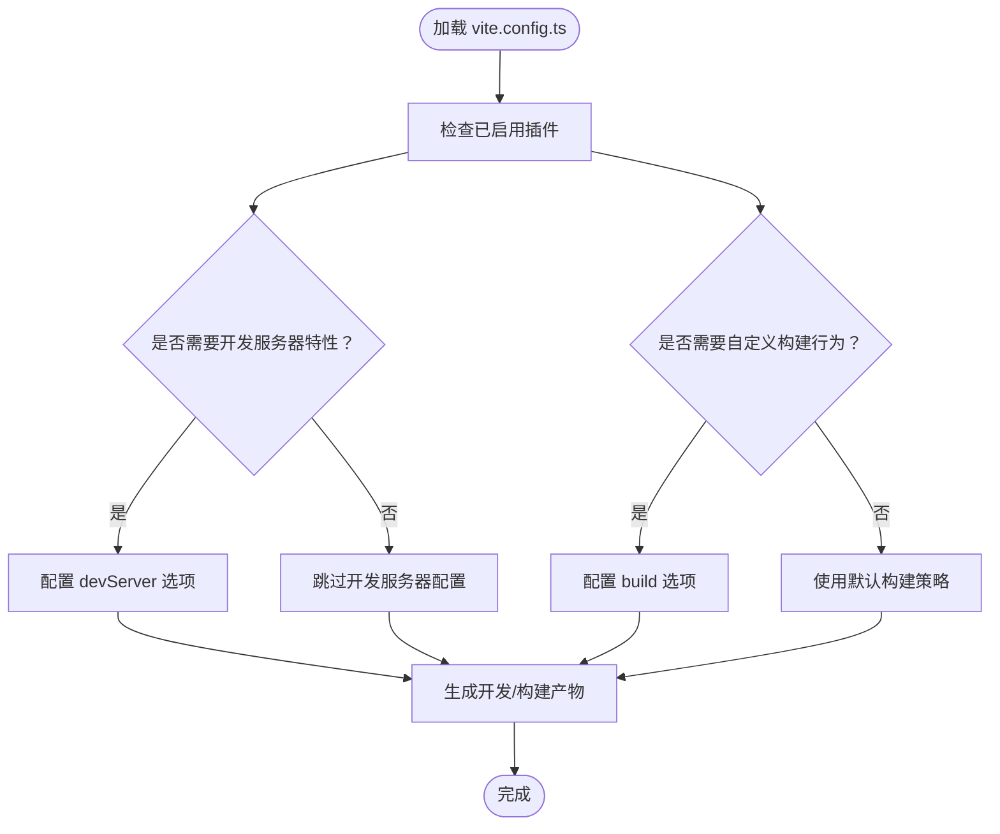
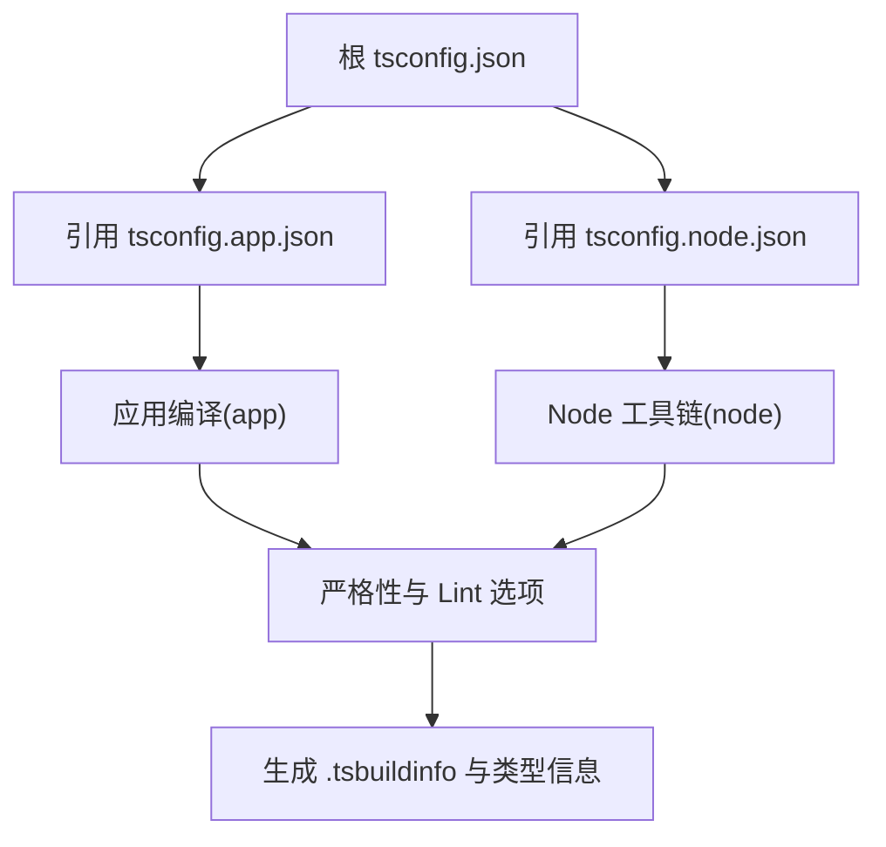
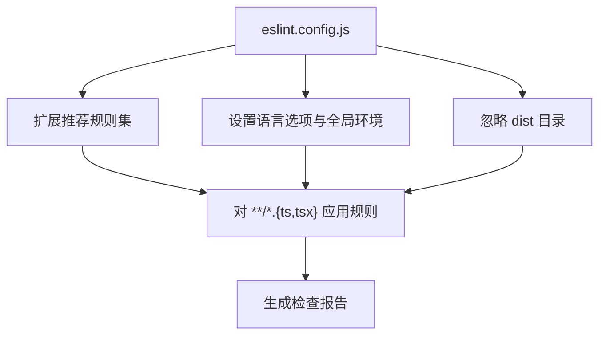
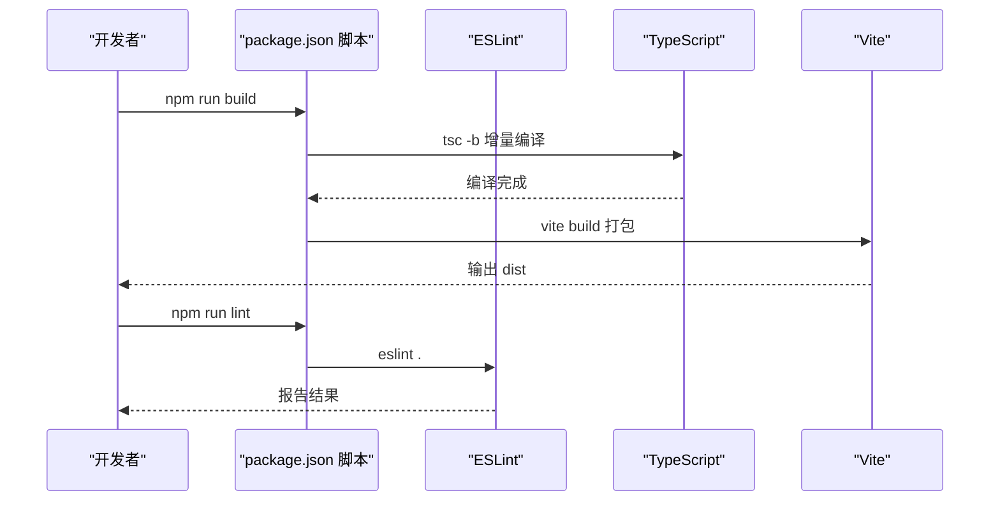
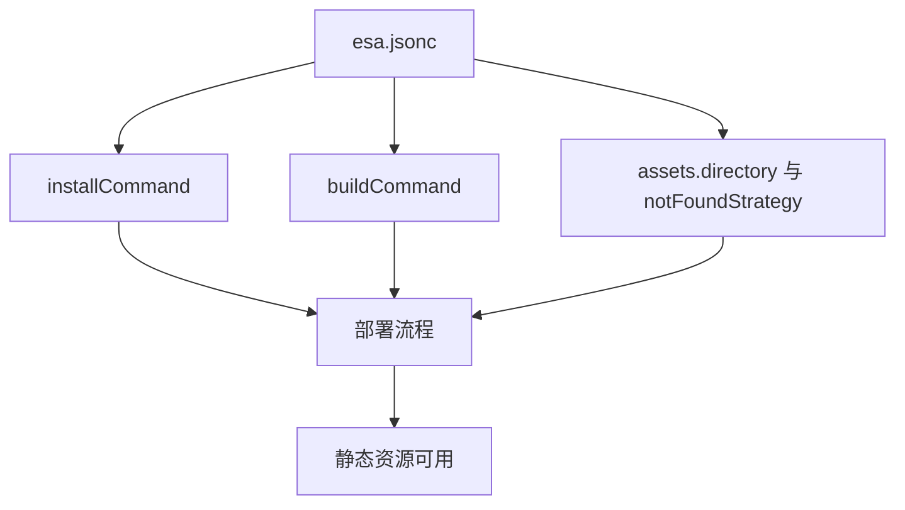
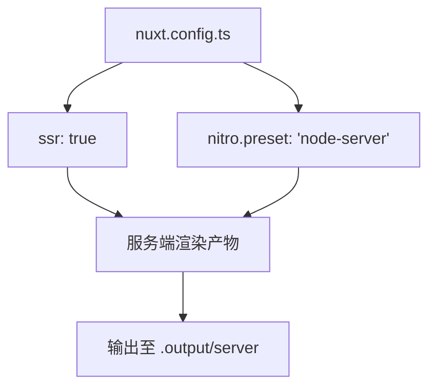
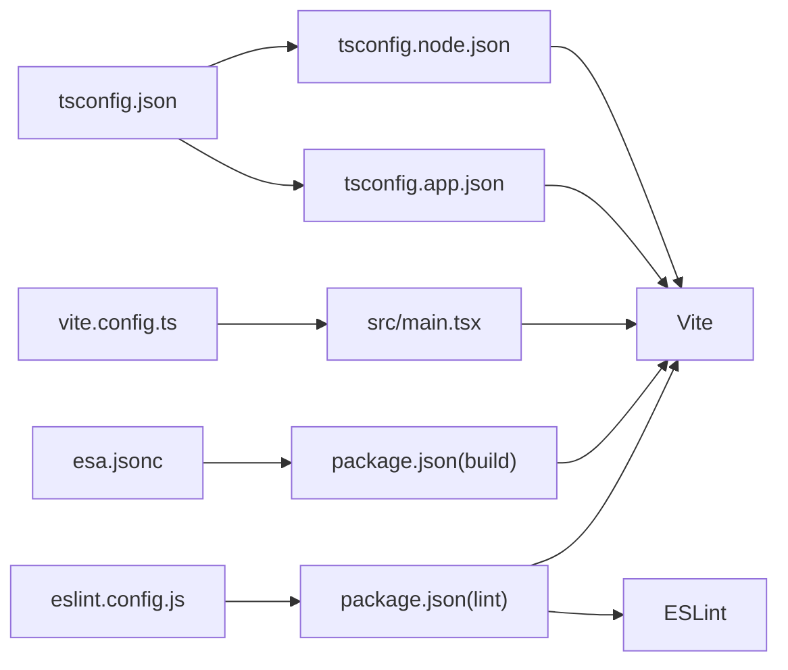

# 配置管理

<cite>
**本文引用的文件**
- [ReactVite/vite.config.ts](file://ReactVite/vite.config.ts)
- [ReactVite/tsconfig.json](file://ReactVite/tsconfig.json)
- [ReactVite/tsconfig.app.json](file://ReactVite/tsconfig.app.json)
- [ReactVite/tsconfig.node.json](file://ReactVite/tsconfig.node.json)
- [ReactVite/eslint.config.js](file://ReactVite/eslint.config.js)
- [ReactVite/package.json](file://ReactVite/package.json)
- [ReactVite/index.html](file://ReactVite/index.html)
- [ReactVite/src/main.tsx](file://ReactVite/src/main.tsx)
- [ReactVite/src/App.tsx](file://ReactVite/src/App.tsx)
- [ReactVite/esa.jsonc](file://ReactVite/esa.jsonc)
- [ReactVite-jsonc-installCommand-empty/esa.jsonc](file://ReactVite-jsonc-installCommand-empty/esa.jsonc)
- [Fullstack-react-express/vite.config.ts](file://Fullstack-react-express/vite.config.ts)
- [Fullstack-react-express/tsconfig.json](file://Fullstack-react-express/tsconfig.json)
- [Fullstack-react-express/package.json](file://Fullstack-react-express/package.json)
- [Nuxt-app/nuxt.config.ts](file://Nuxt-app/nuxt.config.ts)
</cite>

## 目录
1. [简介](#简介)
2. [项目结构](#项目结构)
3. [核心组件](#核心组件)
4. [架构总览](#架构总览)
5. [详细组件分析](#详细组件分析)
6. [依赖分析](#依赖分析)
7. [性能考虑](#性能考虑)
8. [故障排除指南](#故障排除指南)
9. [结论](#结论)
10. [附录：配置参考手册](#附录配置参考手册)

## 简介
本文件面向配置管理系统，聚焦于前端工程中的关键配置文件：Vite 构建配置、TypeScript 编译配置、ESLint 规则配置以及部署元数据配置（如 esa.jsonc）。文档从系统架构、组件关系、数据流与处理逻辑出发，结合仓库中实际存在的配置样例，给出可操作的模板、最佳实践、参数调整建议、验证方法、故障排除与性能调优策略，并提供完整的配置参考手册。

## 项目结构
本仓库包含多个前端工程样例，其中与配置管理直接相关的核心目录与文件如下：
- ReactVite：包含 Vite、TypeScript、ESLint 的完整配置与最小可运行示例
- Fullstack-react-express：展示在全栈场景下 Vite 与后端服务的集成方式
- Nuxt-app：展示 SSR/Nitro 场景下的配置差异
- 各工程中的 esa.jsonc：用于定义安装命令、构建命令与静态资源发布策略

**图示来源**
- [ReactVite/vite.config.ts:1-8](file://ReactVite/vite.config.ts#L1-L8)
- [ReactVite/tsconfig.json:1-8](file://ReactVite/tsconfig.json#L1-L8)
- [ReactVite/tsconfig.app.json:1-28](file://ReactVite/tsconfig.app.json#L1-L28)
- [ReactVite/tsconfig.node.json:1-26](file://ReactVite/tsconfig.node.json#L1-L26)
- [ReactVite/eslint.config.js:1-24](file://ReactVite/eslint.config.js#L1-L24)
- [ReactVite/package.json:1-30](file://ReactVite/package.json#L1-L30)
- [ReactVite/index.html:1-14](file://ReactVite/index.html#L1-L14)
- [ReactVite/src/main.tsx:1-11](file://ReactVite/src/main.tsx#L1-L11)
- [ReactVite/src/App.tsx:1-36](file://ReactVite/src/App.tsx#L1-L36)
- [ReactVite/esa.jsonc:1-10](file://ReactVite/esa.jsonc#L1-L10)
- [Fullstack-react-express/vite.config.ts:1-7](file://Fullstack-react-express/vite.config.ts#L1-L7)
- [Fullstack-react-express/tsconfig.json:1-16](file://Fullstack-react-express/tsconfig.json#L1-L16)
- [Fullstack-react-express/package.json:1-22](file://Fullstack-react-express/package.json#L1-L22)
- [Nuxt-app/nuxt.config.ts:1-9](file://Nuxt-app/nuxt.config.ts#L1-L9)

**章节来源**
- [ReactVite/vite.config.ts:1-8](file://ReactVite/vite.config.ts#L1-L8)
- [ReactVite/tsconfig.json:1-8](file://ReactVite/tsconfig.json#L1-L8)
- [ReactVite/tsconfig.app.json:1-28](file://ReactVite/tsconfig.app.json#L1-L28)
- [ReactVite/tsconfig.node.json:1-26](file://ReactVite/tsconfig.node.json#L1-L26)
- [ReactVite/eslint.config.js:1-24](file://ReactVite/eslint.config.js#L1-L24)
- [ReactVite/package.json:1-30](file://ReactVite/package.json#L1-L30)
- [ReactVite/index.html:1-14](file://ReactVite/index.html#L1-L14)
- [ReactVite/src/main.tsx:1-11](file://ReactVite/src/main.tsx#L1-L11)
- [ReactVite/src/App.tsx:1-36](file://ReactVite/src/App.tsx#L1-L36)
- [ReactVite/esa.jsonc:1-10](file://ReactVite/esa.jsonc#L1-L10)
- [Fullstack-react-express/vite.config.ts:1-7](file://Fullstack-react-express/vite.config.ts#L1-L7)
- [Fullstack-react-express/tsconfig.json:1-16](file://Fullstack-react-express/tsconfig.json#L1-L16)
- [Fullstack-react-express/package.json:1-22](file://Fullstack-react-express/package.json#L1-L22)
- [Nuxt-app/nuxt.config.ts:1-9](file://Nuxt-app/nuxt.config.ts#L1-L9)

## 核心组件
本节对关键配置文件进行分层解读，帮助读者快速理解各配置文件的职责与相互关系。

- Vite 配置（vite.config.ts）
  - 职责：定义构建工具的插件、开发服务器、代理、打包策略等
  - 关键点：当前工程仅启用 React 插件；可扩展代理、别名、预构建、产物优化等
  - 参考路径：[ReactVite/vite.config.ts:1-8](file://ReactVite/vite.config.ts#L1-L8)、[Fullstack-react-express/vite.config.ts:1-7](file://Fullstack-react-express/vite.config.ts#L1-L7)

- TypeScript 配置（tsconfig.json、tsconfig.app.json、tsconfig.node.json）
  - 职责：统一编译目标、模块解析、严格性与 JSX 行为；拆分为应用与 Node 环境两套配置
  - 关键点：通过根 tsconfig.json 引用子配置；app 配置面向浏览器环境，node 配置面向 Vite 配置文件本身
  - 参考路径：[ReactVite/tsconfig.json:1-8](file://ReactVite/tsconfig.json#L1-L8)、[ReactVite/tsconfig.app.json:1-28](file://ReactVite/tsconfig.app.json#L1-L28)、[ReactVite/tsconfig.node.json:1-26](file://ReactVite/tsconfig.node.json#L1-L26)、[Fullstack-react-express/tsconfig.json:1-16](file://Fullstack-react-express/tsconfig.json#L1-L16)

- ESLint 配置（eslint.config.js）
  - 职责：统一代码风格、React Hooks 规则、React Refresh 规则与全局忽略项
  - 关键点：采用新的 Flat Config；对 TS/TSX 文件生效；与 Vite 的热更新配合
  - 参考路径：[ReactVite/eslint.config.js:1-24](file://ReactVite/eslint.config.js#L1-L24)

- 包管理与脚本（package.json）
  - 职责：声明依赖、开发与生产脚本（dev/build/lint/preview）
  - 关键点：构建脚本串联 tsc 与 vite；依赖版本与插件生态
  - 参考路径：[ReactVite/package.json:1-30](file://ReactVite/package.json#L1-L30)

- 入口页面与入口代码（index.html、src/main.tsx、src/App.tsx）
  - 职责：HTML 入口与 React 根节点挂载
  - 关键点：HTML 中引入入口脚本；TSX 组件树渲染
  - 参考路径：[ReactVite/index.html:1-14](file://ReactVite/index.html#L1-L14)、[ReactVite/src/main.tsx:1-11](file://ReactVite/src/main.tsx#L1-L11)、[ReactVite/src/App.tsx:1-36](file://ReactVite/src/App.tsx#L1-L36)

- 部署元数据（esa.jsonc）
  - 职责：定义安装命令、构建命令与静态资源发布策略
  - 关键点：支持空安装命令与 SPA 回退策略
  - 参考路径：[ReactVite/esa.jsonc:1-10](file://ReactVite/esa.jsonc#L1-L10)、[ReactVite-jsonc-installCommand-empty/esa.jsonc:1-9](file://ReactVite-jsonc-installCommand-empty/esa.jsonc#L1-L9)

**章节来源**
- [ReactVite/vite.config.ts:1-8](file://ReactVite/vite.config.ts#L1-L8)
- [ReactVite/tsconfig.json:1-8](file://ReactVite/tsconfig.json#L1-L8)
- [ReactVite/tsconfig.app.json:1-28](file://ReactVite/tsconfig.app.json#L1-L28)
- [ReactVite/tsconfig.node.json:1-26](file://ReactVite/tsconfig.node.json#L1-L26)
- [ReactVite/eslint.config.js:1-24](file://ReactVite/eslint.config.js#L1-L24)
- [ReactVite/package.json:1-30](file://ReactVite/package.json#L1-L30)
- [ReactVite/index.html:1-14](file://ReactVite/index.html#L1-L14)
- [ReactVite/src/main.tsx:1-11](file://ReactVite/src/main.tsx#L1-L11)
- [ReactVite/src/App.tsx:1-36](file://ReactVite/src/App.tsx#L1-L36)
- [ReactVite/esa.jsonc:1-10](file://ReactVite/esa.jsonc#L1-L10)
- [ReactVite-jsonc-installCommand-empty/esa.jsonc:1-9](file://ReactVite-jsonc-installCommand-empty/esa.jsonc#L1-L9)
- [Fullstack-react-express/vite.config.ts:1-7](file://Fullstack-react-express/vite.config.ts#L1-L7)
- [Fullstack-react-express/tsconfig.json:1-16](file://Fullstack-react-express/tsconfig.json#L1-L16)
- [Fullstack-react-express/package.json:1-22](file://Fullstack-react-express/package.json#L1-L22)

## 架构总览
下图展示了从开发到构建再到部署的关键流程，以及各配置文件之间的协作关系：

**图示来源**
- [ReactVite/package.json:1-30](file://ReactVite/package.json#L1-L30)
- [ReactVite/vite.config.ts:1-8](file://ReactVite/vite.config.ts#L1-L8)
- [ReactVite/tsconfig.app.json:1-28](file://ReactVite/tsconfig.app.json#L1-L28)
- [ReactVite/tsconfig.node.json:1-26](file://ReactVite/tsconfig.node.json#L1-L26)
- [ReactVite/eslint.config.js:1-24](file://ReactVite/eslint.config.js#L1-L24)
- [ReactVite/index.html:1-14](file://ReactVite/index.html#L1-L14)
- [ReactVite/src/main.tsx:1-11](file://ReactVite/src/main.tsx#L1-L11)
- [ReactVite/src/App.tsx:1-36](file://ReactVite/src/App.tsx#L1-L36)

## 详细组件分析

### Vite 配置分析
- 当前实现要点
  - 仅启用 React 插件，满足开发与热更新需求
  - 可扩展方向：代理、别名、预构建、产物优化、SSR 支持等
- 推荐实践
  - 在开发阶段开启 HTTPS、端口冲突检测与合适的 host
  - 生产构建时启用压缩、资源分包与缓存策略
  - 结合插件生态（如自动导入、SVG 处理）提升 DX
- 参数调整建议
  - 根据项目体量选择合适的预构建策略
  - 对第三方库进行条件化预构建，避免不必要的扫描
- 故障排除
  - 若 HMR 不生效，检查插件顺序与入口路径
  - 若构建失败，优先检查 tsconfig 与插件兼容性

**图示来源**
- [ReactVite/vite.config.ts:1-8](file://ReactVite/vite.config.ts#L1-L8)
- [Fullstack-react-express/vite.config.ts:1-7](file://Fullstack-react-express/vite.config.ts#L1-L7)

**章节来源**
- [ReactVite/vite.config.ts:1-8](file://ReactVite/vite.config.ts#L1-L8)
- [Fullstack-react-express/vite.config.ts:1-7](file://Fullstack-react-express/vite.config.ts#L1-L7)

### TypeScript 配置分析
- 配置组织
  - 根 tsconfig.json 通过 references 引入 app 与 node 子配置
  - app 配置面向浏览器环境，node 配置面向 Vite 配置文件与工具链
- 关键编译选项说明
  - 目标与库：面向现代浏览器的 ES 版本与 DOM 类型
  - 模块解析：bundler 模式，适配 Vite/打包器
  - 严格性：开启严格模式与未使用变量/参数检查
  - JSX：使用 React JSX 转换
- 最佳实践
  - 将类型检查与构建分离，避免重复编译
  - 使用 bundler 模式减少与传统 Node 解析的冲突
  - 保持 app 与 node 配置的独立性，避免互相污染

**图示来源**
- [ReactVite/tsconfig.json:1-8](file://ReactVite/tsconfig.json#L1-L8)
- [ReactVite/tsconfig.app.json:1-28](file://ReactVite/tsconfig.app.json#L1-L28)
- [ReactVite/tsconfig.node.json:1-26](file://ReactVite/tsconfig.node.json#L1-L26)
- [Fullstack-react-express/tsconfig.json:1-16](file://Fullstack-react-express/tsconfig.json#L1-L16)

**章节来源**
- [ReactVite/tsconfig.json:1-8](file://ReactVite/tsconfig.json#L1-L8)
- [ReactVite/tsconfig.app.json:1-28](file://ReactVite/tsconfig.app.json#L1-L28)
- [ReactVite/tsconfig.node.json:1-26](file://ReactVite/tsconfig.node.json#L1-L26)
- [Fullstack-react-express/tsconfig.json:1-16](file://Fullstack-react-express/tsconfig.json#L1-L16)

### ESLint 配置分析
- 配置结构
  - 采用 Flat Config，集中管理推荐规则与语言选项
  - 对 TS/TSX 文件启用推荐规则集，结合 React Hooks 与 React Refresh
- 关键点
  - 全局忽略 dist 目录，避免对构建产物进行检查
  - 语言选项设置为浏览器环境，便于 DOM 相关规则生效
- 最佳实践
  - 与编辑器保存钩子联动，实时反馈
  - 在 CI 中固定 ESLint 版本，确保一致性
- 故障排除
  - 若规则冲突，优先检查扩展顺序与覆盖规则
  - 若类型相关报错，确认 TS 配置与 ESLint 的 TS 支持一致

**图示来源**
- [ReactVite/eslint.config.js:1-24](file://ReactVite/eslint.config.js#L1-L24)

**章节来源**
- [ReactVite/eslint.config.js:1-24](file://ReactVite/eslint.config.js#L1-L24)

### 包管理与脚本分析
- 脚本职责
  - dev：启动 Vite 开发服务器
  - build：先执行 t.js，再增量编译 TS，最后执行 Vite 构建
  - lint：执行 ESLint 检查
  - preview：本地预览构建产物
- 依赖生态
  - React、React-DOM、@vitejs/plugin-react、TypeScript、ESLint 及其插件
- 最佳实践
  - 在 CI 中先 lint 再 build，保证质量门禁
  - 将 t.js 作为可选的构建前置步骤，用于注入信息或占位

**图示来源**
- [ReactVite/package.json:1-30](file://ReactVite/package.json#L1-L30)

**章节来源**
- [ReactVite/package.json:1-30](file://ReactVite/package.json#L1-L30)

### 部署元数据（esa.jsonc）分析
- 功能概述
  - 定义安装命令、构建命令与静态资源发布策略
  - 支持空安装命令与 SPA 回退策略
- 使用场景
  - 云平台或容器化部署时，明确安装与构建流程
  - SPA 应用回退到单页应用策略，提升路由健壮性
- 最佳实践
  - 安装命令与构建命令需与 package.json 脚本保持一致
  - 发布目录与 Vite 输出目录一致，避免路径不匹配

**图示来源**
- [ReactVite/esa.jsonc:1-10](file://ReactVite/esa.jsonc#L1-L10)
- [ReactVite-jsonc-installCommand-empty/esa.jsonc:1-9](file://ReactVite-jsonc-installCommand-empty/esa.jsonc#L1-L9)

**章节来源**
- [ReactVite/esa.jsonc:1-10](file://ReactVite/esa.jsonc#L1-L10)
- [ReactVite-jsonc-installCommand-empty/esa.jsonc:1-9](file://ReactVite-jsonc-installCommand-empty/esa.jsonc#L1-L9)

### SSR/Nitro 场景（Nuxt-app）
- 配置要点
  - SSR 开启与 Nitro 预设为 node-server
  - devtools 关闭，便于生产环境控制
- 影响范围
  - 服务器端渲染与静态站点生成策略
  - 与 Vite 的客户端构建形成互补

**图示来源**
- [Nuxt-app/nuxt.config.ts:1-9](file://Nuxt-app/nuxt.config.ts#L1-L9)

**章节来源**
- [Nuxt-app/nuxt.config.ts:1-9](file://Nuxt-app/nuxt.config.ts#L1-L9)

## 依赖分析
- 组件耦合
  - vite.config.ts 与 src/main.tsx 通过入口 HTML 间接耦合
  - tsconfig.app.json 与 tsconfig.node.json 通过根 tsconfig.json 引用耦合
  - eslint.config.js 与 package.json 的 lint 脚本耦合
  - esa.jsonc 与 package.json 的 build 脚本耦合
- 外部依赖
  - Vite、React、TypeScript、ESLint 及其插件生态
  - SSR 场景下的 Nitro 与 Nuxt

**图示来源**
- [ReactVite/vite.config.ts:1-8](file://ReactVite/vite.config.ts#L1-L8)
- [ReactVite/tsconfig.json:1-8](file://ReactVite/tsconfig.json#L1-L8)
- [ReactVite/tsconfig.app.json:1-28](file://ReactVite/tsconfig.app.json#L1-L28)
- [ReactVite/tsconfig.node.json:1-26](file://ReactVite/tsconfig.node.json#L1-L26)
- [ReactVite/eslint.config.js:1-24](file://ReactVite/eslint.config.js#L1-L24)
- [ReactVite/package.json:1-30](file://ReactVite/package.json#L1-L30)
- [ReactVite/esa.jsonc:1-10](file://ReactVite/esa.jsonc#L1-L10)

**章节来源**
- [ReactVite/vite.config.ts:1-8](file://ReactVite/vite.config.ts#L1-L8)
- [ReactVite/tsconfig.json:1-8](file://ReactVite/tsconfig.json#L1-L8)
- [ReactVite/tsconfig.app.json:1-28](file://ReactVite/tsconfig.app.json#L1-L28)
- [ReactVite/tsconfig.node.json:1-26](file://ReactVite/tsconfig.node.json#L1-L26)
- [ReactVite/eslint.config.js:1-24](file://ReactVite/eslint.config.js#L1-L24)
- [ReactVite/package.json:1-30](file://ReactVite/package.json#L1-L30)
- [ReactVite/esa.jsonc:1-10](file://ReactVite/esa.jsonc#L1-L10)

## 性能考虑
- Vite 层面
  - 合理配置预构建与依赖扫描范围，避免对大仓库的无谓扫描
  - 在生产构建中启用压缩与资源分包，降低首屏时间
  - 使用合适的插件顺序，避免不必要的重编译
- TypeScript 层面
  - 使用 bundler 模式与增量编译，减少类型检查开销
  - 将严格性规则与 Lint 选项合理组合，平衡质量与速度
- ESLint 层面
  - 在 CI 中固定版本与缓存，缩短检查时间
  - 将大型项目拆分为多份 ESLint 配置，按模块并行检查
- 部署层面
  - 明确安装与构建命令，避免重复安装与构建
  - SPA 回退策略提升路由健壮性，减少 404 重定向开销

## 故障排除指南
- Vite
  - HMR 不生效：检查插件顺序与入口路径；确认开发服务器 host 与端口
  - 构建失败：核对 tsconfig 与插件兼容性；清理缓存后重试
- TypeScript
  - 类型错误：检查 app 与 node 配置是否混用；确认 bundler 模式
  - 编译慢：启用增量编译与合适的 tsBuildInfoFile
- ESLint
  - 规则冲突：调整扩展顺序或局部覆盖；确认 TS 支持
  - 报错与类型不一致：同步 tsconfig 与 ESLint 的 TS 支持
- 部署
  - 安装命令为空：确认平台支持与依赖缓存策略
  - SPA 回退：确保 notFoundStrategy 与路由策略一致

## 结论
本仓库提供了前端工程中 Vite、TypeScript、ESLint 与部署元数据的完整配置样例。通过拆分配置文件、明确职责边界与合理的参数调整，可以在保证质量的前提下提升开发体验与构建性能。建议在团队内统一配置风格与版本约束，并在 CI 中固化检查流程。

## 附录：配置参考手册

- Vite 配置参考
  - 基本结构：导出 defineConfig 并启用所需插件
  - 常用选项：plugins、server、build、resolve、define 等
  - 参考路径：[ReactVite/vite.config.ts:1-8](file://ReactVite/vite.config.ts#L1-L8)、[Fullstack-react-express/vite.config.ts:1-7](file://Fullstack-react-express/vite.config.ts#L1-L7)

- TypeScript 配置参考
  - 根配置：references 引用 app 与 node 子配置
  - app 配置：目标、库、模块解析、严格性、JSX 等
  - node 配置：目标、库、模块解析、严格性等
  - 参考路径：[ReactVite/tsconfig.json:1-8](file://ReactVite/tsconfig.json#L1-L8)、[ReactVite/tsconfig.app.json:1-28](file://ReactVite/tsconfig.app.json#L1-L28)、[ReactVite/tsconfig.node.json:1-26](file://ReactVite/tsconfig.node.json#L1-L26)、[Fullstack-react-express/tsconfig.json:1-16](file://Fullstack-react-express/tsconfig.json#L1-L16)

- ESLint 配置参考
  - Flat Config：集中管理规则与语言选项
  - 推荐扩展：js、tseslint、reactHooks、reactRefresh
  - 忽略项：dist 目录
  - 参考路径：[ReactVite/eslint.config.js:1-24](file://ReactVite/eslint.config.js#L1-L24)

- 包管理与脚本参考
  - 脚本：dev、build、lint、preview
  - 依赖：React、React-DOM、@vitejs/plugin-react、TypeScript、ESLint 及其插件
  - 参考路径：[ReactVite/package.json:1-30](file://ReactVite/package.json#L1-L30)

- 部署元数据（esa.jsonc）参考
  - 字段：name、installCommand、buildCommand、assets.directory、assets.notFoundStrategy
  - 参考路径：[ReactVite/esa.jsonc:1-10](file://ReactVite/esa.jsonc#L1-L10)、[ReactVite-jsonc-installCommand-empty/esa.jsonc:1-9](file://ReactVite-jsonc-installCommand-empty/esa.jsonc#L1-L9)

- SSR/Nitro 参考
  - 配置：ssr、nitro.preset、devtools
  - 参考路径：[Nuxt-app/nuxt.config.ts:1-9](file://Nuxt-app/nuxt.config.ts#L1-L9)