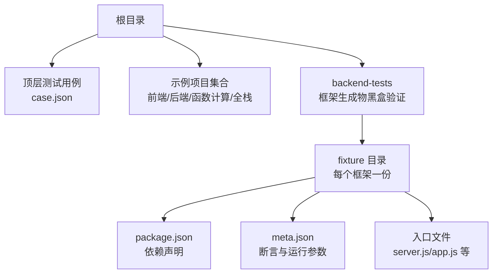
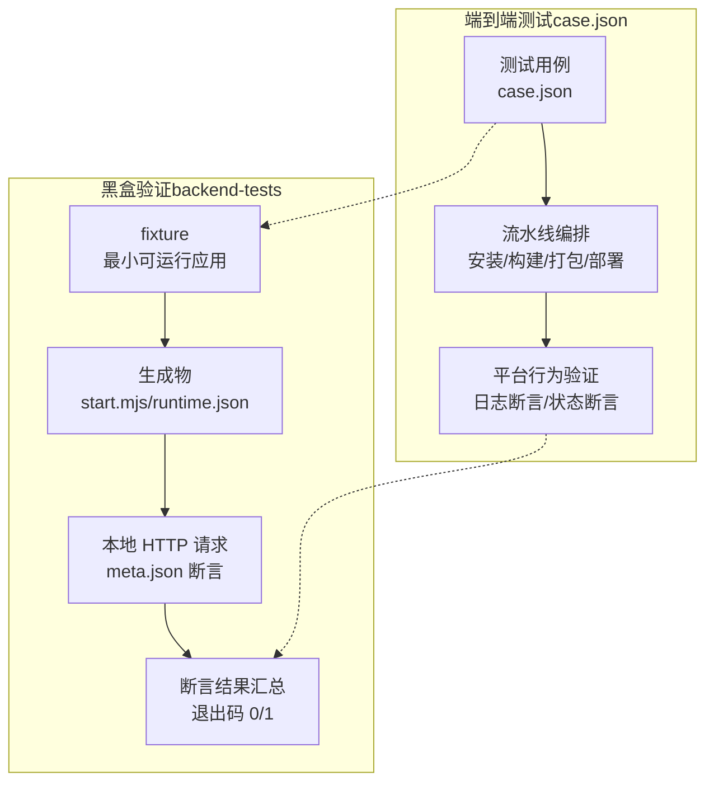
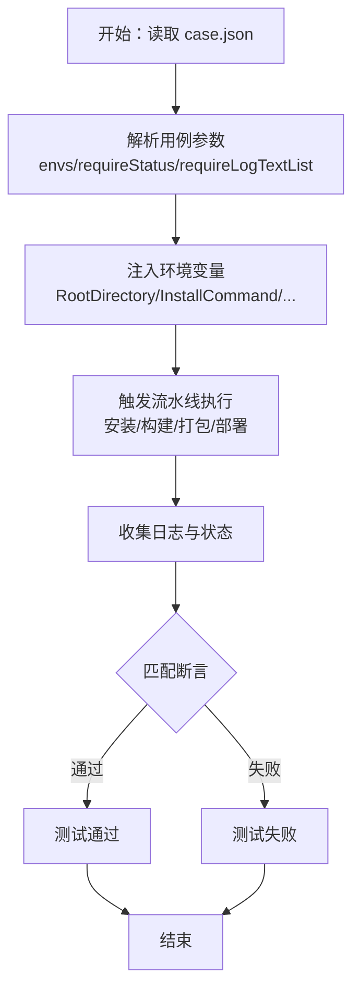
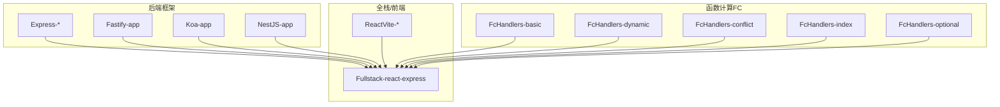
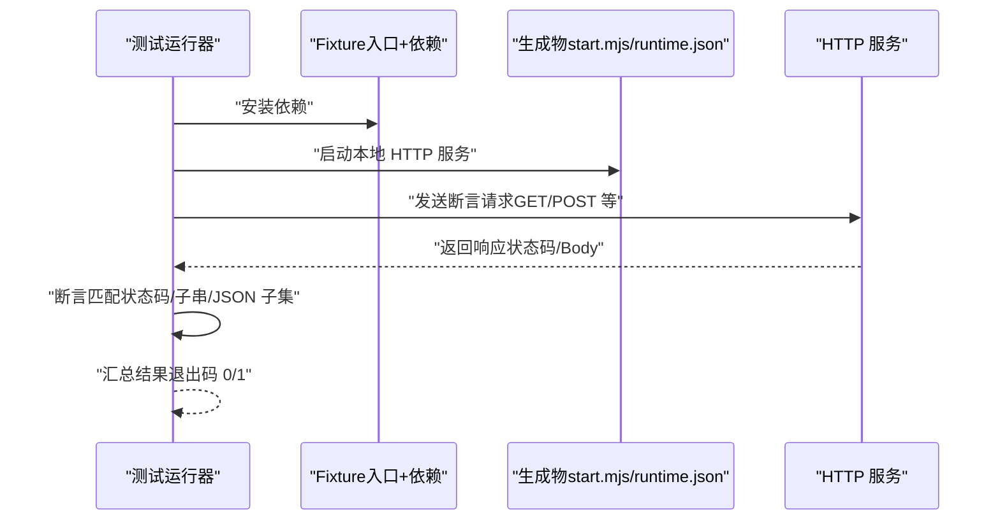
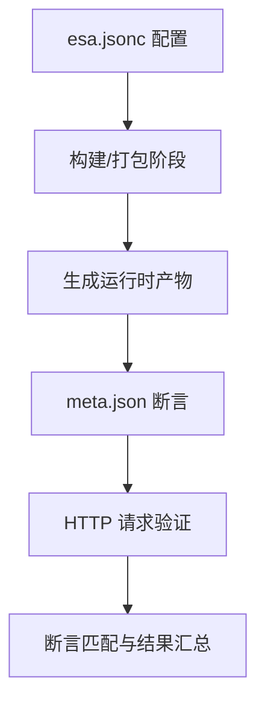
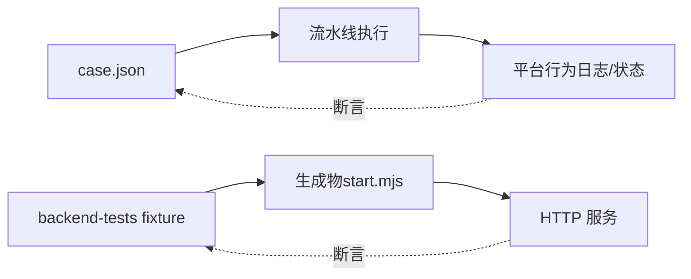

# 项目概述

<cite>
**本文引用的文件**
- [README.md](file://README.md)
- [case.json](file://case.json)
- [backend-tests/README.md](file://backend-tests/README.md)
- [Express-disambig/README.md](file://Express-disambig/README.md)
- [Fastify-app/README.md](file://Fastify-app/README.md)
- [ReactVite/package.json](file://ReactVite/package.json)
- [Express-disambig/package.json](file://Express-disambig/package.json)
- [FcHandlers-basic/package.json](file://FcHandlers-basic/package.json)
- [backend-tests/express-listen/meta.json](file://backend-tests/express-listen/meta.json)
- [backend-tests/nuxt/meta.json](file://backend-tests/nuxt/meta.json)
- [ReactVite/esa.jsonc](file://ReactVite/esa.jsonc)
- [Fullstack-react-express/esa.jsonc](file://Fullstack-react-express/esa.jsonc)
- [backend-tests/express-listen/package.json](file://backend-tests/express-listen/package.json)
- [backend-tests/fastify/meta.json](file://backend-tests/fastify/meta.json)
- [backend-tests/nuxt/package.json](file://backend-tests/nuxt/package.json)
</cite>

## 目录
1. [引言](#引言)
2. [项目结构](#项目结构)
3. [核心组件](#核心组件)
4. [架构总览](#架构总览)
5. [详细组件分析](#详细组件分析)
6. [依赖分析](#依赖分析)
7. [性能考虑](#性能考虑)
8. [故障排查指南](#故障排查指南)
9. [结论](#结论)
10. [附录](#附录)

## 引言
本项目是一个面向多语言框架、构建工具与部署平台的兼容性测试框架/测试套件，旨在系统化验证不同技术栈在统一构建与部署流程中的行为一致性与稳定性。项目通过两类测试体系协同工作：
- 顶层端到端测试：基于 case.json 的测试用例，模拟真实流水线与平台行为，覆盖安装、构建、打包、部署、配额限制等全流程。
- 框架生成物黑盒验证：backend-tests 目录下的独立 fixture，验证 framework-checker 生成的运行时产物（如 start.mjs）是否能在本地正确响应 HTTP 请求。

项目价值主张在于：
- 为开发者提供“从源码到可运行产物”的可信验证路径；
- 为运维团队提供“平台侧行为一致性”的可重复验证手段；
- 通过大量真实项目样例，覆盖主流后端框架（Express、Fastify、Koa、NestJS、Nuxt）、前端框架（React/Vite）、函数计算（FC）路由模式与边缘运行（ER）场景。

## 项目结构
项目采用按功能域划分的目录组织方式，核心目录与职责如下：
- 根目录：顶层测试用例与说明
  - README.md：使用方法与参数说明
  - case.json：端到端测试用例集合
- 示例项目
  - 多个前端/全栈/后端/函数计算样例，用于覆盖不同构建与部署场景
  - 代表性样例：ReactVite、Express-*、Fastify-app、NestJS-app、Nuxt-app、FcHandlers-*、Fullstack-react-express 等
- backend-tests：框架生成物黑盒验证
  - 每个支持的后端框架一个独立 fixture，包含最小可运行入口、依赖声明与断言元数据
  - README.md：说明设计动机、目录约定、断言规则与运行方式

**图表来源**
- [README.md:1-31](file://README.md#L1-L31)
- [case.json:1-603](file://case.json#L1-L603)
- [backend-tests/README.md:18-28](file://backend-tests/README.md#L18-L28)

**章节来源**
- [README.md:1-31](file://README.md#L1-L31)
- [backend-tests/README.md:18-28](file://backend-tests/README.md#L18-L28)

## 核心组件
- 顶层测试用例（case.json）
  - 描述测试目标、环境变量注入、期望状态与日志断言
  - 支持多种构建工具（npm、yarn、pnpm、bun、cnpm）、Node 版本与引擎约束、配额限制、部署分支与提交 ID 等参数
- 示例项目（fixtures）
  - 覆盖 Express/Koa/Hono/Fastify/NestJS/Nuxt 等后端框架
  - 覆盖 Vite/React 前端与全栈（前端 + 后端 + ER）场景
  - 覆盖 FC 函数路由（基础、动态、冲突、可选通配、index 入口）
- backend-tests（黑盒验证）
  - 每个 fixture 包含最小可运行入口与断言元数据
  - 通过 HTTP 请求验证生成物（如 start.mjs）的路由与响应行为
  - 提供运行脚本与退出码约定，便于接入 CI

**章节来源**
- [case.json:1-603](file://case.json#L1-L603)
- [backend-tests/README.md:38-84](file://backend-tests/README.md#L38-L84)

## 架构总览
项目整体分为两条并行的测试路径：
- 端到端路径：由 case.json 驱动，模拟真实流水线行为，验证安装、构建、打包、部署与平台行为的一致性
- 黑盒验证路径：由 backend-tests 驱动，验证 framework-checker 生成的运行时产物在本地能正确响应 HTTP 请求

**图表来源**
- [case.json:1-603](file://case.json#L1-L603)
- [backend-tests/README.md:3-16](file://backend-tests/README.md#L3-L16)

## 详细组件分析

### 组件A：端到端测试用例（case.json）
- 功能要点
  - 用例结构：name、envs、repoName、requireStatus、requireLogTextList、notRequireLogTextList
  - 环境变量注入：支持 $RANDOM、RootDirectory、InstallCommand、BuildCommand、AssetsDirectory、NodeVersion、ProductionBranch、CommitId、ZipSizeQuota、FileCountQuota、FileSizeQuota、SkipFunctionBuild 等
  - 日志断言：支持正则表达式匹配，结合 requireStatus 实现成功/失败判定
- 数据流
  - 解析 case.json → 注入环境变量 → 触发流水线 → 收集日志与状态 → 匹配断言 → 输出测试结果
- 关键用例类型
  - 构建工具与 Node 版本：pnpm/bun/yarn/cnpm、Node 20.x、engines 指定版本
  - 配额限制：ZipSizeQuota、FileCountQuota、FileSizeQuota
  - 部署分支与提交：ProductionBranch、CommitId
  - 产物与入口：AssetsDirectory、EREntry、SkipFunctionBuild
  - 框架识别与打包：Express/Koa/Hono/Fastify/NestJS + views、/api 路由、Nuxt meta-runtime

**图表来源**
- [case.json:1-603](file://case.json#L1-L603)

**章节来源**
- [case.json:1-603](file://case.json#L1-L603)
- [README.md:21-31](file://README.md#L21-L31)

### 组件B：示例项目（fixtures）
- Express 生态系列
  - Express-disambig：验证多候选入口时的正确选择逻辑
  - Express-listen / Express-export / Express-with-api / Express-with-views：覆盖不同风格的 Express 项目
- 后端框架系列
  - Fastify-app：最小 Fastify 应用
  - Koa-app、NestJS-app：最小 Koa/NestJS 应用
- 函数计算（FC）系列
  - FcHandlers-basic / FcHandlers-dynamic / FcHandlers-conflict / FcHandlers-index / FcHandlers-optional：覆盖基础路由、动态路径、冲突检测、index 入口与可选通配
- 全栈与前端系列
  - Fullstack-react-express：前端 + 后端 + ER 的完整场景
  - ReactVite-*：不同配置的 Vite/React 项目，覆盖 esa.jsonc、引擎版本、环境变量读取、跳过错误 ER 等

**图表来源**
- [Express-disambig/README.md:1-11](file://Express-disambig/README.md#L1-L11)
- [Fastify-app/README.md:1-6](file://Fastify-app/README.md#L1-L6)
- [backend-tests/README.md:30-36](file://backend-tests/README.md#L30-L36)

**章节来源**
- [Express-disambig/README.md:1-11](file://Express-disambig/README.md#L1-L11)
- [Fastify-app/README.md:1-6](file://Fastify-app/README.md#L1-L6)
- [backend-tests/README.md:30-36](file://backend-tests/README.md#L30-L36)

### 组件C：黑盒验证（backend-tests）
- 设计目标
  - 验证 framework-checker 生成的运行时产物（如 start.mjs）在本地能正确响应 HTTP 请求
  - 与顶层 case.json 完全解耦，聚焦“生成物正确性”
- 目录约定与元数据
  - fixture 命名：framework-slug + flavor
  - package.json：声明目标框架依赖
  - meta.json：name、framework、mode、port、assertions、entry、warmup/shutdown 超时、readySignal、spawnCommand、includeFiles/includeDirs 等
- 断言规则
  - expectedStatus 严格相等
  - bodyContains 子串匹配
  - bodyJsonSubset JSON 对象包含关系匹配
  - 任一断言失败即 fixture 失败
- 运行方式
  - 批量安装依赖后，通过 blackBox 入口运行，支持单 fixture 运行与接入主流程

**图表来源**
- [backend-tests/README.md:94-110](file://backend-tests/README.md#L94-L110)
- [backend-tests/README.md:38-84](file://backend-tests/README.md#L38-L84)

**章节来源**
- [backend-tests/README.md:3-16](file://backend-tests/README.md#L3-L16)
- [backend-tests/README.md:38-84](file://backend-tests/README.md#L38-L84)
- [backend-tests/README.md:94-110](file://backend-tests/README.md#L94-L110)

### 组件D：配置与元数据（esa.jsonc 与 meta.json）
- esa.jsonc（示例项目）
  - installCommand/buildCommand/assets.directory/notFoundStrategy 等
  - 全栈场景下还包含 entry、edgeFunctionFirst 等 ER 相关配置
- meta.json（黑盒验证）
  - assertions 中的 path/method/headers/body/expectedStatus/bodyContains/bodyJsonSubset
  - mode/port/entry/warmupTimeoutMs/shutdownTimeoutMs/readySignal/spawnCommand/includeFiles/includeDirs

**图表来源**
- [ReactVite/esa.jsonc:1-10](file://ReactVite/esa.jsonc#L1-L10)
- [Fullstack-react-express/esa.jsonc:1-20](file://Fullstack-react-express/esa.jsonc#L1-L20)
- [backend-tests/express-listen/meta.json:8-35](file://backend-tests/express-listen/meta.json#L8-L35)

**章节来源**
- [ReactVite/esa.jsonc:1-10](file://ReactVite/esa.jsonc#L1-L10)
- [Fullstack-react-express/esa.jsonc:1-20](file://Fullstack-react-express/esa.jsonc#L1-L20)
- [backend-tests/express-listen/meta.json:8-35](file://backend-tests/express-listen/meta.json#L8-L35)

## 依赖分析
- 组件内聚与耦合
  - 顶层 case.json 与 backend-tests 彼此解耦，分别负责端到端与生成物正确性验证
  - 示例项目与黑盒验证的 fixture 一一对应，形成稳定的对照关系
- 外部依赖与集成点
  - 构建工具：npm/yarn/pnpm/bun/cnpm
  - 运行时：Node.js（支持 engines 与 NodeVersion）
  - 平台能力：FC 平台、CDN 分发、ER 边缘运行
- 潜在循环依赖
  - 项目采用单向数据流：case.json → 流水线 → 平台行为；fixture → 生成物 → HTTP 请求；二者互不依赖

**图表来源**
- [case.json:1-603](file://case.json#L1-L603)
- [backend-tests/README.md:3-16](file://backend-tests/README.md#L3-L16)

**章节来源**
- [case.json:1-603](file://case.json#L1-L603)
- [backend-tests/README.md:3-16](file://backend-tests/README.md#L3-L16)

## 性能考虑
- 顶层端到端测试
  - 单用例耗时受流水线与平台行为影响，通常为分钟级
  - 建议在 CI 中按需裁剪用例集，优先覆盖关键路径
- 黑盒验证
  - 单 fixture 耗时秒级，适合高频回归与快速反馈
  - 建议在本地或 CI 的预检阶段优先运行，快速发现生成物问题

## 故障排查指南
- 端到端测试失败
  - 检查 requireStatus 与 requireLogTextList 是否与实际日志一致
  - 核对环境变量注入（如 RootDirectory、InstallCommand、NodeVersion、ProductionBranch、CommitId、配额参数）
  - 关注 notRequireLogTextList 以排除意外日志干扰
- 黑盒验证失败
  - 确认 fixture 的 meta.json 断言是否合理（expectedStatus/bodyContains/bodyJsonSubset）
  - 检查 warmupTimeoutMs/shutdownTimeoutMs 是否过短
  - 若为 spawn 模式，确认 spawnCommand 与 $PORT 占位符替换
  - 对于需要动态加载插件的框架，使用 includeDirs/includeFiles 补充 nft 文件列表
- 退出码
  - 0：所有非跳过的 fixture 断言通过
  - 1：至少一个 fixture 任一断言失败/启动失败/framework-checker 报错

**章节来源**
- [backend-tests/README.md:86-116](file://backend-tests/README.md#L86-L116)

## 结论
本项目通过“端到端测试 + 生成物黑盒验证”的双轨测试体系，系统性地覆盖了多语言框架、构建工具与部署平台的兼容性验证场景。其价值在于：
- 为开发者提供从源码到可运行产物的可信验证路径
- 为运维团队提供平台行为一致性与生成物正确性的可重复验证手段
- 通过丰富的示例项目与断言规则，帮助快速定位问题并持续改进

## 附录
- 示例项目清单（节选）
  - Express 生态：Express-disambig、Express-listen、Express-export、Express-with-api、Express-with-views
  - 后端框架：Fastify-app、Koa-app、NestJS-app
  - 函数计算：FcHandlers-basic、FcHandlers-dynamic、FcHandlers-conflict、FcHandlers-index、FcHandlers-optional
  - 全栈/前端：Fullstack-react-express、ReactVite-* 系列
- 黑盒验证清单（节选）
  - Express：express-listen
  - Fastify：fastify
  - Nuxt：nuxt

**章节来源**
- [Express-disambig/README.md:1-11](file://Express-disambig/README.md#L1-L11)
- [Fastify-app/README.md:1-6](file://Fastify-app/README.md#L1-L6)
- [backend-tests/README.md:30-36](file://backend-tests/README.md#L30-L36)
- [backend-tests/express-listen/meta.json:1-36](file://backend-tests/express-listen/meta.json#L1-L36)
- [backend-tests/fastify/meta.json:1-15](file://backend-tests/fastify/meta.json#L1-L15)
- [backend-tests/nuxt/meta.json:1-14](file://backend-tests/nuxt/meta.json#L1-L14)